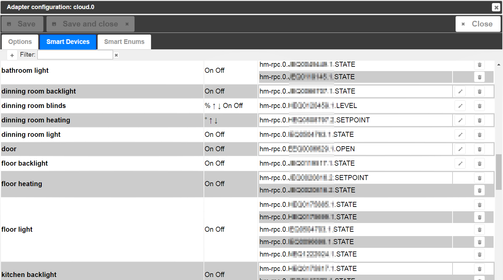

# IoBroker облачный адаптер
Этот адаптер позволяет подключаться из Интернета через облако ioBroker к локальной установке ioBroker.

## Настройки
### APP-ключ
Для использования облачного адаптера вы должны сначала получить ключ APP на [https://iobroker.net](https://iobroker.net).

Это ключ приложения, который пользователь может получить на сайте [https://iobroker.net](https://iobroker.net). Пожалуйста, получите ключ и введите его здесь.


### Экземпляр
Все запросы от облачного адаптера будут перенаправлены в какой-либо WEB-экземпляр. Пользователь должен указать здесь экземпляр WEB, который будет показан пользователю при входе на сайт https://iobroker.net.

### Разрешить самозаверяющие сертификаты
Если вы используете стандартное облако iobroker.net, вы можете отключить его. Эта опция важна, только если используется собственное облако.

### Язык
Если вы выберете язык по умолчанию, интеллектуальные имена устройств и перечислений не будут переведены. Если в каком-либо языке указано, все известные имена будут переведены на этот язык.
Это сделано для быстрого переключения между многими языками в демонстрационных целях.

### Сначала поместите функцию в имена
Измените порядок функций и ролей в собственных именах:

- если false: «Функция комнаты», например, "Гостиная диммер"
- если истина: «Функциональная комната», например, "Диммер гостиная"

### Объединить слова с
Вы можете определить слово, которое будет помещено между функцией и комнатой. Например. «в» и из «Диммер гостиной» будет «Диммер в гостиной».

Но делать это не рекомендуется, потому что механизм распознавания должен проанализировать еще одно слово, и это может привести к недоразумениям.

### ВЫКЛ уровень для переключателей
Некоторые группы состоят из смешанных устройств: диммеры и выключатели. Управлять ими можно с помощью команд «ВКЛ» и «ВЫКЛ» и с процентами.
Если команда «Установить на 30%» и * ВЫКЛ. Уровень «30%», то переключатели будут включены. По команде «Установить на 25%» все переключатели будут выключены.

Кроме того, если команда «ВЫКЛ», адаптер запоминает текущий уровень диммера, если фактическое значение больше или равно «30%».
Позже, когда придет новая команда «ON», адаптер переключит диммер не на 100%, а на уровень в памяти.

Пример:

- Предположим, что *уровень ВЫКЛ* составляет 30%.
- Виртуальное устройство «Свет» имеет два физических устройства: *переключатель* и *диммер*
- Команда: «установить свет на 40%». Адаптер запомнит это значение для *dimmer* установит его для "dimmer" и включит переключатель *ON*
- Команда: «выключить свет». Адаптер установит *диммер* на 0% и выключит *переключатель*
- Команда: «Включить свет». *диммер* => 40%, *переключатель* => ВКЛ.
- Команда: «установить свет на 20%». *диммер* => 20%, *переключатель* => ВЫКЛ. Значение для диммера не будет запомнено, потому что оно ниже *OFF level*
- Команда: «Включить свет». *диммер* => 40%, *переключатель* => ВКЛ.

### ON
Вы можете выбрать поведение команды ON придет для состояния номера. Можно выбрать конкретное значение или использовать последнее ненулевое значение.

### Написать ответ на
Для каждой команды будет сгенерирован текстовый ответ. Здесь вы можете определить Идентификатор объекта, в который должен быть записан этот текст. Например. *Sayit.0.tts.text*

### Цвета
Только сейчас только английский alexa поддерживает управление цветом.
Канал должен иметь 4 состояния со следующими ролями:

- level.color.saturation (требуется для обнаружения канала),
- level.color.hue,
- level.dimmer,
- переключатель (опционально)

```
Alexa, set the "device name" to "color"
Alexa, turn the light fuschia
Alexa, set the bedroom light to red
Alexa, change the kitchen to the color chocolate
```

### Замок
Чтобы иметь возможность блокировать блокировки, состояние должно иметь роль «switch.lock» и иметь native.LOCK_VALUE для определения состояния блокировки.

```
Alexa, is "lock name" locked/unlocked
Alexa, lock the "lock name"
```

## Как будут генерироваться имена
Адаптер пытается создать виртуальные устройства для управления умным домом (например, Amazon Alexa или Google Home).

Для этого есть два важных перечисления: комнаты и функции.

Комнаты похожи: гостиная, ванная комната, спальня.
Функции как: свет, слепой, отопление.

Следующие условия должны быть выполнены, чтобы получить состояние в автоматически сгенерированном списке:

- состояние должно быть в некотором «функциональном» перечислении.
- состояние должно иметь роль («состояние», «переключатель» или «уровень. *», например, level.dimmer), если оно не включено непосредственно в «функции».

Может быть так, что канал находится в «функциях», но сам по себе нет.

- состояние должно быть доступно для записи: common.write = true
- государственный диммер должен иметь общий тип в качестве «числа»
- состояние нагрева должно иметь общий блок в виде «°C», «°F» или «° K» и общий тип в виде «числа»

Если состояние находится только в «функциях», а не в «комнате», будет использоваться название состояния.

Имена состояний будут генерироваться из функции и комнаты. Например. все *огни* в *гостиной* будут собраны в виртуальном устройстве *свет в гостиной* Пользователь не может изменить это имя, потому что оно генерируется автоматически.
Но если имя перечисления изменится, это имя тоже будет изменено. (например, функция «свет» изменилась на «свет», поэтому *свет в гостиной* будет изменен на *свет в гостиной*

Все правила будут игнорироваться, если состояние имеет общее.smartName. В этом случае будет использоваться только умное имя.

если *common.smartName* равно **false** состояние или перечисление не будут включены в генерацию списка.

Диалог конфигурации позволяет удобно удалять и добавлять отдельные состояния в виртуальные группы или как одно устройство.


Если группа имеет только одно состояние, она может быть переименована, так как для этого будет использоваться smartName состояния.
Если группа имеет более одного состояния, группа должна быть переименована через имена перечисления.

Для создания собственных групп пользователь может установить адаптер «сцены» или создать «скрипт» в адаптере Javascript.

### Заменяет
Вы можете указать строки, которые могут быть автоматически заменены в именах устройств. Например, если вы установите заменить на:

```.STATE,.LEVEL```, so all ".STATE" and ".LEVEL" will be deleted from names. Be careful with spaces.
If you will set ```.STATE, .LEVEL```, so ".STATE" and " .LEVEL" will be replaced and not ".LEVEL".

## Helper states
- **smart.lastObjectID**: This state will be set if only one device was controlled by home skill (alexa, google home).
- **smart.lastFunction**: Function name (if exists) for which last command was executed.
- **smart.lastRoom**:     Room name (if exists) for which last command was executed.
- **smart.lastCommand**:  Last executed command. Command can be: true(ON), false(OFF), number(%), -X(decrease at x), +X(increase at X)
- **smart.lastResponse**: Textual response on command. It can be sent to some text2speech (sayit) engine.

## IFTTT
[instructions](doc/ifttt.md)

## Services
There is a possibility to send messages to cloud adapter.
If you call ```[POST]https://iobroker.net/service/custom_<NAME>/<user-app-key>``` und value as payload.

```

curl --data "myString" https://iobroker.net/service/custom_test/ <user-app-key>

```

If you set in the settings the field "White list for services" the name *custom_test*, and call with "custom_test" as the service name, the state **cloud.0.services.custom_test** will be set to *myString*.

You may write "*" in white list and all services will be allowed.

From version 2.0.5 you can use GET request in form ```[GET]https://iobroker.net/service/custom_<NAME>/<user-app-key>/<data>``` to place the **\<data\>** into **cloud.0.services.custom_\<NAME\>**.

Here you can find instructions how to use it with [tasker](doc/tasker.md).

IFTTT service is allowed only if IFTTT key is set.

Reserved names are "ifttt", "text2command", "simpleApi", "swagger". These must be used without the ```"custom_"``` prefix.

### text2command
You may write "text2command" in white list, you can send POST request to ```https://iobroker.net/service/text2command/<user-app-key>``` to write data into *text2command.X.text* variable.

"X" can be defined in settings by the "Use text2command instance" option.

### simpleApi
*to do*

## Changelog
### 2.8.0 (2019-11-13)
* (bluefox) Connects your ioBroker server to the ioBroker cloud

### 2.7.1 (2018-09-07)
* (Apollon77) Enhancements for Custom Skill

### 2.7.0 (2018-06-18)
* (bluefox) Multilingual names were corrected

### 2.6.2 (2018-06-18)
* (Apollon77/AlCalzone/Bluefox) Several fixes

### 2.6.1 (2018-05-04)
* (bluefox) Support of custom alexa skill

### 2.5.0 (2018-03-17)
* (bluefox) Added actions on commands from server: wait, stop, redirect; to control load of the server by start.

### 2.4.7 (2018-02-09)
* (bluefox) Small changes in the configuration dialog
* (bluefox) add information about the expiring of remote access

### 2.4.6 (2018-02-09)
* (bluefox) Adding of new devices is fixed

### 2.4.5 (2018-01-29)
* (bluefox) Changes for Admin 3

### 2.4.4 (2018-01-20)
* (bluefox) The errors by controlling of temperature are caught now

### 2.4.2 (2018-01-20)
* (bluefox) Do not subscribe all objects

### 2.2.0 (2017-12-22)
* (bluefox) Better update of the devices in configuration dialog

### 2.1.1 (2017-12-11)
* (bluefox) Add settings for the ping timeout
* (grimneko) corrected some spelling mistakes
* (grimneko) update readme for IFTTT

### 2.1.0 (2017-12-06)
* (bluefox) Allow to disable alexa service by state

### 2.0.8 (2017-11-28)
* (bluefox / Philipp Beckers) Translations

### 2.0.7 (2017-10-29)
* (bluefox) Changes for socket-io

### 2.0.6 (2017-10-26)
* (bluefox) Fix small error in configuration
* (bluefox) Send uuid to cloud for authentication

### 2.0.5 (2017-09-26)
* (bluefox) The small custom service reaction improvement

### 2.0.4 (2017-09-12)
* (bluefox) Allow access to admin via iobroker.pro
* (c-klinger) Add settings for the connection timeout

### 1.0.8 (2017-07-13)
* (bluefox) Allow control light colors

### 1.0.7 (2017-06-26)
* (bluefox) AI deactivated
* (bluefox) change ping interval from 10 to 30 seconds
* (bluefox) fix double auth on connect

### 1.0.3 (2017-05-23)
* (bluefox) Rename some german words

### 1.0.2 (2017-05-23)
* (bluefox) Support of IFTTT

### 1.0.0 (2017-05-22)
* (bluefox) Catch an error if the invalid smart name set

### 0.8.2 (2017-04-24)
* (bluefox) controls of colors (english only)
* (bluefox) request temperature (target temperature and sensor temperature, english only)
* (bluefox) support of double names

### 0.7.1 (2017-04-05)
* (bluefox) Fixed reconnection

### 0.7.0 (2017-04-01)
* (bluefox) Try to fix reconnection

### 0.6.12 (2017-03-26)
* (bluefox) Try to fix error with names

### 0.6.11 (2017-03-20)
* (bluefox) Fixed scrollbar in configuration

### 0.6.10 (2017-03-03)
* (bluefox) Add tooltips in config
* (bluefox) Add workaround for alexa reconnection

### 0.6.9 (2017-02-17)
* (bluefox) Allow to use more than one smart name

### 0.6.8 (2017-02-16)
* (bluefox) Fix deactivation of enums

### 0.6.7 (2017-02-14)
* (bluefox) allow buttons to be controller with alexa

### 0.6.5 (2017-02-06)
* (bluefox) print warnings for invalid states

### 0.6.3 (2017-01-28)
* (bluefox) fix enum names
* (bluefox) add helper states and response text

### 0.6.2 (2017-01-25)
* (bluefox) add option "Place function in names first"

### 0.6.1 (2017-01-24)
* (bluefox) fix reconnect
* (bluefox) change smartName structure

### 0.5.0 (2017-01-20)
* (bluefox) add value by ON

### 0.4.2 (2017-01-12)
* (bluefox) add daily restart

### 0.4.1 (2017-01-06)
* (bluefox) use devices with ":" symbols in the names
* (bluefox) add debug outputs

### 0.4.0 (2017-01-06)
* (bluefox) Support of english language
* (bluefox) Use rooms of channel and not only states

### 0.3.3 (2017-01-02)
* (bluefox) Fix error with smartNames
* (bluefox) Take the superset of actions for group and not the last one
* (bluefox) if group has switches and dimmers, turn devices OFF if the percent level is less than 30%
* (bluefox) Remember ON level for dimmers to switch it later ON

### 0.3.0 (2016-12-29)
* (bluefox) Implement Heating profile for Alexa

### 0.2.0 (2016-12-13)
* (bluefox) support of amazon alexa

### 0.1.2 (2016-11-17)
* (bluefox) update socket.io

### 0.1.1 (2016-10-23)
* (bluefox) update some packages

### 0.1.0 (2016-08-01)
* (bluefox) support of read/write files

## License
The MIT License (MIT)

Copyright (c) 2016-2019 bluefox <dogafox@gmail.com>

Permission is hereby granted, free of charge, to any person obtaining a copy
of this software and associated documentation files (the "Software"), to deal
in the Software without restriction, including without limitation the rights
to use, copy, modify, merge, publish, distribute, sublicense, and/or sell
copies of the Software, and to permit persons to whom the Software is
furnished to do so, subject to the following conditions:

The above copyright notice and this permission notice shall be included in all
copies or substantial portions of the Software.

THE SOFTWARE IS PROVIDED "AS IS", WITHOUT WARRANTY OF ANY KIND, EXPRESS OR
IMPLIED, INCLUDING BUT NOT LIMITED TO THE WARRANTIES OF MERCHANTABILITY,
FITNESS FOR A PARTICULAR PURPOSE AND NONINFRINGEMENT. IN NO EVENT SHALL THE
AUTHORS OR COPYRIGHT HOLDERS BE LIABLE FOR ANY CLAIM, DAMAGES OR OTHER
LIABILITY, WHETHER IN AN ACTION OF CONTRACT, TORT OR OTHERWISE, ARISING FROM,
OUT OF OR IN CONNECTION WITH THE SOFTWARE OR THE USE OR OTHER DEALINGS IN THE
SOFTWARE.