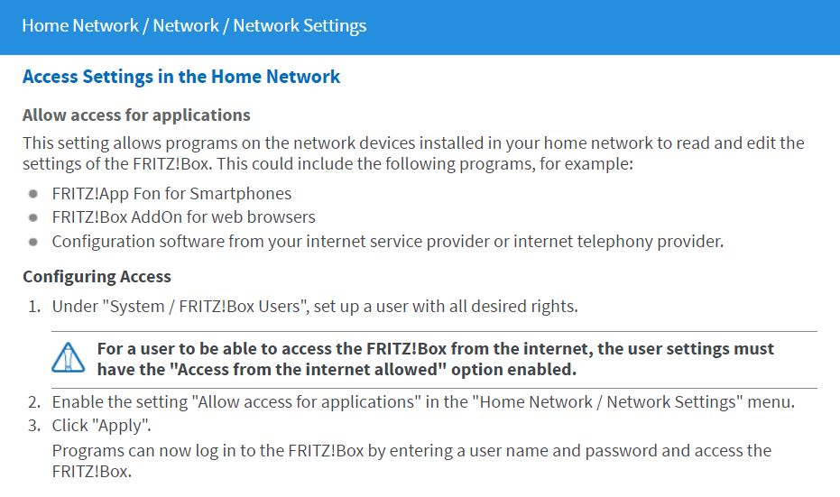

<h1> ioBroker.fb-checkpresence </h1>

## Fb-checkpresence адаптер для ioBroker
Адаптер проверяет присутствие членов семьи через fritzbox.
Вы должны указать имя члена семьи и mac-адрес (или ip-адрес) используемого устройства.
Комментарий не является обязательным, и вы можете включить или отключить члена семьи.
Назначение данных основано на имени члена.

### Адаптер предварительные условия
Для правильной работы необходимо установить адаптер истории. Вы можете выбрать один из следующих адаптеров:

* История
* SQL
* InfluxDB

## Используемое устройство
Для этого адаптера используется AVM Fritzbox. Здесь вы можете найти информацию о Fritzbox https://avm.de/produkte/fritzbox/.
Службы fritzbox используются по протоколу TR-064.

### Fritzbox условия
Используемый интерфейс TR-064 от fritzbox описан здесь: https://avm.de/service/schnittstellen/.
Используются следующие функции TR-064:

* GetSpecificHostEntry
* X_AVM-DE_GetSpecificHostEntryByIP (поддерживается с 2016-05-18) -> используется для чтения статуса участника через IP-адрес
* GetHostNumberOfEntries
* X_AVM-DE_GetHostListPath (поддержка с 2017-01-09) -> используется для конфигурации элемента
* GetSecurityPort
* Получить информацию

По умолчанию интерфейс TR-064 не активирован. Однако это можно легко изменить через веб-интерфейс FritzBox. Для этого войдите в свой FritzBox и убедитесь, что экспертный вид активирован. Тогда вы найдете ниже «Домашняя сеть» Обзор домашней сети »Настройки сети» пункт «Разрешить доступ для приложений». Там вы должны активировать флажок и затем перезапустить FritzBox один раз. 

## Диалог конфигурации
### Fritzbox IP-адрес, пользователь и пароль
Конфигурация ip-адреса, пользователя и пароля необходима для получения данных устройства из fritzbox.
Пароль зашифрован и не был сохранен в виде открытого текста.

### Интервал
Интервал можно настроить от 1 до 59 минут. Обычно значение от 1 до 5 минут является оптимальным интервалом для чтения данных fritzbox.

### Адаптер истории
По истории адаптера рассчитываются некоторые значения. Вы можете выбрать, если для этих расчетов используется история, адаптер sql или effxdb. Адаптер истории должен быть установлен предварительно.

### Формат даты
Параметры маски формата даты описаны на этой веб-странице: https://www.npmjs.com/package/dateformat.
Маска форматирования используется для форматирования объектов таблиц html и json.

### Настройки члена семьи
Для настроенного члена семьи вы должны ввести Имя, MAC- или IP-адрес, комментарий и, если член включен для расчета. Для каждого члена адаптер создает объекты данных и проверяет, присутствует ли член или отсутствует.

### Настройки белого списка
В белый список можно вставить любое известное устройство. Любые неизвестные устройства перечислены в черном списке объекта.
Если вы установите флажок в заголовке таблицы, все устройства будут выбраны.

## Особенности
### Проверка поддержки AVM
Функция проверяет доступность используемых функций fritzbox. Доступность регистрируется как информация.

### Получить гостей, черный список
В этой функции проверяется, зарегистрирован ли какой-либо пользователь как гость. Также проверяется, нет ли какого-либо устройства в белом списке.
Эти устройства добавлены в черный список.

### Активируйся
Для каждого члена семьи вычисляются и сохраняются в объекте-члене данные о присутствии, датах прихода и отправления и нескольких других данных.

### Номер хоста, активные устройства
Количество устройств и количество активных извлекаются из fritzbox.

## Объекты
### Присутствие объектаВсе
Если присутствуют все члены семьи, тогда объект верный.

### Наличие объекта
Если один из членов семьи не присутствует, то объект является истинным.

### Объектные устройства
Это все перечисленные устройства в fritzbox

### Объект activeDevices
Это количество всех активных устройств в fritzbox.

### Объект html, json
Эти объекты являются таблицами (json и html) с информацией о приходе и переходе всех членов семьи.

### Информация об объекте
Ниже приведена информация о последнем обновлении и состоянии подключения адаптера.

### Объект гость
Ниже приведена информация о количестве активных гостей и табличных объектов с информацией об устройстве.

### Черный список объектов
Ниже приведена информация о количестве неизвестных устройств и табличных объектов с информацией о неизвестном устройстве.

### Объект member.present
Здесь вы найдете информацию о присутствии участника в текущий день и о том, как долго участник имеет статус «истина» с момента последнего изменения.

### Объект member.absent
Здесь вы найдете информацию об отсутствии участника в текущий день и о том, как долго участник имеет статус ложного с момента последнего изменения.

### Объект member.comming, member.going
Здесь вы найдете информацию, когда член семьи прибывает или покидает дом.

### Объект member.history, member.historyHtml
Здесь вы найдете информацию об истории текущего дня.

## Changelog

### 1.0.2 (2020-05-24)
* (afuerhoff) error handling optimized
* (afuerhoff) external ip implemented
* (afuerhoff) check if mac or ip are listed in fritzbox

### 1.0.1 (2020-04-12)
* (afuerhoff) error handling optimized
* (afuerhoff) history configuration optimized
* (afuerhoff) re-synchronisation of fb-devices implemented

### 1.0.0 (2020-03-30)
* (afuerhoff) Configuration dialog optimized
* (afuerhoff) fbdevice speed added
* (afuerhoff) present-, absentMembers inserted
* (afuerhoff) Ip address handling optimized
* (afuerhoff) iobroker functions changed to async
* (afuerhoff) instance.0 dependency fixed
* (afuerhoff) depricated request changed to axios

### 0.3.0
* (afuerhoff) Documentation optimized
* (afuerhoff) LastVal error fixed
* (afuerhoff) Json table failure fixed
* (afuerhoff) Connection type added
* (afuerhoff) Ipaddress default value changed
* (afuerhoff) New feature fb-devices added
* (afuerhoff) Error messages optimized
* (afuerhoff) Dateformat default value changed
* (afuerhoff) Debug info added
* (afuerhoff) GetDeviceInfo failure fixed
* (afuerhoff) Update testing

### 0.2.2
* (afuerhoff) outdated packages updated, documentation changed, 
  history dependency removed, onstate/objectChange removed, scheduler library removed,
  two fixes from publish review

### 0.2.1
* (afuerhoff) getGuests issue resolved, lastVal function and debug information optimized   

### 0.2.0
* (afuerhoff) debug and error information optimized, crypto dependency removed, service check and blacklist added   

### 0.1.0
* (afuerhoff) Influxdb added, debug information added

### 0.0.7
* (afuerhoff) Fix bug invalid date. Add debug information.

### 0.0.6
* (afuerhoff) bug in json and html table resolved

### 0.0.5
* (afuerhoff) configuration optimized

### 0.0.4
* (afuerhoff) calculation error resolved

### 0.0.3
* (afuerhoff) guest feature added

### 0.0.2
* (afuerhoff) optimized features

### 0.0.1
* (afuerhoff) initial release

## License
MIT License

Copyright (c) 2019-2020 Achim Fürhoff <achim.fuerhoff@outlook.de>

Permission is hereby granted, free of charge, to any person obtaining a copy
of this software and associated documentation files (the "Software"), to deal
in the Software without restriction, including without limitation the rights
to use, copy, modify, merge, publish, distribute, sublicense, and/or sell
copies of the Software, and to permit persons to whom the Software is
furnished to do so, subject to the following conditions:

The above copyright notice and this permission notice shall be included in all
copies or substantial portions of the Software.

THE SOFTWARE IS PROVIDED "AS IS", WITHOUT WARRANTY OF ANY KIND, EXPRESS OR
IMPLIED, INCLUDING BUT NOT LIMITED TO THE WARRANTIES OF MERCHANTABILITY,
FITNESS FOR A PARTICULAR PURPOSE AND NONINFRINGEMENT. IN NO EVENT SHALL THE
AUTHORS OR COPYRIGHT HOLDERS BE LIABLE FOR ANY CLAIM, DAMAGES OR OTHER
LIABILITY, WHETHER IN AN ACTION OF CONTRACT, TORT OR OTHERWISE, ARISING FROM,
OUT OF OR IN CONNECTION WITH THE SOFTWARE OR THE USE OR OTHER DEALINGS IN THE
SOFTWARE.