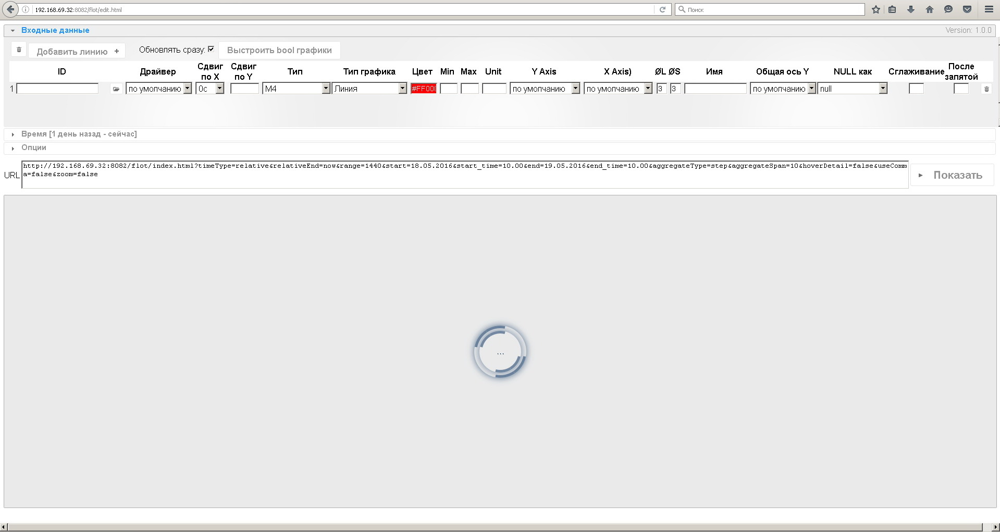
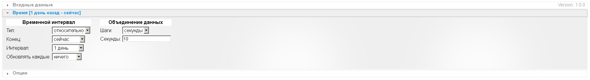
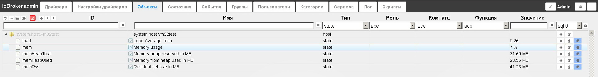
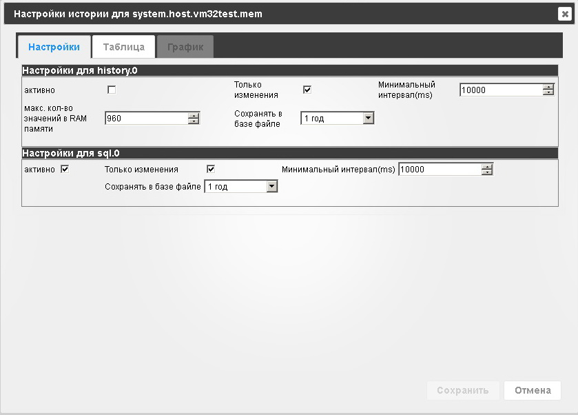

# Flot - Графики

## Описание

[Flot](http://www.flotcharts.org/) является JavaScript библиотекой JQuery для построения графиков, с акцентом на 
простом использовании, привлекательном внешнем виде и интерактивных возможностях. Драйвер ioBroker с одноименным 
названием позволяет строить графики архивных данных (для доступа к историческим данным в системе должен быть установлен 
драйвер [History](http://www.iobroker.net/?page_id=3636&lang=ru), [SQL History](http://www.iobroker.net/?page_id=4044&lang=ru) или 
History with InfluxDB). Он может быть использован как отдельное приложение для одновременного отображения нескольких графиков 
для анализа различных состояний системы во времени.

## Установка

Установка осуществляется на вкладке **Драйвера** странички [администрирования](http://www.iobroker.net/?page_id=3800&lang=ru) системы.
В группе драйверов **Визуализация** находим строчку с названием **Flot Charts** и нажимаем кнопку со значком плюса в этой строке справа. 
На экране появится всплывающее окно установки драйвера, в конце установки оно автоматически закроется. Если все прошло удачно, 
на вкладке **Настройка драйверов** появится строка **flot.0** с установленным экземпляром драйвера. Обращаем ваше внимание на то, 
что драйвер **Flot** должен иметь доступ к историческим данным (БД), поэтому в системе должен быть установлен и настроен как минимум 
один драйвер из группы **Хранилище** ([History](http://www.iobroker.net/?page_id=3636&lang=ru), 
[SQL History](http://www.iobroker.net/?page_id=4044&lang=ru) или History with InfluxDB). 

Так же для работы flot необходим драйвер web, но он устанавливается обычно автоматически. 


## Настройка

Определенных настроек драйвер не требует. Он работает как отдельный WEB-сервис на порту драйвера web системы ioBroker (обычно 8082). 
Чтобы начать работу с драйвером, необходимо нажать на кнопку **Открыть приложение** на вкладке **Настройка драйверов** в строчке выбранного экземпляра.

## Использование

Окно графиков Flot можно открыть кнопкой **Открыть приложение** или в строке браузер набрать адрес: `http://IP-адрес:8082/flot/edit.html` 

Окно можно условно поделить на три зоны (сверху вниз): 
Настройки, URL странички для вывода графика и предварительный просмотр графиков.



Для того, что бы отобразить график в другой программе или просто вызвать ещё раз в браузере, надо скопировать сгенерированный URL и 
по нему график построится снова с заданными параметрами. Если необходимо изменить настройки графика, вставьте получившийся URL в 
строку пути браузера, заменив ```index.html``` на ```edit.html```: 

```http://IP:8082/flot/**index**.html?params.... => http://IP:8082/flot/**edit**.html?params....```

## Входные данные

Настройка исходных данных для построения графика/графиков. 


*   Можно добавить/удалить ряд данных,
*   Галочка **Обновлять сразу** позволяет применять настройку сразу после её изменения (если не установлена, ниже будет кнопка **Обновить**, которая обновляет превью графиков в соответствии с настройками),
*   **ID** - необходимо с помощью кнопки выбрать переменную для построения временного ряда (графика), в окне будут только те переменные, для которых настроено хранение истории,
*   **Драйвер** - можно выбрать из списка экземпляр драйвера, который привязан к конкретной БД, соответственно данные для построения будут запрошены из этой БД,
*   **Сдвиг по оси Х** (Сдвиг по оси Y) - можно указать промежуток времени, на который необходимо сдвинуть график вправо (глубже в архиве) или абсолютное значение для сдвига по оси Y,
*   **Тип** - режим вывода точек на график (в группе время есть настройка **Объединение данных** (по времени или количеству) - берется отрезок этих данных и отрисовывается только максимум, минимум, среднее, все значения или специальный алгоритм MinMax),
*   **Тип графика** - режим отрисовки (Линия, Область, Линия с точками и пр.),
*   **Min**, **Max**, **Unit** - интервал по оси Y (значений) и единицы измерений, если не указано, то интервал выбирается автоматически, юниты берутся из системы ioBroker,
*   **Y Axis, X Axis** - положение осей X и Y,
*   **ØL**, **ØS** - толщина линий и размер тени графика,
*   **Имя** - значение для отображения названия временного ряда в легенде (если она включена), если не указано, то берется значение из ioBroker (имя объекта),
*   **Общая ось Y** - объединение оси Y (значений) для двух и более временных рядов,
*   **NULL как** - интерпретация пустых записей значения переменной (не использовать, использовать значение 0 или брать предыдущее),
*   Настройки **Сглаживание** и **После запятой** - сглаживание пиков графика и округление значений временного ряда.

## Время

Настройка временного интервала отображения данных графика. 



*   Временной интервал **тип** - относительный (начальная точка привязана к текущему времени, интервал, и возможность обновлять автоматически) и постоянный (точное указание временных рамок),
*   Объединение данных - объединять значения по времени (в секундах) или определенное количество.

## Опции

Здесь можно настроить внешний вид графиков, сетки, осей и легенды и подписи. Все настройки интуитивно-понятны. 


Для примера можно добавить несколько переменных для записи в БД (переменные работы хоста ioBroker - нагрузку ЦП, память и пр.). 
Для этого на вкладке **Объекты** в верхнем левом углу нажимаем кнопку **Показать системные объекты**, 
в таблице ищем группу **system.host.имя_хоста**, раскрываем список и настаиваем хранение истории для выбранных 
переменных (кнопка в строке крайняя справа):

*   ставим галочку **активно** в группе **sql.o** (предварительно должен быть настроен экземпляр этого драйвера на работу с БД),
*   остальные настройки можно оставить по-умолчанию,
*   нажимаем кнопку **Сохранить**.





Через некоторое время, когда в БД накопятся записи для отображения на графике, можно попробовать построить временные ряды: 


## Интеграция в систему

Для примера, рассмотрим интеграцию графиков в драйвер **VIS** системы визуализации ioBroker. 
Есть несколько вариантов, можно на рабочем поле разместить объект static-iFrame группы iframe. 
В настройках можно указать интервал обновления (в ms) и тогда график будет обновляться и отображать 
текущие данные (если временная шкала настроена относительно текущего времени). 


## Changelog

### 1.10.0 (2020-05-14)
* (sbormann) preset.html added to display a list of stored flot presets with direct links

### 1.9.2 (2018-08-18)
* (Seqway) Translations

### 1.9.1 (2018-06-04)
* (bluefox) Added dashed lines
* (bluefox) All JS files together are concatenated
* (bluefox) Show days of week (dow) in time axis.

### 1.8.0 (2018-05-04)
* (bluefox) Optimize communication

### 1.7.9 (2018-05-01)
* (bluefox) Added support of multi-languages in names

### 1.7.7 (2018-03-04)
* (Apollon77) fix month range

### 1.7.6 (2018-02-16)
* (Apollon77) remove alert windows from errors, log instead

### 1.7.5 (2018-01-13)
* (bluefox) try to fix small error

### 1.7.4 (2018-01-05)
* (bluefox) The loading via cloud is fixed

### 1.7.1 (2017-12-14)
* (bluefox) Fixed the loading of presets
* (bluefox) Added new date formats for X axis

### 1.7.0 (2017-10-17)
* (bluefox) Add presets

### 1.6.2 (2017-08-12)
* (bluefox) Show chart at start

### 1.6.1 (2017-03-25)
* (bluefox) Change edit layout

### 1.5.9 (2017-02-27)
* (bluefox) New color picker
* (bluefox) If 'none' for title selected => do not show any title
* (bluefox) add date format 'dd.mm.'

### 1.5.8 (2017-02-01)
* (bluefox) Add series as X ticks

### 1.5.7 (2017-01-26)
* (bluefox) Small fix in smoothing algorithm

### 1.5.6 (2016-11-04)
* (bluefox) fix marking line

### 1.5.4 (2016-10-13)
* (bluefox) remove area, line plot
* (bluefox) add fill value, points option

### 1.5.3 (2016-10-08)
* (bluefox) Allow using of IDs in the marking
* (bluefox) Support of filled markings

### 1.5.2 (2016-09-30)
* (bluefox) fix range and offset if month or year
* (bluefox) fix after comma settings

### 1.5.1 (2016-09-15)
* (bluefox) Filter IDs depends on storage instance

### 1.5.0 (2016-09-10)
* (bluefox) Support of marking lines

### 1.4.0 (2016-08-30)
* (bluefox) support bar chart (only one bar chart possible)

### 1.3.5 (2016-08-14)
* (bluefox) support of web-sockets force

### 1.3.4 (2016-07-23)
* (nobodyMO) Add app support
* (nobodyMO) Fix for jquery to the current version in vis

### 1.3.3 (2016-06-16)
* (bluefox) remove RTL direction in id field

### 1.3.2 (2016-06-13)
* (bluefox) add settings for border color and border width
* (bluefox) make splines work

### 1.3.1 (2016-06-07)
* (bluefox) add spline file

### 1.3.0 (2016-05-29)
* (bluefox) add animation
* (bluefox) remove smoothing, because does not work
* (bluefox) try to add splines, but it does not work always

### 1.2.5 (2016-05-28)
* (bluefox) do not include nulls by smoothing

### 1.2.4 (2016-05-27)
* (bluefox) show edit button

### 1.2.3 (2016-05-25)
* (bluefox) fix digits after comma
* (bluefox) fix start and finish points

### 1.2.2 (2016-05-22)
* (bluefox) change default aggregation name
* (bluefox) add units in tooltip

### 1.2.1 (2016-05-13)
* (bluefox) implement loading indicator

### 1.2.0 (2016-05-05)
* (bluefox) implement zoom and pan
* (bluefox) support ms
* (bluefox) support m4
* (bluefox) support of pan and zoom on touchable devices
* (bluefox) support of 3 types of "null" handling: use nulls, use last value instead of null, use 0 instead of 0
* (bluefox) update interval in seconds
* (bluefox) smoothing and "after comma" per variable

### 1.1.0 (2016-04-09)
* (bluefox) change splash screen
* (bluefox) ignoreNull per variable
* (bluefox) fix x axis

### 1.0.0 (2016-04-09)
* (bluefox) enable editing of created charts
* (bluefox) enable set of label colors
* (bluefox) enable set of window background

### 0.2.6 (2016-02-24)
* (Pmant) remove ignore null per state

### 0.2.5 (2016-02-14)
* (Pmant) add ignore null per state
* (Pmant) change commonYAxis per state

### 0.2.4 (2016-01-31)
* (ldsign) Title/help attribute for lineWidth and ShadowSize table head
* (ldsign) option for shadowSize
* (nobodyMO) Add option commonYAxis
* (bluefox) add favicon and title

### 0.2.3 (2016-01-26)
* (ldsign) user selectable time (hours/minutes) for static timeArt

### 0.2.2 (2015-12-17)
* (bluefox) fix SelectID for safary

### 0.2.1 (2015-12-14)
* (Smiling_Jack) support of new History concept
* (Smiling_Jack) new editor & working on axis
* (bluefox) add onchange aggregation
* (Smiling_Jack) add ignoreNull
* (Smiling_Jack) working on flot nav
* (bluefox) import old settings

### 0.1.1 (2015-07-13)
* (bluefox) fix time format

### 0.1.0 (2015-07-10)
* (bluefox) lines are implemented

### 0.0.2 (2015-07-09)
* (bluefox) implement title and sort points

### 0.0.1 (2015-03-27)
* (bluefox) initial commit

## License
The MIT License (MIT)

Copyright (c) 2014-2020 bluefox<dogafox@gmail.com>