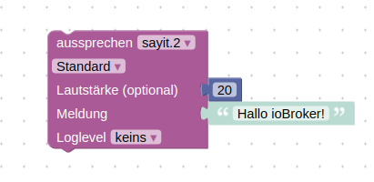
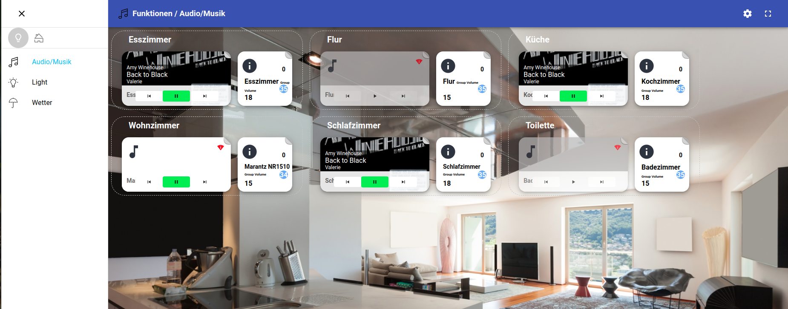
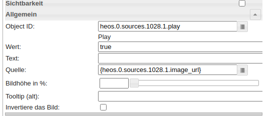
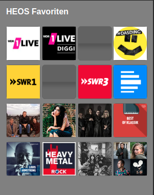
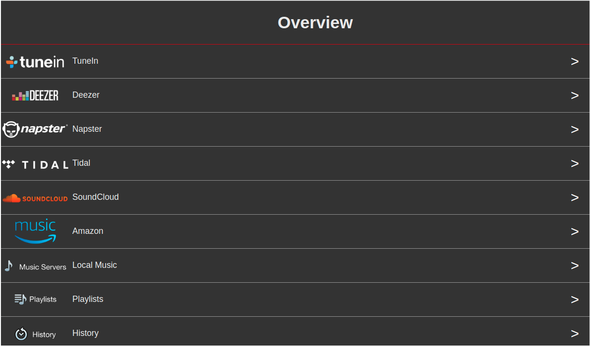

# IoBroker.heos
## Адаптер heos для ioBroker
Адаптер позволяет управлять HEOS из ioBroker.

## Конфигурация
* **Автозапуск** автоматическое воспроизведение музыки после подключения плеера или его включения. Можно настроить глобально в конфигурации. Если он включен глобально, вы можете отключить его для одного конкретного игрока с состоянием `` auto_play``.
* **Область действия** Определяет, каким игрокам отправляется команда `` scope / [cmd] ``. Его можно отправить всем игрокам, всем ведущим игрокам или всем PID в состоянии, разделенном запятыми: `` heos.0.command_scope_pid``
* **Отключить регулярное выражение**

В конфигурации вы можете активировать функцию отключения звука проигрывателя на основе совпадения регулярного выражения в информации о песне. Это можно использовать для автоматического отключения звука рекламы. Например, для Spotify вы можете использовать следующее регулярное выражение: ```spotify:ad:|Advertisement```.

* **ignore_broadcast_cmd** это состояние игрока настраивает, должен ли игрок игнорировать команды для всех игроков, например. player / set_mute & state = on или нажав кнопку воспроизведения для предустановок / списков воспроизведения

## Стремиться
Функция поиска работает не на всех источниках. Spotify и Amazon Music поддерживают поиск.

## Состояние команды
Спецификация HEOS CLI: http://rn.dmglobal.com/euheos/HEOS_CLI_ProtocolSpecification.pdf

### Состояние команды HEOS
* "system / connect": попробуйте подключиться к HEOS.
* «система / отключение»: отключение от HEOS.
* "system / reconnect": отключение и подключение
* "system / load_sources": перезагрузить источники
* "system / reboot": перезагрузить подключенный плеер
* "system / reboot_all": перезагрузить всех игроков
* "group / set_group? pid = <pid1>, <pid2>, ...": установить группу со списком идентификаторов игроков, например "group / set_group? pid = 12345678,12345679".
* "group / set_group? pid = <pid1>": удалить существующую группу, например. "group / set_group? pid = 12345678"
* "group / ungroup_all": удалить все группы
* "group / group_all": объединить всех игроков в одну группу.
* "player / [cmd]": отправить команду всем игрокам. например player / set_mute & state = on
* "лидер / [cmd]": отправить команду всем ведущим игрокам. например лидер / set_mute & state = on
* "scope / [cmd]": отправить команду в настроенную область видимости всем игрокам, ведущим игрокам или идентификаторам игроков, разделенным запятыми, в scope_pids
* "...": все остальные команды будут отправлены в HEOS.

### Состояние команды игрока
Примечание. Возможно использование нескольких команд, если они разделены вертикальной чертой, например. set_volume & level = 20 | play_preset & preset = 1

* "set_volume & level = 0 | 1 | .. | 100": установить громкость плеера.
* "set_play_state & state = play | pause | stop": установить состояние игрока.
* "set_play_mode & repeat = on_all | on_one | off & shuffle = on | off": установить режим повтора и перемешивания
* "set_mute & state = on | off": отключение звука игрока
* "volume_down & step = 1..10": меньшая громкость
* "volume_up & step = 1..10": увеличить громкость
* "play_next": играть дальше
* "play_previous": воспроизвести предыдущее.
* "play_preset & preset = 1 | 2 | .. | n": воспроизведение предустановки n.
* "play_stream & url = url_path": воспроизведение URL-потока
* "add_to_queue & sid = 1025 & aid = 4 & cid = [CID]": список воспроизведения с [CID] на плеере (помощь: 1 - играть сейчас; 2 - играть дальше; 3 - добавить в конец; 4 - заменить и воспроизвести)

## Извлечение цвета изображения
В версии 1.7.6 основные цвета обложки песни извлекаются и сохраняются в трех новых состояниях проигрывателя:

* **current_image_color_palette** Яркие цвета, выбранные с помощью node-bright.
* **current_image_color_background** цвет с наибольшей населенностью на изображении. Может использоваться в качестве цвета фона для элементов управления плеером в VIS.
* **current_image_color_foreground** цвет со второй по величине населенностью на изображении и хорошим контрастом для чтения по сравнению с цветом фона. Может использоваться в качестве цвета текста для элементов управления проигрывателем в VIS.

## Скажи это
[SayIt Адаптер](https://github.com/ioBroker/ioBroker.sayit) поддерживается.

 

## Материал пользовательского интерфейса
[Адаптер пользовательского интерфейса материала](https://github.com/ioBroker/ioBroker.material) поддерживается.



## Пресеты и списки воспроизведения
Адаптер не запрашивает автоматически текущие списки воспроизведения и пресеты. Чтобы обновить / запросить данные и создать состояния воспроизведения, вы должны сначала просмотреть источники:

- Предустановки / Избранное: `` heos.0.sources.1028.browse``
- Плейлисты: `` heos.0.sources.1025.browse``

## ВИС
### Монтаж
* Создайте следующие строковые состояния:
    * 0_userdata.0.heos.queue_pid
    * 0_userdata.0.heos.queue_html
    * 0_userdata.0.heos.browse_result_html

### Просмотр игрока
* Откройте файл: [player_view.json] (docs / vis / views / player_view.json)
* Замените 123456789 на пид плеера
* Импортировать вид в VIS


### Пресеты
* Нажмите кнопку `` heos.0.sources.1028.browse '', чтобы загрузить пресеты
* Откройте файл: [presets_view.json] (docs / vis / views / presets_view.json)
* Импортировать вид в VIS

 

### Очередь
* Виджет очереди: [queue_player_widget.json] (docs / vis / views / queue_player_widget.json)
* Просмотр очереди: [queue_view.json] (docs / vis / views / queue_view.json)
* Скрипт создания очереди HTML: [queue.js] (docs / vis / scripts / queue.js)


### Обзор источников
* Виджет просмотра: [browse_player_widget.json] (docs / vis / views / browse_player_widget.json)
* Обзор просмотра: [browse_view.json] (docs / vis / views / browse_view.json)
* Обзор сценария создания HTML: [browse.js] (docs / vis / scripts / browse.js)

  

Альтернативно вы можете использовать скрипт от Ухулы: https://forum.iobroker.net/post/498779

## Changelog

### 1.7.8 (2021-02-25)
* (withstu) add reboot

### 1.7.7 (2021-02-25)
* (withstu) add creation of missing version state

### 1.7.6 (2021-02-24)
* (withstu) add image color extraction

### 1.7.5 (2021-02-12)
* (withstu) add bit depth

### 1.7.4 (2021-02-01)
* (withstu) fix upnp init bug

### 1.7.3 (2021-02-01)
* (withstu) add upnp module and support bitrate, audio format and sample rate

### 1.7.2 (2021-01-30)
* (withstu) fix seek in groups

### 1.7.1 (2021-01-30)
* (withstu) add seek

### 1.7.0 (2021-01-29)
* (withstu) reboot not responding players
* (withstu) delete old presets and playlists

### 1.6.2 (2021-01-02)
* (withstu) fix "user not logged in" handling

### 1.6.1 (2020-11-25)
* (withstu) clear timeout and interval on unload; fix roles; remove sleep in tts module

### 1.6.0 (2020-11-22)
* (withstu) add regex mute

### 1.5.6 (2020-11-22)
* (withstu) add source images & optimize auto play

### 1.5.5 (2020-11-01)
* (withstu) update some packages and add sources event

### 1.5.4 (2020-10-24)
* (withstu) ignore invalid now playing responses

### 1.5.3 (2020-10-18)
* (withstu) minor improvements related to auto play feature

### 1.5.2 (2020-10-11)
* (withstu) improve tts stop method

### 1.5.1 (2020-10-11)
* (withstu) improve tts and don't update queue during tts

### 1.5.0 (2020-10-10)
* (withstu) add tts support and maximum volume

### 1.4.0 (2020-10-10)
* (withstu) add more play and queue settings
* (withstu) bugfixing for invalid heos responses (empty player name)

### 1.3.4 (2020-10-04)
* (withstu) remove sorting and available filter and fix browse play

### 1.3.3 (2020-10-04)
* (withstu) fix previous page button in browse feature

### 1.3.2 (2020-10-04)
* (withstu) fix preset sorting

### 1.3.1 (2020-10-03)
* (withstu) add back button to browse feature

### 1.3.0 (2020-10-03)
* (withstu) add queue and some browse improvements

### 1.2.4 (2020-09-29)
* (withstu) minor bugfix

### 1.2.3 (2020-09-29)
* (withstu) improve browse feature (add pictures and sources view)

### 1.2.2 (2020-09-28)
* (withstu) rename browse command

### 1.2.1 (2020-09-28)
* (withstu) introduce browse_result state

### 1.2.0 (2020-09-27)
* (withstu) Breaking change: restructure playlists/presets (you should delete the devices playlists, presets and sources before installation)

### 1.1.2 (2020-09-26)
* (withstu) log browse parameters

### 1.1.1 (2020-09-26)
* (withstu) add source browse feature (Click the button in the sources. You can find the possible next commands in the log.)

### 1.1.0 (2020-09-26)
* (withstu) encrypt password

### 1.0.1 (2020-09-21)
* (withstu) remove connected state, because it is included in the info channel

### 1.0.0 (2020-09-21)
* (withstu) initial release

## License
MIT License

Copyright (c) 2021 withstu <withstu@gmx.de>

derived from https://forum.iobroker.net/topic/10420/vorlage-denon-heos-script by Uwe Uhula
TTS derived from https://github.com/ioBroker/ioBroker.sonos

Permission is hereby granted, free of charge, to any person obtaining a copy
of this software and associated documentation files (the "Software"), to deal
in the Software without restriction, including without limitation the rights
to use, copy, modify, merge, publish, distribute, sublicense, and/or sell
copies of the Software, and to permit persons to whom the Software is
furnished to do so, subject to the following conditions:

The above copyright notice and this permission notice shall be included in all
copies or substantial portions of the Software.

THE SOFTWARE IS PROVIDED "AS IS", WITHOUT WARRANTY OF ANY KIND, EXPRESS OR
IMPLIED, INCLUDING BUT NOT LIMITED TO THE WARRANTIES OF MERCHANTABILITY,
FITNESS FOR A PARTICULAR PURPOSE AND NONINFRINGEMENT. IN NO EVENT SHALL THE
AUTHORS OR COPYRIGHT HOLDERS BE LIABLE FOR ANY CLAIM, DAMAGES OR OTHER
LIABILITY, WHETHER IN AN ACTION OF CONTRACT, TORT OR OTHERWISE, ARISING FROM,
OUT OF OR IN CONNECTION WITH THE SOFTWARE OR THE USE OR OTHER DEALINGS IN THE
SOFTWARE.