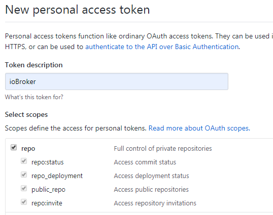
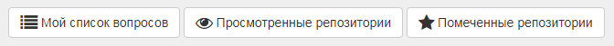
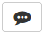
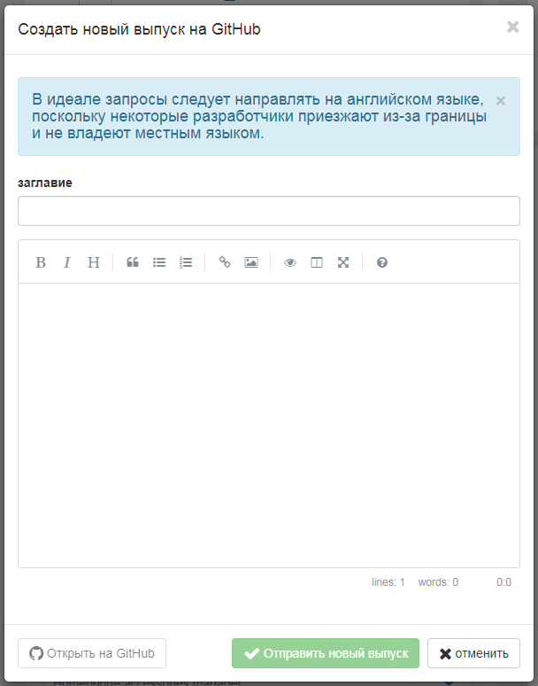
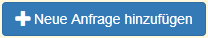
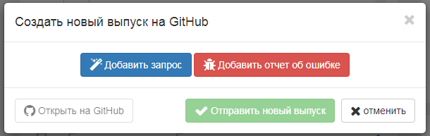
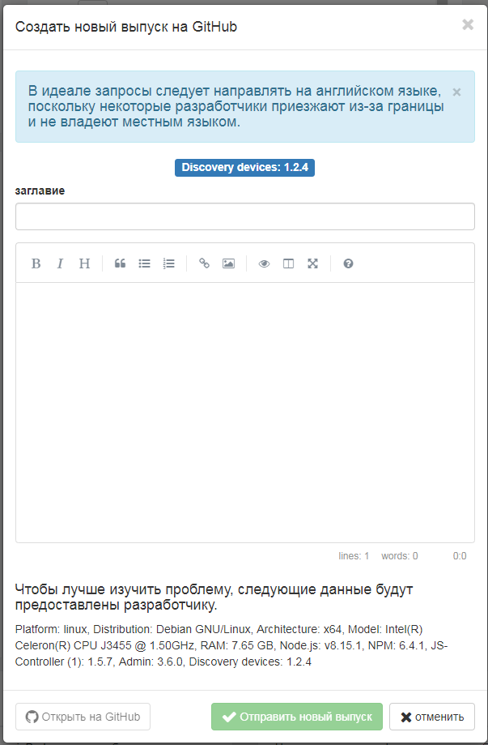
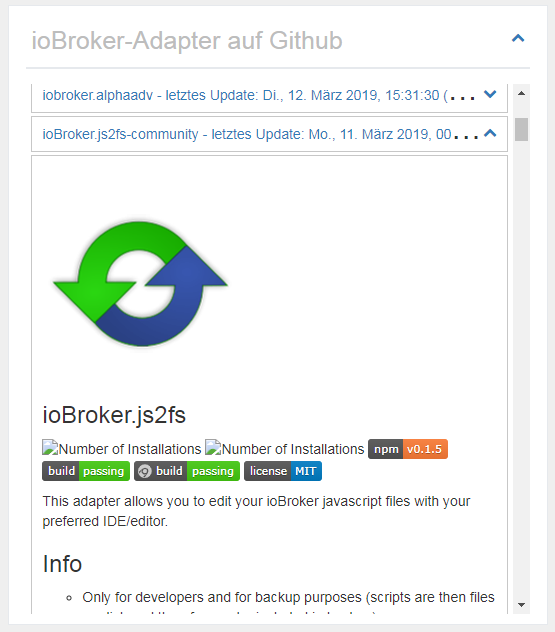

# Admin

Информационный адаптер был разработан для предоставления пользователю различной информации о системе, ioBroker и соответствующих темах. Пользователь должен получить обзор всех интересных и важных данных, и команда ioBroker получит возможность связаться с пользователем еще быстрее, если будет доступна важная информация.

# Монтаж


Чтобы увидеть информационное окно на вкладке «Вкладка», необходимо сначала установить его как «Видимый» в Admin после установки. Для этого нажмите на левый треугольник в верхнем левом углу окна администратора и выберите «Информация» в меню.

# Конфигурация

<p align="center">
    
</p>

* **Не показывать часы** - Чтобы скрыть часы в левом верхнем углу.
* **Скрыть события (только немецкий)** - Календарь событий не отображается
* **Показать запросы адаптера** - отображает панель с запросами адаптера.
    * **Запросы адаптера закрываются при запуске** - Панель с запросами адаптера закрывается при запуске информационного окна.
* **Просмотр известных ошибок** - Отображает панель с известными ошибками и запросами на установленные адаптеры.
    * **Известные ошибки при запуске закрыты** - Панель с известными ошибками закрывается при запуске информационного окна.

* **Показать новости с iobroker.net** - Отображает панель с официальными новостями ioBroker.
* **Показать последние записи форума** - Отображает панель с последними записями форума.
* **Ключ API Feednami** - Если вы вызываете ioBroker, используя имя хоста, например, iobroker: 8081 или что-то в этом роде, вам необходимо бесплатно зарегистрироваться в Feednami, чтобы получить соответствующий ключ API. Это не обязательно для доступа через IP-адрес.

* **Показать документацию** - отображает кнопку для документации.
    * **Выберите необходимые языки для документации** - Выбор языков, которые будут включены в документацию. (Возможно, вам придется нажать на название справа, чтобы выбрать что - по умолчанию -> установить язык + английский)

* **Поиск Github для неизвестных адаптеров (Эксперты)** - Отображает панель поиска неутвержденных адаптеров в Github.
    * **Сортировать адаптер по** - сортирует результат поиска по имени, дате создания или последнему обновлению.
    * **обратный порядок** - обратный порядок результатов.
    * **Новые адаптеры закрыты при запуске** - Панель с неизвестными адаптерами закрывается при запуске информационного окна.

* **Персональный токен GitHub** - Чтобы иметь возможность создавать новые проблемы или запросы адаптера на Github напрямую из ioBroker, вам нужен токен, который можно сгенерировать там. Для этого требуется учетная запись Github.
Чтобы получить токен, войдите в Github, щелкните значок пользователя в правом верхнем углу, перейдите к «Settings», затем «Developer settings»> «Personal access tokens». Там нажмите «Generate new token», введите любое имя в поле «Token description» и выберите «Scope», «repo». Затем вы получаете токен и вводите его в ioBroker. Вы можете найти более подробные инструкции на английском языке [здесь](https://help.github.com/en/articles/creating-a-personal-access-token-for-the-command-line).
 

* **Не загружать текущие системные данные** - Текущие системные данные не загружаются циклически.
    * **Загрузка данных CPU каждые x секунд** - Данные CPU загружаются циклически каждые 1–10 секунд. (0 выключен - по умолчанию 3)
    * **Загрузка данных памяти каждые x секунд** - Данные памяти загружаются циклически каждые 1-10 секунд. (0 выключен - по умолчанию 3)
    * **Загрузка данных на диске каждые x секунд** - Данные на жестком диске загружаются циклически каждые 1-10 секунд. (0 выключен - по умолчанию 8)
    * **Загрузка данных батареи каждые x секунд** - Загрузка данных батареи циклически каждые 1-10 секунд. (0 выключен - по умолчанию 8)
    * **Загрузка сетевых данных каждые x секунд** - Загрузка сетевых данных циклически каждые 1 - 10 секунд. (0 выключен - по умолчанию 3)
    * **Загрузка данных процесса и пользователя каждые x секунд** - Данные процесса и пользователя загружаются циклически каждые 1-10 секунд. (0 выключен - по умолчанию 8)

В системе Windows циклическая загрузка системных данных не должна происходить слишком быстро, потому что это вызывает значительную нагрузку на систему. Значения по умолчанию были выбраны для запуска без проблем в большинстве систем.

# Информация вкладка

Вкладка Info содержит различную информацию о вашей системе и ioBroker. Вкладка разделена на различные блоки, которые можно настроить. Почти все блоки могут быть открыты или открыты одним щелчком мыши .

## Часы


Часы не имеют специальной функции (но я приложил усилие) и могут быть отключены в любой момент в конфигурации.

## Github bar


Чтобы увидеть эту панель, вам сначала понадобится учетная запись Github и необходимо указать токен в конфигурации. Для получения дополнительной информации см. [Описание конфигурации](#Конфигурация) > «Персональный токен GitHub».

На данный момент у вас есть возможность увидеть самостоятельно созданные проблемы и репозитории, которые наблюдаются или отмечены звездочкой.

Нажав на кнопку , можно просмотреть все комментарии о проблеме. Кнопка появляется только при наличии комментариев. Общее количество комментариев отображается в всплывающей подсказке перед заголовком номера.

## Сообщения


Чтобы быстро отправлять важные сообщения, касающиеся ioBroker, пользователю была создана возможность создавать сообщения. Эти сообщения появляются ТОЛЬКО при соблюдении определенных условий. Таким образом, никакие сообщения не отображаются через адаптер, если он не установлен. Это гарантирует, что будут предупреждены ТОЛЬКО пользователи, на которых также распространяется проблема.

Сообщения могут быть закрыты одним кликом в правом верхнем углу , но они появляются снова, как только информационная вкладка перезагружается, до тех пор, пока проблема сохраняется.

Для использования сообщений с другими адаптерами, такими как Javascript, Telegram, Alexa и т. Д., Они уже фильтруются в объекте «newsfeed_filtered», хранящемся в виде массива объектов.

пример:
```javascript
const messages = JSON.parse(getState('info.0.newsfeed_filtered').val);
messages.forEach(message => {
    const title = message.title;
    const text = message.content;
    const created = new Date(message.created);
    console.log(created + " " + title + " " + text);
});
```

### Сообщения (VIS-Виджет)


Для сообщений был создан виджет VIS, который также появляется, только если сообщения касаются пользователя. Если сообщений нет, ничего не отображается, поэтому вам не нужно выделять дополнительное пространство на поверхности VIS для сообщений, а просто его. в середине экрана.

<br><br>

## Документация


Мы собрали список важных ссылок. Вы можете найти это в раскрывающемся списке, нажав на кнопку в правом верхнем углу «Документация». Если кнопка не видна, убедитесь, что соответствующий элемент в конфигурации отмечен.

Отдельные ссылки хранятся в разных категориях: сообщество, документация, новости, блог, видео плейлист, разработка и другие.

На правильность и полноту внешних ссылок гарантия не предоставляется. Если ссылки отсутствуют или неверны, пожалуйста, отправьте нам письмо по электронной почте.

## Обновления


Если выпущены новые версии адаптера, и вы также установили его, он появится в этом списке.

Отсюда вы можете напрямую обновить с помощью .
При наведении указателя мыши на значок  вы увидите самые важные изменения с момента выпуска.
Нажмите , чтобы отобразить полное описание адаптера.

Если хост - то есть JS-Controller - устарел, то под «Новые адаптеры» появляется дополнительное поле с сообщением о необходимости обновить хост.

## Новые адаптеры


Здесь отображаются все новые и официально выпущенные адаптеры за последние 60 дней.

Отсюда вы можете напрямую установить новый адаптер, нажав на кнопку .
Нажмите , чтобы отобразить полное описание адаптера.

<br>

## Системная информация


Системная информация о системе ioBroker отображается здесь. В случае систем с несколькими хостами, конечно, также отображается информация о других хостах. Эти данные поступают с контроллера JS.

Следующая информация (для каждого хоста) предоставляется как информация:

- Операционная система (Linux, Win32, Дарвин, Android, AIX, FreeBSD, OpenBSD или Sunos)
- Архитектура (arm, arm64, ia32, mips, mipsel, ppc, ppc64, s390, s90x, x32 и x64)
- процессоры (количество ядер)
- Скорость (скорость процессора)
- Модель (модель процессора)
- ОЗУ (примерный общий объем памяти)
- Время работы системы (как долго система работает)
- Node.js (версия Node.js - если она более новая или ваша версия устарела, эта информация также здесь)
- NPM (версия NPM)
- Размер жесткого диска (размер жесткого диска, на котором находится ioBroker)
- Жесткий диск свободен (сколько места еще доступно)
- количество адаптеров (сколько адаптеров уже выпущено для ioBroker)
- Время работы (как долго ioBroker работает без перезапуска)
- Активные экземпляры (сколько экземпляров адаптера в данный момент запущено на этом хосте)
- имя хоста (имя хоста)

```
Если какая-либо информация отсутствует, следует установить последнюю версию контроллера JS.
Это набор данных JS-контроллера v1.5.7.
```

При нажатии на  отображается подробная информация об основной системе.

### Системная информация (детальный просмотр)


Здесь много информации о домашней системе отображается и хранится в виде объекта. Они могут быть использованы вами довольно удобно. Большая часть данных считывается и сохраняется только при первой зарядке адаптера, так как они не так легко меняются.

Некоторые данные также обновляются циклически. Как часто это происходит, можно указать в конфигурации.

Помните, что не вся информация доступна в каждой операционной системе, что может привести к тому, что некоторая информация не будет отображаться.

#### Система

Здесь отображаются данные об оборудовании - материнская плата, BIOS, корпус и т. Д.

#### Программного обеспечения

Программное обеспечение включает в себя данные об операционной системе, установленном программном обеспечении, запущенных процессах и зарегистрированных пользователях.

#### Центральный процессор

Здесь вы можете найти данные о процессоре, такие как скорость, нагрузка и температура.

**Проблемы с Windows:** Wmic используется для определения температуры системы Windows. В некоторых случаях wmic необходимо запускать с правами администратора. Поэтому, если вы не получили никаких значений, попробуйте запустить его снова с соответствующими разрешениями. Если вы по-прежнему не получаете никаких значений, ваша система может не поддерживать эту функцию.

**Проблемы с Linux:** В некоторых случаях вам нужно установить сенсорный пакет Linux для измерения температуры, например, в системах на основе DEBIAN, запустив:

```
$ sudo apt-get install lm-sensors
```

#### Основная память

Здесь все данные в основной памяти, такие как свободная память или данные на панели памяти.

#### Жесткие диски

Все данные на жестких дисках, разделах, рейдах и ПЗУ.

**Проблемы с Linux:** Чтобы иметь возможность использовать S.M.A.R.T. Чтобы увидеть статус Linux, вам нужно установить smartmontools. В дистрибутивах Linux на основе DEBIAN вы можете установить его, выполнив следующие действия:

```
$ sudo apt-get install smartmontools
```

#### Графика

Здесь отображаются данные о контроллере или мониторе, если они доступны / поддерживаются.

#### Сеть

Все данные о сетевых подключениях.

#### Аккумулятор

Все данные о батарее, если таковые существуют.

**Проблемы с Windows:** wmic используется для определения состояния батареи системы Windows. В некоторых случаях wmic необходимо запускать с правами администратора. Поэтому, если вы не получили никаких значений, попробуйте запустить его снова с соответствующими разрешениями. Если вы по-прежнему не получаете никаких значений, ваша система может не поддерживать эту функцию.

## Запросы адаптера


Все запросы адаптера были включены в GitHub как проблема. Любой, кто желает чего-то, может ввести здесь свое желание, и любой может его развить, затем выбрать проблему и разработать из нее адаптер.

В этом списке будет отображаться заголовок, и, нажав на кнопку , появится более подробная информация. Над ссылками, когда желание было создано, справа текущий статус и под подробным описанием. Если разработчик выбрал запрос, он будет указан здесь как «assined to».

Нажав на кнопку , вы попадаете прямо на Github и можете добавлять свои собственные пожелания.
Если вы нажмете на название пожелания, вы приземлитесь прямо по запросу Github и можете проголосовать за него. Желания с большим количеством голосов, конечно, предпочтительнее.

Панель «Адаптер запросов» может быть скрыта в конфигурации или отображаться в закрытом состоянии при загрузке.

### Создать новый запрос адаптера

Чтобы создать новый запрос, вам сначала потребуется учетная запись Github и необходимо указать токен в конфигурации. Для получения дополнительной информации см. [Описание конфигурации](#Конфигурация) > «Персональный токен GitHub».


Если вы нажмете , появится окно, где у вас есть возможность создать заголовок и описание запроса адаптера.

В качестве заголовка всегда выбирайте четкий и краткий термин, например, «Panasonic TV». Затем опишите ваши пожелания как можно точнее.
Если для продукта существуют уже известные API, вы также должны написать это.
Любая информация, которая может помочь разработчику, увеличивает вероятность того, что соответствующий адаптер будет быстро разработан. Если возможно, пожалуйста, напишите все на английском языке,
потому что некоторые разработчики приезжают из-за границы и, вероятно, они не говорят на вашем языке.

Нажав «Отправить новый выпуск», вы создадите проблему на Github. Теперь вы можете нажать на синюю кнопку слева, чтобы перейти непосредственно к проблеме или просто закрыть окно.

### Голосовать за запросы адаптера

С учетной записью Github вы также можете напрямую голосовать за запросы адаптера, нажав . Если это работает, кнопка становится зеленой. Каждый может проголосовать только одним голосом. Общее количество голосов отображается в объекте перед заголовком.

В обзоре запросы адаптеров, за которые вы проголосовали, отображаются зеленым цветом, а запросы младше 1 месяца - синим.

## Мои адаптеры


Конечно, нет адаптеров без ошибок, и некоторые пользователи могут также иметь идеи расширения. Все, что известно об установленных адаптерах, собрано здесь. Вы также можете использовать этот список, чтобы узнать, известна ли разработчик только что обнаруженная ошибка, потому что только известные ошибки могут быть исправлены.

Нажмите  справа от имени адаптера, чтобы открыть список известных проблем / запросов. Их также можно открыть, где вы найдете подробное описание.

Если вы щелкнете по названию адаптера, вы можете перейти непосредственно к списку проблем на Github и, возможно, ввести новую ошибку или пожелать расширить.
Если вы нажмете на заголовок проблемы, вы получите сообщение Github и можете дополнительно предоставить разработчику дополнительную информацию, оставив комментарий.
Нажав на кнопку , можно просмотреть все комментарии о проблеме. Кнопка появляется только при наличии комментариев. Общее количество комментариев отображается в всплывающей подсказке перед заголовком номера.

Панель «Проблемы и ошибки» может быть скрыта в конфигурации или отображаться в закрытом состоянии при загрузке.

### Сообщить о желаниях или ошибках

Если вы открываете адаптер, у вас есть возможность сообщить о новой ошибке или внести предложения по улучшению, нажав . Для этого требуется учетная запись Github и токен в конфигурации. Более подробную информацию можно найти в разделе [Описание конфигурации] (# Конфигурация)> «Персональный токен GitHub».


При нажатии вы получаете возможность сделать предложение по улучшению (синий) или сообщить об ошибке (красный). Оба варианта позволяют вводить заголовок и описание.


Название должно дать вам четкое и краткое описание проблемы. При описании, вы не должны быть скромными с информацией. Каждая деталь может помочь разработчику быстрее реализовать проблему или желание. Если возможно, пожалуйста, напишите все на английском языке,
потому что некоторые разработчики приезжают из-за границы и, вероятно, они не говорят на вашем языке.

При нажатии на «Отправить новый выпуск», проблема будет создана на Github. Теперь вы можете нажать на синюю кнопку слева, чтобы перейти непосредственно к проблеме или просто закрыть окно.

### Пометить адаптер как любимый

Разработчики жертвуют большим количеством свободного времени, чтобы разработать адаптеры для вас. Вот ваш шанс, если введен токен Guthub, нажав на , чтобы поблагодарить разработчиков за их работу. Каждый может проголосовать только одним голосом. Общее количество голосов будет показано в объекте перед заголовком.

В обзоре выбранные вами адаптеры отображаются зеленым цветом.

## Адаптер ioBroker на Github


Количество официальных адаптеров для ioBroker уже немало. Конечно, в сети доступно гораздо больше адаптеров. Они ищутся и отображаются здесь.

Если вы откроете панель одним щелчком мыши , полное описание адаптера отобразится здесь.

Панель «ioBroker на Github» может быть скрыта в конфигурации или отображаться в закрытом состоянии при загрузке. Вы также можете настроить порядок сортировки.

```
ОСТОРОЖНО!!! Эти адаптеры могут находиться на очень ранней стадии разработки.
Они не должны быть установлены в производственной системе.
Каждая установка на свой страх и риск!
```

## Новости


Время от времени будут публиковаться официальные новости от команды ioBroker. Здесь они будут отображаться.

Нажмите , чтобы перейти прямо на официальную страницу ioBroker.

Новости отображаются без каких-либо проблем при доступе к ioBroker через IP или localhost:8081. Но если вы используете имя хоста, такое как meinhaus.de:8081, вы должны получить бесплатный ключ API в Feednami. Чтобы зарегистрироваться, нажмите [здесь](https://toolkit.sekando.com/docs/en/setup/hostnames) и следуйте инструкциям.

## Форум


Здесь последние записи форума отображаются на выбранном языке. Если на этом языке нет форума, данные будут отображаться на английском форуме.

Нажмите , чтобы попасть прямо на форум.

Записи форума будут отображаться без проблем при доступе к ioBroker через IP или localhost:8081. Но если вы используете имя хоста, такое как meinhaus.de:8081, вы должны получить бесплатный ключ API в Feednami. Чтобы зарегистрироваться, нажмите [здесь](https://toolkit.sekando.com/docs/en/setup/hostnames) и следуйте инструкциям.

## Changelog
<!-- ### __WORK IN PROGRESS__ -->

### 1.7.15 (2021-01-13)
* (Apollon77) fix crash case (Sentry IOBROKER-INFO-1X)

### 1.7.14 (2020-12-27)
* (Apollon77) fix crash case (Sentry IOBROKER-INFO-1R)

### 1.7.13 (2020-12-24)
* (Apollon77) fix crash case (Sentry IOBROKER-INFO-A)

### 1.7.12 (2020-12-02)
* (Apollon77) fix crash case (Sentry IOBROKER-INFO-1G)

### 1.7.11 (2020-11-30)
* (Apollon77) fix crash case (Sentry IOBROKER-INFO-1F)
* Add Weblate translations

### 1.7.10 (2020-11-09)
* (Apollon77) fix crash case (Sentry IOBROKER-INFO-13)

### 1.7.9 (2020-11-01)
* (bluefox) Corrected socket.io in widget

### 1.7.8 (2020-09-17)
* (bluefox) Fixed words.js in widget

### 1.7.7 (2020-07-25)
* (Apollon77) Prevented a crash case (Sentry IOBROKER-INFO-K)

### 1.7.6 (2020-07-14)
* (Apollon77) Update systeminformation and other deps
* (Apollon77) Check for axios existance and exit adapter if not existing to prevent crashes (Sentry IOBROKER-INFO-C)
* (ldittmar) UUID Hash with SHA256

### 1.7.5 (2020-06-08)
* (ldittmar) Check UUID for messages
* (ldittmar) New field for test messages

### 1.7.4 (2020-06-01)
* (Apollon77) Update systeminformation and other deps
* (ldittmar) Added full S.M.A.R.T data. To be able to detect S.M.A.R.T. status on Linux you need to install smartmontools >= 7.0

### 1.7.2 (2020-05-07)
* (ldittmar) Update systeminformation library
* (ldittmar) Messages can be hidden
* (ldittmar) Show subnet mask for ip4 and ip6 

### 1.7.1 (2020-04-29)
* (ldittmar) Update systeminformation library
* (ldittmar) Check instance active for messages

### 1.7.0 (2020-04-16)
* (Apollon77) IMPORTANT: Supported version minimum nodejs 10
* (Apollon77) add Sentry error reporting and update dependencies
* (Apollon77) remove usage of objects directly to prevent js-controller 3.0 warnings
* (Apollon77) update dependencies
* (Apollon77) fix some crashes
* (Apollon77) fix compact mode

### 1.6.0 (2020-04-08)
* (SchumyHa) update Chinese bbs rss url
* (ldittmar) Tabs were added to config
* (ldittmar) Update translations
* (bluefox) Widget corrected in edit mode

### 1.5.7 (2019-11-12)
* (ldittmar) add event vis widget

### 1.5.6 (2019-11-05)
* (ldittmar) Add Repo check for popup
* (ldittmar) Fix dp type

### 1.5.5 (2019-10-12)
* (ldittmar) Add NPM and OS check for popup

### 1.5.4 (2019-09-25)
* (ldittmar) add event calendar

### 1.5.2 (2019-09-24)
* (ldittmar) show comments for adapter requests
* (ldittmar) show closed adapter requests
* (ldittmar) check node version for messages

### 1.4.3 (2019-09-09)
* (ldittmar) change systeminformation call interval
* (ThomasBahn) News problem fixed
* (ldittmar) Update systeminformation library
* (badenbaden) Fixed russian spelling 

### 1.4.1 (2019-08-01)
* (bluefox) Removed default socket.io

### 1.3.7 (2019-04-17)
* (ldittmar) better integration to admin adapter

### 1.3.5 (2019-04-12)
* (ldittmar) add likes for Adapters
* (ldittmar) show comments for issues

### 1.3.4 (2019-04-10)
* (ldittmar) my issues and my repos
* (ldittmar) change Github API V3 to API V4
* (ldittmar) vote for adapter requests

### 1.3.2 (2019-04-06)
* (SchumyHao) Update Chinese translation
* (ldittmar) create Github issues
* (ldittmar) create new adapter requests

### 1.3.1 (2019-04-03)
* (ldittmar) charts for cpu and memory
* (ldittmar) filtered news object added

### 1.3.0 (2019-03-29)
* (ldittmar) better system information
* (ldittmar) documentation in all languages
* (ldittmar) some fixes

### 1.2.7 (2019-03-17)
* (ldittmar) little fixes
* (ldittmar) unknown adapters search new design
* (ldittmar) better design for PC monitor
* (ldittmar) unknown adapters show more information
* (ldittmar) stable version

### 1.2.5 (2019-03-14)
* (ldittmar) show adapter requests
* (ldittmar) show bugs and issues
* (ldittmar) display important links
* (ldittmar) show important popup news
* (ldittmar) vis widget for popup news

### 1.1.3 (2019-01-03)
* (ldittmar) compact mode compatibility added
* (ldittmar) add chinese support
* (ldittmar) add new forum support
* (ldittmar) add chinese forum support
* (ldittmar) move to iobroker-community-adapters

### 1.0.2 (2018-11-30)
* (ldittmar) fixed problems with Node version info in multi-host system

### 1.0.1 (2018-11-27)
* (ldittmar) search for new adapters on Github
* (ldittmar) check for Node.js update
* (ldittmar) https problems with news and forum data solved
* (ldittmar) polish added as language

### 1.0.0 (2018-11-25)
* (ldittmar) full compatibility to Admin 3.x
* (ldittmar) clock can be disabled

### 0.1.0 (2018-01-02)
* (ldittmar) compatibility to Admin 3.x / beta release

### 0.0.6 (2017-12-11)
* (ldittmar) some fixes / install and update implemented

### 0.0.4 (2017-12-08)
* (ldittmar) some fixes and design correction
* (ldittmar) show information about adapters (update/new)
* (ldittmar) show system information

### 0.0.1 (2017-11-23)
* (ldittmar) initial commit

## License
The MIT License (MIT)

Copyright (c) 2017 - 2020 ldittmar <iobroker@lmdsoft.de>

Permission is hereby granted, free of charge, to any person obtaining a copy
of this software and associated documentation files (the "Software"), to deal
in the Software without restriction, including without limitation the rights
to use, copy, modify, merge, publish, distribute, sublicense, and/or sell
copies of the Software, and to permit persons to whom the Software is
furnished to do so, subject to the following conditions:

The above copyright notice and this permission notice shall be included in
all copies or substantial portions of the Software.

THE SOFTWARE IS PROVIDED "AS IS", WITHOUT WARRANTY OF ANY KIND, EXPRESS OR
IMPLIED, INCLUDING BUT NOT LIMITED TO THE WARRANTIES OF MERCHANTABILITY,
FITNESS FOR A PARTICULAR PURPOSE AND NONINFRINGEMENT. IN NO EVENT SHALL THE
AUTHORS OR COPYRIGHT HOLDERS BE LIABLE FOR ANY CLAIM, DAMAGES OR OTHER
LIABILITY, WHETHER IN AN ACTION OF CONTRACT, TORT OR OTHERWISE, ARISING FROM,
OUT OF OR IN CONNECTION WITH THE SOFTWARE OR THE USE OR OTHER DEALINGS IN
THE SOFTWARE.