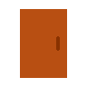

# IoBroker.iqontrol
Если вам это нравится, пожалуйста, рассмотрите пожертвование.

[![PayPal] (https://www.paypalobjects.com/en_US/DK/i/btn/btn_donateCC_LG.gif)](https://www.paypal.com/cgi-bin/webscr?cmd=_s-xclick&hosted_button_id=LDHZMNPXKRX2N&source=url)

## Адаптер iqontrol для ioBroker
Быстрое веб-приложение для визуализации.

 

Работает в любом браузере.
Вы можете сохранить его как веб-приложение на домашнем экране iOS, и оно будет выглядеть как родное приложение.
Это полностью настраиваемый.

## Тебе нужно...
* Nodejs 8 или выше
* socketIO должен быть включен в веб-адаптере

## Как пользоваться
* Начните создавать представления.

Вы можете рассматривать представления как что-то вроде страницы.

* Затем создайте устройства на этих представлениях.

У устройств есть роль, которая определяет функцию устройства, какие значки используются и так далее.
В зависимости от этой роли вы можете связать несколько состояний с устройством. Это даст устройству его функциональность.
Если вы выберете «Ссылка на другой вид» в качестве роли, вы сможете создавать ссылки на другие виды. Я предлагаю скины Ссылки на другие виды с тем же фоном, который есть у связанного вида.
Вы также можете попробовать использовать функцию автоматического создания, чтобы выбрать существующее устройство из дерева объектов iobroker. Autocreate пытается выяснить роль и сопоставить как можно больше состояний.

* После этого вы можете создать панель инструментов, которая отображается в виде нижнего колонтитула.

Панель инструментов-Entrys - это ссылки на виды.
Первая панель инструментов будет вашей «Домашней панелью» и будет загружена при запуске.

* Чтобы придать всему модный стиль, вы можете загрузить свои собственные изображения.

Вы можете использовать свои изображения в качестве фоновых изображений для представлений или для устройств.
Бесплатные встроенные демо-обои от www.pexels.com.

## Известные вопросы
Это первый альфа-релиз, поэтому может быть много ошибок. Но для меня это работает абсолютно стабильно.
Однако есть несколько ограничений:

- Загрузка изображений (в качестве фоновых изображений или для кнопок устройств оформления) работает, но переименование и удаление не работает
- Создание и удаление подкаталогов также не работает.

Вы можете сделать эти операции вручную через ftp в iobroker / iobroker-data / files / iqontrol / userimages

Пожалуйста, не стесняйтесь комментировать и дайте мне знать, как исправить эти проблемы!

Посетите [форум iobroker](https://forum.iobroker.net/topic/22039/neuer-adapter-visualisierung-iqontrol).

## Описание ролей и связанных состояний
Каждое устройство имеет роль, которая определяет функцию устройства. Каждая роль генерирует набор состояний, которые могут быть связаны с соответствующим состоянием io-брокера.
Если вы используете функцию автоматического создания, вы можете выбрать существующее устройство из дерева объектов io-broker. Autocreate пытается выяснить роль и сопоставить как можно больше состояний.
Это будет работать только для известных устройств. Для неизвестных устройств, а также для предоставления устройствам расширенных функций, вы можете добавить их вручную с помощью кнопки (+) - или отредактировать устройства, созданные с помощью автоматического создания.
Чтобы отредактировать роль и состояния устройства, нажмите на карандаш позади устройства. Ниже вы найдете краткое описание ролей и используемых состояний:

### Общие положения:
Каждая роль имеет следующие три состояния:

* **BATTERY** *boolean* - при значении true будет отображаться маленький значок батареи
* **ОШИБКА** *логическое* - при значении true будет отображаться маленький значок с восклицательным знаком
* **UNREACH** *логический* - при значении true будет отображаться маленький значок беспроводной сети

Почти все роли имеют состояние STATE и / или LEVEL. В большинстве случаев это представляет собой основную функцию устройства. Вы можете назначить ему состояния io-broker следующих типов:

* *boolean* - если возможно, он будет переведен в содержательный текст, такой как «вкл / выкл», «открыт / закрыт» или тому подобное. Если вы щелкнете по значку плитки, он попытается переключить логическое значение (например, чтобы включить или выключить свет). Если он не предназначен только для чтения, в диалоговом окне появится сальто-переключатель.
* *число* - будет отображаться с соответствующим ему блоком и генерировать слайдер в диалоге.
* *string* - текст для отображения
* *список значений* - будет отображаться выбранное значение. Если он не защищен от записи, в диалоговом окне появится раскрывающееся меню.
  * Технически *value-list* - это значение с соответствующим переводом-списком, определенным в объекте 'native.states' или 'common.states' точки данных:

````
"native": {
    "states": {"true": "Text for true", "false": "Text for false"},
    ...
}
````

    * Вы можете создать свой собственный список значений, добавив объект states в `` `` "native": {} `` `` часть datapoint. Это будет прочитано только iQontrol и не будет влиять на другие скрипты.
    * Объект состояния внутри части `` `` "common": {} `` `` также будет распознаваться iQontrol, но с более низким приоритетом. Если вы измените его здесь, это может повлиять на другие сценарии. Более того, он может быть перезаписан адаптером, который создал точку данных.

Однако не каждый тип имеет смысл для каждой роли. Так, например, СОСТОЯНИЕ переключателя будет в большинстве случаев булевым, чтобы его можно было переключать между включением и выключением. Строка может отображаться, но переключатель не будет работать.

### Ссылка на другой вид:
* Больше не имеет состояний, но будет уважать **свойство связанный вид**

###  Switch,  Поклонник:
* **STATE** *boolean* - отображать и устанавливать вкл / выкл
* **POWER** *number* - энергопотребление, которое будет отображаться маленьким в верхнем правом углу

###  Свет:
Каждый источник света может иметь одно или оба из следующих состояний:

* **STATE** *boolean* - отображать и устанавливать вкл / выкл
* **УРОВЕНЬ** *число* - показать и установить уровень освещенности

По желанию вы можете определить следующие состояния:

* Для цветных светодиодов (HSB-цвет-пространство):
  * **HUE** * number * - цвет света от 0 до 360 ° (формат оттенка)
  * **НАСЫЩЕННОСТЬ** * число * - насыщенность света (от белого до чистого цвета)
  * **COLOR_BRIGHTNESS** * число * - яркость цветных светодиодов (это учитывается, только если на светодиодах имеются как цветные, так и белые светодиоды. Если у вас есть только один вид светодиодов, яркость контролируется УРОВНЕМ- Государственный)
* Для белых светодиодов:
  * **CT** * число * - цветовая температура света, если он имеет два оттенка белого
  * **WHITE_BRIGHTNESS** * число * - яркость белых светодиодов (это учитывается только в том случае, если свет имеет как белый, так и цветной светодиоды. Если у вас есть только один вид светодиодов, яркость контролируется УРОВНЕМ- Государственный)
* Альтернативные цветовые пространства **еще не реализованы**
  * **HUE_MILIGHT** * число * - Милайт использует другую начальную точку в оттенке цвета:

````
tHue = modulo(66 - (hue / 3.60), 100) * 2.55;
on modulo(n, m){
n ((n % m) + m) %m;

````

  * **RGB_HUEONLY** * string * - вместо использования HUE вы можете использовать формат RGB_HUEONLY (шестнадцатеричный). В этом особом случае RGB-формат будет принимать только чистые насыщенные цвета цветового круга. Смешанный белый не допускается
  * **RGB** * string * - вместо использования HUE, SATURATION и COLOR_BRIGHTNESS вы можете использовать RGB-формат (шестнадцатеричный)
  * **RGBW** * string * - вместо использования HUE, SATURATION, COLOR_BRIGHTNESS и WHITE_BRIGHTNESS вы можете использовать RGBW-формат (шестнадцатеричный)
  * **RGBWWCW** * string * - вместо HUE, SATURATION, COLOR_BRIGHTNESS, CT и WHITE_BRIGHTNESS вы можете использовать формат RGBWWCW (шестнадцатеричный)
* **POWER** *number* - энергопотребление, которое будет отображаться маленьким в верхнем правом углу

###  Термостат:
* **SET_TEMPERATURE** *число* - цель-температура
* **ТЕМПЕРАТУРА** *число* - фактическая температура, отображаемая маленьким шрифтом в верхнем правом углу
* **ВЛАЖНОСТЬ** *число* - фактическая влажность отображается в маленьком правом верхнем углу
* **CONTROL_MODE** *список значений* - отобразить и установить режим термостата
* **VALVE_STATES** массив имен и номеров - отображает открытие клапанов, связанных с термостатом

###  Homematic Термостат:
В дополнение к обычному термостату вы можете определить:

* **PARTY_TEMPERATURE** *string* - строка в специальном формате для определения режима homematic-термостатов для вечеринки или праздника
* **BOOST_STATE** *число* - отображает оставшееся время ускорения термостатов homematic.

###  Датчик температуры,  Датчик влажности:
* **СОСТОЯНИЕ** *число* - температура или влажность, которые будут отображаться в нижней части устройства
* **ТЕМПЕРАТУРА** *число* - температура, которая будет отображаться маленьким в верхнем правом углу
* **ВЛАЖНОСТЬ** *число* - влажность, которая будет отображаться маленьким в верхнем правом углу
* Уважает **свойство связанных просмотров**

###  Яркость-Sensor:
* **STATE** *число* - яркость, которая будет отображаться в нижней части устройства
* **BRIGHTNESS** *number* - яркость, которая будет отображаться маленьким в верхнем правом углу
* Уважает **свойство связанных просмотров**

###  Датчик движения:
* **STATE** *логическое* - отображать, обнаружено движение или нет
* Уважает **свойство связанных просмотров**

###  Дверь,  Окно:
* **STATE** *boolean* - отображать, открыта или закрыта дверь или окно.
  * В качестве альтернативы вы можете назначить *список значений* чтобы отобразить дополнительные состояния, такие как «наклон».
  * Вы также можете назначить *строку* для отображения любого текста, например «3 открытых окна» или «все закрыто».
* Уважайте **свойство связанных просмотров**

###  Дверь с замком:
* **STATE** *boolean* - отображать, открыта или закрыта дверь.
* **LOCK_STATE** *логический* - отображать, заблокирована или разблокирована дверь
* **LOCK_STATE_UNCERTAIN** *логическое значение* - СОСТОЯНИЕ будет отображаться курсивом, если true, чтобы показать, что точная позиция блокировки неизвестна
* **LOCK_OPEN** *boolean* - если установлено значение true, дверь полностью откроется

###  Слепой:
* **УРОВЕНЬ** *число* - высота блайндов в процентах
* **DIRECTION** *список значений* - может быть Stop, Up и Down
* **STOP** *логическое* - если установлено значение true, слепой остановится

###  Fire-Sensor:
* **STATE** *логическое* - если true, датчик будет отображаться как сработавший
  * В качестве альтернативы вы можете назначить *список значений* чтобы отобразить дополнительные состояния, такие как «несанкционированный доступ».
  * Вы также можете назначить *строку* для отображения любого текста, например "огонь на верхнем этаже".
* Уважает **свойство связанных просмотров**

###  Тревога:
* **STATE** *логическое* - если true, датчик будет отображаться как сработавший
  * В качестве альтернативы вы можете назначить *список значений* чтобы отобразить дополнительные состояния, такие как «несанкционированный доступ».
  * Вы также можете назначить *строку* для отображения любого текста, например "огонь на верхнем этаже".

###  Значение:
* **СОСТОЯНИЕ** *любое* - любое допустимое состояние, которое будет отображаться (посмотрите раздел общих состояний)
* **LEVEL** *number* - создаст слайдер в диалоге

###  Программа:
* **STATE** *boolean* - при значении true программа будет запущена

###  Сцена:
* **STATE** *boolean* - отображается, если сцена активна. Если установлено значение true, сцена будет запущена

###  Кнопка:
* **STATE** *any* - любой желаемый тип состояния
* **SET_VALUE** CONSTANT *string* - это константа (а не связанное состояние io-broker!), Которая будет назначена в STATE при нажатии кнопки

###  Неожиданно возникнуть:
* **STATE** *any* - может использоваться для отображения дополнительной информации
* **URL** CONSTANT *string* - этот URL будет открыт как всплывающее окно внутри всплывающего окна
* **HTML** CONSTANT *string* - эта разметка будет отображаться во всплывающем окне, если URL не указан

###  Внешняя ссылка:
* **STATE** *any* - может использоваться для отображения дополнительной информации
* **URL** CONSTANT *string* - этот URL будет открыт

## Разработка
* Взгляните на [Принцип работы внешнего интерфейса] (Операция% 20Principle% 20of% 20Frontend.md)

****

## Changelog

### 0.0.31
* (Sebastian Bormann) Fixed some typos.
* (Sebastian Bormann) Enhanced colour-mixing of light with seperate brightness-datapoints for color and white.
* (Sebastian Bormann) Rewritten rendering of view as praparation for further enhancements.
* (Sebastian Bormann) Rewritten rendering of dialog as praparation for further enhancements.
* (Sebastian Bormann) Added option to colorize Device-Texts.

### 0.0.30
* (Sebastian Bormann) Fixed io-package.json

### 0.0.29
* (Sebastian Bormann) changed parts of the code to be backward-compatible to older browsers like ie 11.
* (Sebastian Bormann) Now its possible to define a value list for a data point under .native.states wich will have a greater priority than a value list under .common.states. 
* (Sebastian Bormann) Updated dependency for axios to 0.0.19 to fix a scurity issue.

### 0.0.28
* (Sebastian Bormann) Added datapoint POWER to switch, fan and light.
* (Sebastian Bormann) Fixed marquee for small info texts in the upper right corner at big screen sizes.
* (Sebastian Bormann) Added more options for configuring header-colors and device-colors (experimental state). Text-color ist not configurable yet.

### 0.0.27
* (Sebastian Bormann) Added marquee (scrolling text) for long states and device names (can be configured  in options). 
* (Sebastian Bormann) Added more toolbar-options. 
* (Sebastian Bormann) Enhanced handling of value lists. 
* (Sebastian Bormann) Disabled swiping when dialog is opened.

### 0.0.26
* (Sebastian Bormann) Added brightness to motion-sensor.
* (Sebastian Bormann) Added options tab. You can now configure colors of toolbar.
* (Sebastian Bormann) Fixed rendering of constants.
* (Sebastian Bormann) Resized the demo-wallpapers for faster loading.

### 0.0.25
* (Sebastian Bormann) Added motion-sensor.
* (Sebastian Bormann) Added description, how the frontend works: [Operating Principle of Frontend](Operating%20Principle%20of%20Frontend.md).
* (Sebastian Bormann) Added dialog for editing constants like SET_VALUE, URL or HTML.
* (Sebastian Bormann) Changed the way arrays are stored.
* (Sebastian Bormann) Added submit-button for values of type string.
* (Sebastian Bormann) Added saturation to hue-lights.
* (Sebastian Bormann) Better icons for color-temperature and brightness-sensor.

### 0.0.24
* (Sebastian Bormann) Fixed jittering on Safari while scrolling (was related to Pull2Refresh).
* (Sebastian Bormann) System language of iobroker will be loaded and used.

### 0.0.23
* (Sebastian Bormann) Rewrote how constant values (instead of linkedStates) are handeled - this is a requirement for further development.
* (Sebastian Bormann) Fixed Pull2Refresh on android devices / chrome.
* (Sebastian Bormann) Added external links
* (Sebastian Bormann) Added popups with iframes

### 0.0.22
* (watcherkb) Improved german translation.
* (BramTown) Improved german translation.
* (Sebastian Bormann) Short after another coming reconnect-events (<5s) are ignored now.

### 0.0.21
* (Sebastian Bormann) Added Pull2Refresh on mobile devices - reloads whole page when pulling down on homepage, otherwise only the acual view is reloaded.
* (Sebastian Bormann) Improved reloading on reconnect (hoepefully to get it finally good working on iOS 12.2).

### 0.0.20
* (Sebastian Bormann) New trial to get it working in iOS 12.2.

### 0.0.19
* (Sebastian Bormann) Improved reloading of page in new PWA-Mode of iOS 12.2.

### 0.0.18
* (Sebastian Bormann) Improved fetching of VALVE_STATES.
* (Sebastian Bormann) Changed Button Icon.
* (Sebastian Bormann) Added Loading-Spinner if disconnected.
* (Sebastian Bormann) Due to new iOS 12.2 PWA-Mode added visibility-check and connectivity-check.
* (Sebastian Bormann) Added role-icons to role-selectbox in edit device dialog.
* (Sebastian Bormann) Fixed missing value-list for states of the type string.

### 0.0.17
* (Sebastian Bormann) Changed description of slider (level/dimmer/value/height).

### 0.0.16
* (Sebastian Bormann) Role of device is displayed in devices-table.
* (Sebastian Bormann) VALVE_STATES is now editable via GUI (show opening of valves associated with a thermostat in percentage).
* (Sebastian Bormann) Added Role 'Button': You can define a constant SET_VALUE wich will be written to the ID that is linked with STATE if the button is pressed.
* (Sebastian Bormann) Rewritten parts of front-end to guarentee better compatibility. Boost-Mode for Homematic-Thermostat should work now.
* (Sebastian Bormann) Added state BOOST_STATE for Homematic-Thermostat - ability to display remaining boost-time if in boost-mode.
* (Sebastian Bormann) Added dessription of roles and corresponding states.
* (Sebastian Bormann) Temperature und Humidity-Sensors can now display a STATE at bottom of device, and both, TEMPERATURE and HUMIDITY, in small in the upper right corner.
* (Sebastian Bormann) Better handling of Auto-Create of Temperature- und Humidity-Sensors.
* (Sebastian Bormann) German translation: 'geöffnet' lower case.
* (Sebastian Bormann) Zigbee humidity and temperature added to auto-creation.
* (Sebastian Bormann) Fixed not scrollable selectbox at devices tab.

### 0.0.15
* (Sebastian Bormann) Improved check for value type of states.
* (Sebastian Bormann) Improved slider-tooltip to lower font-size at large numbers.

### 0.0 14
* (Sebastian Bormann) If role of state is not further specified, then check for role of parent object.

### 0.0.13
* (Sebastian Bormann) Doors and Windows now force true/false to be translated to opened/closed.
* (Sebastian Bormann) Double Entrys on WelcomeScreen/Overview removed.
* (Sebastian Bormann) States are now set with the correct value type.
* (Sebastian Bormann) Changed recognition of state types. I hope there are no new bugs now!

### 0.0.12
* (Sebastian Bormann) Check for unallowed chars in object names.
* (Sebastian Bormann) Check for duplicates in view names.
* (Sebastian Bormann) Level fires a slider in dialog - even when it has a state list (HUE again :)).
* (Sebastian Bormann) Added Blinds (Homematic) - please test it, i don't have one to test.

### 0.0.11
* (Sebastian Bormann) Added compatibility for edge and firefox. 
* (Sebastian Bormann) Again Hue bugfixes.
* (Sebastian Bormann) Removed Tooltip from Toolbar.

### 0.0.10
* (Sebastian Bormann) Added ColorTemperature. Hoepfully HUE works now? Can't test ist, because i do not own any hue lamp :)

### 0.0.9
* (Sebastian Bormann) Philips HUE added to autocreate (colortemp is not working yet!).  
* (Sebastian Bormann) LinkedView now also works on windows, doors and fire-sensor.
* (Sebastian Bormann) Added translation (thanks ldittmar!).

### 0.0.8
* (Sebastian Bormann) Added icons to image selectboxes.

### 0.0.7
* (Sebastian Bormann) Changed order of tabs
* (Sebastian Bormann) Autocreate for shelly should work now (i hope so, can't test it here)

### 0.0.6
* (Sebastian Bormann) Improved speed of select id and autocreate
* (Sebastian Bormann) Set filter to channel on autocreate

### 0.0.5
* (Sebastian Bormann) Bugfix: creation of many devices schould work now

### 0.0.4
* (Sebastian Bormann) Bugfix: copy device created just a reference to old object
* (Sebastian Bormann) Addes Toolbar-Icons

### 0.0.3
* (Sebastian Bormann) various bugfixes

### 0.0.2
* (Sebastian Bormann) first partly running version

### 0.0.1
* (Sebastian Bormann) initial release

## License
MIT License

Copyright (c) 2019 Sebastian Bormann

Permission is hereby granted, free of charge, to any person obtaining a copy
of this software and associated documentation files (the "Software"), to deal
in the Software without restriction, including without limitation the rights
to use, copy, modify, merge, publish, distribute, sublicense, and/or sell
copies of the Software, and to permit persons to whom the Software is
furnished to do so, subject to the following conditions:

The above copyright notice and this permission notice shall be included in all
copies or substantial portions of the Software.

THE SOFTWARE IS PROVIDED "AS IS", WITHOUT WARRANTY OF ANY KIND, EXPRESS OR
IMPLIED, INCLUDING BUT NOT LIMITED TO THE WARRANTIES OF MERCHANTABILITY,
FITNESS FOR A PARTICULAR PURPOSE AND NONINFRINGEMENT. IN NO EVENT SHALL THE
AUTHORS OR COPYRIGHT HOLDERS BE LIABLE FOR ANY CLAIM, DAMAGES OR OTHER
LIABILITY, WHETHER IN AN ACTION OF CONTRACT, TORT OR OTHERWISE, ARISING FROM,
OUT OF OR IN CONNECTION WITH THE SOFTWARE OR THE USE OR OTHER DEALINGS IN THE
SOFTWARE.