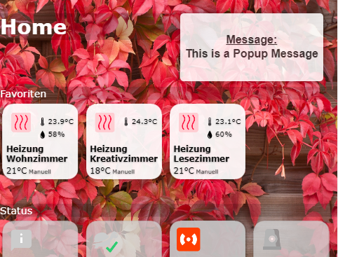

# IoBroker.iqontrol
** Тесты: **

| Linux / Mac / Windows: | Кроссбраузерная проверка: |
| --- | --- |

\ **Если вам это нравится, рассмотрите возможность пожертвования:**

[![PayPal] (https://www.paypalobjects.com/en_US/DK/i/btn/btn_donateCC_LG.gif)](https://www.paypal.com/cgi-bin/webscr?cmd=_s-xclick&hosted_button_id=LDHZMNPXKRX2N&source=url)

****

## Адаптер iqontrol для ioBroker
Быстрое веб-приложение для визуализации.

 

Работает в любом браузере.
Это полностью настраивается.
\ **Этот адаптер использует библиотеки Sentry для автоматического сообщения разработчикам об исключениях и ошибках кода.** Дополнительные сведения и информацию о том, как отключить отчет об ошибках, см. В [Документация Sentry-Plugin](https://github.com/ioBroker/plugin-sentry#plugin-sentry)! Сторожевые отчеты используются начиная с js-controller 3.0.

## Добавить на домашний экран
Вы можете сохранить его как веб-приложение на главном экране, и оно будет выглядеть как родное приложение: 

## Тебе нужно...
* Nodejs 10 или выше
* Web-адаптер с одним экземпляром, работающим по тому же протоколу (http или https), что и админ-адаптер, socket.IO установлен на «интегрированный», а «Force Web-Sockets» отключен
    * Если это противоречит другим адаптерам, просто добавьте еще один экземпляр с указанными выше настройками - iQontrol будет искать наиболее подходящий экземпляр веб-адаптера и использовать его для связи.
* Для подключения через *iobroker.pro-Cloud* и админ, и веб-адаптер должны быть настроены на http (не https)

## Исправление проблем
* Убедитесь, что вы выполнили раздел "Вам нужно ..." вверху этой страницы.
* Если после обновления что-то не работает должным образом, попробуйте выполнить следующие действия:
    * Начать загрузку адаптера:

    \
        

* Очистить кеш браузера
* Перезапустите ioBroker

### Если у вас возникнут другие проблемы, предоставьте журнал из консоли отладки вашего браузера и скриншоты неисправной строки:
* Запустите iQonrol с открытой отладочной консолью вашего браузера (в большинстве случаев вам нужно нажать F12, чтобы открыть ее)
* Переключитесь в консоль-окно и воспроизведите ошибку
* Ищите сообщения в окне консоли
* При появлении ошибок указывается номер строки, вызвавшей ошибку.
* Щелкните этот номер строки и сделайте снимок экрана с ошибочной строкой:

 

## Форум
Посетите [форум iobroker](https://forum.iobroker.net/topic/22039/neuer-adapter-visualisierung-iqontrol).

## Как пользоваться
* Начните создавать представления.

Вы можете рассматривать просмотры как что-то вроде страницы.

* Затем создайте устройства на этих представлениях.

У устройств есть роль, которая определяет функцию устройства, какие значки используются и так далее.
В зависимости от этой роли вы можете связать несколько состояний с устройством. Это придаст устройству его функциональность.
Если в качестве роли вы выберете «Связать с другим представлением», вы сможете создавать ссылки на другие представления. Я предлагаю снимать скин с ссылок на другие представления с тем же фоном, что и у связанного представления.
Вы также можете попробовать использовать Autocreate-Function, чтобы выбрать существующее устройство из дерева объектов iobroker. Autocreate пытается определить роль и сопоставить как можно больше состояний.

* После этого вы можете создать панель инструментов, которая будет отображаться как нижний колонтитул.

Записи на панели инструментов - это ссылки на представления.
Первым элементом панели инструментов будет ваш «Домашний вид», который будет загружен при запуске.

* Чтобы придать всему необычный стиль, вы можете загружать свои собственные изображения.

Вы можете использовать свои изображения в качестве фоновых изображений для представлений или для устройств.
Изображения в папке / usericons можно использовать как значки для устройств.
Бесплатные встроенные демонстрационные обои взяты с сайта www.pexels.com.

## Параметры URL
* Интерфейс вызывается через http [s]: // <url или ip iobroker>: <порт веб-адаптера> / iqontrol / index.html`
    * `` <порт веб-адаптера> '' обычно 8082
* Чтобы открыть указанный экземпляр, вы можете добавить `` namespace = iqontrol. <instance-number> '' в качестве параметра URL
* Чтобы открыть указанное представление в качестве домашней страницы, вы можете добавить `` home = <viewID> '' в качестве параметра URL
    * `` <viewID> '' необходимо сформировать как `` iqontrol. <insctance-number> .Views. <view-name> ''
* Примечание: это чувствительно к регистру!
* Чтобы установить или отменить возврат после настроек времени, используйте следующие параметры:
* `` returnAfterTimeTreshold = <time in seconds> `` для установки времени, после которого будет вызван вид назначения. Используйте `` 0 &#39;&#39;, чтобы отключить функцию возврата через время.
* `` returnAfterTimeDestiationView = <viewID> '', чтобы установить представление, которое вызывается после порога. Если не указано иное, будет использоваться домашний вид.
* Эти параметры полезны, если вы вызываете iQontrol с настенного планшета, который должен автоматически вернуться к домашнему виду после использования.

**Пример:**

* `` https://192.168.1.1: 8082 / iqontrol / index.html? namespace = iqontrol.1 & home = iqontrol.1.Views.Living-Room``
    * Обратите внимание на верхний и нижний регистр

## Иконки и фоновые изображения
* Вы можете использовать встроенные изображения или изображения, загруженные на вкладке изображений, или любой бесплатный URL-адрес, который вам нравится
* Вы также можете использовать переменную внутри URL-адреса изображения. Это может быть полезно, например, для прогнозов погоды. Используйте этот шаблон:
    * `` путь / к / firstloaded.png | другой путь / к / {iobrokerstate | fallback} .png``
    * Пример: `` ./../ iqontrol.meta / userimages / demo / bottle.jpg | ./../ iqontrol.meta / userimages / demo / {javascript.0.myimage | whitestone} .jpg``
* Это загружает `` ./../ iqontrol.meta / userimages / demo / bottle.jpg '', когда вы открываете представление
* Как только состояние javascript.0.myimage будет получено с сервера, изображение будет заменено на ./../ iqontrol.meta / userimages / demo / XXX.jpg, где XXX - это значение javascript.0.myimage.
* Если javascript.0.myimage не имеет значения, будет использоваться резервный вариант whitestone (использование отката необязательно)

### Индикаторы прогресса
* Можно использовать SVG-определения в сочетании с переменными вместо файлов изображений для отображения индикаторов выполнения
* Есть интегрированные шаблоны vew на выбор, но вы также можете создавать свои собственные SVG

 

* См. [Wiki] (https://github.com/sbormann/ioBroker.iqontrol/wiki/Progress-Bars) для получения дополнительной информации.

## Имена устройств
* Так же, как переменные в URL-адресах изображений, вы можете использовать переменные в именах устройств. Синтаксис почти такой же:
    * `` Текст при загрузке | Текст после загрузки {iobrokerstate | fallback} `
* Дополнительно можно поместить iobrokerstate в квадратные скобки, тогда будет использоваться простое значение без его единицы измерения: «Текст при загрузке | Текст после загрузки {[iobrokerstate] | fallback}«
    * Пример: `` Погода загружается | Погода: {javascript.0.weather | Данные о погоде не найдены} ''
* Это показывает, что `` Погода загружается '', когда вы открываете представление
* Как только состояние javascript.0.weather будет получено с сервера, текст будет заменен на Weather: XXX, где XXX - это значение javascript.0. .weather``
* Если javascript.0.weather не имеет значения, будет использоваться запасной вариант «Данные о погоде не найдены» (использование запасного варианта необязательно)

## Всплывающие сообщения
* Каждый экземпляр создает объекты iqontrol.x.Popup.Message и iqontrol.x.Popup.Duration
* При передаче значений этим объектам отображается всплывающее сообщение (или тост)
* Вы можете использовать html-теги для форматирования сообщения
* Продолжительность - это время в мс, в течение которого отображается сообщение; если длительность равна 0, сообщение необходимо подтвердить
* В качестве альтернативы вы можете установить эти значения с помощью команды sendTo с параметрами PopupMessage и PopupDuration.
    * Пример: `sendTo (" iqontrol "," send ", {PopupMessage: 'Это мое сообщение', PopupDuration: 2500});` `
* Вы также можете использовать блочно для отправки сообщений в iQontrol

 

## Описание ролей и связанных состояний
У каждого устройства есть роль, которая определяет функцию устройства. Каждая роль генерирует набор состояний, которые можно связать с соответствующим состоянием io-broker.
Если вы используете функцию автоматического создания, вы можете выбрать существующее устройство из дерева объектов io-broker. Autocreate пытается определить роль и сопоставить как можно больше состояний.
Это будет работать только для известных устройств. Для неизвестных устройств и для предоставления устройствам расширенных функций вы можете добавить их вручную с помощью кнопки (+) - или отредактировать устройства, созданные с помощью автосоздания.
Чтобы изменить роль и состояния устройства, нажмите на карандаш позади устройства. Ниже вы найдете краткое описание ролей и используемых состояний:

### Изменение конфигурации точки данных
Вы можете изменить конфигурацию точек данных с помощью значка гаечного ключа за точкой данных в диалоговом окне конфигурации устройства или на вкладке объектов в iobroker. Здесь вы можете:

* Установить флаг только для чтения
* Установить инвертировать-флаг
* Установить Confirm-Flag (заставляет пользователя подтверждать перед записью изменения в точку данных)
* Установить ПИН-код (заставляет пользователя вводить этот ПИН-код до того, как изменение будет записано в точку данных, но будьте осторожны: это только с низким уровнем безопасности, потому что ПИН-код проверяется во внешнем интерфейсе! Используйте номер для отображения в полноэкранном режиме -pin-pad при запросе кода)
* Измените единицу измерения точки данных, отдельно для нуля, единственного и множественного числа
* Измените минимальное и максимальное количество точек данных
* Установите шаги, которые выполняет ползунок уровня, когда он увеличивается / уменьшается
* Изменить тип точки данных
* Изменить роль точки данных
* Установите идентификатор целевого значения, который является идентификатором точки данных, куда записываются целевые значения (если у вас разные точки данных для фактического и целевого значения)
* Установить или изменить список значений
    * По желанию добавить возможность в список значений для ввода произвольного текста
* Установите список целевых значений:
    * В дополнение к идентификатору целевого значения вы можете определить разные идентификаторы точек данных и целевые значения для разных ключей (ключи - это возможные значения исходной точки данных)
  *Вы также можете использовать подстановочный знак* в ключах и в целевых значениях
* Пример:
* Ключ: «TuneIn-Playlist: *», Target-Datapoint ID: «alexa2.0.Echo-Devices.XYZ.Music-Provider.TuneIn-Playlist», целевое значение: «*»
* Если пользователь вводит «TuneIn-Playlist: Ambient», значение «Ambient» будет записано в «alexa2.0.Echo-Devices.XYZ.Music-Provider.TuneIn-Playlist»

 

### Общие положения:
Каждая роль имеет следующие три состояния:

* **ADDITIONAL_INFO** *array* - массив точек данных, который будет отображаться в нижней части информационного диалога
* **BATTERY** *boolean* - если истина или *число* - когда меньше 10%, будет отображаться маленький значок разряда батареи
* **ОШИБКА** *логическое* - если истина, будет отображаться маленький значок восклицательного знака
* **UNREACH** *boolean* - если true, будет отображаться маленький значок беспроводной связи

Почти все роли имеют состояние СОСТОЯНИЕ и / или УРОВЕНЬ. В большинстве случаев это основная функция устройства. Вы можете присвоить ему io-broker-state следующих типов:

* *boolean* - если возможно, он будет переведен в осмысленный текст, например «включено / выключено», «открыто / закрыто» или аналогичный. Если вы щелкните значок плитки, он попытается переключить логическое значение (например, включить или выключить свет). Если он не доступен только для чтения, в диалоговом окне будет сгенерирован переключатель.
* *число* - будет отображаться с соответствующей единицей измерения и генерировать ползунок в диалоговом окне
* *строка* - текст для отображения
* *список-значений* - будет отображаться выбранное значение. Если он не защищен от записи, в диалоговом окне появится раскрывающееся меню.
    * Технически * список-значений * - это значение с соответствующим списком-трансляцией, определенным в объекте 'common.custom.iqontrol. <instance> .states', 'native.states' или 'common.states' точки данных :

````
"native": {
    "states": {"true": "Text for true", "false": "Text for false"},
    ...
}
````

    * Вы можете создать свой собственный список значений, изменив точку данных (значок гаечного ключа за точкой данных на вкладке объектов в iobroker, см. Выше)

Однако не каждый тип подходит для каждой роли. Таким образом, СОСТОЯНИЕ переключателя, например, будет в большинстве случаев логическим, чтобы иметь возможность переключаться между включенным и выключенным. Может отображаться строка, но переключатель не будет работать.

### Ссылка на другое представление:
* Не имеет других состояний
* **свойство связанного просмотра** открывается напрямую

###  Переключатель:
* **STATE** *boolean* - отображение и установка состояния включения / выключения
* **POWER** *число* - потребляемая мощность, которая будет отображаться мелким шрифтом в правом верхнем углу

###  Кнопка:
* **STATE** *any* - любой желаемый тип состояния
* **SET_VALUE** CONSTANT *string* - это константа (не связанное состояние io-broker!), Которая будет присвоена СОСТОЯНИЮ при нажатии кнопки.
* **OFF_SET_VALUE** CONSTANT *string* - это константа (не связанное состояние io-брокера!). Если определено, СОСТОЯНИЕ будет сброшено на это значение после времени, указанного в параметрах, или 100 мс.

###  Свет:
Каждый свет может иметь одно или оба следующих состояния:

* **STATE** *boolean* - показать и установить состояние включения / выключения
* **УРОВЕНЬ** *число* - показать и установить уровень света

По желанию вы можете определить следующие состояния:

* Для цветных светодиодов (цветовое пространство HSB):
  * **ОТТЕНОК** * число * - цвет света от 0 до 360 ° (формат оттенка)
  * **НАСЫЩЕННОСТЬ** * число * - насыщенность света (от белого до чистого цвета)
  * **COLOR_BRIGHTNESS** * number * - яркость цветных светодиодов (если у вас есть состояние LEVEL и нет белых светодиодов, это игнорируется, потому что яркость полностью контролируется LEVEL)
* Для белых светодиодов:
  * **CT** * number * - цветовая температура света, если он имеет два оттенка белого
  * **WHITE_BRIGHTNESS** * number * - яркость белых светодиодов (если у вас есть состояние LEVEL и нет цветных светодиодов, это игнорируется, потому что яркость полностью регулируется LEVEL)
* Альтернативные цветовые пространства:
  * **ALTERNATIVE_COLORSPACE_VALUE** * строка * или * число * (в зависимости от выбранного цветового пространства) - значение альтернативного цветового пространства

    Если ваше устройство не поддерживает использование HUE, SATURATION и COLOR_BRIGHTNESS (HSB / HSV-цветовое пространство), вы можете использовать различные альтернативные цветовые пространства. В параметрах устройства вы можете выбрать одно из следующих цветовых пространств:

    * **RGB** / **# RGB** вместо использования HUE, SATURATION и COLOR_BRIGHTNESS вы можете использовать формат RGB (шестнадцатеричный), необязательно с ведущим '#'
    * **RGBW** / **# RGBW** вместо использования HUE, SATURATION, COLOR_BRIGHTNESS и WHITE_BRIGHTNESS вы можете использовать формат RGBW (шестнадцатеричный), необязательно с ведущим '#'
    * **RGBWWCW** / **# RGBWWCW** / **RGBCWWW** / **# RGBCWWW** вместо HUE, SATURATION, COLOR_BRIGHTNESS, CT и WHITE_BRIGHTNESS вы можете использовать формат RGBWWCW или RGBCWWW (шестнадцатеричный , WW = теплый белый, CW = холодный белый), необязательно с ведущим '#'
    * **RGB (только оттенок)** / **# RGB (только оттенок)** вместо использования HUE вы можете использовать формат RGB (только оттенок) (шестнадцатеричный), необязательно с ведущим '#'. В этом особом случае формат RGB будет принимать только чистые насыщенные цвета круга оттенок-цвет. Смешанный белый не допускается
    * **Hue for Milight** это значение оттенка для устройств Milight, с использованием другой отправной точки в цветовом круге оттенка:

````
tHue = modulo(66 - (hue / 3.60), 100) * 2.55;
modulo(-3.60 * (MilightHue/2.55 - 66), 360);
on modulo(n, m){ return ((n % m) + m) %m; }
````

Имейте в виду: преобразование в альтернативное цветовое пространство выполняется веб-интерфейсом, поэтому он активен только в том случае, если где-то открыт iQontrol. Поэтому вы не можете использовать его как преобразователь цветовых пространств. Чтобы избежать зацикливания, рекомендуется либо использовать исходные точки данных цветового пространства (HUE, SATURATION, COLOR_BRIGHTNESS, CT, WHITE_BRIGHTNESS) *или* альтернативную точку данных цветового пространства, чтобы *заменить* эти точки данных.

* Эффект-режим:
  * **EFFECT** * value-list * - эффект для воспроизведения
* **EFFECT_NEXT** *boolean* - если установлено значение true, будет воспроизводиться следующий эффект (как альтернатива для устройств, которые не поддерживают список значений EFFECT)
* **EFFECT_SPEED_UP** / **EFFECT_SPEED_DOWN** *логическое* - если установлено значение true, эффект будет увеличиваться / уменьшаться
* Разное:
  * **POWER** * число * - потребляемая мощность, которая будет отображаться мелким шрифтом в правом верхнем углу

###  Поклонник:
* **STATE** *boolean* - отображение и установка состояния включения / выключения
* **УРОВЕНЬ** *число* или *список значений* - скорость вентилятора
* **POWER** *число* - потребляемая мощность, которая будет отображаться мелким шрифтом в правом верхнем углу

###  Термостат:
* **SET_TEMPERATURE** *number* - заданная температура
* **ТЕМПЕРАТУРА** *число* - фактическая температура отображается маленьким шрифтом в правом верхнем углу
* **ВЛАЖНОСТЬ** *число* - фактическая влажность отображается мелкими буквами в правом верхнем углу
* **CONTROL_MODE** *список значений* - отображение и установка режима термостата
* **WINDOW_OPENING_REPORTING** *boolean* - если true, отображается небольшое открытое окно
* **VALVE_STATES** массив имен и чисел - отображает открытие клапанов, связанных с термостатом

###  Homematic Термостат:
Помимо обычного термостата вы можете определить:

* **PARTY_TEMPERATURE** *string* - строка в специальном формате для определения праздничного или праздничного режима домашних термостатов.
* **BOOST_STATE** *число* - отображает оставшееся время разгона термостатов homematic

###  Датчик температуры,  Датчик влажности:
* **СОСТОЯНИЕ** *число* - температура или влажность, которая будет отображаться в нижней части устройства
* **ТЕМПЕРАТУРА** *число* - температура, которая будет отображаться маленьким шрифтом в правом верхнем углу
* **ВЛАЖНОСТЬ** *число* - влажность, которая будет отображаться маленьким шрифтом в правом верхнем углу
* **свойство связанного просмотра** открывается напрямую

###  Яркость-Sensor:
* **СОСТОЯНИЕ** *число* - яркость, которая будет отображаться в нижней части устройства
* **ЯРКОСТЬ** *число* - яркость, которая будет отображаться маленьким шрифтом в правом верхнем углу
* **свойство связанного просмотра** открывается напрямую

###  Датчик движения:
* **STATE** *boolean* - отображать, обнаружено движение или нет
* **свойство связанного просмотра** открывается напрямую

###  Дверь,  Окно:
* **STATE** *boolean* - отображать, если дверь или окно открыты или закрыты
    * В качестве альтернативы вы можете назначить * список значений * для отображения дополнительных состояний, таких как 'наклонено' (в параметрах окон вы можете определить, какой текст обозначает открытый, закрытый или наклонный, чтобы отображать правильный значок)
  *ы также можете назначить* строку *для отображения любого текста, такого как «3 окна открыты» или «все закрыты», или* число*
* **свойство связанного просмотра** открывается напрямую

###  Гаражная дверь:
* **STATE** *boolean* - отображать, открыта или закрыта дверь
    * В качестве альтернативы вы можете назначить * список значений * для отображения дополнительных состояний, таких как 'наклонено'
    * Вы также можете назначить * строку * для отображения любого текста, например «3 двери открыты» или «все закрыты»
* **TOGGLE** *boolean* - отображает кнопку «Toggle» и имеет значение true при нажатии

###  Дверь с замком:
* **СОСТОЯНИЕ** *логическое* - отображать, если дверь открыта или закрыта (дверь / оконный контакт)
* **LOCK_STATE** *boolean* - отображение и контроль, если дверь заблокирована или разблокирована (управление отключено, если STATE истинно - потому что вы не можете заблокировать дверь, которая открыта)
* **LOCK_STATE_UNCERTAIN** *boolean* - если true, СОСТОЯНИЕ будет отображаться курсивным шрифтом, чтобы обозначить, что точное положение замка неизвестно
* **LOCK_OPEN** *boolean* - если установлено значение true, дверь откроется полностью

###  Слепой:
* **УРОВЕНЬ** *число* - высота жалюзи в процентах
* **НАПРАВЛЕНИЕ** *список значений* - может быть Stop, Up и Down. Значения, представляющие Стоп, Вверх, Вниз и Неизвестно, можно настроить.
* **STOP** *boolean* - устанавливается в true, если кнопка остановки нажата
* **UP** / **DOWN** *boolean* - устанавливается в true, если нажата кнопка вверх / вниз (для устройств, которые используют точки данных UP и DOWN вместо или в дополнение к LEVEL). Дополнительно вы можете определить значение с помощью точек данных **UP_SET_VALUE** / **DOWN_SET_VALUE** Если определено, это значение будет отправлено вместо истины при нажатии кнопки вверх / вниз.
* **FAVORITE_POSITION** *boolean* - может использоваться для вызова любимой позиции. Если нажать кнопку «Избранное» (название кнопки можно настроить в настройках устройства), в эту точку данных будет отправлено значение true. Дополнительно вы можете определить значение через **FAVORITE_POSITION_SET_VALUE** Datapoint. Если определено, это значение будет отправлено вместо истины при нажатии кнопки избранного.
* **SLATS_LEVEL** *number* - положение планок в процентах

###  Fire-Sensor:
* **STATE** *boolean* - если true, датчик будет отображаться как сработавший
    * В качестве альтернативы вы можете назначить * список значений *, чтобы отображать дополнительные состояния, такие как 'tamolated'
    * Вы также можете назначить * строку * для отображения любого текста, например «пожар на верхнем этаже»
* **свойство связанного просмотра** открывается напрямую

###  Flood-Sensor:
* **STATE** *boolean* - если true, датчик будет отображаться как сработавший
    * В качестве альтернативы вы можете назначить * список значений *, чтобы отображать дополнительные состояния, такие как 'tamolated'
    * Вы также можете назначить * строку * для отображения любого текста, например «наводнение на верхнем этаже»
* **свойство связанного просмотра** открывается напрямую

###  Тревога:
* **STATE** *boolean* - если true, датчик будет отображаться как сработавший
    * В качестве альтернативы вы можете назначить * список значений *, чтобы отображать дополнительные состояния, такие как 'tamolated'
    * Вы также можете назначить * строку * для отображения любого текста, например «пожар на верхнем этаже»
* **CONTROL_MODE** *список значений* - выбрать режим работы, например «Включен» или «Снят»
    * В параметрах устройства вы можете определить значение, которое означает снятие с охраны, чтобы отображался соответствующий значок.

###  Батарея:
* **СОСТОЯНИЕ** *число* - уровень заряда батареи в процентах
* **ЗАРЯДКА** *логическое* - если true, отображается значок зарядки
* **POWER** *число* - потребляемая мощность, которая будет отображаться мелким шрифтом в правом верхнем углу
* **НАПРЯЖЕНИЕ** *число* - напряжение, которое будет отображаться маленьким шрифтом в правом верхнем углу

###  Стоимость:
* **СОСТОЯНИЕ** *любое* - любое допустимое состояние для отображения (см. Раздел «Общие состояния»)
* **УРОВЕНЬ** *число* - создаст слайдер в диалоге

###  Программа:
* **STATE** *boolean* - если установлено значение true, программа будет запущена

###  Место действия:
* **STATE** *boolean* - отображается, если сцена активна. В зависимости от конфигурации сцены (виртуальная группа, установленные значения для false включены или отключены), команда toggle отправит true, false, min, 0, max или 100. Существует возможность всегда отправлять true (отключение переключения) ,

###  Медиа плеер:
* **СОСТОЯНИЕ** *строка* - «воспроизведение», «пауза» или «стоп» или *логическое* - истинно для воспроизведения, ложно для остановки
    * В параметрах устройства вы можете определить значение, которое представляет воспроизведение, паузу и остановку
* **COVER_URL** *строка* - URL-адрес обложки
* **ИСПОЛНИТЕЛЬ, АЛЬБОМ, НАЗВАНИЕ** *строка* - самоочевидно
* **TRACK_NUMBER** *номер* - самоочевидно
* **PREV, REWIND, PLAY, PAUSE, STOP, FORWARD, NEXT** *boolean* - будет установлено значение true, если соответствующая кнопка будет нажата
* **SHUFFLE, MUTE, PLAY_EVERYWHERE, EJECT, POWER_SWITCH** *boolean* - состояние соответствующей функции
* **REPEAT** *boolean* - состояние для функции повтора или *строка* - 3 состояния могут быть определены с помощью основных опций: значение для выключения, повторения всех и повторения одного
* **DURATION, ELAPSED** *number* - продолжительность и истекшее время фактического заголовка - используется для отображения полосы поиска
* **VOLUME** *число* - для слайдера громкости
* **SOURCE, PLAYLIST** *value-list* - показать меню выбора для выбора источника или заголовка из списка воспроизведения

###  Неожиданно возникнуть:
* **СОСТОЯНИЕ** *любое* - может использоваться для отображения дополнительной информации
* **URL** CONSTANT *string* - этот URL будет открыт как iframe внутри всплывающего окна
* **HTML** CONSTANT *string* - эта разметка будет отображаться во всплывающем окне, если URL-адрес не указан

###  Внешняя ссылка:
* **СОСТОЯНИЕ** *любое* - может использоваться для отображения дополнительной информации
* **URL** CONSTANT *string* - этот URL будет открыт

****

## Changelog

### 1.1.8 (2020-08-02)
* (Sebastian Bormann) Enhanced rendering of colour-lights with alternative colorspace.
* (Sebastian Bormann) Added rounded corners to iframe.
* (Sebastian Bormann) Added sans-serif as standard font-family to iframe (may overwrite your settings - you can overwrite this by marking your own font-family css with '!important').
* (Sebastian Bormann) Added sentry plugin.

### 1.1.7 (2020-07-28)
* (Sebastian Bormann) Improved long press and forced touch handling.
* (Sebastian Bormann) Added URL-Parameters returnAfterTimeDestiationView and returnAfterTimeTreshold.

### 1.1.6 (2020-07-24)
* (Sebastian Bormann) Added some roles to recognize water and fire sensors more reliable.
* (Sebastian Bormann) Added a block to blockly to send popup messages to iQontrol.
* (Sebastian Bormann) Set option "Always use time instead of pressure" as standard - if you want to use ForcedTouch, disable this option.
* (Sebastian Bormann) Updated some dependencies.

### 1.1.5 (2020-07-05)
* (Sebastian Bormann) Made dialog movable by dragging title.
* (Sebastian Bormann) Added LEVEL to fan.
* (Sebastian Bormann) Fixed flickering of SVG-Background change on some devices.

### 1.1.4 (2020-07-03)
* (Sebastian Bormann) Changed the way popup-iframes are created to allow execution of code inside them.
* (Sebastian Bormann) Added the possibility to chose progressbars as icons and background-images for devices.
* (Sebastian Bormann) Added progress-circle of remaining display-time to popup.

### 1.1.3 (2020-06-28)
* (Sebastian Bormann) Added popup messagen (toast-messagen).
* (Sebastian Bormann) Enhanced scenes to be able to toggle (added option to always send true, if you need the old behaviour).

### 1.1.2 (2020-06-21)
* (Sebastian Bormann) Compatibility enhancements for repeat function of Media-Player.
* (Sebastian Bormann) Made value-list and target-value-list sortable.
* (Sebastian Bormann) Made sortable lists only draggable in y-axis.
* (Sebastian Bormann) Added option to enter own value for value-lists.
* (Sebastian Bormann) Added PLAY_EVERYWHERE to Media-Player.

### 1.1.1 (2020-06-16)
* (Sebastian Bormann) Some fixes, styling and enhancements for Media-Player.
* (Sebastian Bormann) Added option to hide play, pause and stop icon for Media-Player.
* (Sebastian Bormann) Added function repeat one to Media-Player.
* (Sebastian Bormann) Maquee is only restarting, if the value of a state has really changed.
* (Sebastian Bormann) Fixed crash when some ids of linked views were missing.
* (Sebastian Bormann) Added targetValues to custom configuration, wich allows to send changes of a state to different target-datapoints.

### 1.1.0 (2020-06-13)
* (Sebastian Bormann) Added Media-Player.

### 1.0.1 (2020-06-10)
* (Sebastian Bormann) Fixed month for timestamps.
* (Sebastian Bormann) You can now chose if values are linked states or constants.
* (Sebastian Bormann) Added the ability to use variables in device-names.

### 1.0.0 (2020-06-01)
* (Sebastian Bormann) Added a few captions to admin.
* (Sebastian Bormann) Prevent pressure menu when scrolling and after opening menu.
* (Sebastian Bormann) Corrected a few translations.

### 0.4.1 (2020-05-15)
* (Sebastian Bormann) Added icons for toplight and tilted to window and enhanced window to recognize tilted position.
* (Sebastian Bormann) Fixed crash when using some thermostats.
* (Sebastian Bormann) New gulpfile and fixed translations.
* (Sebastian Bormann) Further improvement of connection speed.
* (Sebastian Bormann) Disabled context-menu on long/right-click.
* (Sebastian Bormann) Revised pressure/forced touch and added option to always use time instead of pressure.

### 0.4.0 (2020-05-13)
* (Sebastian Bormann) Major change using socket.io without conn.js wich leads to a much faster initial connection.
* (Sebastian Bormann) Improved loading and scrolling for popups.

### 0.3.7 (2020-05-06)
* (Sebastian Bormann) Added more options to timestamp.

### 0.3.6 (2020-05-05)
* (Sebastian Bormann) Added failback to variables
* (Sebastian Bormann) Added option to add timestamp to state

### 0.3.5 (2020-04-26)
* (Sebastian Bormann) Added variables to icons and backgroundimages (see readme)
* (Sebastian Bormann) It is now possible to remove toolbar (the first view is then the home view)

### 0.3.3 (2020-04-19)
* (Sebastian Bormann) Fixed device readonly for toggle state.
* (Sebastian Boramnn) Fixed devices with same name.
* (Sebastian Bormann) Removed some old code from version <0.3.0.

### 0.3.2 (2020-04-19)
* (Sebastian Bormann) Fixed loading toolbar with no entries on linked view.
* (Sebastian Bormann) Fixed views with quotes in name.
* (Sebastian Bormann) Fixed Flood-Sensor.

### 0.3.1 (2020-04-16)
* (Sebastian Bormann) Breaking change: The complete configuration is no longer stored in ioBroker channels and states, but is fetched as one complete object, thus saving the configuration is much much faster than before.
* (Sebastian Bormann) Views, devices and toolbar entries are now sortable via drag- and drop in the configuration dialog.
* (Sebastian Bormann) After saving the configuration the instance ist now yellow until the configuration is completely written.
* (Sebastian Bormann) Added invert UNREACH to device options.
* (Sebastian Bormann) Added Flood-Sensor.
* (Sebastian Bormann) Enhanced autocreation-feature by using ioBroker-Type-Detector by bluefox.
* (Sebastian Bormann) Enhanced hue-lights when using alternative colorspace without white-values and changing ct.
* (Sebastian Bormann) Enhanced hue-lights when using alternative colorspace to keep uppercase if needed.

### 0.2.20 (2020-04-08)
* (Sebastian Bormann) If value for POWER is greater than 100, it is rounded without decimal places.
* (Sebastian Bormann) Bugfixed invert-function with custom min and max.
* (Sebastian Bormann) Added reload-link to loading page.
* (Sebastian Bormann) Updated dependencies.

### 0.2.19 (2020-02-29)
* (Sebastian Bormann) Updated dependencies.

### 0.2.18 (2020-02-29)
* (Sebastian Bormann) Updated dependencies.

### 0.2.17 (2020-02-29)
* (Sebastian Bormann) Added option to open dialog by clicking on tile for View, Window, Door, Fire, Temperatur, Humidity, Brightness and Motion.
* (Sebastian Bormann) Added option to hide device, if it is inactive (handle with care, as you may not be able to switch it on again).

### 0.2.16 (2020-01-14)
* (Sebastian Bormann) Fixed custom step for heating control.
* (Sebastian Bormann) Fixed universal popup wich was displayed, even when empty.

### 0.2.15 (2020-01-07)
* (Sebastian Bormann) Added svg as possible image to upload.
* (Sebastian Bormann) Made URL and HTML universal for nearly all devices, to display custom html code or content of an url inside the dialog (this could be used e.g. to display FLOT-graphs related to the device inside the dialog).
* (Sebastian Bormann) Fixed disabled custom values with admin 3.7.6+ and js-controller <2.2.

### 0.2.14 (2019-11-12)
* (Sebastian Bormann) Fixed icon-switching for thermostats.

### 0.2.13 (2019-10-23)
* (Sebastian Bormann) Improved the return after time method.
* (Bluefox) Fixed translations in custom-dialog.

### 0.2.12 (2019-10-12)
* (Sebastian Bormann) Improvement of homematic-thermostat for controler 2.0 compatiility.

### 0.2.11 (2019-10-07)
* (Sebastian Bormann) Rewritten pincode-section to work with older browsers.
* (Sebastian Bormann) Pincode now works for buttons as well.
* (Sebastian Bormann) Modified the return after time function to work with older browsers.
* (Sebastian Bormann) Fixed missing entrys in long pressure menus in iOS 13.

### 0.2.10 (2019-10-05)
* (Sebatian Bormann) Enhanced PIN-Code to view a num-pad when using an alphanumeric PIN.

### 0.2.9 (2019-10-02)
* (Sebastian Bormann) Added optional PIN-Code to custom datapoint-configuration dialog (wrench icon).
* (Sebastian Bormann) Added option to return to a view after a settable time of inactivity to settings.

### 0.2.8 (2019-09-27)
* (Sebastian Bormann) Further improvement of index.js for controller 2.0 compatibility.

### 0.2.7 (2019-09-27)
* (Sebastian Bormann) Fixed popup_width and popup_height.
* (Sebastian Bormann) Further improvement of main.js and index.js for controller 2.0 compatibility.
* (Sebastian Bormann) Added option showState for Button and Program.

### 0.2.6 (2019-09-24)
* (Sebastian Bormann) Processing the plain text of values is now done after rounding a number value.
* (Sebastian Bormann) Removed Icon_on for Button.
* (Sebastian Bormann) Modified main.js for controler 2.0 compatibility.

### 0.2.5 (2019-09-22)
* (Sebastian Bormann) Adjusted handling of pressure menu for iOS 13.
* (Sebastian Bormann) Added Buffer for rendering a view while pressureMenue is beeing created.
* (Sebastian Bormann) Added POWER and VOLTAGE to battery.

### 0.2.4 (2019-09-15)
* (Sebastian Bormann) Further enhancement of control-mode handling for homematic-thermostat.
* (Sebastian Bormann) Minor bugfixes.

### 0.2.3 (2019-09-15)
* (Sebastian Bormann) Further enhancement of control-mode handling for homematic-thermostat.
* (Sebastian Bormann) Added handling of alternative states-property-syntax.

### 0.2.2 (2019-09-14)
* (Sebastian Bormann) Enhanced handling of control-mode for homematic-thermostat for more compatibility.
* (Sebastian Bormann) Reduced rate of sending when moving slider for blinds and thermostats. 

### 0.2.1 (2019-09-07)
* (Sebastian Bormann) Fixed crash of Backend (interchanged index_m.html and custom_m.html).

### 0.2.0 (2019-09-06)
* (Sebastian Bormann) Added slats level to blind.

### 0.1.15 (2019-09-05)
* (Sebastian Bormann) Added step to custom dialog, wich allowes to define the resolution of value-sliders.
* (Sebastian Bormann) Values with unit % and a range from min to max of 0-1 are now scaled to 0-100.
* (Sebastian Bormann) Fixed conversion to alternative colorspace for hue lights.

### 0.1.14 (2019-09-01)
* (Sebastian Bormann) Fixed missing dropdown-menus for images after sorting or adding items to tables.
* (Sebastian Bormann) Level-Sliders will have a higher resolution for datapoints with small value ranges.

### 0.1.13 (2019-08-28)
* (Sebastian Bormann) Fixed crash of frontend.
* (Sebastian Bormann) Security updates.

### 0.1.12 (2019-08-28)
* (Sebastian Bormann) Added width and height to options for popup.
* (Sebastian Bormann) Added option to define free CSS-code to modify frontend.
* (Sebastian Bormann) Infotext-values are now displayed as plain text or rounded if numbers.
* (Sebastian Bormann) Added 'Close dialog after execution' to device options for scenes, programs and buttons.

### 0.1.11 (2019-08-26)
* (Sebastian Bormann) Bugfix for chrome opacity transition bug.
* (Sebastian Bormann) Added placeholder for default values for text inputs on options page.
* (Sebastian Bormann) Added placeholder for default icon and blank icon to device options.
* (Sebastian Bormann) Extended thermostat CONTROL_MODE by type switch.
* (Sebastian Bormann) Fixed crash when using thermostat with setpoint an non homematic-devices.
* (Sebastian Bormann) Added min and max to custom dialog.
* (Sebastian Bormann) Now you can set none as a devices background image for active devices (formerly this was copied from inactive devices for backward-compatibility-reasons).
 
### 0.1.10 (2019-08-20)
* (Sebastian Bormann) You can now define different units if value is zero or if value is one in custom dialog.
* (Sebastian Bormann) When changing an image via the new drop-down, save button will be activated now.
* (Sebastian Boramnn) Added option, to remove overlay of tile, if device is active or inactive.
* (Sebastian Bormann) Enhanced conversion function when converting booelan to number.
* (Sebastian Bormann) Fixed renaming of image files (links to used images are now also correctly renamed).
* (Sebastian Bormann) Fixed handling of spaces in image filenames.

### 0.1.9 (2019-08-18)
* (Sebastian Bormann) Modified cache manifest to remove EISDIR-errors from log.
* (Sebastian Bormann) Fixed toggle-entry in pressure menu.
* (Sebastian Bormann) Added multiple file upload to images tab.
* (Sebastian Bormann) Added check for dead links to other views when saving settings.
* (Sebastian Bormann) You can now assign external urls to background images and icons (for example to add a weather-live-map).
* (Sebastian Bormann) Removed options clickOnIconOpensDialog and clickOnTileToggles for Values and Programs as they are not switchable.
* (Sebastian Bormann) Added OFF_SET_VALUE and the option 'Return to OFF_SET_VALUE after [ms]' to button.

### 0.1.8 (2019-08-11)
* (Sebastian Bormann) Further improvements on connecting over iobroker.pro.
* (Sebastian Bormann) COLOR_BRIGHTNESS and WHITE_BRIGHTNESS are now displayed, if LEVEL is not defined on hue lights.
* (Sebastian Bormann) Added thumbnail-previews of fonts.
* (Sebastian Bormann) Added clickOnIconOpensDialog and clickOnTileToggles to device options.

### 0.1.7 (2019-08-11)
* (Sebastian Bormann) Added font-family, -size, -weight and -style to options for toolbar, headers, device-name, device-state and device-info-text.
* (Sebastian Bormann) Added icon-size, icon-background-size and icon-background-corner-size to options for toolbar.

### 0.1.6 (2019-08-08)
* (Sebastian Bormann) Next try to connect via iobroker.pro

### 0.1.5 (2019-08-06)
* (Sebastian Bormann) Added validation to options.
* (Sebastian Bormann) Extended alarm with CONTROL_MODE-datapoint and icons for disarmed, armed and triggered. 
* (Sebastian Bormann) To save memory, only used states are saved in local memory (before all used AND all updated states were saved).
* (Sebastian Bormann) Optimized socket-connectionLink to try to connect via iobroker.pro.

### 0.1.4 (2019-08-04)
* (Sebastian Bormann) Optimized fading of tiles.
* (Sebastian Bormann) Added toggle-button to blind, if no up/down button is defined.
* (Sebastian Bormann) Added detection of protocol for socket in admin.
* (Sebastian Bormann) Added confirm-flag inside custom datapoint configuration dialog to enable asking user to confirm before changing values.
* (Sebastian Bormann) Added toggle-button to garage door.

### 0.1.3 (2019-08-01)
* (Sebastian Bormann) Added seperate background image for active devices.
* (Sebastian Bormann) Fixed background-options (color and opacity) for active and inactive device tiles.
* (Sebastian Bormann) Added more space to views bottom.
* (Sebastian Bormann) Fixed invert level for blinds.
* (Sebastian Bormann) Organized options in collapsible layout.

### 0.1.2 (2019-07-29)
* (Sebastian Bormann) Added FAVORITE_POSITION (with configurable button caption) and SET_VALUE for UP, DOWN and FAVORITE_POSITION to Blinds.
* (Sebastian Bormann) Added 'No Icon' as option to icon configuration.
* (Sebastian Bormann) Addes icon to 'Link to other view'.
* (Sebastian Bormann) Added a bunch of new standard-icons.

### 0.1.1 (2019-07-28)
* (Sebastian Bormann) Added usericons.

### 0.1.0 **stable** (2019-07-27)
* (Sebastian Bormann) First stable release.
* (Sebastian Bormann) Added show timestamp to device options to chose default behaviour and a small timestamp-icon in the dialog to show and hide timestamps.
* (Sebastian Bormann) Fixed readonly handling of control mode for Homematic Thermostats.

### 0.0.49 (2019-07-27)
* (Sebastian Bormann) Added common type and common role to custom dialog.
* (Sebastian Bormann) Added pressure menu for toolbar.

### 0.0.48 (2019-07-25)
* (Sebastian Bormann) Datapoint BATTERY can now be a level - the battery-empty-icon will be shown if value is less than 10%.
* (Sebastian Bormann) Added additional colorspaces for hue lights (RGB, RGBW, RGBWWCW, RGBCWWW, Milight-Hue, RGB Hue Only).
* (Sebastian Bormann) Added Garage Door.

### 0.0.47 (2019-07-22)
* (Sebastian Bormann) Added targetValueId inside custom datapoint configuration dialog wich allowes to have different datapoints vor actual value and for target value.
* (Sebastian Bormann) Added invert-flag inside custom datapoint configuration dialog.

### 0.0.46 (2019-07-20)
* (Sebastian Bormann) Added options to device configuration dialog.
* (Sebastian Bormann) Added readonly-flag to device options.
* (Sebastian Bormann) Added invert color temperature flag to device options for lights.
* (Sebastian Bormann) Added invert flag to device options for blinds.

### 0.0.45 (2019-07-15)
* (Sebastian Bormann) Devices are now zoomed to fit screen (configurable under options).

### 0.0.44
* (Sebastian Bormann) Fixed incomplete loading of admin page with some settings.
* (Sebastian Bormann) Added datapoint-configuration via custom-dialog.

### 0.0.43
* (Sebastian Bormann) Changed initialization of socket.io to an asynchronous process to wait for connection before trying to use file-operations.
* (Sebastian Bormann) Added general datapoint ADDITIONAL_INFO to display additional datapoints at the bottom of the info-dialog.
* (Sebastian Bormann) Fixed value list type conflict.

### 0.0.42
* (Sebastian Bormann) Adjusted pathes of demo-files.

### 0.0.41
* (Sebastian Bormann) Major Change: The location of the uploaded userimages has changed, so the images can be accessed by backup-function of iobroker - the images will be moved to the new location automatically - please open admin-page for ALL instances and save the settings to adjust the filenames of used images automatically.
* (Sebastian Bormann) Inverted colortemperature-scale for hue-lights (now it uses the mired-scale = micro reciprocal degree-scale instead of kelvin).
* (Ansgar Schulte) Added Up and Down Buttons to Blinds.
* (Sebastian Bormann) When creating a directory it will be entered.
* (Sebastian Bormann) Added Effect-Section to Light
* (Sebastian Bormann) If a state is not set yet, a standard value will be used

### 0.0.40
* (Sebastian Bormann) Appended missing conn.js in admin-folder.

### 0.0.39
* (Sebastian Bormann) Now file-operations in admin should work (file and directory renaming and deleting).
* (Sebastian Bormann) Added Image-Popup in admin.
* (Sebastian Bormann) Renamed demo-images.

### 0.0.38
* (Sebastian Bormann) Again changes to forced touch for gained compatibility.

### 0.0.37
* (Sebastian Bormann) Some more little changes to forced touch.
* (Sebastian Bormann) Added option to open a view via url by adding 'home=<viewId>' to url-parameters.

### 0.0.36
* (Sebastian Bormann) Added compatibility for some android devices to forced touch.
* (Sebastian Bormann) Changed the way hue and ct is displayed for better compatibility to some devices.

### 0.0.35
* (Sebastian Bormann) Fixed crash of frontend, if a device has no role and added info to admin to chose a role.
* (Sebastian Bormann) Removed filtering of states in select-id-dialog for autocreate.
* (Sebastian Bormann) Further improvments of forced touch with force-indicator and hopefully a better compatibility with more devices.

### 0.0.34
* (Sebastian Bormann) Added forced touch menu (press hard or press long on unsupported devices), wich will give more room for extended features in future.
* (Sebastian Bormann) Linked Views can now be set for all roles and are available in the dialog and by a forced touch.
* (Sebastian Bormann) Added timestamp for Window, Door, Fire, Temperature, Humidity, Brightness and Motion.
* (Sebastian Bormann) Fixed issure 49 (state for role switch if type is number).

### 0.0.33
* (Sebastian Bormann) Added WINDOW_OPENING_REPORTING to thermostat and homematic-thermostat.
* (Sebastian Bormann) Fixed marquee not always starting correctly.

### 0.0.32
* (Sebastian Bormann) Added Battery.
* (Sebastian Bormann) Heaters are displayed as inactive, if set-value is at its minimum.
* (Sebastian Bormann) Added meta.user object to allow backup of user uploaded files via iobroker backup.
* (Sebastian Bormann) Added check for existance of common.role before rendering view.

### 0.0.31
* (Sebastian Bormann) Fixed some typos.
* (Sebastian Bormann) Enhanced colour-mixing of light with seperate brightness-datapoints for color and white.
* (Sebastian Bormann) Rewritten rendering of view as praparation for further enhancements.
* (Sebastian Bormann) Rewritten rendering of dialog as praparation for further enhancements.
* (Sebastian Bormann) Added option to colorize Device-Texts.

### 0.0.30
* (Sebastian Bormann) Fixed io-package.json

### 0.0.29
* (Sebastian Bormann) changed parts of the code to be backward-compatible to older browsers like ie 11.
* (Sebastian Bormann) Now its possible to define a value list for a data point under .native.states wich will have a greater priority than a value list under .common.states. 
* (Sebastian Bormann) Updated dependency for axios to 0.0.19 to fix a scurity issue.

### 0.0.28
* (Sebastian Bormann) Added datapoint POWER to switch, fan and light.
* (Sebastian Bormann) Fixed marquee for small info texts in the upper right corner at big screen sizes.
* (Sebastian Bormann) Added more options for configuring header-colors and device-colors (experimental state). Text-color ist not configurable yet.

### 0.0.27
* (Sebastian Bormann) Added marquee (scrolling text) for long states and device names (can be configured  in options). 
* (Sebastian Bormann) Added more toolbar-options. 
* (Sebastian Bormann) Enhanced handling of value lists. 
* (Sebastian Bormann) Disabled swiping when dialog is opened.

### 0.0.26
* (Sebastian Bormann) Added brightness to motion-sensor.
* (Sebastian Bormann) Added options tab. You can now configure colors of toolbar.
* (Sebastian Bormann) Fixed rendering of constants.
* (Sebastian Bormann) Resized the demo-wallpapers for faster loading.

### 0.0.25
* (Sebastian Bormann) Added motion-sensor.
* (Sebastian Bormann) Added description, how the frontend works: [Operating Principle of Frontend](Operating%20Principle%20of%20Frontend.md).
* (Sebastian Bormann) Added dialog for editing constants like SET_VALUE, URL or HTML.
* (Sebastian Bormann) Changed the way arrays are stored.
* (Sebastian Bormann) Added submit-button for values of type string.
* (Sebastian Bormann) Added saturation to hue-lights.
* (Sebastian Bormann) Better icons for color-temperature and brightness-sensor.

### 0.0.24
* (Sebastian Bormann) Fixed jittering on Safari while scrolling (was related to Pull2Refresh).
* (Sebastian Bormann) System language of iobroker will be loaded and used.

### 0.0.23
* (Sebastian Bormann) Rewrote how constant values (instead of linkedStates) are handeled - this is a requirement for further development.
* (Sebastian Bormann) Fixed Pull2Refresh on android devices / chrome.
* (Sebastian Bormann) Added external links
* (Sebastian Bormann) Added popups with iframes

### 0.0.22
* (watcherkb) Improved german translation.
* (BramTown) Improved german translation.
* (Sebastian Bormann) Short after another coming reconnect-events (<5s) are ignored now.

### 0.0.21
* (Sebastian Bormann) Added Pull2Refresh on mobile devices - reloads whole page when pulling down on homepage, otherwise only the acual view is reloaded.
* (Sebastian Bormann) Improved reloading on reconnect (hoepefully to get it finally good working on iOS 12.2).

### 0.0.20
* (Sebastian Bormann) New trial to get it working in iOS 12.2.

### 0.0.19
* (Sebastian Bormann) Improved reloading of page in new PWA-Mode of iOS 12.2.

### 0.0.18
* (Sebastian Bormann) Improved fetching of VALVE_STATES.
* (Sebastian Bormann) Changed Button Icon.
* (Sebastian Bormann) Added Loading-Spinner if disconnected.
* (Sebastian Bormann) Due to new iOS 12.2 PWA-Mode added visibility-check and connectivity-check.
* (Sebastian Bormann) Added role-icons to role-selectbox in edit device dialog.
* (Sebastian Bormann) Fixed missing value-list for states of the type string.

### 0.0.17
* (Sebastian Bormann) Changed description of slider (level/dimmer/value/height).

### 0.0.16
* (Sebastian Bormann) Role of device is displayed in devices-table.
* (Sebastian Bormann) VALVE_STATES is now editable via GUI (show opening of valves associated with a thermostat in percentage).
* (Sebastian Bormann) Added Role 'Button': You can define a constant SET_VALUE wich will be written to the ID that is linked with STATE if the button is pressed.
* (Sebastian Bormann) Rewritten parts of front-end to guarentee better compatibility. Boost-Mode for Homematic-Thermostat should work now.
* (Sebastian Bormann) Added state BOOST_STATE for Homematic-Thermostat - ability to display remaining boost-time if in boost-mode.
* (Sebastian Bormann) Added dessription of roles and corresponding states.
* (Sebastian Bormann) Temperature und Humidity-Sensors can now display a STATE at bottom of device, and both, TEMPERATURE and HUMIDITY, in small in the upper right corner.
* (Sebastian Bormann) Better handling of Auto-Create of Temperature- und Humidity-Sensors.
* (Sebastian Bormann) German translation: 'geöffnet' lower case.
* (Sebastian Bormann) Zigbee humidity and temperature added to auto-creation.
* (Sebastian Bormann) Fixed not scrollable selectbox at devices tab.

### 0.0.15
* (Sebastian Bormann) Improved check for value type of states.
* (Sebastian Bormann) Improved slider-tooltip to lower font-size at large numbers.

### 0.0 14
* (Sebastian Bormann) If role of state is not further specified, then check for role of parent object.

### 0.0.13
* (Sebastian Bormann) Doors and Windows now force true/false to be translated to opened/closed.
* (Sebastian Bormann) Double Entrys on WelcomeScreen/Overview removed.
* (Sebastian Bormann) States are now set with the correct value type.
* (Sebastian Bormann) Changed recognition of state types. I hope there are no new bugs now!

### 0.0.12
* (Sebastian Bormann) Check for unallowed chars in object names.
* (Sebastian Bormann) Check for duplicates in view names.
* (Sebastian Bormann) Level fires a slider in dialog - even when it has a state list (HUE again :)).
* (Sebastian Bormann) Added Blinds (Homematic) - please test it, i don't have one to test.

### 0.0.11
* (Sebastian Bormann) Added compatibility for edge and firefox. 
* (Sebastian Bormann) Again Hue bugfixes.
* (Sebastian Bormann) Removed Tooltip from Toolbar.

### 0.0.10
* (Sebastian Bormann) Added ColorTemperature. Hoepfully HUE works now? Can't test ist, because i do not own any hue lamp :)

### 0.0.9
* (Sebastian Bormann) Philips HUE added to autocreate (colortemp is not working yet!).  
* (Sebastian Bormann) LinkedView now also works on windows, doors and fire-sensor.
* (Sebastian Bormann) Added translation (thanks ldittmar!).

### 0.0.8
* (Sebastian Bormann) Added icons to image selectboxes.

### 0.0.7
* (Sebastian Bormann) Changed order of tabs
* (Sebastian Bormann) Autocreate for shelly should work now (i hope so, can't test it here)

### 0.0.6
* (Sebastian Bormann) Improved speed of select id and autocreate
* (Sebastian Bormann) Set filter to channel on autocreate

### 0.0.5
* (Sebastian Bormann) Bugfix: creation of many devices schould work now

### 0.0.4
* (Sebastian Bormann) Bugfix: copy device created just a reference to old object
* (Sebastian Bormann) Addes Toolbar-Icons

### 0.0.3
* (Sebastian Bormann) various bugfixes

### 0.0.2
* (Sebastian Bormann) first partly running version

### 0.0.1
* (Sebastian Bormann) initial release

## License
MIT License

Copyright (c) 2020 Sebastian Bormann

Permission is hereby granted, free of charge, to any person obtaining a copy
of this software and associated documentation files (the "Software"), to deal
in the Software without restriction, including without limitation the rights
to use, copy, modify, merge, publish, distribute, sublicense, and/or sell
copies of the Software, and to permit persons to whom the Software is
furnished to do so, subject to the following conditions:

The above copyright notice and this permission notice shall be included in all
copies or substantial portions of the Software.

THE SOFTWARE IS PROVIDED "AS IS", WITHOUT WARRANTY OF ANY KIND, EXPRESS OR
IMPLIED, INCLUDING BUT NOT LIMITED TO THE WARRANTIES OF MERCHANTABILITY,
FITNESS FOR A PARTICULAR PURPOSE AND NONINFRINGEMENT. IN NO EVENT SHALL THE
AUTHORS OR COPYRIGHT HOLDERS BE LIABLE FOR ANY CLAIM, DAMAGES OR OTHER
LIABILITY, WHETHER IN AN ACTION OF CONTRACT, TORT OR OTHERWISE, ARISING FROM,
OUT OF OR IN CONNECTION WITH THE SOFTWARE OR THE USE OR OTHER DEALINGS IN THE
SOFTWARE.