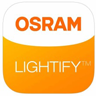

# IoBroker.lightify =========================
<!--
-->

## Описание ioBroker Adapter для [OSRAM Lightify](http://led.osram.de/led_de/lightify/index.jsp)
## Информация
Названия штатов вдохновлены адаптером Hue.

### Как использовать команду состояния:
* Возможные идентификаторы: `` красный, r, зеленый, g, синий, b, bri, sat, transition, on, off``
* Строка может быть JSON с круглыми скобками или без них.
* Вы также можете присвоить значение с помощью =
* Цветовая гамма: `` `0..255```
* Диапазон значений bri: `` 0..100``

Некоторые примеры:

```
r = 100; g = 250, b = 100
r: 0, g: 0, b = 255
red: 200, green: 0, blue: 0
{r:100, b: 200, transition: 20}
off
on
{on:0}
```

Чтобы изменить цвет, вам не нужно использовать все три значения.
Например, ``` red = 0 ```, синий и зеленый останутся без изменений.

### Требования
** OSRAM Lightify Gateway ** подключен через WLAN к вашей сети.

[OSRAM Lightify Gateway](http://www.amazon.de/s/ref=nb_sb_noss_1/278-8292784-8078566?__mk_de_DE=%C3%85M%C3%85%C5%BD%C3%95%C3%91&url=search-alias%3Daps&field-keywords=osram+lightify+gateway&rh=i%3Aaps%2Ck%3Aosram+lightify+gateway)

Пожалуйста, сначала настройте все устройства через приложение Lightify.

## Changelog
### 0.2.11 (2017.07.26)  
* (bluefox) fix of the discovery packet

### 0.2.10 (2017.07.17)  
* (soef) soef version set to 0.4.4  

### 0.2.8 (2017.07.15)  
* (bluefox) small changes  

### 0.2.7 (2017.07.13)
* (bluefox) small changes

### 0.2.6 
* (soef) command state added to group/zone devices

### 0.2.5 
* (soef) using version 0.2.2 of mnds-discover

### 0.2.4 
* (soef) started to optimize zone/group support

### 0.2.2 
* (soef) Discovery and browse now via mdns

### 0.2.0 
* (soef) refactoring of adapter

### 0.1.0
* (bluefox) refactoring

## License
The MIT License (MIT)

Copyright (c) 2016-2017 soef <soef@gmx.net>

Permission is hereby granted, free of charge, to any person obtaining a copy
of this software and associated documentation files (the "Software"), to deal
in the Software without restriction, including without limitation the rights
to use, copy, modify, merge, publish, distribute, sublicense, and/or sell
copies of the Software, and to permit persons to whom the Software is
furnished to do so, subject to the following conditions:

The above copyright notice and this permission notice shall be included in
all copies or substantial portions of the Software.

THE SOFTWARE IS PROVIDED "AS IS", WITHOUT WARRANTY OF ANY KIND, EXPRESS OR
IMPLIED, INCLUDING BUT NOT LIMITED TO THE WARRANTIES OF MERCHANTABILITY,
FITNESS FOR A PARTICULAR PURPOSE AND NONINFRINGEMENT. IN NO EVENT SHALL THE
AUTHORS OR COPYRIGHT HOLDERS BE LIABLE FOR ANY CLAIM, DAMAGES OR OTHER
LIABILITY, WHETHER IN AN ACTION OF CONTRACT, TORT OR OTHERWISE, ARISING FROM,
OUT OF OR IN CONNECTION WITH THE SOFTWARE OR THE USE OR OTHER DEALINGS IN
THE SOFTWARE.