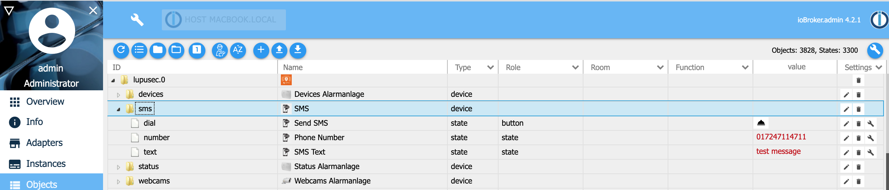

# IoBroker.lupusec
** Требуется node.js 10.0 или выше и Admin v3! **

Этот адаптер соединяет охранную систему Lupusec XT1 Plus, XT2, XT2 Plus и XT3 с ioBroker.
XT1 (без Plus) не будет поддерживаться. Вы можете прочитать состояние датчиков Lupusec, таких как двери, окна, вода, датчики дыма, а также состояние системы сигнализации.
Например, вы можете включать выключатели, управлять ставнями и включать / выключать охранную систему.

Вы можете найти подробную информацию здесь: [Волчанка](https://www.lupus-electronics.de/en)

## Монтаж
1. Установите адаптер.

Самый простой способ - настроить адаптер lupusec.iobroker через адаптер обнаружения в ioBroker. Адаптер обнаружения ищет правильный IP-адрес охранной системы Lupusec. Другой способ - настроить его вручную

2. Ручная настройка адаптера.

Выберите IP-адрес или имя хоста из системы охранной сигнализации Lupusec. Если возможно, выберите https (рекомендуется).
Для чтения статуса выберите пользователя без права записи. Если вы хотите изменить статус (например, включить / выключить свет или поставить / снять тревогу), выберите пользователя с правом записи.
 Если у вас есть камеры наблюдения, подключенные к вашей системе охранной сигнализации Lupusec, вы можете предоставить их в ioBroker. Адаптер Lupusec самостоятельно находит все кулачки Lupusec. Вы должны ввести адрес (ваш IP-адрес ioBroker или 0.0.0.0) и порт для последующего подключения к камерам.
 Если у вас есть открыватель дверей Nuki, подключенный к системе охранной сигнализации Lupusec, вы также можете использовать его в ioBroker. В административном меню экземпляра ioBroker вы можете ввести датчик двери Lupusec, который установлен на двери Nuki. Если вы теперь откроете дверь, на которой установлен Нуки, у вас будет дополнительное состояние «дверь открыта», а не только «разблокирована». Если у вас нет дверного датчика Lupusec на двери Nuki, вы увидите только состояния «заблокировано» или «заблокировано».


По умолчанию все устройства Lupusec будут отображаться на вкладке объекта ioBroker.
Полностью поддерживаются и индивидуально адаптированы следующие устройства:

  - Дверной контакт / оконный контакт (Тип 4)
  - Датчик воды (Тип 5)
  - тревожная кнопка (тип 7)
  - Детектор движения / детектор движения на 360 градусов (Тип 9)
  - Датчик CO (Тип 13)
  - Дымовой извещатель / тепловой извещатель (Тип 14)
  - Датчик температуры V2 (тип 20)
  - Сирена внутри (Тип 21)
  - Индикатор состояния / Внутренняя мини-сирена (тип 22)
  - Выключатель питания (тип 24)
  - 1-канальное реле с ретранслятором ZigBee (Тип 24)
  - 2-х канальное реле с ретранслятором ZigBee (Тип 24)
  - Repater V2 (Тип 26)
  - Клавиатура (Тип 37)
  - Стеклянный датчик (Тип 39)
  - Сирена внутри (Тип 45)
  - Сирена снаружи (Тип 48)
  - Измеритель мощности (тип 48)
  - Электросчетчик (Тип 50)
  - Универсальный ИК-контроллер (Тип 52)
  - Комнатный датчик V1 (Тип 54)
  - ЖК-датчик температуры (Тип 54)
  - Минимальная температура (Тип 54)
  - Устройство открывания двери Нуки (Тип 57)
  - Тепловой извещатель (Тип 58)
  - Диммер (Тип 66)
  - Выключатель света V2 (Тип 66)
  - Оттенок (Тип 74)
  - Реле рольставен В1 (Тип 76)
  - Радиаторный термостат (Тип 79)
  - Радиаторный термостат V2 (Тип 79)
  - Датчик освещенности (Тип 78)
  - Сценарий Switch V2 (Тип 81)
  - Датчик удара (Тип 93)
  - Детектор дыма В2 (Тип 14)
  - Встроенное реле с диммером V3 (Тип 66)
  - Клавиатура Outdoor V2 (Тип 17)

Два состояния: apple_home_a1 и lupusec.0.status.apple_home_a2 для поддерживаемого yahka адаптера Apple Homekit. Вы можете включить и выключить в дополнение к состояниям lupusec систему сигнализации для области 1 и 2.

Если у вас есть устройство, которого нет в списке выше, свяжитесь со мной по адресу Thorsten Stueben <thorsten@stueben.de>.

## Объекты
### Статус Lupusec
ioBroker предлагает те же объекты статуса, что и в приложении Lupusec.


### Устройства Lupusec
Вы найдете все поддерживаемые датчики и устройства Lupsec в разделе «Устройства». Если устройство отсутствует, свяжитесь со мной.
 Детальный вид датчика или устройства. В этом примере вы видите датчик CO. При тревоге CO состояние «alarm_status_ex» изменится на true, а «alarm_status» изменится на «CO».


### Веб-камеры Lupusec
Вы найдете все подключенные камеры наблюдения в разделе «Веб-камеры». Вы можете скопировать ссылку, предоставленную в состояниях «изображение» и «поток», в свой веб-браузер для открытия.


### Лупусек Нуки
Вы найдете открыватель дверей Nuki под «устройствами», такими как устройства Lupusec. В Нуки предусмотрено 2 состояния. Состояние nuki_state показывает текущее состояние открывателя дверей Nuki, например, дверь заблокирована или разблокирована. С помощью состояния nuki_action вы можете открывать, запирать или отпирать свою дверь.


### Lupusec SMS
Если вы используете Lupusec XT1 +, XT2 + или XT3 с сим-картой для SMS, вы можете отправлять SMS со следующими состояниями: 

В качестве альтернативы вы можете отправить SMS со своего JavaScript с помощью следующей команды:

```
sendTo('lupusec.0', 'sms', { number: '017247114711', text: 'Test message' });
```

если вы используете SMS-шлюз, вы можете использовать в своем скрипте следующую команду:

```
sendTo('lupusec.0', 'smsgw', { number: '017247114711', text: 'Test message' });
```

## Поиск проблемы
Если вы запускаете адаптер Lupusec и получаете сообщение об ошибке, что система охранной сигнализации недоступна, попробуйте выполнить эхо-запрос системы из окна терминала вашей системы ioBroker.

```
ssh <user>@<iobroker-ip-address>
sudo -u iobroker ping <lupsec-ip-address>
```

Если вы получаете сообщение об ошибке _ping: icmp open socket: Operation not allowed_, выполните следующие действия и снова запустите адаптер Lupusec.

```
ls -l `which ping`
sudo chmod u+s `which ping`
```

## Строганный
В будущем планируется:

* поддержка большего количества датчиков / устройств
* написание документации на каждый датчик / устройство

## Changelog

### 1.3.5 (24.04.2021)
* (Stübi) Add device keypad outdoor v2

### 1.3.4 (01.03.2021)
* (Stübi) Bugfixing

### 1.3.3 (17.02.2021)
* (Stübi) Bugfixing
* (Stübi) Send SMS with SMS gateway or SIM card

### 1.3.2 (14.02.2021)
* (Stübi) Send SMS if you are using a sim card

### 1.3.1 (07.02.2021)
* (Stübi) Add universal IR controller (type 52)

### 1.3.0 (03.10.2020)
* (Stübi) Reduce CPU Load
* (Stübi) Add local link to alarm system
* (Stübi) Bugfixing Issue #27 - bypass

### 1.2.9 (04.07.2020)
* (Stübi) Bugfixing

### 1.2.8 (10.06.2020)
* (Stübi) Add sentry mode
* (Stübi) Now you can hold the reason for the alarm in alarm_status and alarm_status till the alarm ends

### 1.2.7 (25.05.2020)
* (Stübi) Add token renew time to expert mode

### 1.2.6 (02.05.2020)
* (Stübi) Change logic to get faster sensor states
* (Stübi) Node 10 recommended 
* (Stübi) Add old Light sensor (type 78)

### 1.2.5 (21.01.2019)
* (Stübi) Change logic to get faster sensor states

### 1.2.4 (09.01.2019)
* (Stübi) Add device: temperature sensor v2

### 1.2.3 (06.09.2019)
* (Stübi) Add device: Repeater V2
* (Stübi) Add device: Siren inside (Battery version without Zigbee repeater)

### 1.2.1 (14.10.2019)
* (Stübi) Bugfixing (Issue #9)
* (Stübi) Bugfixing: if the name of a device is empty, the name was changed all the time between NaN and ''  

### 1.2.0 (13.09.2019)
* (Stübi) Changing error handling of adapter
* (Stübi) Add Nuki door opener

### 1.1.9 (06.09.2019)
* (Stübi) Add device: Smoke detector V2
* (Stübi) Add device: Inwall relay with dimmer V3

### 1.1.8 (10.06.2019)
* (Stübi) Add device: 360 PIR motion sensor
* (Stübi) Add device: electric meter
* (Stübi) Add device: LCD temperature sensor
* (Stübi) Add device: mini temperature sensor

### 1.1.7 (06.05.2019)
* (Stübi) Enhancement: optimizing webcam support

### 1.1.6 (01.05.2019)
* (Stübi) New feature: you can change the buttons for keypad
* (Stübi) New feature: add push notifications to sensors
* (Stübi) New feature: change switch from switch to push button 
* (Stübi) New feature: now you can change status for tamper, bypass and reporting for sensors
* (Stübi) New feature: Webcam support. You can get the link of Lupusec provided webcams.
* (Stübi) New feature: you can edit the on/off timer for shutters 
* (Stübi) New feature: Discription of states are now in English or German available
* (Stübi) Bugfixing: HUE and saturation of HUE devices fixed 
* (Stübi) Bugfixing: Add role to button 4 of scenario switch.  

### 1.1.5 (24.04.2019)
* (Stübi) New feature: Add buttons for Scenario Switch V2
* (Stübi) Bugfixing: Various improvements

### 1.1.4 (13.04.2019)
* (Stübi) Add device outside alarm
* (Stübi) Add device inside alarm
* (Stübi) Add device PIR motions sensor V2
* (Stübi) Add device glass sensor

### 1.1.3 (10.04.2019)
* (Stübi) New Logo
* (Stübi) Add device Panic Button
* (Stübi) Add status indicator 
* (Stübi) Add sensor Heat detector
* (Stübi) Add shock sensor 
* (Stübi) Add Light Switch V2
 
### 1.1.2 (06.04.2019)
* (Stübi) Add light sensor 
* (Stübi) Add CO sensor
* (Stübi) Add water sensor V2
* (Stübi) Add Radiator thermostat V2
* (Stübi) Add 1 channel relay with ZigBee repeater (Type 24)
* (Stübi) Add 2 channel relay with ZigBee repeater (Type 24)
* (Stübi) If you change the sensor name in the Lupusec App, it will be change in ioBroker too 
* (Stübi) Bugfixing Radiator thermostat V1/V2
* (Stübi) Bugfixing Dimmer
* (Stübi) Bugfixing PD Status (Timer) for relay, power switch
* (Stübi) Bugfixing status switch for rollter/shutter device

### 1.1.1 (27.03.2019)
* (Stübi) Lupusec alarm online status added

### 1.1.0 (23.03.2019)
* (Stübi) Totally redesign of the Lupusec adapter. Node 8 or higher is now required

### 1.0.0 (22.12.2018)
* (Stübi) Support js-controller compact mode
* (Stübi) Changed core adapter
* (Stübi) Add Light sensor (type 78)
* (Stübi) Add Apple home alarm status
* (Stübi) Add dimmer / relais (type 66)
* (Stübi) Bugfixing and new status alarm_ex
* (Stübi) Bugfixing and changing of the polling mechanism
* (Stübi) password will be encrypted. Translation of configuration
* (Stübi) add debug messages
* (Stübi) Hue, room sensor, power switch added
* (Stübi) Fixing error update function
* (Stübi) Improvements and new add/del/update Object function
* (Stübi) Changes of roles and icons added to devices
* (Stübi) Wrong device description removed
* (Stübi) RSSI Status an Device shutter (type 76) supported
* (Stübi) Devices thermostat (type 79) and switch (type 48) supported
* (Stübi) Directory widged deleted
* (Stübi) Port can be added

## License
The MIT License (MIT)

Copyright (c) 2019-2021 Thorsten Stueben <thorsten@stueben.de>

Permission is hereby granted, free of charge, to any person obtaining a copy
of this software and associated documentation files (the "Software"), to deal
in the Software without restriction, including without limitation the rights
to use, copy, modify, merge, publish, distribute, sublicense, and/or sell
copies of the Software, and to permit persons to whom the Software is
furnished to do so, subject to the following conditions:

The above copyright notice and this permission notice shall be included in
all copies or substantial portions of the Software.

THE SOFTWARE IS PROVIDED "AS IS", WITHOUT WARRANTY OF ANY KIND, EXPRESS OR
IMPLIED, INCLUDING BUT NOT LIMITED TO THE WARRANTIES OF MERCHANTABILITY,
FITNESS FOR A PARTICULAR PURPOSE AND NONINFRINGEMENT. IN NO EVENT SHALL THE
AUTHORS OR COPYRIGHT HOLDERS BE LIABLE FOR ANY CLAIM, DAMAGES OR OTHER
LIABILITY, WHETHER IN AN ACTION OF CONTRACT, TORT OR OTHERWISE, ARISING FROM,
OUT OF OR IN CONNECTION WITH THE SOFTWARE OR THE USE OR OTHER DEALINGS IN
THE SOFTWARE.