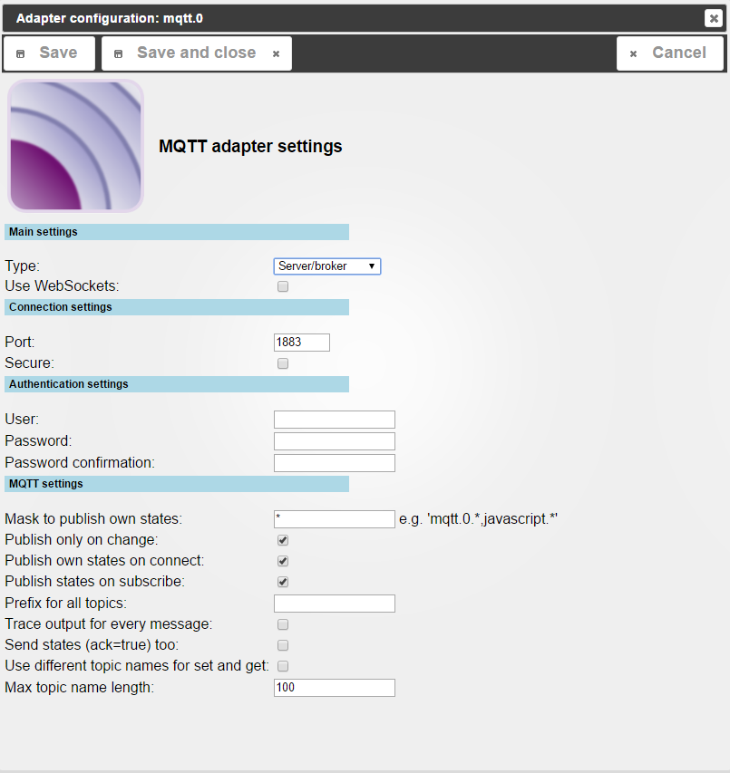
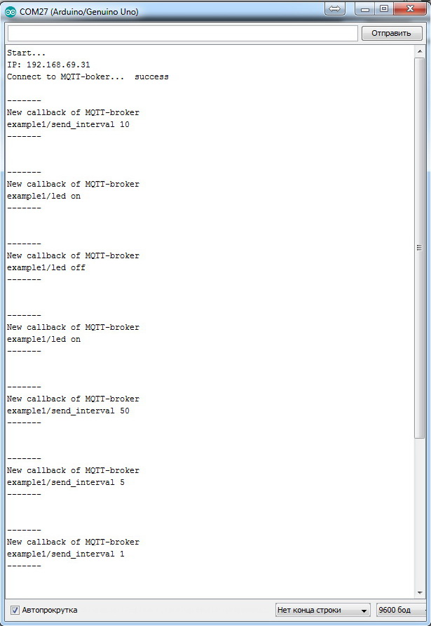
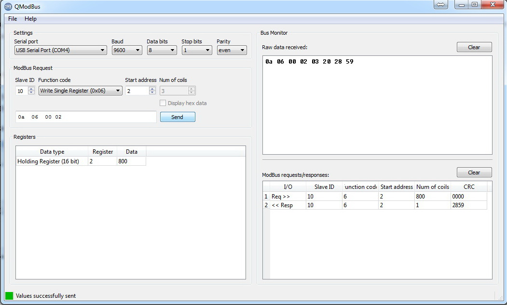
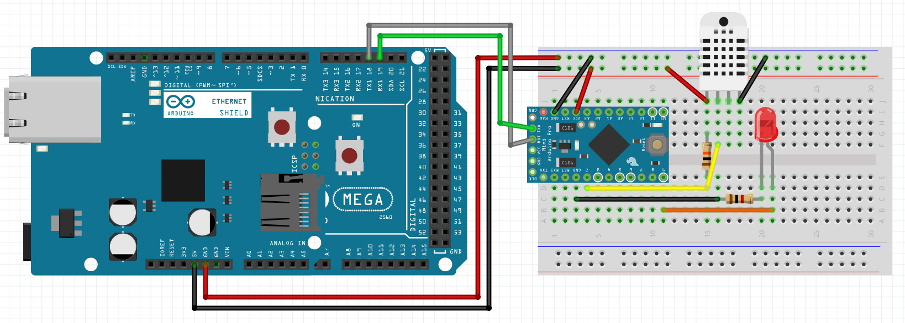
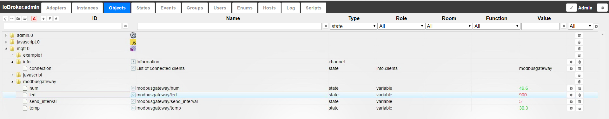
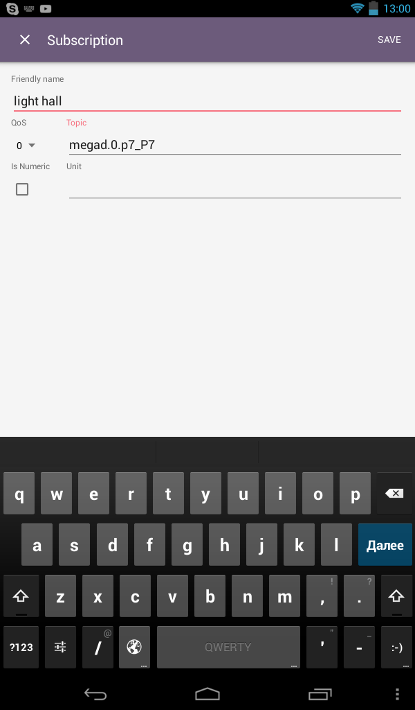

# MQTT Сервер и Клиент
## Описание
[MQTT](http://mqtt.org/) (Телеметрический транспорт очереди сообщений) - это упрощенный протокол, используемый для связи между устройствами (M2M - от компьютера к компьютеру).
Он использует модель издателя-подписчика для отправки сообщений по протоколу TCP / IP.
Центральная часть протокола - MQTT-сервер или брокер, имеющий доступ к издателю и подписчику. Этот протокол очень примитивен: короткий заголовок, без целостности (поэтому передача осуществляется поверх TCP), не накладывает никаких ограничений на структуру, кодирование или схему базы данных. Единственное требование к данным в каждом пакете - они должны сопровождаться идентификатором информационного канала. Эта спецификация идентификатора называется названием темы.

Протокол MQTT требует брокера данных. Это центральная идея технологии. Все устройства отправляют данные только брокеру и получают данные также только от него. После получения пакета брокер отправляет его на все устройства в сети в соответствии с их подпиской. Чтобы устройство получило что-то от брокера, оно должно подписаться на тему. Темы возникают динамически при подписке или по прибытии пакета с этой темой. Подписавшись на тему, вы можете отказаться. Таким образом, темы являются удобным механизмом для организации различных видов отношений: один ко многим, многие к одному и многие ко многим.

**Важные моменты:**

* устройства сами устанавливают связь с брокером, могут находиться за NAT и не иметь статических IP-адресов
* вы можете использовать SSL для шифрования трафика,
* MQTT-брокеры позволяют вам подключаться к ним через протокол WebSocket через порт 80,
* разные брокеры могут быть связаны, подписываясь на сообщения друг от друга.

## Монтаж
Установка осуществляется на закладке **Драйвер** в [система администрирования](http://www.iobroker.net/?page_id=4179&lang=en).
В группе драйверов **Network** найдите строку с именем **MQTT Adapter** и нажмите кнопку со значком плюса в правой части строки.

Вы увидите всплывающее окно установки драйвера, после установки оно автоматически закроется.

Если все идет хорошо, на вкладке **Настройки драйвера** появляется **mqtt.0** установленный экземпляр драйвера.

## Настройка
Как указано выше, протокол MQTT подразумевает посредника и клиентов. Сервер ioBroker может выступать в роли брокера и клиента.
Настройка для указания режима работы - тип (сервер / брокер или клиент / подписчик). Рассмотрим каждый вариант.

### IoBroker работает как MQTT-брокер
Основные настройки, если вы собираетесь использовать сервер / брокера, показаны на рисунке:

* **Использовать WebSockets** - если для подключения необходимо использовать WEB-сокеты, необходимо установить эту опцию, при этом TCP-сервер будет работать параллельно с сервером WebSocket,
* **Порт** - порт для подключения по TCP (по умолчанию 1883), сервер WebSocket (см. Параметр выше) работает на порту +1 (по умолчанию: 1884),
* **SSL** - эта опция используется, если вы хотите зашифровать весь трафик (TCP или WebSocket), поэтому необходимо указать сертификаты - просто выберите из списка предустановок (указанных в настройках системы, см. [описание драйвера управления системой] (http://www.iobroker.net/?page_id=4179&lang=en)),
* **настройки аутентификации** (имя пользователя и пароль) - укажите, при необходимости, конкретную аутентификацию пользователя, этот параметр всегда используется в сочетании с опцией SSL-шифрования (не для передачи паролей в виде открытого текста через незащищенное соединение)
* **Маска закрытых значений** - шаблон (или несколько разделенных запятыми) для фильтрации переменных ioBroker, которые будут отправлены клиенту; вы можете использовать специальные символы для указания группы сообщений (например, `memRSS, mqtt .0` - могут быть переданы все переменные состояния памяти всех драйверов и все **переменные экземпляра драйвера mqtt.0** ,
* **Отправлять только изменения** - отправка данных клиенту будет производиться только в случае изменения переменной (если состояние просто обновляется - значение не изменяется, сообщение клиента не будет отправлено) с клиента будет принято любое сообщение, даже если значение не изменилось,
* **Для предоставления приватных значений при запуске** - для каждого успешного подключения клиент будет переведен во все известные состояния (определяемые состоянием маски) - чтобы сообщить клиенту о текущем состоянии ioBroker,
* **Состояние подписки подписывается** - сразу после того, как подписка будет отправлена клиенту, значение переменной, на которую она подписана (при первом запуске или перезапуске клиент получит значения переменных, на которые она подписана, использоваться для инициализации переменных),
* **Префикс для всех значений** - если указанное значение будет добавлено в качестве префикса к каждой отправляемой теме, например, если вы укажете iobroker /, то все темы будут отправлены в следующих строках: `iobroker / mqtt / 0 / connected`,
* **Выходной журнал для каждого изменения** - в файле журнала будет отображаться информация об отладке для каждого изменения,
* **Для отправки не только команд, но и состояния (ack = true)** - если эта опция не активна, клиент будет отправлять только переменные / команды с ack = false, если флаг установлен, переменные будут быть переданным независимо от состояния подтверждения (false / true),
* **Максимальная длина названия темы** - максимальное количество символов для описания темы, включая сервис.

В качестве примера рассмотрим обмен данными между клиентом на основе [доска Arduino](https://www.arduino.cc/), а брокер является экземпляром системы драйверов mqtt.0 ioBroker.

* - клиент - плата за разработку [arduino UNO] (https://www.arduino.cc/en/Main/ArduinoBoardUno) + [ethernet shield] (https://store.arduino.cc/product/A000072) на основе чипа W5100,
* - для работы с платой Ethernet используется стандартная библиотека [https://www.arduino.cc/en/Reference/Ethernet] для работы с библиотекой MQTT [Pubsubclient] (https://github.com/knolleary/ pubsubclient),
* - датчик AM2302 (температура и влажность), подключенный к pin_8 для опроса, использовал библиотеку с DHTlib с [DHTlib] (https://github.com/RobTillaart/Arduino/tree/master/libraries/DHTlib) ресурс github.com,
* - светодиод **led_green** подключен к контакту 9, управление в дискретном режиме вкл / выкл
* - брокер - системный драйвер ioBroker mqtt.

Формат темы обмена данными:

* `example1 / send_interval` - клиент, подписанный для изменения интервала передачи показаний температуры и влажности (значение int в секундах),
* `example1 / temp` - клиент публикует указанный температурный интервал с датчиком DHT22 (тип с плавающей запятой),
* `example1 / hum` - клиент публикует заданные интервалы значений влажности с датчиком DHT22 (тип float),
* `example1 / led` - клиент подписывается на изменение состояния светодиода (текст on / off или 0/1 или true / false).

Настройки драйвера будут следующими:

Подключение через TCP (WebSocket не требуется), порт по умолчанию 1883 \. Клиент внутри локальной сети, поэтому для шифрования трафика и аутентификации пользователя нет необходимости. Мы будем отправлять только изменения, поскольку клиент, подписанный с указанием интервала отправки и состоянием водителя для получения информации об обновлении (без изменения значения), не имеет смысла. Чтобы опубликовать подписку - отметьте эту опцию, так как при первом подключении (или подключении после отключения) клиента он должен знать состояние переменных, на которые он подписан (текущий интервал отправки и должен ли индикатор включенный). Также стоит отметить настройку отправки переменных ack = true или false, поскольку переменная (подписавшая клиента) может изменить любой драйвер / скрипт / VIS, и любые изменения должны быть отправлены клиенту. Полный код платы Arduino будет выглядеть так:

<pre> // Подключение библиотек

#включают
#включают
#include //https://github.com/knolleary/pubsubclient
#include //https://github.com/RobTillaart/Arduino/tree/master/libraries/DHTlib // Настройки сетевого байта mac [] = {0xAB, 0xBC, 0xCD, 0xDE, 0xEF, 0x31}; байт ip [] = {192, 168, 69, 31}; // байт IP-адреса платы Arduino mqttserver [] = {192, 168, 69, 51}; // IP-адрес сервера ioBroker
EthernetClient ethClient; void обратный вызов (char *topic, byte* payload, unsigned int length); Клиент PubSubClient (mqttserver, 1883, обратный вызов, ethClient);

// Глобальные переменные

#define LED_pin 9 unsigned int send_interval = 10; // интервал отправки показаний на сервер, по умолчанию 10 секунд unsigned long last_time = 0; // текущее время для таймера dht DHT;
#define DHT22_PIN 8 char buff [20];
// Функция обработки входящих соединений - получение данных по обратному обратному вызову подписки (char * topic, byte * payload, unsigned int length) {Serial.println (""); Serial.println ( "-------"); Serial.println («Новый обратный вызов MQTT-брокера»); // давайте преобразуем тему (topic) и значение (payload) в строку payload [length] = '\ 0'; String strTopic = String (тема); String strPayload = String ((char *) payload); // исследуем, что «поступило» с сервера по подписке :: // Изменение интервала запроса if (strTopic == "example1 / send_interval") {int tmp = strPayload.toInt (); if (tmp == 0) {send_interval = 10; } else {send_interval = strPayload.toInt (); }} // Управление светодиодом if (strTopic == "example1 / led") {if (strPayload == "off" || strPayload == "0" || strPayload == "false") digitalWrite (LED_pin, LOW ); if (strPayload == "on" || strPayload == "1" || strPayload == "true") digitalWrite (LED_pin, HIGH); } Serial.print (strTopic); Serial.print (""); Serial.println (strPayload); Serial.println ( "-------"); Serial.println ( ""); }

void setup () {Serial.begin (9600); Serial.println ( "Пуск ..."); // начать сетевое соединение Ethernet.begin (mac, ip); Serial.print («IP:»); Serial.println (Ethernet.localIP ()); // инициализируем порты ввода / вывода, регистрируем начальные значения pinMode (LED_pin, OUTPUT); digitalWrite (LED_pin, LOW); // когда светодиод не горит}

void loop () {// Если MQTT-соединение неактивно, то мы пытаемся его установить и опубликовать / подписать if (! client.connected ()) {Serial.print ("Connect to MQTT-boker ..."); // Подключаемся и публикуем / подписываемся if (client.connect ("example1")) {Serial.println ("success"); // Значение от датчиков if (DHT.read22 (DHT22_PIN) == DHTLIB_OK) {dtostrf (DHT.humidity, 5, 2, buff); client.publish ("example1 / hum", buff); dtostrf (температура DHT, 5, 2, бафф); client.publish ("example1 / temp", buff); } // подписаться на интервал запроса client.subscribe ("example1 / send_interval"); // подписаться на управляющую переменную LED client.subscribe ("example1 / led"); } else {// Если соединение не было, мы подождем 10 секунд и попробуем снова Serial.print ("Failed, rc ="); Serial.print (client.state ()); Serial.println («повторите попытку через 10 секунд»); Задержка (10000); } // Если соединение активно, то отправляет данные на сервер с указанным интервалом времени} else {if (millis () & gt; (last_time + send_interval * 1000)) {last_time = millis (); if (DHT.read22 (DHT22_PIN) == DHTLIB_OK) {dtostrf (DHT.humidity, 5, 2, buff); client.publish ("example1 / hum", buff); dtostrf (температура DHT, 5, 2, бафф); client.publish ("example1 / temp", buff); }}} // Проверка входящих соединений по подписке client.loop (); } </ pre>

Результат части брокера (данные о температуре и влажности обновляются с заданным периодом времени):

Результат на стороне клиента (входящие данные подписки выводятся на консоль для отладки):

### IoBroker работает как MQTT-клиент
Для экземпляра драйвера MQTT, заработанного как клиент / подписчик - вам нужно выбрать соответствующий тип конфигурации.
В этом наборе параметры немного изменятся:

* **Параметры подключения** - указывает URL и порт брокера (если вы хотите зашифровать трафик, указывается SSL) - параметры для подключения к брокеру
* **Настройки аутентификации** - имя пользователя и пароль, если брокер требует аутентификации (целесообразно использовать SSL, чтобы избежать передачи пароля в виде открытого текста)
* **Patterns** - маска для переменных, на которые подписывается клиент (посредник переменных), значения перечислены через запятую, # (фунт) используется для обозначения набора,
* **Маска частных значений** - фильтровать переменные, которые должны быть опубликованы (клиентские переменные), значения которых перечислены через запятую, для обозначения набора используйте символ * (звездочка),
* **Для отправки только изменений** - клиент будет публиковать только переменные, которые изменили значение (согласно маске),
* **Для предоставления приватных значений при запуске** - если эта опция включена, будут публиковаться все состояния (в соответствии с маской) каждый раз, когда устанавливается соединение, для объявления доступных переменных и их значений
* **Префикс для всех значений** - если указанное значение будет добавлено в качестве префикса к каждой опубликованной теме, например, если вы укажете client1 /, то во всех темах будут опубликованы следующие строки: JavaScript / 0 / cubietruck`,
* **Выходной журнал для каждого изменения** - в файле журнала будет отображаться информация об отладке для каждого изменения,
* **Для отправки не только команды, но и состояния (ack = true)** - если эта опция не отмечена, брокер отправляет только переменные / команды с ack = false, если указана опция, которая будет отправлена ко всем данным, независимо от ack = true или ack = false,
* **Максимальная длина темы** - максимальное количество символов для описания темы, включая сервис.

Примеры настройки переменных маски подписки (шаблонов). Рассмотрим темы:

* "Спорт"
* "Спорт / Теннис"
* "Спорт / Баскетбол"
* "Спорт / Плавание"
* "Спорт / Теннис / Финал"
* «Спорт / Баскетбол / Финал»
* "Спорт / Плавание / Финал"

Если вы хотите подписаться на определенный набор тем, вы можете использовать символы # (знак фунта) или + (знак плюс).

* «Спорт / Теннис / #» (только подписка «Спорт / Теннис» и «Спорт / Теннис / Финал»)
* «Спорт / Теннис / +» (только подписка «Спорт / Теннис / Финал», но не «Спорт / Теннис»)

Для тем JMS, если вы хотите подписаться на все темы «Финал», вы можете использовать символы # (знак фунта) или + (знак плюс)

* "Спорт / # / Финал"
* "Спорт / + / Финал"

Для тем MQTT, если вы хотите подписаться на все темы «Финал», вы можете использовать знак + (плюс)

* "Спорт / + / Финал"

В качестве примера рассмотрим обмен данными между двумя системами ioBroker. Есть работающая система ioBroker для BananaPi-Board (IP-адрес 192.168.69.51), она запустила MQTT-драйвер в режиме сервер / брокер из примера выше.
К серверу подключается клиент, который публикует данные с датчика DHT22 - температуру и влажность, а также подписанные переменные измерения интервала передачи и состояния светодиодов (включить / отключить) - в примере выше.
Вторая операционная система ioBroker на плате Cubietruck, она будет запускать драйвер MQTT в режиме клиент / подписчик.
Он подписывается на переменные температуры и влажности брокера (который, в свою очередь, получает от другого клиента) и опубликует все переменные скрипта - [состояние батареи](http://www.iobroker.net/?page_id=4268&lang=ru#_Li-polLi-ion) board (только изменения). Конфигурация клиента будет похожа на следующую:

Тип подключения - клиент / подписчик указывает IP-адрес брокера и порт (по умолчанию 1883).
Шифрование и аутентификация трафика не нужны.

Маска для подписок (Шаблоны) - `mqtt/0/example1/hum,mqtt/0/example1/temp` - клиент подписывается только по температуре и влажности (значения разделяются запятой без пробелов).

Маскируйте данные для публикации - `javascript.0.cubietruck.battery.*` - опубликуйте все переменные скрипта `cubietruck` в группе `battery` driver `javascript.0`.

Чтобы отправить только изменения - отправьте переменные состояния батареи (нет смысла отправлять, если значение не изменилось). Чтобы дать приватные значения при запуске - при запуске драйвера, клиент немедленно освободит все переменные в соответствии с маской - даже если они равны нулю или пусты для создания переменных в брокере.

Для отправки данных с ack = false, переменные работают от батареи обновленного javascript драйвера, поэтому они всегда имеют ack = false. Результат работы на стороне клиента (данные о температуре и влажности другого клиента - см. Пример выше):

Результат работы брокера (данные о состоянии батареи клиента):

## Приложение - протоколы шлюза MQTT - ModBus RTU
Драйвер MQTT может использоваться в качестве шлюза для различных протоколов для подключения новых устройств к системе ioBroker или любому другому. Универсальной основой для разработки таких решений являются платы Arduino. В сети много примеров, библиотек и лучших практик. Огромное сообщество работает с этими контроллерами, и в систему интегрированы различные устройства / оборудование / устройства.

Например, рассмотрим общепромышленный протокол ModBus. В системе ioBroker есть драйвер для работы с ним - версия ModBus TCP (over ethernet). Набор датчиков, контроллеров и исполнительных механизмов физически работает по протоколу RS-485 Network / 232 и ModBus RTU.
Для их интеграции может быть применен MQTT Gateway - ModBus RTU на платформе Arduino. Рассмотрим пример.

** Имеется датчик температуры и влажности ** (для тестирования на базе платы Arduino Pro Mini DHT22 Sensor), который выводит данные через ModBUS RTU:

* Порт UART (вы можете использовать чип MAX485 для преобразования интерфейса RS-485), работающий на 9600 с опциями 8E1 (1 стартовый бит, 8 бит данных, 1 четный бит четности, 1 стоповый бит)
* адрес ModBus - 10,
* температурный адрес 0, значение умноженное на 10 (функция считывателя 3),
* влажность - значение адреса 1, умноженное на 10 (функция чтения 3),
* Значение адреса СИД 2 ШИМ 0 ... 1023 для проверки функции записи (функция записи 6).

Схема подключения:

 от Fritzing

Код для контроллера Arduino Pro Mini производит следующее:

<pre>

#include //https://github.com/RobTillaart/Arduino/tree/master/libraries/DHTlib
#include //https://code.google.com/archive/p/simple-modbus/
#include //https://github.com/PaulStoffregen/MsTimer2 // modbus регистрирует enum {TEMP, HUM, PWM, TEST, HOLDING_REGS_SIZE};
#define ID_MODBUS 10 // адрес Modbus подчиненного устройства без знака int holdingRegs [HOLDING_REGS_SIZE]; // регистр Modbus // датчик температуры и влажности DHT22 dht DHT;
#define DHT22_PIN 2
#define LED 9 // LED подключен к PWM pin-9 void setup () {// настроить modbus_configure (& Serial, 9600, SERIAL_8E1, ID_MODBUS, 0, HOLDING_REGS_SIZE, holdingRegs); holdingRegs [TEST] = -157; // для проверки отрицательных значений // инициализировать таймер на 2 секунды обновить данные в регистрах температуры и влажности MsTimer2 :: set (2000, read_sensors); MsTimer2 :: начать (); // запустить таймер pinMode (LED, OUTPUT); // инициализация порта светодиода} // функция, запускаемая таймером каждые 2 секунды в реестре влажности холдинг Regs [HUM] = 10 *DHT.humidity; // записываем целочисленное значение в регистр температуры holdingRegs [TEMP] = 10* DHT.tempera; } else {// если не удалось прочитать данные с датчика DHT22, мы записываем ноль в регистры holdingRegs [HUM] = 0; holdingRegs [TEMP] = 0; }} void loop () {modbus_update (); // обновление данных Modbus // передача данных из регистра управления светодиодом в ШИМ (сдвиг битов на 2 бита) analogWrite (LED, holdingRegs [PWM] >> 2); } </ pre>
Чтобы проверить код операции и схему, можно подключить к порту последовательную плату (например, с помощью USB-UART Converter) и специальную программу для опроса только что выполненного датчика температуры и влажности с интерфейсом ModBus RTU.
Для опроса могут быть использованы, например, [qmodbus](http://qmodbus.sourceforge.net/) или любая другая программа.

Настройки:

- порт (выберите из списка, какой порт подключен к последовательным платам Arduino);
- скорость и другие параметры - 9600 8Е1;
- идентификатор ведомого: 10, чтение: функция № 3, чтение регистров хранения, начальный адрес: 0, количество регистров: 3,
- идентификатор ведомого: 10, запись: функция № 6, запись начального адреса одного регистра: 2,

Ответ в программе при чтении должен быть примерно следующим:

Ответ в программе при записи:

** Теперь настройте сам шлюз и подключите его к iobroker **

Шлюз будет основан на платформе Arduino MEGA 2560 с сетевым экраном - клиент MQTT, брокер - экземпляр системного драйвера iqBroker mqtt.0.
Выбор MEGA 2560 обусловлен тем, что на этой плате более одного порта UART соответственно равен нулю Serial0 (pin_0 (RX) и pin_1 (TX)) или просто Serial - используется для вывода отладочных сообщений, а Serial1 (pin_19 (RX) ) и pin_18 (TX)) - для ведомого через ModBus.

* клиент - плата за разработку Arduino MEGA 2560 + ethernet shield на базе чипа W5100;
* для работы с платой Ethernet используется [стандартная библиотека] (https://www.arduino.cc/en/Reference/Ethernet)

  для работы с библиотекой MQTT [Pubsubclient](https://github.com/knolleary/pubsubclient);

* для опроса по Modbus используйте библиотеку [SimpleModbus] (https://code.google.com/archive/p/simple-modbus/) master версии;
* опрос по порту UART (просто подключите ведущий RX-порт, подчиненный TX-порт и, соответственно, ведущий TX-порт, ведомый RX-порт), порт управления передачей не используется (это для RS-485);
* настройки порта: скорость 9600, 8Е1;
* адрес подчиненного устройства 10, функция чтения № 3 (чтение регистров хранения), функция записи №. 6 (запишите единый регистр);
* брокер - системный драйвер ioBroker mqtt.

Формат темы обмена данными:

* `modbusgateway / send_interval` - клиент, подписанный для изменения интервала передачи показаний температуры и влажности (значение int в секундах),
* `modbusgateway / temp` - клиент публикует с заданным интервалом значение датчика температуры DHT22 (тип float),
* `modbusgateway / hum` - клиент публикует с заданным интервалом значение датчика влажности DHT22 (тип float),
* `modbusgateway / led` - клиент подписан на изменение состояния светодиода (значение управления ШИМ 0 ... 1024).

Схема подключения будет выглядеть примерно так:

Для проверки ведомого устройства под напряжением от ведущего устройства. Мастер, в свою очередь, будет работать с портом USB, который отлаживается (Serial0).
Настройки драйвера будут следующими:

Подключение через TCP (WebSocket не требуется), порт по умолчанию 1883 \. Клиент внутри локальной сети, поэтому для шифрования трафика и аутентификации пользователя нет необходимости. Мы будем отправлять только изменения, поскольку клиент, подписанный с указанием интервала отправки и состоянием водителя для получения информации об обновлении (без изменения значения), не имеет смысла. Чтобы опубликовать подписку - отметьте эту опцию, так как при первом подключении (или подключении после отключения) клиента он должен знать состояние переменных, на которые он подписан (текущий интервал отправки и должен ли индикатор включенный). Также стоит отметить настройку отправки переменных ack = true или false, поскольку переменная (подписавшая клиента) может изменить любой драйвер / скрипт / VIS, и любые изменения должны быть отправлены клиенту. Полный код платы Arduino будет выглядеть так:

<pre class=""> // Подключение библиотек

#включают
#включают
#include //https://github.com/knolleary/pubsubclient
#include //https://github.com/RobTillaart/Arduino/tree/master/libraries/DHTlib
// Настройки сетевого байта mac [] = {0xAB, 0xBC, 0xCD, 0xDE, 0xEF, 0x31}; байт ip [] = {192, 168, 69, 31}; // байт IP-адреса платы Arduino mqttserver [] = {192, 168, 69, 51}; // IP-адрес сервера ioBroker EthernetClient ethClient; void обратный вызов (char *topic, byte* payload, unsigned int length); Клиент PubSubClient (mqttserver, 1884, обратный вызов, ethClient); // Глобальные переменные unsigned int send_interval = 10; // интервал отправки показаний на сервер, по умолчанию 10 секунд unsigned long last_time = 0; // текущее время для таймера dht DHT;

#define DHT22_PIN 8 char buff [20];
// Функция обработки входящих соединений - получение данных по обратному обратному вызову подписки (char * topic, byte * payload, unsigned int length) {Serial.println (""); Serial.println ( "-------"); Serial.println («Новый обратный вызов MQTT-брокера»); // давайте преобразуем тему (topic) и значение (payload) в строку payload [length] = '\ 0'; String strTopic = String (тема); String strPayload = String ((char *) payload); // Исследование того, что «поступило» с сервера по подписке: // Изменение интервала запроса if (strTopic == "example2 / send_interval") {int tmp = strPayload.toInt (); if (tmp == 0) {send_interval = 10; } else {send_interval = strPayload.toInt (); }} Serial.print (strTopic); Serial.print (""); Serial.println (strPayload); Serial.println ( "-------"); Serial.println ( ""); }

void setup () {Serial.begin (9600); Serial.println ( "Пуск ..."); // начать сетевое соединение Ethernet.begin (mac, ip); Serial.print («IP:»); Serial.println (Ethernet.localIP ()); // инициализируем порты ввода / вывода, регистрируем начальные значения}

void loop () {// Если MQTT-соединение неактивно, то мы пытаемся его установить и опубликовать / подписать if (! client.connected ()) {Serial.print ("Connect to MQTT-boker ..."); // Подключаемся и публикуем / подписываемся if (client.connect ("example2")) {Serial.println ("success"); // Значение от датчиков if (DHT.read22 (DHT22_PIN) == DHTLIB_OK) {dtostrf (DHT.humidity, 5, 2, buff); client.publish ("example2 / hum", buff); dtostrf (температура DHT, 5, 2, бафф); client.publish ("example2 / temp", buff); } // Подписаться на интервал запроса client.subscribe ("example2 / send_interval"); } else {// Если соединение не было, мы подождем 10 секунд и попробуем снова Serial.print ("Failed, rc ="); Serial.print (client.state ()); Serial.println («повторите попытку через 10 секунд»); Задержка (10000); } // Если соединение активно, то отправляет данные на сервер с указанным интервалом времени} else {if (millis () & gt; (last_time + send_interval * 1000)) {last_time = millis (); if (DHT.read22 (DHT22_PIN) == DHTLIB_OK) {dtostrf (DHT.humidity, 5, 2, buff); client.publish ("example2 / hum", buff); dtostrf (температура DHT, 5, 2, бафф); client.publish ("example2 / temp", buff); }}} // Проверка входящих соединений по подписке client.loop (); } </ pre>

Это решение можно использовать в качестве прототипа (примера) сети ModBus в вашей системе автоматизации. Данные от ведомого устройства передаются с желаемым интервалом в ioBroker.

MQTT-клиент подписал переменные и перенаправления, необходимые в подчиненном устройстве в сети ModBus

## Приложение - подключение мобильных клиентов
В последнее время протокол MQTT стал очень распространенным из-за простоты, экономии трафика и разработки хороших библиотек для различных платформ.
Существует много программ для работы с MQTT на мобильных устройствах, например, [IoT MQTT Dashboard](https://play.google.com/store/apps/details?id=com.thn.iotmqttdashboard&hl=en).
С помощью этой программы вы можете подключиться к брокеру MQTT в локальной сети или в Интернете.

Рассмотрим пример, в роли брокера будет система ioBroker, к которой с помощью MQTT подключается клиент - приложение IoT MQTT Dashboard.

В этом примере мы управляем контроллером освещения [MegaD-328](http://www.ab-log.ru/smart-house/ethernet/megad-328), который подключен к ioBroker с драйвером [MegaD](http://www.iobroker.net/?page_id=4052&lang=en).
Управляет реле (порт MegaD **P7** подсветкой в лобби, специальным скриптом, который подписывается состоянием порта - кнопкой **P0** и состоянием переменной MQTT **mqtt.0.remotectrl.light .hall** который опубликует мобильный клиент.
Этот скрипт переключает состояние порта, который связан с коммутатором (порт P7), то есть инвертирует его.

Оказывается, что каждый раз, когда вы нажимаете кнопку, электрически подключается к порту **P0** (перехватывает состояние **true** и каждый раз, когда вы публикуете значение переменной **mqtt.0.remotectrl.light.hall** как **true** порт **P7** для включения или выключения света.
Текст сценария будет выглядеть так:

<pre> // Управление освещением в зале с помощью кнопки p0 порта контроллера MegaD на экземпляре драйвера megad.0 on ({id: &#39;megad.0.p0_P0&#39;, change: &#39;any&#39;}, function (obj) { if (obj.newState.val! = = &#39;&#39; || typeof obj.newState.val! = = &quot;undefined&quot;) {if (obj.newState.val == = true) {if (getState (&#39;megad.0. p7_P7 &#39;). val == = true) {setState (&#39; megad.0.p7_P7 &#39;, false);} else {setState (&#39; megad.0.p7_P7 &#39;, true);}}}}); // Управление освещением в зале удаленно на MQTT, тема «mqtt.0.remotectrl.light.hall» включена ({id: &#39;mqtt.0.remotectrl.light.hall&#39;, change: &#39;any&#39;}, функция (obj) {if (obj.newState.val! = = &#39;&#39; || typeof obj.newState.val! = = &quot;undefined&quot;) {if (obj.newState.val == = true) {if (getState (&#39; megad.0.p7_P7 &#39;). val == = true) {setState (&#39; megad.0.p7_P7 &#39;, false);} else {setState (&#39; megad.0.p7_P7 &#39;, true);}}}}); </pre>

Подключите кнопку и лампочки к контроллеру MegaD:

Настройки драйвера MQTT:

Мобильный клиент может публиковать данные в переменной mqtt.0.remotectrl.light.hall и подписываться на реальный статус порта MegaD - megad.0.p7_P7.

Настроить публикацию и подписку:

Всего за один канал управления освещением включите окно управления (публикация) и окно подписки - это реальное реле освещения (для обратной связи):

## Приложение - работа с облачными серверами
Описанный выше пример имеет несколько недостатков. Во-первых, не всегда мобильный клиент может находиться в той же локальной сети, что и сервер ioBroker, а во-вторых, даже если вы реализуете переадресацию портов в Интернете и для защиты соединения, не всегда сам сервер ioBroker может принимать входящее соединение ( находится за NAT, который не имеет доступа к настройкам). В глобальной сети множество различных сервисов, поддерживающих MQTT - платных и бесплатных, например отправка метеоданных, геолокация и т. Д. Некоторые сервисы могут выступать в качестве посредника протокола MQTT и могут использоваться в качестве шлюза (моста) для вывода данных из глобального ioBroker. сеть, или для получения данных в ioBroker. В качестве примера рассмотрим работу комплектов:

* сервер / брокер - сервис [cloudmqtt.com] (https://www.cloudmqtt.com/) (существует бесплатный тариф),
* клиент / подписчик - система ioBroker с доступом к Интернету публикует данные о температуре и влажности (см. [пример выше] (http://www.iobroker.net/?page_id=6435&lang=en#ioBroker_working_as_MQTT-broker)), публикует реальное состояние портов ** P7-P13 ** (драйвер реле MegaD ** megad.0 ** - управление освещением), подписываясь на свойства удаленного управления освещением (экземпляр драйвера mqtt ** mqtt.0 * *),
* клиент / подписчик - приложение [IoT MQTT Dashboard] (https://play.google.com/store/apps/details?id=com.thn.iotmqttdashboard&hl=en) для удаленной работы - подписка на данные датчика температуры и влажность, подписка на реальное состояние портов **P7-P13** (релейный драйвер MegaD **megad.0** , публикация переменных индикатора дистанционного управления (экземпляр драйвера **mqtt.0** .

В результате получается следующая структура:

Драйвер пакета **mqtt.1** (посредник) - Arduino UNO + Ethernet + DHT22 (клиент), как в [пример выше](http://www.iobroker.net/?page_id=6435&lang=en#ioBroker_working_as_MQTT-broker), с некоторыми изменениями
Настройка экземпляра драйвера mqtt **1**

Код для платформы Arduino:

<pre class=""> // Подключение библиотек

#включают
#включают
#include //https://github.com/knolleary/pubsubclient
#include //https://github.com/RobTillaart/Arduino/tree/master/libraries/DHTlib
// Настройки сетевого байта mac [] = {0xAB, 0xBC, 0xCD, 0xDE, 0xEF, 0x31}; байт ip [] = {192, 168, 69, 31}; // байт IP-адреса платы Arduino mqttserver [] = {192, 168, 69, 51}; // IP-адрес сервера ioBroker EthernetClient ethClient; void обратный вызов (char *topic, byte* payload, unsigned int length); Клиент PubSubClient (mqttserver, 1884, обратный вызов, ethClient); // Глобальные переменные unsigned int send_interval = 10; // интервал отправки показаний на сервер, по умолчанию 10 секунд unsigned long last_time = 0; // текущее время для таймера dht DHT;

#define DHT22_PIN 8 char buff [20]; // Функция обработки входящих соединений - получение данных по обратному обратному вызову подписки (char * topic, byte * payload, unsigned int length) {Serial.println (""); Serial.println ( "-------"); Serial.println («Новый обратный вызов MQTT-брокера»); // давайте преобразуем тему (topic) и значение (payload) в строку payload [length] = '\ 0'; String strTopic = String (тема); String strPayload = String ((char *) payload); // Исследование того, что «поступило» с сервера по подписке: // Изменение интервала запроса if (strTopic == "example2 / send_interval") {int tmp = strPayload.toInt (); if (tmp == 0) {send_interval = 10; } else {send_interval = strPayload.toInt (); }} Serial.print (strTopic); Serial.print (""); Serial.println (strPayload); Serial.println ( "-------"); Serial.println ( ""); }
void setup () {Serial.begin (9600); Serial.println ( "Пуск ..."); // начать сетевое соединение Ethernet.begin (mac, ip); Serial.print («IP:»); Serial.println (Ethernet.localIP ()); // инициализируем порты ввода / вывода, регистрируем начальные значения}

void loop () {// Если MQTT-соединение неактивно, то мы пытаемся его установить и опубликовать / подписать if (! client.connected ()) {Serial.print ("Connect to MQTT-boker ..."); // Подключаемся и публикуем / подписываемся if (client.connect ("example2")) {Serial.println ("success"); // Значение от датчиков if (DHT.read22 (DHT22_PIN) == DHTLIB_OK) {dtostrf (DHT.humidity, 5, 2, buff); client.publish ("example2 / hum", buff); dtostrf (температура DHT, 5, 2, бафф); client.publish ("example2 / temp", buff); } // Подписаться на интервал запроса client.subscribe ("example2 / send_interval"); } else {// Если соединение не было, мы подождем 10 секунд и попробуем снова Serial.print ("Failed, rc ="); Serial.print (client.state ()); Serial.println («повторите попытку через 10 секунд»); Задержка (10000); } // Если соединение активно, то отправляет данные на сервер с указанным интервалом времени} else {if (millis () & gt; (last_time + send_interval * 1000)) {last_time = millis (); if (DHT.read22 (DHT22_PIN) == DHTLIB_OK) {dtostrf (DHT.humidity, 5, 2, buff); client.publish ("example2 / hum", buff); dtostrf (температура DHT, 5, 2, бафф); client.publish ("example2 / temp", buff); }}} // Проверка входящих соединений по подписке client.loop (); } </ PRE>

Результат работы - **mqtt.1** объекты драйвера:

Теперь давайте настроим публикацию / подписку данных в облаке. Для начала зарегистрируйтесь на сайте [cloudmqtt.com](https://www.cloudmqtt.com/), выберите желаемую ставку, создайте экземпляр, получите настройки:

Для большей безопасности лучше создать отдельного пользователя, предположим, что это будет пользователь **iobroker** с паролем **1234** Дайте пользователю разрешение на чтение и запись в любой теме:

Затем установите экземпляр mqtt **driver.0** для подключения в качестве облачного брокера клиент / подписчик и списка публикаций / подписок:

* тип подключения - клиент / подписчик,
* настройки соединения - укажите URL-адрес, выданный на панели управления [cloudmqtt.com] (https://www.cloudmqtt.com/), порт будет использовать **22809** который работает с **SSL**
* в опциях аутентификации укажите имя пользователя и пароль,
* шаблоны - наш клиент ioBroker будет подписан на все темы, которые находятся в облаке, поэтому вы указываете здесь знак числа (** # **), вы можете использовать маску для выборочной подписки
* маска собственного значения клиента опубликует на сервере **температура / влажность** и состояние всех портов megaD (порты с реле P7-P13), в этом поле через запятую указываются обязательные переменные: **mqtt.1 .example2.hum, mqtt.1.example2.temp, megad.0.p7_P7, megad.0.p8_P8, megad.0.p9_P9, megad.0.p10_P10, megad.0.p11_P11, megad.0.p12_P12, megad .0.p13_P13**
* отправлять только изменения - поставьте галочку, опубликуйте только изменения,
* чтобы дать свои собственные значения в начале - просто укажите для создания тем,
* для отправки не только команд, но и состояния (ack = true) - следует отметить, что настройка как температуры, так и влажности обновила драйвер mqtt (ack = true).

Настройки сохранены, убедитесь, что соединение установлено (на панели управления [cloudmqtt.com](https://www.cloudmqtt.com/) смотрите журнал сервера).
Через некоторое время появятся данные (в ссылке на панель **WebsocketUI** :

В итоге остается только настроить мобильный клиент, например [IoT MQTT Dashboard](https://play.google.com/store/apps/details?id=com.thn.iotmqttdashboard&hl=en).
Создайте новое соединение:

Создать темы для публикации (например, освещение зала - порт **P7** MegaD):

затем создайте подписку на темы (температура, влажность, свет в зале на порт **P7** MegaD):

В итоге ваша панель управления может выглядеть примерно так:

После создания публикаций на мобильном устройстве в экземпляре драйвера **mqtt.0** в системе ioBroker должен появиться переменное управление освещением, которое следует использовать в скрипте для управления освещением (см. [пример выше](http://www.iobroker.net/?page_id=6435&lang=en#Application_8211_connecting_mobile_clients)):

Поздравляем! Теперь вы можете управлять системой ioBroker и получать данные через облачный сервис!

## Changelog
### 2.0.6 (2019-01-16)
* (SchumyHao) Add Chinese support

### 2.0.5 (2019-01-12)
* (simatec) Support for Compact mode

### 2.0.4 (2018-12-01)
* (Apollon77) Subscribe to topics after connect

### 2.0.3 (2018-08-11)
* (bluefox) Prefix in server was corrected

### 2.0.2 (2018-08-09)
* (bluefox) Behaviour of "set" topics was changed

### 2.0.1 (2018-07-06)
* (bluefox) Double prefix by client was fixed

### 2.0.0 (2018-03-05)
* (bluefox) broke node.js 4 support
* (bluefox) remove mqtt-stream-server
* (bluefox) partial mqtt5 support

### 1.5.0 (2018-03-05)
* (bluefox) The patch for wifi-iot removed
* (bluefox) the mqtt library updated
* (bluefox) implement QoS>0

### 1.4.2 (2018-01-30)
* (bluefox) Admin3 settings are corrected

### 1.4.1 (2018-01-13)
* (bluefox) Convert error is caught
* (bluefox) Ready for admin3

### 1.3.3 (2017-10-15)
* (bluefox) Fix sending of QOS=2 if server

### 1.3.2 (2017-02-08)
* (bluefox) Fix convert of UTF8 payloads
* (bluefox) optional fix for chunking problem

### 1.3.1 (2017-02-02)
* (bluefox) Update mqtt packages
* (bluefox) add Interval before send topics by connection ans send interval settings
* (bluefox) reorganise configuration dialog

### 1.3.0 (2017-01-07)
* (bluefox) Update mqtt packages
* (bluefox) configurable client ID

### 1.2.5 (2016-11-24)
* (bluefox) Fix server publishing

### 1.2.4 (2016-11-13)
* (bluefox) additional debug output

### 1.2.1 (2016-11-06)
* (bluefox) fix publish on start

### 1.2.0 (2016-09-27)
* (bluefox) implementation of LWT for server
* (bluefox) update mqtt package version

### 1.1.2 (2016-09-13)
* (bluefox) fix authentication in server

### 1.1.1 (2016-09-12)
* (bluefox) do not parse JSON states, that do not have attribute "val" to support other systems

### 1.1.0 (2016-07-23)
* (bluefox) add new setting: Use different topic names for set and get

### 1.0.4 (2016-07-19)
* (bluefox) convert values like "+58,890" into numbers too

### 1.0.3 (2016-05-14)
* (cdjm) change client protocolID

### 1.0.2 (2016-04-26)
* (bluefox) update mqtt module

### 1.0.1 (2016-04-25)
* (bluefox) Fix translations in admin

### 1.0.0 (2016-04-22)
* (bluefox) Fix error with direct publish in server

### 0.5.0 (2016-03-15)
* (bluefox) fix web sockets
* (bluefox) fix SSL

### 0.4.2 (2016-02-10)
* (bluefox) create object "info.connection"
* (bluefox) add reconnection tests

### 0.4.1 (2016-02-04)
* (bluefox) fix error with states creation

### 0.4.0 (2016-01-27)
* (bluefox) add tests
* (bluefox) client and server run

### 0.3.1 (2016-01-14)
* (bluefox) change creation of states by client

### 0.3.0 (2016-01-13)
* (bluefox) try to fix event emitter

### 0.2.15 (2015-11-23)
* (Pmant) fix publish on subscribe

### 0.2.14 (2015-11-21)
* (bluefox) fix error with wrong variable names 

### 0.2.13 (2015-11-20)
* (Pmant) fix error with wrong variable name 

### 0.2.12 (2015-11-14)
* (Pmant) send last known value on subscription (server)

### 0.2.11 (2015-10-17)
* (bluefox) set maximal length of topic name
* (bluefox) convert "true" and "false" to boolean values

### 0.2.10 (2015-09-16)
* (bluefox) protect against empty topics

### 0.2.8 (2015-05-17)
* (bluefox) do not ty to parse JSON objects

### 0.2.7 (2015-05-16)
* (bluefox) fix test button

### 0.2.6 (2015-05-16)
* (bluefox) fix names if from mqtt adapter

### 0.2.5 (2015-05-15)
* (bluefox) subscribe to all states if no mask defined

### 0.2.4 (2015-05-14)
* (bluefox) add state "clients" to server with the list of clients

### 0.2.3 (2015-05-14)
* (bluefox) fix some errors

### 0.2.2 (2015-05-13)
* (bluefox) fix some errors with sendOnStart and fix flag sendAckToo

### 0.2.0 (2015-05-13)
* (bluefox) translations and rename config sendNoAck=>sendAckToo
* (bluefox) lets create server not only on localhost

### 0.1.8 (2015-05-13)
* (bluefox) fix topic names in server mode
* (bluefox) implement subscribe
* (bluefox) update mqtt package

### 0.1.7 (2015-03-24)
* (bluefox) create objects if new state received
* (bluefox) update mqtt library

### 0.1.6 (2015-03-04)
* (bluefox) just update index.html

### 0.1.5 (2015-01-02)
* (bluefox) fix error if state deleted

### 0.1.4 (2015-01-02)
* (bluefox) support of npm install

### 0.1.2 (2014-11-28)
* (bluefox) support of npm install

### 0.1.1 (2014-11-22)
* (bluefox) support of new naming concept

### 0.1.0 (2014-10-23)
* (bluefox) Update readme
* (bluefox) Support of authentication for server and client
* (bluefox) Support of prefix for own topics

### 0.0.2 (2014-10-19)
* (bluefox) support of server (actual no authentication)

## License

The MIT License (MIT)

Copyright (c) 2014-2019, bluefox<dogafox@gmail.com>

Permission is hereby granted, free of charge, to any person obtaining a copy
of this software and associated documentation files (the "Software"), to deal
in the Software without restriction, including without limitation the rights
to use, copy, modify, merge, publish, distribute, sublicense, and/or sell
copies of the Software, and to permit persons to whom the Software is
furnished to do so, subject to the following conditions:

The above copyright notice and this permission notice shall be included in
all copies or substantial portions of the Software.

THE SOFTWARE IS PROVIDED "AS IS", WITHOUT WARRANTY OF ANY KIND, EXPRESS OR
IMPLIED, INCLUDING BUT NOT LIMITED TO THE WARRANTIES OF MERCHANTABILITY,
FITNESS FOR A PARTICULAR PURPOSE AND NONINFRINGEMENT. IN NO EVENT SHALL THE
AUTHORS OR COPYRIGHT HOLDERS BE LIABLE FOR ANY CLAIM, DAMAGES OR OTHER
LIABILITY, WHETHER IN AN ACTION OF CONTRACT, TORT OR OTHERWISE, ARISING FROM,
OUT OF OR IN CONNECTION WITH THE SOFTWARE OR THE USE OR OTHER DEALINGS IN
THE SOFTWARE.