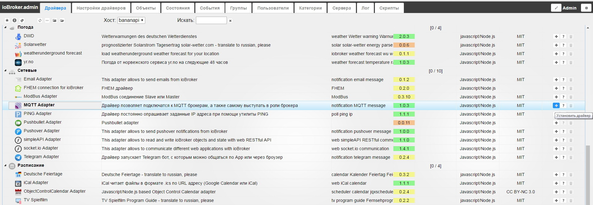
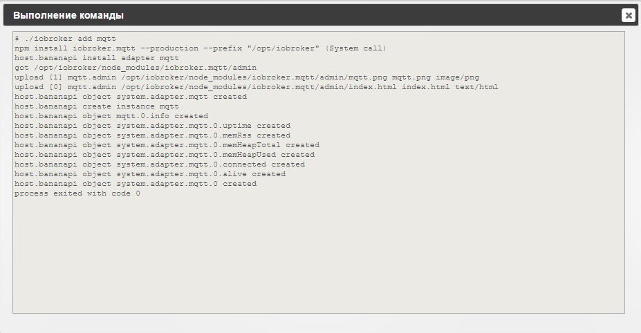
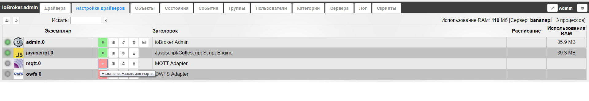
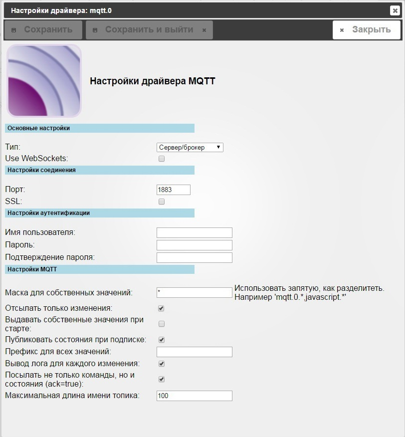
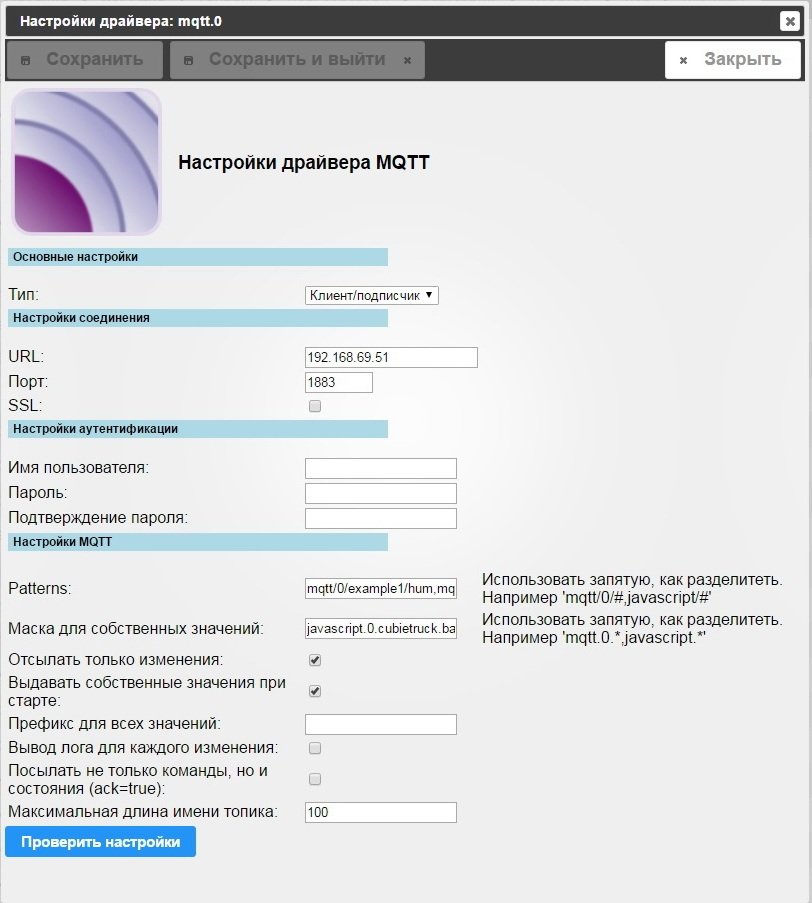
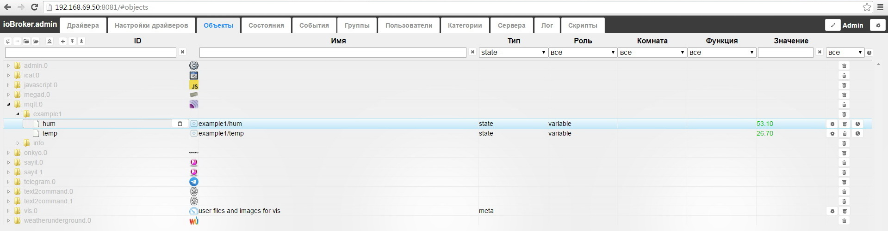
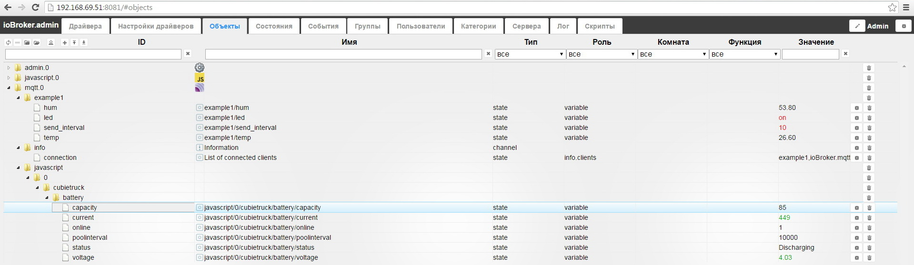
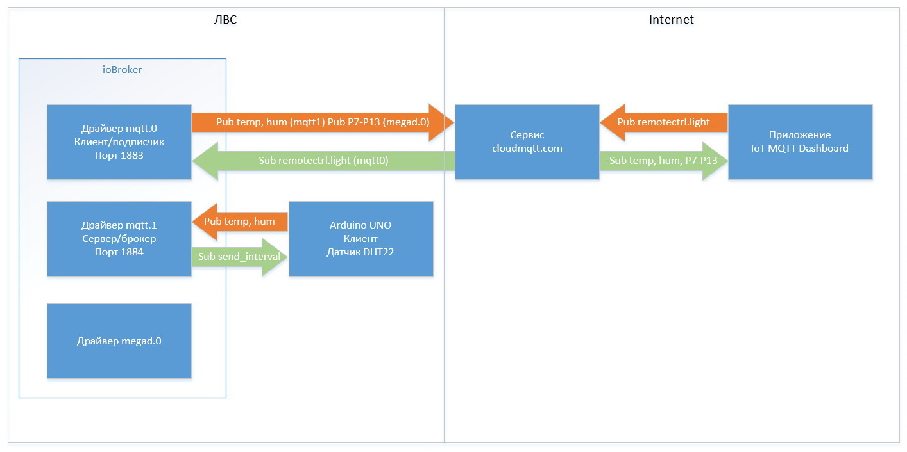
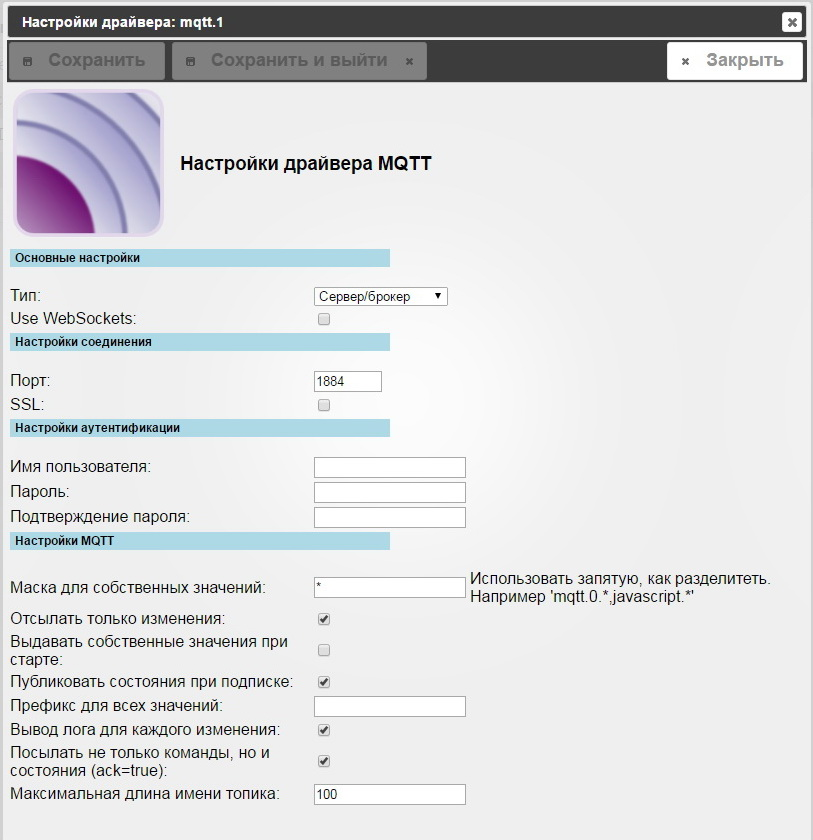
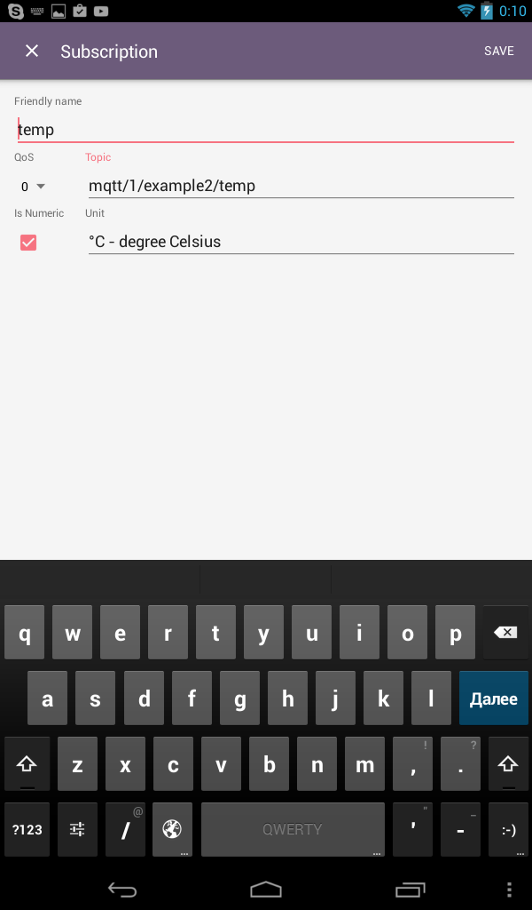

## MQTT Broker и клиент

[MQTT](http://mqtt.org/) (Message Queue Telemetry Transport) это легковесный протокол, 
применяемый для общения между устройствами (M2M — machine-to-machine). 
Он использует модель издатель-подписчик (publish/subscribe) для передачи сообщений поверх 
протокола TCP/IP. Центральная часть протокола это MQTT-сервер или брокер, который имеет 
доступ к издателю и подписчику. Этот протокол предельно примитивен: с коротким заголовком, 
без контроля целостности (поэтому передача реализована поверх TCP), не накладывает никаких 
ограничения на структуру, кодирование или схему данных. Единственное требование к данным в 
каждом пакете – они должны сопровождаться идентификатором информационного канала. 
Этот идентификатор в спецификации называется Topic Name.

Протокол MQTT требует обязательного наличия брокера данных. Это центральная идея технологии. 
Все устройства посылают данные только брокеру и принимают данные тоже только от него. 
Получив пакет, брокер рассылает его всем устройствам в сети согласно их подписке. Чтобы 
устройство что-то получило от брокера оно должно подписаться на топик. Топики возникают 
динамически по факту подписки или по факту прихода пакета с данным топиком. От подписки 
на топик можно отказаться. Таким образом топики представляют собой удобный механизм 
организации связей разных видов: один ко многим, многие к одному и многие ко многим. 

**Важные моменты:**

* устройства сами устанавливают связь с брокером, они могут находится за NAT и не иметь статических IP-адресов,
* можно применить протокол SSL для шифрования трафика,
* MQTT брокеры позволяют подключаться к ним через протокол WebSocket на 80-й порт,
* разные брокеры могут соединяться между собой подписываясь на сообщения друг у друга.

## Установка

Установка осуществляется на вкладке **Драйвера** странички [администрирования](http://www.iobroker.net/?page_id=3800&lang=ru) системы. 
В группе драйверов **Сетевые** находим строчку с названием **MQTT Adapter** и нажимаем кнопку со 
значком плюса в этой строке справа. 

На экране появится всплывающее окно установки драйвера, в конце установки оно 
автоматически закроется. 

Если все прошло удачно, на вкладке **Настройка драйверов** появится строка **mqtt.0** с установленным экземпляром драйвера. 

## Настройка

Как писалось выше, протокол MQTT подразумевает наличие брокера и клиентов. 
Сервер ioBroker может выступать как в роли брокера, так и в роли клиента. 
Настройка для указания режима работы - тип (сервер/брокер или клиент/подписчик) Рассмотрим каждый вариант.

### Работа ioBroker в качестве MQTT-брокера

Основные настройки, если предполагается использование режима сервер/брокер, приведены на картинке: 

* **Use WebSockets** - если есть надобность использовать WEB-сокеты для соединения, необходимо установить эту опцию, при этом TCP-server будет работать параллельно с WebSocket-сервером,
* **Порт** -порт для установки соединения по TCP (значение по-умолчанию 1883), сервер WebSocket (см. опция выше) запускается по порту +1 (по-умолчанию 1884),
* **SSL** - данная опция используется, если необходимо шифровать трафик (TCP или WebSocket), при этом необходимо указать сертификаты - просто выбрать из списка заранее установленные (указываются в системных настройках, см. описание драйвера [администрирования](http://www.iobroker.net/?page_id=3800&lang=ru) системы),
* **настройки аутентификации** (имя пользователя и пароль) - указываются, если необходима аутентификация конкретного пользователя, данная настройка всегда используется вместе с опцией SSL-шифрования (чтобы не передавать пароли в открытом виде через незащищенное соединение).
* **Маска для собственных значений** - шаблон (или несколько через запятую) для фильтрации переменных ioBroker, которые будут отправляться клиентам, можно использовать специальные символы чтобы указать группу сообщения (к примеру, `memRSS, mqtt.0` - могут передаваться все переменные состояния памяти всех драйверов и все переменные экземпляра драйвера **mqtt.0**)
* **Отсылать только изменения** - отправка данных клиенту будет произведена только в случае изменения переменной (если состояние просто обновилось - значение не поменялось, клиенту сообщение не будет отправлено), от клиента будет принято любое сообщение, даже если значение не изменилось,
* **Выдавать собственные значения при старте** - для каждого успешного соединения с клиентом ему будут переданы все известные состояния (определяются маской состояний) - для того, чтобы сообщить клиенту текущее состояние ioBroker,
* **Публиковать состояния при подписке** - сразу после подписки клиенту будет отправлено значение переменной, на которую он подписан (при первом старте или рестарте клиент получит значения переменных, на которые он подписан, можно использовать для инициализации переменных),
* **Префикс для всех значений** - если указано значение, то оно будет добавляться как префикс к каждому отправленному топику, к примеру, если указать `iobroker/`, то все отправленные топики примерно следующего содержания: `iobroker/mqtt/0/connected`,
* **Вывод лога для каждого изменения** - в лог-файле будет отображаться отладочная информация по каждому изменению,
* **Посылать не только команды, но и состояния (ack=true)** - если опция не активна, то клиенту будут отправляться только переменные/команды с ack=false, если флаг установлен, то будут переданы переменные не зависимо от состояния ack (false или true),
* **Максимальная длина имени топика** - максимальное кол-во символов для описания топика, включая служебные.

В качестве примера рассмотрим обмен данными между клиентом на базе платы [arduino](https://www.arduino.cc/) и брокером - экземпляр драйвера mqtt.0 системы ioBroker.

* клиент - плата для разработки [arduino UNO](https://www.arduino.cc/en/Main/ArduinoBoardUno) + [ethernet shield](https://store.arduino.cc/product/A000072) на базе чипа W5100,
* для работы с платой ethernet используется стандартная [библиотека](https://www.arduino.cc/en/Reference/Ethernet), для работы с MQTT библиотека [Pubsubclient](https://github.com/knolleary/pubsubclient),
* датчик AM2302 (температура и влажность) подключен на pin_8 для опроса используется библиотека с [DHTlib](https://github.com/RobTillaart/Arduino/tree/master/libraries/DHTlib) с ресурса github.com,
* светодиод led_green подключен на pin_9, управление в дискретном режиме вкл/откл,
* брокер - система ioBroker драйвер mqtt.

Формат топиков обмена данными:

* `example1/send_interval` - клиент подписан на изменение интервала отправки показаний температуры и влажности (значение int в секундах)
* `example1/temp` - клиент публикует с заданным интервалом значение температуры с датчика DHT22 (тип float),
* `example1/hum` -клиент публикует с заданным интервалом значение влажности с датчика DHT22 (тип float),
* `example1/led` -клиент подписан на изменение состояния светодиода (тип text on/off или 0/1 или true/false).

Настройки драйвера будут следующие: 

Подключение по TCP (WebSocket не нужен), порт по-умолчанию 1883\. Клиент внутри локальной сети, поэтому шифровать трафик и проводить 
аутентификацию пользователя нет необходимости. Отсылать будем только изменения, так как клиент подписан на интервал 
отправки показаний и состояние светодиода, получать информацию только об обновлении (без изменения значения) 
переменной нет смысла. Публиковать состояния при подписке - отметим эту опцию, так как при первом подключении 
(или подключении после обрыва соединения) клиента он должен знать состояния переменных, на которые он 
подписан (какой текущий интервал отправки и должен ли быть включен светодиод). Настройку отсылать 
переменные с ack=true или false тоже стоит отметить, так как переменную (на которую подписан клиент) 
может изменить любой драйвер/скрипт/VIS и все изменения надо отправлять клиенту. Полный код для платы 
arduino будет выглядеть так: 

<pre>
//Подключаем библиотеки
#include <SPI.h>
#include <Ethernet.h>
#include <PubSubClient.h> //https://github.com/knolleary/pubsubclient
#include <dht.h>          //https://github.com/RobTillaart/Arduino/tree/master/libraries/DHTlib
//Настройки сети
byte mac[] = {  0xAB, 0xBC, 0xCD, 0xDE, 0xEF, 0x31 };
byte ip[] = { 192, 168, 69, 31 }; //IP-адрес платы arduino
byte mqttserver[] = { 192, 168, 69, 51 }; //IP-адрес сервера ioBroker
EthernetClient ethClient;
void callback(char* topic, byte* payload, unsigned int length);
PubSubClient client(mqttserver, 1883, callback, ethClient);
//Глобальные переменные
#define LED_pin 9
unsigned int send_interval = 10; //интервал отправки показаний на сервер по-умолчанию 10 секунд
unsigned long last_time = 0; //текущее время для таймера
dht DHT;
#define DHT22_PIN 8
char buff[20];
//Функция обработки входящих соединений - прием данных по подписке
void callback(char* topic, byte* payload, unsigned int length) {
  Serial.println ("");
  Serial.println ("-------");
  Serial.println ("New callback of MQTT-broker");
  //преобразуем тему(topic) и значение (payload) в строку
  payload[length] = '\0';
  String strTopic = String(topic);
  String strPayload = String((char*)payload);
  //Исследуем что "прилетело" от сервера по подписке:
  //Изменение интервала опроса
  if (strTopic == "example1/send_interval") {
    int tmp = strPayload.toInt();
    if (tmp == 0) {
      send_interval = 10;
    } else {
      send_interval = strPayload.toInt();
    }
  }
  //Управление светодиодом
  if (strTopic == "example1/led") {
    if (strPayload == "off" || strPayload == "0" || strPayload == "false") digitalWrite(LED_pin, LOW);
    if (strPayload == "on" || strPayload == "1" || strPayload == "true") digitalWrite(LED_pin, HIGH);
  }  
  Serial.print (strTopic);
  Serial.print (" ");
  Serial.println (strPayload);
  Serial.println ("-------");
  Serial.println ("");  
}
void setup() {
  Serial.begin(9600);
  Serial.println("Start...");
  //стартуем сетевое подключение
  Ethernet.begin(mac, ip);
  Serial.print("IP: ");
  Serial.println(Ethernet.localIP());
  //Инициализируем порты ввода-вывода, прописываем начальные значения
  pinMode(LED_pin, OUTPUT);
  digitalWrite(LED_pin, LOW); //при светодиод отключен
}
void loop() {
  //Если соединение MQTT неактивно, то пытаемся установить его и опубликовать/подписаться
  if (!client.connected()) {
    Serial.print("Connect to MQTT-boker...  ");
    //Подключаемся и публикуемся/подписываемся
    if (client.connect("example1")) {
      Serial.println("success");
      //Значение с датчиков
      if (DHT.read22(DHT22_PIN)==DHTLIB_OK) {
        dtostrf(DHT.humidity, 5, 2, buff);
        client.publish("example1/hum", buff);
        dtostrf(DHT.temperature, 5, 2, buff);
        client.publish("example1/temp", buff);
      }
      //Подписываемся на интервал опроса
      client.subscribe("example1/send_interval");
      //Подписываемся на переменную управления светодиодом
      client.subscribe("example1/led");
    } else {
      //Если не подключились, ждем 10 секунд и пытаемся снова
      Serial.print("Failed, rc=");
      Serial.print(client.state());
      Serial.println(" try again in 10 seconds");
      delay (10000);
    }
  //Если соединение активно, то отправляем данные на сервер с заданным интервалом времени
  } else {
    if(millis() > (last_time + send_interval*1000)) {
      last_time = millis();
      if (DHT.read22(DHT22_PIN)==DHTLIB_OK) {
        dtostrf(DHT.humidity, 5, 2, buff);
        client.publish("example1/hum", buff);
        dtostrf(DHT.temperature, 5, 2, buff);
        client.publish("example1/temp", buff);
      }
    }
  }
  //Проверка входящих соединений по подписке
  client.loop();
}
</pre>

### Работа ioBroker в качестве MQTT-клиента

Чтобы экземпляр драйвера MQTT заработал как клиент/подписчик - нужно в настройках выбрать соответствующий тип. 
При этом набор настроек немного поменяется: 

* **Настройки соединения** - указывается URL и порт брокера (если необходимо шифровать трафик, то указывается SSL) - настройки для подключения к брокеру,
* **Настройки аутентификации** - имя пользователя и пароль, если брокер требует аутентификацию (уместно использовать SSL-шифрование, чтобы не передавать пароль в открытом виде),
* **Patterns** - маска для переменных, на которые клиент подписывается (переменные брокера), значения перечисляются через запятую, для указания множества используется символ # (решетка),
* **Маска для собственных значений** - фильтр переменных, которые необходимо публиковать (переменные клиента), значения перечисляются через запятую, для указания множества используется символ * (звездочка),
* **Отсылать только изменения** - клиент будет публиковать только переменные, которые изменили значение (согласно маски),
* **Выдавать собственные значения при старте** - если эту опцию отметить, то будут публиковаться все состояния (согласно маски) каждый раз, когда устанавливается соединение, чтобы объявить доступные собственные переменные и их значения,
* **Префикс для всех значений** - если указано значение, то оно будет добавляться как префикс к каждому публикуемому топику, к примеру, если указать `client1/`, то все публикуемые топики будут примерно следующего содержания: `client1/javascript/0/cubietruck`,
* **Вывод лога для каждого изменения** - в лог-файле будет отображаться отладочная информация по каждому изменению,
* **Посылать не только команды, но и состояния (ack=true)** - если данная опция не отмечена, то брокеру отправляются только переменные/команды с ack=false, если опцию отметить, то будут отправляться все данные, независимо от ack=true или ack=false,
* **Максимальная длина топика** - максимальное кол-во символов для описания топика, включая служебные.

Примеры для задания маски подписки на переменные (patterns). Рассмотрим топики:

* "Sport"
* "Sport/Tennis"
* "Sport/Basketball"
* "Sport/Swimming"
* "Sport/Tennis/Finals"
* "Sport/Basketball/Finals"
* "Sport/Swimming/Finals"

Если необходимо подписаться на определенное множество топиков, можно использовать символы # (решетка) или + (знак плюс).

* "Sport/Tennis/#" (подписка только на "Sport/Tennis" и "Sport/Tennis/Finals")
* "Sport/Tennis/+" (подписка только на  "Sport/Tennis/Finals", но не "Sport/Tennis")

Для JMS топиков, если нужно подписаться на все топики "Finals", можно использовать символы # (решетка) или + (знак плюс)

* "Sport/#/Finals"
* "Sport/+/Finals"

Для MQTT топиков, если нужно подписаться на все топики "Finals", можно использовать символ + (знак плюс)

* "Sport/+/Finals"

В качестве примера рассмотрим обмен данными между двумя системами ioBroker. Есть 
работающая система ioBroker на плате BananaPi (IP-адрес 192.168.69.51), на ней 
запущен MQTT-драйвер в режиме сервер/брокер из примера выше. К серверу 
подключается клиент, который публикует данные с датчика DHT22 - температуру и 
влажность, а так же подписывается на переменные интервал передачи показаний и 
состояние светодиода (включить/отключить) - так же из примера выше. Вторая работающая 
система ioBroker на плате Cubietruck, на ней запустим MQTT-драйвер в режиме клиент/подписчик. 
Он подпишется на переменные температура и влажность брокера (который в свою очередь получает от 
другого клиента) и будет публиковать все переменные скрипта - [состояние АКБ](http://www.iobroker.net/?page_id=4268&lang=ru#_Li-polLi-ion) платы 
(только изменения). Настройки клиента будут примерно следующие: 

Тип соединения - клиент/подписчик, указывается IP-адрес брокера и порт (по-умолчанию 1883). 
Шифрование трафика и аутентификация не нужны. 

Маска для подписки (Patterns) - `mqtt/0/example1/hum,mqtt/0/example1/temp` - клиент подписывается только на температуру и 
влажность (значения через запятую без пробелов). 

Маска данных для публикации - `javascript.0.cubietruck.battery.*` - публикуются все переменные 
скрипта `cubietruck` в группе `battery` драйвера `javascript.0`. 

Отсылать только изменения - отправляем переменные состояния АКБ (нет смысла отправлять, если значение не изменилось). 
Выдавать собственные значения при старте - при старте драйвера, клиент сразу опубликует все переменные 
согласно маске - даже если они нулевые или пустые, чтобы создать переменные в брокере. Посылать данные 
с ack=false - переменные работы АКБ обновляются драйвером javascript, поэтому они всегда ack=false. 

Результат работы на стороне клиента (данные температуры и влажности другого клиента - см. пример выше): 

Результат работы со стороны брокера (данные состояния АКБ клиента): 

## Применение - шлюз протоколов MQTT - ModBus RTU

Драйвер MQTT можно использовать как шлюз различных протоколов, чтобы подключить новые 
устройства в систему ioBroker или любую другую. Универсальной базой для разработки подобных 
решений являются платы arduino. В сети много примеров, библиотек и наработок. Огромное сообщество 
работает с этими контроллерами и в систему интегрированы множество устройств и оборудования. Для примера, 
рассмотрим распространенный промышленный протокол ModBus. В системе ioBroker имеется драйвер для работы с ним - версии 
ModBus TCP (по сети ethernet). Множество датчиков, контроллеров и исполнительных устройств работают физически по 
сети RS-485/232 и протоколу ModBus RTU. Чтобы интегрировать их можно применить шлюз MQTT - ModBus RTU на базе платформы 
arduino. 

Рассмотрим пример. 

**Имеется датчик температуры и влажности** (для теста на базе платы arduino pro mini и сенсора DHT22), 
который выдает данные по ModBUS RTU:

* Порт UART (можно с помощью микросхемы MAX485 преобразовать в интерфейс RS-485) работает на скорости 9600 с параметрами 8E1 (1 start bit, 8 data bits, 1 Even parity bit, 1 stop bit)
* Адрес ModBus - 10
* температура - адрес 0 значение, умноженное на 10 (read function 3)
* влажность - адрес 1 значение, умноженное на 10 (read function 3)
* PWM LED - адрес 2 значение 0...1023 для проверки функции записи (write function 6)

Схема соединения: 

by Fritzing

Код для контроллера arduino pro mini получается следующий: 

<pre>
#include <dht.h> //https://github.com/RobTillaart/Arduino/tree/master/libraries/DHTlib
#include <SimpleModbusSlave.h> //https://code.google.com/archive/p/simple-modbus/
#include <MsTimer2.h> //https://github.com/PaulStoffregen/MsTimer2
//регистры modbus
enum {
  TEMP,
  HUM,
  PWM,
  TEST,
  HOLDING_REGS_SIZE
};
#define ID_MODBUS 10 //адрес modbus slave устройства
unsigned int holdingRegs[HOLDING_REGS_SIZE]; //массив регистров modbus
//датчик температуры и влажности DHT22
dht DHT;
#define DHT22_PIN 2
#define LED 9 //светодиод подключен на PWM-пин 9
void setup() {
  //конфигурируем modbus
  modbus_configure(&Serial, 9600, SERIAL_8E1, ID_MODBUS, 0, HOLDING_REGS_SIZE, holdingRegs);
  holdingRegs[TEST] = -157; //для теста отрицательных значений
  //инициализируем таймер 2 секунды обновления данных в регистрах температуры и влажности
  MsTimer2::set(2000, read_sensors);
  MsTimer2::start(); //запускаем таймер
  pinMode(LED, OUTPUT); //инициализация порта светодиода
}
//функция, запускаемая по таймеру каждые 2 секунды
void read_sensors() {
  if (DHT.read22(DHT22_PIN)==DHTLIB_OK) { //если данные с датчика DHT22 удалось прочитать
    //записываем в регистр влажности целочисленное значение
    holdingRegs[HUM] = 10 * DHT.humidity;
    //записываем в регистр температуры целочисленное значение
    holdingRegs[TEMP]= 10 * DHT.temperature;
  } else {
    //если не удалось прочитать данные с датчика DHT22, записываем в регистры нули
    holdingRegs[HUM] = 0;
    holdingRegs[TEMP] = 0;
  }
}
void loop() {
  modbus_update(); //обновляем данные modbus
  //данные из регистра управления светодиодом передаем в ШИМ (битовый сдвиг на 2 разряда)
  analogWrite(LED, holdingRegs[PWM]>>2);
}
</pre>

* порт (выбрать из списка к какому порту подключен serial платы ардуино);
* скорость и прочие параметры - 9600 8E1;
* slave id: 10, чтение: функция №3 read holding registers, начальный адрес: 0, число регистров: 3,
* slave id: 10, запись: функция №6 write single register, начальный адрес: 2,

Ответ в программе при чтении должен быть примерно следующий: 

Ответ в программе при записи: 

**Теперь настроем сам шлюз и подключим его в iobroker** Шлюз будет на базе платформы 
arduino MEGA 2560 с ethernet shield - клиент MQTT, брокер - экземпляр драйвера mqtt.0 системы ioBroker. Выбор именно MEGA 2560 
обусловлен тем, что на этой плате более одного UART-порта, соответственно нулевой Serial0 (pin_0 (RX) и зшт_1 (TX)) или 
просто Serial - используем для вывода отладочных сообщений, а Serial1 (pin_19 (RX) и pin_18 (TX)) - для 
работы с slave-устройством по ModBus.

* клиент - плата для разработки [arduino MEGA 2560](https://www.arduino.cc/en/Main/ArduinoBoardMega2560) + [ethernet shield](https://store.arduino.cc/product/A000072) на базе чипа W5100;
* для работы с платой ethernet используется стандартная [библиотека](https://www.arduino.cc/en/Reference/Ethernet), для работы с MQTT библиотека [Pubsubclient](https://github.com/knolleary/pubsubclient);
* для опроса по modbus используется библиотека [SimpleModbus](https://code.google.com/archive/p/simple-modbus/) версии master;
* опрос по порту UART (просто соединить RX порт master, TX порт slave и соответственно TX порт master, RX порт slave), порт управления передачей не используется (он для RS-485);
* параметры порта: скорость 9600, 8Е1;
* адрес slave-устройства 10, функция чтения №3 (read holding registers), функция записи №6 (write single register);
* брокер - система ioBroker драйвер mqtt.

Формат топиков обмена данными:

* `modbusgateway/send_interval` - клиент подписан на изменение интервала отправки показаний температуры и влажности (значение int в секундах)
* `modbusgateway/temp` - клиент публикует с заданным интервалом значение температуры с датчика DHT22 (тип float),
* `modbusgateway/hum` -клиент публикует с заданным интервалом значение влажности с датчика DHT22 (тип float),
* `modbusgateway/led` -клиент подписан на изменение состояния светодиода (ШИМ управление, значения 0...1024).

Схема соединений получится примерно такая: 

By Fritzing[/caption] 
Для теста slave-устройство запитаем от master-устройства. Master в свою очередь, будет работать от USB-порта, 
по которому ведется отладка (Serial0). Настройки драйвера будут следующие: 

Подключение по TCP (WebSocket не нужен), порт по-умолчанию 1883\. Клиент внутри локальной сети, поэтому шифровать трафик и 
проводить аутентификацию пользователя нет необходимости. Отсылать будем только изменения, так как клиент подписан на интервал 
отправки показаний и состояние светодиода, получать информацию только об обновлении (без изменения значения) переменной нет смысла. 
Публиковать состояния при подписке - отметим эту опцию, так как при первом подключении (или подключении после обрыва соединения) 
клиента он должен знать состояния переменных, на которые он подписан (какой текущий интервал отправки и должен ли быть включен светодиод). 
Настройку отсылать переменные с ack=true или false тоже стоит отметить, так как переменную (на которую подписан клиент) может изменить 
любой драйвер/скрипт/VIS и все изменения надо отправлять клиенту. 

Полный код для платы arduino MEGA 2560 будет выглядеть так: 

<pre>
//Подключаем библиотеки
#include <SPI.h>
#include <Ethernet.h>
#include <PubSubClient.h>       //https://github.com/knolleary/pubsubclient
#include <SimpleModbusMaster.h> //https://code.google.com/archive/p/simple-modbus/
//Настройки сети
byte mac[] = {  0xAB, 0xBC, 0xCD, 0xDE, 0xEF, 0x31 };
byte ip[] = { 192, 168, 69, 31 }; //IP-адрес платы arduino
byte mqttserver[] = { 192, 168, 69, 51 }; //IP-адрес сервера ioBroker
//Объекты/переменные/функции ethernet и MQTT
EthernetClient ethClient;
void callback(char* topic, byte* payload, unsigned int length);
PubSubClient client(mqttserver, 1883, callback, ethClient);
//Переменные временного интервала и буфер для отправки данных по MQTT
unsigned int send_interval = 10; //интервал отправки показаний на сервер по-умолчанию 10 секунд
unsigned long last_time = 0; //текущее время для таймера
char buff[20];
//Параметры порта Serial1 (19 (RX) and 18 (TX))
#define baud 9600       //скорость порта
#define timeout 1000    //интервал времени ожидания ответа /(мс)
#define polling 200     //интервал опроса (мс)
#define retry_count 10  //кол-во повторов при неудачном опросе
#define TxEnablePin 0   //пин управления передачей для RS485 (в UART не используется = 0)
// Общая сумма доступной памяти на master устройстве для хранения данных
// Из слейва запрашиваем 4 регистра, в массиве regs должно быть не меньше 4х ячеек
#define TOTAL_NO_OF_REGISTERS 4
//Массив регистров для работы с modbus (хранение, чтение, запись)
unsigned int regs[TOTAL_NO_OF_REGISTERS];
//Определение пакетов mmodbus
enum {
  TEMP,
  HUM,
  PWM,
  TEST,
  TOTAL_NO_OF_PACKETS //всегда последней записью
};
//Создание массива пакетов modbus
Packet packets[TOTAL_NO_OF_PACKETS];

//Функция обработки входящих соединений - прием данных по подписке
void callback(char* topic, byte* payload, unsigned int length) {
  Serial.println ("");
  Serial.println ("-------");
  Serial.println ("New callback of MQTT-broker");
  //преобразуем тему(topic) и значение (payload) в строку
  payload[length] = '\0';
  String strTopic = String(topic);
  String strPayload = String((char*)payload);
  //Исследуем что "прилетело" от сервера по подписке:
  //Изменение интервала опроса
  if (strTopic == "modbusgateway/send_interval") {
    int tmp = strPayload.toInt();
    if (tmp == 0) {
      send_interval = 10;
    } else {
      send_interval = strPayload.toInt();
    }
  }
  //Управление светодиодом значение int от 0 до 1023
  if (strTopic == "modbusgateway/led") {
    int tmp = strPayload.toInt();
    if (tmp >= 0 && tmp <=1023) {
      regs[2] = tmp;
    }
  }  
  Serial.print (strTopic);
  Serial.print (" ");
  Serial.println (strPayload);
  Serial.println ("-------");
  Serial.println ("");  
}

void setup() {
  Serial.begin(9600);
  Serial.println("Start...");
  //стартуем сетевое подключение
  Ethernet.begin(mac, ip);
  Serial.print("IP: ");
  Serial.println(Ethernet.localIP());
  //Инициализируем все пакеты modbus
  modbus_construct(&packets[TEMP], 10, READ_HOLDING_REGISTERS, 0, 1, 0); //температура
  modbus_construct(&packets[HUM], 10, READ_HOLDING_REGISTERS, 1, 1, 1); //влажность
  modbus_construct(&packets[PWM], 10, PRESET_SINGLE_REGISTER, 2, 1, 2); //данные ШИМ для светодиода
  modbus_construct(&packets[TEST], 10, READ_HOLDING_REGISTERS, 3, 1, 3); //тест
  //Конфигурируем соединение modbus (порт serial1, скорость и пр.)
  modbus_configure(&Serial1, baud, SERIAL_8E1, timeout, polling, retry_count, TxEnablePin, packets, TOTAL_NO_OF_PACKETS, regs);
}

void loop() {
  //Обоновляем данные в регистрах modbus
  modbus_update();
  //Если соединение MQTT неактивно, то пытаемся установить его и опубликовать/подписаться
  if (!client.connected()) {
    Serial.print("Connect to MQTT-boker...  ");
    //Подключаемся и публикуемся/подписываемся
    if (client.connect("modbusgateway")) {
      Serial.println("success");
      //Значение с датчиков температуры и влажности
      dtostrf((float)regs[0]/10, 5, 1, buff);
      client.publish("modbusgateway/temp", buff);
      dtostrf((float)regs[1]/10, 5, 1, buff);
      client.publish("modbusgateway/hum", buff);
      //Подписываемся на интервал опроса
      client.subscribe("modbusgateway/send_interval");
      //Подписываемся на переменную управления светодиодом
      client.subscribe("modbusgateway/led");
    } else {
      //Если не подключились, пытаемся снова
      Serial.print("Failed, rc=");
      Serial.print(client.state());
      Serial.println(" try again");
      delay(10000);
    }
  //Если соединение активно, то отправляем данные на сервер с заданным интервалом времени
  } else {
    if(millis() > (last_time + send_interval*1000)) {
      last_time = millis();
      //Значение с датчиков температуры и влажности
      dtostrf((float)regs[0]/10, 5, 1, buff);
      client.publish("modbusgateway/temp", buff);
      dtostrf((float)regs[1]/10, 5, 1, buff);
      client.publish("modbusgateway/hum", buff);
    }
  }
  //Проверка входящих соединений по подписке
  client.loop();
}
</pre>

## Применение - подключение мобильных клиентов

В последнее время протокол MQTT получил большое распространение ввиду простоты, экономии трафика и хорошей 
проработке библиотек под разные платформы. Существует множество программ для работы с MQTT на мобильных 
устройствах, к примеру [IoT MQTT Dashboard](https://play.google.com/store/apps/details?id=com.thn.iotmqttdashboard&hl=ru). 
С помощью этой программы можно подключиться к MQTT-брокеру в локальной сети или в сети интернет. Рассмотрим пример - 
в роли брокера будет выступать система ioBroker, к которой по MQTT будет подключаться клиент - приложение IoT MQTT Dashboard. 
В данном примере будем управлять светом с помощью контроллера [MegaD-328](http://www.ab-log.ru/smart-house/ethernet/megad-328), 
который подключен к ioBroker с помощью драйвера [MegaD](http://www.iobroker.net/?page_id=4052&lang=ru). 
Управляет непосредственно реле (MegaD порт **P7**) света в холле специальный скрипт, который подписывается на состояние 
порта-кнопки **P0** и состояние MQTT-переменной **mqtt.0.remotectrl.light.hall**, которую будет публиковать мобильный клиент. 
При этом скрипт переключает состояние порта, привязанного к реле (порт P7), т.е. инвертирует его. 

Получается, что при каждом 
нажатии на кнопку, электрически подключенную к порту **P0** (вылавливается состояние **true**) и при каждой публикации 
переменной **mqtt.0.remotectrl.light.hall** значением так же **true**, порт **P7** будет включать или выключать свет. 
Текст скрипта будет примерно такой: 

<pre>
//Управление освещением в зале с помощью кнопки порт p0 контроллера MegaD драйвер экземпляр megad.0
on({id: 'megad.0.p0_P0', change: 'any'}, function (obj) {
   if (obj.newState.val !== '' || typeof obj.newState.val !== "undefined"){
     if (obj.newState.val === true) {
       if (getState('megad.0.p7_P7').val === true) {
         setState('megad.0.p7_P7', false);
       } else {
         setState('megad.0.p7_P7', true);
       }
     }
   }
});
//Управление освещением в зале удаленно по MQTT топик "mqtt.0.remotectrl.light.hall"
on({id: 'mqtt.0.remotectrl.light.hall', change: 'any'}, function (obj) {
  if (obj.newState.val !== '' || typeof obj.newState.val !== "undefined"){
    if (obj.newState.val === true) {
      if (getState('megad.0.p7_P7').val === true) {
        setState('megad.0.p7_P7', false);
      } else {
        setState('megad.0.p7_P7', true);
      }
    }
  }
});
</pre>

## Применение - работа с облачными серверами

Описанный выше пример имеет ряд недостатков. Во-первых, не всегда мобильный клиент может находиться в одной локальной сети с сервером ioBroker, во-вторых, даже если осуществить проброс портов в интернет и защитить соединение, не всегда сам сервер ioBroker может принять входящие подключения (находится за NAT, к которому нет доступа для настройки). В глобальной сети много различных сервисов, которые поддерживают MQTT - платных и бесплатных, к примеру отправка погодных данных, геолокации и пр. Некоторые сервисы могут выступать в качестве брокера протокола MQTT и их можно использовать как шлюз (мост) для вывода данных из ioBroker в глобальную сеть или для получения данных в ioBroker. В качестве примера рассмотрим работу связки:

* сервер/брокер - сервис [cloudmqtt.com](https://www.cloudmqtt.com/) (есть бесплатный тариф),
* клиент/подписчик - система ioBroker с выходом в сеть интернет, публикует данные температуры и влажности (см. [пример выше](http://www.iobroker.net/?page_id=4643&lang=ru#_ioBroker__MQTT)), публикует реальное состояние портов **P7-P13** (реле MegaD драйвера **megad.0** - управление освещением), подписка на переменные удаленного управления светом (экземпляр драйвера **mqtt.0**),
* клиент/подписчик - приложение [IoT MQTT Dashboard](https://play.google.com/store/apps/details?id=com.thn.iotmqttdashboard&hl=ru) для удаленной работы - подписка на данные сенсора температуры и влажности, подписка на реальное состояние портов **P7-P13** (реле MegaD драйвера **megad.0**), публикация переменных удаленного управления светом (экземпляр драйвера **mqtt.0**).

В итоге получается следующая структура: 

Связка драйвер **mqtt.1** (брокер) - Arduino UNO + Ethernet + DHT22 (клиент) как в [примере выше](http://www.iobroker.net/?page_id=4643&lang=ru#_ioBroker__MQTT) с 
несколькими изменениями. Настройки экземпляра драйвера **mqtt.1**: 

 

Код для платформы arduino: 

<pre>
//Подключаем библиотеки
#include <SPI.h>
#include <Ethernet.h>
#include <PubSubClient.h> //https://github.com/knolleary/pubsubclient
#include <dht.h>          //https://github.com/RobTillaart/Arduino/tree/master/libraries/DHTlib
//Настройки сети
byte mac[] = {  0xAB, 0xBC, 0xCD, 0xDE, 0xEF, 0x31 };
byte ip[] = { 192, 168, 69, 31 }; //IP-адрес платы arduino
byte mqttserver[] = { 192, 168, 69, 51 }; //IP-адрес сервера ioBroker
EthernetClient ethClient;
void callback(char* topic, byte* payload, unsigned int length);
PubSubClient client(mqttserver, 1884, callback, ethClient);
//Глобальные переменные
unsigned int send_interval = 10; //интервал отправки показаний на сервер по-умолчанию 10 секунд
unsigned long last_time = 0; //текущее время для таймера
dht DHT;
#define DHT22_PIN 8
char buff[20];

//Функция обработки входящих соединений - прием данных по подписке
void callback(char* topic, byte* payload, unsigned int length) {
  Serial.println ("");
  Serial.println ("-------");
  Serial.println ("New callback of MQTT-broker");
  //преобразуем тему(topic) и значение (payload) в строку
  payload[length] = '\0';
  String strTopic = String(topic);
  String strPayload = String((char*)payload);
  //Исследуем что "прилетело" от сервера по подписке:
  //Изменение интервала опроса
  if (strTopic == "example2/send_interval") {
    int tmp = strPayload.toInt();
    if (tmp == 0) {
      send_interval = 10;
    } else {
      send_interval = strPayload.toInt();
    }
  }
  Serial.print (strTopic);
  Serial.print (" ");
  Serial.println (strPayload);
  Serial.println ("-------");
  Serial.println ("");  
}
void setup() {
  Serial.begin(9600);
  Serial.println("Start...");
  //стартуем сетевое подключение
  Ethernet.begin(mac, ip);
  Serial.print("IP: ");
  Serial.println(Ethernet.localIP());
  //Инициализируем порты ввода-вывода, прописываем начальные значения
}
void loop() {
  //Если соединение MQTT неактивно, то пытаемся установить его и опубликовать/подписаться
  if (!client.connected()) {
    Serial.print("Connect to MQTT-boker...  ");
    //Подключаемся и публикуемся/подписываемся
    if (client.connect("example2")) {
      Serial.println("success");
      //Значение с датчиков
      if (DHT.read22(DHT22_PIN)==DHTLIB_OK) {
        dtostrf(DHT.humidity, 5, 2, buff);
        client.publish("example2/hum", buff);
        dtostrf(DHT.temperature, 5, 2, buff);
        client.publish("example2/temp", buff);
      }
      //Подписываемся на интервал опроса
      client.subscribe("example2/send_interval");
    } else {
      //Если не подключились, ждем 10 секунд и пытаемся снова
      Serial.print("Failed, rc=");
      Serial.print(client.state());
      Serial.println(" try again in 10 seconds");
      delay (10000);
    }
  //Если соединение активно, то отправляем данные на сервер с заданным интервалом времени
  } else {
    if(millis() > (last_time + send_interval*1000)) {
      last_time = millis();
      if (DHT.read22(DHT22_PIN)==DHTLIB_OK) {
        dtostrf(DHT.humidity, 5, 2, buff);
        client.publish("example2/hum", buff);
        dtostrf(DHT.temperature, 5, 2, buff);
        client.publish("example2/temp", buff);
      }
    }
  }
  //Проверка входящих соединений по подписке
  client.loop();
}
</pre>

* тип соединения - клиент/подписчик,
* настройки соединения - указываем URL выданный в панели управления [cloudmqtt.com](https://www.cloudmqtt.com/) порт будем использовать **22809**, который работает с **SSL**,
* в настройках аутентификации указываем имя пользователя и пароль,
* patterns - наш клиент ioBroker будет подписан на все топики, что есть в облаке, поэтому указываем здесь символ решетка (**#**), можно использовать маску и подписаться выборочно,
* маска для собственных значений - клиент будет публиковать на сервер значения температуры/влажности и состояния всех портов megaD (порты с реле **P7-P13**),в этом поле через запятую указываем необходимые переменные: **mqtt.1.example2.hum,mqtt.1.example2.temp,megad.0.p7_P7,megad.0.p8_P8,megad.0.p9_P9,megad.0.p10_P10,megad.0.p11_P11,megad.0.p12_P12,megad.0.p13_P13**,
* отсылать только изменения - ставим галочку, публиковать будем только изменения,
* выдавать собственные значения при старте - так же указываем для создания топиков,
* посылать не только команды, но и состояния (ack=true) - необходимо отметить эту настройку, так как данные температуры/влажности обновляются драйвером mqtt (ack=true).

Настройки сохраняем, убеждаемся, что соединение установилось 
(можно на панели управления [cloudmqtt.com](https://www.cloudmqtt.com/) посмотреть лог сервера). Через 
некоторое время появятся данные (в панели ссылка **WebsocketUI**): 

В итоге остается только настроить мобильный клиент, к примеру [IoT MQTT Dashboard](https://play.google.com/store/apps/details?id=com.thn.iotmqttdashboard&hl=ru).
Создаем новое подключение: 

Создаем топики для публикации (на примере освещения зала - порт **P7** MegaD): 

Создаем топики подписок (температура, влажность, освещение зала порт **P7** MegaD): 

В итоге dashboard может выглядеть примерно так: 

После создания публикаций на мобильном устройстве, в экземпляре драйвера **mqtt.0** системы ioBroker должны появиться переменные управления светом, 
которые следует использовать в скрипте управления освещением (см. [пример выше](http://www.iobroker.net/?page_id=4643&lang=ru#_8211)): 

Поздравляем! Теперь вы сможете управления системой ioBroker и 
получать от нее данные через облачный сервис!

## Changelog

### 2.3.4 (2021-01-25)
* (Apollon77) Catch errors when setting states (Sentry IOBROKER-MQTT-1F)

### 2.3.3 (2021-01-21)
* (Apollon77) Catch errors when setting states (Sentry IOBROKER-MQTT-1D)

### 2.3.2 (2021-01-13)
* (Apollon77) Check configured server port and reset to 1883 if invalid (Sentry IOBROKER-MQTT-1B)
* (Apollon77) Catch error when server can not be started (Sentry IOBROKER-MQTT-1C)

### 2.3.1 (2020-12-30)
* (FunCyRanger) Add option to ignore SSL validation errors

### 2.1.14 (2020-11-30)
* (Apollon77) Prevent crash case (Sentry IOBROKER-MQTT-11) 

### 2.1.13 (2020-11-16)
* (Apollon77) Prevent crash case (Sentry IOBROKER-MQTT-Q)

### 2.1.12 (2020-11-08)
* (Apollon77) Crash cases prevented (Sentry IOBROKER-MQTT-M)

### 2.1.10 (2020-10-30)
* (Apollon77) Crash cases prevented (Sentry IOBROKER-MQTT-G)
* (Apollon77) prevent errors on mqtt connection test

### 2.1.9 (2020-09-17)
* (Apollon77) Crash cases prevented (Sentry IOBROKER-MQTT-E, IOBROKER-MQTT-F)

### 2.1.8 (2020-08-24)
* (Apollon77) Crash case prevented on unsubscribe (Sentry IOBROKER-MQTT-D)

### 2.1.7 (2020-08-02)
* (Apollon77) handle invalid mqtt server settings better (Sentry IOBROKER-MQTT-9)

### 2.1.6 (2020-08-02)
* (Apollon77) Try to prevent creation of objects with invalid IDs
* (Apollon77) check that state is set before accessing it (Sentry IOBROKER-MQTT-2)
* (Apollon77) Better handle disconnection cases (Sentry IOBROKER-MQTT-3, IOBROKER-MQTT-6)

### 2.1.5 (2020-07-26)
* (Apollon77) try to prevent crashes on not existing state values
* (Apollon77) Sentry added for crash reporting with js-controller 3.x+

### 2.1.4 (2020-06-20)
* (Apollon77) websocket do not have setTimeout method
* (NorbGH) prevent messageID overflow

### 2.1.3 (2020- 05-17)
* (bluefox) Caught some errors

### 2.1.2 (2020-03-02)
* (foxriver76) removed usage of getMessage
* (mbecker) send states as object in client mode

### 2.1.1 (2019-07-27)
* (bluefox) Add option to overwrite the client "clean session" settings

### 2.1.0 (2019-05-02)
* (Zefau) Add option to send message using messagebox
* (Zefau) Fix error with logging on pubrec

### 2.0.6 (2019-01-16)
* (SchumyHao) Add Chinese support

### 2.0.5 (2019-01-12)
* (simatec) Support for Compact mode

### 2.0.4 (2018-12-01)
* (Apollon77) Subscribe to topics after connect

### 2.0.3 (2018-08-11)
* (bluefox) Prefix in server was corrected

### 2.0.2 (2018-08-09)
* (bluefox) Behaviour of "set" topics was changed

### 2.0.1 (2018-07-06)
* (bluefox) Double prefix by client was fixed

### 2.0.0 (2018-03-05)
* (bluefox) broke node.js 4 support
* (bluefox) remove mqtt-stream-server
* (bluefox) partial mqtt5 support

### 1.5.0 (2018-03-05)
* (bluefox) The patch for wifi-iot removed
* (bluefox) the mqtt library updated
* (bluefox) implement QoS>0

### 1.4.2 (2018-01-30)
* (bluefox) Admin3 settings are corrected

### 1.4.1 (2018-01-13)
* (bluefox) Convert error is caught
* (bluefox) Ready for admin3

### 1.3.3 (2017-10-15)
* (bluefox) Fix sending of QOS=2 if server

### 1.3.2 (2017-02-08)
* (bluefox) Fix convert of UTF8 payloads
* (bluefox) optional fix for chunking problem

### 1.3.1 (2017-02-02)
* (bluefox) Update mqtt packages
* (bluefox) add Interval before send topics by connection ans send interval settings
* (bluefox) reorganise configuration dialog

### 1.3.0 (2017-01-07)
* (bluefox) Update mqtt packages
* (bluefox) configurable client ID

### 1.2.5 (2016-11-24)
* (bluefox) Fix server publishing

### 1.2.4 (2016-11-13)
* (bluefox) additional debug output

### 1.2.1 (2016-11-06)
* (bluefox) fix publish on start

### 1.2.0 (2016-09-27)
* (bluefox) implementation of LWT for server
* (bluefox) update mqtt package version

### 1.1.2 (2016-09-13)
* (bluefox) fix authentication in server

### 1.1.1 (2016-09-12)
* (bluefox) do not parse JSON states, that do not have attribute "val" to support other systems

### 1.1.0 (2016-07-23)
* (bluefox) add new setting: Use different topic names for set and get

### 1.0.4 (2016-07-19)
* (bluefox) convert values like "+58,890" into numbers too

### 1.0.3 (2016-05-14)
* (cdjm) change client protocolID

### 1.0.2 (2016-04-26)
* (bluefox) update mqtt module

### 1.0.1 (2016-04-25)
* (bluefox) Fix translations in admin

### 1.0.0 (2016-04-22)
* (bluefox) Fix error with direct publish in server

### 0.5.0 (2016-03-15)
* (bluefox) fix web sockets
* (bluefox) fix SSL

### 0.4.2 (2016-02-10)
* (bluefox) create object "info.connection"
* (bluefox) add reconnection tests

### 0.4.1 (2016-02-04)
* (bluefox) fix error with states creation

### 0.4.0 (2016-01-27)
* (bluefox) add tests
* (bluefox) client and server run

### 0.3.1 (2016-01-14)
* (bluefox) change creation of states by client

### 0.3.0 (2016-01-13)
* (bluefox) try to fix event emitter

### 0.2.15 (2015-11-23)
* (Pmant) fix publish on subscribe

### 0.2.14 (2015-11-21)
* (bluefox) fix error with wrong variable names 

### 0.2.13 (2015-11-20)
* (Pmant) fix error with wrong variable name 

### 0.2.12 (2015-11-14)
* (Pmant) send last known value on subscription (server)

### 0.2.11 (2015-10-17)
* (bluefox) set maximal length of topic name
* (bluefox) convert "true" and "false" to boolean values

### 0.2.10 (2015-09-16)
* (bluefox) protect against empty topics

### 0.2.8 (2015-05-17)
* (bluefox) do not ty to parse JSON objects

### 0.2.7 (2015-05-16)
* (bluefox) fix test button

### 0.2.6 (2015-05-16)
* (bluefox) fix names if from mqtt adapter

### 0.2.5 (2015-05-15)
* (bluefox) subscribe to all states if no mask defined

### 0.2.4 (2015-05-14)
* (bluefox) add state "clients" to server with the list of clients

### 0.2.3 (2015-05-14)
* (bluefox) fix some errors

### 0.2.2 (2015-05-13)
* (bluefox) fix some errors with sendOnStart and fix flag sendAckToo

### 0.2.0 (2015-05-13)
* (bluefox) translations and rename config sendNoAck=>sendAckToo
* (bluefox) lets create server not only on localhost

### 0.1.8 (2015-05-13)
* (bluefox) fix topic names in server mode
* (bluefox) implement subscribe
* (bluefox) update mqtt package

### 0.1.7 (2015-03-24)
* (bluefox) create objects if new state received
* (bluefox) update mqtt library

### 0.1.6 (2015-03-04)
* (bluefox) just update index.html

### 0.1.5 (2015-01-02)
* (bluefox) fix error if state deleted

### 0.1.4 (2015-01-02)
* (bluefox) support of npm install

### 0.1.2 (2014-11-28)
* (bluefox) support of npm install

### 0.1.1 (2014-11-22)
* (bluefox) support of new naming concept

### 0.1.0 (2014-10-23)
* (bluefox) Update readme
* (bluefox) Support of authentication for server and client
* (bluefox) Support of prefix for own topics

### 0.0.2 (2014-10-19)
* (bluefox) support of server (actual no authentication)

## License

The MIT License (MIT)

Copyright (c) 2014-2020, bluefox <dogafox@gmail.com>

Permission is hereby granted, free of charge, to any person obtaining a copy
of this software and associated documentation files (the "Software"), to deal
in the Software without restriction, including without limitation the rights
to use, copy, modify, merge, publish, distribute, sublicense, and/or sell
copies of the Software, and to permit persons to whom the Software is
furnished to do so, subject to the following conditions:

The above copyright notice and this permission notice shall be included in
all copies or substantial portions of the Software.

THE SOFTWARE IS PROVIDED "AS IS", WITHOUT WARRANTY OF ANY KIND, EXPRESS OR
IMPLIED, INCLUDING BUT NOT LIMITED TO THE WARRANTIES OF MERCHANTABILITY,
FITNESS FOR A PARTICULAR PURPOSE AND NONINFRINGEMENT. IN NO EVENT SHALL THE
AUTHORS OR COPYRIGHT HOLDERS BE LIABLE FOR ANY CLAIM, DAMAGES OR OTHER
LIABILITY, WHETHER IN AN ACTION OF CONTRACT, TORT OR OTHERWISE, ARISING FROM,
OUT OF OR IN CONNECTION WITH THE SOFTWARE OR THE USE OR OTHER DEALINGS IN
THE SOFTWARE.