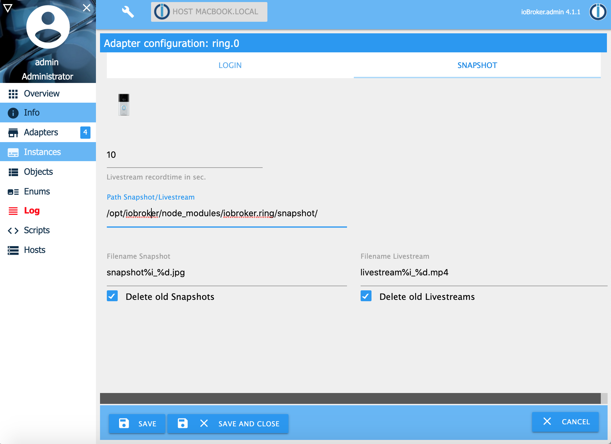

# Кольцевой адаптер
Требуется node.js 10.0 или выше и Admin v3!

Адаптер Ring работает с устройствами Ring, такими как Ring Video Doorbell и Ring Cam, и показывает, звонит ли somenone дверной звонок или обнаруживается ли движение. Звонок с видеодомофона или видеокамеры отправляет видеопоток, если не обнаружено движение или дверной звонок, или вы используете информацию SIP для видеоконференции SIP с вашим клиентом SIP.
К сожалению, адаптер не предоставляет все устройства вызова, поскольку используемый API не включает все устройства вызова.

Вы можете использовать, например, Blink SIP-клиент на [http://icanblink.com/](http://icanblink.com/). Чтобы заставить работать видео, перейдите в «Настройки» Blink и в разделе «Учетные записи» переключите вкладку на «Медиа» и отмените выбор «Шифровать аудио и видео» в «Параметры RTP». Будьте осторожны, срок действия информации SIP истекает через несколько секунд! Надеюсь, я скоро смогу поддерживать видеопоток. К сожалению, [ring.com](https://ring.com) не имеет официального API, поддерживающего эту функцию.
Если вы нажмете кнопку livestreamrequest, вы получите новую информацию SIP для создания сеанса видеовызова SIP. Если вы используете облако [ring.com](https://ring.com), в истории вы найдете ссылку http на ваше последнее видео с записью движения / дверного звонка.

## Установка и настройка
После установки Адаптера вам необходимо ввести адрес электронной почты и пароль вашей учетной записи [ring.com](https://ring.com) и токена. Ring теперь требует использования двухфакторной аутентификации (2fa) для всех учетных записей. Для получения токена выполните следующие действия на вашей оболочке.

```
npx -p ring-client-api ring-auth-cli
```




## Объекты


## Пример
Пример получения изменений при обнаружении движения или дверного звонка:

```
on({id: "ring.0.doorbell_4711.kind"/*Kind*/},  (obj) => {
  if(obj.state.val == 'ding')   console.log("Someone is at the door");
  if(obj.state.val == 'motion') console.log("Motion detected");
});
```

## Changelog

### 1.1.0 (01.05.2020)
* (Stübi) Node 10 is now required, Node 12 recommended. If you use Node 8 or less, the adapter will stop immediately.
* (Stübi) Tested with js-controller 3. I recommend using js-controller 3 or higher because of sentry logging and more features in the future 
* (Stübi) Snapshot link will be shown as https or http in state (Issue #18)
* (Stübi) Livestream link added and a request button added to get new livestream
* (Stübi) Old snapshots and livestreams can be deleted on the filesystem
* (Stübi) Sentry logging added
* (Stübi) Small improvements and bugfixing   
* (Stübi) Add a Two-Factor Auth (2fa) description (Issue #14, Issue #13, Issue #19)

### 1.0.7 (24.12.2019)
* (Stübi) Bugfixing

### 1.0.6 (20.12.2019)
* (Stübi) Bugfixing: Login with username and password changed
* (Stübi) New feature (BETA): Now you can make snapshots in jpg and a livestream in mp4 format. Unfortunately the snapshot / livestream does not work always! 

### 1.0.5 (18.04.2019)
* (Stübi) Bugfixing 
* (Stübi) Using new API. With this API livestreaming and snapshots are possible (work still in progress and not supported in this version)
* (Stübi) Fixed an error with js-controller 2.0. You need at least this version with js-controller 2.0
* (Stübi) two face authentication


### 1.0.4 (17.04.2019)
* (Stübi) Bugfixing for Ring Pro 

### 1.0.3 (09.03.2019)
* (Stübi) Major change! I had to change the used ring.com API to an other API. The old one did not work anymore. For this reason, a lot has to be redesigned.  

### 1.0.2 (01.02.2019)
* (Stübi) More debug information 

### 1.0.1 (05.01.2019)
* (Stübi) Support js-controller compact mode 

### 1.0.0 (04.01.2018)
* (Stübi) Add camera device. For this reason, the device name changed from doorbot to doorbell.

### 0.1.3 (20.12.2018)
* (Stübi) Update error handling

### 0.1.2 (17.12.2018)
* (Stübi) Update error handling

### 0.1.1 (15.12.2018)
* (Stübi) Improvements

### 0.1.0 (14.12.2018)
* (Stübi) First Version

## License
The MIT License (MIT)

Copyright (c) 2020 Thorsten <thorsten@stueben.de> / <https://github.com/schmupu>

Permission is hereby granted, free of charge, to any person obtaining a copy
of this software and associated documentation files (the "Software"), to deal
in the Software without restriction, including without limitation the rights
to use, copy, modify, merge, publish, distribute, sublicense, and/or sell
copies of the Software, and to permit persons to whom the Software is
furnished to do so, subject to the following conditions:

The above copyright notice and this permission notice shall be included in
all copies or substantial portions of the Software.

THE SOFTWARE IS PROVIDED "AS IS", WITHOUT WARRANTY OF ANY KIND, EXPRESS OR
IMPLIED, INCLUDING BUT NOT LIMITED TO THE WARRANTIES OF MERCHANTABILITY,
FITNESS FOR A PARTICULAR PURPOSE AND NONINFRINGEMENT. IN NO EVENT SHALL THE
AUTHORS OR COPYRIGHT HOLDERS BE LIABLE FOR ANY CLAIM, DAMAGES OR OTHER
LIABILITY, WHETHER IN AN ACTION OF CONTRACT, TORT OR OTHERWISE, ARISING FROM,
OUT OF OR IN CONNECTION WITH THE SOFTWARE OR THE USE OR OTHER DEALINGS IN
THE SOFTWARE.