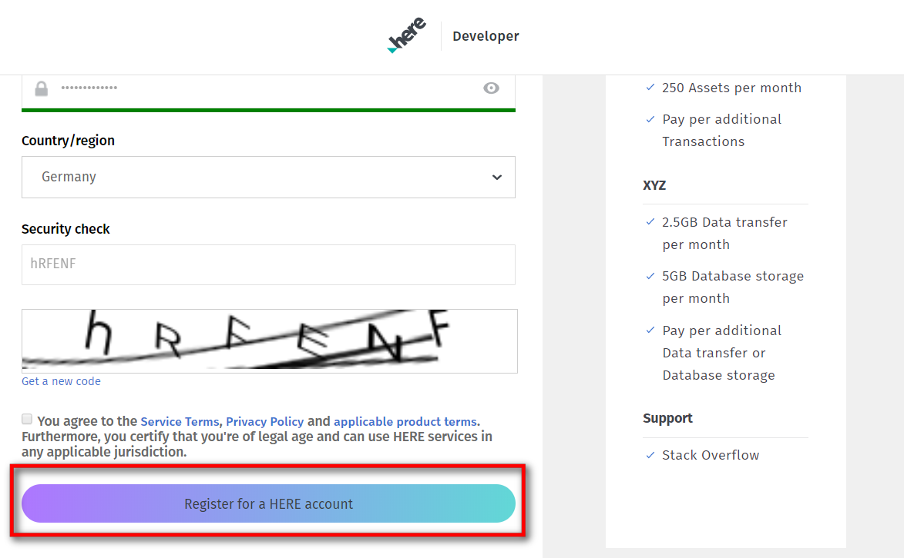
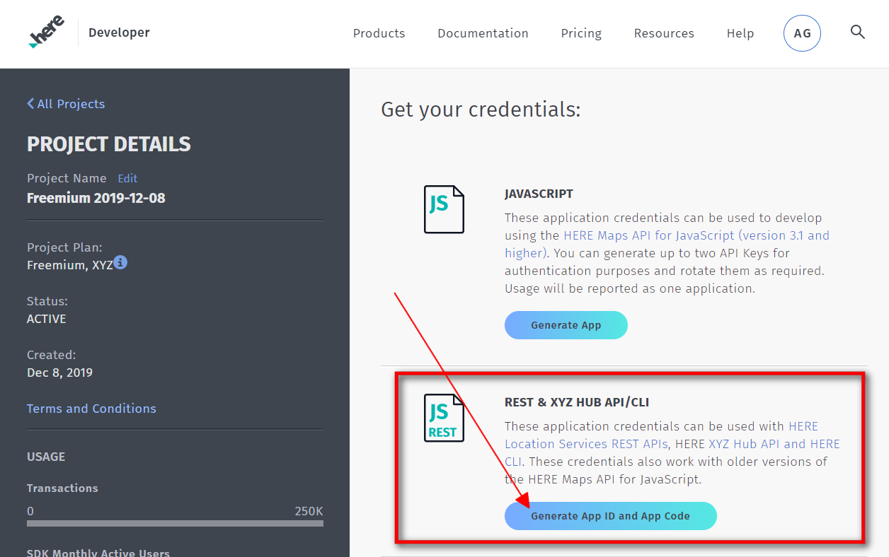

# IoBroker.roadtraffic
## Об этом адаптере
Этот адаптер использует HERE.com API для проверки трафика на ваших маршрутах. Вы можете настроить несколько маршрутов, и адаптер проверит фактическую ситуацию с трафиком и покажет, сколько времени займет ваше путешествие.
Адаптер находится в раннем состоянии прямо сейчас .. Я планирую включить будильник - чтобы вы могли сказать Адаптеру, в какое время вы должны быть на работе - и что должно произойти, когда пора уходить / просыпаться (Начните играть Сделайте радио и сделайте объявление типа «Похоже, что на вашем маршруте пробка. Вам нужно встать сейчас, чтобы не опоздать на работу!» На Алексе и т. Д.) ..
Не стесняйтесь создавать некоторые запросы к функциям здесь, на Github - просто откройте для этого вопрос! ;)

## Начиная
Итак, начнем:

1. Перейдите на страницу https://developer.here.com/sign-up?create=Freemium-Basic&keepState=true&step=account и создайте бесплатную учетную запись разработчика HERE.com (Freemium).

2. Убедитесь, что выбран Freemium, и заполните форму слева. (Имя, Фамилия, адрес электронной почты, ..)

3. Нажмите «Зарегистрироваться для получения учетной записи ЗДЕСЬ» и не забудьте поставить галочку (в соответствии с Условиями обслуживания и т. Д.).

4. Еще раз - согласитесь с Условиями и нажмите кнопку «Начать кодирование».

5. На следующей странице вы уже находитесь на панели инструментов HERE.com. Найдите раздел REST и нажмите «Создать приложение».

6. Нажмите «Создать ключ API» - вы получите ключ API. Откройте настройки экземпляра адаптера roadtraffic в ioBroker и вставьте ключ API в поле конфигурации.

7. Щелкните значок «Плюс» в настройках экземпляра и создайте свой первый маршрут.

После того, как вы ввели всю информацию в диалог настроек, нажмите «Сохранить и закрыть».
Адаптер должен перезагрузиться, и вы готовы к работе!

## Будильник
В настройках экземпляров вы можете включить будильник, установив флажок «Включить функцию будильника».
У вас должен быть установлен и настроен адаптер Alexa2 для использования push-соединения в настройках инстанса Alexa2.
Выберите устройство Alexa, которым вы хотите управлять с помощью адаптера, и введите идентификатор станции TuneIn, который вы хотите воспроизвести при срабатывании будильника.
Объем тревоги имеет диапазон от 0 до 100.
С помощью строки Speak вы можете управлять объявлением Alexa.
По умолчанию: Guten Morgen% name. Bei aktueller Verkehrslage benötigst du% dur zur Arbeit.

Через 15 секунд после того, как Alexa начнет играть на указанной станции TuneIn, будет объявлена строка.
Например, если у вас есть маршрут с именем «Даниэль» и триггеры тревоги, Алекса скажет: Гутен Морген, Даниэль. Bei aktueller Verkehrslage benötigst du 29 Minuten zur Arbeit.

Оставьте строку Speak пустой, если вы только хотите, чтобы Адаптер начал воспроизводить TuneIn Station, и не получил никакого объявления.

Каждый маршрут имеет 7 каналов тревоги (понедельник-воскресенье).
В каждом канале у вас есть следующие состояния:

* Время прибытия: введите время, в которое вы хотите быть в пункте назначения (пример: 07:30 - половина восьмого утра).
* bathtime: введите время, которое вы хотите добавить в время поездки. (Пример: 45 - 45 минут. Допустим, вы установили время прибытия на 10:00, время купания - на 30 минут, а текущее время поездки - 1 час. Затем адаптер сработает в 08:30 (время прибытия - время купания - время поездки).
* enabled: установить в значение true, если вы хотите включить будильник на этот день
* triggered: Адаптер установит это состояние в true, когда сработает Тревога. (Вы можете использовать его с собственными сценариями, например ..) Инициированное состояние будет сброшено в false в 00:00 соответствующего дня. (Субботний триггер будет установлен в false в субботу 00:00).

## Changelog
### 0.2.0 (2019-12-21)
* (BuZZy1337) Alarm-Clock implemented. (See Readme "Alarm-Clock" section for details)

### 0.1.1 (2019-12-13)
* (BuZZy1337) HERE.com changed the Authentication.
* (BuZZy1337) Prepare for Alarm.. (NOT WORKING YET!!! - But needed to push this version because of authentication changes)

### 0.1.0 (2019-12-08)
* (BuZZy1337) Using HERE.com instead of Google API (READ THE UPDATED README!!)

### 0.0.2 (2019-02-27)
* (BuZZy1337) Release to latest repository

### 0.0.1
* (BuZZy1337) initial release

## License
The MIT License (MIT)

Copyright (c) 2019 BuZZy1337 <buzzy1337@outlook.de>

Permission is hereby granted, free of charge, to any person obtaining a copy
of this software and associated documentation files (the "Software"), to deal
in the Software without restriction, including without limitation the rights
to use, copy, modify, merge, publish, distribute, sublicense, and/or sell
copies of the Software, and to permit persons to whom the Software is
furnished to do so, subject to the following conditions:

The above copyright notice and this permission notice shall be included in
all copies or substantial portions of the Software.

THE SOFTWARE IS PROVIDED "AS IS", WITHOUT WARRANTY OF ANY KIND, EXPRESS OR
IMPLIED, INCLUDING BUT NOT LIMITED TO THE WARRANTIES OF MERCHANTABILITY,
FITNESS FOR A PARTICULAR PURPOSE AND NONINFRINGEMENT. IN NO EVENT SHALL THE
AUTHORS OR COPYRIGHT HOLDERS BE LIABLE FOR ANY CLAIM, DAMAGES OR OTHER
LIABILITY, WHETHER IN AN ACTION OF CONTRACT, TORT OR OTHERWISE, ARISING FROM,
OUT OF OR IN CONNECTION WITH THE SOFTWARE OR THE USE OR OTHER DEALINGS IN
THE SOFTWARE.