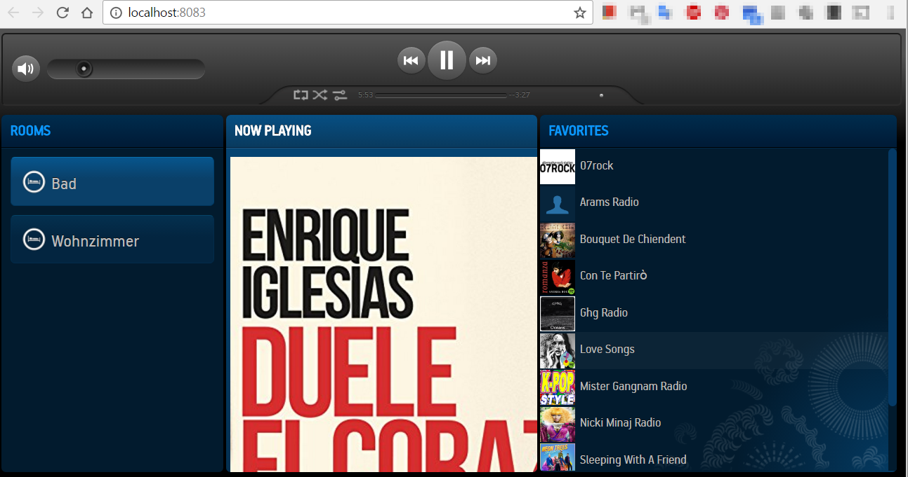
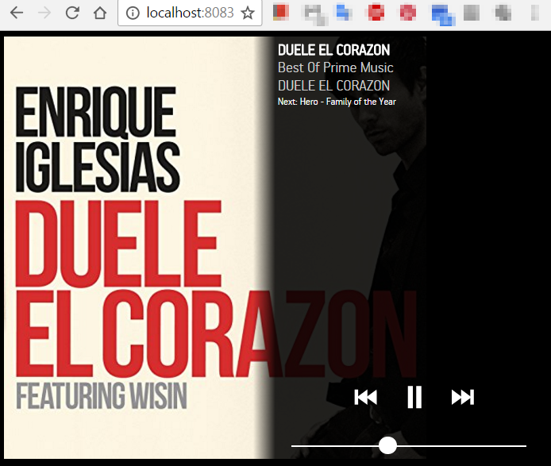

# IoBroker.sonos ==============




Управление и мониторинг плеера SONOS от ioBroker.

Использованные пакеты от Джимми Шимицу https://github.com/jishi/node-sonos-discovery и https://github.com/jishi/node-sonos-web-controller

** Для этого адаптера требуется узел 4.0.0 или выше! **

Чтобы разрешить использование адаптера sayIt с SONOS, убедитесь, что веб-адаптер также создан и работает. Веб-адаптер необходим для того, чтобы SONOS мог читать сгенерированный файл MP3 из sayIt.

Вы также можете использовать мобильный интерфейс. Его можно найти под ```http://ipaddress:8083/m/```

ТОДО: Показать очередь с обложками

## Информация об обработке групп
* Состояния: координатор, group_volume, group_muted
* все чтение / запись, чтобы получить также изменения от Sonos-App
* «Координатор» содержит название канала Мастера группы (например, 192_168_1_99). Если устройство не принадлежит ни к одной группе, значение равно названию собственного канала.

## Конфигурация
- Веб-сервер - [необязательно] Если веб-сервер включен или нет
- Порт - если веб-сервер включен, значит, порт для этого. По умолчанию 8083
- Обновление истекшего времени (мс) - Интервал в мс, как часто обновляется истекший таймер при воспроизведении заголовка. (По умолчанию 2000)

## Changelog
### 1.8.0 (2019-01-04)
- (bluefox) Support js-controller compact mode

### 1.7.7 (2018-08-06)
- (bluefox) Fixed error with node.js 6

### 1.7.5 (2018-08-06)
- (bluefox) Trying to correct fade-out

### 1.7.4 (2018-07-23)
- (bluefox) The group volume has a valid role now
- (bluefox) Important changes: state cover.png renamed to "cover_png"
- (bluefox) added shuffle, repeat and crossfade modes. To enable it you must delete device from list and add it again
- (bluefox) better icon
- (bluefox) fix fade out option

### 1.7.1 (2018-07-17)
- (bluefox) Ready for npm6

### 1.7.0 (2018-07-16)
- (bluefox) Added the support of Admin3

### 1.6.2 (2017-08-16)
- (soef) no duration/elapsed update on radio

### 1.6.0 (2017-04-09)
- (justr1) Enhance group Handling

### 1.5.0 (2017-02-23)
- (bluefox) use new configuration dialog

### 1.4.4 (2017-01-29)
- (soef) removeFromGroup extended

### 1.4.3 (2017-01-08)
- (bluefox) Allow to use the sonos web via with proxy

### 1.4.2 (2016-12-29)
- (bluefox) add states for vis control and change some roles

### 1.3.1 (2016-12-27)
- (bluefox) Fix TTS if fade was 0

### 1.3.0 (2016-12-13)
- (bluefox) Fix api changes of SONOS module

### 1.2.1 (2016-12-10)
- (bluefox) add web adapter as dependency

### 1.2.0 (2016-10-25)
- (bluefox) tts was rewritten because of new sonos-discovery interface

### 1.1.0 (2016-10-20)
- (bluefox) update sonos npm packets
- (bluefox) configurable fadeIn and fadeOut

### 1.0.0 (2016-10-16)
- (bluefox) fix fade out

### 0.2.2 (2016-09-30)
- (bluefox) fix types of states

### 0.2.1 (2016-09-25)
- (soef) fixed restore of radio after sayIt

### 0.2.0 (2016-07-28)
- (soef) fixed restore of radio after sayIt
- (bluefox) fix log outputs
- (bluefox) update libraries and use fix versions of it

### 0.1.10 (2016-05-26)
- (bluefox) check type of "state"

### 0.1.9 (2016-05-20)
- (bluefox) change default port to 8080

### 0.1.8 (2016-02-22)
- (hagen) - Better handling of radio stations (show -> album, streamInfo -> artist)
- (hagen) New state 'current_type' to tell if a track or radio is playing
- (hagen) (Hopefully) fixed the unreliable cover art update

### 0.1.7 (2015-09-14)
- (bluefox) fix favorites set

### 0.1.6 (2015-02-25)
- (bluefox) implement tts if radio is playing

### 0.1.5 (2015-02-13)
- (bluefox) set volume by TTS

### 0.1.4 (2015-01-04)
- (bluefox) catch errors if states deleted

### 0.1.3 (2015-01-02)
- (bluefox) enable npm install

### 0.1.2 (2014-12-12)
- (bluefox) redirect logging messages to ioBroker

### 0.1.1 (2014-12-04)
- (bluefox) translate grid in config dialog

### 0.1.0 (2014-12-04)
- (bluefox) use sonos-web-controller module as tarball from git

### 0.0.5 (2014-11-24)
- (bluefox) support of new naming concept


### 0.0.4 (2014-11-22)
- (bluefox) support of text to speech

### 0.0.3 (2014-11-01)
- (bluefox) support of text to speech and cover image

### 0.0.2 (2014-11-01)
- (bluefox) improve configuration edit

## License

The MIT License (MIT)

Copyright (c) 2014-2019, bluefox <dogafox@gmail.com>

Permission is hereby granted, free of charge, to any person obtaining a copy
of this software and associated documentation files (the "Software"), to deal
in the Software without restriction, including without limitation the rights
to use, copy, modify, merge, publish, distribute, sublicense, and/or sell
copies of the Software, and to permit persons to whom the Software is
furnished to do so, subject to the following conditions:

The above copyright notice and this permission notice shall be included in
all copies or substantial portions of the Software.

THE SOFTWARE IS PROVIDED "AS IS", WITHOUT WARRANTY OF ANY KIND, EXPRESS OR
IMPLIED, INCLUDING BUT NOT LIMITED TO THE WARRANTIES OF MERCHANTABILITY,
FITNESS FOR A PARTICULAR PURPOSE AND NONINFRINGEMENT. IN NO EVENT SHALL THE
AUTHORS OR COPYRIGHT HOLDERS BE LIABLE FOR ANY CLAIM, DAMAGES OR OTHER
LIABILITY, WHETHER IN AN ACTION OF CONTRACT, TORT OR OTHERWISE, ARISING FROM,
OUT OF OR IN CONNECTION WITH THE SOFTWARE OR THE USE OR OTHER DEALINGS IN
THE SOFTWARE.