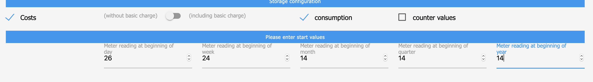

# SourceAnalytix


[![Статус перевода] (https://weblate.iobroker.net/widgets/adapters/-/sourceanalytix/svg-badge.svg)](https://weblate.iobroker.net/engage/adapters/?utm_source=widget)  **Этот адаптер использует службу [Sentry.io](https://sentry.io) для автоматического сообщения мне как разработчику об исключениях, ошибках кода и новых схемах устройств.** Подробнее см. Ниже!

Подробный анализ вашего потребления энергии, газа и жидкости Любой источник (кВтч, Втч, Ватт, л / час или м3) может быть использован для анализа данных:

## Особенности
#### Основные характеристики
| состояние | функциональность | Описание |
|--|--|--|
| > устройство <.cumulativeReading | [накапливать значения] (# cumulativeReading) | Рассчитать накопленные значения<br/> включая [преобразование] (# valueTransformation)<br/> накопленное значение можно изменить, выполнив [эти шаги](#cumulativeReading-Reset) |
| &gt; Устройство &lt;.&gt; Год &lt;.&gt; Текущий год | [Статистика за текущий год](#Current-Period) | Хранить статистическую информацию за текущий год на уровне<br/> &gt; устройство.&gt; текущий год &lt;.&gt; выбранный период &lt;|
| &gt; Год &lt;.&gt; Текущий Год.&gt; Вид потребления &lt;| [Потребление](#consumptionCalculation) | Корневая папка для хранения данных о потреблении<br/> (текущее значение - предыдущее значение).<br/> Может быть потребление или доставка |
| &gt; Год &lt;.&gt; CurrentYear.&gt; Тип затрат &lt;| [Расходы](#costCalculation) | Корневая папка для хранения данных о расходах.<br/> текущая стоимость * стоимость + базовая цена<br/> Может быть потребление или доставка |
| &gt; Год &lt;.&gt; CurrentYear.&gt; Тип затрат &lt;| [Стоимость] (# costCalculation) | Корневая папка для хранения данных о расходах.<br/> текущая стоимость * стоимость + базовая цена<br/> Может быть потребление или доставка |

Все местоположения состояний сгруппированы по имени штата и разделены точками и структурами [Категория](#Categories).<br/> Вычисления будут обрабатываться автоматически, а значения преобразованы в соответствующие единицы, как определено в [Цена-определения](#Price-DefinitionsPrice-Definitions).

Если у вас есть какие-либо вопросы, пожалуйста, прочтите сначала **[Поиск проблемы](#Troubleshooting)**

## Как
### Состояние-активация! 


| Элемент конфигурации | Описание |
|--|--|
| включен | Состояние активации для SourceAnalytix |
| Псевдоним | по умолчанию: имя состояния, имя устройства, как показано в SA |
| Выберите тип | обязательно, выберите тип расчета для расчета в соответствии с [Цена-определения](#Price-Definitions) |
| Выберите блок | по умолчанию: автоматически, при необходимости выберите вручную (см. журналы) |
| Стоимость | Расчет стоимости |
| с базовым зарядом | Включая базовую плату при расчете стоимости |
| потребление | рассчитать данные о потреблении |
| значения счетчика | сохранить текущие значения счетчиков |
| Показания счетчика в </br> начале x: | Начальное значение счетчика за определенный период для обработки </br> текущего расчета - startValue |

### Базовая конфигурация (экземпляр адаптера)


#### CumulativeReading
> ToDo: Опишите логику <

#### Расчет потребления
> ToDo: Опишите логику <

#### CostCalculation
> ToDo: Опишите логику <

#### ValueTransformation
&gt; Задачи: ссылка на документ в библиотеке (также в библиотеке документов!)<br/> &gt; Задачи: Документируйте преобразование ватт в кВтч<br/> &gt; ToDo: преобразование единиц документа (например, ватт, в Втч в кВтч<br/>

#### Год-Статистика
Хранить статистическую информацию о потреблении / ценах и / или затратах / доходах на уровне года<br/> &gt;&gt; устройство.&gt; этот год &lt;.&gt; категория &lt;.&gt; выбранный период

Эта информация обычно используется для хранения данных и исторических сравнений.<br/> Штаты сгруппированы по указанному периоду (например, 2020 год по сравнению с 2021 годом, или февраль 2019 года по сравнению с февралем и т. Д.)

&gt; #### *Недели* br/> &gt; Устройство &lt;.&gt; Год &lt;.&gt; Расходы / прибыль<br/> &gt; потребление / доставка &lt;.weeks. **weekNr** &lt;&gt; #### *Месяцы* br/> &gt; Устройство &lt;.&gt; Год &lt;.&gt; Расходы / прибыль<br/> &gt; потребление / доставка &lt;.months. **Month** &lt;&gt; #### *Quarters* br/> &gt; Устройство &lt;.&gt; Год &lt;.&gt; Расходы / прибыль<br/> &gt; расход / доставка &lt;. четверть. **Qx** &lt;

#### Текущий период
Сохранение статистической информации за текущий год на уровне:> устройство.> Текущий год <.> Выбранный период

&gt; #### *Недели* br/> &gt; Устройство &lt;.&gt; Год &lt;.&gt; Расходы / прибыль<br/> &gt; потребление / доставка &lt;.weeks. **weekNr** &lt;&gt; #### *Месяцы* br/> &gt; Устройство &lt;.&gt; Год &lt;.&gt; Расходы / прибыль<br/> &gt; потребление / доставка &lt;.months. **Month** &lt;&gt; #### *Quarters* br/> &gt; Устройство &lt;.&gt; Год &lt;.&gt; Затраты / прибыль&gt; потребление / доставка &lt;. Четверть. **Qx** &lt;

Эта информация обычно используется для ежедневного / еженедельного / ежемесячного расчета<br/> расходы / доходы и / или потребление / доставка сгруппированы по заданному периоду

> ToDo: добавить скриншоты <

#### Категории
| категория | тип | Описание |
|--|--|--|
| расходы | финансовый | Результат расчета значение * себестоимость + базовая цена |
| заработок | финансовый | Результат расчета стоимость * доходная цена + базовая цена |
| потребление | расчеты | Результат расчета значение как стоимость - начальное значение<br/> года / месяца / квартала и т. д. |
| доставка | расчеты | Результат расчета стоимости доставки - начальная стоимость<br/> года / месяца / квартала и т. д. |

### Поиск проблемы
Прежде чем мы начнем устранение неполадок, важно понять, как инициализируется source analytix, поскольку здесь могут возникать ошибки, см. Раздел проблем.
Будет обработана следующая последовательность:

1) Запустите SourceAnalytix 2) Перечислите все состояния, активированные для SourceAnalytix 3) Инициируйте состояния для каждого состояния:

    * Чтение текущего накопленного чтения </br>

      (если есть) и значения памяти из состояния

    * Проверить, можно ли обращаться с устройством {Проблема 1}
    * Проверьте, выбран ли тип стоимости {Проблема 2}
    * Проверьте, присутствует ли действительное определение цены для типа затрат {Проблема 3}
    * Проверить, не превышает ли предыдущее значение инициализации текущее накопленное значение {Проблема 4}
    * Проверьте, действительно ли известно о предыдущем сбросе устройства> текущее суммарное значение {Проблема 5}
    * Хранить все данные в памяти

4) Инициализируйте состояния для каждого состояния:

    * создание состояния cumulativeReading (для сохранения результатов расчета, также может использоваться только для W to kWh) {Issue 6}
    * создавать состояния, как выбрано в конфигурации состояний {Проблема 7}
    * начать расчет

5) При изменении / обновлении состояния

    * Проверить правильность информации
    * преобразовать значение в соответствующую единицу (единицу состояния в единицу, выбранную в конфигурации состояния)
  * проверьте правильность ввода значения (текущее значение **** предыдущее значение) {см. **7 При сбросе устройства** Проблема 8}
    * рассчитать {выпуск 9}
      * Для ватт: вычислить ватт в кВтч, вычислить накопленное чтение = текущее считывание + накопленное считывание
      * Для других: вычислить cumulatedReading = currentReading + previousDeviceReset (если есть)

6) Ночью (00.00)

    * Список всех включенных состояний SourceAnalytix
    * Сброс значений начала (день / неделя / год / месяц)

7) При перезагрузке устройства

    * Сохранить текущее значение как значение previousDeviceReset и previousInit </br>

Если устройство снова будет перезагружено (обнаружено значением previousInit), </br> currentReading + previousDeviceReset сохраняется как previousDeviceReset.

** Проблема 1 ** Не определены единицы для ....., невозможно выполнить вычисления </br> Пожалуйста, выберите правильную единицу в настройках состояния

** Проблема 2 ** Тип затрат не определен для ....., пожалуйста, выберите тип расчета при настройке состояния </br> Пожалуйста, выберите требуемый тип затрат, чтобы понять, какую сумму следует использовать для обработки расчетов

** Проблема 3 ** Выбранный тип ... не существует в определениях цен </br> Теперь определения цен найдены для выбранного типа затрат, пожалуйста, проверьте настройки цены (адаптируйте конфигурацию)

** Проблема 4 ** Проверьте настройки для .....! Известное значение инициализации: .....> известное совокупное значение ..... не может продолжаться </br> Известное значение инициализации> известные накопленные значения, это можно решить, удалив или изменив эти объекты в необработанном объекте состояния

```"valueAtDeviceInit": xxxx```

** Проблема 5 ** Проверьте настройки для .....! Known valueAtDeviceReset: .....> известное кумулятивное значение ..... не может быть продолжено </br> Известное значение инициализации> известные накопленные значения, это можно решить </br> удалив или изменив эти объекты в необработанном объекте состояния

```valueAtDeviceReset": xxxx```

** Проблема 6 ** Состояние для cumulativeReading не создается </br> Инициализация состояния не удалась, см. Проблемы с 1 по 5

** Проблема 7 ** Состояния для показаний затрат не созданы </br> Тип расчета не включен в настройках состояния 

### Определение цен 
** Проблема 8 **текущее значение** <** previousInit </br> Обнаружен сброс устройства, см. Функцию 7

** Проблема 9 ** Мои расчеты неверны </br>

#### CumulativeReading-Reset 1) Убедитесь, что выбрана правильная единица измерения (из невыбранных, SA попытается определить автоматически) 2) Убедитесь, что cumulativeReading отражает правильное общее значение вашего значения, если нет </br>
        - Остановить SA
        - Перейти на вкладку объектов

          

        - Войдите в экспертный режим
        - Изменить накопленное чтение
        - Выйти из экспертного режима
        - Убедитесь, что начальные значения установлены правильно
        - Запустить SA </br>

3) Убедитесь, что начальные значения установлены правильно.</br> SA обрабатывает вычисления с помощью cumulatedReading - известного cumulatedReading в начале периода. <b/>Эти начальные значения определены в настройках состояния и должны быть &lt;** currentReading **</b></br> <b/>Убедитесь, что кумулятивное чтение&gt; = DayStart&gt; = WeekStart&gt; = MonthStart&gt; = QuarterStart&gt; = YearStart </b>

4) Проверьте эти значения в состоянии необработанного объекта:

```valueAtDeviceReset": xxx```

```"valueAtDeviceInit": xxx```

<! - **Проблема 6** Настройка - Невозможно деактивировать состояние для SourceAnalytix

Im RAW NUR "потребление": ложный umgestellt, gespeichert. Das wurde behavior (wo ggf. noch nicht false, auch bei "enabled": false und bei "cost": false) In der Objekt-Übersicht ist der Schraubenschlüssel nachwievor blau. Dann mit dem Schraubenschlüssel in das Objekt, SA war nicht der Haken bei aktiviert drin. Dort einmal auf aktiviert, nicht speichern, wieder auf deaktiviert, speichern.
Контроль в RAW, ob SA-EIntrag nun weg => jup, is nun fott ->

<!--

* Отслеживайте потребление ежедневно, еженедельно, ежемесячно, ежеквартально, ежегодно
* рассчитать затраты (текущая цена настраивается)
* Может использоваться для потребления энергии, жидкостей и ГАЗА.
* Входные значения могут быть Вт / кВтч / Вт / м3 / л.

-->

Этот адаптер имеет корни благодаря pix еще в 2016 году https://forum.iobroker.net/viewtopic.php?f=21&t=2262

Что было улучшено с помощью @hadering и опубликовано на github https://github.com/hdering/homematic_verbrauchszaehler

## Делать
* [ ] Документация!
* [] Расчет периода можно выбрать, но еще не реализован
* [] месячная себестоимость еще не учтена в расчетах
* [] пересчет на основе значений счетчиков (настраивается по дате)
* [] добавить состояния объекта за предыдущий [x] день, [x] неделю, [x] месяц, [x] квартал, [x] год, настраивается в настройках адаптера

## Поддержите меня
Если вам нравятся мои работы, рассмотрите возможность личного пожертвования (это личная ссылка для пожертвований для DutchmanNL, не имеющая отношения к проекту ioBroker!) [![Пожертвовать] (https://raw.githubusercontent.com/iobroker-community-adapters/ioBroker.sourceanalytix/master/admin/button.png)](http://paypal.me/DutchmanNL)

## Что такое Sentry.io и что передается на серверы этой компании?
Sentry.io - это сервис, позволяющий разработчикам получать обзор ошибок в своих приложениях. Именно это и реализовано в этом адаптере.

Когда адаптер выходит из строя или возникает другая ошибка кода, это сообщение об ошибке, которое также появляется в журнале ioBroker, отправляется в Sentry. Когда вы разрешили iobroker GmbH собирать диагностические данные, включается также ваш идентификатор установки (это просто уникальный идентификатор **без** дополнительной информации о вас, электронной почты, имени и т. Д.). Это позволяет Sentry группировать ошибки и показывать, сколько уникальных пользователей затронуты такой ошибкой. Все это помогает мне предоставлять безошибочные адаптеры, которые практически никогда не дают сбоев.

<! - Заполнитель для следующей версии (в начале строки):

### __РАБОТА В ПРОЦЕССЕ__ ->
### 0.4.8-alpha.13 (15.01.2021)
* (Голландец) Исправление: ошибка {не является числом, невозможно продолжить вычисление}, если значение = 0

## Changelog
### 0.4.8-alpha.12 (2021-01-14)
* (Dutchman) Bugfix : Ensure daily reset does not destroy cumulative memory value (Fixes NULL values for Watt after night reset)
* (Dutchman) Bugfix : Ensure proper reset and init of Watt

### 0.4.8-alpha.10 (2021-01-14)
* (Dutchman) Bugfix : Avoid loop if init value is set and > reading
* (Dutchman) Bugfix : Throw error if value is NULL for troubleshooting instead of handling incorrect calculation

### 0.4.8-alpha.9 (2021-01-13)
#### Breaking changes
* (Dutchman) Breaking!!! Move current values to currentYear [#135](https://github.com/iobroker-community-adapters/ioBroker.sourceanalytix/issues/135)
* (Dutchman & ToTXR4Y) MajorChange !: Replaced **Current_Reading** with **CumulativeReading** [226](https://github.com/iobroker-community-adapters/ioBroker.sourceanalytix/issues/226)

#### New Features
* (Dutchman) Code cleanup
* (Dutchman) Add back "currentYear"
* (Dutchman) (debug) Logging improved
* (Dutchman) Weekly reset of weekdays
* (Dutchman) Calculation for all states
* (Dutchman) Calculation for previous states [#242](https://github.com/iobroker-community-adapters/ioBroker.sourceanalytix/issues/242)
* (Dutchman) Optimized error reporting (Sentry)
* (Dutchman) Removed unneeded settings in configuration
* (Dutchman) Implemented new configuration for "currentYear"
* (Dutchman & ToTXR4Y) implement "05_currentYear" in year root folder [#280](https://github.com/iobroker-community-adapters/ioBroker.sourceanalytix/issues/280)
* (Dutchman & ToTXR4Y) implement cached memory slot for initialisation value [#226](https://github.com/iobroker-community-adapters/ioBroker.sourceanalytix/issues/226)
* (Dutchman & ToTXR4Y) Implement log messages if state attributes are changed
* (Dutchman & ToTXR4Y) Implement automatically detection of currency from admin settings [#247](https://github.com/iobroker-community-adapters/ioBroker.sourceanalytix/issues/247)

#### BugFixes
* (Dutchman) Bugfix : dev: 0 bug workaround
* (Dutchman) Do not round cumulated reading
* (Dutchman) Bugfix : Calculations for "previous" values    
* (Dutchman) Bugfix : Avoid calculation of non-Initialised states
* (Dutchman) Bugfix : Cannot read property 'stateDetails' of null
* (Dutchman) Correct error handling of "Watt" state initialisation
* (Dutchman & ToTXR4Y) Bugfix : Rebuild calculation logic which solves :
  * Watt values : Ensure proper reading start (0 instead of current watt value)
    Watt values : Ensure proper reading calculation with exponent (0 instead of current watt value) [#281](https://github.com/iobroker-community-adapters/ioBroker.sourceanalytix/issues/281)
  * All calculations : correct handling  of device reset (if value is reset or 0)

### 0.4.7 (2020-09-15) Solved NULL error's & daily resets
* (Dutchman) Implement Sentry
* (Dutchman) Implement configuration for Price definitions
* (Dutchman) Bugfix: NULL value issue  at daily reset
* (Dutchman) Bugfix: Issue found in selection of category
* (Dutchman) Bugfix: Category issue (read value of undefined)
* (Dutchman) Bugfix: Issue in storing meter values by month
* (Dutchman) Bugfix: Wrong reading value for Watt initialisation
* (Dutchman) Bugfix: Warnings at object creations (js-controller 3.x)
* (Dutchman) Bugfix: wrong interpretation of start values at value resets
* (Dutchman) Bugfix: Proper error message instead of code crash if no cost type defined
* (Dutchman) Add device name for log messages if device value < than currently known value
* (Dutchman) Bugfix : Crash at adapter start if chosen Type is not present in instance configuration    

### 0.4.2 (2020-04-12) BugFixes
* (Dutchman) Translations updated
* (Dutchman) Bugfix : Values do not reset at new day start
* (Dutchman) Bugfix : Handle calculations when reading = 0
* (Dutchman) Bugfix : Handle calculations at initialisation
* (Dutchman) Bugfix : Pause all calculation during day-reset
* (Dutchman) Do not calculate values is state is update with same value as previous

### 0.4.0 (2020-04-05) Adapter completely redesigned, please test carefully
* (Dutchman) Complete code rebuild
* (Dutchman) Change data points to root by year
* (Dutchman) Delete unneeded states automatically
* (Dutchman) Calculation by quarter implemented
* (Dutchman) Storage of meter values implemented
* (Dutchman) Rebuild calculation logic to handle in memory instead of object DB (performance)

### 0.3.0   
* (Dutchman) m³ Implemented

### 0.2.5
* (xXBJXx) Fix wrong storage of start meter values

### 0.2.41
* (Dutchman) Fix wrong storage of daily reset of meter values

### 0.2.3
* (Xoroles & Dutchman) fix watt calculation, thank you @Xoroles !

### 0.2.29
* (Dutchman) implemented w to kWh calculations :) with thanks to @AlCalzone and @andiling !

### 0.2.276
* (Dutchman) implemented meter readings
* (Dutchman & @AlCalzone) code improvements & stability
* (Dutchman) fix issue with liquid unit reading (m3)

### 0.2.273
* (Dutchman) fix issue in daily reset of start values
* (Dutchman) Fix badges in readme
* (Dutchman) exclude calculations of w from current routines (will be implemented in next version(s)

### 0.2.272
* (Dutchman) change logic of initialisation
* (Dutchman) fix issue in calculation handling
* (Dutchman) extract unit definition to central function
* (Dutchman) removed "logging to troubleshoot", use "debug" in adapter setting

### 0.2.271
* (Dutchman) implement compact mode
* (Dutchman) fix testing issues
* (Dutchman) fix error "unit" or "tolowercase" is undefind
* (Dutchman) fixed installation issues

### 0.2.27
* (Dutchman) fixed issue related to multihost installations with slave as target

### 0.2.26
* (Dutchman) fixed issue in calculations for gas environments and liquids
* (Dutchman) improve logging related to issue analytics

### 0.2.25
* (Dutchman) add option in state setting to automatically OR manually choose the meassurement unit (for cases device state does not have correct value)

### 0.2.24
* (Dutchman) add support for heating pumps
* (Dutchman) improvements in adapter configuration screen

### 0.2.2
* (Dutchman) fixed reset of start values
* (Dutchman) removed uneeded logging "Write calculations for : "
* (Dutchman) generic improvement of logging, to see status messages activate it in adapter settings ! Otherwise onlyu erros will be shown and add/del devices
* (Dutchman) improved complete logic of state add/delete/update config in backend which will result in better performance/error handling
* (Dutchman) small fixed in configuration screen to show logging options

### 0.2.1
* (Dutchman) fixed "current_day" missing in object tree
* (Dutchman) fixed log messages "removed from SourceAnalytix"
* (Dutchman) fixed unit issue to support upper and lower case in values
* (Dutchman) fixed unit issue replace strange characters
* (Dutchman) remove intervall setting from configuraiton screen (handle by state subscribtion now!)
* (Dutchman) remove start meassurement from state configuraiton screen (not need, please use day start, week start etc !)

### 0.2.0
* (Dutchman) rebuild logic to calculate values (beta testing)
* (Dutchman) implement logic to automatically reset values by start of new day, week, month, year etc (beta testing)
* (Dutchman) changed logic from intervall polling to handle calculations based on state updates (beta testing, not if suitable for all situations)
* (Dutchman) fixed issue incorrect states are added to monitoring
* (Dutchman) fixed issue calculation not stopped when state removed from monitoring
* (Dutchman) always store all current meassurements to values of cathegorie regardless setting year etc
* (Dutchman) code cleanup and optiomalisation
* (Dutchman) added logging option "satus notification"
* (Dutchman) implement new translation mechanisme


### 0.1.9 
* (Dutchman) Adapter moved to community development tree
* (Dutchman) added npm version and test-status to readme
* (Dutchman) finalized new konfiguration screen & translations
* (Dutchman) adding/removing objects from analytix does not need adapter reboot anymore ! :-)
* (Dutchman) rebuild logic how data is handled as basic for new calculation logic (Experimental)
* (Dutchman) added options to year analytics to choose values (days,weeks,years etc)
* (Dutchman) option added for Developer logging
* (Dutchman) Basic price is currently not considered in cost calculations !
* (Dutchman) Values day start, week start etc are currenlty not automatically set (will be in 0.2.0)


### 0.1.8 (unuasable temporary verion )
* (Dutchman) konfiguration pages completly redesigned : Please do not enter values yet !
* (Dutchman) master konfiguration added to globally define costs
* (Dutchman) intervall settings moved to global setting instead of each state seperated
* (Dutchman) instead of cost-price in each state use drop down menu to choose values from global settings
* (Dutchman) fixed naming and translations

### 0.1.6
* (Dutchman) fixed data reset for quarter values (thank you Jens !)
* (Dutchman) fixed usage of alias
* (Dutchman) fixeded issue in calculation of earnings and delivery
* (Dutchman) logging improvement
* (Dutchman) fixed log messages
* (Dutchman) calculation for m3 values
* (Dutchman) calculation for l values

### 0.1.5
* (Dutchman) improved state write logic, only sent write commando when needed

### 0.1.3
* (Dutchman) add support for calculation of Wh values

### 0.1.0
* (Dutchman) first public beta release
* (Dutchman) fixed translations
* (Dutchman) rebuild calculation logic
* (Dutchman) fixed calculation of start offset
* (Dutchman) adjustable if state is used for cosumption or delivery
* (Dutchman) limited possible logging to kWh only for this moment
* (Dutchman) only create states and channels for logging types selected

### 0.0.9
* (Dutchman) fixed wrong calculation of start values
* (Dutchman) fixed wrong calculation of quarter values
* (Dutchman) prepare public beta and travis testing
* (Dutchman) change name to SourceAnalytix
* (Dutchman) implemented SourceAnalytix settings at states (equal to data logging adapters)
* (Dutchman) configurable unit for every state, automatically from object state. currently only kWh supported !

### 0.0.8
* (Dutchman) configurable intervall for every state

### 0.0.7
* (Dutchman) automated reset of start values

### 0.0.6
* (Dutchman) fixed issue with travis build
* (Dutchman) fixed wrong information in package-json

### 0.0.4
* (Dutchman) cost calculation
* (Dutchman) adjustable starting point of meassurement
* (Dutchman) support of multiple device states instead of 1
* (Dutchman) fixed calculation of current consumptions

### 0.0.3
* (Dutchman) code optimalisation

### 0.0.2
* (Dutchman) creation of object structure
* (Dutchman) first values read based on test_object.js input file to read values adn write data of current period.s

### 0.0.1
* (Dutchman) initial release

## License
MIT License

Copyright (c) 2020 Dutchman

Permission is hereby granted, free of charge, to any person obtaining a copy
of this software and associated documentation files (the "Software"), to deal
in the Software without restriction, including without limitation the rights
to use, copy, modify, merge, publish, distribute, sublicense, and/or sell
copies of the Software, and to permit persons to whom the Software is
furnished to do so, subject to the following conditions:

The above copyright notice and this permission notice shall be included in all
copies or substantial portions of the Software.

THE SOFTWARE IS PROVIDED "AS IS", WITHOUT WARRANTY OF ANY KIND, EXPRESS OR
IMPLIED, INCLUDING BUT NOT LIMITED TO THE WARRANTIES OF MERCHANTABILITY,
FITNESS FOR A PARTICULAR PURPOSE AND NONINFRINGEMENT. IN NO EVENT SHALL THE
AUTHORS OR COPYRIGHT HOLDERS BE LIABLE FOR ANY CLAIM, DAMAGES OR OTHER
LIABILITY, WHETHER IN AN ACTION OF CONTRACT, TORT OR OTHERWISE, ARISING FROM,
OUT OF OR IN CONNECTION WITH THE SOFTWARE OR THE USE OR OTHER DEALINGS IN THE
SOFTWARE.