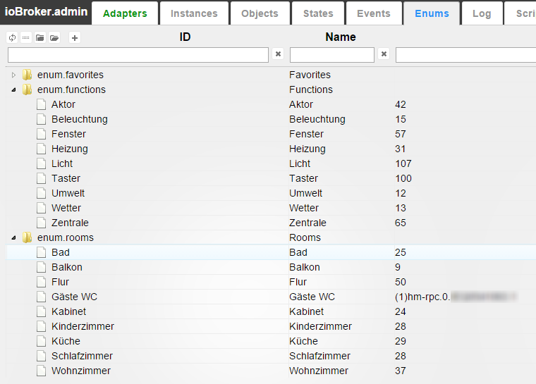

# IoBroker.text2command
## Описание
Этот адаптер может преобразовывать обычные предложения, такие как *'Переключить свет на кухне' '* на определенную команду и устанавливает состояние* adapter.0.device.kitchenLight '* в **true**

Этот адаптер не имеет смысла активироваться автономно. Его следует использовать с другими адаптерами, такими как telegram или Android-приложение **iobroker.vis**

## Использование
Чтобы выполнить команду, напишите состояние **text2command. <INSTANCE> .text** с предложением. Вы всегда получите ответ в **text2command. <INSTANCE> .response**

Если вы определите **Ответ для идентификатора** ответ также будет записан в этом идентификаторе. Это требуется, например, для реализовать голос признает.

Вы можете отправить сообщение через `sendTo` из javascript. Ответ придет в ответном сообщении:

```
sendTo('text2command', 'Switch light in kitchen on', function (err, response) {
    console.log('Response is: ' + response);
});
```

Можно использовать регулярные выражения, например: ```/^light\son|^lamp\son/```. Регулярные выражения всегда нечувствительны к регистру.

Чтобы использовать «Включение / выключение по функции», вы должны заботиться о функциях.

Ключевые слова работают следующим образом:

- ключевые слова разделены пробелом
- все ключевые слова должны присутствовать в предложении, чтобы вызвать правило: например, ключевое слово: `` `light on``` сработает при` `` включите свет```, `` `включите свет везде``` и не сработает при` `` включите````, `` ` сделать свет```.
- одно ключевое слово может иметь много форм. Варианты ключевых слов должны быть разделены на "/". Например. ключевые слова: `` `выключить / сделать / сделать свет включенным / true``` включит:` `` do light true```, `` `сделайте, пожалуйста, свет на ```.
- если ключевое слово может встречаться во многих случаях (nom, gen, винительный падеж, множественное число, ...), все они должны быть перечислены в виде вариаций, например: `` `Включить свет / свет на```.

Следующие функции будут интерпретироваться как

enum.functions:

** enum.functions.light ** (Licht | Свет):

- роли - level.dimmer
- Роли - Switch.light

** enum.functions.backlight ** (Beleuchtung | Подсветка):

- роли - level.backlight
- Роли - Switch.backlight

** enum.functions.blinds / shutter ** (Rolladen | Жалюзи / окна)

- роли - level.blind
- роли - switch.blind

** enum.functions.curtain ** (Vorhänge | Шторы)

- роли - level.curtain
- роли - switch.curtain

** enum.functions.heating ** (Heizung | Отопление / Подогрев)

- роли - уровень. температура
- роли - переключатель. температура

** enum.functions.music ** (Музыка | Музыка)

- Роли - Button.play
- роли - button.stop / button.pause

** enum.functions.alarm / security ** (Сигнализация / Тревога | Охрана)

- Роли - Switch.security

** enum.functions.lock ** (Schloß / Schloss | Замок)

- роли - switch.open
- роли - switch.lock

Поддерживаются следующие комнаты:

| ключевое слово во фразе | Возможные enum.rooms на английском | на немецком языке | по русски |
|-----------------------|---------------------------------|--------------------------|------------------------|
| везде | везде | - | - |
| живой | гостиная | вонзиммер | зал |
| спальня | спальня / спальня | шлафзиммер | спальня |
| ванна | ванная комната / ванна | бадезиммер / плохой | ванная |
| работа / офис | офис | Arbeitszimmer | кабинет |
| дети / ребенок / детская | питомник | детский кинзиммер | детская |
| гостевой туалет / гостевой шкаф | guestwc | Гастев гостевой туалет |
| туалет / шкаф | туалет | туалет | туалет |
| этаж / войти | пол | Diele / Gang / Flur | коридор / прихожая |
| кухня | кухня | Куче / Куче | кухня |
| балкон / терраса / патио | терраса | балкон / терраса | терасса / балкон |
| столовая | столовая | Эссзиммер | столовая |
| гараж | гараж | гараж | гараж |
| лестница | лестницы | трепе / треппенхаус | лестница |
| сад | сад | Garten | сад |
| двор / двор | суд | хоф | двор |
| гостевая комната | гостевая комната | гестезиммер | гостевая |
| чердак | чердак | Speicher | кладовка |
| крыша | крыша | дачстуль | крыша |
| терминал | терминал | аншлюссраум | сени |
| умывальник | уборная | ващраум | прачечная |
| обогрев помещения | Теплая комната | отопление / хейзунгсраум | котельная |
| лачуга | лачуга | schuppen / scheune | сарай |
| летний дом | дача | Gartenhaus | теплица |

Вы можете использовать шаблоны в подтверждениях:

- %s : значение
-% u: единица измерения
-% n: имя (планируется!)
- {objectId}: состояние этого objectID будет размещено здесь

Поддерживаются следующие команды:

### Который сейчас час?
Ответ: 14:56 (текущее время)

### Как тебя зовут?
Ответ настраивается. По умолчанию: ```My name is Alpha```

### Какая температура наружного воздуха?
Пользователь должен указать штатный идентификатор, где читать наружную температуру.
Ответ настраивается. По умолчанию: ```Outside temperature is %s %u``` **%s** будет заменено на температуру, округленную до целого числа. **u** будет заменено единицами этого состояния или единицами измерения температуры системы.

### Какая температура внутри?
Пользователь должен указать идентификатор состояния, в котором нужно прочитать внутреннюю температуру.
Ответ настраивается. По умолчанию: ```Inside temperature is %s %u``` **%s** будет заменено на температуру, округленную до целого числа. **u** будет заменено единицами этого состояния или единицами измерения температуры системы.

### Включить / выключить по функции
Эта команда читает информацию из перечислений. Он использует **enum.functions** для поиска типа устройства (например, подсветка, будильник, музыка) и **enum.rooms** для определения названия комнаты.

Пример на немецком языке: 

Ключевые слова для включения: *включить* например, ```switch rear light in bath on```

Ключевые слова для выключения: *выключить* например ```switch light in living room off```

При желании ответ будет сгенерирован автоматически: ```Switch off %function% in %room%```, где% function% и% room% будут заменены найденным типом устройства и местоположением.

Команда также принимает числовое значение. Это имеет приоритет, например в команде ```switch light off in living room on 15%``` свет будет установлен на 15%, а не в состояние *off*

Вы можете определить комнату по умолчанию в []. Например, ```switch the light on[sleepingroom]```

### Открывать / закрывать жалюзи
Эта команда читает информацию из перечислений. Он использует **enum.functions.blind** для поиска жалюзи или жалюзи и **enum.rooms** для определения названия комнаты.

Ключевые слова для продвижения блайндов: *блайнды* например ```set blinds up in sleeping room```

Ключевые слова для перемещения жалюзи: * жалюзи вниз, например ```move blinds down in office```

Вы можете указать точное положение слепого в процентах, например, ```move blinds to 40 percent in office```

При желании ответ будет сгенерирован автоматически: ``` in %room%```, где% room% будет заменен найденным типом устройства и местоположением.

### Включить / выключить что-то
Пользователь должен указать идентификатор состояния устройства, которым необходимо управлять, и значение, которое должно быть записано.

Вы должны создать правило для каждой позиции (например, для *on* и для *off* .

Ответ настраивается. По умолчанию: ```Switched on```

Например.:

- `` `Деактивировать тревогу```, ID объекта:` `` hm-rpc.0.alarm```, Значение: `` `false```, Ответ:` `` Тревога деактивирована / деактивирована``` , В этом случае ответ будет рандомизирован между *Тревога деактивирована* и *Деактивирована*
- `` `Активировать тревогу```, ID объекта:` `` hm-rpc.0.alarm```, Значение: `` `true```, Ответ:` `` Тревога активирована / Активирована / Готово` ``. В этом случае ответ будет рандомизирован между *Тревога активирована* *Активирована* и *Готово*

* Деактивировать * должен быть первым в списке, потому что он длиннее.

Вы можете использовать значения с плавающей точкой в командах управления. Если в тексте будет какое-либо числовое значение, оно будет использоваться в качестве контрольного значения, а предопределенное значение будет игнорироваться.

НАПРИМЕР. для правила для правила:

- `` `Установить уровень освещенности```, ID объекта:` `` hm-rpc.0.light.STATE```, Значение: `` `10```, Ответ:` `` Уровень установлен в %s  % `` `.

Если команда похожа на ```Set light level to 50%```, то в ```hm-rpc.0.light.STATE``` будет написано 50, а ответом будет ```Level set to 50%```.

Если команда похожа на ```Set light level```, то в ```hm-rpc.0.light.STATE``` будет написано 10, а ответом будет ```Level set to 10%```.

### Спроси о чем-нибудь
Пользователь должен указать идентификатор состояния устройства, значение которого будет считываться.
Этот шаблон ответит информацией из какого-либо штата.

Например.:

- `` `окна открыты```, ID объекта:` `` javascript.0.countOpenedWindows```, подтверждение: `` `Фактические %s  окна открыты```
- `` `температура спальной комнаты```, идентификатор объекта:` `` hm-rpc.0.sleepingRoomSensor.TEMPERATURE```, подтверждение: `` `Фактическая температура в спальной комнате составляет %s % u /% s% u `` ``. В этом случае ответ будет рандомизирован между *Фактическая температура в спальной комнате составляет% s% u* и *s% u*

### Отправить текст, чтобы заявить
Вы можете написать текст в состояние. Пользователь должен указать идентификатор состояния, чтобы записать в него текст.

Например. правило: ```email [to] wife```, ID объекта: ```javascript.0.emailToWife```, подтверждение: ```Email sent``` Текст: *Отправить письмо жене: я опоздаю* Адаптер ищет последнее слово из ключевых слов (в данном случае *жена* , извлекает текст из следующего слова (в этом случае *я опоздаю* и записывает этот текст в *javascript.0.emailToWife* Word *to* не требуется для запуска правила, но будет удален из текста.

### Ты хороший (просто для удовольствия)
Ответ настраивается. По умолчанию: ```Thank you``` или ```You are welcome```

### Спасибо (просто для удовольствия)
Ответ настраивается. По умолчанию: ```No problem``` или ```You are welcome```

### Создать ответ
Вы можете генерировать ответ с привязками {objectId} в подтверждение. Используется для Алексы.

Например.:

- `` `окна открыты```, Подтверждение:` `` `Фактические {javascript.0.countOpenedWindows} окна открыты```
- `` `температура спальной комнаты````, подтверждение:` `` Фактическая температура в спальной комнате: {t: hm-rpc.0.sleepingRoomSensor.TEMPERATURE; Math.round (т)} / {гм-rpc.0.sleepingRoomSensor.TEMPERATURE; round (1)} градус```. В этом случае ответ будет рандомизирован между *Фактическая температура в спальной комнате <VALUE>* и *<VALUE>*

Вы можете прочитать больше о привязках здесь: (Привязки объектов) [https://github.com/ioBroker/ioBroker.vis#bindings-of-objects]

Дополнительно вы можете получить время до настоящего времени с помощью {hm-rpc.0.light.STATE.lc; dateinterval} (2 минуты 12 секунд) или {hm-rpc.0.light.STATE.lc; dateinterval (true)} ( 2 минуты и 12 секунд **назад**

## Внешние правила с помощью JavaScript
Существует возможность использовать движок JavaScript для обработки команд в text2command.
Для этого вы должны указать какое-то состояние в «Идентификатор состояния процессора» (Расширенные настройки) и прослушать это состояние в каком-то сценарии JS или Blockly.
Вы можете создать некоторое состояние вручную в админке или в скрипте. Сценарий обработки может выглядеть так:

```
createState("textProcessor", '', function () {
    // text2command writes the value with ack=false. Change "any" is important too, to process repeated commands.
    on({id: "javascript.0.textProcessor", ack: false, change: 'any'}, function (obj) {
         var task = JSON.parse(obj.state.val);
         // value looks like
         // {
         //     "command":      "text to process", // command that was received by text2command
         //     "language":     "en",              // language in command or system language
         //     "withLanguage": false              // indicator if language was defined in command (true) or used default language (false)
         // }
         // response to text2command with ack=true
         if (task.command === 'switch light on') {
            setState("hm-rpc.0.light", true);
            setState("javascript.0.textProcessor", 'light is on', true);
         } else {
            // let it process with predefined rules
            setState("javascript.0.textProcessor", '', true);
         }
    });
});
```

Установите в настройках text2command **ID состояния процессора** как *javascript.0.textProcessor* чтобы этот пример работал.

Сначала команда будет обработана вашим javascript, и если javascript ответит с '' или не ответит в предопределенное время (1 секунда по умолчанию), команда будет обработана по правилам.

### Опция: запись ответа каждой командой
Если активируется так каждой командой (независимо от того, поступил ли запрос через состояние или sendTo), `text2command.X.response` будет записан с ответом.

# Делать
- по-русски мужские и женские ответы.

## Changelog
### 2.0.3 (2020-07-14)
* (bluefox) Fixed GUI errors

### 2.0.2 (2020-07-13)
* (bluefox) Fixed GUI errors

### 2.0.1 (2020-07-08)
* (bluefox) Fixed select ID dialog

### 2.0.0 (2020-07-06)
* (bluefox) New GUI

### 1.3.1 (2019-07-18)
* (unltdnetworx) changed copyright year to 2019, according to issue #41
* (unltdnetworx) additional words for blinds and functions in english and german
* (unltdnetworx) fixed typo

### 1.3.0 (2019-07-18)
* (bluefox) Using the defined language by words

### 1.2.5 (2019-02-12)
* (unltdnetworx) description in german corrected
* (unltdnetworx) added percent to true/false rules

### 1.2.4 (2018-05-05)
* (Apollon77) Fix

### 1.2.3 (2018-05-01)
* (bluefox) Support of bindings in answer {objId}

### 1.2.0 (2018-04-23)
* (bluefox) Support of Admin3 (but not materialize style)

### 1.1.7 (2018-04-04)
* (bluefox) The parsing error was fixed

### 1.1.6 (2017-10-05)
* (bluefox) Check if units are undefined

### 1.1.5 (2017-08-14)
* (bluefox) Support of iobroker.pro

### 1.1.4 (2017-03-27)
* (bluefox) translations

### 1.1.3 (2016-08-30)
* (bluefox) russian translations

### 1.1.2 (2016-08-29)
* (bluefox) fix the russian temperature text
* (bluefox) extend rule "control device" with option 0/1
* (bluefox) use by control of devices min/max values if set

### 1.1.1 (2016-08-19)
* (bluefox) add additional info for external text processor

### 1.1.0 (2016-08-16)
* (bluefox) add text processor state ID

### 1.0.2 (2016-07-22)
* (bluefox) fix error with detection of numeric values

### 1.0.1 (2016-06-01)
* (bluefox) fix: send text command

### 1.0.0 (2016-05-05)
* (bluefox) replace special chars in input text: #'"$&/\!?.,;:(){}^

### 0.1.10 (2016-03-20)
* (bluefox) fix double pronunciation of some answers

### 0.1.9 (2016-03-20)
* (bluefox) ignore spaces

### 0.1.8 (2016-03-15)
* (bluefox) fix error with enums

### 0.1.7 (2016-03-12)
* (bluefox) implement "say something"

### 0.1.6 (2016-02-24)
* (bluefox) fix temperature

### 0.1.5 (2016-02-23)
* (bluefox) fix russian outputs

### 0.1.4 (2016-02-22)
* (bluefox) fix russian outputs

### 0.1.3 (2016-02-21)

* (bluefox) round temperature in answers

### 0.1.2 (2016-02-21)
* (bluefox) implement russian time

### 0.1.1 (2016-02-19)
* (bluefox) check invalid commands

### 0.1.0 (2016-02-19)
* (bluefox) fix problem with controlling of channels
* (bluefox) enable write JSON as argument

### 0.0.3 (2016-02-14)
* (bluefox) remove unused files

### 0.0.2 (2016-02-10)
* (bluefox) extend readme

### 0.0.1 (2016-02-09)
* (bluefox) initial commit

## License

The MIT License (MIT)

Copyright (c) 2014-2020, bluefox <dogafox@gmail.com>

Permission is hereby granted, free of charge, to any person obtaining a copy
of this software and associated documentation files (the "Software"), to deal
in the Software without restriction, including without limitation the rights
to use, copy, modify, merge, publish, distribute, sublicense, and/or sell
copies of the Software, and to permit persons to whom the Software is
furnished to do so, subject to the following conditions:

The above copyright notice and this permission notice shall be included in
all copies or substantial portions of the Software.

THE SOFTWARE IS PROVIDED "AS IS", WITHOUT WARRANTY OF ANY KIND, EXPRESS OR
IMPLIED, INCLUDING BUT NOT LIMITED TO THE WARRANTIES OF MERCHANTABILITY,
FITNESS FOR A PARTICULAR PURPOSE AND NONINFRINGEMENT. IN NO EVENT SHALL THE
AUTHORS OR COPYRIGHT HOLDERS BE LIABLE FOR ANY CLAIM, DAMAGES OR OTHER
LIABILITY, WHETHER IN AN ACTION OF CONTRACT, TORT OR OTHERWISE, ARISING FROM,
OUT OF OR IN CONNECTION WITH THE SOFTWARE OR THE USE OR OTHER DEALINGS IN
THE SOFTWARE.