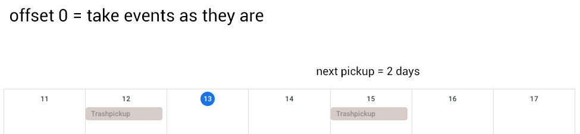

# IoBroker.trashschedule
Сканирует календарь для подсчета дней, оставшихся до следующего вывоза мусора

## Предварительные условия
1. Создайте **фактический экземпляр**
2. Настройте URL-адрес вашего календаря (например, календарь Google).
3. Установите для параметра "Дни предварительного просмотра" диапазон, включающий каждый тип корзины как минимум дважды (например, 30 дней).
4. Выберите вариант «Скрыть начало и конец событий».
5. Если вы используете вкладку «События», убедитесь, что для каждого типа события установлен флажок «Отображать», который также должен использоваться в вашем расписании корзины (в противном случае событие будет скрыто экземпляром ical).

## Конфигурация
1. Создайте экземпляр расписания корзины и выберите этот экземпляр в качестве источника.
2. Перейдите на вкладку типов мусора и добавьте названия типов и совпадения событий.
3. Запустите экземпляр.

** Вопросы? ** Проверьте FAQ: [Немецкий](https://github.com/klein0r/ioBroker.trashschedule/blob/master/faq_de.md)

## Виджет VIS


## Пример блока


```xml
<xml xmlns="https://developers.google.com/blockly/xml">
  <block type="comment" id="@ObjS.SGnDWy?:*J=bee" x="37" y="188">
    <field name="COMMENT">Um 18:00 Uhr am Vortag (verbleibende Tage = 1) erinnern, dass Abholung bevorsteht</field>
    <next>
      <block type="schedule" id=";J}3hpr7:d~*N?CrR==A">
        <field name="SCHEDULE">0 18 * * *</field>
        <statement name="STATEMENT">
          <block type="controls_if" id="EjaN~}B1gMA9ySf2%9kr">
            <value name="IF0">
              <block type="logic_operation" id="+hQc|po$a[W}HKd]slrE" inline="false">
                <field name="OP">AND</field>
                <value name="A">
                  <block type="get_value" id="Q;BN3$0J3q5$0sumfBYC">
                    <field name="ATTR">val</field>
                    <field name="OID">trashschedule.0.next.dateFound</field>
                  </block>
                </value>
                <value name="B">
                  <block type="logic_compare" id=")Z1Ml4oq9UCnquPo!giX">
                    <field name="OP">EQ</field>
                    <value name="A">
                      <block type="get_value" id="k@gpt[%7O[i`*b;SWlu4">
                        <field name="ATTR">val</field>
                        <field name="OID">trashschedule.0.next.daysLeft</field>
                      </block>
                    </value>
                    <value name="B">
                      <block type="math_number" id="([hVlm^PW0,gm`C/xp?a">
                        <field name="NUM">1</field>
                      </block>
                    </value>
                  </block>
                </value>
              </block>
            </value>
            <statement name="DO0">
              <block type="pushover" id="vqjP6Z6|7M.^)lx4]GiG">
                <field name="INSTANCE"></field>
                <field name="SOUND">gamelan</field>
                <field name="PRIORITY">0</field>
                <field name="LOG"></field>
                <value name="MESSAGE">
                  <shadow type="text" id="yt8+Z!a;[|CJy`,K(B.3">
                    <field name="TEXT">text</field>
                  </shadow>
                  <block type="text_join" id="pm:dwF91X!Oj82P^4Oz8">
                    <mutation items="2"></mutation>
                    <value name="ADD0">
                      <block type="text" id="%|}mW_iCoyweL$jy9wHq">
                        <field name="TEXT">Morgen wird der Müll abgeholt: </field>
                      </block>
                    </value>
                    <value name="ADD1">
                      <block type="get_value" id="~TDqVlE(:gEW7snO2_]s">
                        <field name="ATTR">val</field>
                        <field name="OID">trashschedule.0.next.typesText</field>
                      </block>
                    </value>
                  </block>
                </value>
                <value name="TITLE">
                  <block type="text" id="t*+0*zY(|S3fI3WBX[2g">
                    <field name="TEXT">Müllabfuhr</field>
                  </block>
                </value>
              </block>
            </statement>
          </block>
        </statement>
        <next>
          <block type="comment" id="~rf)Dy*vQ]9g?yVIWVsP">
            <field name="COMMENT">Um 07:00 Uhr am Abholtag (verbleibende Tage = 0) erinnern, dass Abholung bevorsteht</field>
            <next>
              <block type="schedule" id="O%4=ke4-(?vnjhtIDnt3">
                <field name="SCHEDULE">0 7 * * *</field>
                <statement name="STATEMENT">
                  <block type="controls_if" id="kyfB;W(WcA(/-ZWG2j6(">
                    <value name="IF0">
                      <block type="logic_operation" id=".wZBS3T):whb7WB!a-c_" inline="false">
                        <field name="OP">AND</field>
                        <value name="A">
                          <block type="get_value" id=",jhL[do$G_Q6TNBH,D]o">
                            <field name="ATTR">val</field>
                            <field name="OID">trashschedule.0.next.dateFound</field>
                          </block>
                        </value>
                        <value name="B">
                          <block type="logic_compare" id="Rlwt:Jv/rTfO.E:ZmYak">
                            <field name="OP">EQ</field>
                            <value name="A">
                              <block type="get_value" id="WdL)rds~)z*-)1k),cX(">
                                <field name="ATTR">val</field>
                                <field name="OID">trashschedule.0.next.daysLeft</field>
                              </block>
                            </value>
                            <value name="B">
                              <block type="math_number" id="w%5y6PluO}wjq]lDY+Gd">
                                <field name="NUM">0</field>
                              </block>
                            </value>
                          </block>
                        </value>
                      </block>
                    </value>
                    <statement name="DO0">
                      <block type="pushover" id="L,TLF/L9|B6bF4)|gj?F">
                        <field name="INSTANCE"></field>
                        <field name="SOUND">gamelan</field>
                        <field name="PRIORITY">0</field>
                        <field name="LOG"></field>
                        <value name="MESSAGE">
                          <shadow type="text">
                            <field name="TEXT">text</field>
                          </shadow>
                          <block type="text_join" id="Cw#u;:L537u`7Dz2:Kll">
                            <mutation items="2"></mutation>
                            <value name="ADD0">
                              <block type="text" id=".zD)ZQXz7Esr0%?Z1Y(|">
                                <field name="TEXT">Heute wird der Müll abgeholt: </field>
                              </block>
                            </value>
                            <value name="ADD1">
                              <block type="get_value" id="9m]6=cBQH_B(%ZOH*j-4">
                                <field name="ATTR">val</field>
                                <field name="OID">trashschedule.0.next.typesText</field>
                              </block>
                            </value>
                          </block>
                        </value>
                        <value name="TITLE">
                          <block type="text" id="ki`]5O+.IzI%2Gfw5VT-">
                            <field name="TEXT">Müllabfuhr</field>
                          </block>
                        </value>
                      </block>
                    </statement>
                  </block>
                </statement>
              </block>
            </next>
          </block>
        </next>
      </block>
    </next>
  </block>
</xml>
```

## Конфигурация смещения
## По умолчанию 0


## Пример 1


## Пример -1


## Changelog

### 1.1.1

* (klein0r) ...

### 1.1.0

* (klein0r) Just allow clean trash type names **(BREAKING CHANGE - CHECK YOUR SCRIPTS AND VIS)**

### 1.0.6

* (klein0r) Fixed async object creation

### 1.0.5

* (klein0r) Added automatic refresh every full hour

### 1.0.4

* (klein0r) Delete unsed states

### 1.0.3

* (klein0r) Improved VIS widget options

### 1.0.2

* (klein0r) Added color picker
* (klein0r) Fixed null reference exception

### 1.0.1

* (klein0r) Fixed date calculation issue in VIS

### 1.0.0

* (klein0r) Renamed data types **(BREAKING CHANGE - CHECK YOUR SCRIPTS AND VIS)**
* (klein0r) First **stable** release
* (klein0r) Added iobroker sentry

### 0.0.11

* (klein0r) Better error reporting

### 0.0.10

* (klein0r) Added CSS classes for easier customization
* (klein0r) Added optional glow on due date for vis widget

### 0.0.9

* (klein0r) Fixed color correction calculation issue

### 0.0.8

* (klein0r) Fixed missing VIS translations

### 0.0.7

* (klein0r) Improved logging
* (klein0r) Several fixes, improved admin and vis (automatic color correction, resizeable widget)
* (ivosch68) Reset of states if no event matches

### 0.0.6

* (klein0r) updated dependencies

### 0.0.5

* (klein0r) added pickup dates after next date

### 0.0.4

* (klein0r) added VIS templates

### 0.0.3

* (klein0r) fixed issue with events after time change date

### 0.0.2

* (klein0r) added global offset in days
* (klein0r) added exact match for types

### 0.0.1

* (klein0r) initial release

## License

MIT License

Copyright (c) 2021 Matthias Kleine <info@haus-automatisierung.com>

Permission is hereby granted, free of charge, to any person obtaining a copy
of this software and associated documentation files (the "Software"), to deal
in the Software without restriction, including without limitation the rights
to use, copy, modify, merge, publish, distribute, sublicense, and/or sell
copies of the Software, and to permit persons to whom the Software is
furnished to do so, subject to the following conditions:

The above copyright notice and this permission notice shall be included in all
copies or substantial portions of the Software.

THE SOFTWARE IS PROVIDED "AS IS", WITHOUT WARRANTY OF ANY KIND, EXPRESS OR
IMPLIED, INCLUDING BUT NOT LIMITED TO THE WARRANTIES OF MERCHANTABILITY,
FITNESS FOR A PARTICULAR PURPOSE AND NONINFRINGEMENT. IN NO EVENT SHALL THE
AUTHORS OR COPYRIGHT HOLDERS BE LIABLE FOR ANY CLAIM, DAMAGES OR OTHER
LIABILITY, WHETHER IN AN ACTION OF CONTRACT, TORT OR OTHERWISE, ARISING FROM,
OUT OF OR IN CONNECTION WITH THE SOFTWARE OR THE USE OR OTHER DEALINGS IN THE
SOFTWARE.