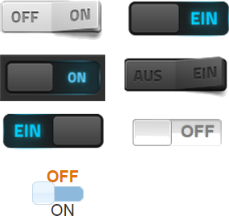

 ioBroker.vis-fancyswitch ============

fancyswitch - переключение виджетов для ioBroker.vis, портированных с http://papermashup.com/jquery-fancy-switch/ из @ashleyford

## Changelog

### 1.1.0 (2016-07-17)
- (Apollon77) Enhance handling of boolean and textual values for on/off

### 1.0.0 (2016-04-07)
- (bluefox) fix button Giva Labs iButton (other widgets did not work)

### 0.0.3 (2015-10-04)
- (bluefox) add version output

### 0.0.2 (2015-10-04)
- (bluefox) fix dependencies

### 0.0.1 (2015-10-04)
- (bluefox) initial checkin

## License
 Copyright (c) 2013-2016 hobbyquaker https://github.com/hobbyquaker, bluefox https://github.com/GermanBluefox
 Apache 2.0