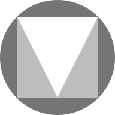 <! - пропустить в toc ->


## IoBroker.vis-materialdesign
<! - опустить в toc ->

# Виджеты Material Design для ioBroker VIS [![PayPal] (https://www.paypalobjects.com/en_US/i/btn/btn_donateCC_LG.gif)](https://www.paypal.com/cgi-bin/webscr?cmd=_s-xclick&hosted_button_id=VWAXSTS634G88&source=url)
Виджеты ioBroker Material Design основаны на [Рекомендации Google по материальному дизайну](https://material.io/design/)

<br>

<! - опустить в toc ->

## Таблица содержания
- [Общие] (# общие)
- [Интернет-пример проекта] (# онлайн-пример-проект)
- [Практические примеры] (# практических-примеров)
- [Вопросы и ответы о виджетах] (# вопросы и ответы о виджетах)
- [Поддерживаемый браузер] (# поддерживаемый браузер)
- [Поддерживаемый браузер для функции вибрации на мобильных устройствах] (# supported-browser-for-vibrate-on-mobil-devices-function)
- [Приложение ioBroker VIS] (# iobroker-vis-app)
- [Настройки адаптера] (# настройки адаптера)
- [Общий] (# общий-1)
- [Редактор тем] (# редактор тем)
- [Настройки темы] (# настройки темы)
- [Виджеты] (# виджетов)
- [Значки и изображения материального дизайна] (# material-design-icons-and-images)
- [Настройки редактора] (# редактор-настройки)
- [Свойства HTML] (# html-свойства)
- [Кнопки] (# кнопки)
- [Кнопки по вертикали] (# кнопки по вертикали)
- [Значок кнопок] (значок # кнопок)
- [Флажок] (флажок #)
- [Настройки редактора] (# editor-settings-1)
- [Свойства HTML] (# html-properties-1)
- [Переключатель] (переключатель #)
- [Настройки редактора] (# editor-settings-2)
- [Свойства HTML] (# html-properties-2)
- [Карта] (# карта)
- [Список] (# список)
- [Настройки редактора] (# editor-settings-3)
- [Свойства данных JSON] (# data-json-properties)
- [IconList] (# список значков)
- [Настройки редактора] (# editor-settings-4)
- [Свойства JSON данных] (# data-json-properties-1)
- [Прогресс] (# прогресс)
- [Настройки редактора] (# editor-settings-5)
- [Свойства HTML] (# html-properties-3)
- [Информационный бюллетень] (# информационный проспект)
- [Настройки редактора] (# editor-settings-6)
- [Свойства HTML] (# html-properties-4)
- [Слайдер] (# слайдер)
- [Свойства HTML] (# html-properties-5)
- [Круглый слайдер] (# круговой слайдер)
- [Свойства HTML] (# html-properties-6)
- [Ввод] (# вход)
- [Ввод текста] (# ввод текста)
- [Настройки редактора] (# editor-settings-7)
- [Свойства HTML] (# html-properties-7)
- [Выбрать] (# выбрать)
- [Свойства меню JSON] (# menu-json-properties)
- [Свойства HTML] (# html-properties-8)
- [Автозаполнение] (# автозаполнение)
- [Свойства меню JSON] (# menu-json-properties-1)
- [Свойства HTML] (# html-properties-9)
- [Верхняя панель приложений] (# верхняя панель приложений)
- [Подменю] (# подменю)
- [Свойства JSON] (# свойства json)
- [Диаграммы] (# диаграмм)
- [Гистограмма] (# гистограмма)
- [Настройки редактора] (# editor-settings-8)
- [Свойства JSON набора данных] (# набор данных-json-properties)
- [Круговая диаграмма] (# круговая диаграмма)
- [Настройки редактора] (# editor-settings-9)
- [Свойства JSON набора данных] (# dataset-json-properties-1)
- [Линейный график истории:] (# линейный график истории)
- [Настройки редактора] (# editor-settings-10)
- [JSON Chart] (# json-chart)
- [Свойства JSON] (# json-properties-1)
- [Таблица] (# таблица)
- [Настройки редактора] (# editor-settings-11)
- [Data - JSON Stucture] (# data --- json-stucture)
- [привязка внутреннего объекта] (# привязка внутреннего объекта)
- [Виджеты управления HTML] (# html-control-widgets)
- [Элементы управления - **устарело с версии v0.5.0** (# элементы управления --- устарело с версии v050)
- [Адаптивный макет] (# адаптивный макет)
- [Виды кладки] (# вида кладки)
- [Настройки редактора] (# editor-settings-12)
- [Представления сетки] (# представлений сетки)
- [Настройки редактора] (# editor-settings-13)
- [Оповещения] (# оповещений)
- [Настройки редактора] (# editor-settings-14)
- [Свойства Datapoint JSON] (# datapoint-json-properties)
- [Сценарий: отправить предупреждение виджету] (# script-send-alert-to-widget)
- [Календарь] (# календарь)
- [Настройки редактора] (# editor-settings-15)
- [Свойства Datapoint JSON] (# datapoint-json-properties-1)
- [Скрипт: ical-преобразование] (# скрипт-ical-преобразование)
- [Диалог] (# диалог)
- [Настройки редактора] (# editor-settings-16)
- [HTML-виджеты] (# html-widgets)
- [используемые библиотеки] (# использованные библиотеки)
- [Список изменений] (# список изменений)
- [Лицензия] (# лицензия)

# Общее
## Интернет-пример проекта
предоставлено [iobroker.click](https://iobroker.click/index.html), спасибо bluefox и iobroker.

* <a href="https://iobroker.click/vis/index.html?Material%20Design%20Widgets" target="_blank">VIS Runtime</a> ( <a href="http://iobroker.click:8082/vis/index.html?Material%20Design%20Widgets" target="_blank">альтернатива</a> )
* <a href="https://iobroker.click/vis/edit.html?Material%20Design%20Widgets" target="_blank">Редактор VIS</a> ( <a href="http://iobroker.click:8082/vis/edit.html?Material%20Design%20Widgets" target="_blank">альтернатива</a> )

## Практические примеры
* [Просмотр погоды] (https://forum.iobroker.net/topic/32232/material-design-widgets-wetter-view)
* [Статус сценария] (https://forum.iobroker.net/topic/30662/material-design-widgets-skript-status)
* [Статус адаптера] (https://forum.iobroker.net/topic/30661/material-design-widgets-adapter-status)
* [Статус UniFi Netzwerk] (https://github.com/Scrounger/ioBroker.vis-materialdesign/tree/master/examples/UnifiNetworkState)

## Вопросы и ответы о виджетах
Если у вас есть вопросы по отдельным виджетам, сначала просмотрите темы отдельных виджетов.

* [Немецкие темы] (https://forum.iobroker.net/search?term=Material%20Design%20Widgets%3A&in=titles&matchWords=all&by%5B%5D=Scrounger&categories%5B%5D=7&sortBy=topic.title&sortDshoirection=desc темы)

## Поддерживаемый браузер
Я официально поддерживаю последние две версии всех основных браузеров. В частности, я тестирую следующие браузеры:

* Firefox в Windows и Linux
* Chrome для Android, Windows и Linux

## Поддерживаемый браузер для функции вибрации на мобильных устройствах
https://developer.mozilla.org/en-US/docs/Web/API/Navigator/vibrate

## Приложение ioBroker VIS
последняя версия должна быть реализована приложением, см. https://github.com/ioBroker/ioBroker.vis.cordova.
Я не использую приложение и не тестирую на нем

# Настройки адаптера
Начиная с версии 0.4.0 есть страница настроек адаптера. Вы можете найти его в разделе «Экземпляры» в пользовательском интерфейсе адаптера администратора.

## Общее


| установка | описание |
| ---------------------- | -------------------------------------------------------------------------------------------------------------------------------------------------------------------------------------------------------------------------------------------------------------------------- |
| Документация | Ссылки на документацию, которая поможет вам настроить виджеты |
| Сгенерировать глобальный скрипт | Создайте глобальный сценарий для [Механизм сценариев Javascript](https://github.com/ioBroker/ioBroker.javascript) со всеми точками данных темы. Это позволяет удобно использовать цвета, шрифты и размеры шрифтов в скриптах. |
| Часовой | используйте библиотеки Sentry, чтобы анонимно сообщать разработчикам об исключениях и ошибках кода. Для получения дополнительных сведений и информации о том, как отключить отчет об ошибках, см. [Документация Sentry-Plugin] (https://github.com/ioBroker/plugin-sentry#plugin-sentry)! |

## Редактор тем
С помощью редактора тем вы можете централизованно устанавливать цвета, шрифты и размеры шрифтов для всех виджетов через настройки адаптера. Для каждого виджета создаются точки данных (см. Снимок экрана ниже) с заданными значениями. Это также позволяет использовать эти настройки в других виджетах (не в виджетах Material Design) через привязки.

##### Структура Datapoint


### Настройки темы


Каждая страница настроек для цветов, темных цветов, шрифтов и размеров шрифтов выглядит так, как показано на скриншоте выше.

Стандартные цвета / шрифты / размеры шрифта можно определить в верхней части. Эти стандартные цвета / шрифты / размеры шрифта затем могут быть назначены отдельным виджетам с помощью кнопок в таблице. Если вы измените цвета / шрифты / размеры по умолчанию, это также изменится для всех виджетов, которые используют эти цвета / шрифты / размеры шрифта.
Кроме того, виджетам можно назначить свои собственные цвета / шрифты / размеры шрифта, независимо от стандартных цветов.

Для цветов есть две темы - светлая тема и темная тема. С помощью точки данных `vis-materialdesign.0.colors.darkTheme` вы можете переключаться между двумя темами. Например, эту точку данных можно использовать в скрипте для переключения между светом и темными цветами на восходе и закате.

##### VIS Editor (восстановление / обновление старых виджетов)
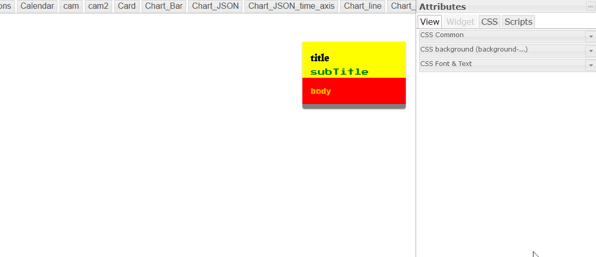

В редакторе VIS вы найдете кнопку `use theme` для каждого виджета. С помощью этой кнопки вы можете сбросить виджеты на использование тем. Это означает, что если вы изменили цвета, шрифт или размер шрифта, вы можете сбросить их с помощью этой кнопки.

С помощью этой кнопки также можно обновить ваши виджеты с версий до 0.4.0, чтобы использовать темы.

##### Изменить привязку точки данных для виджетов Material Design


Если вы хотите изменить использование других цветов, которые определены для других виджетов, вы можете скопировать привязку точки данных, нажав кнопку со значком материального дизайна. Просто вставьте это в любое поле цвета, шрифта или размера шрифта виджета материального дизайна. Например, цветовая «привязка состояния» выглядит как `#mdwTheme:vis-materialdesign.0.colors.card.background`

##### Использовать привязку для виджетов без материального дизайна


В настройках адаптера вы можете скопировать команду привязки в буфер обмена, нажав на кнопку со значком iobroker. Затем эту привязку можно использовать путем копирования и вставки даже для виджетов, не относящихся к материальному дизайну. Например, цветовая привязка выглядит как `{mode:vis-materialdesign.0.colors.darkTheme;light:vis-materialdesign.0.colors.light.card.background;dark:vis-materialdesign.0.colors.dark.card.background; mode === "true" ? dark : light}`

# Виджеты
## Значки и изображения Material Design


### Настройки редактора
Настройки, не перечисленные в таблице ниже, не требуют пояснений.

<table><thead><tr><th>Снимок экрана</th><th> Описание</th></tr></thead><tbody><tr><td rowspan=6>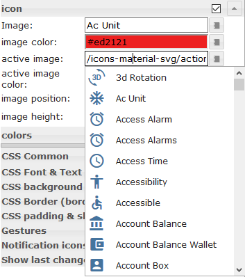</td><td> Некоторые виджеты поддерживают библиотеку <a href="https://materialdesignicons.com/" target="_blank">значков материального дизайна</a> . Вы можете нарисовать значок из списка выше или открыть средство выбора изображений, нажав кнопку справа от поля ввода.<br><br> <b>Цвета изображения применимы только к значкам материального дизайна, а не к изображению!</b></td></tr></tbody></table>

### Свойства HTML
Следующие свойства могут использоваться как [HTML-виджеты](#html-widgets).

<table><thead><tr><th>Свойство</th><th> Описание</th><th> Тип</th><th> Ценности </th></tr></thead><tbody><tr><td colspan="4" style="background: #44739e; color: white; border-color: #44739e;"> <i><b><br>Общие</b></i></td></tr><tr><td> mdw-mdwIcon</td><td> икона</td><td> строка</td><td></tr><tr><td> mdw-mdwIconSize</td><td> размер значка</td><td> количество</td><td></tr><tr><td> mdw-mdwIconColor</td><td> цвет значка</td><td> строка</td><td> шестнадцатеричный (# 44739e), RGB (20, 50, 200), RGBA (20, 50, 200, 0,5)</tr><tr><td> mdw-debug</td><td> отлаживать</td><td> логический</td><td> ложь | правда</tr></tbody></table>

<! - опустить в toc ->

#### Свойства HTML - пример
<details>

```
<div class='vis-widget materialdesign-widget materialdesign-icon materialdesign-materialdesignicons-html-element'
	style='width: 50px; height: 50px; position: relative; display: flex; align-items: center;'
	mdw-mdwIcon='iobroker'
	mdw-mdwIconSize='30'
	mdw-mdwIconColor='#mdwTheme:vis-materialdesign.0.colors.material_design_icon.color'
	mdw-debug='true'
></div>
```

</details>

## Кнопки
##### Свойства ссылки кнопки
Следующие свойства могут использоваться как [элемент управления в таблице] (# элементы управления) или как [HTML-виджеты](#html-widgets)

<details><table><thead><tr><th>Свойство</th><th> Описание</th><th> Тип</th><th> Ценности</th></tr></thead><tbody><tr><td> тип</td><td> Тип виджета</td><td> строка</td><td> link_default</td></tr><tr><td> отлаживать</td><td> Режим отладки</td><td> логический</td><td> ложь | правда</td></tr><tr><td colspan="4" style="background: #44739e; color: white; border-color: #44739e;"> <i><b><br>Общие</b></i></td></tr><tr><td> buttonStyle</td><td> стиль кнопки</td><td> строка</td><td> текст | поднял | не повышенный | очерченный</tr><tr><td> href</td><td> Ссылка на сайт</td><td> url</td><td></tr><tr><td> openNewWindow</td><td> открыть в новом окне</td><td> логический</td><td> ложь | правда</tr><tr><td> vibrateOnMobilDevices</td><td> вибрировать на мобильных устройствах [ах]</td><td> количество</td><td></tr><tr><td> generateHtmlControl</td><td> сгенерировать элемент Html</td><td> строка</td><td></tr><tr><td colspan="4" style="background: #44739e; color: white; border-color: #44739e;"><i><b><br>маркировка</b></i></td></tr><tr><td> текст кнопки</td><td> Текст кнопки</td><td> строка</td><td></tr><tr><td> textFontFamily</td><td> шрифт</td><td> строка</td><td></tr><tr><td> textFontSize</td><td> размер текста</td><td> количество</td><td></tr><tr><td> labelWidth</td><td> ширина текста</td><td> количество</td><td></tr><tr><td colspan="4" style="background: #44739e; color: white; border-color: #44739e;"><i><b><br>цвета</b></i></td></tr><tr><td> mdwButtonPrimaryColor</td><td> Основной цвет</td><td> строка</td><td> шестнадцатеричный (# 44739e), RGB (20, 50, 200), RGBA (20, 50, 200, 0,5)</tr><tr><td> mdwButtonSecondaryColor</td><td> вторичный цвет</td><td> строка</td><td> шестнадцатеричный (# 44739e), RGB (20, 50, 200), RGBA (20, 50, 200, 0,5)</tr><tr><td> mdwButtonColorPress</td><td> цвет нажат</td><td> строка</td><td> шестнадцатеричный (# 44739e), RGB (20, 50, 200), RGBA (20, 50, 200, 0,5)</tr><tr><td colspan="4" style="background: #44739e; color: white; border-color: #44739e;"> <i><b><br>икона</b></i></td></tr><tr><td> образ</td><td> Образ</td><td> строка</td><td></tr><tr><td> imageColor</td><td> цвет изображения</td><td> строка</td><td> шестнадцатеричный (# 44739e), RGB (20, 50, 200), RGBA (20, 50, 200, 0,5)</tr><tr><td> iconPosition</td><td> положение изображения</td><td> строка</td><td> слева | правильно</tr><tr><td> iconHeight</td><td> высота изображения</td><td> количество</td><td></tr></tbody></table></details>

##### Свойства состояния кнопки
Следующие свойства могут использоваться как [элемент управления в таблице] (# элементы управления) или как [HTML-виджеты](#html-widgets)

<details><table><thead><tr><th>Свойство</th><th> Описание</th><th> Тип</th><th> Ценности</th></tr></thead><tbody><tr><td> тип</td><td> Тип виджета</td><td> строка</td><td> state_default</td></tr><tr><td> отлаживать</td><td> Режим отладки</td><td> логический</td><td> ложь | правда</td></tr><tr><td colspan="4" style="background: #44739e; color: white; border-color: #44739e;"> <i><b><br>Общие</b></i></td></tr><tr><td> Oid</td><td> ID объекта</td><td> строка</td><td></tr><tr><td> buttonStyle</td><td> стиль кнопки</td><td> строка</td><td> текст | поднял | не повышенный | очерченный</tr><tr><td> ценность</td><td> ценность</td><td> строка</td><td></tr><tr><td> vibrateOnMobilDevices</td><td> вибрировать на мобильных устройствах [ах]</td><td> количество</td><td></tr><tr><td> generateHtmlControl</td><td> сгенерировать элемент Html</td><td> строка</td><td></tr><tr><td colspan="4" style="background: #44739e; color: white; border-color: #44739e;"><i><b><br>маркировка</b></i></td></tr><tr><td> текст кнопки</td><td> Текст кнопки</td><td> строка</td><td></tr><tr><td> textFontFamily</td><td> шрифт</td><td> строка</td><td></tr><tr><td> textFontSize</td><td> размер текста</td><td> количество</td><td></tr><tr><td> labelWidth</td><td> ширина текста</td><td> количество</td><td></tr><tr><td colspan="4" style="background: #44739e; color: white; border-color: #44739e;"><i><b><br>цвета</b></i></td></tr><tr><td> mdwButtonPrimaryColor</td><td> Основной цвет</td><td> строка</td><td> шестнадцатеричный (# 44739e), RGB (20, 50, 200), RGBA (20, 50, 200, 0,5)</tr><tr><td> mdwButtonSecondaryColor</td><td> вторичный цвет</td><td> строка</td><td> шестнадцатеричный (# 44739e), RGB (20, 50, 200), RGBA (20, 50, 200, 0,5)</tr><tr><td> mdwButtonColorPress</td><td> цвет нажат</td><td> строка</td><td> шестнадцатеричный (# 44739e), RGB (20, 50, 200), RGBA (20, 50, 200, 0,5)</tr><tr><td colspan="4" style="background: #44739e; color: white; border-color: #44739e;"> <i><b><br>икона</b></i></td></tr><tr><td> образ</td><td> Образ</td><td> строка</td><td></tr><tr><td> imageColor</td><td> цвет изображения</td><td> строка</td><td> шестнадцатеричный (# 44739e), RGB (20, 50, 200), RGBA (20, 50, 200, 0,5)</tr><tr><td> iconPosition</td><td> положение изображения</td><td> строка</td><td> слева | правильно</tr><tr><td> iconHeight</td><td> высота изображения</td><td> количество</td><td></tr><tr><td colspan="4" style="background: #44739e; color: white; border-color: #44739e;"><i><b><br>Блокировка</b></i></td></tr><tr><td> lockEnabled</td><td> включить блокировку</td><td> логический</td><td> ложь | правда</tr><tr><td> autoLockAfter</td><td> автоматическая блокировка через [с]</td><td> количество</td><td></tr><tr><td> lockIcon</td><td> икона</td><td> строка</td><td></tr><tr><td> lockIconSize</td><td> размер значка</td><td> количество</td><td></tr><tr><td> lockIconColor</td><td> цвет значка</td><td> строка</td><td> шестнадцатеричный (# 44739e), RGB (20, 50, 200), RGBA (20, 50, 200, 0,5)</tr><tr><td> lockFilterGrayscale</td><td> серый фильтр, если заблокирован</td><td> количество</td><td></tr></tbody></table></details>

##### Свойства переключателя кнопок
Следующие свойства могут использоваться как [элемент управления в таблице] (# элементы управления) или как [HTML-виджеты](#html-widgets)

<details><table><thead><tr><th>Свойство</th><th> Описание</th><th> Тип</th><th> Ценности</th></tr></thead><tbody><tr><td> тип</td><td> Тип виджета</td><td> строка</td><td> toggle_default</td></tr><tr><td> отлаживать</td><td> Режим отладки</td><td> логический</td><td> ложь | правда</td></tr><tr><td colspan="4" style="background: #44739e; color: white; border-color: #44739e;"> <i><b><br>Общие</b></i></td></tr><tr><td> Oid</td><td> ID объекта</td><td> строка</td><td></tr><tr><td> buttonStyle</td><td> стиль кнопки</td><td> строка</td><td> текст | поднял | не повышенный | очерченный</tr><tr><td> только для чтения</td><td> только чтение</td><td> логический</td><td> ложь | правда</tr><tr><td> toggleType</td><td> тип переключения</td><td> строка</td><td> логическое | ценность</tr><tr><td> нажать кнопку</td><td> нажать кнопку</td><td> логический</td><td> ложь | правда</tr><tr><td> valueOff</td><td> значение для выкл.</td><td> строка</td><td></tr><tr><td> valueOn</td><td> значение для</td><td> строка</td><td></tr><tr><td> stateIfNotTrueValue</td><td> указать, если значение не равно условию &quot;включено&quot;</td><td> строка</td><td> на | выключен</tr><tr><td> vibrateOnMobilDevices</td><td> вибрировать на мобильных устройствах [ах]</td><td> количество</td><td></tr><tr><td> generateHtmlControl</td><td> сгенерировать элемент Html</td><td> строка</td><td></tr><tr><td colspan="4" style="background: #44739e; color: white; border-color: #44739e;"><i><b><br>маркировка</b></i></td></tr><tr><td> текст кнопки</td><td> Текст кнопки</td><td> строка</td><td></tr><tr><td> labelTrue</td><td> Ярлык верно</td><td> строка</td><td></tr><tr><td> labelColorFalse</td><td> цвет этикетки</td><td> строка</td><td> шестнадцатеричный (# 44739e), RGB (20, 50, 200), RGBA (20, 50, 200, 0,5)</tr><tr><td> labelColorTrue</td><td> цвет активной метки</td><td> строка</td><td> шестнадцатеричный (# 44739e), RGB (20, 50, 200), RGBA (20, 50, 200, 0,5)</tr><tr><td> textFontFamily</td><td> шрифт</td><td> строка</td><td></tr><tr><td> textFontSize</td><td> размер текста</td><td> количество</td><td></tr><tr><td> labelWidth</td><td> ширина текста</td><td> количество</td><td></tr><tr><td colspan="4" style="background: #44739e; color: white; border-color: #44739e;"><i><b><br>цвета</b></i></td></tr><tr><td> mdwButtonPrimaryColor</td><td> Основной цвет</td><td> строка</td><td> шестнадцатеричный (# 44739e), RGB (20, 50, 200), RGBA (20, 50, 200, 0,5)</tr><tr><td> mdwButtonSecondaryColor</td><td> вторичный цвет</td><td> строка</td><td> шестнадцатеричный (# 44739e), RGB (20, 50, 200), RGBA (20, 50, 200, 0,5)</tr><tr><td> mdwButtonColorPress</td><td> цвет нажат</td><td> строка</td><td> шестнадцатеричный (# 44739e), RGB (20, 50, 200), RGBA (20, 50, 200, 0,5)</tr><tr><td> colorBgFalse</td><td> задний план</td><td> строка</td><td> шестнадцатеричный (# 44739e), RGB (20, 50, 200), RGBA (20, 50, 200, 0,5)</tr><tr><td> colorBgTrue</td><td> активный фон</td><td> строка</td><td> шестнадцатеричный (# 44739e), RGB (20, 50, 200), RGBA (20, 50, 200, 0,5)</tr><tr><td colspan="4" style="background: #44739e; color: white; border-color: #44739e;"> <i><b><br>икона</b></i></td></tr><tr><td> образ</td><td> Образ</td><td> строка</td><td></tr><tr><td> imageColor</td><td> цвет изображения</td><td> строка</td><td> шестнадцатеричный (# 44739e), RGB (20, 50, 200), RGBA (20, 50, 200, 0,5)</tr><tr><td> imageTrue</td><td> активное изображение</td><td> строка</td><td></tr><tr><td> imageTrueColor</td><td> цвет активного изображения</td><td> строка</td><td> шестнадцатеричный (# 44739e), RGB (20, 50, 200), RGBA (20, 50, 200, 0,5)</tr><tr><td> iconPosition</td><td> положение изображения</td><td> строка</td><td> слева | правильно</tr><tr><td> iconHeight</td><td> высота изображения</td><td> количество</td><td></tr><tr><td colspan="4" style="background: #44739e; color: white; border-color: #44739e;"><i><b><br>Блокировка</b></i></td></tr><tr><td> lockEnabled</td><td> включить блокировку</td><td> логический</td><td> ложь | правда</tr><tr><td> autoLockAfter</td><td> автоматическая блокировка через [с]</td><td> количество</td><td></tr><tr><td> lockIcon</td><td> икона</td><td> строка</td><td></tr><tr><td> lockIconSize</td><td> размер значка</td><td> количество</td><td></tr><tr><td> lockIconColor</td><td> цвет значка</td><td> строка</td><td> шестнадцатеричный (# 44739e), RGB (20, 50, 200), RGBA (20, 50, 200, 0,5)</tr><tr><td> lockFilterGrayscale</td><td> серый фильтр, если заблокирован</td><td> количество</td><td></tr></tbody></table></details>

## Кнопки вертикальные


##### Свойства вертикальной ссылки кнопки
Следующие свойства могут использоваться как [элемент управления в таблице] (# элементы управления) или как [HTML-виджеты](#html-widgets)

<details><table><thead><tr><th>Свойство</th><th> Описание</th><th> Тип</th><th> Ценности</th></tr></thead><tbody><tr><td> тип</td><td> Тип виджета</td><td> строка</td><td> link_vertical</td></tr><tr><td> отлаживать</td><td> Режим отладки</td><td> логический</td><td> ложь | правда</td></tr><tr><td colspan="4" style="background: #44739e; color: white; border-color: #44739e;"> <i><b><br>Общие</b></i></td></tr><tr><td> buttonStyle</td><td> стиль кнопки</td><td> строка</td><td> текст | поднял | не повышенный | очерченный</tr><tr><td> href</td><td> Ссылка на сайт</td><td> url</td><td></tr><tr><td> openNewWindow</td><td> открыть в новом окне</td><td> логический</td><td> ложь | правда</tr><tr><td> vibrateOnMobilDevices</td><td> вибрировать на мобильных устройствах [ах]</td><td> количество</td><td></tr><tr><td> generateHtmlControl</td><td> сгенерировать элемент Html</td><td> строка</td><td></tr><tr><td colspan="4" style="background: #44739e; color: white; border-color: #44739e;"><i><b><br>маркировка</b></i></td></tr><tr><td> текст кнопки</td><td> Текст кнопки</td><td> строка</td><td></tr><tr><td> textFontFamily</td><td> шрифт</td><td> строка</td><td></tr><tr><td> textFontSize</td><td> размер текста</td><td> количество</td><td></tr><tr><td> выравнивание</td><td> выравнивание</td><td> строка</td><td> гибкий старт | центр | гибкий конец</tr><tr><td> distanceBetweenTextAndImage</td><td> расстояние между текстом и изображением</td><td> количество</td><td></tr><tr><td colspan="4" style="background: #44739e; color: white; border-color: #44739e;"><i><b><br>цвета</b></i></td></tr><tr><td> mdwButtonPrimaryColor</td><td> Основной цвет</td><td> строка</td><td> шестнадцатеричный (# 44739e), RGB (20, 50, 200), RGBA (20, 50, 200, 0,5)</tr><tr><td> mdwButtonSecondaryColor</td><td> вторичный цвет</td><td> строка</td><td> шестнадцатеричный (# 44739e), RGB (20, 50, 200), RGBA (20, 50, 200, 0,5)</tr><tr><td> mdwButtonColorPress</td><td> цвет нажат</td><td> строка</td><td> шестнадцатеричный (# 44739e), RGB (20, 50, 200), RGBA (20, 50, 200, 0,5)</tr><tr><td colspan="4" style="background: #44739e; color: white; border-color: #44739e;"> <i><b><br>икона</b></i></td></tr><tr><td> образ</td><td> Образ</td><td> строка</td><td></tr><tr><td> imageColor</td><td> цвет изображения</td><td> строка</td><td> шестнадцатеричный (# 44739e), RGB (20, 50, 200), RGBA (20, 50, 200, 0,5)</tr><tr><td> iconPosition</td><td> положение изображения</td><td> строка</td><td> наверх | дно</tr><tr><td> iconHeight</td><td> высота изображения</td><td> количество</td><td></tr></tbody></table></details>

##### Свойства вертикального состояния кнопки
Следующие свойства могут использоваться как [элемент управления в таблице] (# элементы управления) или как [HTML-виджеты](#html-widgets)

<details><table><thead><tr><th>Свойство</th><th> Описание</th><th> Тип</th><th> Ценности</th></tr></thead><tbody><tr><td> тип</td><td> Тип виджета</td><td> строка</td><td> state_vertical</td></tr><tr><td> отлаживать</td><td> Режим отладки</td><td> логический</td><td> ложь | правда</td></tr><tr><td colspan="4" style="background: #44739e; color: white; border-color: #44739e;"> <i><b><br>Общие</b></i></td></tr><tr><td> Oid</td><td> ID объекта</td><td> строка</td><td></tr><tr><td> buttonStyle</td><td> стиль кнопки</td><td> строка</td><td> текст | поднял | не повышенный | очерченный</tr><tr><td> ценность</td><td> ценность</td><td> строка</td><td></tr><tr><td> vibrateOnMobilDevices</td><td> вибрировать на мобильных устройствах [ах]</td><td> количество</td><td></tr><tr><td> generateHtmlControl</td><td> сгенерировать элемент Html</td><td> строка</td><td></tr><tr><td colspan="4" style="background: #44739e; color: white; border-color: #44739e;"><i><b><br>маркировка</b></i></td></tr><tr><td> текст кнопки</td><td> Текст кнопки</td><td> строка</td><td></tr><tr><td> textFontFamily</td><td> шрифт</td><td> строка</td><td></tr><tr><td> textFontSize</td><td> размер текста</td><td> количество</td><td></tr><tr><td> выравнивание</td><td> выравнивание</td><td> строка</td><td> гибкий старт | центр | гибкий конец</tr><tr><td> distanceBetweenTextAndImage</td><td> расстояние между текстом и изображением</td><td> количество</td><td></tr><tr><td colspan="4" style="background: #44739e; color: white; border-color: #44739e;"><i><b><br>цвета</b></i></td></tr><tr><td> mdwButtonPrimaryColor</td><td> Основной цвет</td><td> строка</td><td> шестнадцатеричный (# 44739e), RGB (20, 50, 200), RGBA (20, 50, 200, 0,5)</tr><tr><td> mdwButtonSecondaryColor</td><td> вторичный цвет</td><td> строка</td><td> шестнадцатеричный (# 44739e), RGB (20, 50, 200), RGBA (20, 50, 200, 0,5)</tr><tr><td> mdwButtonColorPress</td><td> цвет нажат</td><td> строка</td><td> шестнадцатеричный (# 44739e), RGB (20, 50, 200), RGBA (20, 50, 200, 0,5)</tr><tr><td colspan="4" style="background: #44739e; color: white; border-color: #44739e;"> <i><b><br>икона</b></i></td></tr><tr><td> образ</td><td> Образ</td><td> строка</td><td></tr><tr><td> imageColor</td><td> цвет изображения</td><td> строка</td><td> шестнадцатеричный (# 44739e), RGB (20, 50, 200), RGBA (20, 50, 200, 0,5)</tr><tr><td> iconPosition</td><td> положение изображения</td><td> строка</td><td> наверх | дно</tr><tr><td> iconHeight</td><td> высота изображения</td><td> количество</td><td></tr><tr><td colspan="4" style="background: #44739e; color: white; border-color: #44739e;"><i><b><br>Блокировка</b></i></td></tr><tr><td> lockEnabled</td><td> включить блокировку</td><td> логический</td><td> ложь | правда</tr><tr><td> autoLockAfter</td><td> автоматическая блокировка через [с]</td><td> количество</td><td></tr><tr><td> lockIcon</td><td> икона</td><td> строка</td><td></tr><tr><td> lockIconTop</td><td> расстояние символа сверху [%]</td><td> количество</td><td></tr><tr><td> lockIconLeft</td><td> расстояние символа слева [%]</td><td> количество</td><td></tr><tr><td> lockIconSize</td><td> размер значка</td><td> количество</td><td></tr><tr><td> lockIconColor</td><td> цвет значка</td><td> строка</td><td> шестнадцатеричный (# 44739e), RGB (20, 50, 200), RGBA (20, 50, 200, 0,5)</tr><tr><td> lockFilterGrayscale</td><td> серый фильтр, если заблокирован</td><td> количество</td><td></tr></tbody></table></details>

##### Свойства вертикального переключателя кнопки
Следующие свойства могут использоваться как [элемент управления в таблице] (# элементы управления) или как [HTML-виджеты](#html-widgets)

<details><table><thead><tr><th>Свойство</th><th> Описание</th><th> Тип</th><th> Ценности</th></tr></thead><tbody><tr><td> тип</td><td> Тип виджета</td><td> строка</td><td> toggle_vertical</td></tr><tr><td> отлаживать</td><td> Режим отладки</td><td> логический</td><td> ложь | правда</td></tr><tr><td colspan="4" style="background: #44739e; color: white; border-color: #44739e;"> <i><b><br>Общие</b></i></td></tr><tr><td> Oid</td><td> ID объекта</td><td> строка</td><td></tr><tr><td> buttonStyle</td><td> стиль кнопки</td><td> строка</td><td> текст | поднял | не повышенный | очерченный</tr><tr><td> только для чтения</td><td> только чтение</td><td> логический</td><td> ложь | правда</tr><tr><td> toggleType</td><td> тип переключения</td><td> строка</td><td> логическое | ценность</tr><tr><td> нажать кнопку</td><td> нажать кнопку</td><td> логический</td><td> ложь | правда</tr><tr><td> valueOff</td><td> значение для выкл.</td><td> строка</td><td></tr><tr><td> valueOn</td><td> значение для</td><td> строка</td><td></tr><tr><td> stateIfNotTrueValue</td><td> указать, если значение не равно условию &quot;включено&quot;</td><td> строка</td><td> на | выключен</tr><tr><td> vibrateOnMobilDevices</td><td> вибрировать на мобильных устройствах [ах]</td><td> количество</td><td></tr><tr><td> generateHtmlControl</td><td> сгенерировать элемент Html</td><td> строка</td><td></tr><tr><td colspan="4" style="background: #44739e; color: white; border-color: #44739e;"><i><b><br>маркировка</b></i></td></tr><tr><td> текст кнопки</td><td> Текст кнопки</td><td> строка</td><td></tr><tr><td> labelTrue</td><td> Ярлык верно</td><td> строка</td><td></tr><tr><td> labelColorFalse</td><td> цвет этикетки</td><td> строка</td><td> шестнадцатеричный (# 44739e), RGB (20, 50, 200), RGBA (20, 50, 200, 0,5)</tr><tr><td> labelColorTrue</td><td> цвет активной метки</td><td> строка</td><td> шестнадцатеричный (# 44739e), RGB (20, 50, 200), RGBA (20, 50, 200, 0,5)</tr><tr><td> textFontFamily</td><td> шрифт</td><td> строка</td><td></tr><tr><td> textFontSize</td><td> размер текста</td><td> количество</td><td></tr><tr><td> выравнивание</td><td> выравнивание</td><td> строка</td><td> гибкий старт | центр | гибкий конец</tr><tr><td> distanceBetweenTextAndImage</td><td> расстояние между текстом и изображением</td><td> количество</td><td></tr><tr><td colspan="4" style="background: #44739e; color: white; border-color: #44739e;"><i><b><br>цвета</b></i></td></tr><tr><td> mdwButtonPrimaryColor</td><td> Основной цвет</td><td> строка</td><td> шестнадцатеричный (# 44739e), RGB (20, 50, 200), RGBA (20, 50, 200, 0,5)</tr><tr><td> mdwButtonSecondaryColor</td><td> вторичный цвет</td><td> строка</td><td> шестнадцатеричный (# 44739e), RGB (20, 50, 200), RGBA (20, 50, 200, 0,5)</tr><tr><td> colorBgFalse</td><td> задний план</td><td> строка</td><td> шестнадцатеричный (# 44739e), RGB (20, 50, 200), RGBA (20, 50, 200, 0,5)</tr><tr><td> colorBgTrue</td><td> активный фон</td><td> строка</td><td> шестнадцатеричный (# 44739e), RGB (20, 50, 200), RGBA (20, 50, 200, 0,5)</tr><tr><td colspan="4" style="background: #44739e; color: white; border-color: #44739e;"> <i><b><br>икона</b></i></td></tr><tr><td> образ</td><td> Образ</td><td> строка</td><td></tr><tr><td> imageColor</td><td> цвет изображения</td><td> строка</td><td> шестнадцатеричный (# 44739e), RGB (20, 50, 200), RGBA (20, 50, 200, 0,5)</tr><tr><td> imageTrue</td><td> активное изображение</td><td> строка</td><td></tr><tr><td> imageTrueColor</td><td> цвет активного изображения</td><td> строка</td><td> шестнадцатеричный (# 44739e), RGB (20, 50, 200), RGBA (20, 50, 200, 0,5)</tr><tr><td> iconPosition</td><td> положение изображения</td><td> строка</td><td> наверх | дно</tr><tr><td> iconHeight</td><td> высота изображения</td><td> количество</td><td></tr><tr><td colspan="4" style="background: #44739e; color: white; border-color: #44739e;"><i><b><br>Блокировка</b></i></td></tr><tr><td> lockEnabled</td><td> включить блокировку</td><td> логический</td><td> ложь | правда</tr><tr><td> autoLockAfter</td><td> автоматическая блокировка через [с]</td><td> количество</td><td></tr><tr><td> lockIcon</td><td> икона</td><td> строка</td><td></tr><tr><td> lockIconTop</td><td> расстояние символа сверху [%]</td><td> количество</td><td></tr><tr><td> lockIconLeft</td><td> расстояние символа слева [%]</td><td> количество</td><td></tr><tr><td> lockIconSize</td><td> размер значка</td><td> количество</td><td></tr><tr><td> lockIconColor</td><td> цвет значка</td><td> строка</td><td> шестнадцатеричный (# 44739e), RGB (20, 50, 200), RGBA (20, 50, 200, 0,5)</tr><tr><td> lockFilterGrayscale</td><td> серый фильтр, если заблокирован</td><td> количество</td><td></tr></tbody></table></details>

## Значок кнопок


##### Свойства ссылки на значок кнопки
Следующие свойства могут использоваться как [элемент управления в таблице] (# элементы управления) или как [HTML-виджеты](#html-widgets)

<details><table><thead><tr><th>Свойство</th><th> Описание</th><th> Тип</th><th> Ценности</th></tr></thead><tbody><tr><td> тип</td><td> Тип виджета</td><td> строка</td><td> link_icon</td></tr><tr><td> отлаживать</td><td> Режим отладки</td><td> логический</td><td> ложь | правда</td></tr><tr><td colspan="4" style="background: #44739e; color: white; border-color: #44739e;"> <i><b><br>Общие</b></i></td></tr><tr><td> href</td><td> Ссылка на сайт</td><td> url</td><td></tr><tr><td> openNewWindow</td><td> открыть в новом окне</td><td> логический</td><td> ложь | правда</tr><tr><td> vibrateOnMobilDevices</td><td> вибрировать на мобильных устройствах [ах]</td><td> количество</td><td></tr><tr><td> generateHtmlControl</td><td> сгенерировать элемент Html</td><td> строка</td><td></tr><tr><td colspan="4" style="background: #44739e; color: white; border-color: #44739e;"><i><b><br>икона</b></i></td></tr><tr><td> образ</td><td> Образ</td><td> строка</td><td></tr><tr><td> imageColor</td><td> цвет изображения</td><td> строка</td><td> шестнадцатеричный (# 44739e), RGB (20, 50, 200), RGBA (20, 50, 200, 0,5)</tr><tr><td> iconHeight</td><td> высота изображения</td><td> количество</td><td></tr><tr><td colspan="4" style="background: #44739e; color: white; border-color: #44739e;"><i><b><br>цвета</b></i></td></tr><tr><td> colorBgFalse</td><td> задний план</td><td> строка</td><td> шестнадцатеричный (# 44739e), RGB (20, 50, 200), RGBA (20, 50, 200, 0,5)</tr><tr><td> colorPress</td><td> цвет нажат</td><td> строка</td><td> шестнадцатеричный (# 44739e), RGB (20, 50, 200), RGBA (20, 50, 200, 0,5)</tr></tbody></table></details>

##### Свойства состояния значка кнопки
Следующие свойства могут использоваться как [элемент управления в таблице] (# элементы управления) или как [HTML-виджеты](#html-widgets)

<details><table><thead><tr><th>Свойство</th><th> Описание</th><th> Тип</th><th> Ценности</th></tr></thead><tbody><tr><td> тип</td><td> Тип виджета</td><td> строка</td><td> state_icon</td></tr><tr><td> отлаживать</td><td> Режим отладки</td><td> логический</td><td> ложь | правда</td></tr><tr><td colspan="4" style="background: #44739e; color: white; border-color: #44739e;"> <i><b><br>Общие</b></i></td></tr><tr><td> Oid</td><td> ID объекта</td><td> строка</td><td></tr><tr><td> ценность</td><td> ценность</td><td> строка</td><td></tr><tr><td> vibrateOnMobilDevices</td><td> вибрировать на мобильных устройствах [ах]</td><td> количество</td><td></tr><tr><td> generateHtmlControl</td><td> сгенерировать элемент Html</td><td> строка</td><td></tr><tr><td colspan="4" style="background: #44739e; color: white; border-color: #44739e;"><i><b><br>икона</b></i></td></tr><tr><td> образ</td><td> Образ</td><td> строка</td><td></tr><tr><td> imageColor</td><td> цвет изображения</td><td> строка</td><td> шестнадцатеричный (# 44739e), RGB (20, 50, 200), RGBA (20, 50, 200, 0,5)</tr><tr><td> iconHeight</td><td> высота изображения</td><td> количество</td><td></tr><tr><td colspan="4" style="background: #44739e; color: white; border-color: #44739e;"><i><b><br>цвета</b></i></td></tr><tr><td> colorBgFalse</td><td> задний план</td><td> строка</td><td> шестнадцатеричный (# 44739e), RGB (20, 50, 200), RGBA (20, 50, 200, 0,5)</tr><tr><td> colorPress</td><td> цвет нажат</td><td> строка</td><td> шестнадцатеричный (# 44739e), RGB (20, 50, 200), RGBA (20, 50, 200, 0,5)</tr><tr><td colspan="4" style="background: #44739e; color: white; border-color: #44739e;"> <i><b><br>Блокировка</b></i></td></tr><tr><td> lockEnabled</td><td> включить блокировку</td><td> логический</td><td> ложь | правда</tr><tr><td> autoLockAfter</td><td> автоматическая блокировка через [с]</td><td> количество</td><td></tr><tr><td> lockIcon</td><td> икона</td><td> строка</td><td></tr><tr><td> lockIconTop</td><td> расстояние символа сверху [%]</td><td> количество</td><td></tr><tr><td> lockIconLeft</td><td> расстояние символа слева [%]</td><td> количество</td><td></tr><tr><td> lockIconSize</td><td> размер значка</td><td> количество</td><td></tr><tr><td> lockIconColor</td><td> цвет значка</td><td> строка</td><td> шестнадцатеричный (# 44739e), RGB (20, 50, 200), RGBA (20, 50, 200, 0,5)</tr><tr><td> lockIconBackground</td><td> lockIconBackground</td><td> строка</td><td> шестнадцатеричный (# 44739e), RGB (20, 50, 200), RGBA (20, 50, 200, 0,5)</tr><tr><td> lockBackgroundSizeFactor</td><td> lockBackgroundSizeFactor</td><td> количество</td><td></tr><tr><td> lockFilterGrayscale</td><td> серый фильтр, если заблокирован</td><td> количество</td><td></tr></tbody></table></details>

##### Свойства переключателя значка кнопки
Следующие свойства могут использоваться как [элемент управления в таблице] (# элементы управления) или как [HTML-виджеты](#html-widgets)

<details><table><thead><tr><th>Свойство</th><th> Описание</th><th> Тип</th><th> Ценности</th></tr><thead><tbody><tr><td> тип</td><td> Тип виджета</td><td> строка</td><td> toggle_icon</td></tr><tr><td> отлаживать</td><td> Режим отладки</td><td> логический</td><td> ложь | правда</td></tr><tr><td colspan="4" style="background: #44739e; color: white; border-color: #44739e;"> <i><b><br>Общие</b></i></td></tr><tr><td> Oid</td><td> ID объекта</td><td> строка</td><td></tr><tr><td> только для чтения</td><td> только чтение</td><td> логический</td><td> ложь | правда</tr><tr><td> toggleType</td><td> тип переключения</td><td> строка</td><td> логическое | ценность</tr><tr><td> нажать кнопку</td><td> нажать кнопку</td><td> логический</td><td> ложь | правда</tr><tr><td> valueOff</td><td> значение для выкл.</td><td> строка</td><td></tr><tr><td> valueOn</td><td> значение для</td><td> строка</td><td></tr><tr><td> stateIfNotTrueValue</td><td> указать, если значение не равно условию &quot;включено&quot;</td><td> строка</td><td> на | выключен</tr><tr><td> vibrateOnMobilDevices</td><td> вибрировать на мобильных устройствах [ах]</td><td> количество</td><td></tr><tr><td> generateHtmlControl</td><td> сгенерировать элемент Html</td><td> строка</td><td></tr><tr><td colspan="4" style="background: #44739e; color: white; border-color: #44739e;"><i><b><br>икона</b></i></td></tr><tr><td> образ</td><td> Образ</td><td> строка</td><td></tr><tr><td> imageColor</td><td> цвет изображения</td><td> строка</td><td> шестнадцатеричный (# 44739e), RGB (20, 50, 200), RGBA (20, 50, 200, 0,5)</tr><tr><td> imageTrue</td><td> активное изображение</td><td> строка</td><td></tr><tr><td> imageTrueColor</td><td> цвет активного изображения</td><td> строка</td><td> шестнадцатеричный (# 44739e), RGB (20, 50, 200), RGBA (20, 50, 200, 0,5)</tr><tr><td> iconHeight</td><td> высота изображения</td><td> количество</td><td></tr><tr><td colspan="4" style="background: #44739e; color: white; border-color: #44739e;"><i><b><br>цвета</b></i></td></tr><tr><td> colorBgFalse</td><td> задний план</td><td> строка</td><td> шестнадцатеричный (# 44739e), RGB (20, 50, 200), RGBA (20, 50, 200, 0,5)</tr><tr><td> colorBgTrue</td><td> активный фон</td><td> строка</td><td> шестнадцатеричный (# 44739e), RGB (20, 50, 200), RGBA (20, 50, 200, 0,5)</tr><tr><td> colorPress</td><td> цвет нажат</td><td> строка</td><td> шестнадцатеричный (# 44739e), RGB (20, 50, 200), RGBA (20, 50, 200, 0,5)</tr><tr><td colspan="4" style="background: #44739e; color: white; border-color: #44739e;"> <i><b><br>Блокировка</b></i></td></tr><tr><td> lockEnabled</td><td> включить блокировку</td><td> логический</td><td> ложь | правда</tr><tr><td> autoLockAfter</td><td> автоматическая блокировка через [с]</td><td> количество</td><td></tr><tr><td> lockIcon</td><td> икона</td><td> строка</td><td></tr><tr><td> lockIconTop</td><td> расстояние символа сверху [%]</td><td> количество</td><td></tr><tr><td> lockIconLeft</td><td> расстояние символа слева [%]</td><td> количество</td><td></tr><tr><td> lockIconSize</td><td> размер значка</td><td> количество</td><td></tr><tr><td> lockIconColor</td><td> цвет значка</td><td> строка</td><td> шестнадцатеричный (# 44739e), RGB (20, 50, 200), RGBA (20, 50, 200, 0,5)</tr><tr><td> lockIconBackground</td><td> lockIconBackground</td><td> строка</td><td> шестнадцатеричный (# 44739e), RGB (20, 50, 200), RGBA (20, 50, 200, 0,5)</tr><tr><td> lockBackgroundSizeFactor</td><td> lockBackgroundSizeFactor</td><td> количество</td><td></tr><tr><td> lockFilterGrayscale</td><td> серый фильтр, если заблокирован</td><td> количество</td><td></tr></tbody></table></details>

## Флажок
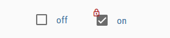

### Настройки редактора
Настройки, не перечисленные в таблице ниже, не требуют пояснений.

<table><thead><tr><th>Снимок экрана</th><th> Настройка</th><th> Описание </th></tr></thead><tbody><tr><td rowspan=4></td><td>тип переключения</td><td> Определите, какой тип точки данных (логическое значение или значение) следует переключить</td></tr><tr><td> значение для выкл.</td><td> Установите, при каком значении флажок установлен в false</td></tr><tr><td> значение для</td><td> Установите, при каком значении флажок установлен</td></tr><tr><td> указать, если значение не равно условию &quot;включено&quot;</td><td> Установите состояние флажка, если значение не соответствует условию включения</td></tr></tbody></table>

### Свойства HTML
Следующие свойства могут использоваться как [HTML-виджеты](#html-widgets).

<table><thead><tr><th>Свойство</th><th> Описание</th><th> Тип</th><th> Ценности </th></tr></thead><tbody><tr><td colspan="4" style="background: #44739e; color: white; border-color: #44739e;"> <i><b><br>Общие</b></i></td></tr><tr><td> mdw-oid</td><td> ID объекта</td><td> строка</td><td></tr><tr><td> mdw-readOnly</td><td> только чтение</td><td> логический</td><td> ложь | правда</tr><tr><td> mdw-toggleType</td><td> тип переключения</td><td> строка</td><td> логическое | ценность</tr><tr><td> mdw-valueOff</td><td> значение для выкл.</td><td> строка</td><td></tr><tr><td> mdw-valueOn</td><td> значение для</td><td> строка</td><td></tr><tr><td> mdw-stateIfNotTrueValue</td><td> указать, если значение не равно условию &quot;включено&quot;</td><td> строка</td><td> на | выключен</tr><tr><td> mdw-vibrateOnMobilDevices</td><td> вибрировать на мобильных устройствах [ах]</td><td> количество</td><td></tr><tr><td> mdw-debug</td><td> отлаживать</td><td> логический</td><td> ложь | правда</tr><tr><td colspan="4" style="background: #44739e; color: white; border-color: #44739e;"> <i><b><br>маркировка</b></i></td></tr><tr><td> mdw-labelFalse</td><td> Ярлык false</td><td> строка</td><td></tr><tr><td> mdw-labelTrue</td><td> Ярлык верно</td><td> строка</td><td></tr><tr><td> mdw-labelPosition</td><td> labelPosition</td><td> строка</td><td> слева | право | выключен</tr><tr><td> mdw-labelClickActive</td><td> активировать ярлык нажмите</td><td> логический</td><td> ложь | правда</tr><tr><td> mdw-valueFontFamily</td><td> valueFontFamily</td><td> строка</td><td></tr><tr><td> mdw-valueFontSize</td><td> значение размера шрифта</td><td> количество</td><td></tr><tr><td colspan="4" style="background: #44739e; color: white; border-color: #44739e;"><i><b><br>цвета</b></i></td></tr><tr><td> mdw-colorCheckBox</td><td> цвет флажка</td><td> строка</td><td> шестнадцатеричный (# 44739e), RGB (20, 50, 200), RGBA (20, 50, 200, 0,5)</tr><tr><td> mdw-colorCheckBoxBorder</td><td> цвет границы</td><td> строка</td><td> шестнадцатеричный (# 44739e), RGB (20, 50, 200), RGBA (20, 50, 200, 0,5)</tr><tr><td> mdw-colorCheckBoxHover</td><td> цвет наведения флажка</td><td> строка</td><td> шестнадцатеричный (# 44739e), RGB (20, 50, 200), RGBA (20, 50, 200, 0,5)</tr><tr><td> mdw-labelColorFalse</td><td> цвет этикетки</td><td> строка</td><td> шестнадцатеричный (# 44739e), RGB (20, 50, 200), RGBA (20, 50, 200, 0,5)</tr><tr><td> mdw-labelColorTrue</td><td> цвет активной метки</td><td> строка</td><td> шестнадцатеричный (# 44739e), RGB (20, 50, 200), RGBA (20, 50, 200, 0,5)</tr><tr><td colspan="4" style="background: #44739e; color: white; border-color: #44739e;"> <i><b><br>Блокировка</b></i></td></tr><tr><td> mdw-lockEnabled</td><td> включить блокировку</td><td> логический</td><td> ложь | правда</tr><tr><td> mdw-autoLockAfter</td><td> автоматическая блокировка через [с]</td><td> количество</td><td></tr><tr><td> mdw-lockIcon</td><td> икона</td><td> строка</td><td></tr><tr><td> mdw-lockIconTop</td><td> расстояние символа сверху [%]</td><td> количество</td><td></tr><tr><td> mdw-lockIconLeft</td><td> расстояние символа слева [%]</td><td> количество</td><td></tr><tr><td> mdw-lockIconSize</td><td> размер значка</td><td> количество</td><td></tr><tr><td> mdw-lockIconColor</td><td> цвет значка</td><td> строка</td><td> шестнадцатеричный (# 44739e), RGB (20, 50, 200), RGBA (20, 50, 200, 0,5)</tr><tr><td> mdw-lockFilterGrayscale</td><td> серый фильтр, если заблокирован</td><td> количество</td><td></tr></tbody></table>

<! - опустить в toc ->

#### Свойства HTML - пример
<details>

```
<div class='vis-widget materialdesign-widget materialdesign-checkbox materialdesign-checkbox-html-element'
	style='width: 100%; height: 50px; position: relative; overflow: visible !important; display: flex; align-items: center;'
	mdw-debug='false'
	mdw-oid='0_userdata.0.bool'
	mdw-toggleType='boolean'
	mdw-stateIfNotTrueValue='on'
	mdw-vibrateOnMobilDevices='50'
	mdw-labelFalse='off'
	mdw-labelTrue='on'
	mdw-labelPosition='right'
	mdw-labelClickActive='true'
	mdw-valueFontFamily='#mdwTheme:vis-materialdesign.0.fonts.checkbox.value'
	mdw-valueFontSize='#mdwTheme:vis-materialdesign.0.fontSizes.checkbox.value'
	mdw-colorCheckBox='#mdwTheme:vis-materialdesign.0.colors.checkbox.on'
	mdw-colorCheckBoxBorder='#mdwTheme:vis-materialdesign.0.colors.checkbox.border'
	mdw-colorCheckBoxHover='#mdwTheme:vis-materialdesign.0.colors.checkbox.hover'
	mdw-labelColorFalse='#mdwTheme:vis-materialdesign.0.colors.checkbox.text_off'
	mdw-labelColorTrue='#mdwTheme:vis-materialdesign.0.colors.checkbox.text_on'
	mdw-autoLockAfter='10'
	mdw-lockIconTop='5'
	mdw-lockIconLeft='5'
	mdw-lockIconColor='#mdwTheme:vis-materialdesign.0.colors.checkbox.lock_icon'
	mdw-lockFilterGrayscale='30'
></div>
```

</details>

## Переключатель


### Настройки редактора
Настройки, не перечисленные в таблице ниже, не требуют пояснений.

<table><thead><tr><th>Снимок экрана</th><th> Настройка</th><th> Описание </th></tr></thead><tbody><tr><td rowspan=4></td><td> тип переключения</td><td> Определите, какой тип точки данных (логическое значение или значение) следует переключить</td></tr><tr><td> значение для выкл.</td><td> Установите, при каком значении переключатель является ложным</td></tr><tr><td> значение для</td><td> Установите, при каком значении переключатель верен</td></tr><tr><td> указать, если значение не равно условию &quot;включено&quot;</td><td> Установите состояние переключателя, когда значение не соответствует условию включения</td></tr></tbody></table>

### Свойства HTML
Следующие свойства могут использоваться как [HTML-виджеты](#html-widgets).

<table><thead><tr><th>Свойство</th><th> Описание</th><th> Тип</th><th> Ценности </th></tr></thead><tbody><tr><td colspan="4" style="background: #44739e; color: white; border-color: #44739e;"> <i><b><br>Общие</b></i></td></tr><tr><td> mdw-oid</td><td> ID объекта</td><td> строка</td><td></tr><tr><td> mdw-readOnly</td><td> только чтение</td><td> логический</td><td> ложь | правда</tr><tr><td> mdw-toggleType</td><td> тип переключения</td><td> строка</td><td> логическое | ценность</tr><tr><td> mdw-valueOff</td><td> значение для выкл.</td><td> строка</td><td></tr><tr><td> mdw-valueOn</td><td> значение для</td><td> строка</td><td></tr><tr><td> mdw-stateIfNotTrueValue</td><td> указать, если значение не равно условию &quot;включено&quot;</td><td> строка</td><td> на | выключен</tr><tr><td> mdw-vibrateOnMobilDevices</td><td> вибрировать на мобильных устройствах [ах]</td><td> количество</td><td></tr><tr><td> mdw-debug</td><td> отлаживать</td><td> логический</td><td> ложь | правда</tr><tr><td colspan="4" style="background: #44739e; color: white; border-color: #44739e;"> <i><b><br>маркировка</b></i></td></tr><tr><td> mdw-labelFalse</td><td> Ярлык false</td><td> строка</td><td></tr><tr><td> mdw-labelTrue</td><td> Ярлык верно</td><td> строка</td><td></tr><tr><td> mdw-labelPosition</td><td> labelPosition</td><td> строка</td><td> слева | право | выключен</tr><tr><td> mdw-labelClickActive</td><td> активировать ярлык нажмите</td><td> логический</td><td> ложь | правда</tr><tr><td> mdw-valueFontFamily</td><td> valueFontFamily</td><td> строка</td><td></tr><tr><td> mdw-valueFontSize</td><td> значение размера шрифта</td><td> количество</td><td></tr><tr><td colspan="4" style="background: #44739e; color: white; border-color: #44739e;"><i><b><br>цвета</b></i></td></tr><tr><td> mdw-colorSwitchThumb</td><td> цвет большого пальца переключателя</td><td> строка</td><td> шестнадцатеричный (# 44739e), RGB (20, 50, 200), RGBA (20, 50, 200, 0,5)</tr><tr><td> mdw-colorSwitchTrack</td><td> отслеживать цвет переключателя</td><td> строка</td><td> шестнадцатеричный (# 44739e), RGB (20, 50, 200), RGBA (20, 50, 200, 0,5)</tr><tr><td> mdw-colorSwitchTrue</td><td> цвет активного переключателя</td><td> строка</td><td> шестнадцатеричный (# 44739e), RGB (20, 50, 200), RGBA (20, 50, 200, 0,5)</tr><tr><td> mdw-colorSwitchHover</td><td> цвет переключателя наведения</td><td> строка</td><td> шестнадцатеричный (# 44739e), RGB (20, 50, 200), RGBA (20, 50, 200, 0,5)</tr><tr><td> mdw-colorSwitchHoverTrue</td><td> активный цвет переключателя выбран / наведен</td><td> строка</td><td> шестнадцатеричный (# 44739e), RGB (20, 50, 200), RGBA (20, 50, 200, 0,5)</tr><tr><td> mdw-labelColorFalse</td><td> цвет этикетки</td><td> строка</td><td> шестнадцатеричный (# 44739e), RGB (20, 50, 200), RGBA (20, 50, 200, 0,5)</tr><tr><td> mdw-labelColorTrue</td><td> цвет активной метки</td><td> строка</td><td> шестнадцатеричный (# 44739e), RGB (20, 50, 200), RGBA (20, 50, 200, 0,5)</tr><tr><td colspan="4" style="background: #44739e; color: white; border-color: #44739e;"> <i><b><br>Блокировка</b></i></td></tr><tr><td> mdw-lockEnabled</td><td> включить блокировку</td><td> логический</td><td> ложь | правда</tr><tr><td> mdw-autoLockAfter</td><td> автоматическая блокировка через [с]</td><td> количество</td><td></tr><tr><td> mdw-lockIcon</td><td> икона</td><td> строка</td><td></tr><tr><td> mdw-lockIconTop</td><td> расстояние символа сверху [%]</td><td> количество</td><td></tr><tr><td> mdw-lockIconLeft</td><td> расстояние символа слева [%]</td><td> количество</td><td></tr><tr><td> mdw-lockIconSize</td><td> размер значка</td><td> количество</td><td></tr><tr><td> mdw-lockIconColor</td><td> цвет значка</td><td> строка</td><td> шестнадцатеричный (# 44739e), RGB (20, 50, 200), RGBA (20, 50, 200, 0,5)</tr><tr><td> mdw-lockFilterGrayscale</td><td> серый фильтр, если заблокирован</td><td> количество</td><td></tr></tbody></table>

<! - опустить в toc ->

#### Свойства HTML - пример
<details>

```
<div class='vis-widget materialdesign-widget materialdesign-switch materialdesign-switch-html-element'
	style='width: 100%; height: 50px; position: relative; overflow: visible !important; display: flex; align-items: center;'
	mdw-debug='false'
	mdw-oid='0_userdata.0.bool'
	mdw-toggleType='boolean'
	mdw-stateIfNotTrueValue='on'
	mdw-vibrateOnMobilDevices='50'
	mdw-labelFalse='off'
	mdw-labelTrue='on'
	mdw-labelPosition='right'
	mdw-labelClickActive='true'
	mdw-valueFontFamily='#mdwTheme:vis-materialdesign.0.fonts.switch.value'
	mdw-valueFontSize='#mdwTheme:vis-materialdesign.0.fontSizes.switch.value'
	mdw-colorSwitchThumb='#mdwTheme:vis-materialdesign.0.colors.switch.off'
	mdw-colorSwitchTrack='#mdwTheme:vis-materialdesign.0.colors.switch.track'
	mdw-colorSwitchTrue='#mdwTheme:vis-materialdesign.0.colors.switch.on'
	mdw-colorSwitchHover='#mdwTheme:vis-materialdesign.0.colors.switch.off_hover'
	mdw-colorSwitchHoverTrue='#mdwTheme:vis-materialdesign.0.colors.switch.on_hover'
	mdw-labelColorFalse='#mdwTheme:vis-materialdesign.0.colors.switch.text_off'
	mdw-labelColorTrue='#mdwTheme:vis-materialdesign.0.colors.switch.text_on'
	mdw-autoLockAfter='10'
	mdw-lockIconTop='5'
	mdw-lockIconLeft='5'
	mdw-lockIconColor='#mdwTheme:vis-materialdesign.0.colors.switch.lock_icon'
	mdw-lockFilterGrayscale='30'
></div>
```

</details>

## Карта


## Список
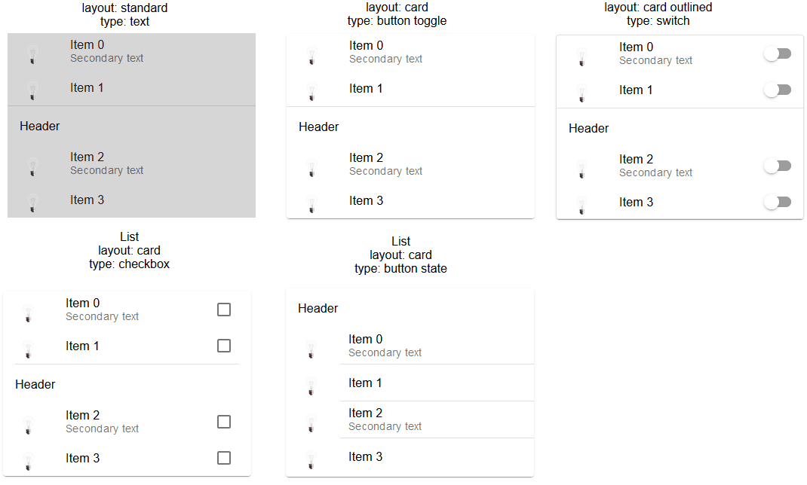

### Настройки редактора
Настройки, не перечисленные в таблице ниже, не требуют пояснений.

<table><thead><tr><th>Снимок экрана</th><th> Настройка</th><th> Описание </th></tr></thead><tbody><tr><td rowspan=4></td><td> тип списка</td><td> тип управления списком, такой как флажок, состояние кнопки, переключатель кнопки и т. д.</td></tr><tr><td> стиль разделителя</td><td> стиль разделителя</td></tr><tr><td> макет</td><td> стандартный или карточный макет</td></tr><tr><td> показать полосу прокрутки</td><td> при необходимости показать полосу прокрутки</td></tr><tr><td rowspan=4></td><td> метод ввода данных списка</td><td> используйте редактор или строку json для определения элементов</td></tr><tr><td> Редактор: количество элементов списка</td><td> подсчет элементов списка с помощью редактора</td></tr><tr><td> JSON-String: идентификатор объекта</td><td> идентификатор объекта точки данных, содержащей строку json. Допустимые свойства описаны ниже</td></tr></tbody></table>

### Свойства данных JSON
<table><thead><tr><th>Свойство</th><th> Описание</th><th> Тип</th><th> Ценности</th></tr></thead><tbody><tr><td> objectId</td><td> идентификатор точки данных</td><td> строка</td><td></td></tr><tr><td> buttonStateValue</td><td> значение для кнопки, если список взят из состояния кнопки типа</td><td> строка</td><td></td></tr><tr><td> buttonNavView</td><td> вид для кнопки, если список взят из типа навигации по кнопке</td><td> строка</td><td></td></tr><tr><td> buttonLink</td><td> адрес ссылки для кнопки, если список взят из кнопки типа ссылка</td><td> строка</td><td></td></tr><tr><td> заголовок</td><td> текст заголовка элемента</td><td> строка</td><td></td></tr><tr><td> текст</td><td> основной текст</td><td> строка</td><td></td></tr><tr><td> подтекст</td><td> вторичный текст</td><td> строка</td><td></td></tr><tr><td> rightText</td><td> основной правый текст</td><td> строка</td><td></td></tr><tr><td> rightSubText</td><td> второй правый текст</td><td> строка</td><td></td></tr><tr><td> образ</td><td> значок материального дизайна или путь к изображению</td><td> строка</td><td></td></tr><tr><td> imageColor</td><td> Цвет значка материального дизайна</td><td> строка</td><td> шестнадцатеричный (# 44739e), RGB (20, 50, 200), RGBA (20, 50, 200, 0,5)</td></tr><tr><td> imageActive</td><td> значок материального дизайна или путь к изображению, если точка данных активна</td><td> строка</td><td></td></tr><tr><td> imageActiveColor</td><td> цвет значка материального дизайна, если точка данных активна</td><td> строка</td><td> шестнадцатеричный (# 44739e), RGB (20, 50, 200), RGBA (20, 50, 200, 0,5)</td></tr><tr><td> showDivider</td><td> показать разделитель</td><td> логический</td><td> ложь | правда</td></tr></tbody></table>

<! - опустить в toc ->

#### Свойства JSON - пример
<details> <pre><code> [ { "text": "item0", "subText": "{0_userdata.0.MDW.list.bind0}", "rightText": "right", "rightSubText": "", "image": "clock-check-outline", "imageColor": "#44739e", "imageActive": "", "imageActiveColor": "", "header": "JSON", "showDivider": "false", "objectId": "0_userdata.0.MDW.list.bool.val0", "buttonStateValue": "", "buttonNavView": "", "buttonLink": "" }, { "text": "item1", "subText": "{0_userdata.0.MDW.list.bind1}", "rightText": "right", "rightSubText": "", "image": "clock-check-outline", "imageColor": "#44739e", "imageActive": "", "imageActiveColor": "", "header": "", "showDivider": "false", "objectId": "0_userdata.0.MDW.list.bool.val1", "buttonStateValue": "", "buttonNavView": "", "buttonLink": "" }, { "text": "item2", "subText": "", "rightText": "right", "rightSubText": "", "image": "clock-check-outline", "imageColor": "#44739e", "imageActive": "", "imageActiveColor": "", "header": "", "showDivider": "false", "objectId": "0_userdata.0.MDW.list.bool.val2", "buttonStateValue": "", "buttonNavView": "", "buttonLink": "" }, { "text": "item3", "subText": "fuuuu", "rightText": "right", "rightSubText": "", "image": "clock-check-outline", "imageColor": "#44739e", "imageActive": "", "imageActiveColor": "", "header": "", "showDivider": "false", "objectId": "0_userdata.0.MDW.list.bool.val3", "buttonStateValue": "", "buttonNavView": "", "buttonLink": "" } ] </code></pre> </details>

## IconList


### Настройки редактора
Настройки, не перечисленные в таблице ниже, не требуют пояснений.

<table><thead><tr><th>Снимок экрана</th><th> Настройка</th><th> Описание </th></tr></thead><tbody><tr><td rowspan=6></td><td> метод ввода данных списка</td><td> Данные для IconList можно ввести через редактор или использовать строку JSON.</td></tr><tr><td> Редактор: количество элементов списка</td><td> количество элементов списка с использованием редактора vis для данных списка</td></tr><tr><td> JSON-String: идентификатор объекта</td><td> идентификатор объекта точки данных, содержащей строку json. Допустимые свойства описаны ниже</td></tr></tbody></table>

### Свойства данных JSON
Строка JSON должна быть массивом объектов со следующими свойствами:

<table><thead><tr><th>Свойство</th><th> Описание</th><th> Тип</th><th> Ценности</th></tr></thead><tbody><tr><td> listType</td><td> тип списка</td><td> строка</td><td> текст | buttonState | buttonToggle | buttonToggleValueTrue | buttonToggleValueFalse | buttonNav | buttonLink</td></tr><tr><td> objectId</td><td> идентификатор объекта для кнопки</td><td> строка</td><td/></tr><tr><td> buttonStateValue</td><td> значение для состояния кнопки</td><td> строка</td><td/></tr><tr><td> buttonNavView</td><td> вид для навигации</td><td> строка</td><td/></tr><tr><td> buttonLink</td><td> URL для навигации</td><td> строка</td><td/></tr><tr><td> buttonToggleValueTrue</td><td> истинное значение для кнопки переключения</td><td> строка</td><td/></tr><tr><td> buttonToggleValueFalse</td><td> ложное значение для переключения кнопки</td><td> строка</td><td/></tr><tr><td> showValueLabel</td><td> показать значение как текст</td><td> строка</td><td/></tr><tr><td> valueAppendix</td><td> добавить текст к значению</td><td> строка</td><td/></tr><tr><td> задний план</td><td> фоновый цвет</td><td> строка</td><td> шестнадцатеричный (# 44739e), RGB (20, 50, 200), RGBA (20, 50, 200, 0,5)</td></tr><tr><td> текст</td><td> текст</td><td> строка</td><td/></tr><tr><td> подтекст</td><td> второй текст</td><td> строка</td><td/></tr><tr><td> образ</td><td> путь к изображению или имя иконок Material Design</td><td> строка</td><td/></tr><tr><td> imageColor</td><td> цвет иконок Material Design</td><td> строка</td><td> шестнадцатеричный (# 44739e), RGB (20, 50, 200), RGBA (20, 50, 200, 0,5)</td></tr><tr><td> imageActive</td><td> путь к изображению или имя иконок Material Design</td><td> строка</td><td/></tr><tr><td> imageActiveColor</td><td> путь к изображению или имя иконок Material Design для активной кнопки</td><td> строка</td><td> шестнадцатеричный (# 44739e), RGB (20, 50, 200), RGBA (20, 50, 200, 0,5)</td></tr><tr><td> buttonBackgroundColor</td><td> цвет фона кнопки</td><td> строка</td><td> шестнадцатеричный (# 44739e), RGB (20, 50, 200), RGBA (20, 50, 200, 0,5)</td></tr><tr><td> buttonBackgroundActiveColor</td><td> цвет фона кнопки для активной кнопки</td><td> строка</td><td> шестнадцатеричный (# 44739e), RGB (20, 50, 200), RGBA (20, 50, 200, 0,5)</td></tr><tr><td> statusBarColor</td><td> цвет строки состояния</td><td> строка</td><td> шестнадцатеричный (# 44739e), RGB (20, 50, 200), RGBA (20, 50, 200, 0,5)</td></tr><tr><td> statusBarText</td><td> текст строки состояния</td><td> строка</td><td/></tr><tr><td> lockEnabled</td><td> включить блокировку</td><td> логический</td><td> ложь | правда</tr></tbody></table>

<! - опустить в toc ->

#### Свойства JSON - пример
<details> <pre><code> [ { "background": "red", "text": "text1", "subText": "number", "image": "harddisk", "imageColor": "#ec0909", "imageActive": "folder", "imageActiveColor": "#5ad902", "buttonBackgroundColor": "", "buttonBackgroundActiveColor": "", "listType": "buttonState", "objectId": "0_userdata.0.iconList.buttonState.number", "buttonStateValue": "60", "buttonNavView": "", "buttonLink": "", "buttonToggleValueTrue": "", "buttonToggleValueFalse": "", "valueAppendix": "", "showValueLabel": "true", "statusBarColor": "green", "lockEnabled": "false" }, { "background": "green", "text": "text0", "subText": "bool", "image": "home", "imageColor": "#44739e", "imageActive": "home", "imageActiveColor": "#44739e", "buttonBackgroundColor": "", "buttonBackgroundActiveColor": "#a0f628", "listType": "buttonToggle", "objectId": "0_userdata.0.iconList.buttonToggle.bool0", "buttonStateValue": "60", "buttonNavView": "", "buttonLink": "", "buttonToggleValueTrue": "", "buttonToggleValueFalse": "", "valueAppendix": "", "showValueLabel": "false", "statusBarColor": "", "lockEnabled": "false" } ] </code></pre> </details>

## Прогресс
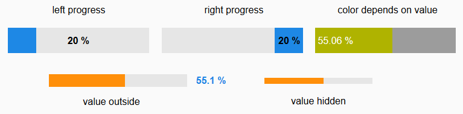

### Настройки редактора
<table><thead><tr><th>Снимок экрана</th><th> Настройка</th><th> Описание </th></tr></thead><tbody><tr><td rowspan=2></td><td>условие для прогресса цвета 1 [&gt;]</td><td> Состояние с момента использования цвета 1. Значение условия должно быть в процентах.</td></tr><tr><td> условие прохождения цвета 2 [&gt;]</td><td> Состояние с момента использования цвета 2. Значение условия должно быть в процентах.</td></tr><tr><td rowspan=1></td><td> специальный ярлык</td><td> Для настраиваемой метки вы можете использовать свойство <code>[#value]</code> чтобы показать реальное значение точки данных. Чтобы показать текущий процент, вы можете использовать <code>[#percent]</code></td></tr></tbody></table>

### Свойства HTML
Следующие свойства могут использоваться как [HTML-виджеты](#html-widgets).

<table><thead><tr><th>Свойство</th><th> Описание</th><th> Тип</th><th> Ценности</th></tr></thead><tbody><tr><td> mdw-типа</td><td> Тип виджета</td><td> строка</td><td> линейный</td></tr><tr><td colspan="4" style="background: #44739e; color: white; border-color: #44739e;"> <i><b><br>Общие</b></i></td></tr><tr><td> mdw-oid</td><td> ID объекта</td><td> строка</td><td></tr><tr><td> mdw-min</td><td> мин</td><td> строка</td><td></tr><tr><td> mdw-max</td><td> Максимум</td><td> строка</td><td></tr><tr><td> mdw-progressIndeterminate</td><td> неопределенный - непрерывно оживляет</td><td> логический</td><td> ложь | правда</tr><tr><td> mdw-reverse</td><td> Обратное значение</td><td> логический</td><td> ложь | правда</tr><tr><td> mdw-debug</td><td> отлаживать</td><td> логический</td><td> ложь | правда</tr><tr><td colspan="4" style="background: #44739e; color: white; border-color: #44739e;"> <i><b><br>макет</b></i></td></tr><tr><td> mdw-progressRounded</td><td> закругленные углы</td><td> логический</td><td> ложь | правда</tr><tr><td> mdw-progressStriped</td><td> полосатый</td><td> логический</td><td> ложь | правда</tr><tr><td> mdw-progressStripedColor</td><td> progressStripedColor</td><td> строка</td><td> шестнадцатеричный (# 44739e), RGB (20, 50, 200), RGBA (20, 50, 200, 0,5)</tr><tr><td colspan="4" style="background: #44739e; color: white; border-color: #44739e;"> <i><b><br>цвета</b></i></td></tr><tr><td> mdw-colorProgressBackground</td><td> фоновый цвет</td><td> строка</td><td> шестнадцатеричный (# 44739e), RGB (20, 50, 200), RGBA (20, 50, 200, 0,5)</tr><tr><td> mdw-colorProgress</td><td> цвет прогресс</td><td> строка</td><td> шестнадцатеричный (# 44739e), RGB (20, 50, 200), RGBA (20, 50, 200, 0,5)</tr><tr><td> mdw-colorOneCondition</td><td> условие для прогресса цвета 1 [&gt;]</td><td> количество</td><td></tr><tr><td> mdw-colorOne</td><td> цвет 1 прогресс</td><td> строка</td><td> шестнадцатеричный (# 44739e), RGB (20, 50, 200), RGBA (20, 50, 200, 0,5)</tr><tr><td> mdw-colorTwoCondition</td><td> условие прохождения цвета 2 [&gt;]</td><td> количество</td><td></tr><tr><td> mdw-colorTwo</td><td> цвет 2 прогресс</td><td> строка</td><td> шестнадцатеричный (# 44739e), RGB (20, 50, 200), RGBA (20, 50, 200, 0,5)</tr><tr><td colspan="4" style="background: #44739e; color: white; border-color: #44739e;"> <i><b><br>маркировка</b></i></td></tr><tr><td> mdw-showValueLabel</td><td> показать ценность</td><td> логический</td><td> ложь | правда</tr><tr><td> mdw-valueLabelStyle</td><td> значение стиля подписи</td><td> строка</td><td> progressPercent | progressValue | прогресс</tr><tr><td> mdw-valueLabelUnit</td><td> единица измерения</td><td> строка</td><td></tr><tr><td> mdw-valueMaxDecimals</td><td> десятичные точки</td><td> количество</td><td></tr><tr><td> mdw-valueLabelCustom</td><td> специальный ярлык</td><td> строка</td><td></tr><tr><td> mdw-textColor</td><td> Цвет текста минут</td><td> строка</td><td> шестнадцатеричный (# 44739e), RGB (20, 50, 200), RGBA (20, 50, 200, 0,5)</tr><tr><td> mdw-textFontSize</td><td> размер текста</td><td> количество</td><td></tr><tr><td> mdw-textFontFamily</td><td> шрифт</td><td> строка</td><td></tr><tr><td> mdw-textAlign</td><td> textAlign</td><td> строка</td><td> начало | центр | конец</tr></tbody></table>

<! - опустить в toc ->

#### Свойства HTML - пример
<details>

```
<div class='vis-widget materialdesign-widget materialdesign-progress materialdesign-progress-html-element'
	style='width: 100%; height: 100%; position: relative; padding: 0px;'
	mdw-type='linear'
	mdw-oid='0_userdata.0.MDW.Progress.val0'
	mdw-debug='true'
	mdw-progressRounded='true'
	mdw-colorProgressBackground='#mdwTheme:vis-materialdesign.0.colors.progress.track_background'
	mdw-colorProgress='#mdwTheme:vis-materialdesign.0.colors.progress.track'
	mdw-colorOneCondition='50'
	mdw-colorOne='#mdwTheme:vis-materialdesign.0.colors.progress.track_condition1'
	mdw-colorTwoCondition='70'
	mdw-colorTwo='#mdwTheme:vis-materialdesign.0.colors.progress.track_condition2'
	mdw-showValueLabel='true'
	mdw-valueLabelStyle='progressPercent'
	mdw-textColor='#mdwTheme:vis-materialdesign.0.colors.progress.text'
	mdw-textFontSize='#mdwTheme:vis-materialdesign.0.fontSizes.progress.text'
	mdw-textFontFamily='#mdwTheme:vis-materialdesign.0.fonts.progress.text'
	mdw-textAlign='end'
></div>
```

</details>

## Информационный бюллетень


### Настройки редактора
Настройки, не перечисленные в таблице ниже, не требуют пояснений.

<table><thead><tr><th>Снимок экрана</th><th> Настройка</th><th> Описание </th></tr></thead><tbody><tr><td rowspan=2></td><td> условие для прогресса цвета 1 [&gt;]</td><td> Состояние с момента использования цвета 1. Значение условия должно быть в процентах.</td></tr><tr><td> условие прохождения цвета 2 [&gt;]</td><td> Состояние с момента использования цвета 2. Значение условия должно быть в процентах.</td></tr><tr><td rowspan=6></td><td> специальный ярлык</td><td> Для настраиваемой метки вы можете использовать свойство <code>[#value]</code> чтобы показать реальное значение точки данных. Чтобы показать текущий процент, вы можете использовать <code>[#percent]</code></td></tr></tbody></table>

### Свойства HTML
Следующие свойства могут использоваться как [HTML-виджеты](#html-widgets).

<table><thead><tr><th>Свойство</th><th> Описание</th><th> Тип</th><th> Ценности</th></tr></thead><tbody><tr><td> mdw-типа</td><td> Тип виджета</td><td> строка</td><td> круговой</td></tr><tr><td colspan="4" style="background: #44739e; color: white; border-color: #44739e;"> <i><b><br>Общие</b></i></td></tr><tr><td> mdw-oid</td><td> ID объекта</td><td> строка</td><td></tr><tr><td> mdw-min</td><td> мин</td><td> строка</td><td></tr><tr><td> mdw-max</td><td> Максимум</td><td> строка</td><td></tr><tr><td> mdw-progressIndeterminate</td><td> неопределенный - непрерывно оживляет</td><td> логический</td><td> ложь | правда</tr><tr><td> mdw-debug</td><td> отлаживать</td><td> логический</td><td> ложь | правда</tr><tr><td colspan="4" style="background: #44739e; color: white; border-color: #44739e;"> <i><b><br>макет</b></i></td></tr><tr><td> mdw-progressCircularSize</td><td> размер</td><td> количество</td><td></tr><tr><td> mdw-progressCircularWidth</td><td> толщина</td><td> количество</td><td></tr><tr><td> mdw-progressCircularRotate</td><td> повернуть начальную точку</td><td> количество</td><td></tr><tr><td colspan="4" style="background: #44739e; color: white; border-color: #44739e;"><i><b><br>цвета</b></i></td></tr><tr><td> mdw-colorProgressBackground</td><td> фоновый цвет</td><td> строка</td><td> шестнадцатеричный (# 44739e), RGB (20, 50, 200), RGBA (20, 50, 200, 0,5)</tr><tr><td> mdw-colorProgress</td><td> цвет прогресс</td><td> строка</td><td> шестнадцатеричный (# 44739e), RGB (20, 50, 200), RGBA (20, 50, 200, 0,5)</tr><tr><td> mdw-innerColor</td><td> цвет фона круга</td><td> строка</td><td> шестнадцатеричный (# 44739e), RGB (20, 50, 200), RGBA (20, 50, 200, 0,5)</tr><tr><td> mdw-colorOneCondition</td><td> условие для прогресса цвета 1 [&gt;]</td><td> количество</td><td></tr><tr><td> mdw-colorOne</td><td> цвет 1 прогресс</td><td> строка</td><td> шестнадцатеричный (# 44739e), RGB (20, 50, 200), RGBA (20, 50, 200, 0,5)</tr><tr><td> mdw-colorTwoCondition</td><td> условие прохождения цвета 2 [&gt;]</td><td> количество</td><td></tr><tr><td> mdw-colorTwo</td><td> цвет 2 прогресс</td><td> строка</td><td> шестнадцатеричный (# 44739e), RGB (20, 50, 200), RGBA (20, 50, 200, 0,5)</tr><tr><td colspan="4" style="background: #44739e; color: white; border-color: #44739e;"> <i><b><br>маркировка</b></i></td></tr><tr><td> mdw-showValueLabel</td><td> показать ценность</td><td> логический</td><td> ложь | правда</tr><tr><td> mdw-valueLabelStyle</td><td> значение стиля подписи</td><td> строка</td><td> progressPercent | progressValue | прогресс</tr><tr><td> mdw-valueLabelUnit</td><td> единица измерения</td><td> строка</td><td></tr><tr><td> mdw-valueMaxDecimals</td><td> десятичные точки</td><td> количество</td><td></tr><tr><td> mdw-valueLabelCustom</td><td> специальный ярлык</td><td> строка</td><td></tr><tr><td> mdw-textColor</td><td> Цвет текста минут</td><td> строка</td><td> шестнадцатеричный (# 44739e), RGB (20, 50, 200), RGBA (20, 50, 200, 0,5)</tr><tr><td> mdw-textFontSize</td><td> размер текста</td><td> количество</td><td></tr><tr><td> mdw-textFontFamily</td><td> шрифт</td><td> строка</td><td></tr></tbody></table>

<! - опустить в toc ->

#### Свойства HTML - пример
<details>

```
<div class='vis-widget materialdesign-widget materialdesign-progress materialdesign-progress-html-element'
	style='width: 100%; height: 100%; position: relative; padding: 0px;'
	mdw-type='circular'
	mdw-oid='0_userdata.0.MDW.Progress.val1'
	mdw-colorProgressBackground='#mdwTheme:vis-materialdesign.0.colors.progress.track_background'
	mdw-colorProgress='#mdwTheme:vis-materialdesign.0.colors.progress.track'
	mdw-innerColor='#mdwTheme:vis-materialdesign.0.colors.progress.circular_background'
	mdw-colorOneCondition='50'
	mdw-colorOne='#mdwTheme:vis-materialdesign.0.colors.progress.track_condition1'
	mdw-colorTwoCondition='70'
	mdw-colorTwo='#mdwTheme:vis-materialdesign.0.colors.progress.track_condition2'
	mdw-showValueLabel='true'
	mdw-valueLabelStyle='progressPercent'
	mdw-textColor='#mdwTheme:vis-materialdesign.0.colors.progress.text'
	mdw-textFontSize='#mdwTheme:vis-materialdesign.0.fontSizes.progress.text'
	mdw-textFontFamily='#mdwTheme:vis-materialdesign.0.fonts.progress.text'
></div>
```

</details>

## Слайдер


### Свойства HTML
Следующие свойства могут использоваться как [HTML-виджеты](#html-widgets).

<table><thead><tr><th>Свойство</th><th> Описание</th><th> Тип</th><th> Ценности </th></tr></thead><tbody><tr><td colspan="4" style="background: #44739e; color: white; border-color: #44739e;"> <i><b><br>Общие</b></i></td></tr><tr><td> mdw-oid</td><td> ID объекта</td><td> строка</td><td></tr><tr><td> mdw-oid-рабочий</td><td> ID рабочего объекта</td><td> строка</td><td></tr><tr><td> mdw-ориентация</td><td> Ориентация</td><td> строка</td><td> горизонтальный | вертикальный</tr><tr><td> mdw-reverseSlider</td><td> инвертировать слайдер</td><td> логический</td><td> ложь | правда</tr><tr><td> mdw-knobSize</td><td> размер ручки</td><td> строка</td><td> knobSmall | knobMedium | ручкаБольшая</tr><tr><td> mdw-readOnly</td><td> только чтение</td><td> логический</td><td> ложь | правда</tr><tr><td> mdw-min</td><td> мин</td><td> строка</td><td></tr><tr><td> mdw-max</td><td> Максимум</td><td> строка</td><td></tr><tr><td> mdw-step</td><td> шаги</td><td> строка</td><td></tr><tr><td> mdw-vibrateOnMobilDevices</td><td> вибрировать на мобильных устройствах [ах]</td><td> количество</td><td></tr><tr><td> mdw-debug</td><td> отлаживать</td><td> логический</td><td> ложь | правда</tr><tr><td colspan="4" style="background: #44739e; color: white; border-color: #44739e;"> <i><b><br>Шаги Макет</b></i></td></tr><tr><td> mdw-showTicks</td><td> показать шаги</td><td> строка</td><td> нет | да | всегда</tr><tr><td> mdw-tickSize</td><td> отображать размер шагов</td><td> количество</td><td></tr><tr><td> mdw-tickLabels</td><td> текст шагов (через запятую)</td><td> строка</td><td></tr><tr><td> mdw-tickTextColor</td><td> цвет текста шагов</td><td> строка</td><td> шестнадцатеричный (# 44739e), RGB (20, 50, 200), RGBA (20, 50, 200, 0,5)</tr><tr><td> mdw-tickFontFamily</td><td> шрифт ступеней</td><td> строка</td><td></tr><tr><td> mdw-tickFontSize</td><td> размер шрифта</td><td> количество</td><td></tr><tr><td> mdw-tickColorBefore</td><td> цвет перед регулятором</td><td> строка</td><td> шестнадцатеричный (# 44739e), RGB (20, 50, 200), RGBA (20, 50, 200, 0,5)</tr><tr><td> mdw-tickColorAfter</td><td> цвет после регулятора</td><td> строка</td><td> шестнадцатеричный (# 44739e), RGB (20, 50, 200), RGBA (20, 50, 200, 0,5)</tr><tr><td colspan="4" style="background: #44739e; color: white; border-color: #44739e;"> <i><b><br>цвета</b></i></td></tr><tr><td> mdw-colorBeforeThumb</td><td> цвет перед регулятором</td><td> строка</td><td> шестнадцатеричный (# 44739e), RGB (20, 50, 200), RGBA (20, 50, 200, 0,5)</tr><tr><td> mdw-colorThumb</td><td> цвет регулятора</td><td> строка</td><td> шестнадцатеричный (# 44739e), RGB (20, 50, 200), RGBA (20, 50, 200, 0,5)</tr><tr><td> mdw-colorAfterThumb</td><td> цвет после регулятора</td><td> строка</td><td> шестнадцатеричный (# 44739e), RGB (20, 50, 200), RGBA (20, 50, 200, 0,5)</tr><tr><td colspan="4" style="background: #44739e; color: white; border-color: #44739e;"> <i><b><br>маркировка</b></i></td></tr><tr><td> mdw-PrepandText</td><td> текст добавлен</td><td> строка</td><td></tr><tr><td> mdw-PrepandTextWidth</td><td> PrepandTextWidth</td><td> количество</td><td></tr><tr><td> mdw-PrepandTextColor</td><td> цвет добавленного текста</td><td> строка</td><td> шестнадцатеричный (# 44739e), RGB (20, 50, 200), RGBA (20, 50, 200, 0,5)</tr><tr><td> mdw-PrepandTextFontSize</td><td> размер текста добавлен</td><td> количество</td><td></tr><tr><td> mdw-PrepandTextFontFamily</td><td> шрифт текста добавлен</td><td> строка</td><td></tr><tr><td> mdw-showValueLabel</td><td> показать ценность</td><td> логический</td><td> ложь | правда</tr><tr><td> mdw-valueLabelStyle</td><td> значение стиля подписи</td><td> строка</td><td> sliderPercent | sliderValue</tr><tr><td> mdw-valueLabelUnit</td><td> единица измерения</td><td> строка</td><td></tr><tr><td> mdw-valueFontFamily</td><td> valueFontFamily</td><td> строка</td><td></tr><tr><td> mdw-valueFontSize</td><td> значение размера шрифта</td><td> количество</td><td></tr><tr><td> mdw-valueLabelColor</td><td> цвет текста значения</td><td> строка</td><td> шестнадцатеричный (# 44739e), RGB (20, 50, 200), RGBA (20, 50, 200, 0,5)</tr><tr><td> mdw-valueLabelMin</td><td> текст для значения меньше min</td><td> строка</td><td></tr><tr><td> mdw-valueLabelMax</td><td> текст для значения больше min</td><td> строка</td><td></tr><tr><td> mdw-valueLessThan</td><td> условие &quot;меньше чем&quot; для текста значения</td><td> количество</td><td></tr><tr><td> mdw-textForValueLessThan</td><td> текст для &quot;меньше чем&quot;</td><td> строка</td><td></tr><tr><td> mdw-valueGreaterThan</td><td> условие &#39;больше чем&#39; для текста значения</td><td> количество</td><td></tr><tr><td> mdw-textForValueGreaterThan</td><td> текст для &quot;больше чем&quot;</td><td> строка</td><td></tr><tr><td> mdw-valueLabelWidth</td><td> метка расстояния</td><td> количество</td><td></tr><tr><td colspan="4" style="background: #44739e; color: white; border-color: #44739e;"><i><b><br>макет этикетки контроллера</b></i></td></tr><tr><td> mdw-showThumbLabel</td><td> показать этикетку</td><td> строка</td><td> нет | да | всегда</tr><tr><td> mdw-thumbSize</td><td> размер этикетки</td><td> количество</td><td></tr><tr><td> mdw-thumbBackgroundColor</td><td> фоновый цвет</td><td> строка</td><td> шестнадцатеричный (# 44739e), RGB (20, 50, 200), RGBA (20, 50, 200, 0,5)</tr><tr><td> mdw-thumbFontColor</td><td> Цвет шрифта</td><td> строка</td><td> шестнадцатеричный (# 44739e), RGB (20, 50, 200), RGBA (20, 50, 200, 0,5)</tr><tr><td> mdw-thumbFontSize</td><td> размер шрифта</td><td> количество</td><td></tr><tr><td> mdw-thumbFontFamily</td><td> шрифт</td><td> строка</td><td></tr><tr><td> mdw-useLabelRules</td><td> использовать правила текста</td><td> логический</td><td> ложь | правда</tr></tbody></table>

<! - опустить в toc ->

#### Свойства HTML - пример
<details>

```
<div class='vis-widget materialdesign-widget materialdesign-slider-vertical materialdesign-slider-html-element'
	style='width: 342px; height: 100px; position: relative; overflow:visible !important; display: flex; align-items: center;'
	mdw-debug='false'
	mdw-oid='0_userdata.0.MDW.Slider.val0'
	mdw-oid-working='0_userdata.0.MDW.Slider.working'
	mdw-orientation='horizontal'
	mdw-knobSize='knobSmall'
	mdw-min='0'
	mdw-max='100'
	mdw-step='10'
	mdw-vibrateOnMobilDevices='50'
	mdw-showTicks='always'
	mdw-tickSize='5'
	mdw-tickLabels='1,2,3,4,5,6,7,8,9,10,11'
	mdw-tickTextColor='#mdwTheme:vis-materialdesign.0.colors.slider.tick'
	mdw-tickFontFamily='#mdwTheme:vis-materialdesign.0.fonts.slider.ticks'
	mdw-tickFontSize='#mdwTheme:vis-materialdesign.0.fontSizes.slider.ticks'
	mdw-tickColorBefore='#mdwTheme:vis-materialdesign.0.colors.slider.tick_before'
	mdw-tickColorAfter='#mdwTheme:vis-materialdesign.0.colors.slider.tick_after'
	mdw-colorBeforeThumb='#mdwTheme:vis-materialdesign.0.colors.slider.control_before'
	mdw-colorThumb='#mdwTheme:vis-materialdesign.0.colors.slider.control'
	mdw-colorAfterThumb='#mdwTheme:vis-materialdesign.0.colors.slider.control_behind'
	mdw-prepandText='prepand'
	mdw-prepandTextWidth='60'
	mdw-prepandTextColor='#mdwTheme:vis-materialdesign.0.colors.slider.text_prepand'
	mdw-prepandTextFontSize='#mdwTheme:vis-materialdesign.0.fontSizes.slider.prepand'
	mdw-prepandTextFontFamily='#mdwTheme:vis-materialdesign.0.fonts.slider.prepand'
	mdw-showValueLabel='true'
	mdw-valueLabelStyle='sliderPercent'
	mdw-valueFontFamily='#mdwTheme:vis-materialdesign.0.fonts.slider.value'
	mdw-valueFontSize='#mdwTheme:vis-materialdesign.0.fontSizes.slider.value'
	mdw-valueLabelColor='#mdwTheme:vis-materialdesign.0.colors.slider.text'
	mdw-valueLabelWidth='50'
	mdw-showThumbLabel='always'
	mdw-thumbBackgroundColor='#mdwTheme:vis-materialdesign.0.colors.slider.control_background'
	mdw-thumbFontColor='#mdwTheme:vis-materialdesign.0.colors.slider.control_text'
	mdw-thumbFontSize='#mdwTheme:vis-materialdesign.0.fontSizes.slider.control'
	mdw-thumbFontFamily='#mdwTheme:vis-materialdesign.0.fonts.slider.control'
></div>
```

</details>

## Ползунок Круглый


### Свойства HTML
Следующие свойства могут использоваться как [HTML-виджеты](#html-widgets).

<table><thead><tr><th>Свойство</th><th> Описание</th><th> Тип</th><th> Ценности </th></tr></thead><tbody><tr><td colspan="4" style="background: #44739e; color: white; border-color: #44739e;"> <i><b><br>Общие</b></i></td></tr><tr><td> mdw-oid</td><td> ID объекта</td><td> строка</td><td></tr><tr><td> mdw-oid-рабочий</td><td> ID рабочего объекта</td><td> строка</td><td></tr><tr><td> mdw-min</td><td> мин</td><td> строка</td><td></tr><tr><td> mdw-max</td><td> Максимум</td><td> строка</td><td></tr><tr><td> mdw-step</td><td> шаги</td><td> строка</td><td></tr><tr><td> mdw-readOnly</td><td> только чтение</td><td> логический</td><td> ложь | правда</tr><tr><td> mdw-startAngle</td><td> начальный угол</td><td> количество</td><td></tr><tr><td> mdw-arcLength</td><td> длина дуги</td><td> количество</td><td></tr><tr><td> mdw-sliderWidth</td><td> толщина слайдера</td><td> количество</td><td></tr><tr><td> mdw-handleSize</td><td> размер ручки</td><td> количество</td><td></tr><tr><td> mdw-handleZoom</td><td> ручка увеличения на контроле</td><td> количество</td><td></tr><tr><td> mdw-rtl</td><td> движение ползунка справа налево</td><td> логический</td><td> ложь | правда</tr><tr><td> mdw-vibrateOnMobilDevices</td><td> вибрировать на мобильных устройствах [ах]</td><td> количество</td><td></tr><tr><td> mdw-debug</td><td> отлаживать</td><td> логический</td><td> ложь | правда</tr><tr><td colspan="4" style="background: #44739e; color: white; border-color: #44739e;"> <i><b><br>цвета</b></i></td></tr><tr><td> mdw-colorSliderBg</td><td> задний план</td><td> строка</td><td> шестнадцатеричный (# 44739e), RGB (20, 50, 200), RGBA (20, 50, 200, 0,5)</tr><tr><td> mdw-colorBeforeThumb</td><td> цвет перед регулятором</td><td> строка</td><td> шестнадцатеричный (# 44739e), RGB (20, 50, 200), RGBA (20, 50, 200, 0,5)</tr><tr><td> mdw-colorThumb</td><td> цвет регулятора</td><td> строка</td><td> шестнадцатеричный (# 44739e), RGB (20, 50, 200), RGBA (20, 50, 200, 0,5)</tr><tr><td> mdw-colorAfterThumb</td><td> цвет после регулятора</td><td> строка</td><td> шестнадцатеричный (# 44739e), RGB (20, 50, 200), RGBA (20, 50, 200, 0,5)</tr><tr><td> mdw-valueLabelColor</td><td> цвет текста значения</td><td> строка</td><td> шестнадцатеричный (# 44739e), RGB (20, 50, 200), RGBA (20, 50, 200, 0,5)</tr><tr><td colspan="4" style="background: #44739e; color: white; border-color: #44739e;"> <i><b><br>маркировка</b></i></td></tr><tr><td> mdw-showValueLabel</td><td> показать ценность</td><td> логический</td><td> ложь | правда</tr><tr><td> mdw-valueLabelVerticalPosition</td><td> положение значения по вертикали</td><td> количество</td><td></tr><tr><td> mdw-valueLabelStyle</td><td> значение стиля подписи</td><td> строка</td><td> sliderPercent | sliderValue</tr><tr><td> mdw-valueLabelUnit</td><td> единица измерения</td><td> строка</td><td></tr><tr><td> mdw-valueFontFamily</td><td> valueFontFamily</td><td> строка</td><td></tr><tr><td> mdw-valueFontSize</td><td> значение размера шрифта</td><td> количество</td><td></tr><tr><td> mdw-valueLabelMin</td><td> текст для значения меньше min</td><td> строка</td><td></tr><tr><td> mdw-valueLabelMax</td><td> текст для значения больше min</td><td> строка</td><td></tr><tr><td> mdw-valueLessThan</td><td> условие &quot;меньше чем&quot; для текста значения</td><td> количество</td><td></tr><tr><td> mdw-textForValueLessThan</td><td> текст для &quot;меньше чем&quot;</td><td> строка</td><td></tr><tr><td> mdw-valueGreaterThan</td><td> условие &#39;больше чем&#39; для текста значения</td><td> количество</td><td></tr><tr><td> mdw-textForValueGreaterThan</td><td> текст для &quot;больше чем&quot;</td><td> строка</td><td></tr></tbody></table>

<! - опустить в toc ->

#### Свойства HTML - пример
<details>

```
<div class="vis-widget materialdesign-widget materialdesign-slider-round materialdesign-roundslider-html-element"
	style="width: 100px; height: 100px; position: relative;"
	mdw-debug="false"
	mdw-oid='0_userdata.0.MDW.Slider.val0'
	mdw-oid-working='0_userdata.0.MDW.Slider.working'
	mdw-step='1'
	mdw-startAngle='135'
	mdw-arcLength='270'
	mdw-handleZoom='1.5'
	mdw-vibrateOnMobilDevices='50'
	mdw-colorSliderBg='#mdwTheme:vis-materialdesign.0.colors.slider.background'
	mdw-colorBeforeThumb='#mdwTheme:vis-materialdesign.0.colors.slider.control_before'
	mdw-colorThumb='#mdwTheme:vis-materialdesign.0.colors.slider.control'
	mdw-colorAfterThumb='#mdwTheme:vis-materialdesign.0.colors.slider.control_behind'
	mdw-valueLabelColor='#mdwTheme:vis-materialdesign.0.colors.slider.text'
	mdw-showValueLabel='true'
	mdw-valueLabelStyle='sliderValue'
	mdw-valueFontFamily='#mdwTheme:vis-materialdesign.0.fonts.slider.value'
	mdw-valueFontSize='#mdwTheme:vis-materialdesign.0.fontSizes.slider.value'
></div>
```

</details>

## Ввод
### Ввод текста
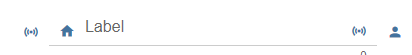

#### Настройки редактора
Настройки, не перечисленные в таблице ниже, не требуют пояснений.

<table><thead><tr><th>Снимок экрана</th><th> Настройка</th><th> Описание </th></tr></thead><tbody><tr><td rowspan=4></td><td> ID объекта</td><td> идентификатор точки данных</td></tr><tr><td> тип ввода</td><td> тип ввода текстового поля</td></tr><tr><td> Маска ввода</td><td> при использовании маски типа ввода вы можете определить маску. Допустимые свойства описаны в <a href="https://vuejs-tips.github.io/vue-the-mask/" target="_blank">документации по маске.</a></td></tr><tr><td> максимальная длина</td><td> максимальная длина текстового поля ввода</td></tr></tbody></table>

#### Свойства HTML
Следующие свойства могут использоваться как [HTML-виджеты](#html-widgets).

<table><thead><tr><th>Свойство</th><th> Описание</th><th> Тип</th><th> Ценности </th></tr></thead><tbody><tr><td colspan="4" style="background: #44739e; color: white; border-color: #44739e;"> <i><b><br>Общие</b></i></td></tr><tr><td> mdw-oid</td><td> ID объекта</td><td> строка</td><td></tr><tr><td> mdw-inputType</td><td> тип ввода</td><td> строка</td><td> текст | номер | дата | время | маска</tr><tr><td> mdw-inputMask</td><td> Маска ввода</td><td> строка</td><td></tr><tr><td> mdw-inputMaxLength</td><td> максимальная длина</td><td> количество</td><td></tr><tr><td> mdw-debug</td><td> отлаживать</td><td> логический</td><td> ложь | правда</tr><tr><td colspan="4" style="background: #44739e; color: white; border-color: #44739e;"> <i><b><br>ввод макета</b></i></td></tr><tr><td> mdw-inputLayout</td><td> макет</td><td> строка</td><td> регулярный | соло | соло-округлые | соло-образный | заполненный | заполненные-округлые | заполненная форма | изложил | очерченный-округлый | очерченный</tr><tr><td> mdw-inputAlignment</td><td> выравнивание текста</td><td> строка</td><td> слева | центр | правильно</tr><tr><td> mdw-inputLayoutBackgroundColor</td><td> фоновый цвет</td><td> строка</td><td> шестнадцатеричный (# 44739e), RGB (20, 50, 200), RGBA (20, 50, 200, 0,5)</tr><tr><td> mdw-inputLayoutBackgroundColorHover</td><td> цвет фона при наведении</td><td> строка</td><td> шестнадцатеричный (# 44739e), RGB (20, 50, 200), RGBA (20, 50, 200, 0,5)</tr><tr><td> mdw-inputLayoutBackgroundColorSelected</td><td> выбран цвет фона</td><td> строка</td><td> шестнадцатеричный (# 44739e), RGB (20, 50, 200), RGBA (20, 50, 200, 0,5)</tr><tr><td> mdw-inputLayoutBorderColor</td><td> цвет границы</td><td> строка</td><td> шестнадцатеричный (# 44739e), RGB (20, 50, 200), RGBA (20, 50, 200, 0,5)</tr><tr><td> mdw-inputLayoutBorderColorHover</td><td> цвет границы при наведении</td><td> строка</td><td> шестнадцатеричный (# 44739e), RGB (20, 50, 200), RGBA (20, 50, 200, 0,5)</tr><tr><td> mdw-inputLayoutBorderColorSelected</td><td> выбран цвет границы</td><td> строка</td><td> шестнадцатеричный (# 44739e), RGB (20, 50, 200), RGBA (20, 50, 200, 0,5)</tr><tr><td> mdw-inputTextFontFamily</td><td> шрифт</td><td> строка</td><td></tr><tr><td> mdw-inputTextFontSize</td><td> размер шрифта</td><td> количество</td><td></tr><tr><td> mdw-inputTextColor</td><td> цвет текста</td><td> строка</td><td> шестнадцатеричный (# 44739e), RGB (20, 50, 200), RGBA (20, 50, 200, 0,5)</tr><tr><td colspan="4" style="background: #44739e; color: white; border-color: #44739e;"> <i><b><br>метка ввода</b></i></td></tr><tr><td> mdw-inputLabelText</td><td> текст</td><td> строка</td><td></tr><tr><td> mdw-inputLabelColor</td><td> цвет текста</td><td> строка</td><td> шестнадцатеричный (# 44739e), RGB (20, 50, 200), RGBA (20, 50, 200, 0,5)</tr><tr><td> mdw-inputLabelColorSelected</td><td> цвет текста выбран</td><td> строка</td><td> шестнадцатеричный (# 44739e), RGB (20, 50, 200), RGBA (20, 50, 200, 0,5)</tr><tr><td> mdw-inputLabelFontFamily</td><td> шрифт</td><td> строка</td><td></tr><tr><td> mdw-inputLabelFontSize</td><td> размер шрифта</td><td> количество</td><td></tr><tr><td> mdw-inputTranslateX</td><td> смещение x</td><td> количество</td><td></tr><tr><td> mdw-inputTranslateY</td><td> смещение y</td><td> количество</td><td></tr><tr><td colspan="4" style="background: #44739e; color: white; border-color: #44739e;"><i><b><br>приложения ввода</b></i></td></tr><tr><td> mdw-inputPrefix</td><td> добавленный текст</td><td> строка</td><td></tr><tr><td> mdw-inputSuffix</td><td> добавленный текст</td><td> строка</td><td></tr><tr><td> mdw-inputAppendixColor</td><td> цвет текста</td><td> строка</td><td> шестнадцатеричный (# 44739e), RGB (20, 50, 200), RGBA (20, 50, 200, 0,5)</tr><tr><td> mdw-inputAppendixFontSize</td><td> размер шрифта</td><td> количество</td><td></tr><tr><td> mdw-inputAppendixFontFamily</td><td> шрифт</td><td> строка</td><td></tr><tr><td colspan="4" style="background: #44739e; color: white; border-color: #44739e;"><i><b><br>дополнительный текст ввода</b></i></td></tr><tr><td> mdw-showInputMessageAlways</td><td> всегда показывай</td><td> логический</td><td> ложь | правда</tr><tr><td> mdw-inputMessage</td><td> текст</td><td> строка</td><td></tr><tr><td> mdw-inputMessageFontFamily</td><td> шрифт</td><td> строка</td><td></tr><tr><td> mdw-inputMessageFontSize</td><td> размер шрифта</td><td> количество</td><td></tr><tr><td> mdw-inputMessageColor</td><td> цвет текста</td><td> строка</td><td> шестнадцатеричный (# 44739e), RGB (20, 50, 200), RGBA (20, 50, 200, 0,5)</tr><tr><td colspan="4" style="background: #44739e; color: white; border-color: #44739e;"> <i><b><br>макет стойки</b></i></td></tr><tr><td> mdw-showInputCounter</td><td> показать счетчик</td><td> логический</td><td> ложь | правда</tr><tr><td> mdw-inputCounterColor</td><td> Цвет шрифта</td><td> строка</td><td> шестнадцатеричный (# 44739e), RGB (20, 50, 200), RGBA (20, 50, 200, 0,5)</tr><tr><td> mdw-inputCounterFontSize</td><td> размер шрифта</td><td> количество</td><td></tr><tr><td> mdw-inputCounterFontFamily</td><td> шрифт</td><td> строка</td><td></tr><tr><td colspan="4" style="background: #44739e; color: white; border-color: #44739e;"><i><b><br>Иконки</b></i></td></tr><tr><td> mdw-clearIconShow</td><td> показать значок удаления текста</td><td> логический</td><td> ложь | правда</tr><tr><td> mdw-clearIcon</td><td> значок удаления текста</td><td> строка</td><td></tr><tr><td> mdw-clearIconSize</td><td> размер значка удаления текста</td><td> количество</td><td></tr><tr><td> mdw-clearIconColor</td><td> цвет значка удаления текста</td><td> строка</td><td> шестнадцатеричный (# 44739e), RGB (20, 50, 200), RGBA (20, 50, 200, 0,5)</tr><tr><td> mdw-PrepandIcon</td><td> значок с префиксом</td><td> строка</td><td></tr><tr><td> mdw-PrepandIconSize</td><td> размер значка с префиксом</td><td> количество</td><td></tr><tr><td> mdw-PrepandIconColor</td><td> цвет значка префикса</td><td> строка</td><td> шестнадцатеричный (# 44739e), RGB (20, 50, 200), RGBA (20, 50, 200, 0,5)</tr><tr><td> mdw-PrepandInnerIcon</td><td> внутренний префиксный символ</td><td> строка</td><td></tr><tr><td> mdw-PrepandInnerIconSize</td><td> размер внутреннего префиксного символа</td><td> количество</td><td></tr><tr><td> mdw-PrepandInnerIconColor</td><td> цвет внутреннего префикса символа</td><td> строка</td><td> шестнадцатеричный (# 44739e), RGB (20, 50, 200), RGBA (20, 50, 200, 0,5)</tr><tr><td> mdw-appendIcon</td><td> добавленный символ</td><td> строка</td><td></tr><tr><td> mdw-appendIconSize</td><td> размер добавляемого символа</td><td> количество</td><td></tr><tr><td> mdw-appendIconColor</td><td> цвет добавленного символа</td><td> строка</td><td> шестнадцатеричный (# 44739e), RGB (20, 50, 200), RGBA (20, 50, 200, 0,5)</tr><tr><td> mdw-appendOuterIcon</td><td> внешний добавленный символ</td><td> строка</td><td></tr><tr><td> mdw-appendOuterIconSize</td><td> размер внешнего добавленного символа</td><td> количество</td><td></tr><tr><td> mdw-appendOuterIconColor</td><td> цвет внешнего добавленного символа</td><td> строка</td><td> шестнадцатеричный (# 44739e), RGB (20, 50, 200), RGBA (20, 50, 200, 0,5)</tr></tbody></table>

### Выбрать


Настройки, не перечисленные в таблице ниже, не требуют пояснений.

<table><thead><tr><th>Снимок экрана</th><th> Настройка</th><th> Описание</th></tr></thead><tbody><tr><td rowspan=6></td><td> метод данных меню</td><td> Есть три метода определения данных меню. Во-первых, нужно определить его через редактор. Во-вторых, определить его через строку json. Третий метод - определить его тремя списками для значений, меток и значков.</td></tr><tr><td> Редактор: количество пунктов меню</td><td> Способ ввода данных меню: через редактор<br> Определите количество пунктов меню. Отдельные пункты меню можно определить в пункте меню [x].</td></tr><tr><td> Строка JSON</td><td> Здесь вы можете добавить строку JSON для определения записей меню или использовать привязки к точке данных, содержащей строку JSON.<br><br> Строка JSON должна иметь формат, описанный выше.<br></td></tr><tr><td> список значений</td><td> Определите количество пунктов меню, добавив значения, которые будут установлены для точки данных. Записи должны разделяться точкой с запятой.</td></tr><tr><td> список значений: метки</td><td> Определите связанные метки значений. Записи должны разделяться точкой с запятой.</td></tr><tr><td> список значений: изображения</td><td> Определите соответствующие значки значений. Записи должны разделяться точкой с запятой. Вы можете использовать путь к изображению или название значков дизайна материалов</td></tr></tbody></table>

#### Меню свойств JSON
<table><thead><tr><th>Свойство</th><th> Описание</th><th> Тип</th><th> Ценности</th></tr></thead><tbody><tr><td> текст</td><td> текст пункта меню</td><td> строка</td><td></td></tr><tr><td> подтекст</td><td> подтекст пункта меню</td><td> строка</td><td></td></tr><tr><td> ценность</td><td> значение пункта меню, оно будет присвоено как значение точке данных, если оно выбрано</td><td> строка</td><td/></tr><tr><td> икона</td><td> значок материального дизайна или путь к изображению для пункта меню</td><td> строка</td><td/></tr><tr><td> iconColor</td><td> Цвет значка материального дизайна</td><td> строка</td><td> шестнадцатеричный (# 44739e), RGB (20, 50, 200), RGBA (20, 50, 200, 0,5)</td></tr><tr><td> iconColorSelectedTextField</td><td> цвет значка поля ввода при выборе</td><td> строка</td><td> шестнадцатеричный (# 44739e), RGB (20, 50, 200), RGBA (20, 50, 200, 0,5)</td></tr></tbody></table>

<! - опустить в toc ->

##### Меню свойств JSON - пример
<details>

```
[   {
		"text": "1 Tag",
		"subText": "sub",
		"value": "1 day",
		"icon": "home"
	},
	{
		"text": "3 Tage",
		"subText": "sub",
		"value": "3 days",
		"icon": "home"
	},
	{
		"text": "1 Woche",
		"subText": "sub",
		"value": "7 days",
		"icon": "home"
	},
	{
		"text": "2 Wochen",
		"subText": "sub",
		"value": "14 days",
		"icon": "home"
	},
	{
		"text": "1 Monat",
		"subText": "sub",
		"value": "1 month",
		"icon": "/vis.0/myImages/hard-drive.png"
	},
	{
		"text": "2 Monate",
		"subText": "sub",
		"value": "2 months",
		"icon": "home",
		"iconColor": "blue",
		"iconColorSelectedTextField": "purple"
	},
	{
		"text": "3 Monate",
		"value": "3 months"
	},
	{
		"text": "6 Monate",
		"value": "6 months"
	},
	{
		"text": "1 Jahr",
		"value": "1 year"
	}
]
```

</details>

#### Свойства HTML
Следующие свойства могут использоваться как [HTML-виджеты](#html-widgets).

<table><thead><tr><th>Свойство</th><th> Описание</th><th> Тип</th><th> Ценности </th></tr></thead><tbody><tr><td colspan="4" style="background: #44739e; color: white; border-color: #44739e;"> <i><b><br>Общие</b></i></td></tr><tr><td> mdw-oid</td><td> ID объекта</td><td> строка</td><td></tr><tr><td> mdw-inputType</td><td> тип ввода</td><td> строка</td><td> текст | дата | время</tr><tr><td> mdw-vibrateOnMobilDevices</td><td> вибрировать на мобильных устройствах [ах]</td><td> количество</td><td></tr><tr><td> mdw-debug</td><td> отлаживать</td><td> логический</td><td> ложь | правда</tr><tr><td colspan="4" style="background: #44739e; color: white; border-color: #44739e;"> <i><b><br>ввод макета</b></i></td></tr><tr><td> mdw-inputLayout</td><td> макет</td><td> строка</td><td> регулярный | соло | соло-округлые | соло-образный | заполненный | заполненные-округлые | заполненная форма | изложил | очерченный-округлый | очерченный</tr><tr><td> mdw-inputAlignment</td><td> выравнивание текста</td><td> строка</td><td> слева | центр | правильно</tr><tr><td> mdw-inputLayoutBackgroundColor</td><td> фоновый цвет</td><td> строка</td><td> шестнадцатеричный (# 44739e), RGB (20, 50, 200), RGBA (20, 50, 200, 0,5)</tr><tr><td> mdw-inputLayoutBackgroundColorHover</td><td> цвет фона при наведении</td><td> строка</td><td> шестнадцатеричный (# 44739e), RGB (20, 50, 200), RGBA (20, 50, 200, 0,5)</tr><tr><td> mdw-inputLayoutBackgroundColorSelected</td><td> выбран цвет фона</td><td> строка</td><td> шестнадцатеричный (# 44739e), RGB (20, 50, 200), RGBA (20, 50, 200, 0,5)</tr><tr><td> mdw-inputLayoutBorderColor</td><td> цвет границы</td><td> строка</td><td> шестнадцатеричный (# 44739e), RGB (20, 50, 200), RGBA (20, 50, 200, 0,5)</tr><tr><td> mdw-inputLayoutBorderColorHover</td><td> цвет границы при наведении</td><td> строка</td><td> шестнадцатеричный (# 44739e), RGB (20, 50, 200), RGBA (20, 50, 200, 0,5)</tr><tr><td> mdw-inputLayoutBorderColorSelected</td><td> выбран цвет границы</td><td> строка</td><td> шестнадцатеричный (# 44739e), RGB (20, 50, 200), RGBA (20, 50, 200, 0,5)</tr><tr><td> mdw-inputTextFontFamily</td><td> шрифт</td><td> строка</td><td></tr><tr><td> mdw-inputTextFontSize</td><td> размер шрифта</td><td> количество</td><td></tr><tr><td> mdw-inputTextColor</td><td> цвет текста</td><td> строка</td><td> шестнадцатеричный (# 44739e), RGB (20, 50, 200), RGBA (20, 50, 200, 0,5)</tr><tr><td colspan="4" style="background: #44739e; color: white; border-color: #44739e;"> <i><b><br>метка ввода</b></i></td></tr><tr><td> mdw-inputLabelText</td><td> текст</td><td> строка</td><td></tr><tr><td> mdw-inputLabelColor</td><td> цвет текста</td><td> строка</td><td> шестнадцатеричный (# 44739e), RGB (20, 50, 200), RGBA (20, 50, 200, 0,5)</tr><tr><td> mdw-inputLabelColorSelected</td><td> цвет текста выбран</td><td> строка</td><td> шестнадцатеричный (# 44739e), RGB (20, 50, 200), RGBA (20, 50, 200, 0,5)</tr><tr><td> mdw-inputLabelFontFamily</td><td> шрифт</td><td> строка</td><td></tr><tr><td> mdw-inputLabelFontSize</td><td> размер шрифта</td><td> количество</td><td></tr><tr><td> mdw-inputTranslateX</td><td> смещение x</td><td> количество</td><td></tr><tr><td> mdw-inputTranslateY</td><td> смещение y</td><td> количество</td><td></tr><tr><td colspan="4" style="background: #44739e; color: white; border-color: #44739e;"><i><b><br>приложения ввода</b></i></td></tr><tr><td> mdw-inputPrefix</td><td> добавленный текст</td><td> строка</td><td></tr><tr><td> mdw-inputSuffix</td><td> добавленный текст</td><td> строка</td><td></tr><tr><td> mdw-inputAppendixColor</td><td> цвет текста</td><td> строка</td><td> шестнадцатеричный (# 44739e), RGB (20, 50, 200), RGBA (20, 50, 200, 0,5)</tr><tr><td> mdw-inputAppendixFontSize</td><td> размер шрифта</td><td> количество</td><td></tr><tr><td> mdw-inputAppendixFontFamily</td><td> шрифт</td><td> строка</td><td></tr><tr><td colspan="4" style="background: #44739e; color: white; border-color: #44739e;"><i><b><br>дополнительный текст ввода</b></i></td></tr><tr><td> mdw-showInputMessageAlways</td><td> всегда показывай</td><td> логический</td><td> ложь | правда</tr><tr><td> mdw-inputMessage</td><td> текст</td><td> строка</td><td></tr><tr><td> mdw-inputMessageFontFamily</td><td> шрифт</td><td> строка</td><td></tr><tr><td> mdw-inputMessageFontSize</td><td> размер шрифта</td><td> количество</td><td></tr><tr><td> mdw-inputMessageColor</td><td> цвет текста</td><td> строка</td><td> шестнадцатеричный (# 44739e), RGB (20, 50, 200), RGBA (20, 50, 200, 0,5)</tr><tr><td colspan="4" style="background: #44739e; color: white; border-color: #44739e;"> <i><b><br>макет стойки</b></i></td></tr><tr><td> mdw-showInputCounter</td><td> показать счетчик</td><td> логический</td><td> ложь | правда</tr><tr><td> mdw-inputCounterColor</td><td> Цвет шрифта</td><td> строка</td><td> шестнадцатеричный (# 44739e), RGB (20, 50, 200), RGBA (20, 50, 200, 0,5)</tr><tr><td> mdw-inputCounterFontSize</td><td> размер шрифта</td><td> количество</td><td></tr><tr><td> mdw-inputCounterFontFamily</td><td> шрифт</td><td> строка</td><td></tr><tr><td colspan="4" style="background: #44739e; color: white; border-color: #44739e;"><i><b><br>Иконки</b></i></td></tr><tr><td> mdw-clearIconShow</td><td> показать значок удаления текста</td><td> логический</td><td> ложь | правда</tr><tr><td> mdw-clearIcon</td><td> значок удаления текста</td><td> строка</td><td></tr><tr><td> mdw-clearIconSize</td><td> размер значка удаления текста</td><td> количество</td><td></tr><tr><td> mdw-clearIconColor</td><td> цвет значка удаления текста</td><td> строка</td><td> шестнадцатеричный (# 44739e), RGB (20, 50, 200), RGBA (20, 50, 200, 0,5)</tr><tr><td> mdw-collapseIcon</td><td> символ открытия меню</td><td> строка</td><td></tr><tr><td> mdw-collapseIconSize</td><td> размер символа открытия меню</td><td> количество</td><td></tr><tr><td> mdw-collapseIconColor</td><td> цвет символа открытия меню</td><td> строка</td><td> шестнадцатеричный (# 44739e), RGB (20, 50, 200), RGBA (20, 50, 200, 0,5)</tr><tr><td> mdw-PrepandIcon</td><td> значок с префиксом</td><td> строка</td><td></tr><tr><td> mdw-PrepandIconSize</td><td> размер значка с префиксом</td><td> количество</td><td></tr><tr><td> mdw-PrepandIconColor</td><td> цвет значка префикса</td><td> строка</td><td> шестнадцатеричный (# 44739e), RGB (20, 50, 200), RGBA (20, 50, 200, 0,5)</tr><tr><td> mdw-PrepandInnerIcon</td><td> внутренний префиксный символ</td><td> строка</td><td></tr><tr><td> mdw-PrepandInnerIconSize</td><td> размер внутреннего префиксного символа</td><td> количество</td><td></tr><tr><td> mdw-PrepandInnerIconColor</td><td> цвет внутреннего префикса символа</td><td> строка</td><td> шестнадцатеричный (# 44739e), RGB (20, 50, 200), RGBA (20, 50, 200, 0,5)</tr><tr><td> mdw-appendOuterIcon</td><td> внешний добавленный символ</td><td> строка</td><td></tr><tr><td> mdw-appendOuterIconSize</td><td> размер внешнего добавленного символа</td><td> количество</td><td></tr><tr><td> mdw-appendOuterIconColor</td><td> цвет внешнего добавленного символа</td><td> строка</td><td> шестнадцатеричный (# 44739e), RGB (20, 50, 200), RGBA (20, 50, 200, 0,5)</tr><tr><td colspan="4" style="background: #44739e; color: white; border-color: #44739e;"> <i><b><br>данные меню</b></i></td></tr><tr><td> mdw-listDataMethod</td><td> метод ввода данных меню</td><td> строка</td><td> inputPerEditor | jsonStringObject | multistatesObject | valueList</tr><tr><td> mdw-countSelectItems</td><td> Редактор: количество пунктов меню</td><td> количество</td><td></tr><tr><td> mdw-jsonStringObject</td><td> Строка JSON. Должен быть экранирован html! Подсказка: используйте <a href="https://github.com/mathiasbynens/he#heencodetext-options" target="_blank">библиотеку</a> в своих скриптах для кодирования в htmle</td><td> строка</td><td></tr><tr><td> mdw-valueList</td><td> список значений</td><td> строка</td><td></tr><tr><td> mdw-valueListLabels</td><td> список значений: метки</td><td> строка</td><td></tr><tr><td> mdw-valueListIcons</td><td> список значений: изображения</td><td> строка</td><td></tr><tr><td colspan="4" style="background: #44739e; color: white; border-color: #44739e;"><i><b><br>макет меню</b></i></td></tr><tr><td> mdw-listPosition</td><td> должность</td><td> строка</td><td> авто | наверх | дно</tr><tr><td> mdw-listPositionOffset</td><td> использовать смещение позиции</td><td> логический</td><td> ложь | правда</tr><tr><td> mdw-openOnClear</td><td> открыть меню с помощью кнопки очистки</td><td> логический</td><td> ложь | правда</tr><tr><td> mdw-listItemHeight</td><td> высота пункта меню</td><td> количество</td><td></tr><tr><td> mdw-listItemBackgroundColor</td><td> фоновый цвет</td><td> строка</td><td> шестнадцатеричный (# 44739e), RGB (20, 50, 200), RGBA (20, 50, 200, 0,5)</tr><tr><td> mdw-listItemBackgroundHoverColor</td><td> цвет наведения</td><td> строка</td><td> шестнадцатеричный (# 44739e), RGB (20, 50, 200), RGBA (20, 50, 200, 0,5)</tr><tr><td> mdw-listItemBackgroundSelectedColor</td><td> цвет выбранного элемента</td><td> строка</td><td> шестнадцатеричный (# 44739e), RGB (20, 50, 200), RGBA (20, 50, 200, 0,5)</tr><tr><td> mdw-listItemRippleEffectColor</td><td> цвет эффекта</td><td> строка</td><td> шестнадцатеричный (# 44739e), RGB (20, 50, 200), RGBA (20, 50, 200, 0,5)</tr><tr><td> mdw-showSelectedIcon</td><td> показать значок выбранного элемента</td><td> строка</td><td> нет | добавить | prepend-inner | добавление-внешний</tr><tr><td> mdw-listIconSize</td><td> размер значка</td><td> количество</td><td></tr><tr><td> mdw-listIconColor</td><td> цвет значка</td><td> строка</td><td> шестнадцатеричный (# 44739e), RGB (20, 50, 200), RGBA (20, 50, 200, 0,5)</tr><tr><td> mdw-listIconHoverColor</td><td> цвет значка при наведении</td><td> строка</td><td> шестнадцатеричный (# 44739e), RGB (20, 50, 200), RGBA (20, 50, 200, 0,5)</tr><tr><td> mdw-listIconSelectedColor</td><td> цвет значка выбранного элемента</td><td> строка</td><td> шестнадцатеричный (# 44739e), RGB (20, 50, 200), RGBA (20, 50, 200, 0,5)</tr><tr><td> mdw-listItemFontSize</td><td> размер шрифта</td><td> количество</td><td></tr><tr><td> mdw-listItemFont</td><td> шрифт</td><td> строка</td><td></tr><tr><td> mdw-listItemFontColor</td><td> Цвет шрифта</td><td> строка</td><td> шестнадцатеричный (# 44739e), RGB (20, 50, 200), RGBA (20, 50, 200, 0,5)</tr><tr><td> mdw-listItemFontHoverColor</td><td> цвет шрифта при наведении</td><td> строка</td><td> шестнадцатеричный (# 44739e), RGB (20, 50, 200), RGBA (20, 50, 200, 0,5)</tr><tr><td> mdw-listItemFontSelectedColor</td><td> цвет шрифта выбранного элемента</td><td> строка</td><td> шестнадцатеричный (# 44739e), RGB (20, 50, 200), RGBA (20, 50, 200, 0,5)</tr><tr><td> mdw-listItemSubFontSize</td><td> второй размер шрифта текста</td><td> количество</td><td></tr><tr><td> mdw-listItemSubFont</td><td> второй шрифт текста</td><td> строка</td><td></tr><tr><td> mdw-listItemSubFontColor</td><td> второй цвет шрифта текста</td><td> строка</td><td> шестнадцатеричный (# 44739e), RGB (20, 50, 200), RGBA (20, 50, 200, 0,5)</tr><tr><td> mdw-listItemSubFontHoverColor</td><td> цвет наведения второго текста</td><td> строка</td><td> шестнадцатеричный (# 44739e), RGB (20, 50, 200), RGBA (20, 50, 200, 0,5)</tr><tr><td> mdw-listItemSubFontSelectedColor</td><td> цвет второго выделенного текста</td><td> строка</td><td> шестнадцатеричный (# 44739e), RGB (20, 50, 200), RGBA (20, 50, 200, 0,5)</tr><tr><td> mdw-showValue</td><td> показать ценность</td><td> логический</td><td> ложь | правда</tr><tr><td> mdw-listItemValueFontSize</td><td> размер шрифта значения</td><td> количество</td><td></tr><tr><td> mdw-listItemValueFont</td><td> шрифт значения</td><td> строка</td><td></tr><tr><td> mdw-listItemValueFontColor</td><td> цвет шрифта значения</td><td> строка</td><td> шестнадцатеричный (# 44739e), RGB (20, 50, 200), RGBA (20, 50, 200, 0,5)</tr><tr><td> mdw-listItemValueFontHoverColor</td><td> цвет шрифта при наведении курсора</td><td> строка</td><td> шестнадцатеричный (# 44739e), RGB (20, 50, 200), RGBA (20, 50, 200, 0,5)</tr><tr><td> mdw-listItemValueFontSelectedColor</td><td> цвет шрифта выбранного значения</td><td> строка</td><td> шестнадцатеричный (# 44739e), RGB (20, 50, 200), RGBA (20, 50, 200, 0,5)</tr><tr><td colspan="4" style="background: #44739e; color: white; border-color: #44739e;"> <i><b><br>пункт меню [x]</b></i></td></tr><tr><td> mdw-значение [x]</td><td> ценность</td><td> строка</td><td></tr><tr><td> mdw-label [x]</td><td> метка</td><td> строка</td><td></tr><tr><td> mdw-subLabel [x]</td><td> второй текст</td><td> строка</td><td></tr><tr><td> mdw-listIcon [x]</td><td> икона</td><td> строка</td><td></tr><tr><td> mdw-listIconColor [x]</td><td> цвет значка</td><td> строка</td><td> шестнадцатеричный (# 44739e), RGB (20, 50, 200), RGBA (20, 50, 200, 0,5)</tr><tr><td> mdw-imageColorSelectedTextField [x]</td><td> выбранный цвет значка для текстового поля</td><td> строка</td><td> шестнадцатеричный (# 44739e), RGB (20, 50, 200), RGBA (20, 50, 200, 0,5)</tr></tbody></table>

<! - опустить в toc ->

##### Свойства HTML - пример
<details>

```
<div class='vis-widget materialdesign-widget materialdesign-select materialdesign-select-html-element'
	style='width: 322px; height: 38px; position: relative; overflow: visible; display: flex; align-items: center;'
	mdw-debug='true'
	mdw-oid='0_userdata.0.MDW.Input.string'
	mdw-inputType='text'
	mdw-vibrateOnMobilDevices='50'
	mdw-inputLayout='regular'
	mdw-inputAlignment='left'
	mdw-inputLayoutBorderColor='#mdwTheme:vis-materialdesign.0.colors.input.border'
	mdw-inputLayoutBorderColorHover='#mdwTheme:vis-materialdesign.0.colors.input.border_hover'
	mdw-inputLayoutBorderColorSelected='#mdwTheme:vis-materialdesign.0.colors.input.border_selected'
	mdw-inputTextFontFamily='#mdwTheme:vis-materialdesign.0.fonts.input.text'
	mdw-inputTextFontSize='#mdwTheme:vis-materialdesign.0.fontSizes.input.text'
	mdw-inputTextColor='#mdwTheme:vis-materialdesign.0.colors.input.text'
	mdw-inputLabelText='Fuu'
	mdw-inputLabelColor='#mdwTheme:vis-materialdesign.0.colors.input.label'
	mdw-inputLabelColorSelected='#mdwTheme:vis-materialdesign.0.colors.input.label_selected'
	mdw-inputLabelFontFamily='#mdwTheme:vis-materialdesign.0.fonts.input.label'
	mdw-inputLabelFontSize='#mdwTheme:vis-materialdesign.0.fontSizes.input.label'
	mdw-inputAppendixColor='#mdwTheme:vis-materialdesign.0.colors.input.appendix'
	mdw-inputAppendixFontSize='#mdwTheme:vis-materialdesign.0.fontSizes.input.appendix'
	mdw-inputAppendixFontFamily='#mdwTheme:vis-materialdesign.0.fonts.input.appendix'
	mdw-showInputMessageAlways='true'
	mdw-inputMessageFontFamily='#mdwTheme:vis-materialdesign.0.fonts.input.message'
	mdw-inputMessageFontSize='#mdwTheme:vis-materialdesign.0.fontSizes.input.message'
	mdw-inputMessageColor='#mdwTheme:vis-materialdesign.0.colors.input.message'
	mdw-showInputCounter='true'
	mdw-inputCounterColor='#mdwTheme:vis-materialdesign.0.colors.input.counter'
	mdw-inputCounterFontSize='#mdwTheme:vis-materialdesign.0.fontSizes.input.counter'
	mdw-inputCounterFontFamily='#mdwTheme:vis-materialdesign.0.fonts.input.counter'
	mdw-clearIconShow='true'
	mdw-clearIconColor='#mdwTheme:vis-materialdesign.0.colors.input.icon_clear'
	mdw-collapseIconColor='#mdwTheme:vis-materialdesign.0.colors.input.icon_collapse'
	mdw-prepandIcon='account-network'
	mdw-prepandIconSize='30'
	mdw-prepandIconColor='#f91010'
	mdw-prepandInnerIcon='alert-box'
	mdw-prepandInnerIconSize='20'
	mdw-appendOuterIcon='/vis.0/myImages/hard-drive.png'
	mdw-listDataMethod='jsonStringObject'
	mdw-countSelectItems='0'
	mdw-jsonStringObject='[   {
&#x9;&#x9;&#x22;text&#x22;: &#x22;1 Tag&#x22;,
&#x9;&#x9;&#x22;subText&#x22;: &#x22;sub&#x22;,
&#x9;&#x9;&#x22;value&#x22;: &#x22;1 day&#x22;,
&#x9;&#x9;&#x22;icon&#x22;: &#x22;home&#x22;
&#x9;},
&#x9;{
&#x9;&#x9;&#x22;text&#x22;: &#x22;3 Tage&#x22;,
&#x9;&#x9;&#x22;subText&#x22;: &#x22;sub&#x22;,&#x9;&#x9;
&#x9;&#x9;&#x22;value&#x22;: &#x22;3 days&#x22;,
&#x9;&#x9;&#x22;icon&#x22;: &#x22;home&#x22;
&#x9;},
&#x9;{
&#x9;&#x9;&#x22;text&#x22;: &#x22;1 Woche&#x22;,
&#x9;&#x9;&#x22;subText&#x22;: &#x22;sub&#x22;,&#x9;&#x9;
&#x9;&#x9;&#x22;value&#x22;: &#x22;7 days&#x22;,
&#x9;&#x9;&#x22;icon&#x22;: &#x22;home&#x22;
&#x9;},
&#x9;{
&#x9;&#x9;&#x22;text&#x22;: &#x22;2 Wochen&#x22;,
&#x9;&#x9;&#x22;subText&#x22;: &#x22;sub&#x22;,&#x9;&#x9;
&#x9;&#x9;&#x22;value&#x22;: &#x22;14 days&#x22;,
&#x9;&#x9;&#x22;icon&#x22;: &#x22;home&#x22;
&#x9;},
&#x9;{
&#x9;&#x9;&#x22;text&#x22;: &#x22;1 Monat&#x22;,
&#x9;&#x9;&#x22;subText&#x22;: &#x22;sub&#x22;,&#x9;&#x9;
&#x9;&#x9;&#x22;value&#x22;: &#x22;1 month&#x22;,
&#x9;&#x9;&#x22;icon&#x22;: &#x22;/vis.0/myImages/hard-drive.png&#x22;
&#x9;},
&#x9;{
&#x9;&#x9;&#x22;text&#x22;: &#x22;2 Monate&#x22;,
&#x9;&#x9;&#x22;subText&#x22;: &#x22;sub&#x22;,&#x9;&#x9;
&#x9;&#x9;&#x22;value&#x22;: &#x22;2 months&#x22;,
&#x9;&#x9;&#x22;icon&#x22;: &#x22;home&#x22;,
&#x9;&#x9;&#x22;iconColor&#x22;: &#x22;blue&#x22;,
&#x9;&#x9;&#x22;iconColorSelectedTextField&#x22;: &#x22;purple&#x22;
&#x9;},
&#x9;{
&#x9;&#x9;&#x22;text&#x22;: &#x22;3 Monate&#x22;,
&#x9;&#x9;&#x22;value&#x22;: &#x22;3 months&#x22;
&#x9;},
&#x9;{
&#x9;&#x9;&#x22;text&#x22;: &#x22;6 Monate&#x22;,
&#x9;&#x9;&#x22;value&#x22;: &#x22;6 months&#x22;
&#x9;},
&#x9;{
&#x9;&#x9;&#x22;text&#x22;: &#x22;1 Jahr&#x22;,
&#x9;&#x9;&#x22;value&#x22;: &#x22;1 year&#x22;
&#x9;}
]'
	mdw-listPosition='bottom'
	mdw-listPositionOffset='true'
	mdw-listItemBackgroundColor='#mdwTheme:vis-materialdesign.0.colors.input.menu.background'
	mdw-listItemBackgroundHoverColor='#mdwTheme:vis-materialdesign.0.colors.input.menu.hover'
	mdw-listItemBackgroundSelectedColor='#mdwTheme:vis-materialdesign.0.colors.input.menu.selected'
	mdw-listItemRippleEffectColor='#mdwTheme:vis-materialdesign.0.colors.input.menu.effect'
	mdw-showSelectedIcon='prepend-inner'
	mdw-listIconColor='#mdwTheme:vis-materialdesign.0.colors.input.menu.icon'
	mdw-listIconHoverColor='#bf0d0d'
	mdw-listIconSelectedColor='#42ff2e'
	mdw-listItemFontSize='#mdwTheme:vis-materialdesign.0.fontSizes.input.dropdown.text'
	mdw-listItemFont='#mdwTheme:vis-materialdesign.0.fonts.input.dropdown.text'
	mdw-listItemFontColor='#mdwTheme:vis-materialdesign.0.colors.input.menu.text'
	mdw-listItemSubFontSize='#mdwTheme:vis-materialdesign.0.fontSizes.input.dropdown.subText'
	mdw-listItemSubFont='#mdwTheme:vis-materialdesign.0.fonts.input.dropdown.subText'
	mdw-listItemSubFontColor='#mdwTheme:vis-materialdesign.0.colors.input.menu.subText'
	mdw-showValue='true'
	mdw-listItemValueFontSize='#mdwTheme:vis-materialdesign.0.fontSizes.input.dropdown.value'
	mdw-listItemValueFont='#mdwTheme:vis-materialdesign.0.fonts.input.dropdown.value'
	mdw-listItemValueFontColor='#mdwTheme:vis-materialdesign.0.colors.input.menu.value'
></div>
```

</details>

### Автозаполнение


Настройки, не перечисленные в таблице ниже, не требуют пояснений.

<table><thead><tr><th>Снимок экрана</th><th> Настройка</th><th> Описание</th></tr></thead><tbody><tr><td rowspan=6></td><td> метод данных меню</td><td> Есть три метода определения данных меню. Во-первых, нужно определить его через редактор. Во-вторых, определить его через строку json. Третий метод - определить его тремя списками для значений, меток и значков.</td></tr><tr><td> Редактор: количество пунктов меню</td><td> Способ ввода данных меню: через редактор<br> Определите количество пунктов меню. Отдельные пункты меню можно определить в пункте меню [x].</td></tr><tr><td> Строка JSON</td><td> Здесь вы можете добавить строку JSON для определения записей меню или использовать привязки к точке данных, содержащей строку JSON.<br><br> Строка JSON должна иметь формат, описанный выше.<br></td></tr><tr><td> список значений</td><td> Определите количество пунктов меню, добавив значения, которые будут установлены для точки данных. Записи должны разделяться точкой с запятой.</td></tr><tr><td> список значений: метки</td><td> Определите связанные метки значений. Записи должны разделяться точкой с запятой.</td></tr><tr><td> список значений: изображения</td><td> Определите соответствующие значки значений. Записи должны разделяться точкой с запятой. Вы можете использовать путь к изображению или название значков дизайна материалов</td></tr></tbody></table>

#### Меню свойств JSON
<table><thead><tr><th>Свойство</th><th> Описание</th><th> Тип</th><th> Ценности</th></tr></thead><tbody><tr><td> текст</td><td> текст пункта меню</td><td> строка</td><td></td></tr><tr><td> подтекст</td><td> подтекст пункта меню</td><td> строка</td><td></td></tr><tr><td> ценность</td><td> значение пункта меню, оно будет присвоено как значение точке данных, если оно выбрано</td><td> строка</td><td/></tr><tr><td> икона</td><td> значок материального дизайна или путь к изображению для пункта меню</td><td> строка</td><td/></tr><tr><td> iconColor</td><td> Цвет значка материального дизайна</td><td> строка</td><td> шестнадцатеричный (# 44739e), RGB (20, 50, 200), RGBA (20, 50, 200, 0,5)</td></tr><tr><td> iconColorSelectedTextField</td><td> цвет значка поля ввода при выборе</td><td> строка</td><td> шестнадцатеричный (# 44739e), RGB (20, 50, 200), RGBA (20, 50, 200, 0,5)</td></tr></tbody></table>

<! - опустить в toc ->

##### Меню свойств JSON - пример
<details>

```
[   {
		"text": "1 Tag",
		"subText": "sub",
		"value": "1 day",
		"icon": "home"
	},
	{
		"text": "3 Tage",
		"subText": "sub",
		"value": "3 days",
		"icon": "home"
	},
	{
		"text": "1 Woche",
		"subText": "sub",
		"value": "7 days",
		"icon": "home"
	},
	{
		"text": "2 Wochen",
		"subText": "sub",
		"value": "14 days",
		"icon": "home"
	},
	{
		"text": "1 Monat",
		"subText": "sub",
		"value": "1 month",
		"icon": "/vis.0/myImages/hard-drive.png"
	},
	{
		"text": "2 Monate",
		"subText": "sub",
		"value": "2 months",
		"icon": "home",
		"iconColor": "blue",
		"iconColorSelectedTextField": "purple"
	},
	{
		"text": "3 Monate",
		"value": "3 months"
	},
	{
		"text": "6 Monate",
		"value": "6 months"
	},
	{
		"text": "1 Jahr",
		"value": "1 year"
	}
]
```

</details>

#### Свойства HTML
Следующие свойства могут использоваться как [HTML-виджеты](#html-widgets).

<table><thead><tr><th>Свойство</th><th> Описание</th><th> Тип</th><th> Ценности </th></tr></thead><tbody><tr><td colspan="4" style="background: #44739e; color: white; border-color: #44739e;"> <i><b><br>Общие</b></i></td></tr><tr><td> mdw-oid</td><td> ID объекта</td><td> строка</td><td></tr><tr><td> mdw-inputMode</td><td> режим ввода</td><td> строка</td><td> написать | Выбрать</tr><tr><td> mdw-inputType</td><td> тип ввода</td><td> строка</td><td> текст | дата | время</tr><tr><td> mdw-vibrateOnMobilDevices</td><td> вибрировать на мобильных устройствах [ах]</td><td> количество</td><td></tr><tr><td> mdw-debug</td><td> отлаживать</td><td> логический</td><td> ложь | правда</tr><tr><td colspan="4" style="background: #44739e; color: white; border-color: #44739e;"> <i><b><br>ввод макета</b></i></td></tr><tr><td> mdw-inputLayout</td><td> макет</td><td> строка</td><td> регулярный | соло | соло-округлые | соло-образный | заполненный | заполненные-округлые | заполненная форма | изложил | очерченный-округлый | очерченный</tr><tr><td> mdw-inputAlignment</td><td> выравнивание текста</td><td> строка</td><td> слева | центр | правильно</tr><tr><td> mdw-inputLayoutBackgroundColor</td><td> фоновый цвет</td><td> строка</td><td> шестнадцатеричный (# 44739e), RGB (20, 50, 200), RGBA (20, 50, 200, 0,5)</tr><tr><td> mdw-inputLayoutBackgroundColorHover</td><td> цвет фона при наведении</td><td> строка</td><td> шестнадцатеричный (# 44739e), RGB (20, 50, 200), RGBA (20, 50, 200, 0,5)</tr><tr><td> mdw-inputLayoutBackgroundColorSelected</td><td> выбран цвет фона</td><td> строка</td><td> шестнадцатеричный (# 44739e), RGB (20, 50, 200), RGBA (20, 50, 200, 0,5)</tr><tr><td> mdw-inputLayoutBorderColor</td><td> цвет границы</td><td> строка</td><td> шестнадцатеричный (# 44739e), RGB (20, 50, 200), RGBA (20, 50, 200, 0,5)</tr><tr><td> mdw-inputLayoutBorderColorHover</td><td> цвет границы при наведении</td><td> строка</td><td> шестнадцатеричный (# 44739e), RGB (20, 50, 200), RGBA (20, 50, 200, 0,5)</tr><tr><td> mdw-inputLayoutBorderColorSelected</td><td> выбран цвет границы</td><td> строка</td><td> шестнадцатеричный (# 44739e), RGB (20, 50, 200), RGBA (20, 50, 200, 0,5)</tr><tr><td> mdw-inputTextFontFamily</td><td> шрифт</td><td> строка</td><td></tr><tr><td> mdw-inputTextFontSize</td><td> размер шрифта</td><td> количество</td><td></tr><tr><td> mdw-inputTextColor</td><td> цвет текста</td><td> строка</td><td> шестнадцатеричный (# 44739e), RGB (20, 50, 200), RGBA (20, 50, 200, 0,5)</tr><tr><td colspan="4" style="background: #44739e; color: white; border-color: #44739e;"> <i><b><br>метка ввода</b></i></td></tr><tr><td> mdw-inputLabelText</td><td> текст</td><td> строка</td><td></tr><tr><td> mdw-inputLabelColor</td><td> цвет текста</td><td> строка</td><td> шестнадцатеричный (# 44739e), RGB (20, 50, 200), RGBA (20, 50, 200, 0,5)</tr><tr><td> mdw-inputLabelColorSelected</td><td> цвет текста выбран</td><td> строка</td><td> шестнадцатеричный (# 44739e), RGB (20, 50, 200), RGBA (20, 50, 200, 0,5)</tr><tr><td> mdw-inputLabelFontFamily</td><td> шрифт</td><td> строка</td><td></tr><tr><td> mdw-inputLabelFontSize</td><td> размер шрифта</td><td> количество</td><td></tr><tr><td> mdw-inputTranslateX</td><td> смещение x</td><td> количество</td><td></tr><tr><td> mdw-inputTranslateY</td><td> смещение y</td><td> количество</td><td></tr><tr><td colspan="4" style="background: #44739e; color: white; border-color: #44739e;"><i><b><br>приложения ввода</b></i></td></tr><tr><td> mdw-inputPrefix</td><td> добавленный текст</td><td> строка</td><td></tr><tr><td> mdw-inputSuffix</td><td> добавленный текст</td><td> строка</td><td></tr><tr><td> mdw-inputAppendixColor</td><td> цвет текста</td><td> строка</td><td> шестнадцатеричный (# 44739e), RGB (20, 50, 200), RGBA (20, 50, 200, 0,5)</tr><tr><td> mdw-inputAppendixFontSize</td><td> размер шрифта</td><td> количество</td><td></tr><tr><td> mdw-inputAppendixFontFamily</td><td> шрифт</td><td> строка</td><td></tr><tr><td colspan="4" style="background: #44739e; color: white; border-color: #44739e;"><i><b><br>дополнительный текст ввода</b></i></td></tr><tr><td> mdw-showInputMessageAlways</td><td> всегда показывай</td><td> логический</td><td> ложь | правда</tr><tr><td> mdw-inputMessage</td><td> текст</td><td> строка</td><td></tr><tr><td> mdw-inputMessageFontFamily</td><td> шрифт</td><td> строка</td><td></tr><tr><td> mdw-inputMessageFontSize</td><td> размер шрифта</td><td> количество</td><td></tr><tr><td> mdw-inputMessageColor</td><td> цвет текста</td><td> строка</td><td> шестнадцатеричный (# 44739e), RGB (20, 50, 200), RGBA (20, 50, 200, 0,5)</tr><tr><td colspan="4" style="background: #44739e; color: white; border-color: #44739e;"> <i><b><br>макет стойки</b></i></td></tr><tr><td> mdw-showInputCounter</td><td> показать счетчик</td><td> логический</td><td> ложь | правда</tr><tr><td> mdw-inputCounterColor</td><td> Цвет шрифта</td><td> строка</td><td> шестнадцатеричный (# 44739e), RGB (20, 50, 200), RGBA (20, 50, 200, 0,5)</tr><tr><td> mdw-inputCounterFontSize</td><td> размер шрифта</td><td> количество</td><td></tr><tr><td> mdw-inputCounterFontFamily</td><td> шрифт</td><td> строка</td><td></tr><tr><td colspan="4" style="background: #44739e; color: white; border-color: #44739e;"><i><b><br>Иконки</b></i></td></tr><tr><td> mdw-clearIconShow</td><td> показать значок удаления текста</td><td> логический</td><td> ложь | правда</tr><tr><td> mdw-clearIcon</td><td> значок удаления текста</td><td> строка</td><td></tr><tr><td> mdw-clearIconSize</td><td> размер значка удаления текста</td><td> количество</td><td></tr><tr><td> mdw-clearIconColor</td><td> цвет значка удаления текста</td><td> строка</td><td> шестнадцатеричный (# 44739e), RGB (20, 50, 200), RGBA (20, 50, 200, 0,5)</tr><tr><td> mdw-collapseIcon</td><td> символ открытия меню</td><td> строка</td><td></tr><tr><td> mdw-collapseIconSize</td><td> размер символа открытия меню</td><td> количество</td><td></tr><tr><td> mdw-collapseIconColor</td><td> цвет символа открытия меню</td><td> строка</td><td> шестнадцатеричный (# 44739e), RGB (20, 50, 200), RGBA (20, 50, 200, 0,5)</tr><tr><td> mdw-PrepandIcon</td><td> значок с префиксом</td><td> строка</td><td></tr><tr><td> mdw-PrepandIconSize</td><td> размер значка с префиксом</td><td> количество</td><td></tr><tr><td> mdw-PrepandIconColor</td><td> цвет значка префикса</td><td> строка</td><td> шестнадцатеричный (# 44739e), RGB (20, 50, 200), RGBA (20, 50, 200, 0,5)</tr><tr><td> mdw-PrepandInnerIcon</td><td> внутренний префиксный символ</td><td> строка</td><td></tr><tr><td> mdw-PrepandInnerIconSize</td><td> размер внутреннего префиксного символа</td><td> количество</td><td></tr><tr><td> mdw-PrepandInnerIconColor</td><td> цвет внутреннего префикса символа</td><td> строка</td><td> шестнадцатеричный (# 44739e), RGB (20, 50, 200), RGBA (20, 50, 200, 0,5)</tr><tr><td> mdw-appendOuterIcon</td><td> внешний добавленный символ</td><td> строка</td><td></tr><tr><td> mdw-appendOuterIconSize</td><td> размер внешнего добавленного символа</td><td> количество</td><td></tr><tr><td> mdw-appendOuterIconColor</td><td> цвет внешнего добавленного символа</td><td> строка</td><td> шестнадцатеричный (# 44739e), RGB (20, 50, 200), RGBA (20, 50, 200, 0,5)</tr><tr><td colspan="4" style="background: #44739e; color: white; border-color: #44739e;"> <i><b><br>данные меню</b></i></td></tr><tr><td> mdw-listDataMethod</td><td> метод ввода данных меню</td><td> строка</td><td> inputPerEditor | jsonStringObject | multistatesObject | valueList</tr><tr><td> mdw-countSelectItems</td><td> Редактор: количество пунктов меню</td><td> количество</td><td></tr><tr><td> mdw-jsonStringObject</td><td> Строка JSON. Должен быть экранирован html! Подсказка: используйте <a href="https://github.com/mathiasbynens/he#heencodetext-options" target="_blank">библиотеку</a> в своих скриптах для кодирования в htmle</td><td> строка</td><td></tr><tr><td> mdw-valueList</td><td> список значений</td><td> строка</td><td></tr><tr><td> mdw-valueListLabels</td><td> список значений: метки</td><td> строка</td><td></tr><tr><td> mdw-valueListIcons</td><td> список значений: изображения</td><td> строка</td><td></tr><tr><td colspan="4" style="background: #44739e; color: white; border-color: #44739e;"><i><b><br>макет меню</b></i></td></tr><tr><td> mdw-listPosition</td><td> должность</td><td> строка</td><td> авто | наверх | дно</tr><tr><td> mdw-listPositionOffset</td><td> использовать смещение позиции</td><td> логический</td><td> ложь | правда</tr><tr><td> mdw-openOnClear</td><td> открыть меню с помощью кнопки очистки</td><td> логический</td><td> ложь | правда</tr><tr><td> mdw-listItemHeight</td><td> высота пункта меню</td><td> количество</td><td></tr><tr><td> mdw-listItemBackgroundColor</td><td> фоновый цвет</td><td> строка</td><td> шестнадцатеричный (# 44739e), RGB (20, 50, 200), RGBA (20, 50, 200, 0,5)</tr><tr><td> mdw-listItemBackgroundHoverColor</td><td> цвет наведения</td><td> строка</td><td> шестнадцатеричный (# 44739e), RGB (20, 50, 200), RGBA (20, 50, 200, 0,5)</tr><tr><td> mdw-listItemBackgroundSelectedColor</td><td> цвет выбранного элемента</td><td> строка</td><td> шестнадцатеричный (# 44739e), RGB (20, 50, 200), RGBA (20, 50, 200, 0,5)</tr><tr><td> mdw-listItemRippleEffectColor</td><td> цвет эффекта</td><td> строка</td><td> шестнадцатеричный (# 44739e), RGB (20, 50, 200), RGBA (20, 50, 200, 0,5)</tr><tr><td> mdw-showSelectedIcon</td><td> показать значок выбранного элемента</td><td> строка</td><td> нет | добавить | prepend-inner | добавление-внешний</tr><tr><td> mdw-listIconSize</td><td> размер значка</td><td> количество</td><td></tr><tr><td> mdw-listIconColor</td><td> цвет значка</td><td> строка</td><td> шестнадцатеричный (# 44739e), RGB (20, 50, 200), RGBA (20, 50, 200, 0,5)</tr><tr><td> mdw-listIconHoverColor</td><td> цвет значка при наведении</td><td> строка</td><td> шестнадцатеричный (# 44739e), RGB (20, 50, 200), RGBA (20, 50, 200, 0,5)</tr><tr><td> mdw-listIconSelectedColor</td><td> цвет значка выбранного элемента</td><td> строка</td><td> шестнадцатеричный (# 44739e), RGB (20, 50, 200), RGBA (20, 50, 200, 0,5)</tr><tr><td> mdw-listItemFontSize</td><td> размер шрифта</td><td> количество</td><td></tr><tr><td> mdw-listItemFont</td><td> шрифт</td><td> строка</td><td></tr><tr><td> mdw-listItemFontColor</td><td> Цвет шрифта</td><td> строка</td><td> шестнадцатеричный (# 44739e), RGB (20, 50, 200), RGBA (20, 50, 200, 0,5)</tr><tr><td> mdw-listItemFontHoverColor</td><td> цвет шрифта при наведении</td><td> строка</td><td> шестнадцатеричный (# 44739e), RGB (20, 50, 200), RGBA (20, 50, 200, 0,5)</tr><tr><td> mdw-listItemFontSelectedColor</td><td> цвет шрифта выбранного элемента</td><td> строка</td><td> шестнадцатеричный (# 44739e), RGB (20, 50, 200), RGBA (20, 50, 200, 0,5)</tr><tr><td> mdw-listItemSubFontSize</td><td> второй размер шрифта текста</td><td> количество</td><td></tr><tr><td> mdw-listItemSubFont</td><td> второй шрифт текста</td><td> строка</td><td></tr><tr><td> mdw-listItemSubFontColor</td><td> второй цвет шрифта текста</td><td> строка</td><td> шестнадцатеричный (# 44739e), RGB (20, 50, 200), RGBA (20, 50, 200, 0,5)</tr><tr><td> mdw-listItemSubFontHoverColor</td><td> цвет наведения второго текста</td><td> строка</td><td> шестнадцатеричный (# 44739e), RGB (20, 50, 200), RGBA (20, 50, 200, 0,5)</tr><tr><td> mdw-listItemSubFontSelectedColor</td><td> цвет второго выделенного текста</td><td> строка</td><td> шестнадцатеричный (# 44739e), RGB (20, 50, 200), RGBA (20, 50, 200, 0,5)</tr><tr><td> mdw-showValue</td><td> показать ценность</td><td> логический</td><td> ложь | правда</tr><tr><td> mdw-listItemValueFontSize</td><td> размер шрифта значения</td><td> количество</td><td></tr><tr><td> mdw-listItemValueFont</td><td> шрифт значения</td><td> строка</td><td></tr><tr><td> mdw-listItemValueFontColor</td><td> цвет шрифта значения</td><td> строка</td><td> шестнадцатеричный (# 44739e), RGB (20, 50, 200), RGBA (20, 50, 200, 0,5)</tr><tr><td> mdw-listItemValueFontHoverColor</td><td> цвет шрифта при наведении курсора</td><td> строка</td><td> шестнадцатеричный (# 44739e), RGB (20, 50, 200), RGBA (20, 50, 200, 0,5)</tr><tr><td> mdw-listItemValueFontSelectedColor</td><td> цвет шрифта выбранного значения</td><td> строка</td><td> шестнадцатеричный (# 44739e), RGB (20, 50, 200), RGBA (20, 50, 200, 0,5)</tr><tr><td colspan="4" style="background: #44739e; color: white; border-color: #44739e;"> <i><b><br>пункт меню [x]</b></i></td></tr><tr><td> mdw-значение [x]</td><td> ценность</td><td> строка</td><td></tr><tr><td> mdw-label [x]</td><td> метка</td><td> строка</td><td></tr><tr><td> mdw-subLabel [x]</td><td> второй текст</td><td> строка</td><td></tr><tr><td> mdw-listIcon [x]</td><td> икона</td><td> строка</td><td></tr><tr><td> mdw-listIconColor [x]</td><td> цвет значка</td><td> строка</td><td> шестнадцатеричный (# 44739e), RGB (20, 50, 200), RGBA (20, 50, 200, 0,5)</tr><tr><td> mdw-imageColorSelectedTextField [x]</td><td> выбранный цвет значка для текстового поля</td><td> строка</td><td> шестнадцатеричный (# 44739e), RGB (20, 50, 200), RGBA (20, 50, 200, 0,5)</tr></tbody></table>

<! - опустить в toc ->

##### Свойства HTML - пример
<details>

```
<div class='vis-widget materialdesign-widget materialdesign-autocomplete materialdesign-autocomplete-html-element'
	style='width: 354px; height: 38px; position: relative; overflow: visible; display: flex; align-items: center;'
	mdw-oid='0_userdata.0.MDW.Input.string'
	mdw-inputMode='write'
	mdw-inputType='text'
	mdw-vibrateOnMobilDevices='50'
	mdw-inputLayout='regular'
	mdw-inputAlignment='left'
	mdw-inputLayoutBorderColor='#mdwTheme:vis-materialdesign.0.colors.input.border'
	mdw-inputLayoutBorderColorHover='#mdwTheme:vis-materialdesign.0.colors.input.border_hover'
	mdw-inputLayoutBorderColorSelected='#mdwTheme:vis-materialdesign.0.colors.input.border_selected'
	mdw-inputTextFontFamily='#mdwTheme:vis-materialdesign.0.fonts.input.text'
	mdw-inputTextFontSize='#mdwTheme:vis-materialdesign.0.fontSizes.input.text'
	mdw-inputTextColor='#mdwTheme:vis-materialdesign.0.colors.input.text'
	mdw-inputLabelText='fuuu'
	mdw-inputLabelColor='#mdwTheme:vis-materialdesign.0.colors.input.label'
	mdw-inputLabelColorSelected='#mdwTheme:vis-materialdesign.0.colors.input.label_selected'
	mdw-inputLabelFontFamily='#mdwTheme:vis-materialdesign.0.fonts.input.label'
	mdw-inputLabelFontSize='#mdwTheme:vis-materialdesign.0.fontSizes.input.label'
	mdw-inputAppendixColor='#mdwTheme:vis-materialdesign.0.colors.input.appendix'
	mdw-inputAppendixFontSize='#mdwTheme:vis-materialdesign.0.fontSizes.input.appendix'
	mdw-inputAppendixFontFamily='#mdwTheme:vis-materialdesign.0.fonts.input.appendix'
	mdw-showInputMessageAlways='true'
	mdw-inputMessageFontFamily='#mdwTheme:vis-materialdesign.0.fonts.input.message'
	mdw-inputMessageFontSize='#mdwTheme:vis-materialdesign.0.fontSizes.input.message'
	mdw-inputMessageColor='#mdwTheme:vis-materialdesign.0.colors.input.message'
	mdw-showInputCounter='true'
	mdw-inputCounterColor='#mdwTheme:vis-materialdesign.0.colors.input.counter'
	mdw-inputCounterFontSize='#mdwTheme:vis-materialdesign.0.fontSizes.input.counter'
	mdw-inputCounterFontFamily='#mdwTheme:vis-materialdesign.0.fonts.input.counter'
	mdw-clearIconShow='true'
	mdw-clearIconColor='#mdwTheme:vis-materialdesign.0.colors.input.icon_clear'
	mdw-collapseIconColor='#mdwTheme:vis-materialdesign.0.colors.input.icon_collapse'
	mdw-listDataMethod='jsonStringObject'
	mdw-countSelectItems='1'
	mdw-jsonStringObject='[   {
&#x9;&#x9;&#x22;text&#x22;: &#x22;1 Tag&#x22;,
&#x9;&#x9;&#x22;subText&#x22;: &#x22;sub&#x22;,
&#x9;&#x9;&#x22;value&#x22;: &#x22;1 day&#x22;,
&#x9;&#x9;&#x22;icon&#x22;: &#x22;home&#x22;
&#x9;},
&#x9;{
&#x9;&#x9;&#x22;text&#x22;: &#x22;3 Tage&#x22;,
&#x9;&#x9;&#x22;subText&#x22;: &#x22;sub&#x22;,&#x9;&#x9;
&#x9;&#x9;&#x22;value&#x22;: &#x22;3 days&#x22;,
&#x9;&#x9;&#x22;icon&#x22;: &#x22;home&#x22;
&#x9;},
&#x9;{
&#x9;&#x9;&#x22;text&#x22;: &#x22;1 Woche&#x22;,
&#x9;&#x9;&#x22;subText&#x22;: &#x22;sub&#x22;,&#x9;&#x9;
&#x9;&#x9;&#x22;value&#x22;: &#x22;7 days&#x22;,
&#x9;&#x9;&#x22;icon&#x22;: &#x22;home&#x22;
&#x9;},
&#x9;{
&#x9;&#x9;&#x22;text&#x22;: &#x22;2 Wochen&#x22;,
&#x9;&#x9;&#x22;subText&#x22;: &#x22;sub&#x22;,&#x9;&#x9;
&#x9;&#x9;&#x22;value&#x22;: &#x22;14 days&#x22;,
&#x9;&#x9;&#x22;icon&#x22;: &#x22;home&#x22;
&#x9;},
&#x9;{
&#x9;&#x9;&#x22;text&#x22;: &#x22;1 Monat&#x22;,
&#x9;&#x9;&#x22;subText&#x22;: &#x22;sub&#x22;,&#x9;&#x9;
&#x9;&#x9;&#x22;value&#x22;: &#x22;1 month&#x22;,
&#x9;&#x9;&#x22;icon&#x22;: &#x22;home&#x22;
&#x9;},
&#x9;{
&#x9;&#x9;&#x22;text&#x22;: &#x22;2 Monate&#x22;,
&#x9;&#x9;&#x22;subText&#x22;: &#x22;sub&#x22;,&#x9;&#x9;
&#x9;&#x9;&#x22;value&#x22;: &#x22;2 months&#x22;,
&#x9;&#x9;&#x22;icon&#x22;: &#x22;home&#x22;
&#x9;},
&#x9;{
&#x9;&#x9;&#x22;text&#x22;: &#x22;3 Monate&#x22;,
&#x9;&#x9;&#x22;value&#x22;: &#x22;3 months&#x22;
&#x9;},
&#x9;{
&#x9;&#x9;&#x22;text&#x22;: &#x22;6 Monate&#x22;,
&#x9;&#x9;&#x22;value&#x22;: &#x22;6 months&#x22;
&#x9;},
&#x9;{
&#x9;&#x9;&#x22;text&#x22;: &#x22;1 Jahr&#x22;,
&#x9;&#x9;&#x22;value&#x22;: &#x22;1 year&#x22;
&#x9;}
]'
	mdw-listPosition='auto'
	mdw-listPositionOffset='true'
	mdw-listItemBackgroundColor='#mdwTheme:vis-materialdesign.0.colors.input.menu.background'
	mdw-listItemBackgroundHoverColor='#mdwTheme:vis-materialdesign.0.colors.input.menu.hover'
	mdw-listItemBackgroundSelectedColor='#mdwTheme:vis-materialdesign.0.colors.input.menu.selected'
	mdw-listItemRippleEffectColor='#mdwTheme:vis-materialdesign.0.colors.input.menu.effect'
	mdw-showSelectedIcon='prepend-inner'
	mdw-listIconColor='#mdwTheme:vis-materialdesign.0.colors.input.menu.icon'
	mdw-listItemFontSize='#mdwTheme:vis-materialdesign.0.fontSizes.input.dropdown.text'
	mdw-listItemFont='#mdwTheme:vis-materialdesign.0.fonts.input.dropdown.text'
	mdw-listItemFontColor='#mdwTheme:vis-materialdesign.0.colors.input.menu.text'
	mdw-listItemSubFontSize='#mdwTheme:vis-materialdesign.0.fontSizes.input.dropdown.subText'
	mdw-listItemSubFont='#mdwTheme:vis-materialdesign.0.fonts.input.dropdown.subText'
	mdw-listItemSubFontColor='#mdwTheme:vis-materialdesign.0.colors.input.menu.subText'
	mdw-showValue='true'
	mdw-listItemValueFontSize='#mdwTheme:vis-materialdesign.0.fontSizes.input.dropdown.value'
	mdw-listItemValueFont='#mdwTheme:vis-materialdesign.0.fonts.input.dropdown.value'
	mdw-listItemValueFontColor='#mdwTheme:vis-materialdesign.0.colors.input.menu.value'
></div>
```

</details>

## Верхняя панель приложения
Верхнюю панель приложения с навигационным ящиком можно объединить с <a href="https://www.iobroker.net/#en/documentation/viz/basic.md" target="_blank">представлением в виджете 8</a> .

<b>Взгляните на [Пример проекта Material Design Widgets](https://github.com/Scrounger/ioBroker.vis-materialdesign#online-example-project),</b> чтобы понять, как это работает.

##### Макет модальный:


##### Макет постоянный:


<table><thead><tr><th>Снимок экрана</th><th> Настройка</th><th> Описание</th></tr></thead><tbody><tr><td rowspan=3></td><td> ID объекта</td><td> должен быть установлен на точку данных от типового номера. Например, эту точку данных можно использовать в <a href="https://www.iobroker.net/#en/documentation/viz/basic.md" target="_blank">представлении в виджете 8.</a></td></tr><tr><td> показать индекс элементов навигации</td><td> показывает индекс навигации перед меткой элемента. Этот номер можно использовать в <a href="https://www.iobroker.net/#en/documentation/viz/basic.md" target="_blank">представлении в виджете 8</a> для определения представления, которое должно отображаться, если элемент выбран.</td></tr><tr><td> количество элементов навигации</td><td> Определите количество элементов навигации</td></tr></tbody></table>

### Подменю


подменю должны быть определены строкой JSON:

#### Свойства JSON
<table><thead><tr><th>Свойство</th><th> Описание</th><th> Тип</th><th> Ценности</th></tr></thead><tbody><tr><td> текст</td><td> текст записи</td><td> строка</td><td></td></tr><tr><td> икона</td><td> значок или изображение путь входа</td><td> строка</td><td></td></tr><tr><td> iconColor</td><td> цвет значка (не работает, если используется изображение)</td><td> цвет</td><td> шестнадцатеричный (# 44739e), RGB (20, 50, 200), RGBA (20, 50, 200, 0,5)</td></tr><tr><td> разделитель</td><td> показать разделитель</td><td> логический</td><td> ложная правда</td></tr><tr><td> userGroups</td><td> группы пользователей, которым разрешено просматривать эту запись и управлять ею.</td><td> массив [строка]</td><td> id групп пользователей</td></tr><tr><td> behaviorNotInUserGroup</td><td> скрыть или отключить запись, если пользователь не входит в группу пользователей</td><td> строка</td><td> скрыть, отключен</td></tr></tbody></table>

<! - опустить в toc ->

#### Пример
<details> <pre><code> [ { "text": "subitem0", "icon": "account", "iconColor": "red" }, { "text": "subitem1", "icon": "home", "iconColor": "green", "divider": "true" }, { "text": "subitem1", "divider": "true", "icon": "/vis.0/myImages/devices/lxc_iobroker.png", "userGroups": ["administrator", "user"], "behaviorNotInUserGroup": "disabled" } ] </code></pre> </details>

## Графики
### Гистограмма


#### Настройки редактора
Настройки, не перечисленные в таблице ниже, не требуют пояснений.

<table><thead><tr><th>Снимок экрана</th><th> Настройка</th><th> Описание </th></tr></thead><tbody><tr><td rowspan=3></td><td>установить наборы данных с</td><td> Данные для BarChart можно ввести через редактор или использовать строку JSON.</td></tr><tr><td> Количество предметов</td><td> количество баров с использованием редактора vis для данных списка</td></tr><tr><td> Идентификатор объекта</td><td> идентификатор объекта точки данных, содержащей строку json. Допустимые свойства описаны ниже</td></tr><tr><td rowspan=></td><td> ID объекта [x]</td><td> идентификатор объекта для отдельных столбцов с использованием редактора vis</td></tr></tbody></table>

#### Свойства JSON набора данных
Строка JSON должна быть массивом объектов со следующими свойствами:

<table><thead><tr><th>Свойство</th><th> Описание</th><th> Тип</th><th> Ценности</th></tr></thead><tbody><tr><td> метка</td><td> метка оси стержня</td><td> строка</td><td/></tr><tr><td> ценность</td><td> значение бара</td><td> количество</td><td/></tr><tr><td> dataColor</td><td> цвет полосы</td><td> шестнадцатеричный (# 44739e), RGB (20, 50, 200), RGBA (20, 50, 200, 0,5)</td><td/></tr><tr><td> valueText</td><td> переопределить текст панели</td><td> строка</td><td/></tr><tr><td> valueColor</td><td> цвет текста значения</td><td> шестнадцатеричный (# 44739e), RGB (20, 50, 200), RGBA (20, 50, 200, 0,5)</td><td/></tr><tr><td> valueAppendix</td><td> приложение текста значения</td><td> строка</td><td/></tr><tr><td> tooltipTitle</td><td> заголовок всплывающей подсказки</td><td> строка</td><td/></tr><tr><td> tooltipText</td><td> текст всплывающей подсказки</td><td> строка</td><td/></tr></tbody></table>

<! - опустить в toc ->

#### Свойства JSON набора данных - пример
<details> <pre><code> [ { "label": "val0", "value": "30", "valueColor": "#ffffff" }, { "label": "val1", "value": "12.54645646", "tooltipTitle": "myTitle" }, { "label": "val2", "value": "48", "dataColor": "#c2c2c2", "valueAppendix": "\n extra" }, { "label": "val3", "value": "97", "valueColor": "#ffffff" }, { "label": "val4", "value": "32", "valueText": "text" } ] </pre></code> </details>

### Круговая диаграмма


#### Настройки редактора
Настройки, не перечисленные в таблице ниже, не требуют пояснений.

<table><thead><tr><th>Снимок экрана</th><th> Настройка</th><th> Описание </th></tr></thead><tbody><tr><td rowspan=3></td><td>установить наборы данных с</td><td> Данные для PieChart можно ввести через редактор или использовать строку JSON.</td></tr><tr><td> Количество предметов</td><td> количество штук пирожков с использованием редактора vis для данных списка</td></tr><tr><td> Идентификатор объекта</td><td> идентификатор объекта точки данных, содержащей строку json. Допустимые свойства описаны ниже</td></tr><tr><td rowspan=></td><td> ID объекта [x]</td><td> идентификатор объекта для отдельных частей пирога с использованием редактора vis</td></tr></tbody></table>

#### Свойства JSON набора данных
Строка JSON должна быть массивом объектов со следующими свойствами:

<table><thead><tr><th>Свойство</th><th> Описание</th><th> Тип</th><th> Ценности</th></tr></thead><tbody><tr><td> метка</td><td> метка оси пирога</td><td> строка</td><td/></tr><tr><td> ценность</td><td> стоимость пирога</td><td> количество</td><td/></tr><tr><td> dataColor</td><td> цвет пирога</td><td> шестнадцатеричный (# 44739e), RGB (20, 50, 200), RGBA (20, 50, 200, 0,5)</td><td/></tr><tr><td> valueText</td><td> переопределить текст пирога</td><td> строка</td><td/></tr><tr><td> valueColor</td><td> цвет текста значения</td><td> шестнадцатеричный (# 44739e), RGB (20, 50, 200), RGBA (20, 50, 200, 0,5)</td><td/></tr><tr><td> valueAppendix</td><td> приложение текста значения</td><td> строка</td><td/></tr><tr><td> tooltipTitle</td><td> заголовок всплывающей подсказки</td><td> строка</td><td/></tr><tr><td> tooltipText</td><td> текст всплывающей подсказки</td><td> строка</td><td/></tr></tbody></table>

<! - опустить в toc ->

#### Свойства JSON набора данных - пример
<details> <pre><code> [ { "label": "val0", "value": "30", "valueColor": "#ffffff" }, { "label": "val1", "value": "12.54645646" }, { "label": "val2", "value": "48", "dataColor": "#c2c2c2", "valueAppendix": "\nextra" }, { "label": "val3", "value": "97", "valueColor": "#ffffff" }, { "label": "val4", "value": "32", "valueText": "text" } ] </pre></code> </details>

### График истории линий:
> Требуемый адаптер: [SQL] (https://github.com/ioBroker/ioBroker.sql), [История] (https://github.com/ioBroker/ioBroker.history) или [InfluxDb](https://github.com/ioBroker/ioBroker.influxdb)!

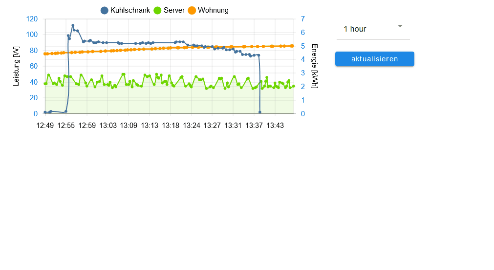

#### Настройки редактора
Настройки, не перечисленные в таблице ниже, не требуют пояснений.

<table><thead><tr><th>Снимок экрана</th><th> Настройка</th><th> Описание </th></tr></thead><tbody><tr><td rowspan=5></td><td> экземпляр адаптера</td><td> Экземпляр для адаптера sql или истории</td></tr><tr><td> управление временным интервалом с помощью объекта</td><td> Идентификатор точки данных для изменения временного интервала графика.<br><br> Если точка данных относится к типу &#39;строка&#39;, она должна содержать <a href="https://github.com/Scrounger/ioBroker.vis-materialdesign/blob/235530e4e54346b5527333ca06ce596519954c67/widgets/materialdesign/js/materialdesign.chart.js#L802">одно из связанных значений.</a><br> Если точка данных относится к типу «число», она должна содержать начальную временную метку графика.<br><br> Например, вы можете использовать кнопку здесь, чтобы изменить отображение диаграммы во время выполнения.</td></tr><tr><td> логический объект для обновления</td><td> Идентификатор adatapoint для запуска обновления диаграммы вручную.<br> Например, вы можете использовать кнопку здесь, чтобы обновить диаграмму во время выполнения.</td></tr><tr><td> тайм-аут графика</td><td> тайм-аут загрузки данных диаграммы. Если вы получили сообщение об ошибке тайм-аута, увеличьте это значение</td></tr><tr><td> Режим отладки</td><td> если у вас есть проблемы или ошибки, активируйте режим отладки и прикрепите данные журнала консоли (F12) к проблеме</td></tr><tr><td rowspan=5>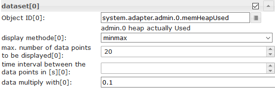</td><td> Идентификатор объекта [x]</td><td> идентификатор точки данных с активированным экземпляром истории</td></tr><tr><td> метод отображения [x]</td><td> <a href="https://www.iobroker.net/docu/index-195.htm?page_id=198&lang=en#Aggregation">метод агрегирования</a></td></tr><tr><td> Максимум. количество отображаемых точек данных [x]</td><td> Максимальное количество точек данных для отображения</td></tr><tr><td> временной интервал между точками данных в [s] [x]</td><td> Необязательная настройка, отменяет настройку «счетчик».<br> Расстояние между отдельными точками данных в секундах.<br> Например, если вы хотите отображать точки данных каждую минуту, вы должны ввести здесь 60</td></tr><tr><td> данные умножаются на [x]</td><td> Необязательная настройка, умножьте каждую точку данных на заданное значение</td></tr><tr><td></td><td> форматы времени оси x</td><td> Измените формат времени оси X. Форматы времени необходимо вводить для всех единиц <a href="https://github.com/Scrounger/ioBroker.vis-materialdesign/blob/c677220868961b3cf0b153fb8bf04e13b4475c09/widgets/materialdesign/js/materialdesign.chart.js#L805">времени, допустимы следующие единицы времени.</a><br> Утвержденные форматы времени необходимо вводить в соответствии с библиотекой moment.js, <a href="https://momentjs.com/docs/#/displaying/">см. Ссылку</a></td></tr><tr><td></td><td> форматы времени всплывающей подсказки</td><td> Измените формат времени всплывающей подсказки. Форматы времени необходимо вводить для всех единиц <a href="https://github.com/Scrounger/ioBroker.vis-materialdesign/blob/c677220868961b3cf0b153fb8bf04e13b4475c09/widgets/materialdesign/js/materialdesign.chart.js#L805">времени, допустимы следующие единицы времени.</a><br> Утвержденные форматы времени необходимо вводить в соответствии с библиотекой moment.js, <a href="https://momentjs.com/docs/#/displaying/">см. Ссылку</a></td></tr></tbody></table>

### Диаграмма JSON
С диаграммой JSON у вас есть максимальная свобода создания смешанной диаграммы (линии, столбцы и столбцы с накоплением) с помощью скрипта.

![Логотип] (doc / en / media / jsonChart.png)! [Logo](../../../en/adapterref/iobroker.vis-materialdesign/doc/en/media/jsonChart2.png)

#### Свойства JSON
<! - опустить в toc ->

##### Общее
<table><thead><tr><th>Свойство</th><th> Описание</th><th> Тип</th><th> Ценности</th></tr></thead><tbody><tr><td> axisLabels</td><td> метка оси графика</td><td> Массив</td><td> числа или строка</td></tr><tr><td> графики</td><td> данные графиков</td><td> массив &lt; <a href="#graph">график</a> &gt;</td><td> см. график</td></tr></tbody></table>

<! - опустить в toc ->

##### График
<details><table><thead><tr><th>Свойство</th><th> Описание</th><th> Тип</th><th> Ценности</th></tr></thead><tbody><tr><td> данные</td><td> данные графика или данные с отметкой времени</td><td> Массив [числа] | Массив [ <a href="#data-with-time-axis">значения с отметкой времени</a> ]</td><td> количество</td></tr><tr><td> тип</td><td> тип графика</td><td> строка</td><td> &#39;линия&#39;, &#39;полоса&#39;</td></tr><tr><td> legendText</td><td> текст легенды</td><td> строка</td><td></td></tr><tr><td> Отобразить заказ</td><td> порядок наложения графика</td><td> количество</td><td> 1, 2, ...</td></tr><tr><td> цвет</td><td> цвет графика</td><td> цвет</td><td> шестнадцатеричный (# 44739e), RGB (20, 50, 200), RGBA (20, 50, 200, 0,5)</td></tr><tr><td> use_gradient_color</td><td> использовать цвет градиента</td><td> логический</td><td> ложная правда</td></tr><tr><td> gradient_color</td><td> массив цветов градиента</td><td> массив [ <a href="#gradientcolor">gradientColor</a> ]</td><td> [{значение: -20, цвет: &#39;# 7d3c98&#39;}, {значение: 0, цвет: &#39;# 2874a6&#39;}]</td></tr><tr><td> tooltip_title</td><td> заголовок всплывающей подсказки</td><td> строка</td><td></td></tr><tr><td> tooltip_text</td><td> ovveride текст всплывающей подсказки</td><td> строка</td><td></td></tr><tr><td> tooltip_MinDigits</td><td> максимальное количество знаков после запятой в значении всплывающей подсказки</td><td> количество</td><td> 0, 1, 2, ...</td></tr><tr><td> tooltip_MaxDigits</td><td> максимальное количество знаков после запятой в значении всплывающей подсказки</td><td> количество</td><td> 0, 1, 2, ...</td></tr><tr><td> tooltip_AppendText</td><td> добавить текст к значению всплывающей подсказки</td><td> строка</td><td></td></tr><tr><td> datalabel_show</td><td> показать метки данных для графика</td><td> строка | логический</td><td> ложь, истина, авто</td></tr><tr><td> datalabel_anchor</td><td> привязка меток данных</td><td> строка</td><td> центр, начало, конец</td></tr><tr><td> datalabel_align</td><td> положение метки данных относительно точки привязки</td><td> строка</td><td> влево, начало, центр, конец, вправо, вверх, вниз</td></tr><tr><td> datalabel_offset</td><td> расстояние (в пикселях), чтобы отвести метку данных от точки привязки</td><td> количество</td><td> 0, 1, 2, ...</td></tr><tr><td> datalabel_text_align</td><td> текстовое соответствие метки данных</td><td> строка</td><td> влево, начало, центр, конец, вправо</td></tr><tr><td> datalabel_rotation</td><td> угол поворота (в градусах) метки данных по часовой стрелке</td><td> количество</td><td> 0, 1, 2, ...</td></tr><tr><td> datalabel_steps</td><td> показывать метку данных каждые x шаг</td><td> количество</td><td> 0, 1, 2, ...</td></tr><tr><td> datalabel_minDigits</td><td> минимальное количество знаков после запятой в метках данных</td><td> количество</td><td> 0, 1, 2, ...</td></tr><tr><td> datalabel_maxDigits</td><td> максимальное количество знаков после запятой в метках данных</td><td> количество</td><td> 0, 1, 2, ...</td></tr><tr><td> datalabel_append</td><td> добавить текст к метке данных</td><td> строка</td><td></td></tr><tr><td> datalabel_color</td><td> цвет метки данных</td><td> цвет | массив [цвета]</td><td> шестнадцатеричный (# 44739e), RGB (20, 50, 200), RGBA (20, 50, 200, 0,5)</td></tr><tr><td> datalabel_fontFamily</td><td> семейство шрифтов метки данных</td><td> строка</td><td></td></tr><tr><td> datalabel_fontSize</td><td> размер шрифта метки данных</td><td> количество</td><td> 1, 2, 5, ...</td></tr><tr><td> datalabel_backgroundColor</td><td> цвет фона метки данных</td><td> цвет | массив [цвета]</td><td> шестнадцатеричный (# 44739e), RGB (20, 50, 200), RGBA (20, 50, 200, 0,5)</td></tr><tr><td> datalabel_borderColor</td><td> цвет границы метки данных</td><td> цвет | массив [цвета]</td><td> шестнадцатеричный (# 44739e), RGB (20, 50, 200), RGBA (20, 50, 200, 0,5)</td></tr><tr><td> datalabel_borderWidth</td><td> ширина границы метки данных</td><td> количество</td><td> 1, 2, 5, ...</td></tr><tr><td> datalabel_borderRadius</td><td> радиус границы метки данных</td><td> количество</td><td> 1, 2, 5, ...</td></tr></tbody></table></details>

<! - опустить в toc ->

##### График график spfeicifc
<details><table><thead><tr><th>Свойство</th><th> Описание</th><th> Тип</th><th> Ценности</th></tr></thead><tbody><tr><td> line_pointStyle</td><td> точечный стиль линии</td><td> строка</td><td> круг, крест, crossRot, черта, линия, rect, rectRounded, rectRot, звезда, треугольник</td></tr><tr><td> line_pointSize</td><td> размер строки</td><td> количество</td><td> 1, 2, 3, ...</td></tr><tr><td> line_pointSizeHover</td><td> размер строки</td><td> количество</td><td> 1, 2, 3, ...</td></tr><tr><td> line_PointColor</td><td> цвет точки линии</td><td> цвет | массив [цвета]</td><td> шестнадцатеричный (# 44739e), RGB (20, 50, 200), RGBA (20, 50, 200, 0,5)</td></tr><tr><td> line_PointColorBorder</td><td> цвет границы точки линии</td><td> цвет | массив [цвета]</td><td> шестнадцатеричный (# 44739e), RGB (20, 50, 200), RGBA (20, 50, 200, 0,5)</td></tr><tr><td> line_PointColorHover</td><td> цвет наведения линии</td><td> цвет | массив [цвета]</td><td> шестнадцатеричный (# 44739e), RGB (20, 50, 200), RGBA (20, 50, 200, 0,5)</td></tr><tr><td> line_PointColorBorderHover</td><td> цвет границы при наведении курсора на точку линии</td><td> цвет | массив [цвета]</td><td> шестнадцатеричный (# 44739e), RGB (20, 50, 200), RGBA (20, 50, 200, 0,5)</td></tr><tr><td> line_spanGaps</td><td> рисовать линии, если в данных есть пробелы</td><td> логический</td><td> ложная правда</td></tr><tr><td> line_steppedLine</td><td> включить ступенчатую линию</td><td> логический</td><td> ложная правда</td></tr><tr><td> line_Tension</td><td> плавность линии</td><td> количество</td><td> 0 - 1</td></tr><tr><td> line_Thickness</td><td> толщина линии</td><td> количество</td><td> 1, 2, 5, ...</td></tr><tr><td> line_UseFillColor</td><td> использовать цвет заливки под линией</td><td> логический</td><td> ложная правда</td></tr><tr><td> line_FillColor</td><td> цвет заливки под линией</td><td> цвет</td><td> шестнадцатеричный (# 44739e), RGB (20, 50, 200), RGBA (20, 50, 200, 0,5)</td></tr><tr><td> use_line_gradient_fill_color</td><td> использовать цвет градиентной заливки</td><td> логический</td><td> ложная правда</td></tr><tr><td> line_gradient_fill_color</td><td> массив цветов градиента</td><td> массив [ <a href="#gradientcolor">gradientColor</a> ]</td><td> [{значение: -20, цвет: &#39;# 7d3c98&#39;}, {значение: 0, цвет: &#39;# 2874a6&#39;}]</td></tr><tr><td> line_FillBetweenLines</td><td> цвет заливки до следующей / предыдущей строки</td><td> строка</td><td> &#39;+1&#39;, &#39;-1&#39;, &#39;+2&#39;, ...</td></tr></tbody></table></details>

<! - опустить в toc ->

##### График гистограмма spfeicifc
<details><table><thead><tr><th>Свойство</th><th> Описание</th><th> Тип</th><th> Ценности</th></tr></thead><tbody><tr><td> barIsStacked</td><td> сложенный бар. Если у вас есть составная диаграмма (линия + столбик с накоплением), вы также должны установить это значение для линейного набора данных!</td><td> логический</td><td> ложная правда</td></tr><tr><td> barStackId</td><td> идентификатор стека. Бар, который должен объединиться в стек, должен иметь одинаковый идентификатор</td><td> количество</td><td> 1, 2, 5, ...</td></tr><tr><td> barColorHover</td><td> цвет панели при наведении</td><td> цвет | массив [цвета]</td><td> шестнадцатеричный (# 44739e), RGB (20, 50, 200), RGBA (20, 50, 200, 0,5)</td></tr><tr><td> barBorderColor</td><td> цвет границы полосы</td><td> цвет | массив [цвета]</td><td> шестнадцатеричный (# 44739e), RGB (20, 50, 200), RGBA (20, 50, 200, 0,5)</td></tr><tr><td> barBorderWidth</td><td> толщина бордюра</td><td> количество</td><td> 1, 2, 5, ...</td></tr><tr><td> barBorderColorHover</td><td> цвет границы при наведении курсора</td><td> цвет | массив [цвета]</td><td> шестнадцатеричный (# 44739e), RGB (20, 50, 200), RGBA (20, 50, 200, 0,5)</td></tr><tr><td> barBorderWidthHover</td><td> толщина границы бара</td><td> количество</td><td> 1, 2, 5, ...</td></tr></tbody></table></details>

<! - опустить в toc ->

##### График оси Y
<details><table><thead><tr><th>Свойство</th><th> Описание</th><th> Тип</th><th> Ценности</th></tr></thead><tbody><tr><td> yAxis_id</td><td> id оси y. Если вы хотите использовать общую ось Y для данных графика умножения, используйте тот же идентификатор.</td><td> количество</td><td> 1, 2, 5, ...</td></tr><tr><td> yAxis_position</td><td> положение оси Y</td><td> строка</td><td> лево право</td></tr><tr><td> yAxis_show</td><td> показать ось Y</td><td> логический</td><td> ложная правда</td></tr><tr><td> yAxis_title_text</td><td> заголовок оси Y</td><td> строка</td><td></td></tr><tr><td> yAxis_title_color</td><td> переопределить цвет заголовка оси Y</td><td> цвет</td><td> шестнадцатеричный (# 44739e), RGB (20, 50, 200), RGBA (20, 50, 200, 0,5)</td></tr><tr><td> yAxis_title_fontFamily</td><td> переопределить семейство шрифтов заголовка оси Y</td><td> строка</td><td></td></tr><tr><td> yAxis_title_fontSize</td><td> переопределить размер шрифта заголовка оси Y</td><td> количество</td><td> 1, 2, 5, ...</td></tr><tr><td> yAxis_min</td><td> минимальное значение оси Y</td><td> количество</td><td> 1, 2, 5, ...</td></tr><tr><td> yAxis_max</td><td> максимальное значение оси Y</td><td> количество</td><td> 1, 2, 5, ...</td></tr><tr><td> yAxis_step</td><td> шаги оси y</td><td> количество</td><td> 1, 2, 5, ...</td></tr><tr><td> yAxis_minimumDigits</td><td> Минимальное количество десятичных знаков по оси Y</td><td> количество</td><td> 1, 2, 5, ...</td></tr><tr><td> yAxis_maximumDigits</td><td> Максимальное количество десятичных знаков по оси Y</td><td> количество</td><td> 1, 2, 5, ...</td></tr><tr><td> yAxis_maxSteps</td><td> максимальные шаги по оси y</td><td> количество</td><td> 1, 2, 5, ...</td></tr><tr><td> yAxis_distance</td><td> переопределить значение оси Y расстояние до оси</td><td> количество</td><td> 1, 2, 5, ...</td></tr><tr><td> yAxis_appendix</td><td> добавить текст к значению оси Y</td><td> строка</td><td></td></tr><tr><td> yAxis_color</td><td> переопределить цвет значения оси Y</td><td> цвет</td><td> шестнадцатеричный (# 44739e), RGB (20, 50, 200), RGBA (20, 50, 200, 0,5)</td></tr><tr><td> yAxis_fontFamily</td><td> переопределить семейство шрифтов значения оси Y</td><td> строка</td><td></td></tr><tr><td> yAxis_fontSize</td><td> переопределить размер шрифта значения оси Y</td><td> количество</td><td> 1, 2, 5, ...</td></tr><tr><td> yAxis_zeroLineWidth</td><td> ширина нулевой линии по оси Y</td><td> количество</td><td> 0,3, 1,5, 4, ...</td></tr><tr><td> yAxis_zeroLineColor</td><td> цвет нулевой линии оси Y</td><td> цвет</td><td> шестнадцатеричный (# 44739e), RGB (20, 50, 200), RGBA (20, 50, 200, 0,5)</td></tr><tr><td> yAxis_gridLines_show</td><td> показать линии сетки по оси Y</td><td> логический</td><td> ложная правда</td></tr><tr><td> yAxis_gridLines_color</td><td> цвет линий сетки по оси Y</td><td> цвет</td><td> шестнадцатеричный (# 44739e), RGB (20, 50, 200), RGBA (20, 50, 200, 0,5)</td></tr><tr><td> yAxis_gridLines_lineWidth</td><td> ширина линий сетки</td><td> количество</td><td> 0 - 1</td></tr><tr><td> yAxis_gridLines_border_show</td><td> показать границу линий сетки по оси Y</td><td> логический</td><td> ложная правда</td></tr><tr><td> yAxis_gridLines_ticks_show</td><td> показать отметки интервала сетки по оси Y</td><td> логический</td><td> ложная правда</td></tr><tr><td> yAxis_gridLines_ticks_length</td><td> длина штрихов сетки по оси Y</td><td> количество</td><td> 1, 2, 5, ...</td></tr></tbody></table></details>

<! - опустить в toc ->

##### GradientColor
<details><table><thead><tr><th>Свойство</th><th> Описание</th><th> Тип</th><th> Ценности</th></tr></thead><tbody><tr><td> ценность</td><td> значение, в котором следует применить цвет</td><td> количество</td><td> 1, 2, 5, ...</td></tr><tr><td> цвет</td><td> цвет для значения</td><td> цвет</td><td> шестнадцатеричный (# 44739e), RGB (20, 50, 200), RGBA (20, 50, 200, 0,5)</td></tr></tbody></table></details>

<! - опустить в toc ->

##### Диаграмма с временной осью. JSON Chart поддерживает данные с меткой времени. Чтобы использовать это, массив данных должен иметь значения для отметки времени (значение оси X) и значения (значение оси Y).
###### Значения с отметкой времени
<details><table><thead><tr><th>Свойство</th><th> Описание</th><th> Тип</th><th> Ценности</th></tr></thead><tbody><tr><td> т</td><td> timestamp - значение xAxis</td><td> количество</td><td> 1, 2, 5, ...</td></tr><tr><td> у</td><td> значение для отметки времени - значение yAxis</td><td> количество</td><td> 1, 2, 5, ...</td></tr></tbody></table></details>

###### Настройки оси x для данных с отметкой времени
<details><table><thead><tr><th>Свойство</th><th> Описание</th><th> Тип</th><th> Ценности</th></tr></thead><tbody><tr><td> xAxis_bounds</td><td> стратегия границы масштаба<br><br> &#39;data&#39;: обеспечивает полную видимость данных, внешние ярлыки удаляются<br> &#39;ticks&#39;: проверяет, что галочки полностью видны, данные за пределами усекаются</td><td> Строка</td><td> данные, тики</td></tr><tr><td> xAxis_timeFormats</td><td> форматы времени для оси x</td><td> Объект</td><td> Форматы времени необходимо вводить для всех единиц <a href="https://github.com/Scrounger/ioBroker.vis-materialdesign/blob/c677220868961b3cf0b153fb8bf04e13b4475c09/widgets/materialdesign/js/materialdesign.chart.js#L805">времени, допустимы следующие единицы времени.</a><br> Утвержденные форматы времени необходимо вводить в соответствии с библиотекой moment.js, <a href="https://momentjs.com/docs/#/displaying/">см. Ссылку</a></td></tr><tr><td> xAxis_tooltip_timeFormats</td><td> форматы времени для оси x</td><td> Строка</td><td> Утвержденные форматы времени необходимо вводить в соответствии с библиотекой moment.js, <a href="https://momentjs.com/docs/#/displaying/">см. Ссылку</a></td></tr><tr><td> xAxis_time_unit</td><td> установить формат времени для оси x</td><td> Строка</td><td> допустимы следующие единицы, <a href="https://www.chartjs.org/docs/latest/axes/cartesian/time.html#time-units">см. ссылку</a></td></tr></tbody></table></details>

<! - опустить в toc ->

#### Пример
<details> <pre><code> { "axisLabels": ["1h", "2h", "3h", "4h", "5h", "6h", "7h", "8h", "9h", "10h", "11h", "12h", "13h", "14h", "17h", "18h", "19h", "20h", "21h", "22h", "23h", "24h"], "graphs": [ { "data": [19, 19, 18, 19, 19, 20, 20, 21, 22, 24, 24, 24, 23, 22, 23, 23, 24, 23, 23, 22, 22, 21, 20, 20], "type": "line", "color": "gray", "legendText": "Temperatur", "line_pointSizeHover": 5, "line_pointSize": 0, "line_Tension": 0.3, "yAxis_show": false, "yAxis_gridLines_show": false, "yAxis_gridLines_ticks_length": 5, "yAxis_min": 0, "yAxis_max": 30, "yAxis_step": 5, "yAxis_position": "left", "yAxis_appendix": " °C", "yAxis_zeroLineWidth": 0.1, "yAxis_zeroLineColor": "black", "displayOrder": 0, "tooltip_AppendText": " °C", "datalabel_backgroundColor": ["#2b9a44", "#2b9a44", "#3aa35b", "#2b9a44", "#2b9a44", "#1d922e", "#1d922e", "#0e8917", "#008000", "#668f00", "#668f00", "#668f00", "#338700", "#008000", "#338700", "#338700", "#668f00", "#338700", "#338700", "#008000", "#008000", "#0e8917", "#1d922e", "#1d922e"], "datalabel_color": "white", "datalabel_offset": -10, "datalabel_fontFamily": "RobotoCondensed-Light", "datalabel_fontSize": 12, "datalabel_borderRadius": 6, "datalabel_show": "auto", "line_PointColor": ["#2b9a44", "#2b9a44", "#3aa35b", "#2b9a44", "#2b9a44", "#1d922e", "#1d922e", "#0e8917", "#008000", "#668f00", "#668f00", "#668f00", "#338700", "#008000", "#338700", "#338700", "#668f00", "#338700", "#338700", "#008000", "#008000", "#0e8917", "#1d922e", "#1d922e"], "line_PointColorBorder": ["#2b9a44", "#2b9a44", "#3aa35b", "#2b9a44", "#2b9a44", "#1d922e", "#1d922e", "#0e8917", "#008000", "#668f00", "#668f00", "#668f00", "#338700", "#008000", "#338700", "#338700", "#668f00", "#338700", "#338700", "#008000", "#008000", "#0e8917", "#1d922e", "#1d922e"], "line_PointColorHover": ["#2b9a44", "#2b9a44", "#3aa35b", "#2b9a44", "#2b9a44", "#1d922e", "#1d922e", "#0e8917", "#008000", "#668f00", "#668f00", "#668f00", "#338700", "#008000", "#338700", "#338700", "#668f00", "#338700", "#338700", "#008000", "#008000", "#0e8917", "#1d922e", "#1d922e"], "line_PointColorBorderHover": ["#2b9a44", "#2b9a44", "#3aa35b", "#2b9a44", "#2b9a44", "#1d922e", "#1d922e", "#0e8917", "#008000", "#668f00", "#668f00", "#668f00", "#338700", "#008000", "#338700", "#338700", "#668f00", "#338700", "#338700", "#008000", "#008000", "#0e8917", "#1d922e", "#1d922e"], "use_gradient_color": true, "gradient_color": [{ "value": -20, "color": "#5b2c6f66" }, { "value": 0, "color": "#2874a666" }, { "value": 14, "color": "#73c6b666" }, { "value": 22, "color": "#00800066" }, { "value": 27, "color": "#ffa50066" }, { "value": 35, "color": "#ff000066" } ], "use_line_gradient_fill_color": true, "line_gradient_fill_color": [{ "value": -20, "color": "#5b2c6f66" }, { "value": 0, "color": "#2874a666" }, { "value": 14, "color": "#73c6b666" }, { "value": 22, "color": "#00800066" }, { "value": 27, "color": "#ffa50066" }, { "value": 35, "color": "#ff000066" } ] }, { "data": [50, 50, 50, 50, 50, 50, 50, 50, 50, 50, 50, 50, 50, 19, 33, 36, 23, 14, 16, 34, 46, 40, 24, 22], "type": "line", "color": "#0d47a1", "legendText": "Regenwahrscheinlichkeit", "line_UseFillColor": true, "line_pointSize": 0, "line_pointSizeHover": 5, "yAxis_min": 0, "yAxis_max": 100, "yAxis_maxSteps": 10, "yAxis_position": "left", "yAxis_gridLines_show": false, "yAxis_gridLines_border_show": false, "yAxis_zeroLineWidth": 0.1, "yAxis_zeroLineColor": "black", "yAxis_appendix": " %", "displayOrder": 1, "tooltip_AppendText": " %", "datalabel_show": false }, { "data": ["0", "0", "0", "0", "0", "0", "0", "0", "0", "0", "0", "1.3", "2.5", 0, 1.9, 1.17, 0, 0, 0, 0.18, 0.7, 0.2, 0, 0], "type": "bar", "color": "#6dd600", "legendText": "Niederschlag", "yAxis_min": 0, "yAxis_max": 5, "yAxis_maxSteps": 10, "yAxis_position": "right", "yAxis_gridLines_show": false, "yAxis_appendix": " mm", "yAxis_gridLines_border_show": false, "yAxis_zeroLineWidth": 0.1, "yAxis_zeroLineColor": "black", "displayOrder": 1, "tooltip_AppendText": " mm", "datalabel_show": false } ] }

</pre> </code> </details>

<details> <pre><code> { "axisLabels": ["Jan", "Feb", "Mrz", "Apr"], "graphs": [{ "type": "line", "data": [40, 22, 160, 92], "yAxis_id": 0, "barIsStacked": true, "datalabel_show": false, "line_UseFillColor": true

}, {"type": "bar", "barIsStacked": true, "data": [30, 69, 91, 35], "yAxis_id": 0, "barStackId": 0, "color": "# 6dd600 "," datalabel_color ":" #FFFFFF "," datalabel_align ":" start "," use_gradient_color ": true," gradient_color ": [{" value ": 60," color ":" # 6dd600 "}, {" value ": 0," color ":" lightgray "}]}, {" type ":" bar "," barIsStacked ": true," data ": [17, 68, 83, 49]," yAxis_id ": 0, "barStackId": 1, "color": "# ff9800", "datalabel_color": "#FFFFFF", "datalabel_align": "start"}, {"type": "bar", "barIsStacked": true, "data ": [95, 42, 34, 31]," yAxis_id ": 0," barStackId ": 1," color ":" # 8e24aa "," datalabel_color ":" #FFFFFF "," datalabel_align ":" start "} , {"type": "bar", "barIsStacked": true, "data": [33, 44, 22, 34], "yAxis_id": 0, "barStackId": 2, "color": "# a65628" , "datalabel_color": "#FFFFFF", "datalabel_align": "start"}, {"type": "bar", "barIsStacked": true, "data": [28, 34, 45, 23], "yAxis_id ": 0," yAxis_max ":" 180 "," barStackId ": 2," color ":" # d32f2f "," datalabel_color ":" #FFFFFF " , "datalabel_align": "start"}]}

</pre> </code> </details>

## Таблица


### Настройки редактора
<table><thead><tr><th>Снимок экрана</th><th> Настройка</th><th> Описание</th></tr></thead><tbody><tr><td rowspan=2></td><td> переключатель</td><td> Datapoint из строки типа с входными данными, как показано выше</td></tr><tr><td> данные как JSON</td><td> Необязательно, введите данные, как показано выше, если точка данных oid не установлена</td></tr><tr><td rowspan=4></td><td> colType [x]</td><td> Если изображение выбрано, свойство объекта должно иметь путь к изображению ( <a href="https://github.com/Scrounger/ioBroker.vis-materialdesign#input-data">см. Выше</a> )</td></tr><tr><td> префикс [x]</td><td> Можно использовать префикс для свойства объекта, внутренней привязки объекта ( <a href="https://github.com/Scrounger/ioBroker.vis-materialdesign#internal-object-binding">см. Ниже</a> ) и html.</td></tr><tr><td> суффикс [x]</td><td> Можно использовать суффикс для свойства объекта, внутренней привязки объекта ( <a href="https://github.com/Scrounger/ioBroker.vis-materialdesign#internal-object-binding">см. Ниже</a> ) и html.</td></tr><tr><td> имя объекта для сортировки [x]</td><td> Здесь вы можете определить другое свойство объекта, которое следует использовать для сортировки.</td></tr></tbody></table>

### Данные - структура JSON
Входные данные должны быть массивом объектов json. Вы можете использовать любое свойство, структура исправлений отсутствует. Столбец 0 получает значение первого свойства, столбец 1 получает значение второго свойства и так далее.
Важно то, что каждый объект имеет одинаковую структуру.

```
[
	{
		"img": "/vis.0/myImages/erlebnis_50.png",
		"name": "Empire",
		"betriebszeit": "4h 06m",
		"funk": "5G",
		"ip": "10.0.0.1"
	},
	{
		"img": "/vis.0/myImages/erlebnis_100.png",
		"name": "Handy",
		"betriebszeit": "13m",
		"funk": "5G",
		"ip": "10.0.0.2"
	},
	{
		"img": "/vis.0/myImages/erlebnis_100.png",
		"name": "Harmony Hub - Wohnzimmer",
		"betriebszeit": "18T 07h 21m",
		"funk": "2G",
		"ip": "10.0.0.3"
	}
]
```

### Привязка внутреннего объекта
префикс и суффикс поддерживают привязку внутреннего объекта таблицы -> вы можете получить доступ к другим свойствам объекта, используя

```
#[obj.'propertyName']
```

Пример см <a href="https://github.com/Scrounger/ioBroker.vis-materialdesign#input-data">. Выше</a> .

Пример рабочего виджета можно найти

* [здесь] (https://forum.iobroker.net/topic/26199/test-adapter-material-design-widgets-v0-1-x/113)
* [ical Adapter] (https://forum.iobroker.net/topic/29658/material-design-widgets-table-widget/2)

### Виджеты управления HTML
Вы можете использовать [HTML-виджеты](#html-widgets) непосредственно в строке json. Если вы хотите настроить ячейку, в которой находится виджет, используйте следующий контейнер.


<table><thead><tr><th>Свойство</th><th> Описание</th><th> Тип</th><th> Свойства</th></tr></thead><tbody><tr><td> гребень</td><td> ячейка, занимающая x строк</td><td> количество</td><td> 1, 2, 3, ...</td></tr><tr><td> Colspan</td><td> ячейка, охватывающая x столбцов</td><td> количество</td><td> 1, 2, 3, ...</td></tr><tr><td> cellStyleAttrs</td><td> Атрибуты стиля css для ячейки</td><td> строка</td><td></td></tr><tr><td> html</td><td> любой элемент html, например. виджет html</td><td> строка</td><td></td></tr></tbody></table>

<! - опустить в toc ->

#### HTML-виджеты управления - пример
<details>

```
[
	{
		"col_1": "button toggle",
		"col_2": {
			"rowspan": "2",
			"html": "<div style='display: flex; justify-content: center'><div class='vis-widget materialdesign-widget materialdesign-button materialdesign-button-html-element'
			style='width: 80px; height: 60px; position: relative; padding: 0px;'
			mdw-type='toggle_vertical'
			mdw-oid='0_userdata.0.MDW.Table.Control.bool'
			mdw-buttonStyle='raised'
			mdw-toggleType='boolean'
			mdw-stateIfNotTrueValue='on'
			mdw-vibrateOnMobilDevices='50'
			mdw-buttontext='off'
			mdw-labelTrue='on'
			mdw-labelColorTrue='#000000'
			mdw-textFontFamily='#mdwTheme:vis-materialdesign.0.fonts.button.vertical.text'
			mdw-textFontSize='#mdwTheme:vis-materialdesign.0.fontSizes.button.vertical.text'
			mdw-alignment='center'
			mdw-mdwButtonPrimaryColor='#mdwTheme:vis-materialdesign.0.colors.button.vertical.primary'
			mdw-mdwButtonSecondaryColor='#mdwTheme:vis-materialdesign.0.colors.button.vertical.secondary'
			mdw-colorBgTrue='green'
			mdw-image='checkbox-blank-outline'
			mdw-imageTrue='checkbox-marked'
			mdw-iconPosition='top'
			mdw-iconHeight='36'
			mdw-lockEnabled='true'
			mdw-autoLockAfter='10'
			mdw-lockIconTop='5'
			mdw-lockIconLeft='5'
			mdw-lockIconColor='#mdwTheme:vis-materialdesign.0.colors.button.lock_icon'
			mdw-lockFilterGrayscale='30'
			></div></div>"
		},
		"col_3": "<div class='vis-widget materialdesign-widget materialdesign-button materialdesign-button-html-element'
		style='width: 100%; height: 100%; position: relative; padding: 0px;'
		mdw-type='toggle_default'
		mdw-oid='0_userdata.0.MDW.Table.Control.bool'
		mdw-buttonStyle='raised'
		mdw-toggleType='boolean'
		mdw-stateIfNotTrueValue='on'
		mdw-vibrateOnMobilDevices='50'
		mdw-buttontext='off'
		mdw-labelTrue='on'
		mdw-textFontFamily='#mdwTheme:vis-materialdesign.0.fonts.button.default.text'
		mdw-textFontSize='#mdwTheme:vis-materialdesign.0.fontSizes.button.default.text'
		mdw-mdwButtonPrimaryColor='#mdwTheme:vis-materialdesign.0.colors.button.default.primary'
		mdw-mdwButtonSecondaryColor='#mdwTheme:vis-materialdesign.0.colors.button.default.secondary'
		mdw-colorBgTrue='#a2bc9f'
		mdw-image='access-point-network-off'
		mdw-imageColor='#c70000'
		mdw-imageTrue='access-point-network'
		mdw-imageTrueColor='#36fa29'
		mdw-iconPosition='left'
		mdw-autoLockAfter='10'
		mdw-lockIconColor='#mdwTheme:vis-materialdesign.0.colors.button.lock_icon'
		mdw-lockFilterGrayscale='30'
		></div>",
		"col_4": "<div class='vis-widget materialdesign-widget materialdesign-icon-button materialdesign-button-html-element'
		style='width: 48px; height: 48px; position: relative; padding: 0px;'
		mdw-type='toggle_icon'
		mdw-oid='0_userdata.0.MDW.Table.Control.bool'
		mdw-toggleType='boolean'
		mdw-stateIfNotTrueValue='on'
		mdw-vibrateOnMobilDevices='50'
		mdw-image='access-point-network-off'
		mdw-imageColor='#mdwTheme:vis-materialdesign.0.colors.button.icon.icon_off'
		mdw-imageTrue='access-point-network'
		mdw-imageTrueColor='orange'
		mdw-colorBgFalse='#mdwTheme:vis-materialdesign.0.colors.button.icon.background_off'
		mdw-colorBgTrue='#mdwTheme:vis-materialdesign.0.colors.button.icon.background_on'
		mdw-colorPress='#mdwTheme:vis-materialdesign.0.colors.button.icon.pressed'
		mdw-autoLockAfter='10'
		mdw-lockIconTop='45'
		mdw-lockIconLeft='55'
		mdw-lockIconSize='20'
		mdw-lockIconColor='#mdwTheme:vis-materialdesign.0.colors.button.icon.lock_icon'
		mdw-lockIconBackground='#mdwTheme:vis-materialdesign.0.colors.button.icon.lock_icon_background'
		mdw-lockBackgroundSizeFactor='1'
		mdw-lockFilterGrayscale='30'
		></div>"
	}, {
		"col_1": "Checkbox / Switch",
		"col_2": "<div style='display: flex; justify-content: center'><div class='vis-widget materialdesign-widget materialdesign-checkbox materialdesign-checkbox-html-element'
		style='width: 71px; height: 24px; position: relative; overflow: visible !important; display: flex; align-items: center;'
		mdw-oid='0_userdata.0.MDW.Table.Control.bool'
		mdw-toggleType='boolean'
		mdw-stateIfNotTrueValue='on'
		mdw-vibrateOnMobilDevices='50'
		mdw-labelFalse='on'
		mdw-labelTrue='off'
		mdw-labelPosition='left'
		mdw-labelClickActive='true'
		mdw-valueFontFamily='#mdwTheme:vis-materialdesign.0.fonts.checkbox.value'
		mdw-valueFontSize='#mdwTheme:vis-materialdesign.0.fontSizes.checkbox.value'
		mdw-colorCheckBox='#mdwTheme:vis-materialdesign.0.colors.checkbox.on'
		mdw-colorCheckBoxBorder='#mdwTheme:vis-materialdesign.0.colors.checkbox.border'
		mdw-colorCheckBoxHover='#mdwTheme:vis-materialdesign.0.colors.checkbox.hover'
		mdw-labelColorFalse='#mdwTheme:vis-materialdesign.0.colors.checkbox.text_off'
		mdw-labelColorTrue='#mdwTheme:vis-materialdesign.0.colors.checkbox.text_on'
		mdw-autoLockAfter='10'
		mdw-lockIconTop='5'
		mdw-lockIconLeft='5'
		mdw-lockIconColor='#mdwTheme:vis-materialdesign.0.colors.checkbox.lock_icon'
		mdw-lockFilterGrayscale='30'
		></div></div>",
		"col_3": {
			"cellStyleAttrs": "padding: 8px;",
			"html": "<div style='display: flex; justify-content: center'><div class='vis-widget materialdesign-widget materialdesign-switch materialdesign-switch-html-element'
			style='width: 83px; height: 44px; position: relative; overflow: visible !important; display: flex; align-items: center;'
			mdw-oid='0_userdata.0.MDW.Table.Control.bool'
			mdw-toggleType='boolean'
			mdw-stateIfNotTrueValue='on'
			mdw-vibrateOnMobilDevices='50'
			mdw-labelFalse='off'
			mdw-labelTrue='on'
			mdw-labelPosition='right'
			mdw-labelClickActive='true'
			mdw-valueFontFamily='#mdwTheme:vis-materialdesign.0.fonts.switch.value'
			mdw-valueFontSize='#mdwTheme:vis-materialdesign.0.fontSizes.switch.value'
			mdw-colorSwitchThumb='#mdwTheme:vis-materialdesign.0.colors.switch.off'
			mdw-colorSwitchTrack='#mdwTheme:vis-materialdesign.0.colors.switch.track'
			mdw-colorSwitchTrue='#mdwTheme:vis-materialdesign.0.colors.switch.on'
			mdw-colorSwitchHover='#mdwTheme:vis-materialdesign.0.colors.switch.off_hover'
			mdw-colorSwitchHoverTrue='#mdwTheme:vis-materialdesign.0.colors.switch.on_hover'
			mdw-labelColorFalse='#mdwTheme:vis-materialdesign.0.colors.switch.text_off'
			mdw-labelColorTrue='#mdwTheme:vis-materialdesign.0.colors.switch.text_on'
			mdw-lockEnabled='true'
			mdw-autoLockAfter='10'
			mdw-lockIconTop='5'
			mdw-lockIconLeft='5'
			mdw-lockIconColor='#mdwTheme:vis-materialdesign.0.colors.switch.lock_icon'
			mdw-lockFilterGrayscale='30'
			></div></div>"
		}
	}, {
		"col_1": "Button State",
		"col_2": "<div style='display: flex; justify-content: center'><div class='vis-widget materialdesign-widget materialdesign-icon-button materialdesign-button-html-element'
		style='width: 48px; height: 48px; position: relative; padding: 0px;'
		mdw-type='state_icon'
		mdw-oid='0_userdata.0.MDW.Table.Control.number'
		mdw-value='100'
		mdw-vibrateOnMobilDevices='50'
		mdw-image='battery'
		mdw-imageColor='#mdwTheme:vis-materialdesign.0.colors.button.icon.icon_off'
		mdw-iconHeight='26'
		mdw-colorBgFalse='#mdwTheme:vis-materialdesign.0.colors.button.icon.background_off'
		mdw-colorPress='#mdwTheme:vis-materialdesign.0.colors.button.icon.pressed'
		mdw-autoLockAfter='10'
		mdw-lockIconTop='45'
		mdw-lockIconLeft='55'
		mdw-lockIconSize='20'
		mdw-lockIconColor='#mdwTheme:vis-materialdesign.0.colors.button.icon.lock_icon'
		mdw-lockIconBackground='#mdwTheme:vis-materialdesign.0.colors.button.icon.lock_icon_background'
		mdw-lockBackgroundSizeFactor='1'
		mdw-lockFilterGrayscale='30'
		></div></div>",
		"col_3": "<div style='display: flex; justify-content: center'><div class='vis-widget materialdesign-widget materialdesign-button materialdesign-button-html-element'
		style='width: 100px; height: 100%; position: relative; padding: 0px;'
		mdw-type='state_default'
		mdw-oid='0_userdata.0.MDW.Table.Control.number'
		mdw-buttonStyle='raised'
		mdw-value='70'
		mdw-vibrateOnMobilDevices='50'
		mdw-buttontext='70'
		mdw-textFontFamily='#mdwTheme:vis-materialdesign.0.fonts.button.default.text'
		mdw-textFontSize='#mdwTheme:vis-materialdesign.0.fontSizes.button.default.text'
		mdw-mdwButtonPrimaryColor='#mdwTheme:vis-materialdesign.0.colors.button.default.primary'
		mdw-mdwButtonSecondaryColor='#mdwTheme:vis-materialdesign.0.colors.button.default.secondary'
		mdw-image='battery-70'
		mdw-iconPosition='left'
		mdw-iconHeight='20'
		mdw-lockEnabled='true'
		mdw-autoLockAfter='10'
		mdw-lockIconColor='#mdwTheme:vis-materialdesign.0.colors.button.lock_icon'
		mdw-lockFilterGrayscale='30'
		></div></div>",
		"col_4": "<div style='display: flex; justify-content: center'><div class='vis-widget materialdesign-widget materialdesign-button materialdesign-button-html-element'
		style='width: 102px; height: 67px; position: relative; padding: 0px;'
		mdw-type='state_vertical'
		mdw-oid='0_userdata.0.MDW.Table.Control.number'
		mdw-buttonStyle='raised'
		mdw-value='10'
		mdw-vibrateOnMobilDevices='50'
		mdw-buttontext='10'
		mdw-textFontFamily='#mdwTheme:vis-materialdesign.0.fonts.button.vertical.text'
		mdw-textFontSize='#mdwTheme:vis-materialdesign.0.fontSizes.button.vertical.text'
		mdw-alignment='center'
		mdw-mdwButtonPrimaryColor='#mdwTheme:vis-materialdesign.0.colors.button.vertical.primary'
		mdw-mdwButtonSecondaryColor='#mdwTheme:vis-materialdesign.0.colors.button.vertical.secondary'
		mdw-image='battery-10'
		mdw-iconPosition='top'
		mdw-iconHeight='38'
		mdw-autoLockAfter='10'
		mdw-lockIconTop='5'
		mdw-lockIconLeft='5'
		mdw-lockIconColor='#mdwTheme:vis-materialdesign.0.colors.button.lock_icon'
		mdw-lockFilterGrayscale='30'
		></div></div>"
	}, {
		"col_1": "Progress",
		"col_2": "<div style='display: flex; justify-content: center'><div class='vis-widget materialdesign-widget materialdesign-progress materialdesign-progress-html-element'
		style='width: 83px; height: 81px; position: relative; padding: 0px;'
		mdw-type='circular'
		mdw-oid='0_userdata.0.MDW.Table.Control.number'
		mdw-min='0'
		mdw-max='100'
		mdw-progressCircularSize='80'
		mdw-progressCircularWidth='10'
		mdw-progressCircularRotate='90'
		mdw-colorProgressBackground='#mdwTheme:vis-materialdesign.0.colors.progress.track_background'
		mdw-colorProgress='#mdwTheme:vis-materialdesign.0.colors.progress.track'
		mdw-innerColor='#mdwTheme:vis-materialdesign.0.colors.progress.circular_background'
		mdw-colorOneCondition='60'
		mdw-colorOne='#mdwTheme:vis-materialdesign.0.colors.progress.track_condition1'
		mdw-colorTwoCondition='80'
		mdw-colorTwo='#mdwTheme:vis-materialdesign.0.colors.progress.track_condition2'
		mdw-showValueLabel='true'
		mdw-valueLabelStyle='progressValue'
		mdw-valueMaxDecimals='3'
		mdw-textColor='#mdwTheme:vis-materialdesign.0.colors.progress.text'
		mdw-textFontSize='#mdwTheme:vis-materialdesign.0.fontSizes.progress.text'
		mdw-textFontFamily='#mdwTheme:vis-materialdesign.0.fonts.progress.text'
		></div></div>",
		"col_3": {
			"colspan": "2",
			"html": "<div style='display: flex; justify-content: center'><div class='vis-widget materialdesign-widget materialdesign-progress materialdesign-progress-html-element'
			style='width: 80%; height: 36px; position: relative; padding: 0px;'
			mdw-type='linear'
			mdw-oid='0_userdata.0.MDW.Table.Control.number'
			mdw-min='0'
			mdw-max='100'
			mdw-colorProgressBackground='#mdwTheme:vis-materialdesign.0.colors.progress.track_background'
			mdw-colorProgress='#mdwTheme:vis-materialdesign.0.colors.progress.track'
			mdw-colorOneCondition='50'
			mdw-colorOne='#mdwTheme:vis-materialdesign.0.colors.progress.track_condition1'
			mdw-colorTwoCondition='70'
			mdw-colorTwo='#mdwTheme:vis-materialdesign.0.colors.progress.track_condition2'
			mdw-showValueLabel='true'
			mdw-valueLabelStyle='progressPercent'
			mdw-textColor='#mdwTheme:vis-materialdesign.0.colors.progress.text'
			mdw-textFontSize='#mdwTheme:vis-materialdesign.0.fontSizes.progress.text'
			mdw-textFontFamily='#mdwTheme:vis-materialdesign.0.fonts.progress.text'
			mdw-textAlign='end'
			></div></div>"
		}
	}, {
		"col_1": "Slider",
		"col_2": {
			"colspan": "2",
			"cellStyleAttrs": "overflow: visible;",
			"html": "<div style='display: flex; justify-content: center'><div class='vis-widget materialdesign-widget materialdesign-slider-vertical materialdesign-slider-html-element'
			style='width: 90%; height: 60px; position: relative; overflow:visible !important; display: flex; align-items: center;'
			mdw-oid='0_userdata.0.MDW.Table.Control.number'
			mdw-orientation='horizontal'
			mdw-knobSize='knobSmall'
			mdw-step='1'
			mdw-vibrateOnMobilDevices='50'
			mdw-showTicks='no'
			mdw-tickTextColor='#mdwTheme:vis-materialdesign.0.colors.slider.tick'
			mdw-tickFontFamily='#mdwTheme:vis-materialdesign.0.fonts.slider.ticks'
			mdw-tickFontSize='#mdwTheme:vis-materialdesign.0.fontSizes.slider.ticks'
			mdw-tickColorBefore='#mdwTheme:vis-materialdesign.0.colors.slider.tick_before'
			mdw-tickColorAfter='#mdwTheme:vis-materialdesign.0.colors.slider.tick_after'
			mdw-colorBeforeThumb='#mdwTheme:vis-materialdesign.0.colors.slider.control_before'
			mdw-colorThumb='#mdwTheme:vis-materialdesign.0.colors.slider.control'
			mdw-colorAfterThumb='#mdwTheme:vis-materialdesign.0.colors.slider.control_behind'
			mdw-prepandTextWidth='1'
			mdw-prepandTextColor='#mdwTheme:vis-materialdesign.0.colors.slider.text_prepand'
			mdw-prepandTextFontSize='#mdwTheme:vis-materialdesign.0.fontSizes.slider.prepand'
			mdw-prepandTextFontFamily='#mdwTheme:vis-materialdesign.0.fonts.slider.prepand'
			mdw-showValueLabel='true'
			mdw-valueLabelStyle='sliderValue'
			mdw-valueLabelUnit='%'
			mdw-valueFontFamily='#mdwTheme:vis-materialdesign.0.fonts.slider.value'
			mdw-valueFontSize='#mdwTheme:vis-materialdesign.0.fontSizes.slider.value'
			mdw-valueLabelColor='#mdwTheme:vis-materialdesign.0.colors.slider.text'
			mdw-valueLabelWidth='50'
			mdw-showThumbLabel='yes'
			mdw-thumbBackgroundColor='#mdwTheme:vis-materialdesign.0.colors.slider.control_background'
			mdw-thumbFontColor='#mdwTheme:vis-materialdesign.0.colors.slider.control_text'
			mdw-thumbFontSize='#mdwTheme:vis-materialdesign.0.fontSizes.slider.control'
			mdw-thumbFontFamily='#mdwTheme:vis-materialdesign.0.fonts.slider.control'
			></div></div>"
		},
		"col_3": "<div style='display: flex; justify-content: center'><div class='vis-widget materialdesign-widget materialdesign-slider-round materialdesign-roundslider-html-element'
		style='width: 79px; height: 67px; position: relative;'
		mdw-oid='0_userdata.0.MDW.Table.Control.number'
		mdw-step='1'
		mdw-startAngle='135'
		mdw-arcLength='270'
		mdw-handleZoom='1.5'
		mdw-vibrateOnMobilDevices='50'
		mdw-colorSliderBg='#mdwTheme:vis-materialdesign.0.colors.slider.background'
		mdw-colorBeforeThumb='#mdwTheme:vis-materialdesign.0.colors.slider.control_before'
		mdw-colorThumb='#mdwTheme:vis-materialdesign.0.colors.slider.control'
		mdw-colorAfterThumb='#mdwTheme:vis-materialdesign.0.colors.slider.control_behind'
		mdw-valueLabelColor='#mdwTheme:vis-materialdesign.0.colors.slider.text'
		mdw-showValueLabel='true'
		mdw-valueLabelStyle='sliderValue'
		mdw-valueFontFamily='#mdwTheme:vis-materialdesign.0.fonts.slider.value'
		mdw-valueFontSize='#mdwTheme:vis-materialdesign.0.fontSizes.slider.value'
		></div></div>"
	}, {
		"col_1": "Select",
		"col_2": "<div style='display: flex; justify-content: center'><div class='vis-widget materialdesign-widget materialdesign-select materialdesign-select-html-element'
		style='width: 90%; height: 38px; position: relative; overflow: visible; display: flex; align-items: center;'
		mdw-oid='0_userdata.0.MDW.Table.Control.number'
		mdw-inputType='text'
		mdw-vibrateOnMobilDevices='50'
		mdw-inputLayout='regular'
		mdw-inputAlignment='left'
		mdw-inputLayoutBorderColor='#mdwTheme:vis-materialdesign.0.colors.input.border'
		mdw-inputLayoutBorderColorHover='#mdwTheme:vis-materialdesign.0.colors.input.border_hover'
		mdw-inputLayoutBorderColorSelected='#mdwTheme:vis-materialdesign.0.colors.input.border_selected'
		mdw-inputTextFontFamily='#mdwTheme:vis-materialdesign.0.fonts.input.text'
		mdw-inputTextFontSize='#mdwTheme:vis-materialdesign.0.fontSizes.input.text'
		mdw-inputTextColor='#mdwTheme:vis-materialdesign.0.colors.input.text'
		mdw-inputLabelText='by Editor'
		mdw-inputLabelColor='#mdwTheme:vis-materialdesign.0.colors.input.label'
		mdw-inputLabelColorSelected='#mdwTheme:vis-materialdesign.0.colors.input.label_selected'
		mdw-inputLabelFontFamily='#mdwTheme:vis-materialdesign.0.fonts.input.label'
		mdw-inputLabelFontSize='#mdwTheme:vis-materialdesign.0.fontSizes.input.label'
		mdw-inputTranslateX='-29'
		mdw-inputAppendixColor='#mdwTheme:vis-materialdesign.0.colors.input.appendix'
		mdw-inputAppendixFontSize='#mdwTheme:vis-materialdesign.0.fontSizes.input.appendix'
		mdw-inputAppendixFontFamily='#mdwTheme:vis-materialdesign.0.fonts.input.appendix'
		mdw-showInputMessageAlways='true'
		mdw-inputMessageFontFamily='#mdwTheme:vis-materialdesign.0.fonts.input.message'
		mdw-inputMessageFontSize='#mdwTheme:vis-materialdesign.0.fontSizes.input.message'
		mdw-inputMessageColor='#mdwTheme:vis-materialdesign.0.colors.input.message'
		mdw-inputCounterColor='#mdwTheme:vis-materialdesign.0.colors.input.counter'
		mdw-inputCounterFontSize='#mdwTheme:vis-materialdesign.0.fontSizes.input.counter'
		mdw-inputCounterFontFamily='#mdwTheme:vis-materialdesign.0.fonts.input.counter'
		mdw-clearIconShow='true'
		mdw-clearIconColor='#mdwTheme:vis-materialdesign.0.colors.input.icon_clear'
		mdw-collapseIconColor='#mdwTheme:vis-materialdesign.0.colors.input.icon_collapse'
		mdw-listDataMethod='inputPerEditor'
		mdw-countSelectItems='2'
		mdw-listPosition='auto'
		mdw-listItemBackgroundColor='#mdwTheme:vis-materialdesign.0.colors.input.menu.background'
		mdw-listItemBackgroundHoverColor='#mdwTheme:vis-materialdesign.0.colors.input.menu.hover'
		mdw-listItemBackgroundSelectedColor='#mdwTheme:vis-materialdesign.0.colors.input.menu.selected'
		mdw-listItemRippleEffectColor='#mdwTheme:vis-materialdesign.0.colors.input.menu.effect'
		mdw-showSelectedIcon='prepend-inner'
		mdw-listIconColor='#mdwTheme:vis-materialdesign.0.colors.input.menu.icon'
		mdw-listItemFontSize='#mdwTheme:vis-materialdesign.0.fontSizes.input.dropdown.text'
		mdw-listItemFont='#mdwTheme:vis-materialdesign.0.fonts.input.dropdown.text'
		mdw-listItemFontColor='#mdwTheme:vis-materialdesign.0.colors.input.menu.text'
		mdw-listItemSubFontSize='#mdwTheme:vis-materialdesign.0.fontSizes.input.dropdown.subText'
		mdw-listItemSubFont='#mdwTheme:vis-materialdesign.0.fonts.input.dropdown.subText'
		mdw-listItemSubFontColor='#mdwTheme:vis-materialdesign.0.colors.input.menu.subText'
		mdw-showValue='true'
		mdw-listItemValueFontSize='#mdwTheme:vis-materialdesign.0.fontSizes.input.dropdown.value'
		mdw-listItemValueFont='#mdwTheme:vis-materialdesign.0.fonts.input.dropdown.value'
		mdw-listItemValueFontColor='#mdwTheme:vis-materialdesign.0.colors.input.menu.value'
		mdw-value0='10'
		mdw-label0='val0'
		mdw-listIcon0='alpha-d-box'
		mdw-value1='70'
		mdw-label1='val1'
		mdw-listIcon1='account-alert'
		mdw-value2='100'
		mdw-label2='val2'
		mdw-listIcon2='karate'
		></div></div>",
		"col_3": "<div style='display: flex; justify-content: center'><div class='vis-widget materialdesign-widget materialdesign-select materialdesign-select-html-element'
		style='width: 90%; height: 38px; position: relative; overflow: visible; display: flex; align-items: center;'
		mdw-oid='0_userdata.0.MDW.Table.Control.number'
		mdw-inputType='text'
		mdw-vibrateOnMobilDevices='50'
		mdw-inputLayout='regular'
		mdw-inputAlignment='left'
		mdw-inputLayoutBorderColor='#mdwTheme:vis-materialdesign.0.colors.input.border'
		mdw-inputLayoutBorderColorHover='#mdwTheme:vis-materialdesign.0.colors.input.border_hover'
		mdw-inputLayoutBorderColorSelected='#mdwTheme:vis-materialdesign.0.colors.input.border_selected'
		mdw-inputTextFontFamily='#mdwTheme:vis-materialdesign.0.fonts.input.text'
		mdw-inputTextFontSize='#mdwTheme:vis-materialdesign.0.fontSizes.input.text'
		mdw-inputTextColor='#mdwTheme:vis-materialdesign.0.colors.input.text'
		mdw-inputLabelText='by Value List'
		mdw-inputLabelColor='#mdwTheme:vis-materialdesign.0.colors.input.label'
		mdw-inputLabelColorSelected='#mdwTheme:vis-materialdesign.0.colors.input.label_selected'
		mdw-inputLabelFontFamily='#mdwTheme:vis-materialdesign.0.fonts.input.label'
		mdw-inputLabelFontSize='#mdwTheme:vis-materialdesign.0.fontSizes.input.label'
		mdw-inputTranslateX='-29'
		mdw-inputAppendixColor='#mdwTheme:vis-materialdesign.0.colors.input.appendix'
		mdw-inputAppendixFontSize='#mdwTheme:vis-materialdesign.0.fontSizes.input.appendix'
		mdw-inputAppendixFontFamily='#mdwTheme:vis-materialdesign.0.fonts.input.appendix'
		mdw-showInputMessageAlways='true'
		mdw-inputMessageFontFamily='#mdwTheme:vis-materialdesign.0.fonts.input.message'
		mdw-inputMessageFontSize='#mdwTheme:vis-materialdesign.0.fontSizes.input.message'
		mdw-inputMessageColor='#mdwTheme:vis-materialdesign.0.colors.input.message'
		mdw-inputCounterColor='#mdwTheme:vis-materialdesign.0.colors.input.counter'
		mdw-inputCounterFontSize='#mdwTheme:vis-materialdesign.0.fontSizes.input.counter'
		mdw-inputCounterFontFamily='#mdwTheme:vis-materialdesign.0.fonts.input.counter'
		mdw-clearIconShow='true'
		mdw-clearIconColor='#mdwTheme:vis-materialdesign.0.colors.input.icon_clear'
		mdw-collapseIconColor='#mdwTheme:vis-materialdesign.0.colors.input.icon_collapse'
		mdw-listDataMethod='valueList'
		mdw-countSelectItems='0'
		mdw-valueList='10;30;90'
		mdw-valueListLabels='val1;val2;val3'
		mdw-valueListIcons='home;home;home'
		mdw-listPosition='auto'
		mdw-listItemBackgroundColor='#mdwTheme:vis-materialdesign.0.colors.input.menu.background'
		mdw-listItemBackgroundHoverColor='#mdwTheme:vis-materialdesign.0.colors.input.menu.hover'
		mdw-listItemBackgroundSelectedColor='#mdwTheme:vis-materialdesign.0.colors.input.menu.selected'
		mdw-listItemRippleEffectColor='#mdwTheme:vis-materialdesign.0.colors.input.menu.effect'
		mdw-showSelectedIcon='prepend-inner'
		mdw-listIconColor='#mdwTheme:vis-materialdesign.0.colors.input.menu.icon'
		mdw-listItemFontSize='#mdwTheme:vis-materialdesign.0.fontSizes.input.dropdown.text'
		mdw-listItemFont='#mdwTheme:vis-materialdesign.0.fonts.input.dropdown.text'
		mdw-listItemFontColor='#mdwTheme:vis-materialdesign.0.colors.input.menu.text'
		mdw-listItemSubFontSize='#mdwTheme:vis-materialdesign.0.fontSizes.input.dropdown.subText'
		mdw-listItemSubFont='#mdwTheme:vis-materialdesign.0.fonts.input.dropdown.subText'
		mdw-listItemSubFontColor='#mdwTheme:vis-materialdesign.0.colors.input.menu.subText'
		mdw-showValue='true'
		mdw-listItemValueFontSize='#mdwTheme:vis-materialdesign.0.fontSizes.input.dropdown.value'
		mdw-listItemValueFont='#mdwTheme:vis-materialdesign.0.fonts.input.dropdown.value'
		mdw-listItemValueFontColor='#mdwTheme:vis-materialdesign.0.colors.input.menu.value'
		></div></div>",
		"col_4": {
			"cellStyleAttrs": "padding: 6px;",
			"html": "<div style='display: flex; justify-content: center'><div class='vis-widget materialdesign-widget materialdesign-select materialdesign-select-html-element'
			style='width: 293px; height: 38px; position: relative; overflow: visible; display: flex; align-items: center;'
			mdw-oid='0_userdata.0.MDW.Table.Control.string'
			mdw-inputType='text'
			mdw-vibrateOnMobilDevices='50'
			mdw-inputLayout='solo-rounded'
			mdw-inputAlignment='center'
			mdw-inputLayoutBorderColor='#mdwTheme:vis-materialdesign.0.colors.input.border'
			mdw-inputLayoutBorderColorHover='#mdwTheme:vis-materialdesign.0.colors.input.border_hover'
			mdw-inputLayoutBorderColorSelected='#mdwTheme:vis-materialdesign.0.colors.input.border_selected'
			mdw-inputTextFontFamily='#mdwTheme:vis-materialdesign.0.fonts.input.text'
			mdw-inputTextFontSize='#mdwTheme:vis-materialdesign.0.fontSizes.input.text'
			mdw-inputTextColor='#mdwTheme:vis-materialdesign.0.colors.input.text'
			mdw-inputLabelText='by JSON Editor'
			mdw-inputLabelColor='#mdwTheme:vis-materialdesign.0.colors.input.label'
			mdw-inputLabelColorSelected='#mdwTheme:vis-materialdesign.0.colors.input.label_selected'
			mdw-inputLabelFontFamily='#mdwTheme:vis-materialdesign.0.fonts.input.label'
			mdw-inputLabelFontSize='#mdwTheme:vis-materialdesign.0.fontSizes.input.label'
			mdw-inputTranslateX='-29'
			mdw-inputAppendixColor='#mdwTheme:vis-materialdesign.0.colors.input.appendix'
			mdw-inputAppendixFontSize='#mdwTheme:vis-materialdesign.0.fontSizes.input.appendix'
			mdw-inputAppendixFontFamily='#mdwTheme:vis-materialdesign.0.fonts.input.appendix'
			mdw-showInputMessageAlways='true'
			mdw-inputMessageFontFamily='#mdwTheme:vis-materialdesign.0.fonts.input.message'
			mdw-inputMessageFontSize='#mdwTheme:vis-materialdesign.0.fontSizes.input.message'
			mdw-inputMessageColor='#mdwTheme:vis-materialdesign.0.colors.input.message'
			mdw-inputCounterColor='#mdwTheme:vis-materialdesign.0.colors.input.counter'
			mdw-inputCounterFontSize='#mdwTheme:vis-materialdesign.0.fontSizes.input.counter'
			mdw-inputCounterFontFamily='#mdwTheme:vis-materialdesign.0.fonts.input.counter'
			mdw-clearIconShow='true'
			mdw-clearIconColor='#mdwTheme:vis-materialdesign.0.colors.input.icon_clear'
			mdw-collapseIconColor='#mdwTheme:vis-materialdesign.0.colors.input.icon_collapse'
			mdw-listDataMethod='jsonStringObject'
			mdw-countSelectItems='0'
			mdw-jsonStringObject='[   {
			&#x9;&#x9;&#x22;text&#x22;: &#x22;1 Tag&#x22;,
			&#x9;&#x9;&#x22;value&#x22;: &#x22;1 day&#x22;
			&#x9;},
			&#x9;{
			&#x9;&#x9;&#x22;text&#x22;: &#x22;3 Tage&#x22;,
			&#x9;&#x9;&#x22;value&#x22;: &#x22;3 days&#x22;
			&#x9;},
			&#x9;{
			&#x9;&#x9;&#x22;text&#x22;: &#x22;1 Woche&#x22;,
			&#x9;&#x9;&#x22;value&#x22;: &#x22;7 days&#x22;
			&#x9;},
			&#x9;{
			&#x9;&#x9;&#x22;text&#x22;: &#x22;2 Wochen&#x22;,
			&#x9;&#x9;&#x22;value&#x22;: &#x22;14 days&#x22;
			&#x9;},
			&#x9;{
			&#x9;&#x9;&#x22;text&#x22;: &#x22;1 Monat&#x22;,
			&#x9;&#x9;&#x22;value&#x22;: &#x22;1 month&#x22;
			&#x9;},
			&#x9;{
			&#x9;&#x9;&#x22;text&#x22;: &#x22;2 Monate&#x22;,
			&#x9;&#x9;&#x22;value&#x22;: &#x22;2 months&#x22;
			&#x9;},
			&#x9;{
			&#x9;&#x9;&#x22;text&#x22;: &#x22;3 Monate&#x22;,
			&#x9;&#x9;&#x22;value&#x22;: &#x22;3 months&#x22;
			&#x9;},
			&#x9;{
			&#x9;&#x9;&#x22;text&#x22;: &#x22;6 Monate&#x22;,
			&#x9;&#x9;&#x22;value&#x22;: &#x22;6 months&#x22;
			&#x9;},
			&#x9;{
			&#x9;&#x9;&#x22;text&#x22;: &#x22;1 Jahr&#x22;,
			&#x9;&#x9;&#x22;value&#x22;: &#x22;1 year&#x22;
			&#x9;}
			]'
			mdw-listPosition='auto'
			mdw-listItemBackgroundColor='#mdwTheme:vis-materialdesign.0.colors.input.menu.background'
			mdw-listItemBackgroundHoverColor='#mdwTheme:vis-materialdesign.0.colors.input.menu.hover'
			mdw-listItemBackgroundSelectedColor='#mdwTheme:vis-materialdesign.0.colors.input.menu.selected'
			mdw-listItemRippleEffectColor='#mdwTheme:vis-materialdesign.0.colors.input.menu.effect'
			mdw-showSelectedIcon='prepend-inner'
			mdw-listIconColor='#mdwTheme:vis-materialdesign.0.colors.input.menu.icon'
			mdw-listItemFontSize='#mdwTheme:vis-materialdesign.0.fontSizes.input.dropdown.text'
			mdw-listItemFont='#mdwTheme:vis-materialdesign.0.fonts.input.dropdown.text'
			mdw-listItemFontColor='#mdwTheme:vis-materialdesign.0.colors.input.menu.text'
			mdw-listItemSubFontSize='#mdwTheme:vis-materialdesign.0.fontSizes.input.dropdown.subText'
			mdw-listItemSubFont='#mdwTheme:vis-materialdesign.0.fonts.input.dropdown.subText'
			mdw-listItemSubFontColor='#mdwTheme:vis-materialdesign.0.colors.input.menu.subText'
			mdw-showValue='true'
			mdw-listItemValueFontSize='#mdwTheme:vis-materialdesign.0.fontSizes.input.dropdown.value'
			mdw-listItemValueFont='#mdwTheme:vis-materialdesign.0.fonts.input.dropdown.value'
			mdw-listItemValueFontColor='#mdwTheme:vis-materialdesign.0.colors.input.menu.value'
			></div></div>"
		}
	}, {
		"col_1": "col_1",
		"col_2": "col_2",
		"col_3": "col_3",
		"col_4": "col_4"
	}
]

```

</details>

### Элементы управления - **устарело с версии 0.5.0**
> **устарело. Вместо этого используйте [HTML-виджеты](#html-widgets)!**

Для создания элемента управления (кнопки, флажка и т. Д.) В ячейке таблицы необходимо создать объект вместо строки.


```
[
	{
		"control": {
			"type": "buttonToggle",
			"oid": "0_userdata.0.MDW.Buttons.bool",
			"buttonText": "&nbsp;off",
			"buttonTextTrue": "&nbsp;on",
			"image": "home",
			"imagePosition": "left",
			"colorBgTrue": "green",
			"lockEnabled": "true"
		},
		"img": "/vis.0/myImages/erlebnis_50.png",
		"name": "Empire",
		"betriebszeit": "4h 06m",
		"funk": "5G"
	}, {
		"img": "/vis.0/myImages/erlebnis_100.png",
		"control": {
			"type": "buttonToggle",
			"oid": "0_userdata.0.MDW.Buttons.bool",
			"buttonText": "off",
			"buttonTextTrue": "on",
			"image": "home",
			"colorBgTrue": "green"
		},
		"name": "Handy",
		"betriebszeit": "13m",
		"funk": "5G",
		"ip": "10.0.0.2"
	}, {
		"img": "/vis.0/myImages/erlebnis_100.png",
		"name": "Harmony Hub - Wohnzimmer",
		"betriebszeit": "18T 07h 21m",
		"funk": "2G",
		"ip": "10.0.0.3"
	}
]
```

##### Общее
<table><thead><tr><th>Свойство</th><th> Описание</th><th> Тип</th><th> Свойства</th></tr></thead><tbody><tr><td> тип</td><td> тип элемента управления</td><td> строка</td><td> <b>Кнопки</b><ul><li> <a href="#button-link-properties">Кнопка Ссылка</a></li><li> <a href="#button-state-properties">Состояние кнопки</a></li><li> <a href="#button-toggle-properties">Кнопка переключения</a></li></ul> <b>Кнопки Вертикальные</b><ul><li> <a href="#button-vertical-link-properties">Кнопка Значок Ссылка</a></li><li> <a href="#button-vertical-state-properties">Состояние значка кнопки</a></li><li> <a href="#button-vertical-toggle-properties">Значок кнопки Переключить</a></li></ul> <b>Кнопки Иконки</b><ul><li> <a href="#button-icon-link-properties">Кнопка Значок Ссылка</a></li><li> <a href="#button-icon-state-properties">Состояние значка кнопки</a></li><li> <a href="#button-icon-toggle-properties">Значок кнопки Переключить</a></li></ul><ul><li> <a href="#progress-1">прогресс</a></li><li> <a href="#progress-circular">progress_circular</a></li><li> <a href="#slider-1">слайдер</a></li><li> <a href="#slider-round">slider_round</a></li><li> <a href="#switch-1">переключатель</a></li><li> <a href="#checkbox-1">флажок</a></li><li> <a href="#textfield">текстовое поле</a></li><li> <a href="#select-1">Выбрать</a></li><li> <a href="#autocomplete-1">автозаполнение</a></li><li> <a href="#material-design-icons">Иконки материального дизайна</a></li><li> <a href="#html">HTML</a></li></ul></td></tr><tr><td> ширина</td><td> ширина элемента управления в% или пикселях</td><td> строка</td><td> 100% | 100 пикселей</td></tr><tr><td> рост</td><td> высота элемента управления в% или пикселях</td><td> строка</td><td> 100% | 100 пикселей</td></tr><tr><td> гребень</td><td> ячейка, занимающая x строк</td><td> количество</td><td> 1, 2, 3, ...</td></tr><tr><td> Colspan</td><td> ячейка, охватывающая x столбцов</td><td> количество</td><td> 1, 2, 3, ...</td></tr><tr><td> verticalAlign</td><td> вертикальное выравнивание</td><td> строка</td><td> наверх | средний | дно</td></tr><tr><td> cellStyleAttrs</td><td> Атрибуты стиля css для ячейки</td><td> строка</td><td> ...</td></tr></tbody></table>

## Адаптивный макет
Есть два виджета - Masonry Views и Grid Views - с помощью которых можно создать отзывчивый макет (макет для настольного компьютера, планшета и мобильного устройства). Оба виджета имеют несколько интегрированных `view in widget`.

### Виды кладки
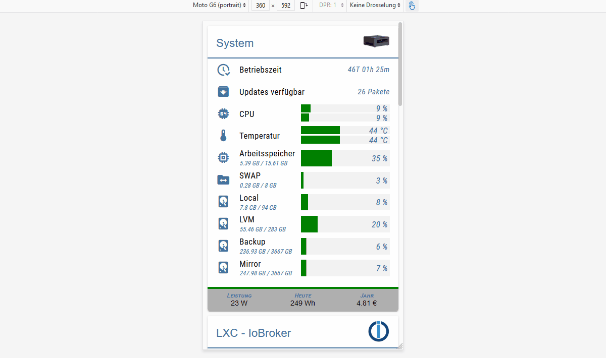

Masonry Views имеет несколько интегрированных `view in widget`, которые будут автоматически упорядочены в зависимости от ширины виджета. С помощью этого виджета можно создать адаптивный макет (один макет для рабочего стола, планшета и мобильного телефона).
Виды кладки особенно полезны, если они имеют разную высоту.

<b>Взгляните на [Пример проекта Material Design Widgets](https://github.com/Scrounger/ioBroker.vis-materialdesign#online-example-project),</b> чтобы понять, как это работает.

#### Настройки редактора
<table><thead><tr><th>Снимок экрана</th><th> Настройка</th><th> Описание </th></tr></thead><tbody><tr><td rowspan=1></td><td colspan=2>В зависимости от ширины виджета можно установить количество столбцов и расстояние между представлениями. Настройки можно установить независимо для книжного и альбомного формата. Чтобы узнать ширину разрешения для разных устройств, активируйте Помощник по разрешению в общих настройках.</td></tr><tr><td rowspan=2></td><td> ширина обзора [x]</td><td> Определите ширину представления. Допустимые значения: число, пиксели,% или вычисление. Примеры: <code>100</code> , <code>100</code> <code>100px</code> , <code>55%</code> , <code>calc(60% - 12px)</code></td></tr><tr><td> высота обзора [x]</td><td> Здесь вы можете указать высоту используемого вида.<br><br> Если вы хотите, чтобы высота изменялась в зависимости от вида, то этот ввод должен быть пустым, а для виджета с наибольшей высотой в представлении положение должно быть установлено относительным, см. Снимок экрана:<br><br></td></tr></tbody></table>

### Виды сетки


Grid Views имеет несколько интегрированных `view in widget`, которые будут автоматически упорядочены в зависимости от ширины виджета. С помощью этого виджета можно создать адаптивный макет (один макет для рабочего стола, планшета и мобильного телефона).
Виды сетки особенно полезны, если включенные виды имеют одинаковую высоту.

<b>В виджете Grid View всего 12 столбцов. Если вы хотите, чтобы представление имело ширину 4 столбца, вы должны установить для диапазона столбцов значение 4 в соответствующем представлении [x]</b>

<b>Взгляните на [Пример проекта Material Design Widgets](https://github.com/Scrounger/ioBroker.vis-materialdesign#online-example-project),</b> чтобы понять, как это работает.

#### Настройки редактора
<table><thead><tr><th>Снимок экрана</th><th> Настройка</th><th> Описание </th></tr></thead><tbody><tr><td rowspan=1>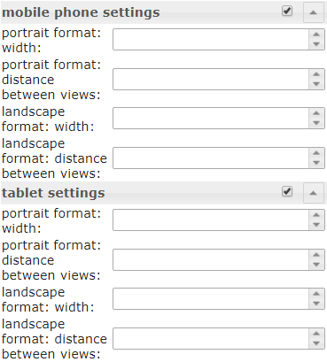</td><td colspan=2> В зависимости от ширины виджета определяется, от какой ширины виджета могут применяться правила для диапазона столбцов отдельных представлений [x], а также расстояние между представлениями. Настройки можно установить независимо для книжного и альбомного формата. Чтобы узнать ширину разрешения для разных устройств, активируйте Помощник по разрешению в общих настройках.</td></tr><tr><td rowspan=2></td><td colspan=2> Определите диапазон столбцов представления в зависимости от текущего правила разрешения ширины.<br> Вы также можете указать здесь, должно ли представление отображаться только с разрешением выше или ниже заданного значения или оно должно быть видимым через идентификатор объекта.</td></tr><tr><td> высота обзора [x]</td><td> Здесь вы можете указать высоту используемого вида.<br><br> Если вы хотите, чтобы высота изменялась в зависимости от вида, то этот ввод должен быть пустым, а для виджета с наибольшей высотой в представлении положение должно быть установлено относительным, см. Снимок экрана:<br><br></td></tbody></table>

## Оповещения
Виджет предупреждений можно использовать, например, для отображения сообщений в VIS, как это работает с адаптером pushover, но непосредственно в VIS.

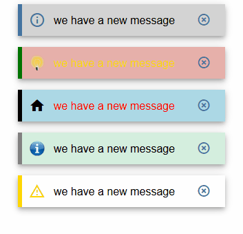

### Настройки редактора
Настройки, не перечисленные в таблице ниже, не требуют пояснений.

<table><thead><tr><th>Снимок экрана</th><th> Настройка</th><th> Описание</th></tr></thead><tbody><tr><td rowspan=3></td><td> Число столбцов</td><td> определить количество столбцов</td></tr><tr><td> ID объекта</td><td> Объект должен быть строкой json. Допустимые свойства описаны ниже</td></tr><tr><td> Максимум. Оповещения</td><td> максимальное количество предупреждений, которые должны отображаться.</td></tr></tbody></table>

### Свойства Datapoint JSON
<table><thead><tr><th>Свойство</th><th> Описание</th><th> Тип</th><th> Ценности</th></tr></thead><tbody><tr><td> текст</td><td> текст пункта меню</td><td> строка</td><td></td></tr><tr><td> фоновый цвет</td><td> цвет фона элемента предупреждения</td><td> строка</td><td> шестнадцатеричный (# 44739e), RGB (20, 50, 200), RGBA (20, 50, 200, 0,5)</td></tr><tr><td> цвет границы</td><td> цвет границы элемента предупреждения</td><td> строка</td><td> шестнадцатеричный (# 44739e), RGB (20, 50, 200), RGBA (20, 50, 200, 0,5)</td></tr><tr><td> икона</td><td> значок материального дизайна или путь к изображению для пункта меню</td><td> строка</td><td/></tr><tr><td> iconColor</td><td> Цвет значка материального дизайна</td><td> строка</td><td> шестнадцатеричный (# 44739e), RGB (20, 50, 200), RGBA (20, 50, 200, 0,5)</td></tr><tr><td> Цвет шрифта</td><td> цвет шрифта элемента предупреждения</td><td> строка</td><td> шестнадцатеричный (# 44739e), RGB (20, 50, 200), RGBA (20, 50, 200, 0,5)</td></tr></tbody></table>

<! - опустить в toc ->

#### Свойства JSON Datapoint - пример
<details>

```
[
       {
		"text": "we have a new message",
		"backgroundColor": "",
		"borderColor": "darkred",
		"icon": "message-alert-outline",
		"iconColor": "darkred",
		"fontColor": "blue"
	}, {
		"text": "we have a new message",
		"backgroundColor": "#e6b0aa",
		"borderColor": "green",
		"icon": "/vis/img/bulb_on.png",
		"iconColor": "green",
		"fontColor": "gold"
	}, {
		"text": "we have a new message",
		"backgroundColor": "",
		"borderColor": "gold",
		"icon": "alert-outline",
		"iconColor": "gold",
		"fontColor": ""
	}
]
```

</details>

### Скрипт: отправить оповещение виджету
С помощью следующего сценария вы можете отправлять простые сообщения в точку данных, которая используется виджетом предупреждений.
Скрипт необходимо поместить в глобальные скрипты. Затем можно отправить сообщение с помощью следующей команды

`materialDesignWidgets.sendTo('datapoint_id', 'message', 'color');`

```


var materialDesignWidgets = {};
materialDesignWidgets.sendTo = function (id, text, backgroundColor = '', borderColor = '', icon = '', iconColor = '', fontColor = '') {
    let json = getState(id).val;

    if (json) {
        try {

            json = JSON.parse(json);

        } catch (e) {
            json = [];
            console.warn('Wert ist kein JSON string! Wert wird ersetzt!');
        }
    } else {
        json = [];
    }

    json.push(
        {
            text: text,
            backgroundColor: backgroundColor,
            borderColor: borderColor,
            icon: icon,
            iconColor: iconColor,
            fontColor: fontColor
        }
    )
    setState(id, JSON.stringify(json), true);
}
```

## Календарь
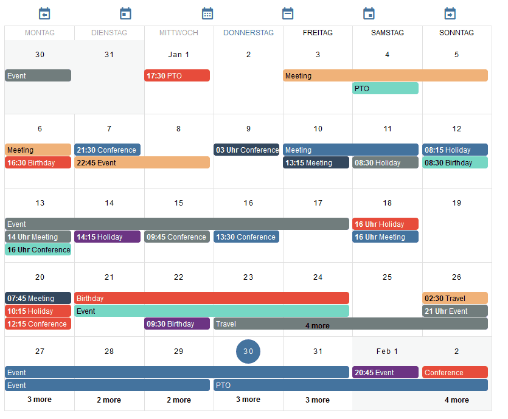

### Настройки редактора
Настройки, не перечисленные в таблице ниже, не требуют пояснений.

<table><thead><tr><th>Снимок экрана</th><th> Настройка</th><th> Описание</th></tr></thead><tbody><tr><td rowspan=1></td><td> Идентификатор объекта</td><td> идентификатор точки данных. Datapoint должен содержать строку json. Допустимые свойства json описаны ниже.</td></tr><tr><td rowspan=2></td><td> дни недели, которые будут показаны</td><td> Указывает, какие дни недели отображать. Для отображения только с понедельника по пятницу можно использовать значения <code>1, 2, 3, 4, 5</code> . Для отображения недели, начинающейся с понедельника, можно использовать значение <code>1, 2, 3, 4, 5, 6, 0</code> .</td></tr><tr><td> ID объекта</td><td> Объект должен быть строкой json, которая должна быть структурирована, как описано выше.</td></tr><tr><td rowspan=2></td><td> час начала</td><td> Час, с которого встречи должны отображаться в режиме просмотра недели и дня.</td></tr><tr><td> конец часа</td><td> Час, до которого встречи должны отображаться в режиме просмотра недели и дня</td></tr><tr><td rowspan=2></td><td colspan=2> Отменить форматы даты по умолчанию. Допустимые форматы описаны в документации <a href="https://momentjs.com/docs/#/displaying/">momentjs.</a></td></td></tr></tbody></table>

### Свойства Datapoint JSON
<table><thead><tr><th>Свойство</th><th> Описание</th><th> Тип</th><th> Ценности</th></tr></thead><tbody><tr><td> имя</td><td> название мероприятия</td><td> строка</td><td></td></tr><tr><td> цвет</td><td> цвет фона события</td><td> строка</td><td> шестнадцатеричный (# 44739e), RGB (20, 50, 200), RGBA (20, 50, 200, 0,5)</td></tr><tr><td> colorText</td><td> цвет текста события</td><td> строка</td><td> шестнадцатеричный (# 44739e), RGB (20, 50, 200), RGBA (20, 50, 200, 0,5)</td></tr><tr><td> Начните</td><td> дата и время начала события. Для событий на весь день используйте только дату без времени.</td><td> строка</td><td> ГГГГ-ММ-ДД | ГГГГ-ММ-ДД ЧЧ: мм</td></tr><tr><td> конец</td><td> дата и время окончания события. Для событий на весь день используйте только дату без времени</td><td> строка</td><td> ГГГГ-ММ-ДД | ГГГГ-ММ-ДД ЧЧ: мм</td></tr></tbody></table>

<! - опустить в toc ->

#### Свойства JSON Datapoint - пример
<details>

```
[
	{
		"name": "Event",
		"color": "#e74c3c",
		"colorText": "#FFFFFF",
		"start": "2020-01-24",
		"end": "2020-01-26"
	},
	{
		"name": "Meeting",
		"color": "#717d7e",
		"colorText": "#FFFFFF",
		"start": "2020-03-23 16:00",
		"end": "2020-03-24 17:15"
	}
]
```

</details>

### Скрипт: ical преобразование
Если вы хотите использовать виджет с [ical адаптер](https://github.com/iobroker-community-adapters/ioBroker.ical), вы можете использовать следующий сценарий для преобразования объекта ical для работы с виджетом.

<details>

```
// momentjs is required as dependecies in javascript adapter
const moment = require("moment");

var instances = $(`[id=ical.*.data.table]`);
instances.on(ical2CalendarWidget);

// remove this, if you know to use your own datapoint
let datapointId = 'materialdesignwidgets.calendar.ical2calendar'
createState(datapointId, "[]", {
  read: true,
  write: false,
  desc: "JSON String for Calendar Widget",
  type: "string",
  def: "[]"
});

function ical2CalendarWidget() {
    try {
        let calList = [];

        for (var inst = 0; inst <= instances.length - 1; inst++) {
            let icalObj = getState(instances[inst]).val;

            if (icalObj) {
                for (var i = 0; i <= icalObj.length - 1; i++) {
                    let item = icalObj[i];

                    // extract calendar color
                    let calendarName = item._class.split(' ')[0].replace('ical_', '');

                    let startTime = moment(item._date);
                    let endTime = moment(item._end);

                    let start = startTime.format("YYYY-MM-DD HH:mm");
                    let end = endTime.format("YYYY-MM-DD HH:mm");

                    if (startTime.format('HH:mm') === '00:00' && endTime.format('HH:mm') === '00:00') {
                        // is full-day event
                        if (endTime.diff(startTime, 'hours') === 24) {
                            // full-day event, one day
                            start = startTime.format("YYYY-MM-DD");
                            end = startTime.format("YYYY-MM-DD");
                        } else {
                            // full-day event, multiple days
                            start = startTime.format("YYYY-MM-DD");
                            end = endTime.format("YYYY-MM-DD");
                        }
                    }

                    // create object for calendar widget
                    calList.push({
                        name: item.event,
                        color: getMyCalendarColor(calendarName),
                        colorText: getMyCalendarTextColor(calendarName),
                        start: start,
                        end: end
                    })
                }

                function getMyCalendarColor(calendarName) {
                    // assign colors via the calendar names, use calendar name as set in ical
                    if (calendarName === 'calendar1') {
                        return '#FF0000';
                    } else if (calendarName === 'calendar2') {
                        return '#44739e'
                    } else if (calendarName === 'calendar3') {
                        return '#32a852'
                    }
                }

                function getMyCalendarTextColor(calendarName) {
                    // assign colors via the calendar names, use calendar name as set in ical
                    if (calendarName === 'calendar1') {
                        return '#FFFFFF';
                    } else if (calendarName === 'calendar2') {
                        return '#FFFFFF'
                    } else if (calendarName === 'calendar3') {
                        return '#FFFFFF'
                    }
                }
            }

            // Enter the destination data point that is to be used as object ID in the widget
            setState(datapointId, JSON.stringify(calList), true);
        }
    } catch (e) {
        console.error(`ical2MaterialDesignCalendarWidget: message: ${e.message}, stack: ${e.stack}`);
    }
}

ical2CalendarWidget();
```

</details>

## Диалог


### Настройки редактора
Настройки, не перечисленные в таблице ниже, не требуют пояснений.

<table><thead><tr><th>Снимок экрана</th><th> Настройка</th><th> Описание </th></tr></thead><tbody><tr><td rowspan=3>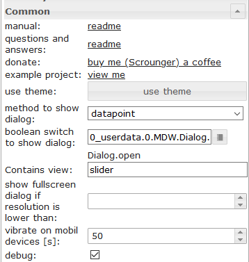</td><td> способ показать диалог</td><td> показать диалог с помощью кнопки или с помощью точки данных (тип логический)</td></tr><tr><td> Вид Конатина</td><td> вид, который должен отображаться в диалоговом окне</td></tr><tr><td> показать полноэкранный диалог, если разрешение ниже, чем</td><td> Показать полноэкранный диалог, если разрешение ниже заданного значения.</td></tr></tbody></table>

## HTML-виджеты
Создайте виджет html из поддерживаемых виджетов Material Design, чтобы использовать его в любом другом виджете, поддерживающем html.
Просто создайте стиль своего виджета Material Design, нажмите `generate Html Element`, скопируйте данные и вставьте их в любой виджет, поддерживающий теги HTML.
Или используйте его в скриптах для динамической генерации виджетов.

> Внимание:> *атрибуты тегов html должны быть окружены `'` (одинарная кавычка)>* двойные кавычки `"`, используемые в атрибутах, должны быть экранированы, как `\"`§>> сравните это с показанными примерами различных виджетов

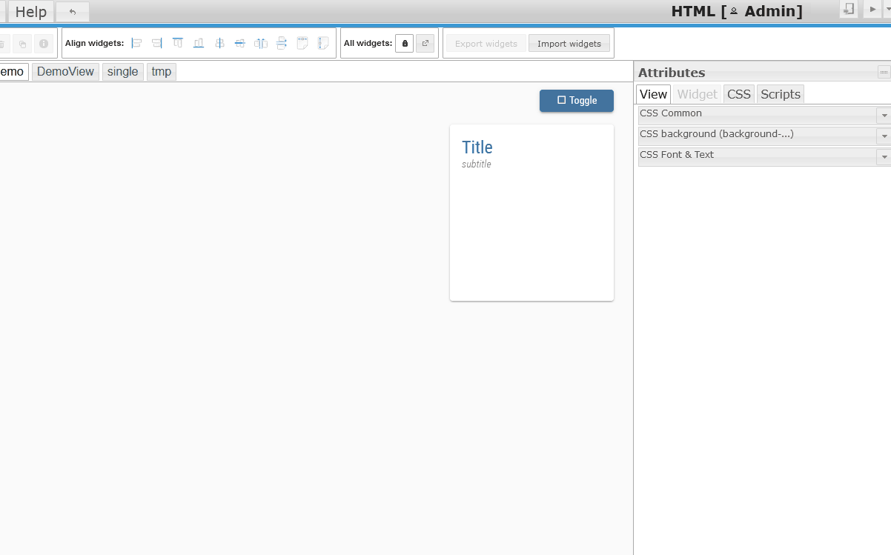

Более подробную информацию о поддерживаемых свойствах можно найти в отдельных виджетах:

* [Кнопки] (# кнопки)
* [Кнопки по вертикали] (# кнопки по вертикали)
* [Значок кнопок] (# кнопки-значок)

*

* [Слайдер] (# слайдер)

*

* [Прогресс] (# прогресс)
* [Информационный бюллетень] (# информационный проспект)

*

* [Флажок] (Флажок #)
* [Switch] (переключатель #)

# Использованные библиотеки
Адаптер использует следующие библиотеки:

* [Материальные компоненты Google для Интернета] (https://github.com/material-components/material-components-web)
* [Vuetify] (https://github.com/vuetifyjs/vuetify)
* [chartjs] (https://www.chartjs.org/)
* [круглый слайдер от thomasloven] (https://github.com/thomasloven/round-slider)
* [Значки дизайна материалов] (https://materialdesignicons.com/)

## Changelog

<!--
    Placeholder for the next version (at the beginning of the line):    
	### __WORK IN PROGRESS__
-->

<!-- omit in toc -->
### __WORK IN PROGRESS__
* (Scrounger) HTML Widgets added - use Material Design Widgets in any html element
* (Scrounger) Table: Control Elements removed, using new HTML Widgets -> breaking changes !!!
* * (Scrounger) list: using object id for json string added -> breaking changes !!!
* (Scrounger) new Value Widget added
* (Scrounger) Card layout bug fixes for HTML Card, IconList, List and Table Widget
* (Scrounger) icon list: option for status bar text added
* (Scrounger) icon list: status bar position bug fix
* (Scrounger) progress circular: auto size option added
* (Scrounger) VIS editor: html previews bug fixes
* (Scrounger) input, autocomplete, select: autofocus option added
* (Scrounger) Documentation revised
* (Scrounger): bug fixes

<!-- omit in toc -->
### 0.4.2 (2020-12-29)
* (Scrounger) vis-google-fonts dependency removed

<!-- omit in toc -->
### 0.4.1 (2020-12-27)
* (Scrounger): Adapter settings: theme editor implementation completed
* (Scrounger): Progress Widget: condition binding bug fix
* (Scrounger): minimal VIS adapter dependency set to v1.3.6
* (Scrounger): VIS editor: image dialog bug fix
* (Scrounger): Color themes for buttons and dialogs widgets implemented
* (Scrounger): Calendar Widget: week number bug fix
* (Scrougner): icon list: scrollbar bug fix
* (Scrounger): bug fixes

<!-- omit in toc -->
### 0.4.0-beta (2020-12-09)
* (Scrounger): Line History Chart Widget: Breaking Changes !!! aggregate (display) method for every dataset configurable, [see documentation for detailed infos](#line-history-chart)!
* (Scrounger): TopAppBar Widget: Breaking Changes !!! Submenus must now be created using JSON string, [see documentation for detailed infos](#since-version-040)!
* (Scrounger): Adapter settings wiht theme editor added
* (Scrounger): bug fix for compatibility issues with other widget adapters
* (Scrounger): Chechbox Widget: option for border and hover color added
* (Scrounger): Chechbox Widget: ripple effect bug fix
* (Scrounger): Buttons Vertical: text alignment option added
* (Scrounger): added URL support as source for symbols / images
* (Scrounger): HTML Card Widget: option to hide title, subtitle and text added
* (Scrounger): HTML Card Widget: background image refresh options by datapoint added
* (Scrounger): Fixed some errors reported via Sentry
* (Scrounger): Select & Autocomplete Widget: overriding icon color bug fix
* (Scrounger): Select & Autocomplete Widget: overriding icon bug fix
* (Scrounger): Select & Autocomplete Widget: colors bug fixes
* (Scrounger): Select & Autocomplete Widget: option to override the icon color of textfield for selected menu icon
* (Scrounger): Select & Autocomplete Widget: text alignment option added
* (Scrounger): Input Widget: text alignment option added
* (Scrounger): JSON Chart Widget: option to force x-axis time unit added
* (Scrounger): JSON Chart Widget: gradient colors for multipe dataset bug fixes
* (Scrounger): JSON Chart: default tooltip title added
* (Scrounger): JSON Chart: option to use Today / Yesterday for x-axis labeling added
* (Scrounger): JSON Chart: option to use Today / Yesterday for tooltip added
* (Scrounger): JSON Chart: option to change x-axis label distance added
* (Scrounger): Line History Chart: option for point color added
* (Scrounger): Line History Chart: option to use Today / Yesterday for x-axis labeling added
* (Scrounger): Line History Chart: option to use Today / Yesterday for tooltip added
* (Scrounger): Line History Chart: tooption change x-axis label distance added
* (Scrounger): Charts Widget: x-Axis time axis bug fixes
* (Scrounger): Calendar Widget: option to show calendar week numbers in month view added
* (Scrounger): Calendar Widget: option for custom date format added
* (Scrounger): IconList Widget: bug fix for performance issue
* (Scrounger): TopAppBar Widget: options for user groups added
* (Scrounger): Table Widget: html element added
* (Scrounger): Masonry & Grid View Widget: default width for handy portrait and landscape view changed
* (Scrounger): Progress Widget: option for indeterminate style added
* (Scrounger): dependencies updated
* (Scrounger): bug fixes

<!-- omit in toc -->
### 0.3.19 (2020-07-18)
* (Scrounger): Icon Button Widget: background color option for lock icon added
* (Scrounger): possibility to deactivate sentry implemented -> see documentation
* (Scrounger): Fixed some bugs reported via Sentry
* (Scrounger): prevent set value in vis editor
* (Scrounger): Grid & Mansonry Widget: visibilty by resoltuin bug fix
* (Scrounger): IconList Widget: Card Background for whole icon list added
* (Scrounger): Table Wigdet: button link widget added
* (Scrounger): Table Wigdet: material design icon widget added
* (Scrounger): Table Wigdet: alignment option for controls added
* (Scrounger): materialdesignicons library updated to v5.3.45
* (Scrounger): Round Slider lib updated to v0.5.0
* (Scrounger): Round Slider Widget: readonly option added
* (Scrounger): Table Widget: background color hover option added
* (Scrounger): bug fixes

## License

MIT License

Copyright (c) 2021 Scrounger <scrounger@gmx.net>

Permission is hereby granted, free of charge, to any person obtaining a copy
of this software and associated documentation files (the "Software"), to deal
in the Software without restriction, including without limitation the rights
to use, copy, modify, merge, publish, distribute, sublicense, and/or sell
copies of the Software, and to permit persons to whom the Software is
furnished to do so, subject to the following conditions:

The above copyright notice and this permission notice shall be included in all
copies or substantial portions of the Software.

THE SOFTWARE IS PROVIDED "AS IS", WITHOUT WARRANTY OF ANY KIND, EXPRESS OR
IMPLIED, INCLUDING BUT NOT LIMITED TO THE WARRANTIES OF MERCHANTABILITY,
FITNESS FOR A PARTICULAR PURPOSE AND NONINFRINGEMENT. IN NO EVENT SHALL THE
AUTHORS OR COPYRIGHT HOLDERS BE LIABLE FOR ANY CLAIM, DAMAGES OR OTHER
LIABILITY, WHETHER IN AN ACTION OF CONTRACT, TORT OR OTHERWISE, ARISING FROM,
OUT OF OR IN CONNECTION WITH THE SOFTWARE OR THE USE OR OTHER DEALINGS IN THE
SOFTWARE.