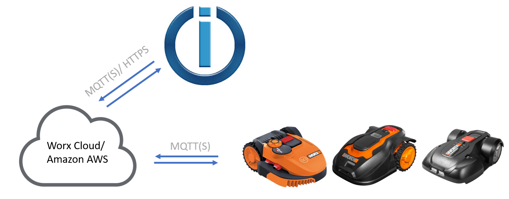

[![ТЕСТЫ] (https://github.com/iobroker-community-adapters/ioBroker.worx/workflows/Test%20and%20Release/badge.svg)](https://github.com/iobroker-community-adapters/ioBroker.worx/commits/master)

# IoBroker.worx
## Адаптер Worx (Kress и Landxcape) для ioBroker
управление через облако и mqtt

Этот адаптер соединяет ioBroker с вашей косилкой Landroid Kress или Landxcape через облако.
Температура, время кошения, уровень заряда батареи и другие данные считываются с косилки.
Адаптер может управлять косилкой, и вы можете изменять параметры конфигурации, такие как время работы.

## Настройки
- для подключения к газонокосилке введите адрес электронной почты и пароль от вашей учетной записи worx в Config.
- Задержка для обрезки кромки: если обрезка кромки начинается с поворота или изгиба, газонокосилка может потерять проволоку и остановиться из-за неисправности, или лезвия могут не вращаться. Для этого можно установить начальную точку, в которой лопасти начинают вращаться.

## Changelog
### 1.2.4 (15.11.2020)
* (MeisterTR) Bugfix (error type of sc...)
* (MeisterTR) change Testing to git
### 1.2.3 (29.08.2020)
* (MeisterTR) add option to crate a Json Obj to set mowtime with scripts 
* (MeisterTR) add option to disable weather
* (MeisterTR) add double Shedule, oneTimeShedule, PartyMode
* (MeisterTR) fix setIntervall => setTimeout
* (MeisterTR) fix error with Meter and Min. in Config
* (MeisterTR) add Kress and Landxcape
### 1.0.0 (03.12.2019)
* (MeisterTR) bump Version
* (MeisterTR) transfer to community
### 0.4.0 (03.08.2019)
* (MeisterTR) fix multimower
* (MeisterTR) change loglevel
* (MeisterTR) fix online Status

### 0.3.1 (12.06.2019)
* (MeisterTR) add delay for edgecut in config
* (MeisterTR) fix mowtime error

### 0.2.0 (01.06.2019)
* (MeisterTR) add border
* (MeisterTR) fix small errors
* (MeisterTR) code cleanup
### 0.0.1
* (MeisterTR) initial release

## License
MIT License

Copyright (c) 2020 MeisterTR

Permission is hereby granted, free of charge, to any person obtaining a copy
of this software and associated documentation files (the "Software"), to deal
in the Software without restriction, including without limitation the rights
to use, copy, modify, merge, publish, distribute, sublicense, and/or sell
copies of the Software, and to permit persons to whom the Software is
furnished to do so, subject to the following conditions:

The above copyright notice and this permission notice shall be included in all
copies or substantial portions of the Software.

THE SOFTWARE IS PROVIDED "AS IS", WITHOUT WARRANTY OF ANY KIND, EXPRESS OR
IMPLIED, INCLUDING BUT NOT LIMITED TO THE WARRANTIES OF MERCHANTABILITY,
FITNESS FOR A PARTICULAR PURPOSE AND NONINFRINGEMENT. IN NO EVENT SHALL THE
AUTHORS OR COPYRIGHT HOLDERS BE LIABLE FOR ANY CLAIM, DAMAGES OR OTHER
LIABILITY, WHETHER IN AN ACTION OF CONTRACT, TORT OR OTHERWISE, ARISING FROM,
OUT OF OR IN CONNECTION WITH THE SOFTWARE OR THE USE OR OTHER DEALINGS IN THE
SOFTWARE.