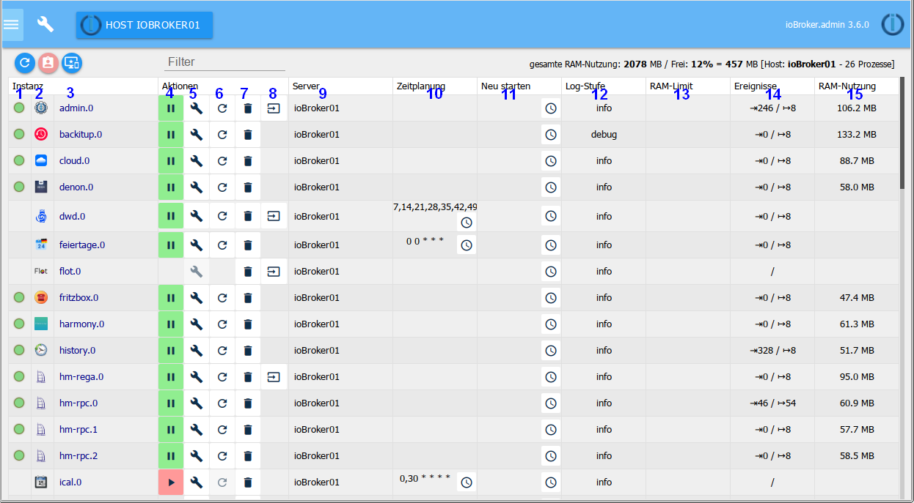

# Окно экземпляра
?> ***Это подстановочный знак*** .    Помогите с ioBroker и расширьте эту статью. Пожалуйста, обратите внимание на [Руководство по стилю ioBroker](community/styleguidedoc), чтобы изменения могли быть легко приняты.

# Экземпляры на вкладке
Здесь перечислены экземпляры, уже установленные через вкладку Адаптер, и их можно настроить соответствующим образом.

## Строка заголовка
Строка заголовка содержит значки для наиболее важных процессов. Для каждой иконки есть контекстная помощь. Просто держите мышь на значке некоторое время. Также есть информация о загрузке сервера

Иконы в деталях:

** 1.) Обновление вида **

Если только что созданные экземпляры не отображаются, нажатие на этот значок поможет обновить состояние страницы.

** 2.) Включите режим администратора **

Когда выбран этот значок, отображаются дополнительные столбцы для настройки экземпляров (функция переключения). Смотрите содержание страницы для получения дополнительной информации.

** 3.) Показать только экземпляры выбранного хоста **

В системах с несколькими хостами экземпляры всех хостов управляются администратором мастера. Информация о том, на каком хосте этот экземпляр находится в столбце ***Сервер***

Если в заголовке выбран хост, эту кнопку можно использовать только для отображения установленных там экземпляров.

** 4.) Фильтр **

В этом поле вы можете ввести термин для фильтрации или поиска экземпляров.

## Дополнительная информация в окне Экземпляры
Первые числа обозначают память, использованную экземплярами, и оставшуюся свободную память в МБ. За этим свободная память в%. Квадратные скобки содержат имя сервера ioBroker и количество запущенных процессов.

## Содержание страницы

На странице установленные экземпляры адаптеров представлены в виде таблицы.

Таблица состоит из следующих столбцов:

** 1.) Состояние **

Здесь состояние экземпляра отображается на светофоре. Дальнейшая информация получается при наведении мышкой на сигнал.

Не во всех случаях есть этот светофор. Это не повод для паники. Это либо синхронизированные экземпляры, которые подключаются к контроллеру только на короткое время, а затем немедленно отключаются, либо выключаются, например. продолжать работать в фоновом режиме.

** 2.) Значок **

Это покажет значок, используемый ioBroker-широкий для этого адаптера

** 3.) Экземпляр **

Этот столбец содержит имя экземпляра. он состоит из имени адаптера, а также номера, который последовательно нумеруется в порядке установки экземпляров. Первый экземпляр получает

0. Это имя является основой для именования точек данных в ioBroker.

** 4.) активирован **

Здесь экземпляр запускается или останавливается. Зеленый знак паузы указывает, что адаптер работает и его можно приостановить, щелкнув по нему, а красный знак воспроизведения показывает остановленный экземпляр, который можно запустить одним щелчком мыши.

** 5.) Конфигурация **

При щелчке по этому значку открывается меню конфигурации адаптера. Соответствующие меню описаны в соответствующих адаптерах.

** 6.) Перезагрузка **

Нажмите на этот значок, чтобы перезапустить соответствующий экземпляр

** 7.) Мусорный бак **

Этот значок удаляет соответствующий экземпляр. Другие экземпляры того же адаптера сохраняются. Даже сам адаптер остается.

** 8.) Веб-ссылка **

За этим значком скрывается ссылка на сайт данного экземпляра. Либо потому, что этот адаптер поставляется с собственным веб-интерфейсом (с другим портом), либо просто с другим путем. Отчасти эта ссылка также ведет на страницы справки.

** 9.) Название **

Здесь дано имя экземпляра. Это имя может быть изменено в соответствии с вашими пожеланиями или потребностями. Это особенно полезно, если есть несколько экземпляров адаптера (с другим именем). Это будет, например, для hm-rpc, если есть один экземпляр для RF, Wired и CuxD.

** 10.) Планирование **

Для адаптеров, которые запускаются по расписанию, вы будете введены здесь, когда этот адаптер должен запуститься. Это планирование в формате cronjobs. Для изменения нажмите на кнопку с тремя точками. Он открывает окно ввода с большим количеством дополнительной информации и помощи.

** 11.) Перезагрузка **

Значок часов также можно использовать для создания расписания, когда этот экземпляр следует перезапустить.

Этот столбец виден только в экспертном режиме!

** 12.) Уровень журнала **

В этом столбце можно настроить соответствующий уровень журнала для экземпляра. Доступны отладка, информация, предупреждение и ошибка. По умолчанию это значение установлено в info. Если у вас сложилось впечатление, что что-то идет не так, вы можете отладить его. затем в журнале вкладок для этого экземпляра также выводится отладочная информация, которая может помочь найти ошибку. И наоборот, вы можете установить это значение выше, чтобы журнал не был настолько обширным.

Этот столбец виден только в экспертном режиме!

** 13.) ограничение ОЗУ **

Здесь вы можете указать, сколько памяти экземпляра должно быть предоставлено в качестве меры предосторожности. Этот объем памяти больше не будет доступен для других задач и не должен быть слишком высоким, особенно для систем с нехваткой памяти. Если экземпляру временно требуется больше памяти, он, конечно, будет выделен системой, но будет немедленно возвращен обратно в систему. В то время, когда экземпляру требуется больше памяти, чем было зарезервировано, требуемая память отображается красным цветом.

Этот столбец виден только в экспертном режиме!

** 14.) Использование ОЗУ **

Это показывает фактическую память, используемую экземпляром. Эти значения регулярно обновляются. После обновления эти значения кратковременно отображаются зеленым цветом.