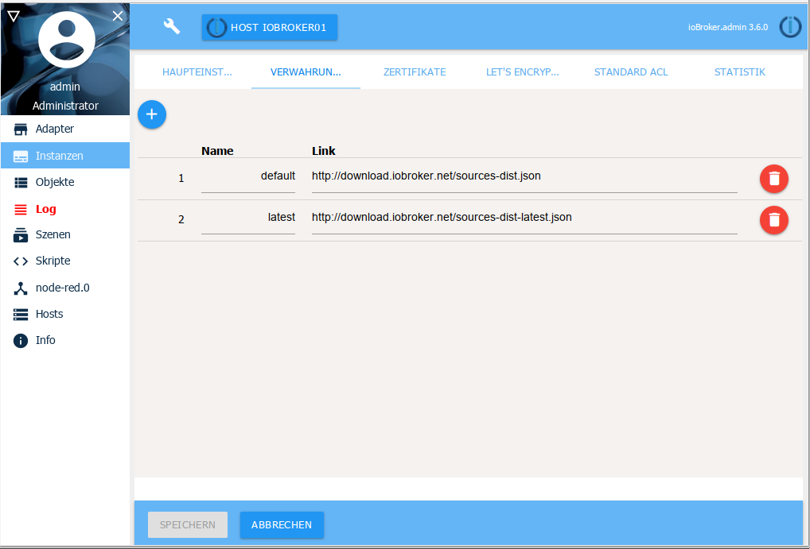
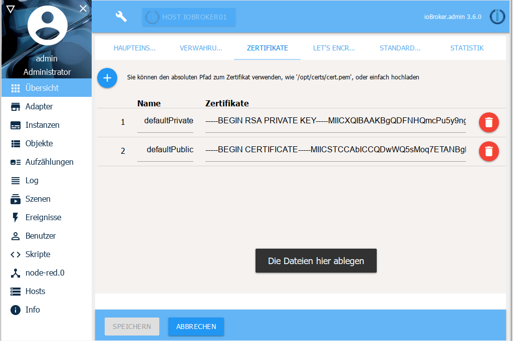
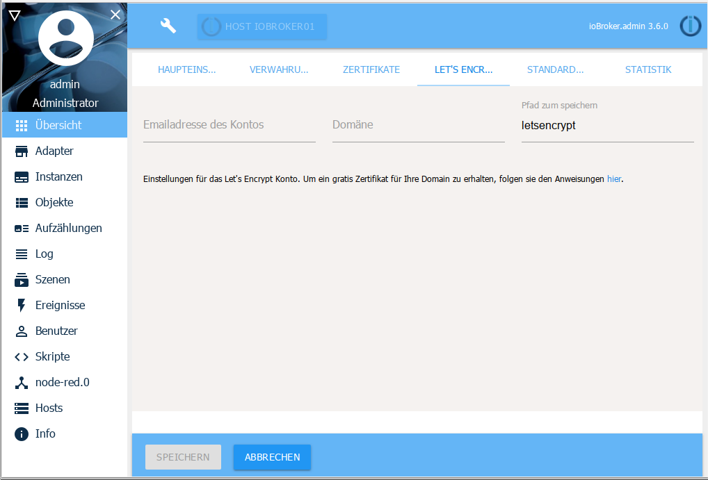
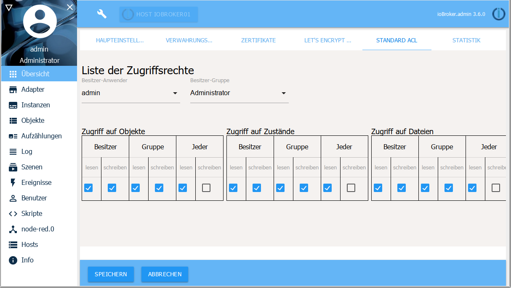
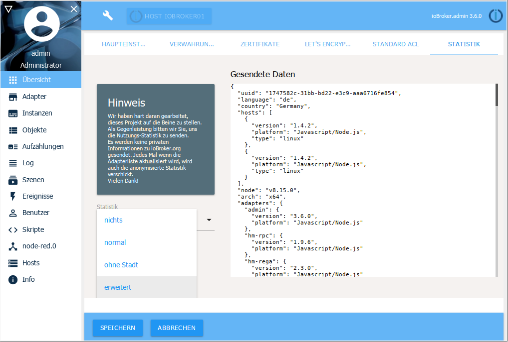

# Системные настройки
Доступ к системным настройкам можно получить из любого пункта меню администратора через значок гаечного ключа в строке заголовка экрана.

Системные настройки распределены по нескольким подстраницам:

## Основные настройки
В основных настройках задаются основные параметры для ioBroker, которые также используются адаптерами в ioBroker.

Некоторые параметры уже взяты из настроек хоста.

** Системный язык **

так что вы можете выбирать между разными языками системы. Возможно, еще не все языки полностью поддерживаются.

** единица измерения температуры **

это значение используется некоторыми адаптерами. °C или °F возможны.

**Валюта**

На данный момент не использует адаптер

** Формат даты **

выберите способ отображения даты в админке и вис.

** десятичный разделитель **

Запятая или точка для значений с плавающей запятой

** Стандартный экземпляр истории **

В этом случае данные по умолчанию регистрируются и используются в графиках флота и рикши.

Если установлен только один адаптер истории (SQL / History / InfluxDB), он используется; если их несколько, можно выбрать один.

** Действующий депозитарий **

Желаемый репозиторий, из которого должна быть установлена версия адаптера, выбирается в раскрывающемся меню. Репозитории, перечисленные на подстранице «Места хранения», доступны в раскрывающемся меню.

## Места хранения

ioBroker может получить список адаптеров из разных источников. При установке вводятся следующие источники:

* по умолчанию (= стабильный): http://download.iobroker.net/sources-dist.json
* последняя (= бета): http://download.iobroker.net/sources-dist-latest.json

Если сюда вводятся другие репозитории из более старой установки, их следует удалить, поскольку они больше не обслуживаются.

## Сертификаты

Это центральная точка для сертификатов, которые используются для связи SSL / HTTPS. Сертификаты используются admin, web, simple-api, socketio. Стандартные сертификаты устанавливаются по умолчанию. С ним ничего не сверишь. Они используются только для связи SSL. Поскольку сертификаты открыты, вы должны использовать свои собственные (самозаверяющие) сертификаты, покупать настоящие сертификаты или перейти на Let's Encrypt. Связь с сертификатами по умолчанию небезопасна, и если кто-то хочет прочитать трафик, это можно сделать. Обязательно установите собственные сертификаты.
Например. под linux.

Сертификаты можно указать как путь или полностью загрузить с помощью перетаскивания

## Let's Encrypt

Let's Encrypt - это бесплатный автоматизированный центр сертификации с открытым исходным кодом, созданный независимой исследовательской группой Internet Security (ISRG).

Для получения дополнительной информации о Let's Encrypt см. [Вот](https://letsencrypt.org/).

В некоторых установках используется динамический DNS или аналогичный. чтобы получить доступ к вашему собственному домену через назначенный там адрес. ioBroker поддерживает автоматический запрос и обновление сертификатов в организации Let's Encrypt.

Возможность использовать бесплатные сертификаты от Let's Encrypt существует почти в каждом адаптере, который может запускать веб-сервер и поддерживает HTTPS.

Если вы активируете опцию использования сертификатов, но не автоматическое обновление, соответствующий экземпляр попытается работать с сохраненными сертификатами.

Если автоматические обновления активированы, экземпляр пытается запросить сертификаты у Let's Encrypt и обновляет их автоматически.

Сертификаты запрашиваются в первый раз, когда соответствующий адрес вызывается впервые. Т.е. если вы например «Sub.domain.com» настраивается как адрес, а затем вызывает https://sub.domain.com, сертификаты запрашиваются в первый раз, что может занять некоторое время, прежде чем придет ответ.

Выдача сертификатов - сложная процедура, но если вы будете следовать приведенным ниже объяснениям, получить бесплатные сертификаты будет легко.

** Метод: **

Должна быть создана новая учетная запись с введенным адресом электронной почты (настройка в настройках системы)

Генерируется случайный ключ в качестве пароля для учетной записи.

После создания учетной записи система открывает небольшой веб-сайт на 80-м порту для подтверждения адреса.

Давайте, шифрование всегда использует порт 80 для проверки адреса.

Если порт 80 уже используется другой службой, применяется пункт 4 - то есть назначить другой порт другой службе!

При запуске небольшого веб-сервера запрос сертификатов для адресов, указанных в настройках системы, отправляется на сервер Let's encrypt.

Сервер Let's Encrypt отправляет контрольную фразу в ответ на запрос и через некоторое время пытается прочитать эту контрольную фразу по адресу «http:// yourdomain: 80 / .well-known / acme-challenge /».

Когда сервер получает эту контрольную фразу с нашей стороны, сервер Let's Encrypt отправляет сертификаты. Они сохраняются в каталоге, указанном в системных настройках.

Это звучит сложно, но все, что вам нужно сделать, это установить несколько флажков и ввести адрес электронной почты и веб-адрес в настройках системы.

Полученные сертификаты действительны около 90 дней. После того, как эти сертификаты были выпущены в первый раз, запускается другая задача, которая автоматически продлевает срок действия.

Это довольно сложная тема, и тысячи вещей могут пойти не так. Если это не сработает, мы рекомендуем использовать адаптер IoT для доступа во время движения.

Let's Encrypt работает только с версией node.js> = 4.5

## Права доступа

На этой подстранице можно определить права доступа к различным областям для всех пользователей / групп.

## Статистика

Так что у нас есть краткий обзор установок (используемых адаптеров) и географического распределения, мы были бы очень рады, если бы получили эту информацию.

Вы можете отправлять разное количество информации. Этот прицел можно выбрать слева.

С правой стороны отображается точная форма, в которой отправляются эти данные.
Эти данные оцениваются абсолютно анонимно.