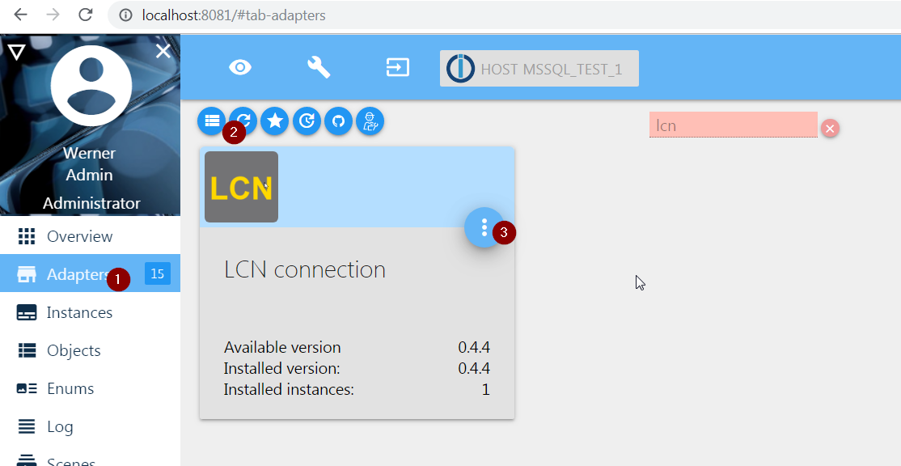
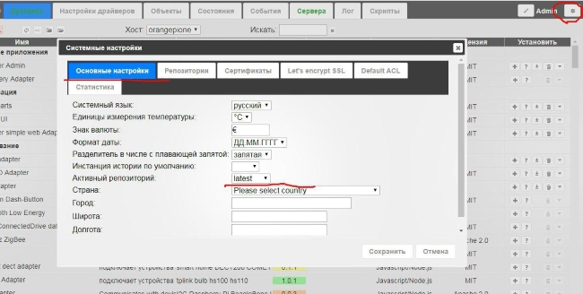

# Как включить последний репозиторий
Часто людей просят проверить версии, которые не видны в хранилище.
Очень вероятно, что речь идет о последних версиях адаптеров.

Мы не предлагаем использовать для неопытных пользователей последние версии адаптеров, поскольку они могут содержать ошибки и могут потребоваться откат.

В любом случае последняя версия может быть установлена следующим образом:

- В Системных настройках выберите последний репозиторий.

- После обновления в списке адаптеров будет видна самая новая версия.

## Для 2 версии адаптера admin.2.x.x

## Для 3 версии адаптера admin.3.x.x

