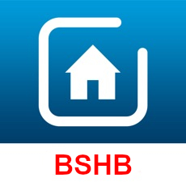

＃ioBroker.bshb
[![依赖状态]（https://david-dm.org/holomekc/iobroker.bshb.svg）](https://david-dm.org/holomekc/iobroker.bshb)

##适用于ioBroker的bosch-smart-home-bridge适配器
该适配器允许与Bosch Smart Home设备进行通信。

[博世智能家居控制器](https://www.bosch-smarthome.com/de/de/produkte/smart-system-solutions/smart-home-controller)

为此，它使用[博世智能家居桥](https://github.com/holomekc/bosch-smart-home-bridge)库，该库使用来自官方[博世智能家居控制器本地REST API](https://github.com/BoschSmartHome/bosch-shc-api-docs)的信息。

BSHB适配器的ioBroker论坛讨论：https://forum.iobroker.net/topic/25370/test-adapter-bshb-bosch-smart-home-v0-0-x/

工作正在进行中。反馈表示赞赏。

## Changelog

### 0.1.0
* (holomekc) certificate and private key are handled in ioBroker and can be content or file reference
* (holomekc) update to newer bridge version

### 0.0.14
* (holomekc) optimizations and cleanup

### 0.0.13
* (holomekc) added more definitions
* (holomekc) optimizations and cleanup

### 0.0.12
* (holomekc) scenario support. Scenarios are listed as group 'scenarios' and can only be triggered
* (holomekc) added definitions for Twinguard

### 0.0.11
* (holomekc) rooms and functions added for known channels
* (holomekc) trim whitespaces from configuration values

### 0.0.10
* (holomekc) try to improve configuration description in application itself
* (holomekc) change id so that it is valid regarding Bosch T&C
* (holomekc) update to newest bosch-smart-home-bridge version for same reason

### 0.0.9
* (holomekc) update travis.yml due to jscontroller requires node dependency >=8.0

### 0.0.8
* (holomekc) fix client name is: ioBroker.bshb

### 0.0.7
* (holomekc) make sure that bosch-smart-home-bridge version >= 0.0.4

### 0.0.6
* (holomekc) Just io-package.json changes
* (holomekc) cleanup

### 0.0.5
* (holomekc) Just do the steps adapter-check is telling me
* (holomekc) Therefore, build files are part of git repo. So install via Github should be possible now

### 0.0.4
* (holomekc) Long polling added to reduce load
* (holomekc) Set of state values is possible now
* (holomekc) Code cleanup

### < 0.0.4
* (holomekc) certificate generation added
* (holomekc) first attempts to creat ioBroker objects, states, etc.

## License

MIT License

Copyright (c) 2019 Christopher Holomek <holomekc.github@gmail.com>

Permission is hereby granted, free of charge, to any person obtaining a copy
of this software and associated documentation files (the "Software"), to deal
in the Software without restriction, including without limitation the rights
to use, copy, modify, merge, publish, distribute, sublicense, and/or sell
copies of the Software, and to permit persons to whom the Software is
furnished to do so, subject to the following conditions:

The above copyright notice and this permission notice shall be included in all
copies or substantial portions of the Software.

THE SOFTWARE IS PROVIDED "AS IS", WITHOUT WARRANTY OF ANY KIND, EXPRESS OR
IMPLIED, INCLUDING BUT NOT LIMITED TO THE WARRANTIES OF MERCHANTABILITY,
FITNESS FOR A PARTICULAR PURPOSE AND NONINFRINGEMENT. IN NO EVENT SHALL THE
AUTHORS OR COPYRIGHT HOLDERS BE LIABLE FOR ANY CLAIM, DAMAGES OR OTHER
LIABILITY, WHETHER IN AN ACTION OF CONTRACT, TORT OR OTHERWISE, ARISING FROM,
OUT OF OR IN CONNECTION WITH THE SOFTWARE OR THE USE OR OTHER DEALINGS IN THE
SOFTWARE.