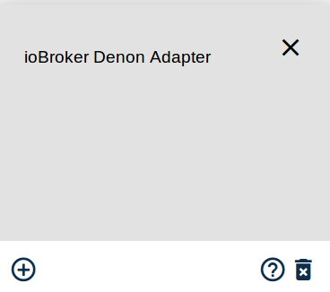

＃ioBroker.denon
===========================


##安装
您可以通过ioBroker Web界面安装适配器，也可以通过npm在本地计算机上安装适配器。

###基于浏览器
1.在浏览器中打开ioBroker Web界面（例如：192.168.30.70:8081）
2.单击选项卡“适配器”
3.在过滤器中键入“ Denon”
4.单击三个点，然后单击DENON AVR适配器的“ +”符号



###本地机器
浏览到iobroker文件夹并执行以下命令：

```bash
npm i iobroker.denon
```

＃＃ 设定
除了适配器安装之外，还必须确保正确配置了AVR。

### IoBroker
1.在浏览器中打开ioBroker界面（例如：192.168.1.33:8081）
2.导航至选项卡“适配器”
3.单击三个点，然后单击DENON AVR适配器的“ +”符号


4.现在，您可以看到适配器配置页面->输入DENON AVR的IP地址或单击搜索

图标以在您的网络中找到AVR（通过UPnP）

5.如果您还想调整请求/轮询间隔，请确保单击“高级设置”选项卡。

通过减少轮询间隔，适配器将减少更新显示内容之间的时间。
通过减少请求间隔，可以减少发送命令之间的时间。
默认设置应适合大多数用户。


6.单击保存并关闭

### AV接收机的网络设置
1.按SETUP（设置）按钮，然后菜单出现在FL-显示器（和GUI）上
2.选择“网络”->“设置”
3.设置如下所述的参数

   * DHCP：“ ON”（当DHCP服务器在本地网络上时使用此设置。）*

   * IP地址：<DHCP>设置为“关”时，请设置IP地址。*

   *子网掩码：当<DHCP>设置为“关”时，请设置子网掩码。*

   *网关：当网关位于本地网络上时，设置网关的地址。*

   *主DNS：请勿设置此参数。*

   *第二个DNS：请勿设置此参数。*

   *代理：将此参数设置为“关”。*

4.按SETUP按钮，然后菜单出现在FL显示屏（和GUI）上
5.选择“网络”->“网络控制/ IP控制”
6.将此参数设置为“ Always On”。

##用法
请注意，AVR只能管理单个telnet连接。如果您具有有效的telnet连接，则e。 G。使用javascript适配器，AVR将拒绝该适配器的连接。
在这里，您可以找到状态的描述以及如何使用它们。

＃＃＃ 纽扣
适配器创建以下按钮：

####频道：zoneMain / zone2 / zone3
* zoneMain.playPause

   *播放和暂停来自蓝牙，在线，USB / iPod来源的音乐。*

* zoneMain.play

   *播放来自蓝牙，在线，USB / iPod来源的音乐。

* zoneMain.pause

   *从蓝牙，在线，USB / iPod来源暂停音乐。*

* zoneMain.skipMinus

   *跳至上一个标题。*

   *不完全支持HEOS AVR'S *

* zoneMain.skipPlus

   *跳到下一个标题。*

   *不完全支持HEOS AVR'S *

* zoneMain.volumeDown / zone2.volumeDown / zone3.volumeDown

   *减少主要区域/区域2 /区域3的音量。*

* zoneMain.volumeUp / zone2.volumeUp / zone3.volumeUp

   *增加主要区域/区域2 /区域3的音量。*

* zoneMain.equalizerBassUp / zone2.equalizerBassUp / zone3.equalizerBassUp

   *增加区域低音等级的按钮。*

   *当Dyn EQ设置为OFF且Tone Control打开时，可以调节低音和高音设置*

* zoneMain.equalizerBassDown / zone2.equalizerBassDown / zone3.equalizerBassDown

   *降低区域低音等级的按钮。

   *当Dyn EQ设置为OFF且Tone Control打开时，可以调节低音和高音设置*

* zoneMain.equalizerTrebleUp / zone2.equalizerTrebleUp / zone3.equalizerTrebleUp

   *增加区域高音水平的按钮。*

   *当Dyn EQ设置为OFF且Tone Control打开时，可以调节低音和高音设置*

* zoneMain.equalizerTrebleDown / zone2.equalizerTrebleDown / zone3.equalizerTrebleDown

   *降低区域高音水平的按钮。*

   *当Dyn EQ设置为OFF且Tone Control打开时，可以调节低音和高音设置*

####频道：设置
* settings.subwooferLevelDown / settings.subwooferTwoLevelDown

   *通过按下按钮降低低音炮的音量。*

* settings.subwooferLevelUp / settings.subwooferTwoLevelUp

   *按一下按钮提高低音炮的音量。*

* settings.containmentAmountDown

   *减少Audyssey LFC数量。如果您的AVR支持该按钮，则只会创建该按钮。*

* settings.containmentAmountUp

   *增加Audyssey LFC数量。如果您的AVR支持该按钮，则只会创建该按钮。*

* settings.cursorUp / settings.cursorDown / settings.cursorLeft / settings.cursorRight

   *模拟遥控器的光标按钮*

* settings.enter

   *模拟遥控器的输入按钮*

* settings.return

   *模拟遥控器的返回/返回按钮*

* settings.option

   *模拟遥控器的选项按钮*

* settings.info

   *模拟遥控器的信息按钮*

＃＃＃ 状态
适配器将创建以下状态：

####频道：信息
*信息连接

    |数据类型|权限|
    |:---:|:---:|
    |布尔| R |

   *只读的布尔指标。如果您的经纪人连接到您的DENON AVR，则状态为true，否则为false。*

* info.friendlyName

    |数据类型|权限|
    |:---:|:---:|
    | string | R |

   *只读字符串。包含连接的AVR的友好名称。*

* info.onlinePresets

    |数据类型|权限|
    |:---:|:---:|
    | string | R |

* JSON数组格式的字符串，它通过ID和频道表示当前保存的收藏夹。
每个通道的名称限制为20位数字。您可以通过设置settings.savePreset将当前频道保存为一个ID，并通过将settings.loadPreset设置为相关ID来加载一个频道。*

####频道：zoneMain / zone2 / zone3
* zoneMain.volume / zone2.volume / zone3.volume

    |数据类型|权限|
    |:---:|:---:|
    |数字| R / W |

*数字值代表AVR的当前“主区域” /“区域2” /“区域3”音量。您也可以在此处设置音量。
在单独的状态下，音量也以dB表示。 G。 mainVolumeDB *

   *范围是0到98（可能会由于最大音量而降低），其中80 = 0 dB *

   *例：*

```javascript
setState('denon.0.zoneMain.volume', 45.5); // Sets volume of Main Zone to 45.5
```

* zoneMain.maximumVolume

    |数据类型|权限|
    |:---:|:---:|
    | number | R |

   *只读数字，表示最大可能的音量，其中80 = 0 dB。在maximumVolumeDB状态下，音量也以dB为单位设置。*

* zoneMain.muteIndicator / zone2.muteIndicator / zone3.muteIndicator

    |数据类型|权限|
    |:---:|:---:|
    | boolean | R / W |

   *布尔值，如果“主区域” /“区域2” /“区域3”被静音，则为true，否则为false。您可以在此状态下将AVR静音。*

   *例：*

```javascript
setState('denon.0.zoneMain.muteIndicator', true); // Mutes the Main Zone of your AVR
```

* zoneMain.powerZone / zone2.powerZone / zone3.powerZone

    |数据类型|权限|
    |:---:|:---:|
    | boolean | R / W |

   *布尔值，如果打开了区域则为true，否则为false。您可以在此状态下打开和关闭AVR /区域。*

* zoneMain.selectInput / zone2.selectInput / zone3.selectInput

    |数据类型|权限|
    |:---:|:---:|
    |字符串| R / W |

   *字符串值包含当前输入源。您还可以使用以下编码设置输入源：*

   *0：PHONO*

   *1：CD*

   * 2：调谐器*

   *3：DVD*

   *4：BD*

   * 5：电视*

   *6：SAT / CBL*

   *7：MPLAY*

   * 8：游戏*

   *9：NET*

   *10：SPOTIFY*

   *11：LASTFM*

   *12：IRADIO*

   * 13：服务器*

   * 14：最爱*

   *15：AUX1*

   *16：AUX2*

   *17：AUX3*

   *18：AUX4*

   *19：AUX5*

   *20：AUX6*

   *21：AUX7*

   *22：BT*

   *请注意，并非每种输入源都适用于每种AVR型号。*

   *例：*

```javascript
 setState('denon.0.zoneMain.selectInput', '5'); // Selects TV as input for Main Zone
```

* zoneMain.quickSelect / zone2.quickSelect / zone3.quickSelect

   |数据类型|权限|
   |:---:|:---:|
   |数字| R / W |

   *使用遥控器的快速选择按钮，主区域/ Zone2 / Zone3的数字从1到5。

* zoneMain.sleepTimer / zone2.sleepTimer / zone3.sleepTimer

    |数据类型|权限|
    |:---:|:---:|
    |数字| R / W |

   *用于读取和设置所选区域的睡眠计时器的数字值。该值将在不到10秒的时间内更新。*

* zoneMain.iconURL

    |数据类型|权限|
    |:---:|:---:|
    | string | R |

   *包含一个链接，您可以在其中找到当前播放的频道/歌曲的封面。*

   *不支持HEOS AVR'S *

* zoneMain.equalizerBass / zone2.equalizerBass / zone3.equalizerBass

    |数据类型|权限|
    |:---:|:---:|
    |数字| R / W |

   *数字值代表区域的低音级别。值范围是-6至+6 dB。*

   *当Dyn EQ设置为OFF且Tone Control打开时，可以调节低音和高音设置*

* zoneMain.equalizerTreble / zone2.equalizerTreble / zone3.equalizerTreble

    |数据类型|权限|
    |:---:|:---:|
    |数字| R / W |

   *数字值代表区域的高音水平。值范围是-6至+6 dB。*

   *当Dyn EQ设置为OFF且Tone Control打开时，可以调节低音和高音设置*

* zoneMain.channelVolumeFrontLeft / zone2.channelVolumeFrontLeft / zone3.channelVolumeFrontLeft / ...

   |数据类型|权限|
   |:---:|:---:|
   |数字| R / W |

*数字值代表每个扬声器的当前声道音量。每个扬声器都有一个单独的状态。设置会影响当前的“选择输入模式”。可以在-12 dB到+12 dB的范围内调整状态。*

####频道：显示
* display.displayContent

    |数据类型|权限|
    |:---:|:---:|
    | string | R |

   *包含您的AVR显示内容的只读字符串。它有九个州0-9. *

   *不支持HEOS AVR的显示内容*

*显示亮度

    |数据类型|权限|
    |:---:|:---:|
    |字符串| R / W |

   *表示显示屏亮度的字符串值。该值还可以通过以下编码来设置显示亮度：*

   * 0：关->关闭显示*

   * 1：暗->将显示变为暗*

   * 2：变暗->使显示变暗*

   * 3：亮->使显示屏变亮*

   *例：*

```javascript
setState('denon.0.display.brightness', '3'); // Sets display brightness to "Bright"
```

####频道：设置
* settings.powerSystem

    |数据类型|权限|
    |:---:|:---:|
    | boolean | R / W |

   *布尔值，如果打开AVR，则为true，否则为false。您也可以在此状态下打开和关闭AVR。*

* settings.surroundMode

    |数据类型|权限|
    |:---:|:---:|
    |字符串| R / W |

   *字符串值包含当前的环绕声模式。您还可以使用以下编码更改来源：*

   * 0：立体声*

   * 1：虚拟*

   * 2：视频游戏*

   * 3：MCH立体声*

   * 4：DTS环绕声*

   * 5：杜比数字*

   * 6：电影*

   * 7：音乐*

   * 8：直接*

   * 9：纯正*

   * 10：自动*

   * 11：游戏*

   *12：AURO3D*

   *13：AURO2DSURR*

   * 14：宽屏*

   * 15：超级体育场*

   * 16：摇滚竞技场*

   * 17：爵士俱乐部*

   * 18：经典音乐会*

   * 19：MONO电影*

   * 20：矩阵*

   *请注意，并非每种环绕声模式在每种AVR型号上都可用。

   *例：*

```javascript
setState('denon.0.settings.surroundMode', '3'); // Sets Multi Channel Stereo as surround mode
```

* settings.lfeAmount

    |数据类型|权限|
    |:---:|:---:|
    |数字| R / W |

*附加到扬声器的低音炮信号量，以dB为单位。
范围从0 dB到-10 dB。其中10 = -10 dB。*

* settings.expertCommand

    |数据类型|权限|
    |:---:|:---:|
    |字符串| R / W |

   *您可以在此状态下发送自己的自定义命令。您可以在[AVR-Control-Protocol.pdf](docs/AVR-Control-Protocol.pdf)*中找到有关现有命令的概述。

   *例：*

```javascript
setState('denon.0.settings.expertCommand', 'ECOON'); // Turns Main Zone ECO mode on
```

* settings.expertReadingPattern

    |数据类型|权限|
    |:---:|:---:|
    |字符串| R / W |

*如果要获取存储在`settings.expertReadingResult`中的特定答案，则必须将RegEx设置为此状态。
必须设置RegEx，以便RegEx构造函数可以使用它。建议使用[RegEx测试仪](https://regexr.com/)。
不要在RegEx的开头或结尾设置`/`。*

    *例：*

```javascript
setState('denon.0.settings.expertReadingPattern', '(MV.+)|(SSINFAISFSV.+)');

ttings.expertReadingResult

|Data type|Permission|
|:---:|:---:|
|string|R|

*Incoming data, which matches the RegEx of `settings.expertReadingPattern` will be set to this state.*

ttings.outputMonitor

|Data type|Permission|
|:---:|:---:|
|string|R/W|

Select the output monitor of your AVR. This state will only be created if your AVR supports two HDMI outputs. You can switch the state between:*

0: AUTO --> Auto detection of monitor*

1: 1 --> Outputs signal to monitor 1*

2: 2 --> Outputs signal to monitor 2*

Example:*

``javascript
etState('denon.0.settings.outputMonitor', '2'); // Sets monitor 2 as active monitor
``

* settings.videoProcessingMode

    |数据类型|权限|
    |:---:|:---:|
    |字符串| R / W |

   *选择AVR的视频处理模式。仅当您的AVR支持时，才会创建此状态。您可以在以下状态之间切换状态：*

   * 0：自动*

   * 1：游戏*

   * 2：电影*

   *例：*

```javascript
setState('denon.0.settings.videoProcessingMode', '2'); // Sets Video Processing Mode to "MOVIE"
```

* settings.centerSpread

    |数据类型|权限|
    |:---:|:---:|
    | boolean | R / W |

   *布尔值，如果中心跨度被选中则为true，否则为false。您也可以在此状态下打开/关闭中心传播。*

* settings.dynamicEq

    |数据类型|权限|
    |:---:|:---:|
    | boolean | R / W |

   *布尔值，表示动态均衡器的状态。您也可以在此状态下打开和关闭动态均衡器。*

* settings.subwooferLevelState

    |数据类型|权限|
    |:---:|:---:|
    | boolean | R / W |

   *布尔值，如果为true，则可以在低音炮级别上进行更改。*

* settings.subwooferLevel / settings.subwooferTwoLevel

    |数据类型|权限|
    |:---:|:---:|
    |数字| R / W |

*数值表示当前的低音炮电平。该值的范围是-12至12（-12 dB至+12 dB）。
只有您的AVR支持SubwooferTwoLevel状态。*

* settings.audysseyLfc

    |数据类型|权限|
    |:---:|:---:|
    | boolean | R / W |

*布尔值，它包含并能够控制Audyssey低频抑制状态（开/关）。
如果您的AVR支持该状态，则只会创建状态。*

* settings.containmentAmount

    |数据类型|权限|
    |:---:|:---:|
    |数字| R / W |

*数字值，用于设置低频抑制量。该值可以在1到7之间。只有在您的AVR支持的情况下，才会创建状态。*

* settings.multEq

    |数据类型|权限|
    |:---:|:---:|
    |字符串| R / W |

   *字符串值，使用以下编码设置AVR的MultEQ功能：*

   * 0：关闭*

   *1：AUDYSSEY*

   *2：BYP.LR*

   * 3：平*

   * 4：手动*

* settings.dynamicVolume

    |数据类型|权限|
    |:---:|:---:|
    |字符串| R / W |

   *通过以下编码选择动态卷的字符串值：*

   * 0：OFF->关闭动态音量*

   * 1：LIT->将“动态音量”调为浅*

   *2：MED->将“动态音量”设置为“中等”*

   * 3：HEV->将动态音量调大*

* settings.referenceLevelOffset

    |数据类型|权限|
    |:---:|:---:|
    |字符串| R / W |

   *通过以下编码选择参考电平偏移的字符串值：*

   *0：0 dB*

   *5：5 dB*

   * 10：10分贝*

   *15：15 dB*

   *例：*

```javascript
setState('denon.0.settings.referenceLevelOffset', '5'); // Sets Reference Level Offset to 5 dB
```

* settings.pictureMode

    |数据类型|权限|
    |:---:|:---:|
    |字符串| R / W |

   *用于设置图片模式直接更改的字符串值。仅当您的AVR支持时才创建此状态*

   *您可以将以下值设置为字符串：*

   *'关闭'*

   *'标准'*

   *'电影'*

   *'生动'*

   *'流'*

   *“自定义” *

   *“ ISF日” *

   *“ ISF之夜” *

   *例：*

```javascript
setState('denon.0.settings.pictureMode', 'Standard'); // Set Picture Mode Direct Change to Standard
```

* settings.toneControl

    |数据类型|权限|
    |:---:|:---:|
    | boolean | R / W |

   *布尔值，指示音调控制状态。您可以在此状态下将其关闭/打开。*

   *仅当Dyn EQ设置为OFF时才能打开音调控制*

* settings.setupMenu

    |数据类型|权限|
    |:---:|:---:|
    | boolean | R / W |

   *布尔指示器，指示设置菜单当前处于打开还是关闭状态。您可以在此状态下打开和关闭它。*

* settings.savePreset

    |数据类型|权限|
    |:---:|:---:|
    |数字| R / W |

*数字值，可以将其设置为info.onlinePresets的值。然后，当前通道将被保存为给定编号的预设。
只能使用info.onlinePresets中包含的数字。无论命令成功与否，状态都不会得到确认。您可以检查info.onlinePresets以检查命令是否按方面进行工作。*

* settings.loadPreset

    |数据类型|权限|
    |:---:|:---:|
    |数字| R / W |

*数字值，可以将其设置为info.onlinePresets的值。这将加载相关的频道。
无论命令是否成功，此状态都不会得到确认。*

###其他州
由于某些AVR（如DENON POA-3012CI）使用另一种逻辑，因此状态有所不同。
与上面列出的状态相同的状态是：settings.powerSystem，settings.expertCommand，display.brightness和info.connection。另外，还会为每个区域2-12（偶数）创建以下状态：

* zoneX.speakerOneVolume / zoneX.speakerTwoVolume

    |数据类型|权限|
    |:---:|:---:|
    |数字| R / W |

*数字值，代表AVR扬声器的音量。如果将operationMode设置为“ BRIDGED”，则扬声器将无法独立控制，并且一个扬声器的控制也会控制另一个扬声器的音量。*

* zoneX.selectInputOne / zoneX.selectInputTwo

    |数据类型|权限|
    |:---:|:---:|
    |字符串| R / W |

*键值对，代表AVR扬声器的选定输入。如果将operationMode设置为“ BRIDGED”，则扬声器无法独立控制，并且一个扬声器的控制也控制另一个扬声器的输入。*

    *以下值是可能的：*

    *'0'：'BUS L'*

    *'1'：'BUS R'*

    *'2'：'BUS M'*

    *'3'：'AUX'*

* zoneX.operationMode

    |数据类型|权限|
    |:---:|:---:|
    |字符串| R / W |

*键值对，代表AVR的operationMode。如果将operationMode设置为“ BRIDGED”，则扬声器无法独立控制，并且控制扬声器一也可以控制扬声器二。*

    *以下值是可能的：*

    *'0'：'NORMAL'*

    *'1'：'BRIDGED'*

* zoneX.lowCutFilterSpeakerOne / zoneX.lowCutFilterSpeakerTwo

    |数据类型|权限|
    |:---:|:---:|
    | boolean | R / W |

*布尔值，指示扬声器的低切滤波器是启用还是禁用。在桥接模式下，两个扬声器将相互依赖。*

* zoneX.zoneTurnOnModeChange

    |数据类型|权限|
    |:---:|:---:|
    |字符串| R / W |

*键值对，代表区域的区域开启模式更改。您还可以在此状态下控制AVR。*

    *以下值是可能的：*

    *'0'：'常量'*

    *'1'：“触发” *

    *'2'：'音频信号'*

    *'3'：'关闭'*

* zoneX.triggerInput

    |数据类型|权限|
    |:---:|:---:|
    | boolean | R / W |

    *使用此布尔值打开或关闭触发器输入。

* zoneX.audioSignalInput

    |数据类型|权限|
    |:---:|:---:|
    | boolean | R / W |

    *指示和控制AVR音频信号输入的布尔值。*

##缺少功能和错误
如果缺少任何功能或检测到错误，请打开[问题](https://github.com/foxriver76/ioBroker.denon/issues)。

该适配器已通过DENON AVR-X1200W和Marantz SR5009进行了测试。

## Changelog
### 1.7.1 (2019-11-19)
* (foxriver76) added ability to read desired data by expertReading states

### 1.6.1 (2019-10-08)
* (foxriver76) fixed bug with selectInput for zone2 and 3

### 1.6.0
* (foxriver76) added new state settings.lfeAmount

### 1.5.1
* (foxriver76) fix to detect DENON Ceol

### 1.5.0
* (foxriver76) added channel volumes for zone2 + 3
* (foxriver76) other optimizations
* (foxriver76) support of DENON POA-3012CI and similar AVRs
* (foxriver76) create db volumes everytime

### 1.3.2
* (foxriver76) compact mode compatibility added

### 1.2.7
* (foxriver76) make sure states are never set before creation
* (foxriver76) minor fixes and improvements

### 1.2.6
* (foxriver76) only updating sleep timer and quick select on change
* (foxriver76) using promises wherever possible
* (foxriver76) minor improvements

### 1.2.4
* (foxriver76) fix verbose logging on network issues
* (foxriver76) as long as connection error stays the same, logging happens on debug

### 1.2.3
* (foxriver76) add missing usb to selectInput for all zones

### 1.2.2
* (foxriver76) use adapter core

### 1.2.1
* (foxriver76) info.onlinePresets converted to JSON array to work properly with widgets

### 1.2.0
* (foxriver76) added info.onlinePresets which is a JSON string containing all presets
* (foxriver76) settings.savePreset and loadPreset to save and load presets according to the info.onlinePresets

### 1.1.0
* (foxriver76) added Bluetooth as select input (BT)

### 1.0.0
* (foxriver76) formal version increment

### 0.6.0
* (foxriver76) fix that enables Marantz receiver to use the quickSelect functionality
* (foxriver76) quick select is now acknoledged
* (foxriver76) remove old quick select buttons

### 0.5.0
* (foxriver76) added possibility to control channelVolume per speaker for Main Zone
* (foxriver76) new states added to readme and documentation

### 0.4.4
* (foxriver76) fix bug where picture mode command was sent as undefined

### 0.4.3
* (foxriver76) fallback for advanced settings
* (foxriver76) fix double reconnection when AVR closes the socket
* (foxriver76) fix a problem where callback for pictureMode is called to early

### 0.4.2
* (foxriver76) pictureMode role fixed

### 0.4.1
* (foxriver76) added picture mode direct change

### 0.3.9
* (foxriver76) only create containment amount, audyssey lfc, subwoofer two level if supproted
* (foxriver76) readme updated

### 0.3.8
* (foxriver76) add state to control center spread
* (foxriver76) readme updated
* (foxriver76) addded video processing mode control
* (foxriver76) optimizations and minor fixes

### 0.3.7
* (foxriver76) minor code optimization
* (foxriver76) fixes on readme
* (foxriver76) logging undhandled commands on debug

### 0.3.6
* (foxriver76) fixed displayState non-readable chars for old AVRs
* (foxriver76) fixes on readme
* (foxriver76) capital chars in mainZone volumeUp/down names, are now lowercase

### 0.3.5
* (foxriver76) removed isPlaying state, because not working properly
* (foxriver76) update readme

### 0.3.4
* (foxriver76) fix that HEOS does not create http and display content related states

### 0.3.3
* (foxriver76) added state for setup button
* (foxriver76) added cursors and remote control buttons
* (foxriver76) readme update

### 0.3.2
* (foxriver76) Added isPlaying state for non-HEOS AVR's, thanks to bluefox
* (foxriver76) Added link to cover for non-HEOS AVR's
* (foxriver76) displayContent, isPlaying, coverURL will only be generated for non-HEOS
* (foxriver76) Updated readme

### 0.3.1
* (foxriver76) Added placeholder ip in config gui
* (foxriver76) fixed volume in db for main zone

### 0.3.0
* (bluefox & foxriver76) Names and roles were refactored
* (bluefox) Discovery added
* (foxriver76) Update Readme
* (foxriver76) Implemented separate Play & Pause button
* (bluefox & foxriver76) Internal improvements

### 0.2.4
* (foxriver76) prevent adapter from doing more than one reconnect attempt at the same time
* (foxriver76) improved stability
* (foxriver76) update readme

### 0.2.3
* (foxriver76) added possibility to handle states in dB additional
* (foxriver76) minor changes

### 0.2.2
* (foxriver76) removed unneeded files
* (foxriver76) state lists are now of type string due to better compatibility
* (foxriver76) optimized matching for state lists
* (foxriver76) some state lists can be set by the value additionaly to the key

### 0.2.1
* (foxriver76) small bug fixes on connection error handling
* (foxriver76) improvements on module size

### 0.2.0
* (foxriver76) preparations for offical repository

### 0.1.9
* (foxriver76) improved stability
* (foxriver76) improved fault tolerance on volume (e. g. for use as smart device)

### 0.1.8
* (foxriver76) adapter sepcific connection error handling
* (foxriver76) minor reconnect fix

### 0.1.7
* (foxriver76) subwoofer level is now in dB
* (foxriver76) added control of treble, bass and tone control state
* (foxriver76) readme updated

### 0.1.6
* (foxriver76) connection stability improvements
* (foxriver76) some parameter settings added
* (foxriver76) readme updated

### 0.1.5
* (foxriver76) sleep timer for every zone
* (foxriver76) admin2 compatibility
* (foxriver76) minor fixes

### 0.1.4
* (foxriver76) HEOS bug fix (timeout)
* (foxriver76) new state for custom commands (expertCommand)
* (foxriver76) enhanced readme

### 0.1.3
* (foxriver76) bug fixes for Zone3
* (foxriver76) new state for main zone power
* (foxriver76) minor other improvements

### 0.1.2
* (foxriver76) Performance optimization
* (foxriver76) Faster display update
* (foxriver76) More appropriate reconnect intervall

### 0.1.1
* (foxriver76) new readme for npm

### 0.1.0
* (foxriver76) handling up to three zones
* (foxriver76) handling display content
* (foxriver76) setting display brightness

### 0.0.1
* (foxriver76) initial release

## License
The MIT License (MIT)

Copyright (c) 2018-2019 Moritz Heusinger <moritz.heusinger@gmail.com>

Permission is hereby granted, free of charge, to any person obtaining a copy
of this software and associated documentation files (the "Software"), to deal
in the Software without restriction, including without limitation the rights
to use, copy, modify, merge, publish, distribute, sublicense, and/or sell
copies of the Software, and to permit persons to whom the Software is
furnished to do so, subject to the following conditions:

The above copyright notice and this permission notice shall be included in
all copies or substantial portions of the Software.

THE SOFTWARE IS PROVIDED "AS IS", WITHOUT WARRANTY OF ANY KIND, EXPRESS OR
IMPLIED, INCLUDING BUT NOT LIMITED TO THE WARRANTIES OF MERCHANTABILITY,
FITNESS FOR A PARTICULAR PURPOSE AND NONINFRINGEMENT. IN NO EVENT SHALL THE
AUTHORS OR COPYRIGHT HOLDERS BE LIABLE FOR ANY CLAIM, DAMAGES OR OTHER
LIABILITY, WHETHER IN AN ACTION OF CONTRACT, TORT OR OTHERWISE, ARISING FROM,
OUT OF OR IN CONNECTION WITH THE SOFTWARE OR THE USE OR OTHER DEALINGS IN
THE SOFTWARE.