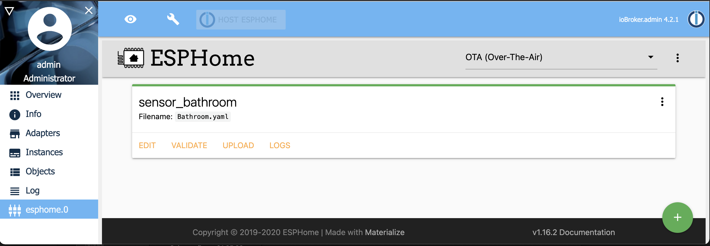

＃ioBroker.esphome
[![翻译状态]（https://weblate.iobroker.net/widgets/adapters/-/ESPHome/svg-badge.svg）](https://weblate.iobroker.net/engage/adapters/?utm_source=widget)

**测试：**

**此适配器使用Sentry库自动向开发人员报告异常和代码错误。**有关更多详细信息以及如何禁用错误报告的信息，请参见[哨兵插件文档](https://github.com/ioBroker/plugin-sentry#plugin-sentry)！ Sentry报告从js-controller 3.0开始使用。

## IoBroker的ESPHome适配器
使用由ESPHome创建和管理的简单但功能强大的配置文件来控制ESP8266 / ESP32。
ESPHome受管设备（包括仪表板）通过其本机API进行本机集成，并确保所有数据都是同步的（实时事件处理，无数据轮询！:)



该适配器使用[esphome-native-api]（https://github.com/Nafaya/esphome-native-api#readme），所有积分均归@Nafaya所有，以与[ESPHome API进行交互](https://esphome.io/components/api.html?highlight=api)！

## [文献资料](https://DrozmotiX.github.io/languages/en/ESPHome/)
我们所有的适配器文档都可以在[DrozmotiX文档页面](https://DrozmotiX.github.io/languages/en/ESPHome)中找到

##先决条件
    * NodeJS> = 12.x
    * Python> = 3.6，<4.0
    * API已在YAML中激活
    *对于管理标签（可选）
        *实例设置中提供了ESPHome仪表板IP

###在YAML中激活API
```
api:
  password: 'MyPassword'
```

###示例配置
示例配置，有关更多示例，请参见[DrozmotiX Docu页面]（https://DrozmotiX.github.io）或[ESPHome文档](https://esphome.io/index.html)

```
esphome:
  name: sensor_badkamer
  platform: ESP32
  board: esp-wrover-kit

wifi:
  use_address: 192.168.10.122
  ssid: "xxxxx"
  password: "xxxxxx"

# Enable ESPHome API
api:
    password: 'MyPassword'
# Activate i2c bus
i2c:
  sda: 21
  scl: 22
  scan: True
  id: bus_a

# Example configuration for bh1750
sensor:
  - platform: bh1750
    name: "Hal_Illuminance"
    address: 0x23
    measurement_time: 69
    update_interval: 10s

# Example configuration for an GPIO output
output:
  - platform: gpio
    pin: 12
    inverted: true
    id: gpio_12

# Example configuration linking a switch to the previous defined output
switch:
  - platform: output
    name: "Generic Output"
    output: 'gpio_12'

```

＃＃ 支持我
如果您喜欢我的作品，请考虑个人捐赠（这是DutchmanNL的个人捐赠链接，与ioBroker项目无关！）[![捐赠]（https://raw.githubusercontent.com/DrozmotiX/ioBroker.sourceanalytix/main/admin/button.png）](http://paypal.me/DutchmanNL)

## Changelog

<!--
    Placeholder for the next version (at the beginning of the line):
    ### __WORK IN PROGRESS__
-->

### 0.2.0-0 (2021-03-27) Native Integration of ESPHome Dashboard
* (DutchmanNL) Translations updated
* (DutchmanNL) Configuration page updated
* (DutchmanNL) Added to sentry error reporting
* (DutchmanNL) Native integration of ESPHome Dashboard added

### 0.1.5 (2021-03-21)
* (DutchmanNL) Add Translations

### 0.1.4 (2021-03-19)
* (DutchmanNL) Implemented RGBW
* (DutchmanNL) Ensure correct encryption and storage of passwords
* (DutchmanNL) Proper value ranges for type light (255 instead 100)
* (DutchmanNL) Implemented hex color state for type light (if RGB is available)

### 0.1.2 (2021-03-02)
* (DutchmanNL) Type Fan added
* (DutchmanNL) Type Light added
* (DutchmanNL) Error messages optimized
* (DutchmanNL) Device reconnect handling improved
* (DutchmanNL) [Breaking!] Change state name to default "state" for type BinarySensor / Climate / Sensor / TextSensor & Switch  
* (DutchmanNL) Autodiscovery improved, non-ESPHome devices excluded

### 0.1.0 (2021-02-27)
* (DutchmanNL) Autodiscovery implemented
* (DutchmanNL) Type Climat added
* (DutchmanNL) Type TextSensor added
* (DutchmanNL) Solved reconnection issues
* (DutchmanNL) Optimized error messages for unknown types
* (DutchmanNL & @xXBJXx) Adapter configuration page optimized

### 0.0.1
* (DutchmanNL) initial release

## License
MIT License

Copyright (c) 2021 DutchmanNL <rdrozda86@gmail.com>

Permission is hereby granted, free of charge, to any person obtaining a copy
of this software and associated documentation files (the "Software"), to deal
in the Software without restriction, including without limitation the rights
to use, copy, modify, merge, publish, distribute, sublicense, and/or sell
copies of the Software, and to permit persons to whom the Software is
furnished to do so, subject to the following conditions:

The above copyright notice and this permission notice shall be included in all
copies or substantial portions of the Software.

THE SOFTWARE IS PROVIDED "AS IS", WITHOUT WARRANTY OF ANY KIND, EXPRESS OR
IMPLIED, INCLUDING BUT NOT LIMITED TO THE WARRANTIES OF MERCHANTABILITY,
FITNESS FOR A PARTICULAR PURPOSE AND NONINFRINGEMENT. IN NO EVENT SHALL THE
AUTHORS OR COPYRIGHT HOLDERS BE LIABLE FOR ANY CLAIM, DAMAGES OR OTHER
LIABILITY, WHETHER IN AN ACTION OF CONTRACT, TORT OR OTHERWISE, ARISING FROM,
OUT OF OR IN CONNECTION WITH THE SOFTWARE OR THE USE OR OTHER DEALINGS IN THE
SOFTWARE.