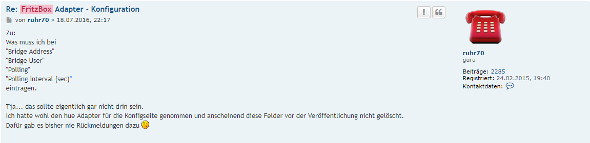

＃AVM Fritz！Box®
在Fritz！Box（制造商AVM的自己的拼写）是市场上使用最广泛的路由器。

现在有适用于所有常见类型的互联网连接的型号：DSL，电缆，移动和光纤接入。

##Friid Fritzbox
适配器在Fritzbox（短FB）和ioBroker之间建立连接，并提供数据和调用列表。

##安装前的先决条件
数据交换通过集成在FB中的* Callmonitor *进行。要激活它，请从连接的电话拨打以下号码：

*```\#96\*5\*``` - 打开电话监控器
*```\#96\*4\*``` - 关闭呼叫监控器

##配置
###设置
这里只是激活，哪些数据应该以哪种形式传输。上尉开发人员是不必要的数据字段（参见论坛中的图形和线程）;此适配器没有更新，因为它可以用更强大的“TR-064”适配器替换。



论坛中的更多信息[在这个帖子里](https://forum.iobroker.net/viewtopic.php?f=20&t=3344&hilit=fritzbox)。

### Autosetup
见[设置](#settings)

##实例
在ioBrokers的* Instances *下，您可以找到已安装的适配器实例。在交通信号灯系统中，左侧是可视化的，无论适配器是否已激活和连接。


如果将鼠标指针放在符号上，您将获得详细信息。

##适配器的对象
在“对象”区域中，FB传输到适配器的所有值，列表和信息都以树形结构显示（请参阅“设置”）。

直接在实例文件夹* fritzbox.x *中，您将找到数据点* Message *，其中包含最后一个操作的日期，时间和类型。


下面简要描述各个通道和其中创建的数据点。

###频道呼叫监控器
数据点实时显示呼叫

| **数据点** | **说明** |
|----------------|-----------------------------------------------------------------------|
|所有|显示日期，时间和电话号码;打开和关闭|
|打电话显示日期，时间和电话号码;开始|
|连接|显示现有连接的日期，时间和电话号码
|戒指|显示日期，时间和拨出电话号码|

###频道通话
在此通道中，将创建另外2个通道和一些数据点：


| **数据点** | **说明** |
|----------------------|---------------------------------------------|
| callLastNumber |上次拨打的电话号码|
| connectNumber |最后一次对话|
| connectNumbers |所有当前连接的电话|
| missedCount |柜台未接来电|
| missedDateReset |日期最后计数器重置|
|戒指|信号来电|
| ringActualNumber |当前来电的电话号码|
| RingActualNumbers |所有当前来电的号码|
| ringLastMissedNumber |最后一次电话|
| ringLastNumber |最后一个来电的电话号码|

#### CounterActualCalls
此处，各种当前呼叫计数器的值实时列出：

| **数据点** | **说明** |
|----------------|------------------------------------------------------|
| allActiveCalls |活动呼叫数（现有，传入）|
| callCount |拨出电话号码|
| connectCount |现有连接数|
| ringCount |来电数量|

#### TelLinks
下面列出的数据点被格式化为链接，以便可以通过链接选择相应的数字（例如通过VIS中的小部件）：

| **数据点** | **说明** |
|-------------------------|----------------------------------------------|
| callLastNumberTel |上次来电|
| ringLastMissedNumberTel |上次未接来电|
| ringLastNumberTel |重拨，最后拨打的电话号码|

###频道cdr
这些数据点以格式化形式提供信息（s。
设置）

| **数据点** | **说明** |
|----------------|--------------------------|
| HTML |最后一次电话|
| json | |
| missHTML |上次未接来电|
| missJSON | |
| txt |最后一次电话|

###频道历史
这些数据点提供格式化表格的表格。传输的信息可以在设置中定义

| **数据点** | **说明** |
|-----------------|------------------|
| allTableHTML | |
| allTableJSON |所有电话|
| allTableTxt | |
| missedTableHTML |未接来电|
| missedTablejSON | |

###频道系统
| **数据点** | **说明** |
|----------------|------------------------------------------------------------|
| deltaTime | ioBroker系统时间与Fritzbox之间的增量时间以秒为单位
| deltaTimeOK |测试结果（真/假）|

##常见问题
问：有Fritzbox和TR-064适配器，它们也可以访问FB呼叫监视器。差异在哪里，是否必须安装两个适配器？

答：Fritzbox适配器来自初始阶段，由路由器的可能信息组成，只有那些可用的，有关的呼叫。

TR-064可以被认为是进一步的发展，因为该适配器提供了更广泛的信息，例如关于在FB注册的设备。

原则上，如果安装了两个适配器中的一个就足够了。但是，由于许多长期用户使用FB适配器并在其上构建了可视化，因此它仍然可用但不再开发。

建议新人安装[TR-064适配器](https://github.com/ioBroker/ioBroker.docs/tree/master/docs/adapterref/docs/iobroker.tr-064/de)。

## Changelog
### 0.3.1 (2016-07-24)
* (BasGo) enhanced TR-064 configuration
* (BasGo) added rudimentary phonebook download into object store

### 0.3.0 (2015-06-26)
* (UncleSamSwiss) added support for wlan.enabled (using TR-064)

### 0.2.1 (2015-06-28)
* (ruhr) more configuration options

### 0.2.0 (2015-06-26)
* (ruhr)

## License

The MIT License (MIT)

Copyright (c) 2015, ruhr70

Permission is hereby granted, free of charge, to any person obtaining a copy
of this software and associated documentation files (the "Software"), to deal
in the Software without restriction, including without limitation the rights
to use, copy, modify, merge, publish, distribute, sublicense, and/or sell
copies of the Software, and to permit persons to whom the Software is
furnished to do so, subject to the following conditions:

The above copyright notice and this permission notice shall be included in
all copies or substantial portions of the Software.

THE SOFTWARE IS PROVIDED "AS IS", WITHOUT WARRANTY OF ANY KIND, EXPRESS OR
IMPLIED, INCLUDING BUT NOT LIMITED TO THE WARRANTIES OF MERCHANTABILITY,
FITNESS FOR A PARTICULAR PURPOSE AND NONINFRINGEMENT. IN NO EVENT SHALL THE
AUTHORS OR COPYRIGHT HOLDERS BE LIABLE FOR ANY CLAIM, DAMAGES OR OTHER
LIABILITY, WHETHER IN AN ACTION OF CONTRACT, TORT OR OTHERWISE, ARISING FROM,
OUT OF OR IN CONNECTION WITH THE SOFTWARE OR THE USE OR OTHER DEALINGS IN
THE SOFTWARE.