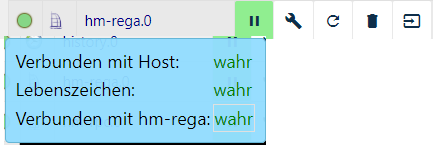

#HomeMatic ReGaHSS
## Homematic
> Homematic是eQ-3的智能家居系统，它使用家庭或公寓中的场景（从简单到复杂）提供对各种功能的全面控制。

>这些设备包括用于照明，卷帘和加热控制的产品，危险探测器，安全传感器和气象数据测量产品。无线电通信简化了改造。在新建筑物中，可以使用线路总线组件。

[源](https://www.eq-3.de/produkte/homematic.html)

## Adapter Homematic ReGaHss
该适配器连接到本地逻辑层“ReGaHSS”（** Re **sidential** Gateway）。
它在Homematic和ioBroker之间同步真实姓名，系统变量，房间，交易和程序。

如果要在ioBroker中集成多个控制面板，则必须为每个控制面板安装和配置单独的实例。

安装ReGaHSS还会安装应该预先配置并启用的hm-rpc适配器实例。

此适配器的一个实例可以管理最多5个不同的Homematic RPC Adapter实例，这些实例提供不同的服务（每个服务都需要自己的RPC实例）：

 -  rfd（标准组件的CCU服务）
 -  hs485d（有线）（用于有线总线组件）
 -  CuxD（用于提供通用接口的附加软件）
 -  Homematic IP（基于IP的组件）
 - 虚拟设备

###安装前的要求
 -  Homematic Gateway（CCU / CCU2 / CCU3 ......）*或*
 - 带有合适软件的无线电模块（piVCCU（* x）*，RaspberryMatic或类似软件）

##安装
通过ioBroker Admin界面安装适配器的实例。

安装完成后，配置窗口将自动打开。

在实际配置之前，应创建和配置HM-RPC适配器的实例（与此适配器一起创建）或（如果需要）其他HM-RPC实例。

##配置
**菜单顶部**

在上方选择菜单中，可以选择三个不同的区域：

###区域主要设置
**主要设置**

基本设置在此区域中进行。

在下拉菜单中，可以选择CCU的IP地址;用户也可以调整重新连接间隔（标准30秒）。

** RPC实例的分配**

此后，激活所需的服务并将其链接到适当的HM-RPC实例。

轮询

如果激活，CCU将根据“间隔”字段中设置的秒数定期轮询RegaHSS数据。间隔不应设置得太低，因为过度轮询可能导致CCU崩溃。

触发

为了最大限度地减少ioBroker对RegaHSS的活动查询，程序中CCU上的触发器也可以推送数据。
为此，可以使用CCU的虚拟密钥，其在CCU程序中触发。默认情况下，这是BidCosRF.50.PRESS_SHORT键（请参阅示例程序）。

### Area同步
在这里，用户可以指定CCU在ioBroker中接收哪些信息。然后在ioBroker中创建相应的对象和数据点。

 -  DutyCycle：激活占空比规格（％）
 - 变量：激活CCU的系统变量传输
 - 程序：激活CCU的程序名称传输
 - 名称：激活从CCU传输数据点的明文名称
 - 收藏夹：激活收藏夹的获取和列表
 - 客房：激活房间的接管和他们的列表
 - 交易：激活交易的获得和交易的清单

###其他设置区域
在这里，用户可以决定是否应该使用https（加密和安全连接）。如果启用，则需要用户名和密码

完成所有设置后，将使用“保存并关闭”命令（设置区域下方的按钮）关闭配置页面。适配器已关闭，实例以新值启动。

### Instance
**实例和信号**

在ioBroker的* Instances *区域中，您现在可以找到创建的实例。在左侧，红绿灯系统可视化适配器是激活还是连接到CCU。

如果将鼠标指针放在符号上，您将获得详细信息。

###适配器的对象
在“对象”区域中，适配器从CCU传输的所有值和信息都以树形结构显示。

由于对象是特定于用户的，因此此处仅显示所有用户相同的常规对象。

**文件夹结构**

第一个文件夹是CCU中包含的程序。

CCU和info文件夹包含网关的基本信息。
占空比的百分比（如果激活）。

最后，列出了在CCU中创建的变量

###常见问题

## Changelog
### 2.4.10 (2019-09-17)
* (foxriver76) we set enum name as translation object again

### 2.4.9 (2019-09-04)
* (foxriver76) fix minor bug which prevented correct room sync
* (foxriver76) in 2.4.6 we implemented the mechanism for hm-rega and rpc, in fact we should only delete hm-rpc devices, 
because rega will be added on ioB side (can't be done in CCU)

### 2.4.7 (2019-08-28)
* (foxriver76) fixed another legacy bug, which prevented some enums from getting correct name

### 2.4.6 (2019-08-11)
* (foxriver76) only deleting hm adapter objects from enums

### 2.4.4 (2019-08-02)
* (foxriver76) fixed enum sync and improved logging

### 2.4.2 (2019-07-23)
* (foxriver76) lc and ts for alarm states are now valid formatted for js-controller

### 2.4.1 (2019-07-13)
* (foxriver76) also poll invisible vars if configured

### 2.4.0 (2019-07-03)
* (foxriver76) added possibility to synchronize hidden variables

### 2.3.3 (2019-04-05)
* (foxriver76) added more systeminfo states when syncing duty cycle
* (foxriver76) when setting ts, do it in ms

### 2.3.2 (2019-03-10)
* (foxriver76) when ccu sysvar is nan, replace it by null

### 2.3.1 (2019-03-07)
* (foxriver76) also unescape %0A (\n)
* (foxriver76) remove line break in firmware version

### 2.3.0 (2019-02-07)
* (foxriver76) implemented messagebox

### 2.2.2 (2019-02-04)
* (foxriver76) show correct number of service messages even if automatic checking is enabled

### 2.2.1 (2019-01-29)
* (foxriver76) create alarm states with correct name instead of renaming on restart
* (foxriver76) fix to enable acknowledging servicemessages for all instance types

### 2.2.0 (2019-01-26)
* (foxriver76) reworked alarm states, see FAQ
* (foxriver76) fix where virtual devices were not named

### 2.1.8 (2019-01-24)
* (foxriver76) from now on we are displaying the firmware version instead of coprocessor fw version
* (foxriver76) we are making sure to prevent a CCU3 being exposed as a CCU2
* (foxriver76) fixed renaming of alarms on start

### 2.1.7 (2019-01-21)
* (foxriver76) fixed the bug that all alarms of devices are in hm-rpc rfd instance 
or non existent if no rpc instance existed
* (foxriver76) fix bug where datapoints were not named

### 2.1.6 (2019-01-20)
* (foxriver76) update state when same value is set with another timestamp
* (foxriver76) revert duty cycle script
* (foxriver76) fix for parse errors on -inf values

### 2.1.3 (2019-01-14)
* (foxriver76) also decode string values when setting foreign states
* (foxriver76) add more translations

### 2.1.2 (2019-01-10)
* (foxriver76) fix duty cycle script
* (foxriver76) fix bug where state units were ignored for all except rfd

### 2.1.0 (2019-01-07)
* (foxriver76) usage of adapter-core
* (bluefox) compact mode compatibility

### 2.0.1 (2019-01-01)
* (foxriver76) fix error that prevented setting umlauts to system variables in ioBroker
* (foxriver76) usage and application of eslint 

### 2.0.0 (2018-11-28)
* (foxriver76) Https checkbox added
* (foxriver76) Https can be used instead of http
* (foxriver76) Added possibility to authenticate on API
* (foxriver76) de- and encryption added

### 1.7.2 (2018-07-29)
* (bluefox) Configuration dialog was corrected

### 1.7.1 (2018-06-25)
* (bluefox) Forbidden characters were replaced

### 1.7.0 (2018-01-26)
* (bluefox) Ready for Admin3

### 1.6.6 (2017-09-23)
* (AlGu1) Fix error if Lan Interfaces exits

### 1.6.5 (2017-09-10)
* (AlGu1) Change adapter logging of new values to debug

### 1.6.4 (2017-09-10)
* (AlGu1) Config Settings changed to set defaults after update adapter

### 1.6.3 (2017-09-06)
* (AlGu1) Read values from CCU in raw format and create JSON string and object in adapter

### 1.6.2 (2017-09-05)
* (AlGu1) dutycycle.fn script changed for better compatiblity without ReGaHss Beta version

### 1.6.1 (2017-09-05)
* (AlGu1) Error in script file fixed

### 1.6.0 (2017-09-05)
* (AlGu1) Read DutyCycle and other params from listBidcosInterfaces

### 1.5.0 (2017-06-29)
* (Apollon77) Also update names of states when syncing with CCU

### 1.4.8 (2017-05-24)
* (bluefox) Fix values conversion for CUxD

### 1.4.4 (2017-02-28)
* (Apollon77) small fix (issue #23)

### 1.4.3 (2017-02-01)
* (Apollon77) respect settings and only sync variables and programs if selected in settings (issue #22)

### 1.4.2 (2017-01-30)
* (bluefox) remove error log in CCU by start

### 1.4.1 (2017-01-16)
* (bluefox) merge rooms, functions and favorites with existing one

### 1.4.0 (2017-01-15)
* (jens-maus) Add HMIP support

### 1.3.0 (2016-08-23)
* (bluefox) update states only if changed

### 1.2.1 (2016-07-15)
* (nobody) fix initial read of states

### 1.2.0 (2016-05-27)
* (bluefox) read variables anew if connection of rfd detected
* (bluefox) read alarms
* (bluefox) support of acknowledgment of alarms

### 1.1.1 (2016-05-27)
* (bluefox) fix min/max for variables

### 1.1.0 (2016-04-19)
* (bluefox) change timestamp and last change of states

### 1.0.0 (2016-04-19)
* (bluefox) detect disconnection and handle it

### 0.3.7 (2016-04-18)
* (bluefox) fix error with polling trigger

### 0.3.6 (2016-03-12)
* (bluefox) fix read datapoints

### 0.3.5 (2016-03-12)
* (bluefox) remove deprecated unescape

### 0.3.4 (2016-03-09)
* (bluefox) remove deprecated unescape

### 0.3.3 (2016-03-01)
* (bluefox) remove deprecated unescape
* (bluefox) add connection state

### 0.3.2 (2016-03-01)
* (bluefox) remove deprecated unescape

### 0.3.1 (2016-02-29)
* (bluefox) fix dimmer and blinds values at start

### 0.3.0 (2016-02-28)
* (bluefox) remove deprecated unescape

### 0.2.1 (2015-03-25)
* (bluefox) fix "\n" in values

### 0.2.0 (2015-03-24)
* (bluefox) implement check init function

### 0.1.16 (2015-01-04)
* (bluefox) catch errors if states deleted

### 0.1.15 (2015-01-03)
* (bluefox) add hm-rpc as dependency

### 0.1.14 (2015-01-03)
* (bluefox) enable npm install

### 0.1.13 (2014-12-11)
* (bluefox) process errors

### 0.1.12 (2014-12-10)
* (bluefox) update devices if hm-rpc updates the device list

### 0.1.11 (2014-12-06)
* (bluefox) update devices if hm-rpc updates the device list

### 0.1.10 (2014-11-21)
* (bluefox) support of new naming concept with no parents and children

### 0.1.9 (2014-11-11)
* (bluefox) fix error with stopping adapter

### 0.1.8 (2014-10-22)
* (bluefox) fix error with scripts
* (bluefox) add gruntfile.js and remove jscs warnings

### 0.1.7
* (Bluefox, Hobbyquaker) fix bug if no programs or variables exist

### 0.1.6
* (hobbyquaker) added common.role for variables
* (hobbyquaker) get state values
* (hobbyquaker) queue device/channel renaming

### 0.1.5
* (hobbyquaker) enum fixes

### 0.1.4
* (hobbyquaker) fixes
* (hobbyquaker) add settings ui

### 0.1.3
* (hobbyquaker) common.children vs children

### 0.1.2
* (hobbyquaker) Fix common.children in getPrograms

### 0.1.1
* (hobbyquaker) Fix common.name attribute

## License

The MIT License (MIT)

Copyright (c) 2014-2019 bluefox <dogafox@gmail.com>

Copyright (c) 2014 hobbyquaker

Permission is hereby granted, free of charge, to any person obtaining a copy
of this software and associated documentation files (the "Software"), to deal
in the Software without restriction, including without limitation the rights
to use, copy, modify, merge, publish, distribute, sublicense, and/or sell
copies of the Software, and to permit persons to whom the Software is
furnished to do so, subject to the following conditions:

The above copyright notice and this permission notice shall be included in
all copies or substantial portions of the Software.

THE SOFTWARE IS PROVIDED "AS IS", WITHOUT WARRANTY OF ANY KIND, EXPRESS OR
IMPLIED, INCLUDING BUT NOT LIMITED TO THE WARRANTIES OF MERCHANTABILITY,
FITNESS FOR A PARTICULAR PURPOSE AND NONINFRINGEMENT. IN NO EVENT SHALL THE
AUTHORS OR COPYRIGHT HOLDERS BE LIABLE FOR ANY CLAIM, DAMAGES OR OTHER
LIABILITY, WHETHER IN AN ACTION OF CONTRACT, TORT OR OTHERWISE, ARISING FROM,
OUT OF OR IN CONNECTION WITH THE SOFTWARE OR THE USE OR OTHER DEALINGS IN
THE SOFTWARE.