# Admin

信息适配器的开发是为了向用户提供有关系统，ioBroker和相关主题的各种信息。 用户应该对所有有趣和重要的数据进行概述，如果有重要信息，ioBroker团队将有机会更快地联系用户。

# 安装


要在“选项卡”选项卡中查看信息窗口，必须先在安装后在Admin中将其检查为“可见”。 要执行此操作，请单击“管理”窗口左上角的左侧三角形，然后在菜单中选择“信息”。

<br><br>

# 配置

<p align="center">
    
</p>

* **不显示时钟** - 隐藏左上角的时钟。
* **隐藏事件（仅德语）** - 活动日历未显示
* **显示适配器请求** - 显示带适配器请求的面板。
    * **启动时关闭的适配器请求** - 当信息窗口启动时，具有适配器请求的面板将关闭。
* **查看已知错误** - 显示已知错误的面板以及已安装适配器的请求。
    * **启动时已知错误关闭** - 启动信息窗口时，已关闭具有已知错误的面板。

* **来自iobroker.net的新闻** - 显示官方ioBroker新闻的面板。
* **显示最新的论坛条目** - 显示包含最后论坛条目的面板。
* ** Feednami API密钥** - 如果您使用主机名称调用ioBroker，例如iobroker：8081或类似名称，您需要在Feednami免费注册以获取适当的API密钥。 这不是通过IP地址访问所必需的。

* **显示文档** - 显示文档的按钮。
    * **选择文档所需的语言** - 选择要包含在文档中的语言。 （您可能必须单击右侧的名称来选择 - 默认 -> 设置语言+英语）

* **在Github上搜索未知适配器（专家）** - 显示在github中搜索未批准的适配器的面板。
    * **按排序适配器** - 按名称，创建日期或上次更新对搜索结果进行排序。
    * **逆序** - 反转结果的顺序。
    * **启动时关闭新适配器** - 启动信息窗口时，关闭具有未知适配器的面板。

* **GitHub个人访问令牌** - 为了能够直接从ioBroker在Github上创建新问题或适配器请求，您需要一个可以在那里生成的令牌。 这需要一个Github帐户。
要获取令牌，请登录Github，单击右上角的用户图标，转到“Settings”，然后转到“Developer setting”>“Personal access tokens”。 在那里，点击“Generate new token”，在“Token description”下键入任何名称，然后选择“Scope”，“repo”。 然后你得到一个令牌并在ioBroker中输入它。 您可以在英语 [这里](https://help.github.com/en/articles/creating-a-personal-access-token-for-the-command-line) 中找到更详细的说明。


* **不加载当前系统数据** - 不会循环加载当前系统数据。
    * **每x秒加载CPU数据** -  CPU数据每1至10秒循环加载一次。 （0关 - 默认3）
    * **每x秒加载内存数据** - 内存数据每1至10秒循环加载一次。 （0关 - 默认3）
    * **每隔x秒加载磁盘数据** - 硬盘数据每1至10秒循环加载一次。 （0关 - 默认8）
    * **每x秒加载电池数据** - 每1到10秒循环加载电池数据。 （0关 - 默认8）
    * **每x秒加载网络数据** - 每1至10秒循环加载网络数据。 （0关 - 默认3）
    * **每x秒加载过程和用户数据** - 每1至10秒循环加载过程和用户数据。 （0关 - 默认8）

对于Windows系统，系统数据的循环加载不应该发生得太快，因为这会对系统造成相当大的负担。 已选择默认值在大多数系统上运行时没有问题。

# 信息标签

“信息”选项卡包含有关系统和ioBroker的各种信息。 选项卡分为可自定义的不同块。 只需单击一下即可打开或打开几乎所有块 。

## 时钟

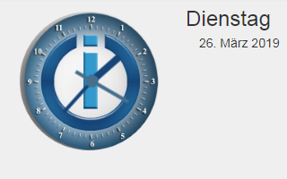
时钟没有特殊功能（但我已经付出了努力），并且可以在配置中随时关闭。

<br><br>

## Github吧

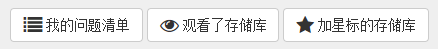
要查看此栏，您首先需要一个Github帐户，并且必须在配置中指定令牌。 有关更多信息，请参阅 [配置描述](#配置) > “GitHub个人访问令牌”。

目前，您可以查看自行创建的问题和存储库，这些问题和存储库可以观察或标记为星形。

点击 ，可以显示有关该问题的所有评论。仅当注释可用时才会显示该按钮。评论总数显示在问题标题之前的气球中。

## 消息

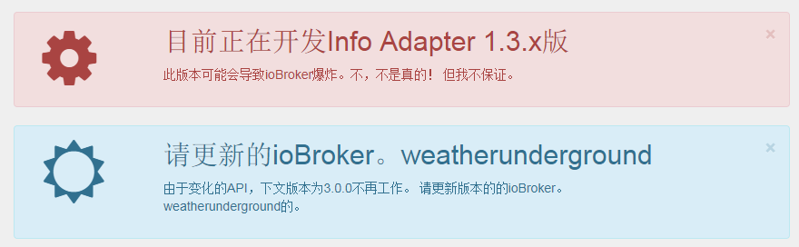
为了快速向用户发送有关ioBroker的重要消息，创建了创建消息的可能性。 仅在某些条件适用时才会显示这些消息。 因此，如果未安装适配器，则不会在适配器上显示任何消息。 这样可确保仅警告用户，并且还会受到问题的影响。

可以在  的右上角单击关闭消息，但只要问题仍然存在，它们会在重新加载信息选项卡后再次出现。

对于使用其他适配器（如Javascript，Telegram，Alexa等）的消息，它们已经在对象“newsfeed_filtered”中过滤，存储为对象数组。

例:
```javascript
const messages = JSON.parse(getState('info.0.newsfeed_filtered').val);
messages.forEach(message => {
    const title = message.title;
    const text = message.content;
    const created = new Date(message.created);
    console.log(created + " " + title + " " + text);
});
```

### 消息（VIS-Widget）


对于消息，创建了VIS窗口小部件，仅当消息涉及用户时才会显示该窗口小部件。 如果没有消息，则不显示任何消息，因此您不需要在VIS表面上为消息添加额外空间，而只需要它。 在屏幕中间。

<br><br>

## 文档

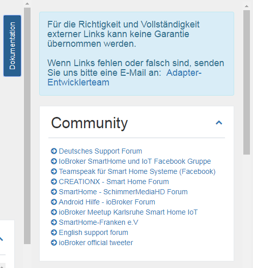
我们整理了一系列重要链接。 您可以通过单击右侧“文档”右侧的按钮将其作为下拉列表找到。 如果该按钮不可见，请确保选中配置中的相应项目。

各个链接存储在不同的类别中：社区，文档，新闻，博客，视频播放列表，开发和其他

对于外部链接的正确性和完整性，我们无法保证。 如果链接丢失或不正确，请发送电子邮件给我们。

## 更新


如果发布了适配器的新版本并且您已安装它，则它将显示在此列表中。

点击此处即可直接更新  。
鼠标悬停  ，您将看到自发布以来最重要的更改。
单击  显示适配器的完整描述。

如果主机（即JS控制器）已过时，则会在“新适配器”下方显示一个额外的框，其中包含您应更新主机的消息。

<br><br>

## 新适配器

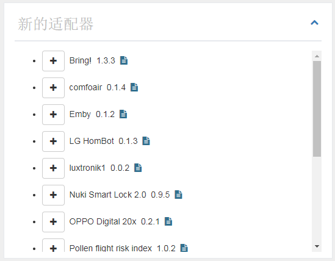
此处显示过去60天内所有新的和正式发布的适配器。

从这里，您可以通过单击  直接安装新适配器。
单击  显示适配器的完整描述。

<br>

## 系统信息


此处显示ioBroker系统的系统信息。 当然，在多主机系统的情况下，还显示其他主机的信息。 这些数据来自js控制器。

以下信息（每个主机）作为信息提供：

 - 操作系统（linux，win32，darwin，android，aix，freebsd，openbsd或sunos）
 - 架构（arm，arm64，ia32，mips，mipsel，ppc，ppc64，s390，s90x，x32和x64）
 - CPU（核心数）
 - 速度（处理器速度）
 - 型号（处理器型号）
 - RAM（近似总内存）
 - 系统运行时间（系统运行多长时间）
 - Node.js（Node.js版本 - 如果它是较新版本或您的版本已过时，此信息也在这里）
 - NPM（NPM版）
 - 硬盘大小（ioBroker所在硬盘的大小）
 - 无硬盘（仍有多少空间）
 - 适配器数量（目前为ioBroker发布了多少个适配器）
 - 运行时间（ioBroker在没有重启的情况下运行多长时间）
 - 活动实例（当前在此主机上运行的适配器实例数）
 - 主机名（主机名）

```
如果缺少任何信息，则应安装最新版本的JS控制器。
这是JS控制器v1.5.7的数据集。
```

单击  显示有关主系统的详细信息。

### 系统信息（详细视图）

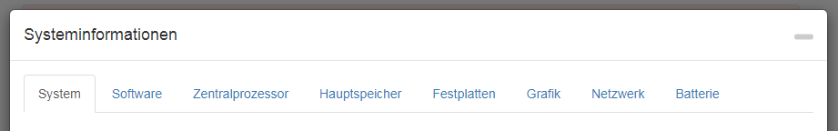

这里显示有关房屋系统的大量信息并将其存储为对象。 这些可以让你非常舒服地使用。 大多数数据仅在首次充电时读取并保存，因为这些数据不会轻易改变。

一些数据也会周期性更新。 可以在配置中设置这种情况发生的频率。

请记住，并非所有操作系统都提供所有信息，这可能导致某些信息无法显示。

#### 系统

这里显示硬件数据 - 主板，BIOS，外壳等......

#### 软件

软件包括有关操作系统，已安装软件，运行进程和登录用户的数据。

#### 中央处理器

在这里，您可以找到有关CPU的数据，如速度，负载和温度。

**Windows问题：** wmic用于检测Windows系统的温度。 在某些情况下，需要使用管理员权限运行wmic。 因此，如果您没有获得任何值，请尝试使用适当的权限再次运行它。 如果仍然没有获得任何值，则系统可能不支持此功能。

**Linux的问题：** 在某些情况下，您需要安装Linux传感器软件包来测量温度，例如： 在基于DEBIAN的系统上运行：

```
$ sudo apt-get install lm-sensors
```

#### 主存

这里是主内存的所有数据，如空闲内存或RAM条数据。

#### 硬盘

硬盘驱动器，分区，raid和ROM上的所有数据。

**Linux的问题：** 能够使用S.M.A.R.T. 要查看Linux状态，您需要安装smartmontools。 在基于DEBIAN的Linux发行版上，您可以通过执行以下操作来安装它：

```
$ sudo apt-get install smartmontools
```

#### 图形

如果可用/支持，此处显示有关控制器或监视器的数据。

#### 网络

有关网络连接的所有数据。

#### 电池

有关电池的所有数据（如果存在）。

**Windows问题：** wmic用于检测Windows系统的电池状态。 在某些情况下，需要使用管理员权限运行wmic。 因此，如果您没有获得任何值，请尝试使用适当的权限再次运行它。 如果仍然没有获得任何值，则系统可能不支持此功能。

## 适配器请求


所有适配器请求都包含在github中作为一个问题。 任何想要某事的人，都可以在这里输入他的愿望，任何人都可以开发，然后可以选择一个问题并从中开发适配器。

在此列表中，将显示标题并单击 ，将显示更详细的信息。 创建愿望时的上方链接，右侧是当前状态，下面是详细说明。 如果开发人员选择了该请求，则此处将其列为“assined to”。

点击  ，你直接来到Github并可以在那里添加你自己的愿望。
如果你点击一个愿望的标题，你直接登陆Github的请求，并可能投票支持。 有很多选票的愿望当然是首选。

“适配器请求”面板可以隐藏在配置中，也可以在加载时以关闭状态显示。

### 创建新的适配器请求

要创建新请求，首先需要Github帐户，并且必须在配置中指定令牌。有关更多信息，请参阅 [配置描述](#配置) >“GitHub个人访问令牌”。

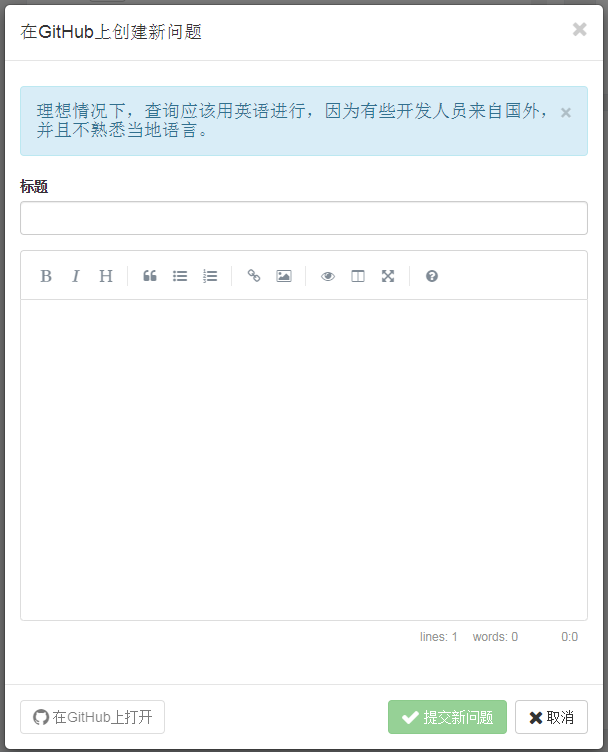
如果单击  ，将出现一个窗口，您可以在其中创建适配器请求的标题和说明。

作为标题，请始终选择明确的短期内容，例如“Panasonic TV”。然后尽可能准确地描述您的愿望。
如果产品已存在已知的API，则还应编写此API。
任何可能有助于开发人员的信息都会增加快速开发相应适配器的可能性。如果可能的话，请用英文写下所有内容，
因为有些开发人员来自国外，可能他们不会说你的语言。

通过单击“提交新请求”，将在Github上创建一个问题。现在，您可以单击左侧的蓝色按钮直接转到问题或关闭窗口。

### 投票支持适配器请求

使用Github帐户，您还可以通过单击直接投票以获取适配器请求 。 如果有效，按钮变为绿色。 每个人只能投一票。 语音总数显示在标题前面的对象中。

在概述中，您投票的适配器请求以绿色显示，而小于1个月的请求为蓝色。

## 我的适配器


当然，没有适配器没有错误，一些用户也可能有扩展的想法。 这里收集了有关已安装适配器的所有信息。 您还可以使用此列表来确定开发人员是否也知道您刚发现的错误，因为只能修复已知的错误。

单击  ，在适配器名称的右侧，将打开已知问题/请求的列表。 这些也可以打开，然后您将找到详细说明。

如果单击适配器的名称，则可以直接转到Github上的“问题”列表，并可能输入新错误或希望扩展。
如果您单击问题的标题，您最终会直接使用Github上的消息，并可以选择向开发人员提供更多信息，并留下评论。
点击 ，可以显示有关该问题的所有评论。仅当注释可用时才会显示该按钮。评论总数显示在问题标题之前的气球中。

“问题和错误”面板可以隐藏在配置中，也可以在加载时以关闭状态显示。

###报告愿望或错误

如果打开适配器，您可以选择报告新错误或通过单击  提出改进建议。这需要Github帐户和配置中的令牌。更多详细信息，请参见[配置说明]（＃配置）>“GitHub个人访问令牌”。

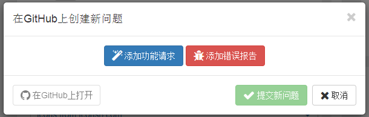
点击后你有机会提出改进建议（蓝色）或报告错误（红色）。这两个选项都允许您输入标题和说明。

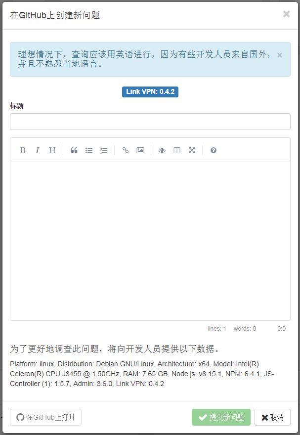
标题应该给你一个清晰简洁的问题描述。在描述时，你不应该节俭信息。每个细节都可以帮助开发人员更快地实现问题或渴望。如果可能的话，请用英文写下所有内容，
因为有些开发人员来自国外，可能他们不会说你的语言。

通过单击“提交新问题”，将在Github上创建一个问题。现在，您可以单击左侧的蓝色按钮直接转到问题或关闭窗口。

###将适配器标记为收藏夹

开发人员牺牲了大量的空闲时间来为您开发适配器。 如果输入Guthub令牌，点击这里是你的机会  感谢开发人员的工作。 每个人只能投一票。 投票总数将显示在标题前的对象中。

在概述中，您喜欢的适配器以绿色显示。

## ioBroker适配器Github上的

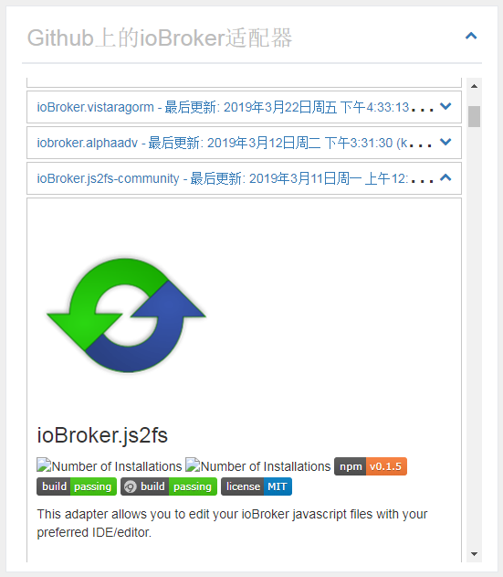
ioBroker的官方适配器数量已经相当可观。 当然，网上还有更多的适配器。 这些被搜索并显示在这里。

如果单击  打开面板，则会在此处显示适配器的完整说明。

“Github上的ioBroker适配器”面板可以隐藏在配置中，也可以在加载时以关闭状态显示。 您还可以调整排序顺序。

```
小心！！！ 这些适配器可能处于开发的早期阶段。
这些不应安装在生产系统上。
每次安装都需要您自担风险！
```

## 新闻

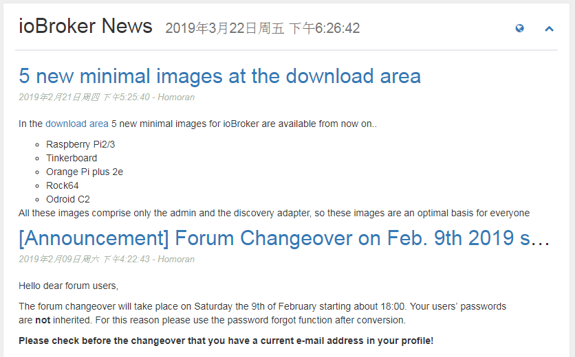
时不时会发布ioBroker团队的官方消息。 这里将显示它们。

点击  直接进入官方ioBroker页面。

当通过IP或localhost：8081访问ioBroker时，新闻显示没有任何问题。但是如果你使用像meinhaus.de:8081这样的主机名，你必须在Feednami获得一个免费的API密钥。 要注册，请单击 [此处](https://toolkit.sekando.com/docs/en/setup/hostnames) 并按照说明进行操作。

<br><br>

## 论坛


此处论坛的最新条目以所选语言显示。 如果该语言中没有论坛，则数据将显示在英语论坛上。

点击  直接进入论坛。

当通过IP或localhost：8081访问ioBroker时，论坛条目将显示没有问题。但是如果你使用像meinhaus.de:8081这样的主机名，你必须在Feednami获得一个免费的API密钥。 要注册，请单击 [此处](https://toolkit.sekando.com/docs/en/setup/hostnames) 并按照说明进行操作。

## Changelog
<!-- ### __WORK IN PROGRESS__ -->

### 1.8.0 (2021-xx-xx)
* (ldittmar81) Update libraries

### 1.7.15 (2021-01-13)
* (Apollon77) fix crash case (Sentry IOBROKER-INFO-1X)

### 1.7.14 (2020-12-27)
* (Apollon77) fix crash case (Sentry IOBROKER-INFO-1R)

### 1.7.13 (2020-12-24)
* (Apollon77) fix crash case (Sentry IOBROKER-INFO-A)

### 1.7.12 (2020-12-02)
* (Apollon77) fix crash case (Sentry IOBROKER-INFO-1G)

### 1.7.11 (2020-11-30)
* (Apollon77) fix crash case (Sentry IOBROKER-INFO-1F)
* Add Weblate translations

### 1.7.10 (2020-11-09)
* (Apollon77) fix crash case (Sentry IOBROKER-INFO-13)

### 1.7.9 (2020-11-01)
* (bluefox) Corrected socket.io in widget

### 1.7.8 (2020-09-17)
* (bluefox) Fixed words.js in widget

### 1.7.7 (2020-07-25)
* (Apollon77) Prevented a crash case (Sentry IOBROKER-INFO-K)

### 1.7.6 (2020-07-14)
* (Apollon77) Update systeminformation and other deps
* (Apollon77) Check for axios existance and exit adapter if not existing to prevent crashes (Sentry IOBROKER-INFO-C)
* (ldittmar) UUID Hash with SHA256

### 1.7.5 (2020-06-08)
* (ldittmar) Check UUID for messages
* (ldittmar) New field for test messages

### 1.7.4 (2020-06-01)
* (Apollon77) Update systeminformation and other deps
* (ldittmar) Added full S.M.A.R.T data. To be able to detect S.M.A.R.T. status on Linux you need to install smartmontools >= 7.0

### 1.7.2 (2020-05-07)
* (ldittmar) Update systeminformation library
* (ldittmar) Messages can be hidden
* (ldittmar) Show subnet mask for ip4 and ip6 

### 1.7.1 (2020-04-29)
* (ldittmar) Update systeminformation library
* (ldittmar) Check instance active for messages

### 1.7.0 (2020-04-16)
* (Apollon77) IMPORTANT: Supported version minimum nodejs 10
* (Apollon77) add Sentry error reporting and update dependencies
* (Apollon77) remove usage of objects directly to prevent js-controller 3.0 warnings
* (Apollon77) update dependencies
* (Apollon77) fix some crashes
* (Apollon77) fix compact mode

### 1.6.0 (2020-04-08)
* (SchumyHa) update Chinese bbs rss url
* (ldittmar) Tabs were added to config
* (ldittmar) Update translations
* (bluefox) Widget corrected in edit mode

### 1.5.7 (2019-11-12)
* (ldittmar) add event vis widget

### 1.5.6 (2019-11-05)
* (ldittmar) Add Repo check for popup
* (ldittmar) Fix dp type

### 1.5.5 (2019-10-12)
* (ldittmar) Add NPM and OS check for popup

### 1.5.4 (2019-09-25)
* (ldittmar) add event calendar

### 1.5.2 (2019-09-24)
* (ldittmar) show comments for adapter requests
* (ldittmar) show closed adapter requests
* (ldittmar) check node version for messages

### 1.4.3 (2019-09-09)
* (ldittmar) change systeminformation call interval
* (ThomasBahn) News problem fixed
* (ldittmar) Update systeminformation library
* (badenbaden) Fixed russian spelling 

### 1.4.1 (2019-08-01)
* (bluefox) Removed default socket.io

### 1.3.7 (2019-04-17)
* (ldittmar) better integration to admin adapter

### 1.3.5 (2019-04-12)
* (ldittmar) add likes for Adapters
* (ldittmar) show comments for issues

### 1.3.4 (2019-04-10)
* (ldittmar) my issues and my repos
* (ldittmar) change Github API V3 to API V4
* (ldittmar) vote for adapter requests

### 1.3.2 (2019-04-06)
* (SchumyHao) Update Chinese translation
* (ldittmar) create Github issues
* (ldittmar) create new adapter requests

### 1.3.1 (2019-04-03)
* (ldittmar) charts for cpu and memory
* (ldittmar) filtered news object added

### 1.3.0 (2019-03-29)
* (ldittmar) better system information
* (ldittmar) documentation in all languages
* (ldittmar) some fixes

### 1.2.7 (2019-03-17)
* (ldittmar) little fixes
* (ldittmar) unknown adapters search new design
* (ldittmar) better design for PC monitor
* (ldittmar) unknown adapters show more information
* (ldittmar) stable version

### 1.2.5 (2019-03-14)
* (ldittmar) show adapter requests
* (ldittmar) show bugs and issues
* (ldittmar) display important links
* (ldittmar) show important popup news
* (ldittmar) vis widget for popup news

### 1.1.3 (2019-01-03)
* (ldittmar) compact mode compatibility added
* (ldittmar) add chinese support
* (ldittmar) add new forum support
* (ldittmar) add chinese forum support
* (ldittmar) move to iobroker-community-adapters

### 1.0.2 (2018-11-30)
* (ldittmar) fixed problems with Node version info in multi-host system

### 1.0.1 (2018-11-27)
* (ldittmar) search for new adapters on Github
* (ldittmar) check for Node.js update
* (ldittmar) https problems with news and forum data solved
* (ldittmar) polish added as language

### 1.0.0 (2018-11-25)
* (ldittmar) full compatibility to Admin 3.x
* (ldittmar) clock can be disabled

### 0.1.0 (2018-01-02)
* (ldittmar) compatibility to Admin 3.x / beta release

### 0.0.6 (2017-12-11)
* (ldittmar) some fixes / install and update implemented

### 0.0.4 (2017-12-08)
* (ldittmar) some fixes and design correction
* (ldittmar) show information about adapters (update/new)
* (ldittmar) show system information

### 0.0.1 (2017-11-23)
* (ldittmar) initial commit

## License
The MIT License (MIT)

Copyright (c) 2017 - 2020 ldittmar <iobroker@lmdsoft.de>

Permission is hereby granted, free of charge, to any person obtaining a copy
of this software and associated documentation files (the "Software"), to deal
in the Software without restriction, including without limitation the rights
to use, copy, modify, merge, publish, distribute, sublicense, and/or sell
copies of the Software, and to permit persons to whom the Software is
furnished to do so, subject to the following conditions:

The above copyright notice and this permission notice shall be included in
all copies or substantial portions of the Software.

THE SOFTWARE IS PROVIDED "AS IS", WITHOUT WARRANTY OF ANY KIND, EXPRESS OR
IMPLIED, INCLUDING BUT NOT LIMITED TO THE WARRANTIES OF MERCHANTABILITY,
FITNESS FOR A PARTICULAR PURPOSE AND NONINFRINGEMENT. IN NO EVENT SHALL THE
AUTHORS OR COPYRIGHT HOLDERS BE LIABLE FOR ANY CLAIM, DAMAGES OR OTHER
LIABILITY, WHETHER IN AN ACTION OF CONTRACT, TORT OR OTHERWISE, ARISING FROM,
OUT OF OR IN CONNECTION WITH THE SOFTWARE OR THE USE OR OTHER DEALINGS IN
THE SOFTWARE.