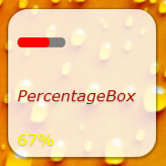
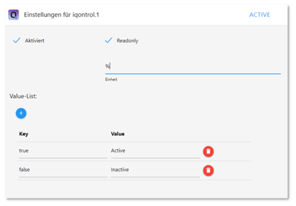
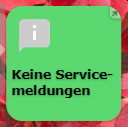
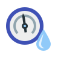
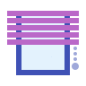

＃ioBroker.iqontrol
**测试：**

| Linux / Mac / Windows：跨浏览器检查： |
| --- | --- |

\ **如果您喜欢，请考虑捐赠：**

[

****

## IoBroker的iqontrol适配器
快速的Web应用程序以实现可视化。


\


\


\


\


\


在任何浏览器中运行。
易于设置，尽管它是完全可定制和响应的。

> **此适配器使用Sentry库自动向开发人员报告异常和代码错误。**有关更多详细信息以及如何禁用错误报告的信息，请参见[哨兵插件文档](https://github.com/ioBroker/plugin-sentry#plugin-sentry)！ Sentry报告从js-controller 3.0开始使用。

##视频教程（德语）：
[![演示视频]（img / play_demo.png“在YouTube上打开教程”）](https://youtube.com/playlist?list=PL8epyNz8pGEv6-R8dnfXm-m5aBlZFKOBG)

##添加到主屏幕
您可以将其另存为主屏幕上的Web-App，它的外观和感觉就像是本机应用程序：

＃＃ 你需要...
* Nodejs 10或更高版本
* Web适配器，其一个实例运行与admin-adapter，socket.IO相同的协议（http或https），并且IO设置为“集成”，并且禁用了“强制Web-Sockets”
    *如果与其他适配器冲突，只需添加具有上述设置的另一个实例-iQontrol将搜索最合适的web-adapter-instance并将其用于通信
*为了同时通过* iobroker.pro-Cloud *进行连接，应将admin-和web-adapter设置为http（而非https）

*如果遇到任何问题，请参阅本自述文件末尾的[故障排除]（＃troubleshooting）部分

##论坛
访问[iobroker论坛](https://forum.iobroker.net/topic/22039/neuer-adapter-visualisierung-iqontrol)。

＃＃ 如何使用
**不要害怕您有很多选择。**大多数事情都是开箱即用的。您可以*，但是您不必使用iQontrol提供的所有配置功能！只是这样开始：

*开始创建视图。

您可以将视图视为类似于页面的内容。

*然后在这些视图上创建设备。

设备具有确定设备功能，使用哪些图标等的角色。
根据该角色，您可以将多个状态链接到设备。这些将赋予设备其功能。
如果选择“链接到其他视图”作为角色，则可以创建到其他视图的链接。我建议对链接到具有相同背景的其他视图的外观进行换肤。
您也可以尝试使用自动创建功能从iobroker-object-tree中选择现有设备。自动创建会尝试找出角色并匹配尽可能多的状态。

*之后，您可以创建一个工具栏，该工具栏显示为页脚。

工具栏条目是视图的链接。
第一个工具栏条目将是您的“主视图”，并将在开始时加载。

*要为所有内容提供精美的样式，您可以上传自己的图像。

您可以将图像用作背景图像或设备的背景图像。
文件夹“ / usericons”中的图像可用作设备图标。
免费的内置演示壁纸来自www.pexels.com。

###使用自动创建
*您将在``视图''-制表符中找到一个``自动创建视图''-按钮
*如果您拥有维护良好的ioBroker枚举（例如“房间”或“功能”），则可以使用此功能自动使用该枚举中列出的设备构建视图
*请记住，由于ioBroker-univese内有大量不同的适配器和设备，自动安装功能无法正确维护所有设备100％。您可能需要手工修改某些设置才能获得最佳效果。但是自动创建为您提供了一个好的起点，可以在几秒钟内构建自己的可视化文件。

## URL参数
*通过``http [s]：// <iobroker的URL或ip>：<Web适配器的端口> /iqontrol/index.html调用前端
    *``<网络适配器端口>''通常是8082
*要打开指定的实例，您可以添加“ namespace = iqontrol。<instance-number>”作为URL参数
*要打开指定的视图，您可以添加“ renderView = <viewID>”作为URL参数。
    *``<viewID>``的格式必须类似于``iqontrol。<instance-number> .Views。<view-name>``
*注意：这是区分大小写的！
*要打开指定的视图作为主页，可以添加“ home = <viewID>”作为URL参数。这也将更改第一个工具栏条目的链接视图！
    *``<viewID>``的格式必须类似于``iqontrol。<instance-number> .Views。<view-name>``
*注意：这是区分大小写的！
*要在加载页面时打开指定的对话框，可以添加“ openDialog = <deviceID>”作为URL参数
    *``<deviceID>''的格式必须类似于``iqontrol。<instance-number> .Views。<view-name> .devices。<device-number>``，其中``<device-number>``从0开始（因此视图中的第一个设备是设备号0）
*注意：这是区分大小写的！
*要设置或覆盖时间设置后的返回，请使用以下参数：
*``returnAfterTimeTreshold =<time in seconds> ``设置时间，之后将调用目标视图。使用``0&#39;&#39;禁用定时返回功能。
*``returnAfterTimeDestiationView = <viewID>``设置视图，在阈值之后调用。如果未指定，将使用主视图。
*如果您从壁挂式平板电脑上调用iQontrol，这些选项会很有用，使用后该平板电脑应自动返回主视图
*要加载没有工具栏的页面，可以添加``noToolbar = true''
*要加载不带面板的页面，您可以添加``noPanel = true''
*要加载不带工具栏和面板的页面，不激活滑动，不带加载纺锤且具有透明的加载屏幕，您可以添加“ isBackgroundView = true”

**例：**

*``https：//192.168.1.1：8082 / iqontrol / index.html？namespace = iqontrol.1＆home = iqontrol.1.Views.Living-Room``
    *注意大写和小写

##图标和背景图片
*您可以使用内置图像或在“图像”标签下上传的图像或您喜欢的任何免费网址
*您也可以在图片网址中使用变量。例如，这对于天气预报而言可能是有用的。使用以下模式：
    *``path / to / firstloaded.png | anotherpath / to / {iobrokerstate | fallback} .png``
    *示例：``./../ iqontrol.meta / userimages / demo / bottle.jpg | ./../ iqontrol.meta / userimages / demo / {javascript.0.myimage | whitestone} .jpg''
*打开视图时加载``./../iqontrol.meta/userimages/demo/bottle.jpg''
*从服务器获取javascript.0.myimage的状态后，该图像将立即替换为./../iqontrol.meta/userimages/demo/XXX.jpg，其中XXX是javascript.0.myimage的值
*如果javascript.0.myimage没有值，将使用后备的whitestone（使用后备是可选的）

###进度条
*可以结合使用SVG定义和变量而不是图像文件来显示进度条
*集成了vew模板供您选择，但是您也可以创建自己的SVG



*有关更多信息，请参见[Wiki]（https://github.com/sbormann/ioBroker.iqontrol/wiki/Progress-Bars）

###图表
*您可以将“ FLOT Chart-Widget”添加为任何设备的BACKGROUND_URL，这会在设备图块的背景中自动将主要状态显示为图表
*您需要确保ioBroker的历史适配器之一记录和记录状态


##设备名称
*就像图片网址中的变量一样，您可以在设备名称中使用变量。语法几乎相同：
    *“加载时输入文字|加载后{iobrokerstate | fallback}后文字”
*另外，可以将iobrokerstate放在方括号中，然后将使用不带其单位的普通值：“加载时的文本|加载{[iobrokerstate] | fallback}之后的文本”
    *示例：“天气正在加载|天气：{javascript.0.weather |未找到天气数据}”
*打开视图时显示``天气正在加载''
*一旦从服务器获取了javascript.0.weather状态，该文本将替换为Weather：XXX，其中XXX是javascript.0的值。天气``
*如果``javascript.0.weather''没有值，将使用回退``No weather data found''（使用回退是可选的）

##弹出消息
*每个实例都会创建状态``iqontrol.x.Popup.Message''
*将值传递到此状态时，将显示弹出消息（或吐司）
*您可以使用html标签来格式化消息文本
*还有一些其他状态可用于进一步自定义显示的弹出窗口（必须在设置消息数据点之前设置这些状态）：
    *``持续时间''：这是显示消息的时间，以毫秒为单位;如果设置为0，则必须确认消息
    *``ClickedValue''和``ClickedDestinationState''：如果用户单击了弹出窗口，则``ClickedValue''中的值将被发送到``iqontrol.x.Popup.POPUP_CLICKED''，如果指定，则还会附加到``ClickedDestinationState''中的数据点
        *如果未指定任何值，则将使用“ true”
    *“ ButtonNames”：您可以在此处指定以逗号分隔的按钮列表，该列表将显示在弹出窗口的底部（例如“ OK，中止”）
        *``ButtonValues''和``ButtonDestinationStates''：这些是逗号分隔的值列表，这些值将被发送到``iqontrol.x.Popup.BUTTON_CLICKED''，并且如果指定的话，将附加到``ButtonDestinationStates''中的数据点`，如果用户单击相应的按钮
*您可以使用命令COMMAND：renderView和COMMAND：openDialog作为ButtonDestinationState来代替数据点，以呈现视图或打开对话框
*然后，ButtonValue指定视图的响应。对话框，格式为``iqontrol。<实例编号>。视图。<视图名称>``。 ``iqontrol。<instance-number> .Views。<view-name> .devices。<device-number>``，其中``<device-number>``从0开始数字0）
*如果仅使用一个值（而不是用逗号分隔的列表），则此值将用于所有按钮
*如果您将“ ButtonValues”留空，则将使用按钮的名称
*如果仅使用一个目标状态（而不是用逗号分隔的列表），则此状态将用于所有按钮
        *``ButtonCloses``：这是一个用逗号分隔的布尔值列表（``true''/``false''），用于指定当按下相应按钮时是否应关闭弹出窗口
*或者，您可以通过sendTo-command和参数``PopupMessage''，``PopupDuration''，``PopupClickedValue''等来设置这些值
    *示例：``sendTo（“ iqontrol”，“ send”，{PopupMessage：'这是我的消息'，PopupDuration：2500，PopupClickedValue：'messageConfirmed'}）;''
*您也可以使用块状发送消息到iQontrol


##小部件
*每个图块都有一个Background_URL和一个Background_HTML数据点
*您可以在此处定义到网站的链接（通过Background_URL）或放置直接的HTML代码（通过Background_HTML），这些代码将显示为图块的背景
*这使您可以将内容（交互式）放置在图块内（例如时钟，FLOT图表，表格，天气预报等）
*默认情况下，鼠标事件将定向到该内容（因此，您将无法再单击图块本身），但是可以使用“将鼠标事件直接定向到图块，而不是Background_VIEW / URL / HTML的内容”选项禁用此功能”
* iQontrol提供了一个设备角色“窗口小部件”，其中具有一些预定义的选项集，这些选项通常在将网站显示为窗口小部件时使用。但是，通过适当地修改设备选项，您可以在任何其他角色上获得相同的结果。


### PostMessage-Communication（仅适用于专家）
*从技术上讲，BACKGROUND_VIEW / URL / HTML的内容放置在称为iframe的HTML元素内，该元素是网站内部的网站
*通过启用选项“为Background_VIEW / URL / HTML允许postMessage-Communication”，您可以启用此iframe中的网站与iQontrol本身之间的postMessage-Communication。
*要将命令发送到iQontrol，可以使用以下javascript命令：``window.parent.postMessage（message，“ *”）;''
    *``message``是一个JavaScript对象，其格式为``{command：command，stateId：stateId，value：value}``
    *支持以下消息命令：
        *``{命令：“ setWidgetState”，stateId：<widgetStateId>，值：<value>}''
*这会将ioBroker状态``iqontrol。<instance> .Widgets。<widgetStateId>``设置为值``<value>``（``<value>``可以是字符串，数字或布尔值或对象，例如“ {val：<value>，ack：true | false}”）
        *``{命令：“ getWidgetState”，stateId：<widgetStateId>}``
*这将导致iQontrol发送ioBroker状态``iqontrol。<instance> .Widgets。<widgetStateId>''的值（请参见下面的接收应答消息的方式）
        *``{命令：“ getWidgetStateSubscribed”，stateId：<widgetStateId>}``
*这将导致iQontrol立即且每次其值更改时都发送ioBroker状态``iqontrol。<instance> .Widgets。<widgetStateId>''的值（请参阅下面的方法来接收应答消息）
        *``{命令：“ setWidgetDeviceState”，stateId：<widgetDeviceState>，值：<value>}''
*这会将设置为设备状态``<widgetDeviceState>''的ioBroker数据点（例如，分配给LEVEL的数据点）设置为值``<value>''（``<value>` `可以是字符串，数字或布尔值，也可以是诸如“ {val：<value>，ack：true | false}``之类的对象）
        *``{命令：“ getWidgetDeviceState”，stateId：<widgetDeviceState>}``
*这将使iQontrol发送分配给设备STATE``<widgetDeviceState>''的ioBroker数据点的值（例如，分配给LEVEL的数据点；请参阅下面的方法，接收应答消息）
        *``{命令：“ getWidgetDeviceStateSubscribed”，stateId：<widgetDeviceState>}``
*这将导致iQontrol现在以及每次其值更改时发送ioBroker数据点的值，该值已分配给设备STATE``<widgetDeviceState>``（例如，已分配给LEVEL的数据点）如何接收答案消息）
        *``{命令：“ setState”，stateId：<stateId>，值：<value>}''
*这会将ioBroker状态``<stateId>''设置为值``<value>``（``<value>``可以是字符串，数字或布尔值，也可以是诸如``{val：<值>，ack：true | false}``）
        *``{命令：“ getState”，stateId：<stateId>}``
*这将导致iQontrol发送ioBroker状态``<stateId>''的值（请参见下面的如何接收应答消息）
        *``{命令：“ getStateSubscribed”，stateId：<stateId>}``
*这将导致iQontrol立即且每次其值更改时发送ioBroker状态``<stateId>''的值（请参阅下文如何接收应答消息）
        *``{命令：“ renderView”，值：<viewID>}``
*这将指示iQontrol渲染视图，其中的<viewID>必须像iqontrol。<instance-number> .Views。<view-name>``一样格式化（区分大小写）
        *``{命令：“ openDialog”，值：<deviceID>}``
*这将指示iQontrol打开一个对话框，其中的<deviceID>必须像iqontrol。<instance-number> .Views。<view-name> .devices。<device-number>``一样格式化其中``<设备号>''从0开始（因此视图中的第一个设备是设备号0）
*要从iQontrol接收消息，您需要使用javascript命令``window.addEventListener（“ message”，receivePostMessage，false）;向“ message”事件注册一个事件监听器。
    *函数``receivePostMessage''接收对象``event''
*``event.data``包含来自iqontrol的消息，它将是一个类似于以下内容的对象：
* event.data =``{command：“ getState”，stateId：<stateId>，value：<stateObject>}``-这将是对getState-command或getStateSubsribed-command的回答，并为您提供实际的` `<value>``-ioBroker状态的对象<stateId>
*``<stateObject>''本身是一个像

			````javascript
			event.data.value = {
				val: <value (rounded)>,
				unit: "<unit>",
				valFull: <value (not rounded)>,
				plainText: "<clear text of val, for example taken from valuelist>",
				min: <minimum>,
				max: <maximum>,
				step: <step-width>,
				valuelist: {<object with possible values and corresponding clear text>},
				targetValues: {<target value list>},
				ack: <true|false>,
				readonly: <true|false>,
				custom: {<object with custom settings>},
				id: <id of the iobroker datapoint>,
				from: "<source of state>",
				lc: <timestamp of last change>,
				ts: <timestamp of last actualization>,
				q: <quality of signal>,
				role: "<role of state>",
				type: "<string|number|boolean>"
			}
			````

*要指示iQontrol在``iqontrol。<instance> .Widgets''下生成一个widgetState，您可以在widget网站的头部内使用一个meta标签：
*语法：``<meta name="widget-datapoint" content="WidgetName.StateName" data-type="string" data-role="text" /> ``
*您可以使用数据类型（可以设置为字符串，数字或布尔值），数据角色，数据名称，数据最小，数据最大，数据定义和数据单位属性来进一步配置数据点
    *如果将小部件网站作为URL或Background_URL添加到设备，则仅创建相应的数据点
* URL / HTML-State可以使用相同的概念，用于在设备对话框内显示网站
*要为小部件创建图标，请将与小部件具有相同文件名的.png文件放入小部件目录中
*请参见以下示例窗口小部件网站：

<details><summary>显示示例窗口小部件网站，将其显示为带有postMessage-communication的窗口小部件：（<ins>滑动打开</ins>）</summary>

*您可以使用以下HTML代码并将其复制到小部件的Background_HTML-State（然后需要将其配置为“常量”）
*或者，您可以将此代码作为html文件上传到/ userwidgets子目录中，并将其引用到Background_URL-State（然后还需要将其配置为“常量”）
*激活选项“允许对Background_VIEW / URL / HTML进行postMessage通讯”
*将演示如何完成网站与iQontrol之间的双向通信

````html
<!doctype html>
<html>
<head>
	<meta http-equiv="Content-Type" content="text/html; charset=UTF-8"/>
	<meta name="widget-datapoint" content="postMessageTest.test" data-type="string" data-role="text" />
	<meta name="widget-description" content="This is a test widget. To get the WidgetDeviceState-Functions working, please set a valid iobroker-datapoint for STATE. (C) by Sebastian Bormann"/>
	<meta name="widget-urlparameters" content="title/postMessageTest/Please enter a title">
	<meta name="widget-options" content="{'noZoomOnHover': 'true', 'hideDeviceName': 'true', 'sizeInactive': 'xwideIfInactive highIfInactive', 'iconNoPointerEventsInactive': 'true', 'hideDeviceNameIfInactive': 'true', 'hideStateIfInactive': 'true', 'sizeActive': 'xwideIfActive highIfActive', 'bigIconActive': 'true', 'iconNoPointerEventsActive': 'true', 'hideDeviceNameIfActive': 'true', 'hideStateIfActive': 'true', 'sizeEnlarged': 'fullWidthIfEnlarged fullHeightIfEnlarged', 'bigIconEnlarged': 'true', 'iconNoPointerEventsEnlarged': 'false', 'noOverlayEnlarged': 'true', 'hideDeviceNameIfEnlarged': 'true', 'hideStateIfEnlarged': 'true', 'popupAllowPostMessage': 'true', 'backgroundURLAllowPostMessage': 'true', 'backgroundURLNoPointerEvents': 'false'}"/>
 	<title>iQontrol postMessageTest</title>
</head>
<body>
	<br><br>
	<h3><span id="title">postMessageTest</span><h3>
	<button onclick="getWidgetState('postMessageTest.test')">getWidgetState postMessageTest.test</button><br>
	<button onclick="getWidgetStateSubscribed('postMessageTest.test')">getWidgetStateSubscribed postMessageTest.test</button><br>
	<button onclick="setWidgetState('postMessageTest.test', 'Hello world')">setWidgetState postMessageTest.test to 'Hello world'</button><br>
  	<br>
	<button onclick="getWidgetDeviceState('STATE')">getWidgetDeviceState STATE</button><br>
	<button onclick="getWidgetDeviceStateSubscribed('STATE')">getWidgetDeviceStateSubscribed STATE</button><br>
	<button onclick="setWidgetDeviceState('STATE', 'Hello world')">setWidgetDeviceState STATE to 'Hello world'</button><br>
  	<br>
	<button onclick="getState('system.adapter.admin.0.cpu')">getState system.adapter.admin.0.cpu</button><br>
	<button onclick="getStateSubscribed('system.adapter.admin.0.uptime')">getStateSubscribed system.adapter.admin.0.uptime</button><br>
	<button onclick="setState('iqontrol.0.Popup.Message', 'Hey, this is a test Message')">setState popup message</button><br>
  	<br>
	<button onclick="renderView('iqontrol.0.Views.Home')">renderView 'Home'</button><br>
	<button onclick="openDialog('iqontrol.0.Views.Home.devices.0')">openDialog 1st device on 'Home'</button><br>
	<br><hr>
	message sent: <span id="messageSent">-</span><br>
	<br><hr>
	message received: <span id="messageReceived">-</span><br>
	<br><hr>
	this means: <span id="thisMeans">-</span><br>
	<br><hr>
    <script type="text/javascript">
		var countSend = 0;
		var countReceived = 0;

		//Set title from UrlParameter
		document.getElementById('title').innerHTML = getUrlParameter('title') || "No Title set";

		//getWidgetState
		function getWidgetState(stateId){
			sendPostMessage("getWidgetState", stateId);
		}

		//getWidgetStateSubscribed (this means, everytime the state changes, an update will be received)
		function getWidgetStateSubscribed(stateId){
			sendPostMessage("getWidgetStateSubscribed", stateId);
		}

		//setWidgetState
		function setWidgetState(stateId, value){
			sendPostMessage("setWidgetState", stateId, value);
		}


		//getWidgetDeviceState
		function getWidgetDeviceState(stateId){
			sendPostMessage("getWidgetDeviceState", stateId);
		}

		//getWidgetDeviceStateSubscribed (this means, everytime the state changes, an update will be received)
		function getWidgetDeviceStateSubscribed(stateId){
			sendPostMessage("getWidgetDeviceStateSubscribed", stateId);
		}

		//setWidgetDeviceState
		function setWidgetDeviceState(stateId, value){
			sendPostMessage("setWidgetDeviceState", stateId, value);
		}


		//getState
		function getState(stateId){
			sendPostMessage("getState", stateId);
		}

		//getStateSubscribed (this means, everytime the state changes, an update will be received)
		function getStateSubscribed(stateId){
			sendPostMessage("getStateSubscribed", stateId);
		}

		//setState
		function setState(stateId, value){
			sendPostMessage("setState", stateId, value);
		}


		//renderView
		function renderView(viewId){
			sendPostMessage("renderView", null, viewId);
		}

		//openDialog
		function openDialog(deviceId){
			sendPostMessage("openDialog", null, deviceId);
		}

		// +++++ Default Functions +++++
		//getUrlParameter
		function getUrlParameter(name) {
			name = name.replace(/[\[]/, '\\[').replace(/[\]]/, '\\]');
			var regex = new RegExp('[\\?&]' + name + '=([^&#]*)');
			var results = regex.exec(location.search);
			return results === null ? null : decodeURIComponent(results[1].replace(/\+/g, ' '));
		};

		//send postMessages
		function sendPostMessage(command, stateId, value){
			countSend++;
			message = { command: command, stateId: stateId, value: value };
			document.getElementById('messageSent').innerHTML = countSend + " - " + JSON.stringify(message);
			window.parent.postMessage(message, "*");
		}

		//receive postMessages
		window.addEventListener("message", receivePostMessage, false);
		function receivePostMessage(event) { //event = {data: message data, origin: url of origin, source: id of sending element}
			countReceived++;
			if(event.data) document.getElementById('messageReceived').innerHTML = countReceived + " - " + JSON.stringify(event.data);
			if(event.data && event.data.command) switch(event.data.command){
				case "getState":
				if(event.data.stateId && event.data.value && event.data.value.val){
					document.getElementById('thisMeans').innerHTML = "Got State " + event.data.stateId + " with value " + event.data.value.val;
				}
				break;
			}
		}
	</script>
</body>
</html>
````

</ details>

###小部件的进一步配置
*还有其他元标记，您可以在小部件网站的头部内部使用以配置小部件的行为：
*“小部件描述”
*语法：`` <meta name="widget-description" content="Please see www.mywebsite.com for further informations. (C) by me"/> ``
*将小部件选择为URL或Background_URL或自动创建小部件时，将显示内容
*'widget-urlparameters'
*语法：`` <meta name="widget-urlparameters" content="parameter/default value/description/type;parameter2/default value2/description2/type2"/> ``
*选择小部件作为URL或Background_URL或自动创建小部件时，将要求用户提供这些参数
*``type''是可选的，可以是``text''（这是dafault），``number''，``checkbox''，``color''，``select''，``multipleSelect` `，``historyInstance''，``datapoint''或``icon''
*如果类型是``select''或``multipleSelect``，那么您需要通过添加``/ <selectOptions>''来指定可能的选项，其中``<selectOptions>''是格式为``的字符串<值1>，<标题1> / <值2>，<标题2> / ...''
*如果类型是数字，则可以通过添加/ <numberOptions>来指定最小，最大和步长，其中“ <numberOptions>”是格式为“ <min>”的字符串， <max>，<step>``
*所有这些参数都将通过url-parameter-string（例如widget.html？parameter = value＆parameter2 = value2``）提供给小部件网站。
*您可以通过以下功能请求url参数来在小部件网站中使用这些设置：

			````javascript
			function getUrlParameter(name) {
				name = name.replace(/[\[]/, '\\[').replace(/[\]]/, '\\]');
				var regex = new RegExp('[\\?&]' + name + '=([^&#]*)');
				var results = regex.exec(location.search);
				return results === null ? null : decodeURIComponent(results[1].replace(/\+/g, ' '));
			};
			````

*如果您在网址参数中使用“ icon”类型，那么您将获得相对于iqontrol目录的路径或图像的绝对路径。要创建指向图像的有效链接，可以使用以下代码：

			    ````javascript
				var iconOn = getUrlParameter('iconOn') || './images/icons/switch_on.png';
				if(iconOn.indexOf('http') != 0) iconOn = '/iqontrol/' + iconOn;
				````

*“小部件选项”
*语法：``<meta name="widget-options" content="{'noZoomOnHover': 'true', 'hideDeviceName': 'true'}"/> ``
*有关此元标记可以配置的可能选项，请参见下面的展开部分

<details><summary>显示可以由元标记“ widget-options”配置的可能选项：（<ins>滑动打开</ins>）</summary>

*图标：
*``icon_on``（图标开启）：
*默认值：“”
*``icon_off``（图标关闭）：
*默认值：“”
*设备特定选项：
*``showState``（显示状态）-仅对角色按钮和程序有效：
*可能的值：“ true” |“ false”
*默认值：“ false”
*``buttonCaption``（按钮的标题）-仅对角色Button有效：
*默认值：“”
*“ returnToOffSetValueAfter”（在[ms]之后返回“ OFF_SET_VALUE”）-仅对角色按钮有效：
*可能的值：10到60000之间的数字
*默认值：“”
*``alwaysSendTrue``（始终发送'true'（不切换））-仅对角色场景有效：
*可能的值：“ true” |“ false”
*默认值：“ false”
*``closeDialogAfterExecution``（执行后关闭对话框）-仅对角色按钮，程序和场景有效：
*可能的值：“ true” |“ false”
*默认值：“ false”
*``invertCt``（反转CT（使用Kelvin代替Mired））-仅对角色Light有效：
*可能的值：“ true” |“ false”
*默认值：“ false”
*``alternativeColorspace``（ALTERNATIVE_COLORSPACE_VALUE的颜色空间）-仅对角色Light有效：
*可能的值：“” |“ RGB” |“ #RGB” |“ RGBW” |“ #RGBW” |“ RGBWWCW” |“ #RGBWWCW” |“ RGBCWWW” |“ #RGBCWWW” |“ RGB_HUEONLY” |“ #RGB_HUEONLY “ |” HUE_MILIGHT“ |” HHSSBB_TUYA“
*默认值：“”
*``linkGlowActiveColorToHue``（将灯的颜色用作GLOW_ACTIVE_COLOR）-仅对角色Light有效：
*可能的值：“ true” |“ false”
*默认值：“ false”
*``controlModeDisabledValue``（CONTROL_MODE的值为'disabled'）-仅对角色恒温器有效：
*默认值：“”
*``stateClosedValue``（'closed'的STATE值）-仅对角色窗口有效：
*默认值：“”
*``stateOpenedValue``（'opened'的STATE值）-仅对角色窗口有效：
*默认值：“”
*``stateTiltedValue``（'tilted'的STATE值）-仅对角色窗口有效：
*默认值：“”
*``invertActuatorLevel``（Invert LEVEL（0 = open））-仅对角色盲人有效：
*可能的值：“ true” |“ false”
*默认值：“ false”
*``directionOpeningValue``（'Opening'的DIRECTION值）-仅对角色窗口有效：
*默认值：“ 1”
*``directionOpeningValue``（'Opening'的DIRECTION值）-仅对角色窗口有效：
*默认值：“ 2”
*``directionUncertainValue``（'不确定'的DIRECTION的值）-仅对角色窗口有效：
*默认值：“ 3”
*``favoritePositionCaption``（标题为FAVORITE_POSITION）-仅对角色窗口有效：
*默认值：“收藏夹位置”
*``stopCaption``（用于STOP的标题）-仅对角色窗口有效：
*默认值：“停止”
*``downCaption``（DOWN的标题）-仅对角色窗口有效：
*默认值：“向下”
*``controlModeDisarmedValue``（CONTROL_MODE的值表示'已撤防'）-仅对角色Alarm有效：
*默认值：“ 0”
*“ coverImageReloadDelay”（封面图像的延迟重载[ms]）-仅对角色媒体有效：
*可能的值：0到5000之间的数字
*默认值：“”
*``statePlayValue``（'play'的STATE值）-仅对角色Media有效：
*默认值：“播放”
*``statePauseValue``（'pause'的STATE值）-仅对角色Media有效：
*默认值：“暂停”
*``stateStopValue``（'stop'的STATE值）-仅对角色Media有效：
*默认值：“停止”
*``hidePlayOverlay``（隐藏播放图标）-仅对角色媒体有效：
*可能的值：“ true” |“ false”
*默认值：“ false”
*``hidePauseAndStopOverlay``（隐藏暂停和停止图标）-仅对角色媒体有效：
*可能的值：“ true” |“ false”
*默认值：“ false”
*``repeatOffValue``（REPEAT为'off'的值）-仅对角色Media有效：
*默认值：“ false”
*``repeatAllValue``（'REPEAT ALL'的REPEAT值）-仅对角色Media有效：
*默认值：“ true”
*``repeatOneValue``（对于'repeat one'的REPEAT值）-仅对角色Media有效：
*默认值：“ 2”
*``remoteKeepSectionsOpen``（保持打开的部分）-仅对角色Media有效：
*可能的值：“ true” |“ false”
*默认值：“ false”
*``remoteSectionsStartOpened``（首先打开这些部分）-仅对角色Media有效：
*可能的值：带有“ REMOTE_PAD”，“ REMOTE_CONTROL”，“ REMOTE_ADDITIONAL_BUTTONS”，“ REMOTE_CHANNELS”，“ REMOTE_NUMBERS”和/或“ REMOTE_COLORS”的数组
*默认值：“ false”
*``remoteShowDirectionsInsidePad``（在Pad内显示Vol和Ch +/-）-仅对角色Media有效：
*可能的值：“ true” |“ false”
*默认值：“ false”
*``remoteChannelsCaption``（``通道''部分的标题）-仅对角色媒体有效：
*默认值：“”
*``remoteAdditionalButtonsCaption``（``附加按钮''部分的标题）-仅对角色媒体有效：
*默认值：“”
*``noVirtualState``（不要对STATE使用虚拟数据点（隐藏开关，如果STATE为空））-仅对角色Widget有效：
*可能的值：“ true” |“ false”
*默认值：“ false”
* 一般：
*``readonly``（只读）：
*可能的值：“ true” |“ false”
*默认值：“ false”
*``invertUnreach``（反转UNREACH（使用连接而不是未到达））：
*可能的值：“ true” |“ false”
*默认值：“ false”
*``invertGlowHide''（反转GLOW_HIDE）：
*可能的值：“ true” |“ false”
*默认值：“ false”
*``additionalControlsSectionType``（ADDITIONAL_CONTROLS的外观）：
*可能的值：“无” |“可折叠” |“可折叠打开”
*默认值：“可折叠”
*``additionalControlsCaption``（ADDITIONAL_CONTROLS的标题）：
*默认值：“其他控件”
*``additionalControlsHeadingType``（ADDITIONAL_CONTROLS标题的外观）：
*可能的值：“无” |“可折叠” |“可折叠打开”
*默认值：“可折叠”
*``additionalInfoSectionType``（ADDITIONAL_INFO的外观）：
*可能的值：“无” |“可折叠” |“可折叠打开”
*默认值：“可折叠”
*``additionalInfoCaption``（ADDITIONAL_INFO的标题）：
*默认值：“其他信息”
*``renderLinkedViewInParentInstance``（如果此视图用作BACKGROUND_VIEW，则在父实例中打开链接的视图）：
*可能的值：“ true” |“ false”
*默认值：“ false”
*``renderLinkedViewInParentInstanceClosesPanel``（在父实例中打开链接视图后，关闭面板（如果可关闭的话））：
*可能的值：“ true” |“ false”
*默认值：“ false”
*电池空图标：
*``batteryActiveCondition``（条件）：
*可能的值：“” |“ at” |“ af” |“ eqt” |“ eqf” |“ eq” |“ ne” |“ gt” |“ ge” |“ lt” |“ le”
*默认值：“”
*``batteryActiveConditionValue``（条件值）：
*默认值：“”
*瓷砖行为（常规）：
*``clickOnIconOpensDialog``（单击图标打开对话框（而不是切换））：
*可能的值：“ true” |“ false”
*默认值：“ false”
*``clickOnTileToggles``（单击平铺开关（而不是打开对话框）））：
*可能的值：“ true” |“ false”
*默认值：“ false”
*``clickOnTileOpensDialog``（单击打开的对话框）：
*可能的值：“ true” |“ false”
*默认值：“ true”（对于大多数设备）
*``noZoomOnHover``（在悬停时禁用缩放效果）：
*可能的值：“ true” |“ false”
*默认值：“ true”
*``hideDeviceName``（隐藏设备名称）：
*可能的值：“ true” |“ false”
*默认值：“ true”
*如果设备处于非活动状态，则为平铺行为：
*``sizeInactive``（磁贴的大小，如果设备处于非活动状态）：
*可能的值：“” |“ narrowIfInactive shortIfInactive” |“ narrowIfInactive” |“ narrowIfInactive highIfInactive” |“ narrowIfInactive xhighIfInactive” |“ shortIfInactive” |“ shortIfInactive wideIfInactive” |“ shortIfInactive xwideIfInactive” |“ wideIfInactive” || xwideIfInactive“ |” xwideIfInactive“ “ |” xhighIfInactive“ |” wideIfInactive highIfInactive“ |” xwideIfInactive highIfInactive“ |” wideIfInactive xhighIfInactive“ |” xwideIfInactive xhighIfInactive“ |” fullWidthIfInactive“ -1-1IfInactive” |“ fullWidthIfInactive Aspect-4-3IfInactive” |“ fullWidthIfInactive Aspect-3- 2IfInactive“ |” fullWidthIfInactive方面16-9IfInactive“ |” fullWidthIfInactive方面21-9IfInactive“ |” fullWidthIfInactive fullHeightIfInactive“ |”
*默认值：“ xwideIfInactive highIfInactive”
*``stateHeightAdaptsContentInactive``（如果设备处于非活动状态，则STATE对其内容的适应高度（如果需要，它将覆盖图块大小））：
*可能的值：“ true” |“ false”
*默认值：“ false”
*``stateFillsDeviceInactive``（如果设备处于非活动状态，则STATE的大小将填充整个设备（这可能会干扰其他内容））：
*可能的值：“ true” |“ false”
*默认值：“ false”
*``stateBigFontInactive``（如果设备处于非活动状态，请为STATE使用大字体）：
*可能的值：“ true” |“ false”
*默认值：“ false”
*``bigIconInactive``（如果设备处于非活动状态，则显示大图标）：
*可能的值：“ true” |“ false”
*默认值：“ false”
*``iconNoPointerEventsInactive``（如果设备处于非活动状态，则忽略该图标的鼠标事件）：
*可能的值：“ true” |“ false”
*默认值：“ false”
*``transparentIfInactive``（如果设备处于非活动状态，则使背景透明）：
*可能的值：“ true” |“ false”
*默认值：“ false”
*``noOverlayInactive``（如果设备处于非活动状态，则删除图块的覆盖）：
*可能的值：“ true” |“ false”
*默认值：“ true”
*``hideBackgroundURLInactive``（如果设备处于非活动状态，则隐藏Background_VIEW / URL / HTML的背景）：
*可能的值：“ true” |“ false”
*默认值：“ false”
*``hideDeviceNameIfInactive``（隐藏设备名称，如果设备处于非活动状态）：
*可能的值：“ true” |“ false”
*默认值：“ false”
*``hideInfoAIfInactive``（如果设备处于非活动状态，则隐藏INFO_A）：
*可能的值：“ true” |“ false”
*默认值：“ false”
*``hideInfoBIfInactive``（如果设备处于非活动状态则隐藏INFO_B）：
*可能的值：“ true” |“ false”
*默认值：“ false”
*``hideStateIfInactive``（隐藏状态，如果设备处于非活动状态）：
*可能的值：“ true” |“ false”
*默认值：“ false”
*``hideDeviceIfInactive``（隐藏设备，如果它是非活动的）：
*可能的值：“ true” |“ false”
*默认值：“ false” *“
*瓷砖行为（如果设备处于活动状态）：
*``sizeActive``（图块的大小，如果设备处于活动状态）：
*可能的值：“” |“ narrowIfActive shortIfActive” |“ narrowIfActive” |“ narrowIfActive highIfActive” |“ narrowIfActive xhighIfActive” |“ shortIfActive” |“ shortIfActive wideIfActive” |“ shortIfActive xwideIfActive” |“ wideIfActive” |“ xwideIfActive” |“ highIfActive” “ |” xhighIfActive“ |” wideIfActive highIfActive“ |” xwideIfActive highIfActive“ |” wideIfActive xhighIfActive“ |” xwideIfActive xhighIfActive“ |” fullWidthIfActive Aspect-1-1IfActive“ |” fullWidthIfActive Aspect-4-3IfActive“ |” fullWidthIfActive Aspect-3- 2IfActive“ |” fullWidthIfActive Aspect-16-9IfActive“ |” fullWidthIfActive Aspect-21-9IfActive“ |” fullWidthIfActive fullHeightIfActive“ |”
*``stateHeightAdaptsContentActive``（如果设备处于非活动状态，则STATE适应其内容的高度（如果需要，这将覆盖图块大小））：
*可能的值：“ true” |“ false”
*默认值：“ false”
*``stateFillsDeviceActive``（如果设备处于非活动状态，则STATE的大小将填充整个设备（这可能会干扰其他内容））：
*可能的值：“ true” |“ false”
*默认值：“ false”
*``stateBigFontActive``（如果设备处于活动状态，请为STATE使用大字体）：
*可能的值：“ true” |“ false”
*默认值：“ false”
*``bigIconActive``（如果设备处于活动状态则显示大图标）：
*可能的值：“ true” |“ false”
*默认值：“ false”
*``iconNoPointerEventsActive``（如果设备处于活动状态，则忽略图标的鼠标事件）：
*可能的值：“ true” |“ false”
*默认值：“ false”
*``transparentIfActive``（如果设备处于活动状态，则使背景透明）：
*可能的值：“ true” |“ false”
*默认值：“ false”
*``noOverlayActive``（如果设备处于活动状态，则删除图块的覆盖图）：
*可能的值：“ true” |“ false”
*默认值：“ true”
*``hideBackgroundURLActive``（如果设备处于活动状态，则从BACKGROUND_VIEW / URL / HTML隐藏背景）：
*可能的值：“ true” |“ false”
*默认值：“ false”
*``hideDeviceNameIfActive``（隐藏设备名称，如果设备处于活动状态）：
*可能的值：“ true” |“ false”
*默认值：“ false”
*``hideInfoAIfActive``（如果设备处于活动状态则隐藏INFO_A）：
*可能的值：“ true” |“ false”
*默认值：“ false”
*``hideInfoBIfActive``（如果设备处于活动状态则隐藏INFO_B）：
*可能的值：“ true” |“ false”
*默认值：“ false”
*``hideStateIfActive``（隐藏状态，如果设备处于活动状态）：
*可能的值：“ true” |“ false”
*默认值：“ false”
*``hideDeviceIfActive``（隐藏设备，如果它是活动的）：
*可能的值：“ true” |“ false”
*默认值：“ false”
*如果将设备放大，则会显示平铺行为：
*``sizeEnlarged``（图块的大小，如果设备被放大）：
*可能的值：“” |“ narrowIfEnlarged shortIfEnlarged” |“ narrowIfEnlarged” |“ narrowIfEnlarged highIfEnlarged” |“ narrowIfEnlarged xhighIfEnlarged” |“ shortIfEnlarged” |“ shortIfEnlarged wideIfEnlarged” |“ shortIfEnlargedxwideIfEnlarged” |“如果Ifenlarged” |“ “ |” xhighIfEnlarged“ |” wideIfEnlarged highIfEnlarged“ |” xwideIfEnlarged highIfEnlarged“ |” wideIfEnlargedxhighIfEnlarged“ |” xwideIfEnlarged xhighIfEnlarged“ |” fullWidthIfEnlarged宽高比-1-1IfEnlarged“ |” fullWidthIfEnlarged宽宽比| -4-3IfEnlarged“ 2IfEnlarged“ |”“ fullWidthIfEnlarged方面-16-9IfEnlarged” |“ fullWidthIfEnlarged方面-21-9IfEnlarged” |“ fullWidthIfEnlarged fullHeightIfEnlarged” |“
*``stateHeightAdaptsContentEnlarged``（如果设备处于非活动状态，则STATE对其内容的自适应高度（如果需要，它将覆盖图块大小））：
*可能的值：“ true” |“ false”
*默认值：“ false”
*``stateFillsDeviceInactiveEnlarged``（如果设备处于非活动状态，则STATE的大小将填充整个设备（这可能会干扰其他内容））：
*可能的值：“ true” |“ false”
*默认值：“ false”
*``stateBigFontEnlarged``（如果设备被放大，请为STATE使用大字体）：
*可能的值：“ true” |“ false”
*默认值：“ false”
*``bigIconEnlarged``（如果设备放大则显示大图标）：
*可能的值：“ true” |“ false”
*默认值：“ true”
*``iconNoPointerEventsEnlarged``（如果设备放大则忽略图标的鼠标事件）：
*可能的值：“ true” |“ false”
*默认值：“ false”
*``transparentIfEnlarged``（如果设备放大则使背景透明）：
*可能的值：“ true” |“ false”
*默认值：“ false”
*``noOverlayEnlarged``（如果设备被放大，则删除图块的覆盖图）：
*可能的值：“ true” |“ false”
*默认值：“ false”
*``tileEnlargeStartEnlarged``（开始时将瓷砖放大）：
*可能的值：“ true” |“ false”
*默认值：“ false”
*``tileEnlargeShowButtonInactive``（显示放大按钮，如果设备处于非活动状态）：
*可能的值：“ true” |“ false”
*默认值：“ true”
*``tileEnlargeShowButtonActive``（显示放大按钮，如果设备处于活动状态）：
*可能的值：“ true” |“ false”
*默认值：“ true”
*``tileEnlargeShowInPressureMenuInactive''（如果设备处于非活动状态，则在菜单中显示放大）：
*可能的值：“ true” |“ false”
*默认值：“ true”
*``tileEnlargeShowInPressureMenuActive``（如果设备处于活动状态，则在菜单中显示放大）
*可能的值：“ true” |“ false”
*默认值：“ true”
*``visibilityBackgroundURLEnlarged``（如果设备被放大，则能从Background_VIEW / URL / HTML看到背景）：
*可能的值：“” |“ visibleIfEnlarged” |“ hideIfEnlarged”
*默认值：“”
*``hideDeviceNameIfEnlarged``（隐藏设备名称，如果设备被放大）：
*可能的值：“ true” |“ false”
*默认值：“ false”
*``hideInfoAIfEnlarged``（如果设备放大，则隐藏INFO_A）：
*可能的值：“ true” |“ false”
*默认值：“ false”
*``hideInfoBIfEnlarged``（如果设备被放大，则隐藏INFO_B）：
*可能的值：“ true” |“ false”
*默认值：“ false”
*``hideStateIfEnlarged``（隐藏状态，如果设备被放大）：
*可能的值：“ true” |“ false”
*默认值：“ false”
*``hideIconEnlarged``（隐藏图标，如果设备已放大）：
*可能的值：“ true” |“ false”
*默认值：“ false”
*活动磁贴的条件：
*``tileActiveStateId``（状态ID（将使用空= STATE / LEVEL））：
*默认值：“”
*``tileActiveCondition``（条件）：
*可能的值：“” |“ at” |“ af” |“ eqt” |“ eqf” |“ eq” |“ ne” |“ gt” |“ ge” |“ lt” |“ le”
*默认值：“”
*``tileActiveConditionValue``（条件值）：
*默认值：“”
*时间戳记：
*``addTimestampToState``（添加时间戳到状态）：
*可能的值：“” |“ SA” |“ ST” |“ STA” |“ SE” |“ SEA” |“ SE。” |“ SE.A” |“ Se” |“ SeA” |“ STE” | “ STEA” |“ STE。” |“ STE.A” |“ STe” |“ STeA” |“ T” |“ TA” |“ TE” |“ TEA” |“ TE。” |“ TE.A” | “ Te” |“ TeA” |“ E” |“ EA” |“ E.” |“ EA” |“ e” |“ eA” |“ N”
*默认值：“ N”
*``showTimestamp``（在对话框中显示时间戳）：
*可能的值：“” |“是” |“否” |“始终” |“从不”
*默认值：“”
* URL / HTML：
*``popupWidth``（URL / HTML-Box的宽度[px]）：
*默认值：“”
*``popupHeight``（URL / HTML-Box的高度[px]）：
*默认值：“”
*``popupFixed``（已修复（不可调整大小））：
*可能的值：“ true” |“ false”
*默认值：“ false”
*``openURLExternal``（在新窗口中打开URL（而不是在对话框中显示为框））：
*可能的值：“ true” |“ false”
*默认值：“ false”
*``popupAllowPostMessage``（允许URL / HTML的postMessage-Communication）：
*可能的值：“ true” |“ false”
*默认值：“ false”
*``backgroundURLDynamicIframeZoom``（BACKGROUND_VIEW / URL / HTML的动态缩放（这是将内容放入单个1x1磁贴中所需的缩放级别，以％为单位））：
*可能的值：0.01到200之间的数字
*默认值：“”
*``backgroundURLPadding``（将填充应用于Background_VIEW / URL / HTML）：
*可能的值：0到50 [像素]之间的数字
*默认值：“”
*``backgroundURLAllowPostMessage``（允许Background_VIEW / URL / HTML的postMessage-Communication）：
*可能的值：“ true” |“ false”
*默认值：“ false”
*``backgroundURLNoPointerEvents``（将鼠标事件直接指向图块而不是Background_VIEW / URL / HTML的内容）：
*可能的值：“ true” |“ false”
*默认值：“ false”
*``overlayAboveBackgroundURL``（BACKGROUND_VIEW / URL / HTML上方的位置叠加）：
*可能的值：“ true” |“ false”
*默认值：“ false”

</ details>

<details><summary>显示使用上述设置创建地图的示例窗口小部件网站：（<ins>滑动打开</ins>）</summary>

*您可以将以下HTML代码作为html文件上传到/ userwidgets子目录中，并将其引用到Background_URL-State（然后需要将其配置为“常量”）
*添加小部件时，显示说明
*然后询问您是否要应用包含的选项
*创建了三个数据点来控制地图的位置：iqontrol.x.Widgets.Map.Posision.latitude，.altitude和.zoom

````html
<!doctype html>
<html style="width: 100%; height: 100%; margin: 0px;">
<head>
	<meta http-equiv="Content-Type" content="text/html; charset=UTF-8"/>
	<meta name="widget-description" content="This is a map widget, please provide coordinates at iqontrol.x.Widgets.Map.Posision. (C) by Sebastian Bormann"/>
	<meta name="widget-options" content="{'noZoomOnHover': 'true', 'hideDeviceName': 'true', 'sizeInactive': 'xwideIfInactive highIfInactive', 'iconNoPointerEventsInactive': 'true', 'hideDeviceNameIfInactive': 'true', 'hideStateIfInactive': 'true', 'sizeActive': 'fullWidthIfActive fullHeightIfActive', 'bigIconActive': 'true', 'iconNoPointerEventsActive': 'true', 'hideDeviceNameIfActive': 'true', 'hideStateIfActive': 'true', 'sizeEnlarged': 'fullWidthIfEnlarged fullHeightIfEnlarged', 'bigIconEnlarged': 'true', 'iconNoPointerEventsEnlarged': 'false', 'noOverlayEnlarged': 'true', 'hideDeviceNameIfEnlarged': 'true', 'hideStateIfEnlarged': 'true', 'popupAllowPostMessage': 'true', 'backgroundURLAllowPostMessage': 'true', 'backgroundURLNoPointerEvents': 'false'}"/>
	<meta name="widget-datapoint" content="Map.Position.latitude" data-type="number" data-role="value.gps.latitude" />
	<meta name="widget-datapoint" content="Map.Position.longitude" data-type="number" data-role="value.gps.longitude" />
	<meta name="widget-datapoint" content="Map.Position.zoom" data-type="number" data-role="value.zoom" />
	<link rel="stylesheet" href="https://unpkg.com/leaflet@1.7.1/dist/leaflet.css" integrity="sha512-xodZBNTC5n17Xt2atTPuE1HxjVMSvLVW9ocqUKLsCC5CXdbqCmblAshOMAS6/keqq/sMZMZ19scR4PsZChSR7A==" crossorigin=""/>
	<script src="https://unpkg.com/leaflet@1.7.1/dist/leaflet.js" integrity="sha512-XQoYMqMTK8LvdxXYG3nZ448hOEQiglfqkJs1NOQV44cWnUrBc8PkAOcXy20w0vlaXaVUearIOBhiXZ5V3ynxwA==" crossorigin=""></script>
	<title>Simple iQontrol Map Widget</title>
</head>
<body style="width: 100%; height: 100%; margin: 0px;">
	<div id="mapid" style="width: 100%; height: 100%; margin: 0px;"></div>
	<script type="text/javascript">
		//Declarations
		var mapPositionLatitude;
		var mapPositionLongitude;
		var mapPositionZoom;
		var mymap = false;

		//Subscribe to WidgetDatapoints now
		sendPostMessage("getWidgetStateSubscribed", "Map.Position.latitude");
		sendPostMessage("getWidgetStateSubscribed", "Map.Position.longitude");
		sendPostMessage("getWidgetStateSubscribed", "Map.Position.zoom");

		//Initialize map (if all three parameters mapPositionLatitude, mapPositionLongitude and mapPositionZoom were received)
		if(mapPositionLatitude != null && mapPositionLongitude != null && mapPositionZoom != null){
			console.log("Init map: " + mapPositionLatitude + "|" + mapPositionLongitude + "|" + mapPositionZoom);
			mymap = L.map('mapid').setView([mapPositionLatitude, mapPositionLongitude], mapPositionZoom);
			L.tileLayer('https://{s}.tile.openstreetmap.org/{z}/{x}/{y}.png', {
				'attribution':  'Kartendaten &copy; <a href="https://www.openstreetmap.org/copyright">OpenStreetMap</a> Mitwirkende',
				'useCache': true
			}).addTo(mymap);
		};

		//Reposition map
		function repositionMap(){
			console.log("Reposition map: " + mapPositionLatitude + "|" + mapPositionLongitude + "|" + mapPositionZoom);
			if(mymap) mymap.setView([mapPositionLatitude, mapPositionLongitude], mapPositionZoom); else console.log("   Abort, map not initialized yet");
		}

		//send postMessages
		function sendPostMessage(command, stateId, value){
			message = { command: command, stateId: stateId, value: value };
			window.parent.postMessage(message, "*");
		}

		//receive postMessages
		window.addEventListener("message", receivePostMessage, false);
		function receivePostMessage(event){ //event = {data: message data, origin: url of origin, source: id of sending element}
			if(event.data && event.data.command) switch(event.data.command){
				case "getState":
				if(event.data.stateId && event.data.value) switch(event.data.stateId){
					case "Map.Position.latitude":
					console.log("Set latitude to " + event.data.value.val);
					mapPositionLatitude = parseFloat(event.data.value.val) || 0;
					if(mymap) repositionMap();
					break;

					case "Map.Position.longitude":
					console.log("Set longitude to " + event.data.value.val);
					mapPositionLongitude = parseFloat(event.data.value.val) || 0;
					if(mymap) repositionMap();
					break;

					case "Map.Position.zoom":
					console.log("Set zoom to " + event.data.value.val);
					mapPositionZoom = parseFloat(event.data.value.val) || 0;
					if(mymap) repositionMap();
					break;
				}
				break;
			}
		}
	</script>
</body>
</html>
````

</ details>

<details><summary>显示一个更高级的示例：（<ins>滑动打开</ins>）</summary>

*您可以将以下HTML代码作为html文件上传到/ userwidgets子目录中，并将其引用到Background_URL-State（然后需要将其配置为“常量”）
*添加小部件时，显示说明
*询问标题的网址参数
*然后询问您是否要应用包含的选项
*创建了一堆数据点来控制地图的位置并设置喜欢的位置

````html
<!doctype html>
<html style="width: 100%; height: 100%; margin: 0px;">
<head>
	<meta http-equiv="Content-Type" content="text/html; charset=UTF-8"/>
	<meta name="widget-description" content="This is a map widget, please provide coordinates at iqontrol.x.Widgets.Map. (C) by Sebastian Bormann"/>
	<meta name="widget-urlparameters" content="title/My Map/Please enter a title for your map">
	<meta name="widget-options" content="{'noZoomOnHover': 'true', 'hideDeviceName': 'true', 'sizeInactive': 'xwideIfInactive highIfInactive', 'iconNoPointerEventsInactive': 'true', 'hideDeviceNameIfInactive': 'true', 'hideStateIfInactive': 'true', 'sizeActive': 'fullWidthIfActive fullHeightIfActive', 'bigIconActive': 'true', 'iconNoPointerEventsActive': 'true', 'hideDeviceNameIfActive': 'true', 'hideStateIfActive': 'true', 'sizeEnlarged': 'fullWidthIfEnlarged fullHeightIfEnlarged', 'bigIconEnlarged': 'true', 'iconNoPointerEventsEnlarged': 'false', 'noOverlayEnlarged': 'true', 'hideDeviceNameIfEnlarged': 'true', 'hideStateIfEnlarged': 'true', 'popupAllowPostMessage': 'true', 'backgroundURLAllowPostMessage': 'true', 'backgroundURLNoPointerEvents': 'false'}"/>

	<meta name="widget-datapoint" content="Map.Position.latitude" data-type="number" data-role="value.gps.latitude" />
	<meta name="widget-datapoint" content="Map.Position.longitude" data-type="number" data-role="value.gps.longitude" />
	<meta name="widget-datapoint" content="Map.Position.zoom" data-type="number" data-role="value.zoom" />

	<meta name="widget-datapoint" content="Map.Favorites.0.Position.latitude" data-type="number" data-role="value.gps.latitude" />
	<meta name="widget-datapoint" content="Map.Favorites.0.Position.longitude" data-type="number" data-role="value.gps.longitude" />
	<meta name="widget-datapoint" content="Map.Favorites.0.name" data-type="string" data-role="text" />
	<meta name="widget-datapoint" content="Map.Favorites.0.icon-url" data-type="string" data-role="url" />

	<meta name="widget-datapoint" content="Map.Favorites.1.Position.latitude" data-type="number" data-role="value.gps.latitude" />
	<meta name="widget-datapoint" content="Map.Favorites.1.Position.longitude" data-type="number" data-role="value.gps.longitude" />
	<meta name="widget-datapoint" content="Map.Favorites.1.name" data-type="string" data-role="text" />
	<meta name="widget-datapoint" content="Map.Favorites.1.icon-url" data-type="string" data-role="url" />

	<meta name="widget-datapoint" content="Map.Favorites.2.Position.latitude" data-type="number" data-role="value.gps.latitude" />
	<meta name="widget-datapoint" content="Map.Favorites.2.Position.longitude" data-type="number" data-role="value.gps.longitude" />
	<meta name="widget-datapoint" content="Map.Favorites.2.name" data-type="string" data-role="text" />
	<meta name="widget-datapoint" content="Map.Favorites.2.icon-url" data-type="string" data-role="url" />

	<meta name="widget-datapoint" content="Map.Favorites.3.Position.latitude" data-type="number" data-role="value.gps.latitude" />
	<meta name="widget-datapoint" content="Map.Favorites.3.Position.longitude" data-type="number" data-role="value.gps.longitude" />
	<meta name="widget-datapoint" content="Map.Favorites.3.name" data-type="string" data-role="text" />
	<meta name="widget-datapoint" content="Map.Favorites.3.icon-url" data-type="string" data-role="url" />

	<meta name="widget-datapoint" content="Map.Favorites.4.Position.latitude" data-type="number" data-role="value.gps.latitude" />
	<meta name="widget-datapoint" content="Map.Favorites.4.Position.longitude" data-type="number" data-role="value.gps.longitude" />
	<meta name="widget-datapoint" content="Map.Favorites.4.name" data-type="string" data-role="text" />
	<meta name="widget-datapoint" content="Map.Favorites.4.icon-url" data-type="string" data-role="url" />

	<meta name="widget-datapoint" content="Map.Favorites.5.Position.latitude" data-type="number" data-role="value.gps.latitude" />
	<meta name="widget-datapoint" content="Map.Favorites.5.Position.longitude" data-type="number" data-role="value.gps.longitude" />
	<meta name="widget-datapoint" content="Map.Favorites.5.name" data-type="string" data-role="text" />
	<meta name="widget-datapoint" content="Map.Favorites.5.icon-url" data-type="string" data-role="url" />

	<meta name="widget-datapoint" content="Map.Favorites.6.Position.latitude" data-type="number" data-role="value.gps.latitude" />
	<meta name="widget-datapoint" content="Map.Favorites.6.Position.longitude" data-type="number" data-role="value.gps.longitude" />
	<meta name="widget-datapoint" content="Map.Favorites.6.name" data-type="string" data-role="text" />
	<meta name="widget-datapoint" content="Map.Favorites.6.icon-url" data-type="string" data-role="url" />

	<meta name="widget-datapoint" content="Map.Favorites.7.Position.latitude" data-type="number" data-role="value.gps.latitude" />
	<meta name="widget-datapoint" content="Map.Favorites.7.Position.longitude" data-type="number" data-role="value.gps.longitude" />
	<meta name="widget-datapoint" content="Map.Favorites.7.name" data-type="string" data-role="text" />
	<meta name="widget-datapoint" content="Map.Favorites.7.icon-url" data-type="string" data-role="url" />

	<meta name="widget-datapoint" content="Map.Favorites.8.Position.latitude" data-type="number" data-role="value.gps.latitude" />
	<meta name="widget-datapoint" content="Map.Favorites.8.Position.longitude" data-type="number" data-role="value.gps.longitude" />
	<meta name="widget-datapoint" content="Map.Favorites.8.name" data-type="string" data-role="text" />
	<meta name="widget-datapoint" content="Map.Favorites.8.icon-url" data-type="string" data-role="url" />

	<meta name="widget-datapoint" content="Map.Favorites.9.Position.latitude" data-type="number" data-role="value.gps.latitude" />
	<meta name="widget-datapoint" content="Map.Favorites.9.Position.longitude" data-type="number" data-role="value.gps.longitude" />
	<meta name="widget-datapoint" content="Map.Favorites.9.name" data-type="string" data-role="text" />
	<meta name="widget-datapoint" content="Map.Favorites.9.icon-url" data-type="string" data-role="url" />
	<link rel="stylesheet" href="https://unpkg.com/leaflet@1.7.1/dist/leaflet.css" integrity="sha512-xodZBNTC5n17Xt2atTPuE1HxjVMSvLVW9ocqUKLsCC5CXdbqCmblAshOMAS6/keqq/sMZMZ19scR4PsZChSR7A==" crossorigin=""/>
	<script src="https://unpkg.com/leaflet@1.7.1/dist/leaflet.js" integrity="sha512-XQoYMqMTK8LvdxXYG3nZ448hOEQiglfqkJs1NOQV44cWnUrBc8PkAOcXy20w0vlaXaVUearIOBhiXZ5V3ynxwA==" crossorigin=""></script>
	<title>iQontrol Map Widget</title>
</head>
<body style="width: 100%; height: 100%; margin: 0px;">
	<div id="mapid" style="width: 100%; height: 100%; margin: 0px;"></div>
	<div id="title" style="position: absolute; top: 3px; right: 15px; z-index: 1000; font-size: smaller; font-family: helvetica; text-shadow: 0px 0px 3px white;"></div>
	<script type="text/javascript">
	//Declarations
	var mapPositionLatitude;
	var mapPositionLongitude;
	var mapPositionZoom;
	var mapFavorites = [];
	var mapMarkers = [];
	var mapMarkerIcons = [];
	var mymap = false;

	//Set title from UrlParameter
	document.getElementById('title').innerHTML = getUrlParameter('title') || "";

	//Subscribe to WidgetDatapoints now
	sendPostMessage("getWidgetStateSubscribed", "Map.Position.latitude");
	sendPostMessage("getWidgetStateSubscribed", "Map.Position.longitude");
	sendPostMessage("getWidgetStateSubscribed", "Map.Position.zoom");
	for(var i=0; i<10; i++){
		mapFavorites[i] = {};
		sendPostMessage("getWidgetStateSubscribed", "Map.Favorites." + i + ".Position.latitude");
		sendPostMessage("getWidgetStateSubscribed", "Map.Favorites." + i + ".Position.longitude");
		sendPostMessage("getWidgetStateSubscribed", "Map.Favorites." + i + ".name");
		sendPostMessage("getWidgetStateSubscribed", "Map.Favorites." + i + ".icon-url");
	}

	//Initialize and Reposition map
	function repositionMap(){
		console.log("Reposition map: " + mapPositionLatitude + "|" + mapPositionLongitude + "|" + mapPositionZoom);
		if(mymap){
			mymap.setView([mapPositionLatitude, mapPositionLongitude], mapPositionZoom);
		} else {
			if(mapPositionLatitude != null && mapPositionLongitude != null && mapPositionZoom != null){
			console.log("Init map: " + mapPositionLatitude + "|" + mapPositionLongitude + "|" + mapPositionZoom);
				mymap = L.map('mapid', {tap: false}).setView([mapPositionLatitude, mapPositionLongitude], mapPositionZoom);
				L.tileLayer('https://{s}.tile.openstreetmap.org/{z}/{x}/{y}.png', {
					'attribution':  'Kartendaten &copy; <a href="https://www.openstreetmap.org/copyright">OpenStreetMap</a>',
					'useCache': true
				}).addTo(mymap);
			}
		}
	}

	//Set Favorites Markers
	function favoritesMarkers(favoritesIndex){
		if(mapMarkers[favoritesIndex]){
			mapMarkers[favoritesIndex].setLatLng([mapFavorites[favoritesIndex].latitude, mapFavorites[favoritesIndex].longitude]);
		} else {
			if(mapFavorites[favoritesIndex].latitude != null && mapFavorites[favoritesIndex].longitude != null && mapFavorites[favoritesIndex].name != null && mapFavorites[favoritesIndex].iconUrl != null){
				if(mapFavorites[favoritesIndex].iconUrl != "") {
					mapMarkers[favoritesIndex] = L.marker([mapFavorites[favoritesIndex].latitude, mapFavorites[favoritesIndex].longitude], {icon: mapMarkerIcons[favoritesIndex]}).addTo(mymap).bindPopup(mapFavorites[favoritesIndex].name);
				} else {
					mapMarkers[favoritesIndex] = L.marker([mapFavorites[favoritesIndex].latitude, mapFavorites[favoritesIndex].longitude]).addTo(mymap).bindPopup(mapFavorites[favoritesIndex].name);
				}
			}
		}
	}

	//Set Favorites Markers Name
	function favoritesMarkersName(favoritesIndex){
		if(mapMarkers[favoritesIndex]) mapMarkers[favoritesIndex].setPopupContent(mapFavorites[favoritesIndex].name); else favoritesMarkers(favoritesIndex);
	}

	 //Set Farovites Markers Icon
	function favoritesMarkersIcon(favoritesIndex){
		if(mapFavorites[favoritesIndex].iconUrl != "") {
			mapMarkerIcons[favoritesIndex] = L.icon({
				iconUrl: mapFavorites[favoritesIndex].iconUrl,
				iconSize:		[32, 32], // size of the icon
				shadowSize:		[32, 32], // size of the shadow
				iconAnchor:		[16, 16], // point of the icon which will correspond to marker's location
				shadowAnchor:	[16, 16], // the same for the shadow
				popupAnchor:	[0, 0]    // point from which the popup should open relative to the iconAnchor
			});
		} else {
			mapMarkerIcons[favoritesIndex] = L.Icon.Default.prototype;
		}
		if(mapMarkers[favoritesIndex]) mapMarkers[favoritesIndex].setIcon(mapMarkerIcons[favoritesIndex]); else favoritesMarkers(favoritesIndex);
	}

	//send postMessages
	function sendPostMessage(command, stateId, value){
		message = { command: command, stateId: stateId, value: value };
		window.parent.postMessage(message, "*");
	}

	//receive postMessages
	window.addEventListener("message", receivePostMessage, false);
	function receivePostMessage(event) { //event = {data: message data, origin: url of origin, source: id of sending element}
		if(event.data && event.data.command) switch(event.data.command){
			case "getState":
				if(event.data.stateId && event.data.value) switch(event.data.stateId){
					case "Map.Position.latitude":
						console.log("Set latitude to " + event.data.value.valFull);
						mapPositionLatitude = parseFloat(event.data.value.valFull) || 0;
						repositionMap();
					break;

					case "Map.Position.longitude":
						console.log("Set longitude to " + event.data.value.valFull);
						mapPositionLongitude = parseFloat(event.data.value.valFull) || 0;
						repositionMap();
					break;

					case "Map.Position.zoom":
						console.log("Set zoom to " + event.data.value.valFull);
						mapPositionZoom = parseFloat(event.data.value.valFull) || 0;
						repositionMap();
					break;

					default:
					if(event.data.stateId.substring(0, 14) == "Map.Favorites."){
						var favoritesIndex = parseInt(event.data.stateId.substring(14,15));
						switch(event.data.stateId.substring(16)){
							case "Position.latitude":
							console.log("Set mapFavorite " + favoritesIndex + " latitude to " + event.data.value.valFull);
							mapFavorites[favoritesIndex].latitude = parseFloat(event.data.value.valFull) || 0;
							favoritesMarkers(favoritesIndex);
							break;

							case "Position.longitude":
							console.log("Set mapFavorite " + favoritesIndex + " longitude to " + event.data.value.valFull);
							mapFavorites[favoritesIndex].longitude = parseFloat(event.data.value.valFull) || 0;
							favoritesMarkers(favoritesIndex);
							break;

							case "name":
							console.log("Set mapFavorite " + favoritesIndex + " name to " + event.data.value.val);
							mapFavorites[favoritesIndex].name = event.data.value.val || null;
							favoritesMarkersName(favoritesIndex);
							break;

							case "icon-url":
							console.log("Set mapFavorite " + favoritesIndex + " iconUrl to " + event.data.value.val);
							mapFavorites[favoritesIndex].iconUrl = event.data.value.val || "";
							favoritesMarkersIcon(favoritesIndex);
							break;
						}
					}
				}
			break;
		}
	}

	//GetUrlParameter
	function getUrlParameter(name) {
		name = name.replace(/[\[]/, '\\[').replace(/[\]]/, '\\]');
		var regex = new RegExp('[\\?&]' + name + '=([^&#]*)');
		var results = regex.exec(location.search);
		return results === null ? null : decodeURIComponent(results[1].replace(/\+/g, ' '));
	};
	</script>
</body>
</html>
````

</ details>

##角色和相关状态的描述
每个设备都有一个角色，该角色定义了设备的功能。每个角色都会生成一组状态，这些状态可以链接到相应的iobroker状态。
如果使用自动创建功能，则可以从iobroker-object树中选择一个现有设备。自动创建会尝试找出角色并匹配尽可能多的状态。
这仅适用于已知设备。对于未知设备，以及要赋予设备高级功能，您可以通过（+）-按钮手动添加它们，或编辑由自动创建功能创建的设备。
要编辑设备的角色和状态，请单击设备后面的铅笔。您会在下面找到角色和使用状态的简短描述：

###修改数据点配置
您可以通过设备配置对话框或iobroker的objects-tab中数据点后面的扳手图标来修改数据点的配置。在这里您可以：

*设置只读标志
*设置反转标志
*设置Confirm-Flag（强制用户在将更改写入数据点之前进行确认）
*设置PIN码（强制用户在将更改写入数据点之前输入此PIN码-但要注意：这仅是低安全性，因为在前端检查了PIN码！使用数字显示全屏-pin-pad（如果要求输入代码）
*修改数据点的单位，以零，单数和复数形式分开
*修改数据点的最小值和最大值
*设置水平滑块在增加/减少时采取的步骤
*修改数据点的类型
*修改数据点的角色
*设置目标值ID，这是一个数据点ID，目标值将写入其中（如果实际值和目标值的数据点不同）
*设置或修改值列表
    *向值列表中添加一个选项，以输入自由文本
*设置目标值列表：
    *除了目标值ID外，您还可以为不同的键定义不同的数据点ID和目标值（键是原始数据点的可能值）
    *您也可以在键和目标值中使用通配符``*''
*示例：
*键：``TuneIn-Playlist：*''，目标数据点ID：``alexa2.0.Echo-Devices.XYZ.Music-Provider.TuneIn-Playlist''，目标值：``*''
*如果用户输入``TuneIn-Playlist：Ambient''，则将``Ambient''值写入``alexa2.0.Echo-Devices.XYZ.Music-Provider.TuneIn-Playlist''



###一般状态：
####状态和级别
几乎所有角色都具有** STATE **状态和/或** LEVEL **状态。在大多数情况下，这代表了设备的主要功能。您可以为其分配以下类型的iobroker状态：

* *布尔值*-如果可能，它将被翻译为有意义的文本，例如“开/关”，“打开/关闭”或类似内容。如果单击图块的图标，它将尝试切换布尔值（例如，打开或关闭灯）。如果它不是只读的，它将在对话框中生成一个翻转开关。
* *数字*-将显示其对应的单位并在对话框中生成一个滑块
* *string* 要显示的文本
* *值列表*-将显示所选值。如果没有写保护，它将在对话框中生成一个下拉菜单
    *从技术上讲，*值列表*是具有相应转换列表的值，在数据点的'common.custom.iqontrol。<instance> .states'，'native.states'或'common.states'对象中定义：

````
"native": {
    "states": {"true": "Text for true", "false": "Text for false"},
    ...
}
````

    *您可以通过修改数据点来创建自己的值列表（iobroker的objects-tab中数据点后面的扳手图标，请参见上文）
*在以下情况下，iQontrol将在对话框中显示定义的valueList作为下拉字段：
*如果type是'numbers'并且valueList的条目数与数据点的最小值和最大值之间的步数完全相同，或者
*如果类型为“布尔值”，但角色不是“开关”或
*如果类型为“字符串”或
*如果激活了“添加选项以输入自由文本”
*还可以根据STATE或LEVEL-Datapoint确定设备磁贴将显示为活动还是非活动。此外，您可以在选项部分“活动图块的条件”中自由自定义行为。您甚至可以设置另一个确定贴砖状态的外部数据点

但是，并非每种类型对每个角色都有意义。因此，例如，在大多数情况下，开关的状态将为布尔值，以便可以在开和关之间进行切换。可能会显示一个字符串，但是该开关将不起作用。

####其他一般状态：
* ** INFO_A **和** INFO_B **：* array *-数据点和图标的数组，将周期性地显示在图块的右上方

    

* **ADDITIONAL_CONTROLS** *array* 数据点数组，定义了将在信息对话框中显示的其他控制元素
* **ADDITIONAL_INFO** *array* 数据点的数组，将显示在信息对话框的底部
* **URL** 常量或DATAPOINT *字符串*-该URL将在对话框中以iframe的形式打开
* **HTML** 常量或数据点*字符串*-如果未指定URL-Datapoint，则此标记将显示在iframe中
* **BACKGROUND_URL** CONSTANT或DATAPOINT *string* 该网址将显示为设备拼贴的背景。它位于背景图像上方，但是如果图块处于活动状态或非活动状态，您可以将其配置为隐藏。请进一步查看本手册的小部件部分
* **BACKGROUND_HTML** CONSTANT或DATAPOINT *string* 如果未指定Background_URL，则此标记将显示为设备块的背景
* **BATTERY** *布尔值*-为true或* number *-小于10％时，将显示少许电池电量耗尽图标
    *您可以在选项部分“电池空图标”中进一步自定义电池图标的行为
* **错误**：*布尔值*-为true时，将显示一些感叹号图标
* **UNREACH** *布尔值*-为true时，将显示一个小的无线图标
    *行为可以在选项的“常规”部分中反转（使用已连接而不是未连接）
* **ENLARGE_TILE** *布尔值*-为true时，图块将设置为放大。您可以通过单击放大/缩小按钮将其覆盖。但是，每当ENLARGE_TILE的状态更改时，它将再次接管对图块放大状态的控制。如果ENLARGE_TILE的角色是* button *，则每次状态更改都会切换放大状态
* **BADGE** *数字*或*字符串*-如果存在非零/ false的值，则在此值的左上角会显示一个徽章
 ***BADGE_COLOR*** 符串*-代表徽章颜色的任何有效的html字符串（例如'green'，'＃00FF00'，'rgba（0,255,0,0.5）等） 。如果不存在或将使用透明度为20％的无效红色。

    

* ** OVERLAY_INACTIVE_COLOR **和** OVERLAY_ACTIVE_COLOR **：* string *-任何有效的html-color-string（例如'green'，'＃00FF00'，'rgba（0,255,0,0.5）等）代表图块叠加层的颜色（取决于图块是处于活动状态还是非活动状态）。如果没有给出有效的颜色字符串，则使用标准叠加颜色（可以在iQontrol-Options中配置）。请记住，在iQontrol选项中有一个选项可以定义覆盖层的透明度，这会影响所设置覆盖层颜色的外观。

    

* ** GLOW_INACTIVE_COLOR **和** GLOW_ACTIVE_COLOR **：* string *-任何有效的html-color-string（例如'green'，'＃00FF00'，'rgba（0,255,0,0.5）等）表示图块周围的发光效果的颜色（取决于图块是处于活动状态还是处于非活动状态）。如果没有给出有效的颜色字符串，则禁用发光效果。
* **GLOW_HIDE** *布尔值*-如果为true，则隐藏发光效果（可以在选项的“常规”部分中反转）
*对于灯光，您还可以使用选项“将灯的颜色用作GLOW_ACTIVE_COLOR”，该选项可以在设备特定的选项中找到。

    

###链接到其他视图：
*没有其他状态
* **链接视图属性**直接打开

###开关：
* **STATE** *布尔值*-显示和设置开/关状态
* **电源**：*数字*-功耗将在右上角以小号显示

###按键：
* **STATE** *任何*-任何所需的状态类型
* **SET_VALUE** 常量*字符串*-这是一个常数（不是链接的iobroker状态！），如果按下按钮，它将分配给STATE
* **OFF_SET_VALUE** 常量*字符串*-这是一个常量（不是链接的iobroker状态！）。如果已定义，则将在in选项中定义的时间或100ms之后将STATE重置为该值。

###光：
每个灯可能具有以下一种或两种状态：

* **STATE** *布尔值*-显示和设置开/关状态
* **LEVEL** *数字*-显示并设置灯光水平

可选，您可以定义以下状态：

*对于彩色LED（HSB颜色空间）：
    * **色调**：*数量*-0-360°的灯光颜色（色相格式）
    * **饱和度**：*数量*-光线的饱和度（从白色到纯色）
 ***COLOR_BRIGHTNESS*** 字*-彩色LED的亮度（如果您处于LEVEL状态且没有白色LED，则将忽略此亮度，因为亮度完全由LEVEL控制）
*对于白色LED：
 ***CT*** 字*-灯光的色温（如果有两个白色阴影）
 ***WHITE_BRIGHTNESS*** 字*-白色LED的亮度（如果您处于LEVEL状态且没有彩色LED，则将忽略此亮度，因为亮度完全由LEVEL控制）
*替代色彩空间：
 ***ALTERNATIVE_COLORSPACE_VALUE*** 符串*或*数字*（取决于所选色彩空间）-替代色彩空间的值

    如果您的设备不支持使用HUE，SATURATION和COLOR_BRIGHTNESS（HSB / HSV色彩空间），则可以使用多种替代色彩空间。在设备选项中，您可以选择以下颜色空间之一：

    * **RGB** / **RGB** 您可以使用RGB格式（十六进制），而不是使用HUE，SATURATION和COLOR_BRIGHTNESS，可选，并以'＃'开头
    * **RGBW** / **RGBW** 您可以使用RGBW格式（十六进制），而不是使用HUE，SATURATION，COLOR_BRIGHTNESS和WHITE_BRIGHTNESS，并可以在前导'＃'处使用
    * **RGBWWCW** / **RGBWWCW** / **RGBCWWW** / **RGBCWWW** ，WW =暖白，CW =冷白），可选，以“＃”开头
    * **RGB（仅色相）** /** RGB（仅色相）**：可以使用RGB（仅色相）格式（十六进制）替代使用HUE，并以“＃”开头。在这种特殊情况下，RGB格式将仅接受色相色圆圈的纯饱和色。不允许混合白色
    * ** Milight的色相**：这是Milight-Devices（v5）的Hue值，在色相color-cirlce中使用另一个起点：

````
tHue = modulo(66 - (hue / 3.60), 100) * 2.55;
modulo(-3.60 * (MilightHue/2.55 - 66), 360);
on modulo(n, m){ return ((n % m) + m) %m; }
````

        * **适用于Tuya的HHSSBB **：12位十六进制长字符串，代表色相（HH = 0000-016d [0-365]），饱和度（SS = 0000-03e8 [0-1000]）和色亮度（BB = 0000-03e8 [0-1000]）

切记：转换到替代色彩空间是由前端完成的，因此只有在打开了iQontrol的情况下，它才处于活动状态。因此，您不能将其用作色彩空间的转换器。为避免对话循环，建议您要么使用原始色彩空间数据点（HUE，SATURATION，COLOR_BRIGHTNESS，CT，WHITE_BRIGHTNESS），要么使用替代色彩空间数据点来“替换”这些数据点。

*效果模式：
    * **效果**：*值列表*-播放效果
* **EFFECT_NEXT** *布尔值*-如果设置为true，将播放下一个效果（作为不支持EFFECT值列表的设备的替代）
* **EFFECT_SPEED_UP** / **EFFECT_SPEED_DOWN** *布尔值*-如果设置为true，则效果将加快/降低
*其他：
    * **电源**：*数字*-功耗将在右上角以小号显示

###风扇：
* **STATE** *布尔值*-显示和设置开/关状态
* **LEVEL** *数字*或*值列表*-风扇速度
* **电源**：*数字*-功耗将在右上角以小号显示

###温控器：
* **SET_TEMPERATURE** *数字*-目标温度
* **温度**：*数字*-实际温度在右上角以小号显示
* **湿度**：*数字*-实际湿度在右上角以小号显示
* **CONTROL_MODE** *值列表*-显示和设置恒温器的模式
* **WINDOW_OPENING_REPORTING** *布尔值*-如果为true，则显示一个打开的小窗口
* **VALVE_STATES** 名称和数字数组-显示与恒温器关联的阀门的开度

###恒温器：
除常规恒温器外，您还可以定义：

* **PARTY_TEMPERATURE** *字符串*-特殊格式的字符串，用于定义恒温疗法的聚会或假期模式
* **BOOST_STATE** *数字*-显示恒温器的剩余启动时间

###温度感应器，湿度传感器压力传感器：
* **STATE** *数字*-将在设备下部显示的温度或湿度
* **温度**：*数字*-温度将在右上角以小号显示
* **湿度**：*数字*-湿度将在右上角以小号显示
* **链接视图属性**直接打开

###亮度传感器：
* **STATE** *数字*-将在设备下部显示的亮度
* **亮度**：*数字*-亮度将在右上角以小号显示
* **链接视图属性**直接打开

###运动传感器：
* **STATE** *布尔值*-显示是否检测到运动
* **链接视图属性**直接打开

###门，窗口：
* **STATE** *布尔值*-在门或窗打开或关闭时显示
    *或者，您可以分配*值列表*，以显示其他状态，例如“倾斜”（在窗口选项中，您可以定义代表打开，倾斜的文本代表正确的图标）
    *您还可以分配*字符串*以显示任何文本，例如“ 3个窗口打开”或“全部关闭”或*数字*
* **链接视图属性**直接打开

###车库门：
* **STATE** *布尔值*-显示门是打开还是关闭
    *或者，您可以分配*值列表*，以显示其他状态，例如“倾斜”
    *您还可以分配* string *以显示任何文本，例如“ 3扇门打开”或“全部关闭”
* **TOGGLE** *布尔值*-显示“切换”按钮，如果按下，则设置为true

###带锁门：
* **STATE** *布尔值*-显示门是打开还是关闭（门/窗接触）
* **LOCK_STATE** *布尔值*-显示和控制门是否已锁定或未锁定（如果STATE为true，则禁用控件-因为您无法锁定门而已打开）
* **LOCK_STATE_UNCERTAIN** *布尔值*-如果为true，则状态将以斜体显示，以表示锁的确切位置未知
* **LOCK_OPEN** *布尔值*-如果设置为true，则门将完全打开

###盲：
* **等级**：*数量*-百叶窗高度
* **方向**：*值列表*-可以是停止，向上和向下。可以配置代表Stop，Up，Down和Unknown的值
* **STOP** *布尔值*-如果按下停止按钮，则设置为true
* ** UP ** / ** DOWN **：*布尔值*-如果按下向上/向下按钮（对于使用UP和DOWN数据点而不是LEVEL或除LEVEL以外的设备），则设置为true。另外，您可以通过** UP_SET_VALUE ** / ** DOWN_SET_VALUE **数据点定义一个值。如果已定义，则在按下“向上/向下”按钮时将发送此值，而不是发送真值
* ** FAVORITE_POSITION **：*布尔值*-可用于调出喜欢的位置。如果按下“收藏夹”按钮（可以在设备设置中配置按钮标题），则将true发送到该数据点。另外，您可以通过** FAVORITE_POSITION_SET_VALUE **数据点定义一个值。如果已定义，则当按下“收藏夹”按钮时，将发送此值而不是true
* **SLATS_LEVEL** *数量*-百叶板的位置百分比

###火灾传感器：
* **STATE** *布尔值*-如果为true，传感器将显示为已触发
    *或者，您可以分配*值列表*，以显示其他状态，例如“篡改”
    *您还可以分配* string *来显示任何文本，例如“楼上的火”
* **链接视图属性**直接打开

###洪水传感器：
* **STATE** *布尔值*-如果为true，传感器将显示为已触发
    *或者，您可以分配*值列表*，以显示其他状态，例如“篡改”
    *您还可以分配* string *以显示任何文本，例如“楼上洪水”
* **链接视图属性**直接打开

###报警：
* **STATE** *布尔值*-如果为true，传感器将显示为已触发
    *或者，您可以分配*值列表*，以显示其他状态，例如“篡改”
    *您还可以分配* string *来显示任何文本，例如“楼上的火”
* **CONTROL_MODE** *值列表*-选择操作模式，例如“武装”和“撤防”
    *在设备选项中，您可以定义代表撤防的值，因此可以显示代表图标

###电池：
* **州**：*数字*-电池电量百分比
* **CHARGING** *布尔值*-如果为true，则会显示一个充电图标
* **电源**：*数字*-功耗将在右上角以小号显示
* **VOLTAGE** *数字*-电压将在右上角以小号显示

###值：
* **STATE** *任何*-要显示的任何有效状态（请查看“常规状态”部分）
* **等级**：*数字*-将在对话框中产生一个滑块

###程序：
* **STATE** *布尔值*-如果设置为true，则程序将启动

###现场：
* **STATE** *布尔值*-如果场景处于活动状态，则显示。根据场景的配置（虚拟组，启用或禁用false的设置值），切换命令将发送true，false，min，0，max或100。有一个选项始终发送true（禁用切换） 。

###媒体播放器/遥控器：
* **STATE** *字符串*-“播放”，“暂停”或“停止”或*布尔值*-播放为true，停止为false
    *在设备选项中，您可以定义代表播放，暂停和停止的值
* **COVER_URL** *字符串*-封面图片的网址
* **艺术家，专辑，标题**：*字符串*-自我说明
* **TRACK_NUMBER** *数字*-自我说明
* **PREV，REWIND，PLAY，PAUSE，STOP，FORWARD，NEXT** *布尔值*-如果按下相应的按钮，则设置为true
* **SHUFFLE，MUTE，PLAY_EVERYWHERE，EJECT，POWER_SWITCH** *boolean* 相应功能的状态
* **REPEAT** *布尔值*-表示重复功能的状态或* string *-可以通过相应的选项定义3种状态：off值，all-all和repeat-one的值
* **DURATION，ELAPSED** *数字*-实际标题的持续时间和经过的时间-用于显示搜索栏
* **VOLUME** *数字*-用于音量滑块
* **源，播放列表**：*值列表*-显示选择菜单以从播放列表中选择来源或标题

#####要显示“通用遥控器”，您可以定义以下状态：
* **REMOTE_NUMBER** *字符串*-显示数字键盘，如果单击数字，则返回相应的数字
* **REMOTE_VOLUME_UP，REMOTE_VOLUME_UP，REMOTE_CH_UP，REMOTE_CH_DOWN** *string* 显示音量调高/调低和频道调高/调低的按钮，如果对应，则返回“ volumeUp”，“ volumeDown”，“ chUp”或“ chDown”按下按钮
* **REMOTE_PAD_DIRECTION，REMOTE_PAD_BACK，REMOTE_PAD_HOME，REMOTE_PAD_MENU** *string* 显示用于导航和返回的触控板
    *如果单击打击板的中间位置，则为“确定”，
*如果单击打击垫的边缘或沿相应的方向滑动打击垫，则为“左”，“右”，“上”或“下”
*'返回'，'主页'或'菜单*，如果单击了相应的按钮
*注意：您可以使用Target-Value-List（可通过每个数据点的扳手图标访问）将一个数据点链接到多个数据点，具体取决于返回的值（请参见上面的Modifying Datapoints部分）
* **REMOTE_COLOR** *字符串*-显示彩色按钮，如果单击了颜色，则返回相应的颜色（“红色”，“绿色”，“黄色”或“蓝色”）
* **REMOTE_CHANNELS** *array* 按钮数组。如果单击按钮，则按钮的名称将发送到相应的状态ID
* **REMOTE_ADDITIONAL_BUTTONS** *array* 按钮数组。如果单击按钮，则按钮的名称将发送到相应的状态ID
* **REMOTE_HIDE_REMOTE** *布尔值*-如果为true，则将隐藏完整的远程控制部分（例如，如果选择了有效的信号源，则仅显示该部分）

###弹出：
* **STATE** *任何*-可用于显示更多信息

###外部链接：
* **STATE** *任何*-可用于显示更多信息
* **URL** 常量* string *-该URL将被打开

###小部件：
该设备具有一些特殊的预定义大小和显示设置，以显示网站，可以通过** BACKGROUND_URL **将其定义为小部件。在默认选项下，小放大按钮将显示在右上方。

* **STATE** *任何*-特殊：如果为空，将创建一个虚拟数据点，因此您可以单击该图标以激活并因此最大化小部件的大小

###信息文字：
该设备具有一些特殊的预定义大小和显示设置，可以在透明背景的整个屏幕上显示文本。如果STATE为空，则使用标准设置可以隐藏设备。设备的高度适应于状态的大小。

* **州**：*任何*-屏幕上显示文本。

****

＃＃ 故障排除
*确保您已完成本页顶部的“您需要...”部分
*如果更新后某些功能无法正常工作，请尝试以下步骤：
    *开始上传适配器：

    \
        

*清除浏览器缓存
*重新启动ioBroker

###如果您还有其他问题，请提供浏览器调试控制台中的日志以及错误行的屏幕截图：
*在浏览器打开的调试控制台中启动iQonrol（通常需要按<kbd>F12</kbd>来打开它）
*切换到控制台窗口并重现该错误
*在控制台窗口中查找消息
*出现错误时，列出导致错误的行号
*请单击此行号，并进行故障行的屏幕截图：


****

## Changelog

### dev
* (sbormann) Changed standard badge-color to red, 20% transparency.
* (sbormann) Added optional glow-effect for tiles.
* (sbormann) Fixed edit-dialog of device not opening under some circumstances.
* (sbormann) Added type icon and type datapoint to widget-url-parameters.
* (sbormann) Added OVERLAY_INACTIVE_COLOR and OVERLAY_ACTIVE_COLOR.
* (sbormann) Added option to show badge value without unit.
* (sbormann) Added toggle by icon for garage door (after optional confirmation).
* (sbormann) Fixed not to open Dialog if clickOnTileOpensDialog is set to false.
* (sbormann) Added new device: Info-Text, which can be used to display plain Text on views, therefore some new options were created (stateHeightAdaptsContent, stateFillsDevice, stateBigFont).
* (sbormann) Text on transparent tiles is now white (can be configured).

### 1.5.7 (2021-01-24)
* (sbormann) Fixed missing info.connection object.
* (sbormann) Fixed INFO_B position for short tiles.
* (siedi) Added option clickOnTileOpensDialog to all devices. The logic is now: 
    1. If clickOnTileToggles is true => toggle
	2. else if clickOnTileOpensDialog is true => open dialog
	3. else if linked view is given => open link to view
	4. else do nothing
* (sbormann) Fixed FLOT for short tiles.

### 1.5.6 (2021-01-21)
* (sbormann) Fixed toolbar hiding issue if popup with additional controls is closed early.
* (sbormann) Fixed ALTERNATIVE_COLORSPACE only working after opening the view a second time.
* (sbormann) Added badge.
* (sbormann) Added predefined wallpapers to dropdown for devices background images.
* (sbormann) Redesigned dropdown for toolbar-icons to show thumbnails and added ability to add custom icons.
* (sbormann) Added option to show toolbar in one singe line.
* (sbormann) Added HHSSBB for Tuya to ALTERNATIVE_COLORSPACEs.
* (sbormann) Added historyInstance to options of FLOT-Chart-Widget.
* (sbormann) Fixed changing commonRole breaks symbolic links.

### 1.5.5 (2021-01-07)
* (sbormann) Added optional headings to ADDITIONAL_CONTROLS, the appereance can be controlled by an option.
* (sbormann) Added "No caption" to the option that controls the appereance of ADDITIONAL_CONTROLS-Section.
* (sbormann) The ADDITIONAL_CONTROLS-Section has been reordered to appear higher up.
* (sbormann) Virtual enlarge-switch from widgets was renamed from switch to enlarge.
* (siedi) Fix for remote control not appearing if REMOTE_CHANNELS was the only used datapoint.
* (sbormann) Reposition popup, if ADDITIONAL_CONTROLS are present.

### 1.5.4 (2020-12-20)
* (sbormann) Added info if demo-view is loaded.
* (sbormann) Enhanced widget FLOT_CHART to be able to use an external datapoint.
* (sbormann) Added homeButton for BACKGROUND_VIEWs, if view has changed to return to home view.
* (sbormann) You can now edit widget-settings by clicking the pencil icon.

### 1.5.3 (2020-12-18)
* (sbormann) Fix for black-colour-options-bug for new instances.
* (sbormann) Added pressure sensor.

### 1.5.2 (2020-12-06)
* (sbormann) Design-Adjustments for iPhones without home button and devices with notch and rounded corners.
* (sbormann) Prevent opening of context menu when closing app.

### 1.5.1 (2020-12-01)
* (sbormann) Added url-paremeter noPanel.
* (sbormann) Changed fetching-method of ioBroker Objects.

### 1.5.0 (2020-11-24)
* (sbormann) Added Flot-Chart widget.
* (sbormann) Enhanced adding of widgets with a new settings dialog.
* (sbormann) Added some new options for widget-developers (the meta-tag url-datapoints was enhanced for example to ask for a color with a color-picker, postMessage-answeres now contain the id of the original datapoint).
* (sbormann) Removed space when using new-line-option.
* (sbormann) Added role "button" in custom dialog.
* (sbormann) Enhanced timing of repositioning dialogs after loading.
* (sbormann) Added noToolbar to URL-parameters.
* (sbormann) Added BACKGROUND_VIEW, to define a view which will be displayed as background of a tile.
* (sbormann) Added the option 'Open linked view in parent instance, if this view is used as a BACKGROUND_VIEW' and the option 'close panel after opening link' for links to other views. 
* (sbormann) Added a panel which can be placed on left side of the screen and display a BACKGROUND_VIEW/URL/HTML and is widely configurable.
* (sbormann) Added showing of swipe goals (can be hidden via option in options/miscellaneous/swiping).
* (sbormann) Fixed crash when enlarging a hidden tile.
* (sbormann) Reworked some borders and scrolling parameters.
* (sbormann) Fixed comboboxes (selecbox with progressbars in admin).
* (sbormann) Padding bottom is only applied when minimizing a tile to give enough room for scrolling to tiles top.
* (sbormann) Fixed setState to false for postMessage-Communication.
* (sbormann) Added option to define border-radius (rounded corners) of tiles.
* (sbormann) Added option to define text-shadow-color of toolbar.
* (sbormann) Added fallback to loading iframe content for non fitting mime types.

### 1.4.1 (2020-11-01)
* (sbormann) Fixed drag-sorting or tables and usage of comboboxes on mobile (touch) devices.
* (sbormann) Enhanced demo for new instances.
* (sbormann) Enhanced autocreate views function.

### 1.4.0 (2020-10-30)
* (sbormann) Added Autocreate views, which will help you create entire configurations out of ioBroker lists (for example rooms or functions).
* (sbormann) Added state ENLARGE_TILE, which can be used to trigger enlargement of tile via external datapoint.
* (sbormann) Enhanced dynamic zoom for BACKGROUND_VIEW/URL/HTML to be more accurate when resizing the tile.
* (sbormann) Drag-Sort of lists should now work on touch devices too.

### 1.3.6 (2020-10-29)
* (sbormann) Added option for transparent background.
* (sbormann) Enhanced handling of temporary states for color lights.
* (sbormann) Added option for dynamic zoom for BACKGROUND_VIEW/URL/HTML.
* (sbormann) Fixed creating of widget-datapoints.

### 1.3.5 (2020-10-27)
* (sbormann) Fix for line 6034 (capitalze).

### 1.3.4 (2020-10-27)
* (sbormann) Added clock widget.
* (sbormann) Added ability to create symbolic links instead of real copys of devices.
* (sbormann) Added options to hide INFO_A and INFO_B if device is inactive/active/enlarged.
* (sbormann) Added optional delay of cover reload for media.
* (sbormann) Added new size optione for tiles (full width with aspect ratio but limited to screen height).
* (sbormann) Added option to center tiles (options / tiles / general / tiles centered).
* (sbormann) Changed scrollbar layout.
* (sbormann) Fixed scrolling to top when clicking on a large dialog.
* (sbormann) Fixed colour lights if using alterntive_color_space.
* (sbormann) Added blank symbol.
* (sbormann) Removed up/down arrows from lists (because of sort-by-dragging not necessary any more and they broke symbolic links).
* (sbormann) Added option to apply padding to BACKGROUND_VIEW/URL/HTML.
* (sbormann) Enhanced recognition of tilted state for windows.
* (sbormann) Added backup and restore of settings and userfiles (under options / backup and restore).

### 1.3.3 (2020-10-17)
* (sbormann) Fixed applying of widget-options for newly devices that havn't been saved before.
* (sbormann) Enhanced postMessage-Communication to deliver the complete stateObject if a state is requested.
* (sbormann) Added postMessage-Communication commands getWidgetDeviceState, getWidgetDeviceStateSubscribed and setWidgetDeviceState.
* (sbormann) Drop-Down-Menus in admin-page are now bigger.
* (sbormann) Added Autocreate Widget to devices tab.
* (sbormann) Added more meta-tags for widgets.

### 1.3.2 (2020-10-12)
* (sbormann) Added icons to REMOTE_ADDITIONAL_BUTTONS of remote control.
* (sbormann) Added REMOTE_CHANNELS to display channel buttons inside remote control.
* (sbormann) Enhanced positioning of dialog if URL/HTML is set.
* (sbormann) When writing data to an iframe replace encoded cr chars.
* (sbormann) Added option to remove overlay of tile, if device is enlarged.
* (sbormann) Added possibility to add and edit html/css/js files to folder /userwidgets.
* (sbormann) Withdrawn changes to blank icons (now they catch mouse events again) - but for that added an option to optionally ignore mouse events for icons.
* (sbormann) Added option which sections of remote are opened at start.
* (sbormann) Added new postMessage-communication options for widgets and allow widgets to create datapoints unter iqontrol.x.Widgets by using a meta-tag inside html-code.

### 1.3.1 (2020-10-04)
* (sbormann) Breaking change: completely removed presssure detection and replaced it by long clicks to open context menu.
* (sbormann) Blank icons don't catch mouse and touch-events any more.
* (sbormann) Added option to disable virtual datapoint (switch) for widgetes.
* (sbormann) Fixed url-parameter home.
* (sbormann) Added collapsible sections to device options.
* (sbormann) Enhanced channel detector for autocreate devices function.
* (sbormann) Enhanced dropdown-menus on admin-page to work better on mobile devices.

### 1.2.7 (2020-09-30)
* (sbormann) Added ADDITIONAL_CONTROLS as universal datapoint to define an array of additional control items that will be displayed inside dialog.
* (sbormann) Added possibility to renderViews and openDialogs via popup-buttons and postMessage-commands for iframes.
* (sbormann) Changed behaviour of url-parameter home (this will now also change the link of the first toolbar entry) and added new url-parameter renderView.

### 1.2.6 (2020-09-27)
* (sbormann) Scroll to element when deactivating fullScreen.
* (sbormann) Enhanced picture selection drop down and rearranged some images - maybe you need to clear cache to get this working.
* (sbormann) Added INFO_A and INFO_B to display additional informations in the tile.
* (sbormann) Added possibility to hide views name.
* (sbormann) Added possibility to upload html, css and js files and added drop down menu for these files for URL- and BACKGROUND_URL-State.
* (sbormann) Added option to hide icon, if device is enlarged.
* (sbormann) Added option set visibility of BACKGROUND_VIEW/URL/HTML, if device is enlarged.

### 1.2.5 (2020-09-19)
* (sbormann) Fix for iOS 14 touch callout.
* (sbormann) Added option to show big icons if device is inactive, active or enlarged.
* (sbormann) Added forced reload to cover images.
* (sbormann) Added more tile sizes.
* (sbormann) Added options to hide device, name or state if inactive, active or enlarged.
* (sbormann) Added option direct mouse events to the tile instead to the content of BACKGROUND_VIEW/URL/HTML.
* (sbormann) Added postMessage-Communication to allow widget-websites to send commands to iQontrol and receive messages from iQontrol.
* (sbormann) Added option to disable swiping.

### 1.2.4 (2020-09-14)
* (sbormann) Ignore readonly for enlarge.
* (sbormann) Always show enlarge button, if tile is enlarged.
* (sbormann) Enhanced some styles and marquee detection.
* (sbormann) Added url-parameter to open a specified dialog on loading the page.
* (sbormann) Changed the way cover images are loaded.
* (sbormann) Added option to start with new line for devices.
* (sbormann) Tiles with no link to other view now open dialog by default.
* (sbormann) Added mouse cursor styles depending on tile actions (open dialog, toggle, link to view, external link, ...).
* (sbormann) You can now chose caption and appearance (always visible, collapsible closed, collapsible opened) of ADDITIONAL_INFO.

### 1.2.3 (2020-09-07)
* (sbormann) Now it will be automatically scrolled to tile that is switched to Screen Size.
* (sbormann) New options to set tile size for an enlarged state, which can be toggled via a new enlarge-button and via the pressure menu (both needs to be turned on in options).
* (sbormann) Modified the widget-device to use the new enlarge-button and use a blank icon by default.

### 1.2.2 (2020-09-05)
* (sbormann) Enhanced TileActiveConditions to even work, if STATE is not defined.
* (sbormann) Added option to rename section 'Additional Buttons' for remote.
* (sbormann) Arrays like REMOTE_ADDITIONAL_BUTTONS are now sortable.
* (sbormann) Enhanced handling of BACKGROUND_VIEW/URL/HTML.
* (sbormann) Added options to change caption of UP, STOP and DOWN for blinds.
* (sbormann) Disabled scrolling to top by reconnection.
* (sbormann) Added more tile size options (full width with different aspects and full screen).
* (sbormann) Fixed a bug where frontend could crash in endless loop.
* (sbormann) Added Widget to devices.

### 1.2.1 (2020-28-30)
* (sbormann) If STATE in Dialog contains (valid) HTML-Code, it is now rendered as HTML and - if state is not readonly - a HTML-Editor is shown.
* (sbormann) Added option to disable zoom-effect on mouse-over (for HTML-Widgets the zoom-effect may be disturbing).
* (sbormann) Remote is only shown, if one of the remote datapoints are defined.
* (sbormann) Added polyfil for older browsers for Array.from in shuffle.js.

### 1.2.0 (2020-28-29)
* (sbormann) Introducing different tile sizes, they can be configured in options for active and inactive state.
* (sbormann) Added BACKGROUND_URL and BACKGROUND_HTML as universal states to all devices, to display webpages as background of tiles (for FLOT, weather, security-cameras,...).
* (sbormann) Again better animations for shuffle.js.
* (sbormann) Reordered remote control sections.

### 1.1.15 (2020-08-27)
* (sbormann) Bugfixed shuffle.js (better animations, fixed hideIfInactive-Option).

### 1.1.14 (2020-08-24)
* (sbormann) Made HTML/URL-iFrame resizable (can be turned off by option).
* (sbormann) Bugfixing remote control.
* (sbormann) Added option to configure conditions for active battery-empty-icon.
* (sbormann) Dialog is now repositioned and bigger when phone is rotated to horizontal view.
* (sbormann) Breaking Change: Using now shuffle.js to reposition the tiles after resizing or orientation change. For now its only a nice effect, but this opens possibilities for future development with different tile-sizes.

### 1.1.13 (2020-08-23)
* (sbormann) Added option to remote to show vol and ch +/- inside pad.
* (sbormann) Fixed calculation of blind level.
* (sbormann) Fixed opening of external links.

### 1.1.12 (2020-08-21)
* (sbormann) Prevented selection of elements on long click for actual iOS version.
* (sbormann) Bugfixed tile active conditions for media.
* (sbormann) Renamed Media-Player to Media-Player / Remote-Control.
* (bluefox) The compatibility to socket.io 3.0.13 provided
* (sbormann) Prevented accidentally sorting of tables when clicking buttons.

### 1.1.11 (2020-08-21)
* (sbormann) Added option to define explicit conditions for a tile to be active.
* (sbormann) Added wrench icon to edit array dialog.

### 1.1.10 (2020-08-20)
* (sbormann) Added universal remote control including a track-pad to media-device.
* (sbormann) Device-Options are now sorted in categories.
* (sbormann) Collapsibles like additional informations are animated now.
* (sbormann) Added option for the device button to change the caption of the button in the dialog.
* (sbormann) Added option to open URL in new window instead of box inside dialog.
* (sbormann) Made toggeling of a state more fault tolerant if the type is not set correctly (iQontrol presumes now, it is a switch).

### 1.1.9 (2020-08-14)
* (sbormann) Enhanced popup with the ability to add buttons and confirmation messages.
* (sbormann) Fixed crash on some toolbar specifications.

### 1.1.8 (2020-08-02)
* (sbormann) Enhanced rendering of color-lights with alternative colorspace.
* (sbormann) Added rounded corners to iframe.
* (sbormann) Added sans-serif as standard font-family to iframe (may overwrite your settings - you can overwrite this by marking your own font-family css with '!important').
* (sbormann) Added sentry plugin.

### 1.1.7 (2020-07-28)
* (sbormann) Improved long press and forced touch handling.
* (sbormann) Added URL-Parameters returnAfterTimeDestiationView and returnAfterTimeTreshold.

### 1.1.6 (2020-07-24)
* (sbormann) Added some roles to recognize water and fire sensors more reliable.
* (sbormann) Added a block to blockly to send popup messages to iQontrol.
* (sbormann) Set option "Always use time instead of pressure" as standard - if you want to use ForcedTouch, disable this option.
* (sbormann) Updated some dependencies.

### 1.1.5 (2020-07-05)
* (sbormann) Made dialog movable by dragging title.
* (sbormann) Added LEVEL to fan.
* (sbormann) Fixed flickering of SVG-Background change on some devices.

### 1.1.4 (2020-07-03)
* (sbormann) Changed the way popup-iframes are created to allow execution of code inside them.
* (sbormann) Added the possibility to chose progressbars as icons and background-images for devices.
* (sbormann) Added progress-circle of remaining display-time to popup.

### 1.1.3 (2020-06-28)
* (sbormann) Added popup messagen (toast-messagen).
* (sbormann) Enhanced scenes to be able to toggle (added option to always send true, if you need the old behaviour).

### 1.1.2 (2020-06-21)
* (sbormann) Compatibility enhancements for repeat function of Media-Player.
* (sbormann) Made value-list and target-value-list sortable.
* (sbormann) Made sortable lists only draggable in y-axis.
* (sbormann) Added option to enter own value for value-lists.
* (sbormann) Added PLAY_EVERYWHERE to Media-Player.

### 1.1.1 (2020-06-16)
* (sbormann) Some fixes, styling and enhancements for Media-Player.
* (sbormann) Added option to hide play, pause and stop icon for Media-Player.
* (sbormann) Added function repeat one to Media-Player.
* (sbormann) Maquee is only restarting, if the value of a state has really changed.
* (sbormann) Fixed crash when some ids of linked views were missing.
* (sbormann) Added targetValues to custom configuration, which allows to send changes of a state to different target-datapoints.

### 1.1.0 (2020-06-13)
* (sbormann) Added Media-Player.

### 1.0.1 (2020-06-10)
* (sbormann) Fixed month for timestamps.
* (sbormann) You can now chose if values are linked states or constants.
* (sbormann) Added the ability to use variables in device-names.

### 1.0.0 (2020-06-01)
* (sbormann) Added a few captions to admin.
* (sbormann) Prevent pressure menu when scrolling and after opening menu.
* (sbormann) Corrected a few translations.

<details>
<summary>Older Changelog: (<ins>klick to open</ins>)</summary>

### 0.4.1 (2020-05-15)
* (sbormann) Added icons for toplight and tilted to window and enhanced window to recognize tilted position.
* (sbormann) Fixed crash when using some thermostats.
* (sbormann) New gulpfile and fixed translations.
* (sbormann) Further improvement of connection speed.
* (sbormann) Disabled context-menu on long/right-click.
* (sbormann) Revised pressure/forced touch and added option to always use time instead of pressure.

### 0.4.0 (2020-05-13)
* (sbormann) Major change using socket.io without conn.js which leads to a much faster initial connection.
* (sbormann) Improved loading and scrolling for popups.

### 0.3.7 (2020-05-06)
* (sbormann) Added more options to timestamp.

### 0.3.6 (2020-05-05)
* (sbormann) Added failback to variables
* (sbormann) Added option to add timestamp to state

### 0.3.5 (2020-04-26)
* (sbormann) Added variables to icons and backgroundimages (see readme)
* (sbormann) It is now possible to remove toolbar (the first view is then the home view)

### 0.3.3 (2020-04-19)
* (sbormann) Fixed device readonly for toggle state.
* (Sebastian Boramnn) Fixed devices with same name.
* (sbormann) Removed some old code from version <0.3.0.

### 0.3.2 (2020-04-19)
* (sbormann) Fixed loading toolbar with no entries on linked view.
* (sbormann) Fixed views with quotes in name.
* (sbormann) Fixed Flood-Sensor.

### 0.3.1 (2020-04-16)
* (sbormann) Breaking change: The complete configuration is no longer stored in ioBroker channels and states, but is fetched as one complete object, thus saving the configuration is much much faster than before.
* (sbormann) Views, devices and toolbar entries are now sortable via drag- and drop in the configuration dialog.
* (sbormann) After saving the configuration the instance ist now yellow until the configuration is completely written.
* (sbormann) Added invert UNREACH to device options.
* (sbormann) Added Flood-Sensor.
* (sbormann) Enhanced autocreation-feature by using ioBroker-Type-Detector by bluefox.
* (sbormann) Enhanced hue-lights when using alternative colorspace without white-values and changing ct.
* (sbormann) Enhanced hue-lights when using alternative colorspace to keep uppercase if needed.

### 0.2.20 (2020-04-08)
* (sbormann) If value for POWER is greater than 100, it is rounded without decimal places.
* (sbormann) Bugfixed invert-function with custom min and max.
* (sbormann) Added reload-link to loading page.
* (sbormann) Updated dependencies.

### 0.2.19 (2020-02-29)
* (sbormann) Updated dependencies.

### 0.2.18 (2020-02-29)
* (sbormann) Updated dependencies.

### 0.2.17 (2020-02-29)
* (sbormann) Added option to open dialog by clicking on tile for View, Window, Door, Fire, Temperatur, Humidity, Brightness and Motion.
* (sbormann) Added option to hide device, if it is inactive (handle with care, as you may not be able to switch it on again).

### 0.2.16 (2020-01-14)
* (sbormann) Fixed custom step for heating control.
* (sbormann) Fixed universal popup which was displayed, even when empty.

### 0.2.15 (2020-01-07)
* (sbormann) Added svg as possible image to upload.
* (sbormann) Made URL and HTML universal for nearly all devices, to display custom html code or content of an url inside the dialog (this could be used e.g. to display FLOT-graphs related to the device inside the dialog).
* (sbormann) Fixed disabled custom values with admin 3.7.6+ and js-controller <2.2.

### 0.2.14 (2019-11-12)
* (sbormann) Fixed icon-switching for thermostats.

### 0.2.13 (2019-10-23)
* (sbormann) Improved the return after time method.
* (Bluefox) Fixed translations in custom-dialog.

### 0.2.12 (2019-10-12)
* (sbormann) Improvement of homematic-thermostat for controler 2.0 compatiility.

### 0.2.11 (2019-10-07)
* (sbormann) Rewritten pincode-section to work with older browsers.
* (sbormann) Pincode now works for buttons as well.
* (sbormann) Modified the return after time function to work with older browsers.
* (sbormann) Fixed missing entrys in long pressure menus in iOS 13.

### 0.2.10 (2019-10-05)
* (Sebatian Bormann) Enhanced PIN-Code to view a num-pad when using an alphanumeric PIN.

### 0.2.9 (2019-10-02)
* (sbormann) Added optional PIN-Code to custom datapoint-configuration dialog (wrench icon).
* (sbormann) Added option to return to a view after a settable time of inactivity to settings.

### 0.2.8 (2019-09-27)
* (sbormann) Further improvement of index.js for controller 2.0 compatibility.

### 0.2.7 (2019-09-27)
* (sbormann) Fixed popup_width and popup_height.
* (sbormann) Further improvement of main.js and index.js for controller 2.0 compatibility.
* (sbormann) Added option showState for Button and Program.

### 0.2.6 (2019-09-24)
* (sbormann) Processing the plain text of values is now done after rounding a number value.
* (sbormann) Removed Icon_on for Button.
* (sbormann) Modified main.js for controler 2.0 compatibility.

### 0.2.5 (2019-09-22)
* (sbormann) Adjusted handling of pressure menu for iOS 13.
* (sbormann) Added Buffer for rendering a view while pressureMenue is beeing created.
* (sbormann) Added POWER and VOLTAGE to battery.

### 0.2.4 (2019-09-15)
* (sbormann) Further enhancement of control-mode handling for homematic-thermostat.
* (sbormann) Minor bugfixes.

### 0.2.3 (2019-09-15)
* (sbormann) Further enhancement of control-mode handling for homematic-thermostat.
* (sbormann) Added handling of alternative states-property-syntax.

### 0.2.2 (2019-09-14)
* (sbormann) Enhanced handling of control-mode for homematic-thermostat for more compatibility.
* (sbormann) Reduced rate of sending when moving slider for blinds and thermostats. 

### 0.2.1 (2019-09-07)
* (sbormann) Fixed crash of Backend (interchanged index_m.html and custom_m.html).

### 0.2.0 (2019-09-06)
* (sbormann) Added slats level to blind.

### 0.1.15 (2019-09-05)
* (sbormann) Added step to custom dialog, which allowes to define the resolution of value-sliders.
* (sbormann) Values with unit % and a range from min to max of 0-1 are now scaled to 0-100.
* (sbormann) Fixed conversion to alternative colorspace for hue lights.

### 0.1.14 (2019-09-01)
* (sbormann) Fixed missing dropdown-menus for images after sorting or adding items to tables.
* (sbormann) Level-Sliders will have a higher resolution for datapoints with small value ranges.

### 0.1.13 (2019-08-28)
* (sbormann) Fixed crash of frontend.
* (sbormann) Security updates.

### 0.1.12 (2019-08-28)
* (sbormann) Added width and height to options for popup.
* (sbormann) Added option to define free CSS-code to modify frontend.
* (sbormann) Infotext-values are now displayed as plain text or rounded if numbers.
* (sbormann) Added 'Close dialog after execution' to device options for scenes, programs and buttons.

### 0.1.11 (2019-08-26)
* (sbormann) Bugfix for chrome opacity transition bug.
* (sbormann) Added placeholder for default values for text inputs on options page.
* (sbormann) Added placeholder for default icon and blank icon to device options.
* (sbormann) Extended thermostat CONTROL_MODE by type switch.
* (sbormann) Fixed crash when using thermostat with setpoint an non homematic-devices.
* (sbormann) Added min and max to custom dialog.
* (sbormann) Now you can set none as a devices background image for active devices (formerly this was copied from inactive devices for backward-compatibility-reasons).
 
### 0.1.10 (2019-08-20)
* (sbormann) You can now define different units if value is zero or if value is one in custom dialog.
* (sbormann) When changing an image via the new drop-down, save button will be activated now.
* (Sebastian Boramnn) Added option, to remove overlay of tile, if device is active or inactive.
* (sbormann) Enhanced conversion function when converting booelan to number.
* (sbormann) Fixed renaming of image files (links to used images are now also correctly renamed).
* (sbormann) Fixed handling of spaces in image filenames.

### 0.1.9 (2019-08-18)
* (sbormann) Modified cache manifest to remove EISDIR-errors from log.
* (sbormann) Fixed toggle-entry in pressure menu.
* (sbormann) Added multiple file upload to images tab.
* (sbormann) Added check for dead links to other views when saving settings.
* (sbormann) You can now assign external urls to background images and icons (for example to add a weather-live-map).
* (sbormann) Removed options clickOnIconOpensDialog and clickOnTileToggles for Values and Programs as they are not switchable.
* (sbormann) Added OFF_SET_VALUE and the option 'Return to OFF_SET_VALUE after [ms]' to button.

### 0.1.8 (2019-08-11)
* (sbormann) Further improvements on connecting over iobroker.pro.
* (sbormann) COLOR_BRIGHTNESS and WHITE_BRIGHTNESS are now displayed, if LEVEL is not defined on hue lights.
* (sbormann) Added thumbnail-previews of fonts.
* (sbormann) Added clickOnIconOpensDialog and clickOnTileToggles to device options.

### 0.1.7 (2019-08-11)
* (sbormann) Added font-family, -size, -weight and -style to options for toolbar, headers, device-name, device-state and device-info-text.
* (sbormann) Added icon-size, icon-background-size and icon-background-corner-size to options for toolbar.

### 0.1.6 (2019-08-08)
* (sbormann) Next try to connect via iobroker.pro

### 0.1.5 (2019-08-06)
* (sbormann) Added validation to options.
* (sbormann) Extended alarm with CONTROL_MODE-datapoint and icons for disarmed, armed and triggered. 
* (sbormann) To save memory, only used states are saved in local memory (before all used AND all updated states were saved).
* (sbormann) Optimized socket-connectionLink to try to connect via iobroker.pro.

### 0.1.4 (2019-08-04)
* (sbormann) Optimized fading of tiles.
* (sbormann) Added toggle-button to blind, if no up/down button is defined.
* (sbormann) Added detection of protocol for socket in admin.
* (sbormann) Added confirm-flag inside custom datapoint configuration dialog to enable asking user to confirm before changing values.
* (sbormann) Added toggle-button to garage door.

### 0.1.3 (2019-08-01)
* (sbormann) Added seperate background image for active devices.
* (sbormann) Fixed background-options (color and opacity) for active and inactive device tiles.
* (sbormann) Added more space to views bottom.
* (sbormann) Fixed invert level for blinds.
* (sbormann) Organized options in collapsible layout.

### 0.1.2 (2019-07-29)
* (sbormann) Added FAVORITE_POSITION (with configurable button caption) and SET_VALUE for UP, DOWN and FAVORITE_POSITION to Blinds.
* (sbormann) Added 'No Icon' as option to icon configuration.
* (sbormann) Addes icon to 'Link to other view'.
* (sbormann) Added a bunch of new standard-icons.

### 0.1.1 (2019-07-28)
* (sbormann) Added usericons.

### 0.1.0 **stable** (2019-07-27)
* (sbormann) First stable release.
* (sbormann) Added show timestamp to device options to chose default behaviour and a small timestamp-icon in the dialog to show and hide timestamps.
* (sbormann) Fixed readonly handling of control mode for Homematic Thermostats.

### 0.0.49 (2019-07-27)
* (sbormann) Added common type and common role to custom dialog.
* (sbormann) Added pressure menu for toolbar.

### 0.0.48 (2019-07-25)
* (sbormann) Datapoint BATTERY can now be a level - the battery-empty-icon will be shown if value is less than 10%.
* (sbormann) Added additional colorspaces for hue lights (RGB, RGBW, RGBWWCW, RGBCWWW, Milight-Hue, RGB Hue Only).
* (sbormann) Added Garage Door.

### 0.0.47 (2019-07-22)
* (sbormann) Added targetValueId inside custom datapoint configuration dialog which allowes to have different datapoints vor actual value and for target value.
* (sbormann) Added invert-flag inside custom datapoint configuration dialog.

### 0.0.46 (2019-07-20)
* (sbormann) Added options to device configuration dialog.
* (sbormann) Added readonly-flag to device options.
* (sbormann) Added invert color temperature flag to device options for lights.
* (sbormann) Added invert flag to device options for blinds.

### 0.0.45 (2019-07-15)
* (sbormann) Devices are now zoomed to fit screen (configurable under options).

### 0.0.44
* (sbormann) Fixed incomplete loading of admin page with some settings.
* (sbormann) Added datapoint-configuration via custom-dialog.

### 0.0.43
* (sbormann) Changed initialization of socket.io to an asynchronous process to wait for connection before trying to use file-operations.
* (sbormann) Added general datapoint ADDITIONAL_INFO to display additional datapoints at the bottom of the info-dialog.
* (sbormann) Fixed value list type conflict.

### 0.0.42
* (sbormann) Adjusted pathes of demo-files.

### 0.0.41
* (sbormann) Major Change: The location of the uploaded userimages has changed, so the images can be accessed by backup-function of iobroker - the images will be moved to the new location automatically - please open admin-page for ALL instances and save the settings to adjust the filenames of used images automatically.
* (sbormann) Inverted colortemperature-scale for hue-lights (now it uses the mired-scale = micro reciprocal degree-scale instead of kelvin).
* (Ansgar Schulte) Added Up and Down Buttons to Blinds.
* (sbormann) When creating a directory it will be entered.
* (sbormann) Added Effect-Section to Light
* (sbormann) If a state is not set yet, a standard value will be used

### 0.0.40
* (sbormann) Appended missing conn.js in admin-folder.

### 0.0.39
* (sbormann) Now file-operations in admin should work (file and directory renaming and deleting).
* (sbormann) Added Image-Popup in admin.
* (sbormann) Renamed demo-images.

### 0.0.38
* (sbormann) Again changes to forced touch for gained compatibility.

### 0.0.37
* (sbormann) Some more little changes to forced touch.
* (sbormann) Added option to open a view via url by adding 'home=<viewId>' to url-parameters.

### 0.0.36
* (sbormann) Added compatibility for some android devices to forced touch.
* (sbormann) Changed the way hue and ct is displayed for better compatibility to some devices.

### 0.0.35
* (sbormann) Fixed crash of frontend, if a device has no role and added info to admin to chose a role.
* (sbormann) Removed filtering of states in select-id-dialog for autocreate.
* (sbormann) Further improvments of forced touch with force-indicator and hopefully a better compatibility with more devices.

### 0.0.34
* (sbormann) Added forced touch menu (press hard or press long on unsupported devices), which will give more room for extended features in future.
* (sbormann) Linked Views can now be set for all roles and are available in the dialog and by a forced touch.
* (sbormann) Added timestamp for Window, Door, Fire, Temperature, Humidity, Brightness and Motion.
* (sbormann) Fixed issure 49 (state for role switch if type is number).

### 0.0.33
* (sbormann) Added WINDOW_OPENING_REPORTING to thermostat and homematic-thermostat.
* (sbormann) Fixed marquee not always starting correctly.

### 0.0.32
* (sbormann) Added Battery.
* (sbormann) Heaters are displayed as inactive, if set-value is at its minimum.
* (sbormann) Added meta.user object to allow backup of user uploaded files via iobroker backup.
* (sbormann) Added check for existance of common.role before rendering view.

### 0.0.31
* (sbormann) Fixed some typos.
* (sbormann) Enhanced color-mixing of light with seperate brightness-datapoints for color and white.
* (sbormann) Rewritten rendering of view as praparation for further enhancements.
* (sbormann) Rewritten rendering of dialog as praparation for further enhancements.
* (sbormann) Added option to colorize Device-Texts.

### 0.0.30
* (sbormann) Fixed io-package.json

### 0.0.29
* (sbormann) changed parts of the code to be backward-compatible to older browsers like ie 11.
* (sbormann) Now its possible to define a value list for a data point under .native.states which will have a greater priority than a value list under .common.states. 
* (sbormann) Updated dependency for axios to 0.0.19 to fix a scurity issue.

### 0.0.28
* (sbormann) Added datapoint POWER to switch, fan and light.
* (sbormann) Fixed marquee for small info texts in the upper right corner at big screen sizes.
* (sbormann) Added more options for configuring header-colors and device-colors (experimental state). Text-color ist not configurable yet.

### 0.0.27
* (sbormann) Added marquee (scrolling text) for long states and device names (can be configured  in options). 
* (sbormann) Added more toolbar-options. 
* (sbormann) Enhanced handling of value lists. 
* (sbormann) Disabled swiping when dialog is opened.

### 0.0.26
* (sbormann) Added brightness to motion-sensor.
* (sbormann) Added options tab. You can now configure colors of toolbar.
* (sbormann) Fixed rendering of constants.
* (sbormann) Resized the demo-wallpapers for faster loading.

### 0.0.25
* (sbormann) Added motion-sensor.
* (sbormann) Added description, how the frontend works: [Operating Principle of Frontend](Operating%20Principle%20of%20Frontend.md).
* (sbormann) Added dialog for editing constants like SET_VALUE, URL or HTML.
* (sbormann) Changed the way arrays are stored.
* (sbormann) Added submit-button for values of type string.
* (sbormann) Added saturation to hue-lights.
* (sbormann) Better icons for color-temperature and brightness-sensor.

### 0.0.24
* (sbormann) Fixed jittering on Safari while scrolling (was related to Pull2Refresh).
* (sbormann) System language of iobroker will be loaded and used.

### 0.0.23
* (sbormann) Rewrote how constant values (instead of linkedStates) are handeled - this is a requirement for further development.
* (sbormann) Fixed Pull2Refresh on android devices / chrome.
* (sbormann) Added external links
* (sbormann) Added popups with iframes

### 0.0.22
* (watcherkb) Improved german translation.
* (BramTown) Improved german translation.
* (sbormann) Short after another coming reconnect-events (<5s) are ignored now.

### 0.0.21
* (sbormann) Added Pull2Refresh on mobile devices - reloads whole page when pulling down on homepage, otherwise only the acual view is reloaded.
* (sbormann) Improved reloading on reconnect (hoepefully to get it finally good working on iOS 12.2).

### 0.0.20
* (sbormann) New trial to get it working in iOS 12.2.

### 0.0.19
* (sbormann) Improved reloading of page in new PWA-Mode of iOS 12.2.

### 0.0.18
* (sbormann) Improved fetching of VALVE_STATES.
* (sbormann) Changed Button Icon.
* (sbormann) Added Loading-Spinner if disconnected.
* (sbormann) Due to new iOS 12.2 PWA-Mode added visibility-check and connectivity-check.
* (sbormann) Added role-icons to role-selectbox in edit device dialog.
* (sbormann) Fixed missing value-list for states of the type string.

### 0.0.17
* (sbormann) Changed description of slider (level/dimmer/value/height).

### 0.0.16
* (sbormann) Role of device is displayed in devices-table.
* (sbormann) VALVE_STATES is now editable via GUI (show opening of valves associated with a thermostat in percentage).
* (sbormann) Added Role 'Button': You can define a constant SET_VALUE which will be written to the ID that is linked with STATE if the button is pressed.
* (sbormann) Rewritten parts of front-end to guarentee better compatibility. Boost-Mode for Homematic-Thermostat should work now.
* (sbormann) Added state BOOST_STATE for Homematic-Thermostat - ability to display remaining boost-time if in boost-mode.
* (sbormann) Added dessription of roles and corresponding states.
* (sbormann) Temperature und Humidity-Sensors can now display a STATE at bottom of device, and both, TEMPERATURE and HUMIDITY, in small in the upper right corner.
* (sbormann) Better handling of Auto-Create of Temperature- und Humidity-Sensors.
* (sbormann) German translation: 'geöffnet' lower case.
* (sbormann) Zigbee humidity and temperature added to auto-creation.
* (sbormann) Fixed not scrollable selectbox at devices tab.

### 0.0.15
* (sbormann) Improved check for value type of states.
* (sbormann) Improved slider-tooltip to lower font-size at large numbers.

### 0.0 14
* (sbormann) If role of state is not further specified, then check for role of parent object.

### 0.0.13
* (sbormann) Doors and Windows now force true/false to be translated to opened/closed.
* (sbormann) Double Entrys on WelcomeScreen/Overview removed.
* (sbormann) States are now set with the correct value type.
* (sbormann) Changed recognition of state types. I hope there are no new bugs now!

### 0.0.12
* (sbormann) Check for unallowed chars in object names.
* (sbormann) Check for duplicates in view names.
* (sbormann) Level fires a slider in dialog - even when it has a state list (HUE again :)).
* (sbormann) Added Blinds (Homematic) - please test it, i don't have one to test.

### 0.0.11
* (sbormann) Added compatibility for edge and firefox. 
* (sbormann) Again Hue bugfixes.
* (sbormann) Removed Tooltip from Toolbar.

### 0.0.10
* (sbormann) Added ColorTemperature. Hoepfully HUE works now? Can't test ist, because i do not own any hue lamp :)

### 0.0.9
* (sbormann) Philips HUE added to autocreate (colortemp is not working yet!).  
* (sbormann) LinkedView now also works on windows, doors and fire-sensor.
* (sbormann) Added translation (thanks ldittmar!).

### 0.0.8
* (sbormann) Added icons to image selectboxes.

### 0.0.7
* (sbormann) Changed order of tabs
* (sbormann) Autocreate for shelly should work now (i hope so, can't test it here)

### 0.0.6
* (sbormann) Improved speed of select id and autocreate
* (sbormann) Set filter to channel on autocreate

### 0.0.5
* (sbormann) Bugfix: creation of many devices schould work now

### 0.0.4
* (sbormann) Bugfix: copy device created just a reference to old object
* (sbormann) Addes Toolbar-Icons

### 0.0.3
* (sbormann) various bugfixes

### 0.0.2
* (sbormann) first partly running version

### 0.0.1
* (sbormann) initial release

</details>

## License
MIT License

Copyright (c) 2021 Sebastian Bormann

Permission is hereby granted, free of charge, to any person obtaining a copy
of this software and associated documentation files (the "Software"), to deal
in the Software without restriction, including without limitation the rights
to use, copy, modify, merge, publish, distribute, sublicense, and/or sell
copies of the Software, and to permit persons to whom the Software is
furnished to do so, subject to the following conditions:

The above copyright notice and this permission notice shall be included in all
copies or substantial portions of the Software.

THE SOFTWARE IS PROVIDED "AS IS", WITHOUT WARRANTY OF ANY KIND, EXPRESS OR
IMPLIED, INCLUDING BUT NOT LIMITED TO THE WARRANTIES OF MERCHANTABILITY,
FITNESS FOR A PARTICULAR PURPOSE AND NONINFRINGEMENT. IN NO EVENT SHALL THE
AUTHORS OR COPYRIGHT HOLDERS BE LIABLE FOR ANY CLAIM, DAMAGES OR OTHER
LIABILITY, WHETHER IN AN ACTION OF CONTRACT, TORT OR OTHERWISE, ARISING FROM,
OUT OF OR IN CONNECTION WITH THE SOFTWARE OR THE USE OR OTHER DEALINGS IN THE
SOFTWARE.