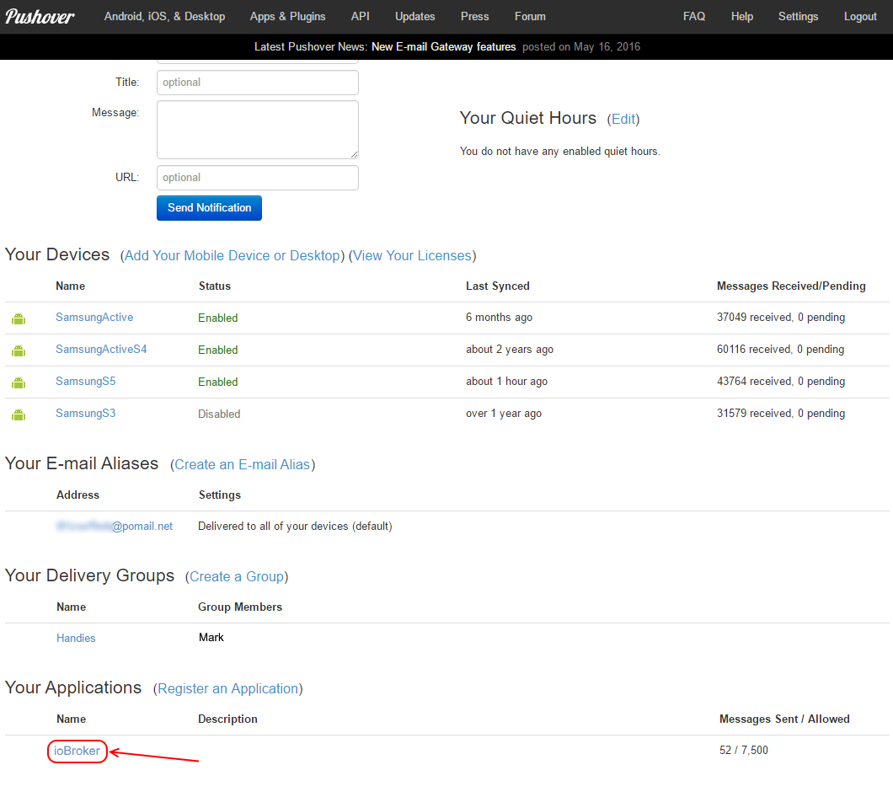
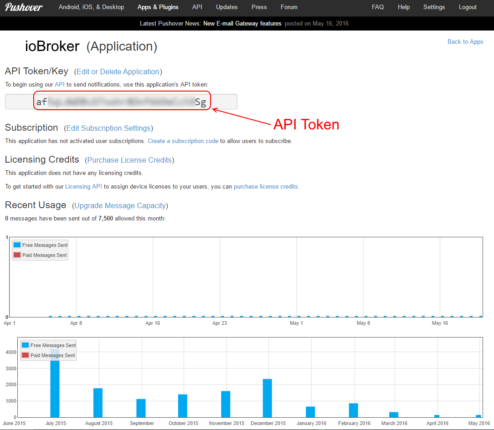

＃ioBroker推入式适配器
从ioBroker发送推送通知。

##配置
首先，需要在推入帐户。





##用法
要从ScriptEngine发送通知，只需编写：

```
// send notification to all instances of pushover adapter
sendTo("pushover", "message body");

// send notification to specific instance of pushover adapter
sendTo("pushover.1", "message body");

// To specify subject or other options
sendTo("pushover", {
   message:  'Test text', // mandatory - your text message
   title:    'SweetHome', // optional  - your message's title, otherwise your app's name is used
   sound:    'magic',     // optional  - the name of one of the sounds supported by device clients to override the user's default sound choice
                          //    pushover, bike, bugle, cashregister, classical, cosmic, falling,
                          //    gamelan, incoming, intermission, magic, mechanical, pianobar, siren,
                          //    spacealarm, tugboat, alien, climb, persistent, echo, updown, none
   priority: -1,          // optional
                          //    -1 to always send as a quiet notification,
                          //    1 to display as high-priority and bypass the user's quiet hours, or
                          //    2 to also require confirmation from the user
   token: 'API/KEY token' // optional
                          // add other than configurated token to the call
   url,                   // optional  - a supplementary URL to show with your message
   url_title,             // optional  - a title for your supplementary URL, otherwise just the URL is shown
   device,                // optional  - your user's device name to send the message directly to that device, rather than all of the user's devices
   timestamp              // optional  - a Unix timestamp of your message's date and time to display to the user, rather than the time your message is received by our API
});
```

## Changelog
### 1.2.0 (2020-02-03)
* (bluefox) Removed the getMessages call.

### 1.1.1 (2019-09-18)
* (Apollon77) js-controller 2.0 compatibility, dependency updates

### 1.1.0 (2018-09-02)
* (bluefox) Admin3 is supported now

### 1.0.4 (2017-10-22)
* (janhuddel) callback is now possible (to receive the receipt from pushover if you use priority = 2)

### 1.0.3 (2017-10-21)
* (Tan-DE) Change priorities in blockly

### 1.0.2 (2016-10-12)
* (bluefox) support of blockly

### 1.0.1 (2016-08-28)
* (bluefox) filter out double messages

### 1.0.0 (2016-06-01)
* (bluefox) fix timestamp
* (bluefox) update grunt packages

### 0.1.1 (2015-05-03)
* (bluefox) add readme link

### 0.1.0 (2015-01-03)
* (bluefox) enable npm install

### 0.0.4 (2014-11-22)
* (bluefox) support of new naming concept

### 0.0.3 (2014-10-08)
* (bluefox) add "daemon" mode to "subscribe"

## License

The MIT License (MIT)

Copyright (c) 2014-2020 bluefox <dogafox@gmail.com>

Permission is hereby granted, free of charge, to any person obtaining a copy
of this software and associated documentation files (the "Software"), to deal
in the Software without restriction, including without limitation the rights
to use, copy, modify, merge, publish, distribute, sublicense, and/or sell
copies of the Software, and to permit persons to whom the Software is
furnished to do so, subject to the following conditions:

The above copyright notice and this permission notice shall be included in
all copies or substantial portions of the Software.

THE SOFTWARE IS PROVIDED "AS IS", WITHOUT WARRANTY OF ANY KIND, EXPRESS OR
IMPLIED, INCLUDING BUT NOT LIMITED TO THE WARRANTIES OF MERCHANTABILITY,
FITNESS FOR A PARTICULAR PURPOSE AND NONINFRINGEMENT. IN NO EVENT SHALL THE
AUTHORS OR COPYRIGHT HOLDERS BE LIABLE FOR ANY CLAIM, DAMAGES OR OTHER
LIABILITY, WHETHER IN AN ACTION OF CONTRACT, TORT OR OTHERWISE, ARISING FROM,
OUT OF OR IN CONNECTION WITH THE SOFTWARE OR THE USE OR OTHER DEALINGS IN
THE SOFTWARE.