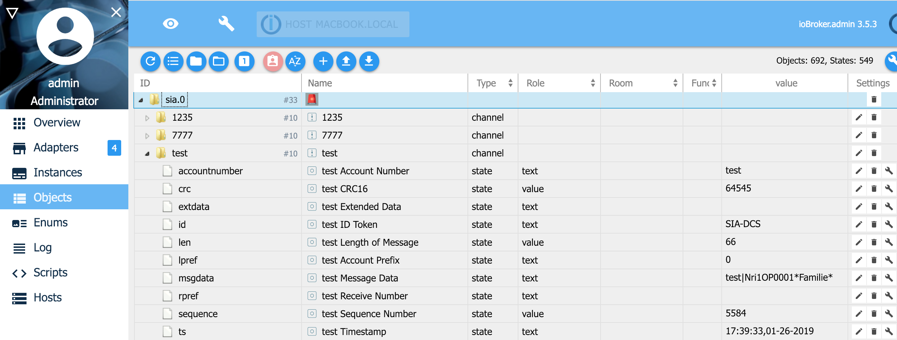

＃ioBroker.sia
==================

需要node.js 6.0或更高版本以及Admin v3！

报警系统使用协议SIA DC-09与中心站通信。

此适配器是SIA服务器。当触发警报事件时，警报系统通过IP将sia消息发送到中心站。
您可以将ioBroker与此适配器一起用作中心站。例如。您可以通过SIA发送电报信息。

[SIA DC-09协议](https://www.yumpu.com/en/document/view/47594214/dc-09-preparing-for-ansi-public-review-security-industry-)

##安装和配置
1.安装适配器
2.适配器的配置：

选择用于侦听SIA请求的IP地址和端口。

注册帐号。如果您使用AES，则必须输入密码（密钥）。密钥长度应为16个，24个或32个字符（字节）。
如果复选框“十六进制格式的AES密码”处于活动状态，则密码长度必须为32,48或64个字符（字节）长。
在字段ACK超时中，您可以定义消息的秒数。如果定义0秒，则不会进行超时验证。

3.配置防盗系统以发送SIA消息

    * Lupusec XT1 + / XT2 / XT2 + / XT3：

Einstellungen  - >联系人ID：ip：// subcriber @ ip-address-iobroker：port / SIA示例：ip：//test@192.168.20.1：50001 / SIA

      

    *其他报警系统：

适配器适用于所有报警系统，支持SIA DC-09协议

4.新航对象/国家

如果您收到SIA消息，您会在状态树中看到它们

## Changelog

### 1.0.1 (05.03.2019)
* (Stübi) Saving password encrypted. 
* (Stübi) ACK and NAC calculation extended.
* (Stübi) CRC can be send in 0xABCD (2 Byte) or ABCD (4 Byte, ASCII) format. Automatic recognizing
* (Stübi) AES Password can be in AES-128-CBC, AES-192-CBC or AES-256-CBC
* (Stübi) AES Password can be saved in byte or hex (length 16, 24 or 32 byte) format or hex (length 32, 48 or 64 hex) format
* (Stübi) Timeout for ACK (0 = disable, 1 - n sec)
* (Stübi) Set ioBroker States of message on ACK not on NACK

### 1.0.0 (05.01.2018)
* (Stübi) Support js-controller compact mode 

### 0.1.8 (27.12.2018)
* (Stübi) Update Adapter Core File

### 0.1.6 (23.10.2018)
* (Stübi) Bugfxing (NAK) and AES support

### 0.1.5 (01.10.2018)
* (Stübi) Translations

### 0.0.5 (09.08.2018)
* (Stübi) Requires nodejs 6.0 or higher

### 0.0.4 (08.06.2018)
* (Stübi) Cleanup

### 0.0.3 (08.06.2018)
* (Stübi) SIA regex optimized

### 0.0.2 (08.06.2018)
* (Stübi) bug fixing

### 0.0.1 (07.06.2018)
* (Stübi) first implementation

## License
The MIT License (MIT)

Copyright (c) 2018 Thorsten <thorsten@stueben.de>

Permission is hereby granted, free of charge, to any person obtaining a copy
of this software and associated documentation files (the "Software"), to deal
in the Software without restriction, including without limitation the rights
to use, copy, modify, merge, publish, distribute, sublicense, and/or sell
copies of the Software, and to permit persons to whom the Software is
furnished to do so, subject to the following conditions:

The above copyright notice and this permission notice shall be included in
all copies or substantial portions of the Software.

THE SOFTWARE IS PROVIDED "AS IS", WITHOUT WARRANTY OF ANY KIND, EXPRESS OR
IMPLIED, INCLUDING BUT NOT LIMITED TO THE WARRANTIES OF MERCHANTABILITY,
FITNESS FOR A PARTICULAR PURPOSE AND NONINFRINGEMENT. IN NO EVENT SHALL THE
AUTHORS OR COPYRIGHT HOLDERS BE LIABLE FOR ANY CLAIM, DAMAGES OR OTHER
LIABILITY, WHETHER IN AN ACTION OF CONTRACT, TORT OR OTHERWISE, ARISING FROM,
OUT OF OR IN CONNECTION WITH THE SOFTWARE OR THE USE OR OTHER DEALINGS IN
THE SOFTWARE.