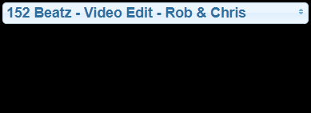

＃ioBroker.spotify-premium
用于访问Spotify播放控件的适配器。由于使用Spotify API，因此需要高级帐户。

与[Spotify Premium API](https://www.spotify.com/)的连接。

##文档
另请参阅[Spotify开发人员API文档](https://developer.spotify.com/)。

###设置/授权
1.登录https://developer.spotify.com/dashboard/
2.创建一个应用程序，您将获得一个客户端ID和一个客户端密钥
3.在创建的Spotify应用程序的应用程序设置中将重定向URI设置为“ http：// localhost”
4.在下面的字段中放入Cliend ID和Client Secret。
5.启动实例
6.切换到“对象”选项卡，并在“ spotify-premium.0.authorization”处按下getAuthorization按钮。
7.将出现的URL从“ spotify-premium.0.authorization.authorizationUrl”复制到您的Web浏览器中，然后调用它
8.您可能需要登录才能发现并授予访问权限
9.浏览器将重定向到无效的URL。如果发生错误“无效的重定向uri”，请验证步骤3
10.复制该网址并将其放入`spotify-premium.0.authorization.authorizationReturnUri`
11.如果一切成功，spotify-premium.0.authorization.authorized中的值将变为true。

#### [影片教学](https://www.youtube.com/watch?v=n0m9201qABU)
[![如何授权]（https://img.youtube.com/vi/n0m9201qABU/0.jpg“ https://www.youtube.com/watch?v=n0m9201qABU”）](https://www.youtube.com/watch?v=n0m9201qABU)

＃＃＃ 状态
所有状态均在admin中进行了描述。

### VIS使用示例
单击以获取小部件源。 

开始一个特定的播放列表 
<pre> <code>[{&quot;tpl&quot;:&quot;tplJquiButtonState&quot;,&quot;data&quot;:{&quot;oid&quot;:&quot;spotify-premium.0.playlists.YourPlaylistName.playThisList&quot;,&quot;g_fixed&quot;:false,&quot;g_visibility&quot;:false,&quot;g_css_font_text&quot;:false,&quot;g_css_background&quot;:false,&quot;g_css_shadow_padding&quot;:false,&quot;g_css_border&quot;:false,&quot;g_gestures&quot;:false,&quot;g_signals&quot;:false,&quot;g_last_change&quot;:false,&quot;visibility-cond&quot;:&quot;==&quot;,&quot;visibility-val&quot;:1,&quot;visibility-groups-action&quot;:&quot;hide&quot;,&quot;buttontext&quot;:&quot;Choose Playlist&quot;,&quot;signals-cond-0&quot;:&quot;==&quot;,&quot;signals-val-0&quot;:true,&quot;signals-icon-0&quot;:&quot;/vis/signals/lowbattery.png&quot;,&quot;signals-icon-size-0&quot;:0,&quot;signals-blink-0&quot;:false,&quot;signals-horz-0&quot;:0,&quot;signals-vert-0&quot;:0,&quot;signals-hide-edit-0&quot;:false,&quot;signals-cond-1&quot;:&quot;==&quot;,&quot;signals-val-1&quot;:true,&quot;signals-icon-1&quot;:&quot;/vis/signals/lowbattery.png&quot;,&quot;signals-icon-size-1&quot;:0,&quot;signals-blink-1&quot;:false,&quot;signals-horz-1&quot;:0,&quot;signals-vert-1&quot;:0,&quot;signals-hide-edit-1&quot;:false,&quot;signals-cond-2&quot;:&quot;==&quot;,&quot;signals-val-2&quot;:true,&quot;signals-icon-2&quot;:&quot;/vis/signals/lowbattery.png&quot;,&quot;signals-icon-size-2&quot;:0,&quot;signals-blink-2&quot;:false,&quot;signals-horz-2&quot;:0,&quot;signals-vert-2&quot;:0,&quot;signals-hide-edit-2&quot;:false,&quot;lc-type&quot;:&quot;last-change&quot;,&quot;lc-is-interval&quot;:true,&quot;lc-is-moment&quot;:false,&quot;lc-format&quot;:&quot;&quot;,&quot;lc-position-vert&quot;:&quot;top&quot;,&quot;lc-position-horz&quot;:&quot;right&quot;,&quot;lc-offset-vert&quot;:0,&quot;lc-offset-horz&quot;:0,&quot;lc-font-size&quot;:&quot;12px&quot;,&quot;lc-font-family&quot;:&quot;&quot;,&quot;lc-font-style&quot;:&quot;&quot;,&quot;lc-bkg-color&quot;:&quot;&quot;,&quot;lc-color&quot;:&quot;&quot;,&quot;lc-border-width&quot;:&quot;0&quot;,&quot;lc-border-style&quot;:&quot;&quot;,&quot;lc-border-color&quot;:&quot;&quot;,&quot;lc-border-radius&quot;:10,&quot;lc-zindex&quot;:0,&quot;value&quot;:&quot;true&quot;,&quot;no_style&quot;:false},&quot;style&quot;:{&quot;left&quot;:&quot;549px&quot;,&quot;top&quot;:&quot;364px&quot;},&quot;widgetSet&quot;:&quot;jqui&quot;}]</code> </pre> 

启动一台特定设备 
<pre> <code>[{&quot;tpl&quot;:&quot;tplJquiButtonState&quot;,&quot;data&quot;:{&quot;oid&quot;:&quot;spotify-premium.0.devices.YourDeviceName.useForPlayback&quot;,&quot;g_fixed&quot;:false,&quot;g_visibility&quot;:false,&quot;g_css_font_text&quot;:false,&quot;g_css_background&quot;:false,&quot;g_css_shadow_padding&quot;:false,&quot;g_css_border&quot;:false,&quot;g_gestures&quot;:false,&quot;g_signals&quot;:false,&quot;g_last_change&quot;:false,&quot;visibility-cond&quot;:&quot;==&quot;,&quot;visibility-val&quot;:1,&quot;visibility-groups-action&quot;:&quot;hide&quot;,&quot;buttontext&quot;:&quot;Choose Device&quot;,&quot;signals-cond-0&quot;:&quot;==&quot;,&quot;signals-val-0&quot;:true,&quot;signals-icon-0&quot;:&quot;/vis/signals/lowbattery.png&quot;,&quot;signals-icon-size-0&quot;:0,&quot;signals-blink-0&quot;:false,&quot;signals-horz-0&quot;:0,&quot;signals-vert-0&quot;:0,&quot;signals-hide-edit-0&quot;:false,&quot;signals-cond-1&quot;:&quot;==&quot;,&quot;signals-val-1&quot;:true,&quot;signals-icon-1&quot;:&quot;/vis/signals/lowbattery.png&quot;,&quot;signals-icon-size-1&quot;:0,&quot;signals-blink-1&quot;:false,&quot;signals-horz-1&quot;:0,&quot;signals-vert-1&quot;:0,&quot;signals-hide-edit-1&quot;:false,&quot;signals-cond-2&quot;:&quot;==&quot;,&quot;signals-val-2&quot;:true,&quot;signals-icon-2&quot;:&quot;/vis/signals/lowbattery.png&quot;,&quot;signals-icon-size-2&quot;:0,&quot;signals-blink-2&quot;:false,&quot;signals-horz-2&quot;:0,&quot;signals-vert-2&quot;:0,&quot;signals-hide-edit-2&quot;:false,&quot;lc-type&quot;:&quot;last-change&quot;,&quot;lc-is-interval&quot;:true,&quot;lc-is-moment&quot;:false,&quot;lc-format&quot;:&quot;&quot;,&quot;lc-position-vert&quot;:&quot;top&quot;,&quot;lc-position-horz&quot;:&quot;right&quot;,&quot;lc-offset-vert&quot;:0,&quot;lc-offset-horz&quot;:0,&quot;lc-font-size&quot;:&quot;12px&quot;,&quot;lc-font-family&quot;:&quot;&quot;,&quot;lc-font-style&quot;:&quot;&quot;,&quot;lc-bkg-color&quot;:&quot;&quot;,&quot;lc-color&quot;:&quot;&quot;,&quot;lc-border-width&quot;:&quot;0&quot;,&quot;lc-border-style&quot;:&quot;&quot;,&quot;lc-border-color&quot;:&quot;&quot;,&quot;lc-border-radius&quot;:10,&quot;lc-zindex&quot;:0,&quot;value&quot;:&quot;true&quot;,&quot;no_style&quot;:false},&quot;style&quot;:{&quot;left&quot;:&quot;549px&quot;,&quot;top&quot;:&quot;364px&quot;},&quot;widgetSet&quot;:&quot;jqui&quot;}]</code> </pre> 

开始玩 
<pre> <code>[{&quot;tpl&quot;:&quot;tplSpotifyPlayButton&quot;,&quot;data&quot;:{&quot;g_fixed&quot;:false,&quot;g_visibility&quot;:false,&quot;g_css_font_text&quot;:false,&quot;g_css_background&quot;:false,&quot;g_css_shadow_padding&quot;:false,&quot;g_css_border&quot;:false,&quot;g_gestures&quot;:false,&quot;g_signals&quot;:false,&quot;g_last_change&quot;:false,&quot;visibility-cond&quot;:&quot;==&quot;,&quot;visibility-val&quot;:1,&quot;visibility-groups-action&quot;:&quot;hide&quot;,&quot;oidplay&quot;:&quot;spotify-premium.0.player.play&quot;,&quot;oidpause&quot;:&quot;spotify-premium.0.player.pause&quot;,&quot;oidstate&quot;:&quot;spotify-premium.0.player.isPlaying&quot;,&quot;colorplay&quot;:&quot;green&quot;,&quot;colorpause&quot;:&quot;green&quot;,&quot;signals-cond-0&quot;:&quot;==&quot;,&quot;signals-val-0&quot;:true,&quot;signals-icon-0&quot;:&quot;/vis/signals/lowbattery.png&quot;,&quot;signals-icon-size-0&quot;:0,&quot;signals-blink-0&quot;:false,&quot;signals-horz-0&quot;:0,&quot;signals-vert-0&quot;:0,&quot;signals-hide-edit-0&quot;:false,&quot;signals-cond-1&quot;:&quot;==&quot;,&quot;signals-val-1&quot;:true,&quot;signals-icon-1&quot;:&quot;/vis/signals/lowbattery.png&quot;,&quot;signals-icon-size-1&quot;:0,&quot;signals-blink-1&quot;:false,&quot;signals-horz-1&quot;:0,&quot;signals-vert-1&quot;:0,&quot;signals-hide-edit-1&quot;:false,&quot;signals-cond-2&quot;:&quot;==&quot;,&quot;signals-val-2&quot;:true,&quot;signals-icon-2&quot;:&quot;/vis/signals/lowbattery.png&quot;,&quot;signals-icon-size-2&quot;:0,&quot;signals-blink-2&quot;:false,&quot;signals-horz-2&quot;:0,&quot;signals-vert-2&quot;:0,&quot;signals-hide-edit-2&quot;:false,&quot;lc-type&quot;:&quot;last-change&quot;,&quot;lc-is-interval&quot;:true,&quot;lc-is-moment&quot;:false,&quot;lc-format&quot;:&quot;&quot;,&quot;lc-position-vert&quot;:&quot;top&quot;,&quot;lc-position-horz&quot;:&quot;right&quot;,&quot;lc-offset-vert&quot;:0,&quot;lc-offset-horz&quot;:0,&quot;lc-font-size&quot;:&quot;12px&quot;,&quot;lc-font-family&quot;:&quot;&quot;,&quot;lc-font-style&quot;:&quot;&quot;,&quot;lc-bkg-color&quot;:&quot;&quot;,&quot;lc-color&quot;:&quot;&quot;,&quot;lc-border-width&quot;:&quot;0&quot;,&quot;lc-border-style&quot;:&quot;&quot;,&quot;lc-border-color&quot;:&quot;&quot;,&quot;lc-border-radius&quot;:10,&quot;lc-zindex&quot;:0},&quot;style&quot;:{&quot;left&quot;:&quot;487px&quot;,&quot;top&quot;:&quot;604px&quot;},&quot;widgetSet&quot;:&quot;spotify-premium&quot;}]</code> </pre> 

播放上一曲 
<pre> <code>[{&quot;tpl&quot;:&quot;tplSpotifyPreviousButton&quot;,&quot;data&quot;:{&quot;g_fixed&quot;:false,&quot;g_visibility&quot;:false,&quot;g_css_font_text&quot;:false,&quot;g_css_background&quot;:false,&quot;g_css_shadow_padding&quot;:false,&quot;g_css_border&quot;:false,&quot;g_gestures&quot;:false,&quot;g_signals&quot;:false,&quot;g_last_change&quot;:false,&quot;visibility-cond&quot;:&quot;==&quot;,&quot;visibility-val&quot;:1,&quot;visibility-groups-action&quot;:&quot;hide&quot;,&quot;oid&quot;:&quot;spotify-premium.0.player.skipMinus&quot;,&quot;colorbox&quot;:&quot;green&quot;,&quot;signals-cond-0&quot;:&quot;==&quot;,&quot;signals-val-0&quot;:true,&quot;signals-icon-0&quot;:&quot;/vis/signals/lowbattery.png&quot;,&quot;signals-icon-size-0&quot;:0,&quot;signals-blink-0&quot;:false,&quot;signals-horz-0&quot;:0,&quot;signals-vert-0&quot;:0,&quot;signals-hide-edit-0&quot;:false,&quot;signals-cond-1&quot;:&quot;==&quot;,&quot;signals-val-1&quot;:true,&quot;signals-icon-1&quot;:&quot;/vis/signals/lowbattery.png&quot;,&quot;signals-icon-size-1&quot;:0,&quot;signals-blink-1&quot;:false,&quot;signals-horz-1&quot;:0,&quot;signals-vert-1&quot;:0,&quot;signals-hide-edit-1&quot;:false,&quot;signals-cond-2&quot;:&quot;==&quot;,&quot;signals-val-2&quot;:true,&quot;signals-icon-2&quot;:&quot;/vis/signals/lowbattery.png&quot;,&quot;signals-icon-size-2&quot;:0,&quot;signals-blink-2&quot;:false,&quot;signals-horz-2&quot;:0,&quot;signals-vert-2&quot;:0,&quot;signals-hide-edit-2&quot;:false,&quot;lc-type&quot;:&quot;last-change&quot;,&quot;lc-is-interval&quot;:true,&quot;lc-is-moment&quot;:false,&quot;lc-format&quot;:&quot;&quot;,&quot;lc-position-vert&quot;:&quot;top&quot;,&quot;lc-position-horz&quot;:&quot;right&quot;,&quot;lc-offset-vert&quot;:0,&quot;lc-offset-horz&quot;:0,&quot;lc-font-size&quot;:&quot;12px&quot;,&quot;lc-font-family&quot;:&quot;&quot;,&quot;lc-font-style&quot;:&quot;&quot;,&quot;lc-bkg-color&quot;:&quot;&quot;,&quot;lc-color&quot;:&quot;&quot;,&quot;lc-border-width&quot;:&quot;0&quot;,&quot;lc-border-style&quot;:&quot;&quot;,&quot;lc-border-color&quot;:&quot;&quot;,&quot;lc-border-radius&quot;:10,&quot;lc-zindex&quot;:0},&quot;style&quot;:{&quot;left&quot;:&quot;386px&quot;,&quot;top&quot;:&quot;604px&quot;},&quot;widgetSet&quot;:&quot;spotify-premium&quot;}]</code> </pre> 

播放下一首曲目 
<pre> <code>[{&quot;tpl&quot;:&quot;tplSpotifyNextButton&quot;,&quot;data&quot;:{&quot;g_fixed&quot;:false,&quot;g_visibility&quot;:false,&quot;g_css_font_text&quot;:false,&quot;g_css_background&quot;:false,&quot;g_css_shadow_padding&quot;:false,&quot;g_css_border&quot;:false,&quot;g_gestures&quot;:false,&quot;g_signals&quot;:false,&quot;g_last_change&quot;:false,&quot;visibility-cond&quot;:&quot;==&quot;,&quot;visibility-val&quot;:1,&quot;visibility-groups-action&quot;:&quot;hide&quot;,&quot;oid&quot;:&quot;spotify-premium.0.player.skipPlus&quot;,&quot;colorbox&quot;:&quot;green&quot;,&quot;signals-cond-0&quot;:&quot;==&quot;,&quot;signals-val-0&quot;:true,&quot;signals-icon-0&quot;:&quot;/vis/signals/lowbattery.png&quot;,&quot;signals-icon-size-0&quot;:0,&quot;signals-blink-0&quot;:false,&quot;signals-horz-0&quot;:0,&quot;signals-vert-0&quot;:0,&quot;signals-hide-edit-0&quot;:false,&quot;signals-cond-1&quot;:&quot;==&quot;,&quot;signals-val-1&quot;:true,&quot;signals-icon-1&quot;:&quot;/vis/signals/lowbattery.png&quot;,&quot;signals-icon-size-1&quot;:0,&quot;signals-blink-1&quot;:false,&quot;signals-horz-1&quot;:0,&quot;signals-vert-1&quot;:0,&quot;signals-hide-edit-1&quot;:false,&quot;signals-cond-2&quot;:&quot;==&quot;,&quot;signals-val-2&quot;:true,&quot;signals-icon-2&quot;:&quot;/vis/signals/lowbattery.png&quot;,&quot;signals-icon-size-2&quot;:0,&quot;signals-blink-2&quot;:false,&quot;signals-horz-2&quot;:0,&quot;signals-vert-2&quot;:0,&quot;signals-hide-edit-2&quot;:false,&quot;lc-type&quot;:&quot;last-change&quot;,&quot;lc-is-interval&quot;:true,&quot;lc-is-moment&quot;:false,&quot;lc-format&quot;:&quot;&quot;,&quot;lc-position-vert&quot;:&quot;top&quot;,&quot;lc-position-horz&quot;:&quot;right&quot;,&quot;lc-offset-vert&quot;:0,&quot;lc-offset-horz&quot;:0,&quot;lc-font-size&quot;:&quot;12px&quot;,&quot;lc-font-family&quot;:&quot;&quot;,&quot;lc-font-style&quot;:&quot;&quot;,&quot;lc-bkg-color&quot;:&quot;&quot;,&quot;lc-color&quot;:&quot;&quot;,&quot;lc-border-width&quot;:&quot;0&quot;,&quot;lc-border-style&quot;:&quot;&quot;,&quot;lc-border-color&quot;:&quot;&quot;,&quot;lc-border-radius&quot;:10,&quot;lc-zindex&quot;:0},&quot;style&quot;:{&quot;left&quot;:&quot;588px&quot;,&quot;top&quot;:&quot;604px&quot;},&quot;widgetSet&quot;:&quot;spotify-premium&quot;}]</code> </pre> 

控制重复 
<pre> <code>[{&quot;tpl&quot;:&quot;tplSpotifyRepeatButton&quot;,&quot;data&quot;:{&quot;g_fixed&quot;:false,&quot;g_visibility&quot;:false,&quot;g_css_font_text&quot;:false,&quot;g_css_background&quot;:false,&quot;g_css_shadow_padding&quot;:false,&quot;g_css_border&quot;:false,&quot;g_gestures&quot;:false,&quot;g_signals&quot;:false,&quot;g_last_change&quot;:false,&quot;visibility-cond&quot;:&quot;==&quot;,&quot;visibility-val&quot;:1,&quot;visibility-groups-action&quot;:&quot;hide&quot;,&quot;oidall&quot;:&quot;spotify-premium.0.player.repeatContext&quot;,&quot;oidoff&quot;:&quot;spotify-premium.0.player.repeatOff&quot;,&quot;oidone&quot;:&quot;spotify-premium.0.player.repeatTrack&quot;,&quot;oidstate&quot;:&quot;spotify-premium.0.player.repeat&quot;,&quot;coloroff&quot;:&quot;white&quot;,&quot;colorall&quot;:&quot;green&quot;,&quot;colorone&quot;:&quot;green&quot;,&quot;signals-cond-0&quot;:&quot;==&quot;,&quot;signals-val-0&quot;:true,&quot;signals-icon-0&quot;:&quot;/vis/signals/lowbattery.png&quot;,&quot;signals-icon-size-0&quot;:0,&quot;signals-blink-0&quot;:false,&quot;signals-horz-0&quot;:0,&quot;signals-vert-0&quot;:0,&quot;signals-hide-edit-0&quot;:false,&quot;signals-cond-1&quot;:&quot;==&quot;,&quot;signals-val-1&quot;:true,&quot;signals-icon-1&quot;:&quot;/vis/signals/lowbattery.png&quot;,&quot;signals-icon-size-1&quot;:0,&quot;signals-blink-1&quot;:false,&quot;signals-horz-1&quot;:0,&quot;signals-vert-1&quot;:0,&quot;signals-hide-edit-1&quot;:false,&quot;signals-cond-2&quot;:&quot;==&quot;,&quot;signals-val-2&quot;:true,&quot;signals-icon-2&quot;:&quot;/vis/signals/lowbattery.png&quot;,&quot;signals-icon-size-2&quot;:0,&quot;signals-blink-2&quot;:false,&quot;signals-horz-2&quot;:0,&quot;signals-vert-2&quot;:0,&quot;signals-hide-edit-2&quot;:false,&quot;lc-type&quot;:&quot;last-change&quot;,&quot;lc-is-interval&quot;:true,&quot;lc-is-moment&quot;:false,&quot;lc-format&quot;:&quot;&quot;,&quot;lc-position-vert&quot;:&quot;top&quot;,&quot;lc-position-horz&quot;:&quot;right&quot;,&quot;lc-offset-vert&quot;:0,&quot;lc-offset-horz&quot;:0,&quot;lc-font-size&quot;:&quot;12px&quot;,&quot;lc-font-family&quot;:&quot;&quot;,&quot;lc-font-style&quot;:&quot;&quot;,&quot;lc-bkg-color&quot;:&quot;&quot;,&quot;lc-color&quot;:&quot;&quot;,&quot;lc-border-width&quot;:&quot;0&quot;,&quot;lc-border-style&quot;:&quot;&quot;,&quot;lc-border-color&quot;:&quot;&quot;,&quot;lc-border-radius&quot;:10,&quot;lc-zindex&quot;:0},&quot;style&quot;:{&quot;left&quot;:&quot;689px&quot;,&quot;top&quot;:&quot;614px&quot;,&quot;width&quot;:&quot;48px&quot;,&quot;height&quot;:&quot;56px&quot;},&quot;widgetSet&quot;:&quot;spotify-premium&quot;}]</code> </pre> 

控制随机播放 
<pre> <code>[{&quot;tpl&quot;:&quot;tplSpotifyShuffleButton&quot;,&quot;data&quot;:{&quot;g_fixed&quot;:false,&quot;g_visibility&quot;:false,&quot;g_css_font_text&quot;:false,&quot;g_css_background&quot;:false,&quot;g_css_shadow_padding&quot;:false,&quot;g_css_border&quot;:false,&quot;g_gestures&quot;:false,&quot;g_signals&quot;:false,&quot;g_last_change&quot;:false,&quot;visibility-cond&quot;:&quot;==&quot;,&quot;visibility-val&quot;:1,&quot;visibility-groups-action&quot;:&quot;hide&quot;,&quot;oidon&quot;:&quot;spotify-premium.0.player.shuffleOn&quot;,&quot;oidoff&quot;:&quot;spotify-premium.0.player.shuffleOff&quot;,&quot;oidstate&quot;:&quot;spotify-premium.0.player.shuffle&quot;,&quot;coloroff&quot;:&quot;white&quot;,&quot;coloron&quot;:&quot;green&quot;,&quot;signals-cond-0&quot;:&quot;==&quot;,&quot;signals-val-0&quot;:true,&quot;signals-icon-0&quot;:&quot;/vis/signals/lowbattery.png&quot;,&quot;signals-icon-size-0&quot;:0,&quot;signals-blink-0&quot;:false,&quot;signals-horz-0&quot;:0,&quot;signals-vert-0&quot;:0,&quot;signals-hide-edit-0&quot;:false,&quot;signals-cond-1&quot;:&quot;==&quot;,&quot;signals-val-1&quot;:true,&quot;signals-icon-1&quot;:&quot;/vis/signals/lowbattery.png&quot;,&quot;signals-icon-size-1&quot;:0,&quot;signals-blink-1&quot;:false,&quot;signals-horz-1&quot;:0,&quot;signals-vert-1&quot;:0,&quot;signals-hide-edit-1&quot;:false,&quot;signals-cond-2&quot;:&quot;==&quot;,&quot;signals-val-2&quot;:true,&quot;signals-icon-2&quot;:&quot;/vis/signals/lowbattery.png&quot;,&quot;signals-icon-size-2&quot;:0,&quot;signals-blink-2&quot;:false,&quot;signals-horz-2&quot;:0,&quot;signals-vert-2&quot;:0,&quot;signals-hide-edit-2&quot;:false,&quot;lc-type&quot;:&quot;last-change&quot;,&quot;lc-is-interval&quot;:true,&quot;lc-is-moment&quot;:false,&quot;lc-format&quot;:&quot;&quot;,&quot;lc-position-vert&quot;:&quot;top&quot;,&quot;lc-position-horz&quot;:&quot;right&quot;,&quot;lc-offset-vert&quot;:0,&quot;lc-offset-horz&quot;:0,&quot;lc-font-size&quot;:&quot;12px&quot;,&quot;lc-font-family&quot;:&quot;&quot;,&quot;lc-font-style&quot;:&quot;&quot;,&quot;lc-bkg-color&quot;:&quot;&quot;,&quot;lc-color&quot;:&quot;&quot;,&quot;lc-border-width&quot;:&quot;0&quot;,&quot;lc-border-style&quot;:&quot;&quot;,&quot;lc-border-color&quot;:&quot;&quot;,&quot;lc-border-radius&quot;:10,&quot;lc-zindex&quot;:0},&quot;style&quot;:{&quot;left&quot;:&quot;319px&quot;,&quot;top&quot;:&quot;622px&quot;,&quot;width&quot;:&quot;38px&quot;,&quot;height&quot;:&quot;40px&quot;},&quot;widgetSet&quot;:&quot;spotify-premium&quot;}]</code> </pre> 

上下文图片 
<pre> <code>[{&quot;tpl&quot;:&quot;tplValueStringImg&quot;,&quot;data&quot;:{&quot;oid&quot;:&quot;spotify-premium.0.player.contextImageUrl&quot;,&quot;g_fixed&quot;:false,&quot;g_visibility&quot;:false,&quot;g_css_font_text&quot;:false,&quot;g_css_background&quot;:false,&quot;g_css_shadow_padding&quot;:false,&quot;g_css_border&quot;:false,&quot;g_gestures&quot;:false,&quot;g_signals&quot;:false,&quot;g_last_change&quot;:false,&quot;visibility-cond&quot;:&quot;==&quot;,&quot;visibility-val&quot;:1,&quot;visibility-groups-action&quot;:&quot;hide&quot;,&quot;refreshInterval&quot;:&quot;0&quot;,&quot;signals-cond-0&quot;:&quot;==&quot;,&quot;signals-val-0&quot;:true,&quot;signals-icon-0&quot;:&quot;/vis/signals/lowbattery.png&quot;,&quot;signals-icon-size-0&quot;:0,&quot;signals-blink-0&quot;:false,&quot;signals-horz-0&quot;:0,&quot;signals-vert-0&quot;:0,&quot;signals-hide-edit-0&quot;:false,&quot;signals-cond-1&quot;:&quot;==&quot;,&quot;signals-val-1&quot;:true,&quot;signals-icon-1&quot;:&quot;/vis/signals/lowbattery.png&quot;,&quot;signals-icon-size-1&quot;:0,&quot;signals-blink-1&quot;:false,&quot;signals-horz-1&quot;:0,&quot;signals-vert-1&quot;:0,&quot;signals-hide-edit-1&quot;:false,&quot;signals-cond-2&quot;:&quot;==&quot;,&quot;signals-val-2&quot;:true,&quot;signals-icon-2&quot;:&quot;/vis/signals/lowbattery.png&quot;,&quot;signals-icon-size-2&quot;:0,&quot;signals-blink-2&quot;:false,&quot;signals-horz-2&quot;:0,&quot;signals-vert-2&quot;:0,&quot;signals-hide-edit-2&quot;:false,&quot;lc-type&quot;:&quot;last-change&quot;,&quot;lc-is-interval&quot;:true,&quot;lc-is-moment&quot;:false,&quot;lc-format&quot;:&quot;&quot;,&quot;lc-position-vert&quot;:&quot;top&quot;,&quot;lc-position-horz&quot;:&quot;right&quot;,&quot;lc-offset-vert&quot;:0,&quot;lc-offset-horz&quot;:0,&quot;lc-font-size&quot;:&quot;12px&quot;,&quot;lc-font-family&quot;:&quot;&quot;,&quot;lc-font-style&quot;:&quot;&quot;,&quot;lc-bkg-color&quot;:&quot;&quot;,&quot;lc-color&quot;:&quot;&quot;,&quot;lc-border-width&quot;:&quot;0&quot;,&quot;lc-border-style&quot;:&quot;&quot;,&quot;lc-border-color&quot;:&quot;&quot;,&quot;lc-border-radius&quot;:10,&quot;lc-zindex&quot;:0},&quot;style&quot;:{&quot;left&quot;:&quot;338px&quot;,&quot;top&quot;:&quot;131px&quot;,&quot;width&quot;:&quot;122px&quot;,&quot;height&quot;:&quot;122px&quot;},&quot;widgetSet&quot;:&quot;basic&quot;}]</code> </pre> 

选择当前播放列表的曲目 
<pre> <code>[{&quot;tpl&quot;:&quot;tplJquiSelectList&quot;,&quot;data&quot;:{&quot;oid&quot;:&quot;spotify-premium.0.player.playlist.trackList&quot;,&quot;g_fixed&quot;:false,&quot;g_visibility&quot;:false,&quot;g_css_font_text&quot;:false,&quot;g_css_background&quot;:false,&quot;g_css_shadow_padding&quot;:false,&quot;g_css_border&quot;:false,&quot;g_gestures&quot;:false,&quot;g_signals&quot;:false,&quot;g_last_change&quot;:false,&quot;visibility-cond&quot;:&quot;==&quot;,&quot;visibility-val&quot;:1,&quot;visibility-groups-action&quot;:&quot;hide&quot;,&quot;values&quot;:&quot;{spotify-premium.0.player.playlist.trackListNumber}&quot;,&quot;texts&quot;:&quot;{spotify-premium.0.player.playlist.trackListString}&quot;,&quot;height&quot;:&quot;100&quot;,&quot;signals-cond-0&quot;:&quot;==&quot;,&quot;signals-val-0&quot;:true,&quot;signals-icon-0&quot;:&quot;/vis/signals/lowbattery.png&quot;,&quot;signals-icon-size-0&quot;:0,&quot;signals-blink-0&quot;:false,&quot;signals-horz-0&quot;:0,&quot;signals-vert-0&quot;:0,&quot;signals-hide-edit-0&quot;:false,&quot;signals-cond-1&quot;:&quot;==&quot;,&quot;signals-val-1&quot;:true,&quot;signals-icon-1&quot;:&quot;/vis/signals/lowbattery.png&quot;,&quot;signals-icon-size-1&quot;:0,&quot;signals-blink-1&quot;:false,&quot;signals-horz-1&quot;:0,&quot;signals-vert-1&quot;:0,&quot;signals-hide-edit-1&quot;:false,&quot;signals-cond-2&quot;:&quot;==&quot;,&quot;signals-val-2&quot;:true,&quot;signals-icon-2&quot;:&quot;/vis/signals/lowbattery.png&quot;,&quot;signals-icon-size-2&quot;:0,&quot;signals-blink-2&quot;:false,&quot;signals-horz-2&quot;:0,&quot;signals-vert-2&quot;:0,&quot;signals-hide-edit-2&quot;:false,&quot;lc-type&quot;:&quot;last-change&quot;,&quot;lc-is-interval&quot;:true,&quot;lc-is-moment&quot;:false,&quot;lc-format&quot;:&quot;&quot;,&quot;lc-position-vert&quot;:&quot;top&quot;,&quot;lc-position-horz&quot;:&quot;right&quot;,&quot;lc-offset-vert&quot;:0,&quot;lc-offset-horz&quot;:0,&quot;lc-font-size&quot;:&quot;12px&quot;,&quot;lc-font-family&quot;:&quot;&quot;,&quot;lc-font-style&quot;:&quot;&quot;,&quot;lc-bkg-color&quot;:&quot;&quot;,&quot;lc-color&quot;:&quot;&quot;,&quot;lc-border-width&quot;:&quot;0&quot;,&quot;lc-border-style&quot;:&quot;&quot;,&quot;lc-border-color&quot;:&quot;&quot;,&quot;lc-border-radius&quot;:10,&quot;lc-zindex&quot;:0},&quot;style&quot;:{&quot;left&quot;:&quot;505px&quot;,&quot;top&quot;:&quot;369px&quot;},&quot;widgetSet&quot;:&quot;jqui&quot;}]</code> </pre> 

开关装置 
<pre> <code>[{&quot;tpl&quot;:&quot;tplJquiSelectList&quot;,&quot;data&quot;:{&quot;oid&quot;:&quot;spotify-premium.0.devices.deviceList&quot;,&quot;g_fixed&quot;:false,&quot;g_visibility&quot;:false,&quot;g_css_font_text&quot;:false,&quot;g_css_background&quot;:false,&quot;g_css_shadow_padding&quot;:false,&quot;g_css_border&quot;:false,&quot;g_gestures&quot;:false,&quot;g_signals&quot;:false,&quot;g_last_change&quot;:false,&quot;visibility-cond&quot;:&quot;==&quot;,&quot;visibility-val&quot;:1,&quot;visibility-groups-action&quot;:&quot;hide&quot;,&quot;values&quot;:&quot;{spotify-premium.0.devices.availableDeviceListIds}&quot;,&quot;texts&quot;:&quot;{spotify-premium.0.devices.availableDeviceListString}&quot;,&quot;height&quot;:&quot;100&quot;,&quot;signals-cond-0&quot;:&quot;==&quot;,&quot;signals-val-0&quot;:true,&quot;signals-icon-0&quot;:&quot;/vis/signals/lowbattery.png&quot;,&quot;signals-icon-size-0&quot;:0,&quot;signals-blink-0&quot;:false,&quot;signals-horz-0&quot;:0,&quot;signals-vert-0&quot;:0,&quot;signals-hide-edit-0&quot;:false,&quot;signals-cond-1&quot;:&quot;==&quot;,&quot;signals-val-1&quot;:true,&quot;signals-icon-1&quot;:&quot;/vis/signals/lowbattery.png&quot;,&quot;signals-icon-size-1&quot;:0,&quot;signals-blink-1&quot;:false,&quot;signals-horz-1&quot;:0,&quot;signals-vert-1&quot;:0,&quot;signals-hide-edit-1&quot;:false,&quot;signals-cond-2&quot;:&quot;==&quot;,&quot;signals-val-2&quot;:true,&quot;signals-icon-2&quot;:&quot;/vis/signals/lowbattery.png&quot;,&quot;signals-icon-size-2&quot;:0,&quot;signals-blink-2&quot;:false,&quot;signals-horz-2&quot;:0,&quot;signals-vert-2&quot;:0,&quot;signals-hide-edit-2&quot;:false,&quot;lc-type&quot;:&quot;last-change&quot;,&quot;lc-is-interval&quot;:true,&quot;lc-is-moment&quot;:false,&quot;lc-format&quot;:&quot;&quot;,&quot;lc-position-vert&quot;:&quot;top&quot;,&quot;lc-position-horz&quot;:&quot;right&quot;,&quot;lc-offset-vert&quot;:0,&quot;lc-offset-horz&quot;:0,&quot;lc-font-size&quot;:&quot;12px&quot;,&quot;lc-font-family&quot;:&quot;&quot;,&quot;lc-font-style&quot;:&quot;&quot;,&quot;lc-bkg-color&quot;:&quot;&quot;,&quot;lc-color&quot;:&quot;&quot;,&quot;lc-border-width&quot;:&quot;0&quot;,&quot;lc-border-style&quot;:&quot;&quot;,&quot;lc-border-color&quot;:&quot;&quot;,&quot;lc-border-radius&quot;:10,&quot;lc-zindex&quot;:0},&quot;style&quot;:{&quot;left&quot;:&quot;578px&quot;,&quot;top&quot;:&quot;378px&quot;},&quot;widgetSet&quot;:&quot;jqui&quot;}]</code> </pre> 

切换播放列表 
<pre> <code>[{&quot;tpl&quot;:&quot;tplJquiSelectList&quot;,&quot;data&quot;:{&quot;oid&quot;:&quot;spotify-premium.0.playlists.playlistList&quot;,&quot;g_fixed&quot;:false,&quot;g_visibility&quot;:false,&quot;g_css_font_text&quot;:false,&quot;g_css_background&quot;:false,&quot;g_css_shadow_padding&quot;:false,&quot;g_css_border&quot;:false,&quot;g_gestures&quot;:false,&quot;g_signals&quot;:false,&quot;g_last_change&quot;:false,&quot;visibility-cond&quot;:&quot;==&quot;,&quot;visibility-val&quot;:1,&quot;visibility-groups-action&quot;:&quot;hide&quot;,&quot;values&quot;:&quot;{spotify-premium.0.playlists.playlistListIds}&quot;,&quot;texts&quot;:&quot;{spotify-premium.0.playlists.playlistListString}&quot;,&quot;height&quot;:&quot;100&quot;,&quot;signals-cond-0&quot;:&quot;==&quot;,&quot;signals-val-0&quot;:true,&quot;signals-icon-0&quot;:&quot;/vis/signals/lowbattery.png&quot;,&quot;signals-icon-size-0&quot;:0,&quot;signals-blink-0&quot;:false,&quot;signals-horz-0&quot;:0,&quot;signals-vert-0&quot;:0,&quot;signals-hide-edit-0&quot;:false,&quot;signals-cond-1&quot;:&quot;==&quot;,&quot;signals-val-1&quot;:true,&quot;signals-icon-1&quot;:&quot;/vis/signals/lowbattery.png&quot;,&quot;signals-icon-size-1&quot;:0,&quot;signals-blink-1&quot;:false,&quot;signals-horz-1&quot;:0,&quot;signals-vert-1&quot;:0,&quot;signals-hide-edit-1&quot;:false,&quot;signals-cond-2&quot;:&quot;==&quot;,&quot;signals-val-2&quot;:true,&quot;signals-icon-2&quot;:&quot;/vis/signals/lowbattery.png&quot;,&quot;signals-icon-size-2&quot;:0,&quot;signals-blink-2&quot;:false,&quot;signals-horz-2&quot;:0,&quot;signals-vert-2&quot;:0,&quot;signals-hide-edit-2&quot;:false,&quot;lc-type&quot;:&quot;last-change&quot;,&quot;lc-is-interval&quot;:true,&quot;lc-is-moment&quot;:false,&quot;lc-format&quot;:&quot;&quot;,&quot;lc-position-vert&quot;:&quot;top&quot;,&quot;lc-position-horz&quot;:&quot;right&quot;,&quot;lc-offset-vert&quot;:0,&quot;lc-offset-horz&quot;:0,&quot;lc-font-size&quot;:&quot;12px&quot;,&quot;lc-font-family&quot;:&quot;&quot;,&quot;lc-font-style&quot;:&quot;&quot;,&quot;lc-bkg-color&quot;:&quot;&quot;,&quot;lc-color&quot;:&quot;&quot;,&quot;lc-border-width&quot;:&quot;0&quot;,&quot;lc-border-style&quot;:&quot;&quot;,&quot;lc-border-color&quot;:&quot;&quot;,&quot;lc-border-radius&quot;:10,&quot;lc-zindex&quot;:0},&quot;style&quot;:{&quot;left&quot;:&quot;571px&quot;,&quot;top&quot;:&quot;509px&quot;},&quot;widgetSet&quot;:&quot;jqui&quot;}]</code> </pre> 

## Changelog

### 1.1.0 (in dev)
* (twonky) added control widgets
* (twonky) added compact mode
* (Apollon77) Core Files/Testing Update and introduce adapter-core
* (twonky) added state `player.playUri` to support user defined input

### 1.0.0 (2018.12.18)
* (twonky) `playbackInfo` and `player` merged together to `player`
* (twonky) `player.volume` moved to `player.device.volume`
* (twonky) The `duration` format of `player.playlist.trackListArray` and `playlists.[playListName].trackListArray` was changed from milliseconds to time (MM:SS) and a new one was created for this `durationMs`.
* (twonky) The `album` of `player.playlist.trackListArray` and `playlists.[playListName].trackListArray` was changed to `artistName` and `artistArray`.
* (twonky) Several data was added to `player.playlist.trackListArray` and `playlists.[playListName].trackListArray`: `album`, `addedAt`, `addedBy`, `discNumber`, `episode`, `explicit` and `popularity`
* (twonky) change `player.playlist.trackNo` to start with 1 (0-based before)
* (twonky) performance optimization (states/objects are only set on change)
* (twonky) html lists added: `html.devices`, `html.playlists` and `html.tracks`
* (twonky) new icons

### 0.3.1 (2018.06.20)
* (twonky) Fix: state playlists.playlistList doesn't refresh after the playlist changed via app

### 0.3.0 (2018.05.31)
* (twonky) Change playlist and device state names from name to id
* (twonky) New states for device selection: `devices.deviceList`, `devices.deviceListIds`, `devices.deviceListString`, `devices.availableDeviceListIds`, `devices.availableDeviceListString`
* (twonky) New states for playlist selection: `playlists.playlistList`, `playlists.playlistListIds`, `playlists.playlistListString`, `playlists.yourPlaylistListIds`, `playlists.yourPlaylistListString`
* (twonky) Add option to avoid shuffle state reset on some devices after starting a playlist

### 0.2.5 (2018.05.24)
* (twonky) Fix: `playlists.YourPlaylistName.playThisList` starts always with second track

### 0.2.4 (2018.05.17)
* (twonky) remove special character ("'*) from device and playlist state names

### 0.2.3 (2018.05.17)
* (twonky) remove special character (,?[]) from device and playlist state names

### 0.2.2 (2018.05.16)
* (twonky) `playbackInfo.playlist.track*` States are only reset when changed; stop flickering of tracks SelectList (example "Choose track of current playlist")

### 0.2.1 (2018.05.14)
* (twonky) change state `player.shuffle` to string with possible values "on" and "off"

### 0.2.0 (2018.05.13)
* (twonky) removed support for deprecated state `PlaybackInfo.image_url`
* (twonky) all states improved and proper descriptions added

### 0.1.3 (2018.04.28)
* (twonky) fix spotify api change

### 0.1.2 (2018.04.10)
* (twonky) automatic updating of devices and playlists (configurable in the adapter)
* (twonky) new state `Devices.DEVICE.is_available` indicates if a device is available
* (twonky) shows warning message http 202 only as debug and only one time
* (twonky) the States `Player.Shuffle`,` Player.Playlist_ID`, `Player.TrackId` and` Player.Volume` also show the current value
* (twonky) new states `Playlists.PLAYLISTNAME.image_url`,` PlaybackInfo.Playlist_image_url`, `PlaybackInfo.Album_image_url`
* (twonky) marks the state `PlaybackInfo.image_url` as deprecated. Will not be included in a new installation and will not be updated in future versions
* (twonky) changing the State `Playlists.PLAYLISTNAME.Track_ID` now works like in Lucky's script

### 0.1.1 (2018.03.03)
* (twonky) fix several small issues

### 0.1.0 (2018.02.23)
* (twonky) rework api polling mechanism

### 0.0.9 (2018.02.21)
* (twonky) new state `PlaybackInfo.repeat` with possible values: off, context, track
* (twonky) new state `PlaybackInfo.shuffle` with possible values: true, false
* (twonky) states for the playing device will also updated in 5s intervals
* (twonky) states in `PlaybackInfo` are now updated also if no device is active playing
* (twonky) states in `PlaybackInfo` are now cleared if no device is available
* (twonky) loading new playlists if playing the first time

### 0.0.8 (2018.02.20)
* (twonky) new adapter option to delete no longer existing devices and playlists
* (twonky) load complete playlists (limitation of 100 first tracks was removed)

### 0.0.7 (2018.02.16)
* (twonky) fix: auto refresh token

### 0.0.6 (2018.02.16)
* (twonky) fix: playlist loading

### 0.0.5 (2018.02.16)
* (twonky) fix: fatal error if no open player

### 0.0.4 (2018.02.16)
* (twonky) check configuration
* (twonky) fix: adapter configuration in admin2
* (twonky) fix: restart after authorization need

### 0.0.3 (2018.02.15)
* (wendy2702) improved manual

### 0.0.2 (2018.02.11)
* (twonky) merge original script v0.5.3 by [Lucky](http://forum.iobroker.net/viewtopic.php?f=21&t=8173)

### 0.0.1 (2018.02.07)
* (twonky) initial adapter, original script v0.5.1 by [Lucky](http://forum.iobroker.net/viewtopic.php?f=21&t=8173)

## License
The MIT License (MIT)

Copyright (c) 2019 Alexander Kose <twonky4@gmx.de>

Permission is hereby granted, free of charge, to any person obtaining a copy
of this software and associated documentation files (the "Software"), to deal
in the Software without restriction, including without limitation the rights
to use, copy, modify, merge, publish, distribute, sublicense, and/or sell
copies of the Software, and to permit persons to whom the Software is
furnished to do so, subject to the following conditions:

The above copyright notice and this permission notice shall be included in
all copies or substantial portions of the Software.

THE SOFTWARE IS PROVIDED "AS IS", WITHOUT WARRANTY OF ANY KIND, EXPRESS OR
IMPLIED, INCLUDING BUT NOT LIMITED TO THE WARRANTIES OF MERCHANTABILITY,
FITNESS FOR A PARTICULAR PURPOSE AND NONINFRINGEMENT. IN NO EVENT SHALL THE
AUTHORS OR COPYRIGHT HOLDERS BE LIABLE FOR ANY CLAIM, DAMAGES OR OTHER
LIABILITY, WHETHER IN AN ACTION OF CONTRACT, TORT OR OTHERWISE, ARISING FROM,
OUT OF OR IN CONNECTION WITH THE SOFTWARE OR THE USE OR OTHER DEALINGS IN
THE SOFTWARE.