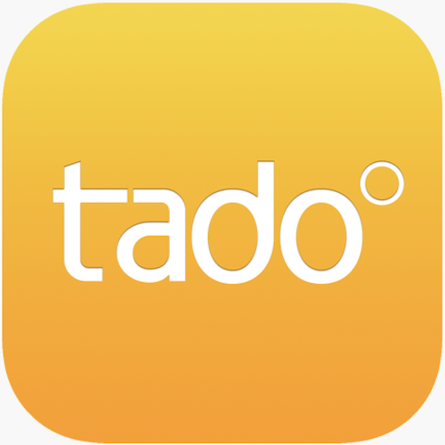

＃ioBroker.tado

## Tado ioBroker适配器
tado°确保舒适健康的气候，同时节省多达31％的暖气费用。

＃＃ 支持我
如果您喜欢我的工作，请随时提供个人捐款（这是DutchmanNL的个人捐款链接，与ioBroker项目无关！[![捐赠]（https://raw.githubusercontent.com/iobroker-community-adapters/ioBroker.tado/master/admin/button.png）](http://paypal.me/DutchmanNL)]

## Changelog

### 0.1.5  
* (DutchmanNL) Fix switching on/off heating & related auto mode
* (DutchmanNL) Fix switching some incorrect logging

### 0.1.4 Fixed Clear Overlay, Open Window & log error's
* (DutchmanNL) Fixed Clear Overlay to Boolean
* (DutchmanNL) Fixed datapoints for OpenWindow 
* (DutchmanNL) Fixed setting overlay correctly for manuel temperature changes (use previous setting instead of always manual)
* (DutchmanNL) Fixed error message Cannot read property 'percentage' of undefined"

### 0.1.3 Several fixes for reported error's
* (DutchmanNL) boilerId / onDemandLogRetrievalEnabled / openWindowDetected / onDemandLogRetrievalEnabled
* (DutchmanNL) Open Window detection implemented, only by device not by room

### 0.1.2 Bug fix
* (DutchmanNL) Room temperature setting (overlay) fixed

### 0.1.1 Write API information to states
* (DutchmanNL) Write API information to states
* (DutchmanNL) Keep temperature settings (do not reset to NULL)

### 0.1.0 Release public Beta & Implement heating on / off
* (DutchmanNL) Release public Beta
* (DutchmanNL) Implement heating on / off

### 0.0.9 Implemented room temperature settings
* (DutchmanNL) Capability to change room temperature
* (DutchmanNL) small code fixes

### 0.0.8 Implement overlay clear states & control
* (DutchmanNL) implement capability to reset running polling timer
* (DutchmanNL) implement clear overlay
* (DutchmanNL) execute polling after overlay clear
* (DutchmanNL) reset states to NULL when polling time * 2 no data is received

### 0.0.7 Improve overlay states
* (DutchmanNL) improve overlay states  (https://github.com/iobroker-community-adapters/ioBroker.tado/issues/1)

### 0.0.6 Implemented away status
* (DutchmanNL) Implemented away status
* (DutchmanNL) fixed issue in state reading
* (DutchmanNL) updated some attributes

### 0.0.5 Public beta, released to latest repository
* (DutchmanNL) add library to handle propper state and attribute creation
* (DutchmanNL) beta release to latest repository
* (DutchmanNL) released on NPM (installable by admin)

### 0.0.3 
* (DutchmanNL) implement all zone states & data refresh intervall

### 0.0.2
* (DutchmanNL) Alpha, read zones, their devices and related states

### 0.0.1
* (DutchmanNL) Alpha, read account and mobile device information

## License
MIT License

Copyright (c) 2019 DutchmanNL <rdrozda@hotmail.com>

Permission is hereby granted, free of charge, to any person obtaining a copy
of this software and associated documentation files (the "Software"), to deal
in the Software without restriction, including without limitation the rights
to use, copy, modify, merge, publish, distribute, sublicense, and/or sell
copies of the Software, and to permit persons to whom the Software is
furnished to do so, subject to the following conditions:

The above copyright notice and this permission notice shall be included in all
copies or substantial portions of the Software.

THE SOFTWARE IS PROVIDED "AS IS", WITHOUT WARRANTY OF ANY KIND, EXPRESS OR
IMPLIED, INCLUDING BUT NOT LIMITED TO THE WARRANTIES OF MERCHANTABILITY,
FITNESS FOR A PARTICULAR PURPOSE AND NONINFRINGEMENT. IN NO EVENT SHALL THE
AUTHORS OR COPYRIGHT HOLDERS BE LIABLE FOR ANY CLAIM, DAMAGES OR OTHER
LIABILITY, WHETHER IN AN ACTION OF CONTRACT, TORT OR OTHERWISE, ARISING FROM,
OUT OF OR IN CONNECTION WITH THE SOFTWARE OR THE USE OR OTHER DEALINGS IN THE
SOFTWARE.