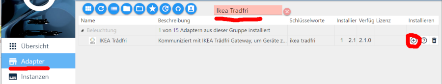
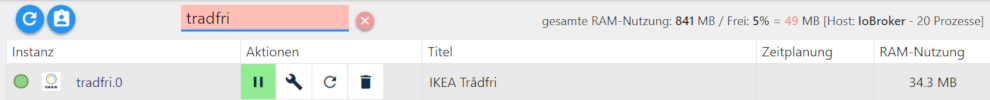

--- local：true ---

#Ikea tradfri适配器
## Tradfri
Tradfri是宜家的SmartHome系统。目前，该系统包括各种组件：

 - 灯（灯）
 - 用于墙壁和橱柜/橱柜门的LED面板/模制品
 - 运动检测器
 - 窗户百叶窗
 - 遥控器
 - 中央门户

因此，Tradfri系统是市场上最全面的SmartHome组件系统之一。

##使用Tradfri和ioBroker的要求
 -  RaspberryPi 3型号B +
 -  Tradfri Gateway
 -  Tradfri组件（例如灯泡或运动探测器等）
 -  Tradfri遥控器

##使用ioBroker管理和控制Tradfri
要使用ioBroker以最佳方式管理和控制Tradfri，您需要以下适配器：

1.宜家特拉德里

此适配器连接到中央Tradfri网关它同步组件（灯，运动检测器等），场景，Tradfri网关和ioBroker系统变量。图01显示了ioBroker，网关和组件之间通信的简化表示。

###安装适配器并配置实例
<b>第1步。</b>

 - 单击Web界面左侧导航栏中的安装适配器
 - 在出现的页面中搜索/过滤“Ikea Tradfri”（见图01）
 - 通过图标（最后一栏，最右边）安装适配器。 （auto将是这里的新实例

  根据）的适配器

<b>第2步。</b>

 - 通过更改左侧导航栏中的视图当前可用

显示的实例。将过滤器设置为“Tradfri”后，将显示所有正在运行的“Tradfri”实例。
这应该与下图相同。

 - 从左到右描述的相应实例的列中存在以下显示/操作选项。
- <b>显示活动</b>状态（简单的交通灯系统）
     -  - >实例在预期参数内运行，一切正常
     -  - >实例正在运行，但Tradfri Gateway的配置可能存在问题
     -  - >实例已启动，但连接到主机时出现问题。
- <b>行动</b>
     - ![启动实例]（media / starting.PNG）启动和！[停止实例](../../../de/adapterref/iobroker.tradfri/media/stop.PNG)停止实例启用这些按钮
     - 访问实例的配置区域
     - 实例重新启动
     - 实例被无可挽回地删除