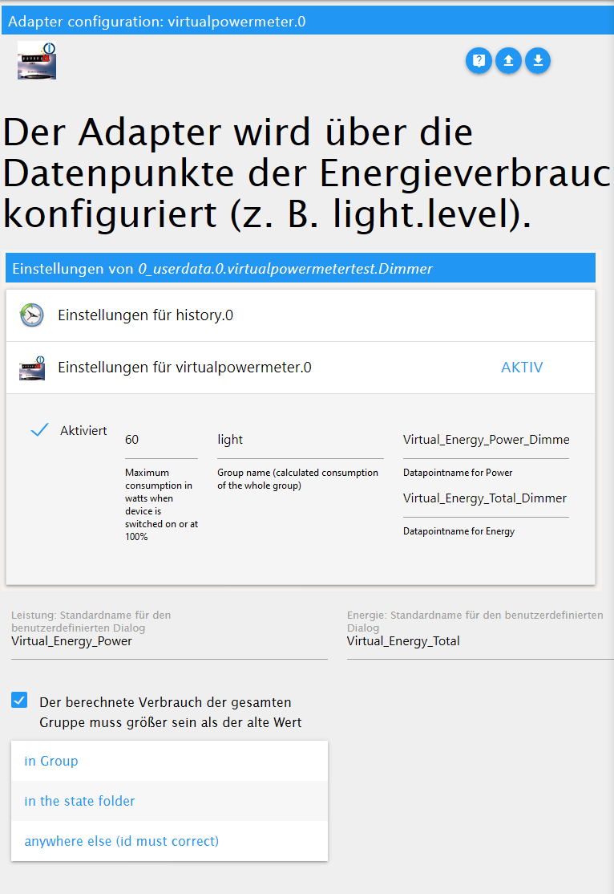
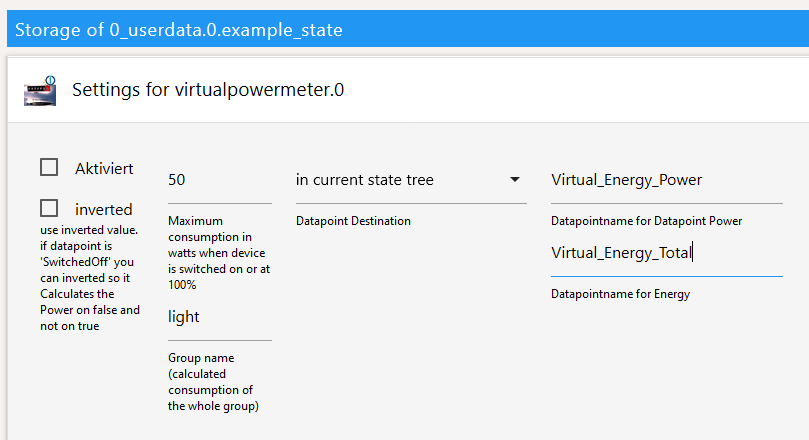

<h1>ioBroker.virtualpowermeter</h1>

##用于ioBroker的virtualpowermeter适配器
埃泽格·维图尔·斯特罗梅瑟

我是Smarthome帽子的生产商，生产商是zwar schalten kann，生产商是Powermeter haben（迈克·利希特）。

Mit Diesem Adapter ist das Ziel zu jedem eingestelltem Datenpunkt（überCustom-> MaxWatt（z.B. 60W））zweizusätzlicheDatenpunkte zubefüllen-> Energy_Power（z.B. 60 W）和Energy_Total（z.B. 2501,23 Wh）。
Zusätzlichwerden Gruppen gebildet（virtualpowermeter.0.xxx的死者werden）死于日期和时间的日期

您可以在这里找到更多信息。

Die neuen Datenpunkte（Besonders die Gruppen）könnten超级麻省理工学院valuetracker超时加班

##实例设置

更高的默认名称，用于电源和能源定义。

模具默认设置：数据点目标最佳设置是默认自定义设置。 “自定义设置”中的“位于状态文件夹中”位于StandardnamenfürPower和Energie genutz之间。标为“组内”名称的标准名称为Custom-DP（.durch _ ersetzt）的名称，名称为Unterverzeichnis +标名称为Power和Energie genutz。 Custom-DP manuell angepasst werden的“标准”，“权力”和“能源”两全其美。

＃＃ 自定义设置
习惯设置自定义设置2 Datenpunkte。功率-&gt;瓦特，能量（总计）-&gt;数据点目标+数据点名称zusammen。

Wichtig：“组中的Wenn目的地”，“当前状态树中的DP”，“全局状态”中的DP。 wenn default-Destination在“组”中，与日期为ergänzt（。durch _ ersetzt）的ID的名称自动匹配。坎恩·阿伯·奥赫（Kann Aber Auch）z.B. Wohnzimmer_Licht.Power和Wohnzimmer_Licht.Energy Angegeben werden。

##自定义设置为Power Angabe（Watt）和whzählenwill
Es gibtGerätedie nine eine Watt ausgabe haben和man aber wissen将wieviel Strom verbraucht wurde Hierfürkann auch der VirtualPowermeter verwendet werden。 DafürMuss nur der Max-Wert vom Datenpunkt和der Max-Power vom VirtualPowermeter可以正常使用。贝斯皮尔：

Beispiel mit valuetracker超时：

## Changelog
### 1.3.2 (2021-01-27)
* (Omega236) group total is now its own counter
* (Omega236) improved precision
### 1.3.1 (2021-01-25)
* (Omega236) reduce initializations and optimize group handling
### 1.3.0 (2021-01-15)
* (scrounger) default ids for power and energie configurable through adapter settings
* (scrounger) custom: autocomplete for group input added
* (scrounger) option added -> group energy values can only increase 
* (Omega236) Check duplicate Destination DP
* (Omega236n) allows to Set Destination of DP
### 1.2.2 (2020-12-26
* (Omega236) Group Calculations only after InitialFinished
### 1.2.1 (2020-04-15)
* (Omega236) translation
### 1.2.0 (2020-04-15)
* (Omega236) js-controller 3.x support
### 1.1.1 (2020-04-07)
* (Omega236) bugfix translation
### 1.1.0 (2020-04-05)
* (Omega236) inverted added
### 1.0.1
* (Omega236) SecurityUpdates
### 1.0.0
* (Omega236) Final Release
### 0.2.8
* (Omega236) Bug found on travis unsubscribeStatesAsync
### 0.2.6
* (Omega236) texts adapted
### 0.2.5
* (Omega236) awaits missing
### 0.2.4
* (Omega236) var remove and SettingPage Info and dic in class and .bind(this) (Template 1.10)
### 0.2.3
* (Omega236) CodeOptimierung nach eslint
### 0.2.1
* (Omega236) CodeOptimierung und bild
### 0.2.0
* (Omega236) Alle Funktionen implementiert, code noch nicht überprüft/optimiert/getestet
### 0.1.0
* (Omega236) Erste Version mit Grundfunktionalität
### 0.0.1
* (Omega236) initial release

## License
MIT License

Copyright (c) 2021 Omega236 general.of.omega@googlemail.com

Permission is hereby granted, free of charge, to any person obtaining a copy
of this software and associated documentation files (the "Software"), to deal
in the Software without restriction, including without limitation the rights
to use, copy, modify, merge, publish, distribute, sublicense, and/or sell
copies of the Software, and to permit persons to whom the Software is
furnished to do so, subject to the following conditions:

The above copyright notice and this permission notice shall be included in all
copies or substantial portions of the Software.

THE SOFTWARE IS PROVIDED "AS IS", WITHOUT WARRANTY OF ANY KIND, EXPRESS OR
IMPLIED, INCLUDING BUT NOT LIMITED TO THE WARRANTIES OF MERCHANTABILITY,
FITNESS FOR A PARTICULAR PURPOSE AND NONINFRINGEMENT. IN NO EVENT SHALL THE
AUTHORS OR COPYRIGHT HOLDERS BE LIABLE FOR ANY CLAIM, DAMAGES OR OTHER
LIABILITY, WHETHER IN AN ACTION OF CONTRACT, TORT OR OTHERWISE, ARISING FROM,
OUT OF OR IN CONNECTION WITH THE SOFTWARE OR THE USE OR OTHER DEALINGS IN THE
SOFTWARE.