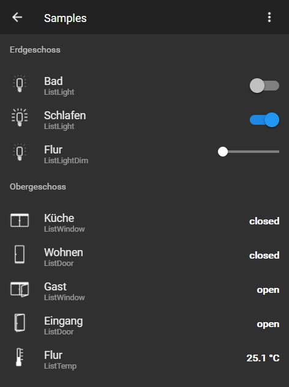

＃ioBroker.vis-material ============
material  -  ioBroker.vis的材质小部件。

您可以阅读material.js，material.html文件中的说明

这些小部件是Uhula的材料设计风格的补充，你可以在这里找到：https：//github.com/Uhula/ioBroker-Material-Design-Style

## Changelog

### 0.1.5 (2018-07-11)
- (pix) feat: new window shutter widget

### 0.1.4 (2018-07-10)
- (pix) feat: new humidity widget

### 0.1.3 (2018-01-21)
- (nisio) feat: new dimmer widget

### 0.1.2 (2018-01-20)
- (nisio) feat: switch added to light widget

### 0.1.1 (2018-01-14)
- (nisio) feat: temperature and light widget

### 0.1.0 (2018-01-13)
- (nisio) Initial version for public testing (includes css from material design styles V1.8)

### 0.0.1 (2018-01-01)
- (nisio) Initial version for internal testing

## License
 Copyright (c) 2018-2018 nisiode
 MIT