<！-toc中省略->


## IoBroker.vis-materialdesign
<！-在目录中省略->

＃ioBroker VIS [![paypal]（https://www.paypalobjects.com/zh_CN/i/btn/btn_donateCC_LG.gif）](https://www.paypal.com/cgi-bin/webscr?cmd=_s-xclick&hosted_button_id=VWAXSTS634G88&source=url)]的材料设计小部件
ioBroker物料设计小部件基于[Google的材料设计指南](https://material.io/design/)

<br>

<！-在目录中省略->

＃＃ 表中的内容
-[一般]（＃general）
-[在线示例项目]（＃online-example-project）
-[实用示例]（＃practical-examples）
-[有关小部件的问题和答案]（＃questions-and-answers-about-the-widgets）
-[支持的浏览器]（＃supported-browser）
-[支持在移动设备上振动的浏览器功能]（＃支持浏览器在移动设备上振动的功能）
-[ioBroker VIS App]（＃iobroker-vis-app）
-[适配器设置]（＃adapter-settings）
-[General]（＃general-1）
-[主题编辑器]（＃theme-editor）
-[主题设置]（＃theme-settings）
-[小部件]（＃widgets）
-[材料设计图标和图像]（＃material-design-icons-and-images）
-[编辑器设置]（＃editor-settings）
-[HTML属性]（＃html-properties）
-[按钮]（＃buttons）
-[导航]（＃navigation）
-[编辑器设置]（＃editor-settings-1）
-[HTML属性]（＃html-properties-1）
-[链接]（＃link）
-[编辑器设置]（＃editor-settings-2）
-[HTML属性]（＃html-properties-2）
-[州]（＃state）
-[编辑器设置]（＃editor-settings-3）
-[HTML属性]（＃html-properties-3）
-[多状态]（＃multi-state）
-[编辑器设置]（＃editor-settings-4）
-[HTML属性]（＃html-properties-4）
-[添加]（＃addition）
-[编辑器设置]（＃editor-settings-5）
-[HTML属性]（＃html-properties-5）
-[切换]（＃toggle）
-[编辑器设置]（＃editor-settings-6）
-[HTML属性]（＃html-properties-6）
-[垂直按钮]（＃buttons-vertical）
-[导航]（＃navigation-1）
-[编辑器设置]（＃editor-settings-7）
-[HTML属性]（＃html-properties-7）
-[链接]（＃link-1）
-[编辑器设置]（＃editor-settings-8）
-[HTML属性]（＃html-properties-8）
-[州]（＃state-1）
-[编辑器设置]（＃editor-settings-9）
-[HTML属性]（＃html-properties-9）
-[多状态]（＃multi-state-1）
-[编辑器设置]（＃editor-settings-10）
-[HTML属性]（＃html-properties-10）
-[添加]（＃addition-1）
-[编辑器设置]（＃editor-settings-11）
-[HTML属性]（＃html-properties-11）
-[切换]（＃toggle-1）
-[编辑器设置]（＃editor-settings-12）
-[HTML属性]（＃html-properties-12）
-[图标按钮]（＃icon-buttons）
-[导航]（＃navigation-2）
-[编辑器设置]（＃editor-settings-13）
-[HTML属性]（＃html-properties-13）
-[链接]（＃link-2）
-[编辑器设置]（＃editor-settings-14）
-[HTML属性]（＃html-properties-14）
-[州]（＃state-2）
-[编辑器设置]（＃editor-settings-15）
-[HTML属性]（＃html-properties-15）
-[多状态]（＃multi-state-2）
-[编辑器设置]（＃editor-settings-16）
-[HTML属性]（＃html-properties-16）
-[添加]（＃addition-2）
-[编辑器设置]（＃editor-settings-17）
-[HTML属性]（＃html-properties-17）
-[切换]（＃toggle-2）
-[编辑器设置]（＃editor-settings-18）
-[HTML属性]（＃html-properties-18）
-[复选框]（＃checkbox）
-[编辑器设置]（＃editor-settings-19）
-[HTML属性]（＃html-properties-19）
-[Switch]（＃switch）
-[编辑器设置]（＃editor-settings-20）
-[HTML属性]（＃html-properties-20）
-[值]（＃value）
-[编辑器设置]（＃editor-settings-21）
-[HTML属性]（＃html-properties-21）
-[HTML卡]（＃html-card）
-[列表]（＃list）
-[编辑器设置]（＃editor-settings-22）
-[数据JSON属性]（＃data-json-properties）
-[IconList]（＃iconlist）
-[编辑器设置]（＃editor-settings-23）
-[数据JSON属性]（＃data-json-properties-1）
-[进度]（＃progress）
-[编辑器设置]（＃editor-settings-24）
-[HTML属性]（＃html-properties-22）
-[进度通知]（＃progress-circular）
-[编辑器设置]（＃editor-settings-25）
-[HTML属性]（＃html-properties-23）
-[滑块]（＃slider）
-[HTML属性]（＃html-properties-24）
-[滑子回合]（＃slider-round）
-[HTML属性]（＃html-properties-25）
-[输入]（＃输入）
-[文字输入]（＃text-input）
-[编辑器设置]（＃editor-settings-26）
-[HTML属性]（＃html-properties-26）
-[选择]（＃select）
-[菜单JSON属性]（＃menu-json-properties）
-[HTML属性]（＃html-properties-27）
-[自动完成]（＃autocomplete）
-[菜单JSON属性]（＃menu-json-properties-1）
-[HTML属性]（＃html-properties-28）
-[顶部应用栏]（＃top-app-bar）
-[子菜单]（＃submenu）
-[子菜单JSON属性]（＃submenu-json-properties）
-[图表]（＃charts）
-[条形图]（＃bar-chart）
-[编辑器设置]（＃editor-settings-27）
-[数据集JSON属性]（＃dataset-json-properties）
-[饼图]（＃pie-chart）
-[编辑器设置]（＃editor-settings-28）
-[数据集JSON属性]（＃dataset-json-properties-1）
-[线路历史记录图表：]（＃line-history-chart）
-[编辑器设置]（＃editor-settings-29）
-[JSON图表]（＃json-chart）
-[JSON属性]（＃json-properties）
-[表格]（＃table）
-[编辑器设置]（＃editor-settings-30）
-[数据-JSON结构]（＃data --- json结构）
-[内部对象绑定]（＃internal-object-binding）
-[使用HTML小部件的控制元素]（＃control-elements-using-html-widgets）
-[控制元素-**自v0.5.0起不推荐使用**]（＃control-elements ---自v050起不推荐使用）
-[响应式布局]（＃response-layout）
-[砌体视图]（＃masonry-views）
-[编辑器设置]（＃editor-settings-31）
-[网格视图]（＃grid-views）
-[编辑器设置]（＃editor-settings-32）
-[Alerts]（＃alerts）
-[编辑器设置]（＃editor-settings-33）
-[Datapoint JSON属性]（＃datapoint-json-properties）
-[脚本：向小部件发送警报]（＃script-send-alert-to-widget）
-[日历]（＃calendar）
-[编辑器设置]（＃editor-settings-34）
-[Datapoint JSON属性]（＃datapoint-json-properties-1）
-[脚本：ical转换]（＃script-ical-conversion）
-[对话]（＃dialog）
-[编辑器设置]（＃editor-settings-35）
-[HTML窗口小部件]（＃html-widgets）
-[示例]（＃examples）
-[二手图书馆]（＃used-libraries）
-[变更日志]（＃changelog）
-[许可证]（＃license）

＃ 一般的
##在线示例项目
由[iobroker.click](https://iobroker.click/index.html)提供，这要归功于bluefox和iobroker。

* <a href="https://iobroker.click/vis/index.html?Material%20Design%20Widgets" target="_blank">VIS运行时</a>（ <a href="http://iobroker.click:8082/vis/index.html?Material%20Design%20Widgets" target="_blank">alternativ</a> ）
* <a href="https://iobroker.click/vis/edit.html?Material%20Design%20Widgets" target="_blank">VIS编辑器</a>（ <a href="http://iobroker.click:8082/vis/edit.html?Material%20Design%20Widgets" target="_blank">alternativ</a> ）

##实际例子
* [天气视图]（https://forum.iobroker.net/topic/32232/material-design-widgets-wetter-view）
* [Skript状态]（https://forum.iobroker.net/topic/30662/material-design-widgets-skript-status）
* [适配器状态]（https://forum.iobroker.net/topic/30661/material-design-widgets-adapter-status）
* [UniFi Netzwerk状态]（https://github.com/Scrounger/ioBroker.vis-materialdesign/tree/master/examples/UnifiNetworkState）

##有关小部件的问题和答案
如果您对各个小部件有疑问，请首先查看各个小部件的主题

* [德语线程]（https://forum.iobroker.net/search?term=Material%20Design%20Widgets%3A&in=titles&matchWords=all&by%5B%5D=Scrounger&categories%5B%5D=7&sortBy=topic.title&sortDirection=desc&showAs=主题）

##支持的浏览器
我正式支持每个主要浏览器的最后两个版本。具体来说，我在以下浏览器上进行测试：

* Windows和Linux上的Firefox
* Android，Windows和Linux上的Chrome

##支持的浏览器可在mobil设备上振动功能
https://developer.mozilla.org/zh-CN/docs/Web/API/Navigator/vibrate

## IoBroker VIS应用程序
该应用程序需要实现最新版本，请参阅https://github.com/ioBroker/ioBroker.vis.cordova。
我不使用该应用程序，也未对其进行测试

＃适配器设置
从0.4.0版本开始，有一个适配器设置页面。您可以在管理适配器的用户界面中的“实例”下找到它

＃＃ 一般的


|设置|描述|
| ---------------------- | -------------------------------------------------------------------------------------------------------------------------------------------------------------------------------------------------------------------------------------------------------------------------- |
|说明文件|指向文档的链接，以帮助您配置窗口小部件|
|生成全局脚本为[Javascript脚本引擎](https://github.com/ioBroker/ioBroker.javascript)创建一个包含所有主题数据点的全局脚本。这允许在脚本中舒适地使用颜色，字体和字体大小。 |
|哨兵使用Sentry库自动向开发人员匿名报告异常和代码错误。有关更多详细信息以及如何禁用错误报告的信息，请参见[Sentry-Plugin文档]（https://github.com/ioBroker/plugin-sentry#plugin-sentry）！ |

##主题编辑器
借助主题编辑器，您可以通过适配器设置集中设置所有小部件的颜色，字体和字体大小。对于每个小部件，将使用设置的值创建数据点（请参见下面的屏幕快照）。这样还可以通过绑定在其他窗口小部件（而非“材料设计窗口小部件”）中使用这些设置。

#####数据点结构


###主题设置


颜色，深色，字体和字体大小的每个设置页面看起来都像上面的屏幕截图所示。

可以在上方区域中定义标准颜色/字体/字体大小。然后，可以使用表格中的按钮将这些标准颜色/字体/字体大小分配给各个小部件。如果更改默认的颜色/字体/字体大小，则所有使用该颜色/字体/字体大小的小部件也将更改。
另外，可以将您自己的颜色/字体/字体大小分配给小部件，而与标准颜色无关。

对于颜色，有两个主题-浅色主题和深色主题。使用数据点`vis-materialdesign.0.colors.darkTheme`，您可以在两个主题之间切换。例如，可以在脚本中使用此数据点在日出和日落时在明暗之间切换。

##### VIS编辑器（还原/更新旧的小部件）


在VIS编辑器中，您将为每个小部件找到一个按钮`use theme`。使用此按钮，您可以将小部件重置为使用主题。这意味着，如果您更改了颜色，字体或字体大小，则可以使用此按钮将其重置。

借助此按钮，还可以从0.4.0之前的版本更新窗口小部件以使用主题。

#####更改材料设计小部件的数据点绑定


如果要更改为其他窗口小部件定义的其他颜色的使用，则可以通过按下带有材料设计图标的按钮来复制数据点绑定。只需将其粘贴到材质设计小部件的任何颜色，字体或字体大小字段中即可。例如，颜色“状态绑定”看起来像`#mdwTheme:vis-materialdesign.0.colors.card.background`

#####对非Material Design小部件使用绑定


在适配器设置中，可以通过单击带有iobroker图标的按钮将绑定命令复制到剪贴板。然后，即使对于非Material Design小部件，也可以通过复制和粘贴使用此绑定。例如，颜色绑定看起来像`{mode:vis-materialdesign.0.colors.darkTheme;light:vis-materialdesign.0.colors.light.card.background;dark:vis-materialdesign.0.colors.dark.card.background; mode === "true" ? dark : light}`

＃小部件
##材料设计图标和图像


###编辑器设置
下表中未列出的设置是不言自明的。

<table><thead><tr><th>截屏</th><th>描述</th></tr></thead><tbody><tr><td rowspan=6></td><td>一些小部件支持<a href="https://materialdesignicons.com/" target="_blank">Material Design Icons</a>库。您可以从上方列表中弹出一个图标，或通过单击输入字段右侧的按钮来打开图像选择器。<br><br><b>图像颜色仅适用于材料设计图标，不适用于图像！</b></td></tr></tbody></table>

### HTML属性
以下属性可用作[HTML小部件](#html-widgets)。

<table><thead><tr><th>财产</th><th>描述</th><th>类型</th><th>价值观</th></tr></thead><tbody><tr><td colspan="4" style="background: #44739e; color: white; border-color: #44739e;"><i><b><br>常见的</b></i></td></tr><tr><td>mdw-mdwIcon</td><td>图标</td><td>细绳</td><td></tr><tr><td>mdw-mdwIconSize</td><td>图标大小</td><td>数字</td><td></tr><tr><td>mdw-mdwIconColor</td><td>图标颜色</td><td>细绳</td><td>十六进制（＃44739e），rgb（20、50、200），rgba（20、50、200、0.5）</tr><tr><td> mdw调试</td><td>调试</td><td>布尔值</td><td>错误|真的</tr></tbody></table>

<！-在目录中省略->

#### HTML属性-示例
<details>

```
<div class='vis-widget materialdesign-widget materialdesign-icon materialdesign-materialdesignicons-html-element'
	style='width: 50px; height: 50px; position: relative; display: flex; align-items: center;'
	mdw-mdwIcon='iobroker'
	mdw-mdwIconSize='30'
	mdw-mdwIconColor='#mdwTheme:vis-materialdesign.0.colors.material_design_icon.color'
	mdw-debug='true'
></div>
```

</ details>

＃＃ 纽扣
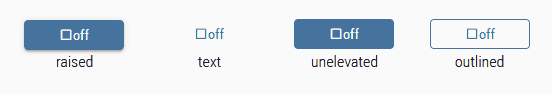

＃＃＃ 导航
####编辑器设置
下表中未列出的设置是不言自明的。

<table><thead><tr><th>截屏</th><th>环境</th><th>描述</th></tr></thead><tbody><tr><td rowspan=1>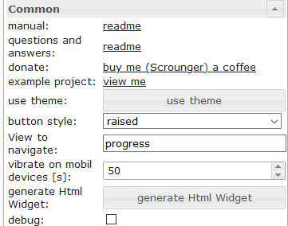</td><td>查看导航</td><td>导航视图的名称</td></tr></tbody></table>

#### HTML属性
以下属性可用作[HTML小部件](#html-widgets)。

<table><thead><tr><th>财产</th><th>描述</th><th>类型</th><th>价值观</th></tr></thead><tbody><tr><td>mdw型</td><td>小部件类型</td><td>细绳</td><td>navigation_default</td></tr><tr><td colspan="4" style="background: #44739e; color: white; border-color: #44739e;"><i><b><br>常见的</b></i></td></tr><tr><td>mdw-buttonStyle</td><td>按钮样式</td><td>细绳</td><td>文字|提出|未提升概述</tr><tr><td>mdw-nav_view</td><td>查看导航</td><td>意见</td><td></tr><tr><td>mdw-vibrateOnMobilDevices</td><td>在移动装置上振动[s]</td><td>数字</td><td></tr><tr><td>mdw调试</td><td>调试</td><td>布尔值</td><td>错误|真的</tr><tr><td colspan="4" style="background: #44739e; color: white; border-color: #44739e;"><i><b><br>贴标</b></i></td></tr><tr><td>mdw-buttontext</td><td>按钮文字</td><td>细绳</td><td></tr><tr><td>mdw-textFontFamily</td><td>字形</td><td>细绳</td><td></tr><tr><td>mdw-textFontSize</td><td>字体大小</td><td>数字</td><td></tr><tr><td>mdw-labelWidth</td><td>文字宽度</td><td>数字</td><td></tr><tr><td colspan="4" style="background: #44739e; color: white; border-color: #44739e;"><i><b><br>颜色</b></i></td></tr><tr><td>mdw-mdwButtonPrimaryColor</td><td>原色</td><td>细绳</td><td>十六进制（＃44739e），rgb（20、50、200），rgba（20、50、200、0.5）</tr><tr><td> mdw-mdwButtonSecondaryColor</td><td>二次色</td><td>细绳</td><td>十六进制（＃44739e），rgb（20、50、200），rgba（20、50、200、0.5）</tr><tr><td> mdw-mdwButtonColorPress</td><td>压色</td><td>细绳</td><td>十六进制（＃44739e），rgb（20、50、200），rgba（20、50、200、0.5）</tr><tr><td colspan="4" style="background: #44739e; color: white; border-color: #44739e;"><i><b><br>图标</b></i></td></tr><tr><td>mdw图像</td><td>图像</td><td>细绳</td><td></tr><tr><td>mdw-imageColor</td><td>图像颜色</td><td>细绳</td><td>十六进制（＃44739e），rgb（20、50、200），rgba（20、50、200、0.5）</tr><tr><td> mdw-iconPosition</td><td>图像位置</td><td>细绳</td><td>左|正确的</tr><tr><td>mdw-iconHeight</td><td>影像高度</td><td>数字</td><td></tr></tbody></table>

<！-在目录中省略->

##### HTML属性-示例
<details>

```
<div class='vis-widget materialdesign-widget materialdesign-button materialdesign-button-html-element'
	style='width: 100%; height: 100%; position: relative; padding: 0px;'
	mdw-type='navigation_default'
	mdw-buttonStyle='raised'
	mdw-nav_view='value'
	mdw-vibrateOnMobilDevices='50'
	mdw-buttontext=' Navigation'
	mdw-textFontFamily='#mdwTheme:vis-materialdesign.0.fonts.button.default.text'
	mdw-textFontSize='#mdwTheme:vis-materialdesign.0.fontSizes.button.default.text'
	mdw-mdwButtonPrimaryColor='#mdwTheme:vis-materialdesign.0.colors.button.default.primary'
	mdw-mdwButtonSecondaryColor='#mdwTheme:vis-materialdesign.0.colors.button.default.secondary'
	mdw-image='navigation'
	mdw-iconPosition='left'
></div>
```

</ details>

＃＃＃ 关联
####编辑器设置
下表中未列出的设置是不言自明的。

<table><thead><tr><th>截屏</th><th>环境</th><th>描述</th></tr></thead><tbody><tr><td rowspan=2>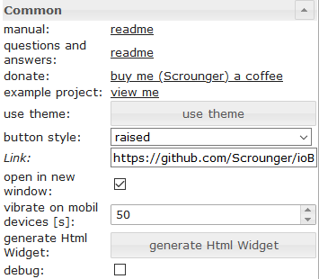</td><td> 关联</td><td>网址打开</td></tr><tr><td>在新窗口中打开</td><td>在新窗口/选项卡中打开链接</td></tr></tbody></table>

#### HTML属性
以下属性可用作[HTML小部件](#html-widgets)。

<table><thead><tr><th>财产</th><th>描述</th><th>类型</th><th>价值观</th></tr></thead><tbody><tr><td>mdw型</td><td>小部件类型</td><td>细绳</td><td>link_default</td></tr><tr><td colspan="4" style="background: #44739e; color: white; border-color: #44739e;"><i><b><br>常见的</b></i></td></tr><tr><td>mdw-buttonStyle</td><td>按钮样式</td><td>细绳</td><td>文字|提出|未提升概述</tr><tr><td>mdw-href</td><td>关联</td><td>网址</td><td></tr><tr><td>mdw-openNewWindow</td><td>在新窗口中打开</td><td>布尔值</td><td>错误|真的</tr><tr><td>mdw-vibrateOnMobilDevices</td><td>在移动装置上振动[s]</td><td>数字</td><td></tr><tr><td>mdw调试</td><td>调试</td><td>布尔值</td><td>错误|真的</tr><tr><td colspan="4" style="background: #44739e; color: white; border-color: #44739e;"><i><b><br>贴标</b></i></td></tr><tr><td>mdw-buttontext</td><td>按钮文字</td><td>细绳</td><td></tr><tr><td>mdw-textFontFamily</td><td>字形</td><td>细绳</td><td></tr><tr><td>mdw-textFontSize</td><td>字体大小</td><td>数字</td><td></tr><tr><td>mdw-labelWidth</td><td>文字宽度</td><td>数字</td><td></tr><tr><td colspan="4" style="background: #44739e; color: white; border-color: #44739e;"><i><b><br>颜色</b></i></td></tr><tr><td>mdw-mdwButtonPrimaryColor</td><td>原色</td><td>细绳</td><td>十六进制（＃44739e），rgb（20、50、200），rgba（20、50、200、0.5）</tr><tr><td> mdw-mdwButtonSecondaryColor</td><td>二次色</td><td>细绳</td><td>十六进制（＃44739e），rgb（20、50、200），rgba（20、50、200、0.5）</tr><tr><td> mdw-mdwButtonColorPress</td><td>压色</td><td>细绳</td><td>十六进制（＃44739e），rgb（20、50、200），rgba（20、50、200、0.5）</tr><tr><td colspan="4" style="background: #44739e; color: white; border-color: #44739e;"><i><b><br>图标</b></i></td></tr><tr><td>mdw图像</td><td>图像</td><td>细绳</td><td></tr><tr><td>mdw-imageColor</td><td>图像颜色</td><td>细绳</td><td>十六进制（＃44739e），rgb（20、50、200），rgba（20、50、200、0.5）</tr><tr><td> mdw-iconPosition</td><td>图像位置</td><td>细绳</td><td>左|正确的</tr><tr><td>mdw-iconHeight</td><td>影像高度</td><td>数字</td><td></tr></tbody></table>

<！-在目录中省略->

##### HTML属性-示例
<details>

```
<div class='vis-widget materialdesign-widget materialdesign-button materialdesign-button-html-element'
	style='width: 100px; height: 30px; position: relative; padding: 0px;'
	mdw-type='link_default'
	mdw-buttonStyle='raised'
	mdw-href='https://github.com/Scrounger/ioBroker.vis-materialdesign'
	mdw-openNewWindow='true'
	mdw-vibrateOnMobilDevices='50'
	mdw-buttontext=' Link'
	mdw-textFontFamily='#mdwTheme:vis-materialdesign.0.fonts.button.default.text'
	mdw-textFontSize='#mdwTheme:vis-materialdesign.0.fontSizes.button.default.text'
	mdw-mdwButtonPrimaryColor='#mdwTheme:vis-materialdesign.0.colors.button.default.primary'
	mdw-mdwButtonSecondaryColor='#mdwTheme:vis-materialdesign.0.colors.button.default.secondary'
	mdw-image='link'
	mdw-iconPosition='left'
></div>
```

</ details>

＃＃＃ 状态
####编辑器设置
下表中未列出的设置是不言自明的。

<table><thead><tr><th>截屏</th><th>环境</th><th>描述</th></tr></thead><tbody><tr><td rowspan=1></td><td>价值</td><td>设定值</td></tr></tbody></table>

#### HTML属性
以下属性可用作[HTML小部件](#html-widgets)。

<table><thead><tr><th>财产</th><th>描述</th><th>类型</th><th>价值观</th></tr></thead><tbody><tr><td>mdw型</td><td>小部件类型</td><td>细绳</td><td>state_default</td></tr><tr><td colspan="4" style="background: #44739e; color: white; border-color: #44739e;"><i><b><br>常见的</b></i></td></tr><tr><td>mdw-oid</td><td>对象ID</td><td>细绳</td><td></tr><tr><td>mdw-buttonStyle</td><td>按钮样式</td><td>细绳</td><td>文字|提出|未提升概述</tr><tr><td>mdw值</td><td>价值</td><td>细绳</td><td></tr><tr><td>mdw-vibrateOnMobilDevices</td><td>在移动装置上振动[s]</td><td>数字</td><td></tr><tr><td>mdw调试</td><td>调试</td><td>布尔值</td><td>错误|真的</tr><tr><td colspan="4" style="background: #44739e; color: white; border-color: #44739e;"><i><b><br>贴标</b></i></td></tr><tr><td>mdw-buttontext</td><td>按钮文字</td><td>细绳</td><td></tr><tr><td>mdw-textFontFamily</td><td>字形</td><td>细绳</td><td></tr><tr><td>mdw-textFontSize</td><td>字体大小</td><td>数字</td><td></tr><tr><td>mdw-labelWidth</td><td>文字宽度</td><td>数字</td><td></tr><tr><td colspan="4" style="background: #44739e; color: white; border-color: #44739e;"><i><b><br>颜色</b></i></td></tr><tr><td>mdw-mdwButtonPrimaryColor</td><td>原色</td><td>细绳</td><td>十六进制（＃44739e），rgb（20、50、200），rgba（20、50、200、0.5）</tr><tr><td> mdw-mdwButtonSecondaryColor</td><td>二次色</td><td>细绳</td><td>十六进制（＃44739e），rgb（20、50、200），rgba（20、50、200、0.5）</tr><tr><td> mdw-mdwButtonColorPress</td><td>压色</td><td>细绳</td><td>十六进制（＃44739e），rgb（20、50、200），rgba（20、50、200、0.5）</tr><tr><td colspan="4" style="background: #44739e; color: white; border-color: #44739e;"><i><b><br>图标</b></i></td></tr><tr><td>mdw图像</td><td>图像</td><td>细绳</td><td></tr><tr><td>mdw-imageColor</td><td>图像颜色</td><td>细绳</td><td>十六进制（＃44739e），rgb（20、50、200），rgba（20、50、200、0.5）</tr><tr><td> mdw-iconPosition</td><td>图像位置</td><td>细绳</td><td>左|正确的</tr><tr><td>mdw-iconHeight</td><td>影像高度</td><td>数字</td><td></tr><tr><td colspan="4" style="background: #44739e; color: white; border-color: #44739e;"><i><b><br>锁定</b></i></td></tr><tr><td>mdw-lockEnabled</td><td>启用锁定</td><td>布尔值</td><td>错误|真的</tr><tr><td>mdw-autoLockAfter</td><td> [s]之后自动锁定</td><td>数字</td><td></tr><tr><td>mdw-lockIcon</td><td>图标</td><td>细绳</td><td></tr><tr><td>mdw-lockIconSize</td><td>图标大小</td><td>数字</td><td></tr><tr><td>mdw-lockIconColor</td><td>图标颜色</td><td>细绳</td><td>十六进制（＃44739e），rgb（20、50、200），rgba（20、50、200、0.5）</tr><tr><td> mdw-lockFilterGrayscale</td><td>灰色滤镜（如果锁定）</td><td>数字</td><td></tr></tbody></table>

<！-在目录中省略->

##### HTML属性-示例
<details>

```
<div class='vis-widget materialdesign-widget materialdesign-button materialdesign-button-html-element'
	style='width: 100%; height: 100%; position: relative; padding: 0px;'
	mdw-type='state_default'
	mdw-oid='0_userdata.0.number'
	mdw-buttonStyle='raised'
	mdw-value='22'
	mdw-vibrateOnMobilDevices='50'
	mdw-buttontext=' State'
	mdw-textFontFamily='#mdwTheme:vis-materialdesign.0.fonts.button.default.text'
	mdw-textFontSize='#mdwTheme:vis-materialdesign.0.fontSizes.button.default.text'
	mdw-mdwButtonPrimaryColor='#mdwTheme:vis-materialdesign.0.colors.button.default.primary'
	mdw-mdwButtonSecondaryColor='#mdwTheme:vis-materialdesign.0.colors.button.default.secondary'
	mdw-image='pencil'
	mdw-iconPosition='left'
	mdw-autoLockAfter='10'
	mdw-lockIconColor='#mdwTheme:vis-materialdesign.0.colors.button.lock_icon'
	mdw-lockFilterGrayscale='30'
></div>
```

</ details>

###多状态
####编辑器设置
下表中未列出的设置是不言自明的。

<table><thead><tr><th>截屏</th><th>环境</th><th>描述</th></tr></thead><tbody><tr><td rowspan=3></td><td>对象ID [x]</td><td>要从中设置值的对象的ID</td></tr><tr><td>值[x]</td><td>要设定的值</td></tr><tr><td>延迟[ms] [x]</td><td>延迟直到设置值</td></tr></tbody></table>

#### HTML属性
以下属性可用作[HTML小部件](#html-widgets)。

<table><thead><tr><th>财产</th><th>描述</th><th>类型</th><th>价值观</th></tr></thead><tbody><tr><td>mdw型</td><td>小部件类型</td><td>细绳</td><td>multiState_default</td></tr><tr><td colspan="4" style="background: #44739e; color: white; border-color: #44739e;"><i><b><br>常见的</b></i></td></tr><tr><td>mdw-countOids</td><td>对象ID的计数</td><td>数字</td><td></tr><tr><td>mdw-buttonStyle</td><td>按钮样式</td><td>细绳</td><td>文字|提出|未提升概述</tr><tr><td>mdw-vibrateOnMobilDevices</td><td>在移动装置上振动[s]</td><td>数字</td><td></tr><tr><td>mdw调试</td><td>调试</td><td>布尔值</td><td>错误|真的</tr><tr><td colspan="4" style="background: #44739e; color: white; border-color: #44739e;"><i><b><br>对象ID [x]</b></i></td></tr><tr><td> mdw-oid [x]</td><td>对象ID</td><td>细绳</td><td></tr><tr><td>mdw-value [x]</td><td>价值</td><td>细绳</td><td></tr><tr><td>mdw-delayInMs [x]</td><td>延迟[毫秒]</td><td>数字</td><td></tr><tr><td colspan="4" style="background: #44739e; color: white; border-color: #44739e;"><i><b><br>贴标</b></i></td></tr><tr><td>mdw-buttontext</td><td>按钮文字</td><td>细绳</td><td></tr><tr><td>mdw-textFontFamily</td><td>字形</td><td>细绳</td><td></tr><tr><td>mdw-textFontSize</td><td>字体大小</td><td>数字</td><td></tr><tr><td>mdw-labelWidth</td><td>文字宽度</td><td>数字</td><td></tr><tr><td colspan="4" style="background: #44739e; color: white; border-color: #44739e;"><i><b><br>颜色</b></i></td></tr><tr><td>mdw-mdwButtonPrimaryColor</td><td>原色</td><td>细绳</td><td>十六进制（＃44739e），rgb（20、50、200），rgba（20、50、200、0.5）</tr><tr><td> mdw-mdwButtonSecondaryColor</td><td>二次色</td><td>细绳</td><td>十六进制（＃44739e），rgb（20、50、200），rgba（20、50、200、0.5）</tr><tr><td> mdw-mdwButtonColorPress</td><td>压色</td><td>细绳</td><td>十六进制（＃44739e），rgb（20、50、200），rgba（20、50、200、0.5）</tr><tr><td colspan="4" style="background: #44739e; color: white; border-color: #44739e;"><i><b><br>图标</b></i></td></tr><tr><td>mdw图像</td><td>图像</td><td>细绳</td><td></tr><tr><td>mdw-imageColor</td><td>图像颜色</td><td>细绳</td><td>十六进制（＃44739e），rgb（20、50、200），rgba（20、50、200、0.5）</tr><tr><td> mdw-iconPosition</td><td>图像位置</td><td>细绳</td><td>左|正确的</tr><tr><td>mdw-iconHeight</td><td>影像高度</td><td>数字</td><td></tr><tr><td colspan="4" style="background: #44739e; color: white; border-color: #44739e;"><i><b><br>锁定</b></i></td></tr><tr><td>mdw-lockEnabled</td><td>启用锁定</td><td>布尔值</td><td>错误|真的</tr><tr><td>mdw-autoLockAfter</td><td> [s]之后自动锁定</td><td>数字</td><td></tr><tr><td>mdw-lockIcon</td><td>图标</td><td>细绳</td><td></tr><tr><td>mdw-lockIconSize</td><td>图标大小</td><td>数字</td><td></tr><tr><td>mdw-lockIconColor</td><td>图标颜色</td><td>细绳</td><td>十六进制（＃44739e），rgb（20、50、200），rgba（20、50、200、0.5）</tr><tr><td> mdw-lockFilterGrayscale</td><td>灰色滤镜（如果锁定）</td><td>数字</td><td></tr></tbody></table>

<！-在目录中省略->

##### HTML属性-示例
<details>

```
<div class='vis-widget materialdesign-widget materialdesign-button materialdesign-button-html-element'
	style='width: 100%; height: 100%; position: relative; padding: 0px;'
	mdw-type='multiState_default'
	mdw-countOids='1'
	mdw-buttonStyle='raised'
	mdw-vibrateOnMobilDevices='50'
	mdw-buttontext=' Multi State'
	mdw-textFontFamily='#mdwTheme:vis-materialdesign.0.fonts.button.default.text'
	mdw-textFontSize='#mdwTheme:vis-materialdesign.0.fontSizes.button.default.text'
	mdw-mdwButtonPrimaryColor='#mdwTheme:vis-materialdesign.0.colors.button.default.primary'
	mdw-mdwButtonSecondaryColor='#mdwTheme:vis-materialdesign.0.colors.button.default.secondary'
	mdw-image='pencil-box-multiple'
	mdw-iconPosition='left'
	mdw-autoLockAfter='10'
	mdw-lockIconColor='#mdwTheme:vis-materialdesign.0.colors.button.lock_icon'
	mdw-lockFilterGrayscale='30'
	mdw-oid0='0_userdata.0.MDW.Buttons.multiState.bool'
	mdw-value0='true'
	mdw-delayInMs0='0'
	mdw-oid1='0_userdata.0.MDW.Buttons.number'
	mdw-value1='66'
	mdw-delayInMs1='0'
></div>
```

</ details>

＃＃＃ 添加
####编辑器设置
下表中未列出的设置是不言自明的。

<table><thead><tr><th>截屏</th><th>环境</th><th>描述</th></tr></thead><tbody><tr><td rowspan=2></td><td>价值</td><td>要增加或减少的值</td></tr><tr><td>最小最大</td><td>最小/最大值，最多可以进行加法或减法</td></tr></tbody></table>

#### HTML属性
以下属性可用作[HTML小部件](#html-widgets)。

<table><thead><tr><th>财产</th><th>描述</th><th>类型</th><th>价值观</th></tr></thead><tbody><tr><td>mdw型</td><td>小部件类型</td><td>细绳</td><td>另外的默认</td></tr><tr><td colspan="4" style="background: #44739e; color: white; border-color: #44739e;"><i><b><br>常见的</b></i></td></tr><tr><td>mdw-oid</td><td>对象ID</td><td>细绳</td><td></tr><tr><td>mdw-buttonStyle</td><td>按钮样式</td><td>细绳</td><td>文字|提出|未提升概述</tr><tr><td>mdw值</td><td>价值</td><td>细绳</td><td></tr><tr><td>最小载重量</td><td>最小最大</td><td>细绳</td><td></tr><tr><td>mdw-vibrateOnMobilDevices</td><td>在移动装置上振动[s]</td><td>数字</td><td></tr><tr><td>mdw调试</td><td>调试</td><td>布尔值</td><td>错误|真的</tr><tr><td colspan="4" style="background: #44739e; color: white; border-color: #44739e;"><i><b><br>贴标</b></i></td></tr><tr><td>mdw-buttontext</td><td>按钮文字</td><td>细绳</td><td></tr><tr><td>mdw-textFontFamily</td><td>字形</td><td>细绳</td><td></tr><tr><td>mdw-textFontSize</td><td>字体大小</td><td>数字</td><td></tr><tr><td>mdw-labelWidth</td><td>文字宽度</td><td>数字</td><td></tr><tr><td colspan="4" style="background: #44739e; color: white; border-color: #44739e;"><i><b><br>颜色</b></i></td></tr><tr><td>mdw-mdwButtonPrimaryColor</td><td>原色</td><td>细绳</td><td>十六进制（＃44739e），rgb（20、50、200），rgba（20、50、200、0.5）</tr><tr><td> mdw-mdwButtonSecondaryColor</td><td>二次色</td><td>细绳</td><td>十六进制（＃44739e），rgb（20、50、200），rgba（20、50、200、0.5）</tr><tr><td> mdw-mdwButtonColorPress</td><td>压色</td><td>细绳</td><td>十六进制（＃44739e），rgb（20、50、200），rgba（20、50、200、0.5）</tr><tr><td colspan="4" style="background: #44739e; color: white; border-color: #44739e;"><i><b><br>图标</b></i></td></tr><tr><td>mdw图像</td><td>图像</td><td>细绳</td><td></tr><tr><td>mdw-imageColor</td><td>图像颜色</td><td>细绳</td><td>十六进制（＃44739e），rgb（20、50、200），rgba（20、50、200、0.5）</tr><tr><td> mdw-iconPosition</td><td>图像位置</td><td>细绳</td><td>左|正确的</tr><tr><td>mdw-iconHeight</td><td>影像高度</td><td>数字</td><td></tr></tbody></table>

<！-在目录中省略->

##### HTML属性-示例
<details>

```
<div class='vis-widget materialdesign-widget materialdesign-button materialdesign-button-html-element'
	style='width: 100%; height: 100%; position: relative; padding: 0px;'
	mdw-type='addition_default'
	mdw-oid='0_userdata.0.MDW.Buttons.number'
	mdw-buttonStyle='raised'
	mdw-value='1'
	mdw-minmax='100'
	mdw-vibrateOnMobilDevices='50'
	mdw-buttontext=' Addition'
	mdw-textFontFamily='#mdwTheme:vis-materialdesign.0.fonts.button.default.text'
	mdw-textFontSize='#mdwTheme:vis-materialdesign.0.fontSizes.button.default.text'
	mdw-mdwButtonPrimaryColor='#mdwTheme:vis-materialdesign.0.colors.button.default.primary'
	mdw-mdwButtonSecondaryColor='#mdwTheme:vis-materialdesign.0.colors.button.default.secondary'
	mdw-image='plus'
	mdw-iconPosition='left'
></div>
```

</ details>

###切换
####编辑器设置
下表中未列出的设置是不言自明的。

待定

#### HTML属性
以下属性可用作[HTML小部件](#html-widgets)。

<table><thead><tr><th>财产</th><th>描述</th><th>类型</th><th>价值观</th></tr></thead><tbody><tr><td>mdw型</td><td>小部件类型</td><td>细绳</td><td>toggle_default</td></tr><tr><td colspan="4" style="background: #44739e; color: white; border-color: #44739e;"><i><b><br>常见的</b></i></td></tr><tr><td>mdw-oid</td><td>对象ID</td><td>细绳</td><td></tr><tr><td>mdw-buttonStyle</td><td>按钮样式</td><td>细绳</td><td>文字|提出|未提升概述</tr><tr><td>mdw-readOnly</td><td>只读</td><td>布尔值</td><td>错误|真的</tr><tr><td>mdw-toggleType</td><td>切换类型</td><td>细绳</td><td>布尔|价值</tr><tr><td>mdw-pushButton</td><td>按钮</td><td>布尔值</td><td>错误|真的</tr><tr><td>mdw-valueOff</td><td>折价</td><td>细绳</td><td></tr><tr><td>mdw-valueOn</td><td>的价值</td><td>细绳</td><td></tr><tr><td>mdw-stateIfNotTrueValue</td><td>说明值是否等于“ on”条件</td><td>细绳</td><td>在|离开</tr><tr><td>mdw-vibrateOnMobilDevices</td><td>在移动装置上振动[s]</td><td>数字</td><td></tr><tr><td>mdw调试</td><td>调试</td><td>布尔值</td><td>错误|真的</tr><tr><td colspan="4" style="background: #44739e; color: white; border-color: #44739e;"><i><b><br>贴标</b></i></td></tr><tr><td>mdw-buttontext</td><td>按钮文字</td><td>细绳</td><td></tr><tr><td>mdw-labelTrue</td><td>标签为真</td><td>细绳</td><td></tr><tr><td>mdw-labelColorFalse</td><td>标签颜色</td><td>细绳</td><td>十六进制（＃44739e），rgb（20、50、200），rgba（20、50、200、0.5）</tr><tr><td> mdw-labelColorTrue</td><td>活动标签颜色</td><td>细绳</td><td>十六进制（＃44739e），rgb（20、50、200），rgba（20、50、200、0.5）</tr><tr><td> mdw-textFontFamily</td><td>字形</td><td>细绳</td><td></tr><tr><td>mdw-textFontSize</td><td>字体大小</td><td>数字</td><td></tr><tr><td>mdw-labelWidth</td><td>文字宽度</td><td>数字</td><td></tr><tr><td colspan="4" style="background: #44739e; color: white; border-color: #44739e;"><i><b><br>颜色</b></i></td></tr><tr><td>mdw-mdwButtonPrimaryColor</td><td>原色</td><td>细绳</td><td>十六进制（＃44739e），rgb（20、50、200），rgba（20、50、200、0.5）</tr><tr><td> mdw-mdwButtonSecondaryColor</td><td>二次色</td><td>细绳</td><td>十六进制（＃44739e），rgb（20、50、200），rgba（20、50、200、0.5）</tr><tr><td> mdw-mdwButtonColorPress</td><td>压色</td><td>细绳</td><td>十六进制（＃44739e），rgb（20、50、200），rgba（20、50、200、0.5）</tr><tr><td> mdw-colorBgFalse</td><td>背景</td><td>细绳</td><td>十六进制（＃44739e），rgb（20、50、200），rgba（20、50、200、0.5）</tr><tr><td> mdw-colorBgTrue</td><td>活动背景</td><td>细绳</td><td>十六进制（＃44739e），rgb（20、50、200），rgba（20、50、200、0.5）</tr><tr><td colspan="4" style="background: #44739e; color: white; border-color: #44739e;"><i><b><br>图标</b></i></td></tr><tr><td>mdw图像</td><td>图像</td><td>细绳</td><td></tr><tr><td>mdw-imageColor</td><td>图像颜色</td><td>细绳</td><td>十六进制（＃44739e），rgb（20、50、200），rgba（20、50、200、0.5）</tr><tr><td> mdw-imageTrue</td><td>活动图像</td><td>细绳</td><td></tr><tr><td>mdw-imageTrueColor</td><td>活动图像颜色</td><td>细绳</td><td>十六进制（＃44739e），rgb（20、50、200），rgba（20、50、200、0.5）</tr><tr><td> mdw-iconPosition</td><td>图像位置</td><td>细绳</td><td>左|正确的</tr><tr><td>mdw-iconHeight</td><td>影像高度</td><td>数字</td><td></tr><tr><td colspan="4" style="background: #44739e; color: white; border-color: #44739e;"><i><b><br>锁定</b></i></td></tr><tr><td>mdw-lockEnabled</td><td>启用锁定</td><td>布尔值</td><td>错误|真的</tr><tr><td>mdw-autoLockAfter</td><td> [s]之后自动锁定</td><td>数字</td><td></tr><tr><td>mdw-lockIcon</td><td>图标</td><td>细绳</td><td></tr><tr><td>mdw-lockIconSize</td><td>图标大小</td><td>数字</td><td></tr><tr><td>mdw-lockIconColor</td><td>图标颜色</td><td>细绳</td><td>十六进制（＃44739e），rgb（20、50、200），rgba（20、50、200、0.5）</tr><tr><td> mdw-lockFilterGrayscale</td><td>灰色滤镜（如果锁定）</td><td>数字</td><td></tr></tbody></table>

<！-在目录中省略->

##### HTML属性-示例
<details>

```
<div class='vis-widget materialdesign-widget materialdesign-button materialdesign-button-html-element'
	style='width: 100%; height: 100%; position: relative; padding: 0px;'
	mdw-type='toggle_default'
	mdw-oid='0_userdata.0.MDW.Buttons.multiState.bool'
	mdw-buttonStyle='raised'
	mdw-toggleType='boolean'
	mdw-stateIfNotTrueValue='on'
	mdw-vibrateOnMobilDevices='50'
	mdw-buttontext='off'
	mdw-labelTrue='on'
	mdw-textFontFamily='#mdwTheme:vis-materialdesign.0.fonts.button.default.text'
	mdw-textFontSize='#mdwTheme:vis-materialdesign.0.fontSizes.button.default.text'
	mdw-mdwButtonPrimaryColor='#mdwTheme:vis-materialdesign.0.colors.button.default.primary'
	mdw-mdwButtonSecondaryColor='#mdwTheme:vis-materialdesign.0.colors.button.default.secondary'
	mdw-colorBgTrue='green'
	mdw-image='checkbox-blank-outline'
	mdw-imageTrue='checkbox-marked'
	mdw-iconPosition='left'
	mdw-autoLockAfter='4'
	mdw-lockIconColor='#mdwTheme:vis-materialdesign.0.colors.button.lock_icon'
	mdw-lockFilterGrayscale='30'
></div>
```

</ details>

##垂直按钮


＃＃＃ 导航
####编辑器设置
下表中未列出的设置是不言自明的。

<table><thead><tr><th>截屏</th><th>环境</th><th>描述</th></tr></thead><tbody><tr><td rowspan=1></td><td>查看导航</td><td>导航视图的名称</td></tr></tbody></table>

#### HTML属性
以下属性可用作[HTML小部件](#html-widgets)。

<table><thead><tr><th>财产</th><th>描述</th><th>类型</th><th>价值观</th></tr></thead><tbody><tr><td>mdw型</td><td>小部件类型</td><td>细绳</td><td>navigation_vertical</td></tr><tr><td colspan="4" style="background: #44739e; color: white; border-color: #44739e;"><i><b><br>常见的</b></i></td></tr><tr><td>mdw-buttonStyle</td><td>按钮样式</td><td>细绳</td><td>文字|提出|未提升概述</tr><tr><td>mdw-nav_view</td><td>查看导航</td><td>意见</td><td></tr><tr><td>mdw-vibrateOnMobilDevices</td><td>在移动装置上振动[s]</td><td>数字</td><td></tr><tr><td>mdw调试</td><td>调试</td><td>布尔值</td><td>错误|真的</tr><tr><td colspan="4" style="background: #44739e; color: white; border-color: #44739e;"><i><b><br>贴标</b></i></td></tr><tr><td>mdw-buttontext</td><td>按钮文字</td><td>细绳</td><td></tr><tr><td>mdw-textFontFamily</td><td>字形</td><td>细绳</td><td></tr><tr><td>mdw-textFontSize</td><td>字体大小</td><td>数字</td><td></tr><tr><td>mdw对齐</td><td>结盟</td><td>细绳</td><td>弹性启动|中心|柔性端</tr><tr><td>mdw-distanceBetweenTextAndImage</td><td>文字和图片之间的距离</td><td>数字</td><td></tr><tr><td colspan="4" style="background: #44739e; color: white; border-color: #44739e;"><i><b><br>颜色</b></i></td></tr><tr><td>mdw-mdwButtonPrimaryColor</td><td>原色</td><td>细绳</td><td>十六进制（＃44739e），rgb（20、50、200），rgba（20、50、200、0.5）</tr><tr><td> mdw-mdwButtonSecondaryColor</td><td>二次色</td><td>细绳</td><td>十六进制（＃44739e），rgb（20、50、200），rgba（20、50、200、0.5）</tr><tr><td> mdw-mdwButtonColorPress</td><td>压色</td><td>细绳</td><td>十六进制（＃44739e），rgb（20、50、200），rgba（20、50、200、0.5）</tr><tr><td colspan="4" style="background: #44739e; color: white; border-color: #44739e;"><i><b><br>图标</b></i></td></tr><tr><td>mdw图像</td><td>图像</td><td>细绳</td><td></tr><tr><td>mdw-imageColor</td><td>图像颜色</td><td>细绳</td><td>十六进制（＃44739e），rgb（20、50、200），rgba（20、50、200、0.5）</tr><tr><td> mdw-iconPosition</td><td>图像位置</td><td>细绳</td><td>顶部|底部</tr><tr><td>mdw-iconHeight</td><td>影像高度</td><td>数字</td><td></tr></tbody></table>

<！-在目录中省略->

##### HTML属性-示例
<details>

```
<div class='vis-widget materialdesign-widget materialdesign-button materialdesign-button-html-element'
	style='width: 100%; height: 100%; position: relative; padding: 0px;'
	mdw-type='navigation_vertical'
	mdw-buttonStyle='raised'
	mdw-nav_view='progress'
	mdw-vibrateOnMobilDevices='50'
	mdw-buttontext='Navigation'
	mdw-textFontFamily='#mdwTheme:vis-materialdesign.0.fonts.button.vertical.text'
	mdw-textFontSize='#mdwTheme:vis-materialdesign.0.fontSizes.button.vertical.text'
	mdw-alignment='center'
	mdw-mdwButtonPrimaryColor='#mdwTheme:vis-materialdesign.0.colors.button.vertical.primary'
	mdw-mdwButtonSecondaryColor='#mdwTheme:vis-materialdesign.0.colors.button.vertical.secondary'
	mdw-image='navigation'
	mdw-iconPosition='top'
	mdw-iconHeight='26'
></div>
```

</ details>

＃＃＃ 关联
####编辑器设置
下表中未列出的设置是不言自明的。

<table><thead><tr><th>截屏</th><th>环境</th><th>描述</th></tr></thead><tbody><tr><td rowspan=2></td><td> 关联</td><td>网址打开</td></tr><tr><td>在新窗口中打开</td><td>在新窗口/选项卡中打开链接</td></tr></tbody></table>

#### HTML属性
以下属性可用作[HTML小部件](#html-widgets)。

<table><thead><tr><th>财产</th><th>描述</th><th>类型</th><th>价值观</th></tr></thead><tbody><tr><td>mdw型</td><td>小部件类型</td><td>细绳</td><td>link_vertical</td></tr><tr><td colspan="4" style="background: #44739e; color: white; border-color: #44739e;"><i><b><br>常见的</b></i></td></tr><tr><td>mdw-buttonStyle</td><td>按钮样式</td><td>细绳</td><td>文字|提出|未提升概述</tr><tr><td>mdw-href</td><td>关联</td><td>网址</td><td></tr><tr><td>mdw-openNewWindow</td><td>在新窗口中打开</td><td>布尔值</td><td>错误|真的</tr><tr><td>mdw-vibrateOnMobilDevices</td><td>在移动装置上振动[s]</td><td>数字</td><td></tr><tr><td>mdw调试</td><td>调试</td><td>布尔值</td><td>错误|真的</tr><tr><td colspan="4" style="background: #44739e; color: white; border-color: #44739e;"><i><b><br>贴标</b></i></td></tr><tr><td>mdw-buttontext</td><td>按钮文字</td><td>细绳</td><td></tr><tr><td>mdw-textFontFamily</td><td>字形</td><td>细绳</td><td></tr><tr><td>mdw-textFontSize</td><td>字体大小</td><td>数字</td><td></tr><tr><td>mdw对齐</td><td>结盟</td><td>细绳</td><td>弹性启动|中心|柔性端</tr><tr><td>mdw-distanceBetweenTextAndImage</td><td>文字和图片之间的距离</td><td>数字</td><td></tr><tr><td colspan="4" style="background: #44739e; color: white; border-color: #44739e;"><i><b><br>颜色</b></i></td></tr><tr><td>mdw-mdwButtonPrimaryColor</td><td>原色</td><td>细绳</td><td>十六进制（＃44739e），rgb（20、50、200），rgba（20、50、200、0.5）</tr><tr><td> mdw-mdwButtonSecondaryColor</td><td>二次色</td><td>细绳</td><td>十六进制（＃44739e），rgb（20、50、200），rgba（20、50、200、0.5）</tr><tr><td> mdw-mdwButtonColorPress</td><td>压色</td><td>细绳</td><td>十六进制（＃44739e），rgb（20、50、200），rgba（20、50、200、0.5）</tr><tr><td colspan="4" style="background: #44739e; color: white; border-color: #44739e;"><i><b><br>图标</b></i></td></tr><tr><td>mdw图像</td><td>图像</td><td>细绳</td><td></tr><tr><td>mdw-imageColor</td><td>图像颜色</td><td>细绳</td><td>十六进制（＃44739e），rgb（20、50、200），rgba（20、50、200、0.5）</tr><tr><td> mdw-iconPosition</td><td>图像位置</td><td>细绳</td><td>顶部|底部</tr><tr><td>mdw-iconHeight</td><td>影像高度</td><td>数字</td><td></tr></tbody></table>

<！-在目录中省略->

##### HTML属性-示例
<details>

```
<div class='vis-widget materialdesign-widget materialdesign-button materialdesign-button-html-element'
	style='width: 100%; height: 100%; position: relative; padding: 0px;'
	mdw-type='link_vertical'
	mdw-debug='true'
	mdw-buttonStyle='raised'
	mdw-href='https://github.com/Scrounger/ioBroker.vis-materialdesign'
	mdw-openNewWindow='true'
	mdw-vibrateOnMobilDevices='50'
	mdw-buttontext='Link'
	mdw-textFontFamily='#mdwTheme:vis-materialdesign.0.fonts.button.vertical.text'
	mdw-textFontSize='#mdwTheme:vis-materialdesign.0.fontSizes.button.vertical.text'
	mdw-alignment='center'
	mdw-mdwButtonPrimaryColor='#mdwTheme:vis-materialdesign.0.colors.button.vertical.primary'
	mdw-mdwButtonSecondaryColor='#mdwTheme:vis-materialdesign.0.colors.button.vertical.secondary'
	mdw-image='link'
	mdw-iconPosition='top'
	mdw-iconHeight='26'
></div>
```

</ details>

＃＃＃ 状态
####编辑器设置
下表中未列出的设置是不言自明的。

<table><thead><tr><th>截屏</th><th>环境</th><th>描述</th></tr></thead><tbody><tr><td rowspan=1></td><td>价值</td><td>设定值</td></tr></tbody></table>

#### HTML属性
以下属性可用作[HTML小部件](#html-widgets)。

<table><thead><tr><th>财产</th><th>描述</th><th>类型</th><th>价值观</th></tr></thead><tbody><tr><td>mdw型</td><td>小部件类型</td><td>细绳</td><td>state_vertical</td></tr><tr><td colspan="4" style="background: #44739e; color: white; border-color: #44739e;"><i><b><br>常见的</b></i></td></tr><tr><td>mdw-oid</td><td>对象ID</td><td>细绳</td><td></tr><tr><td>mdw-buttonStyle</td><td>按钮样式</td><td>细绳</td><td>文字|提出|未提升概述</tr><tr><td>mdw值</td><td>价值</td><td>细绳</td><td></tr><tr><td>mdw-vibrateOnMobilDevices</td><td>在移动装置上振动[s]</td><td>数字</td><td></tr><tr><td>mdw调试</td><td>调试</td><td>布尔值</td><td>错误|真的</tr><tr><td colspan="4" style="background: #44739e; color: white; border-color: #44739e;"><i><b><br>贴标</b></i></td></tr><tr><td>mdw-buttontext</td><td>按钮文字</td><td>细绳</td><td></tr><tr><td>mdw-textFontFamily</td><td>字形</td><td>细绳</td><td></tr><tr><td>mdw-textFontSize</td><td>字体大小</td><td>数字</td><td></tr><tr><td>mdw对齐</td><td>结盟</td><td>细绳</td><td>弹性启动|中心|柔性端</tr><tr><td>mdw-distanceBetweenTextAndImage</td><td>文字和图片之间的距离</td><td>数字</td><td></tr><tr><td colspan="4" style="background: #44739e; color: white; border-color: #44739e;"><i><b><br>颜色</b></i></td></tr><tr><td>mdw-mdwButtonPrimaryColor</td><td>原色</td><td>细绳</td><td>十六进制（＃44739e），rgb（20、50、200），rgba（20、50、200、0.5）</tr><tr><td> mdw-mdwButtonSecondaryColor</td><td>二次色</td><td>细绳</td><td>十六进制（＃44739e），rgb（20、50、200），rgba（20、50、200、0.5）</tr><tr><td> mdw-mdwButtonColorPress</td><td>压色</td><td>细绳</td><td>十六进制（＃44739e），rgb（20、50、200），rgba（20、50、200、0.5）</tr><tr><td colspan="4" style="background: #44739e; color: white; border-color: #44739e;"><i><b><br>图标</b></i></td></tr><tr><td>mdw图像</td><td>图像</td><td>细绳</td><td></tr><tr><td>mdw-imageColor</td><td>图像颜色</td><td>细绳</td><td>十六进制（＃44739e），rgb（20、50、200），rgba（20、50、200、0.5）</tr><tr><td> mdw-iconPosition</td><td>图像位置</td><td>细绳</td><td>顶部|底部</tr><tr><td>mdw-iconHeight</td><td>影像高度</td><td>数字</td><td></tr><tr><td colspan="4" style="background: #44739e; color: white; border-color: #44739e;"><i><b><br>锁定</b></i></td></tr><tr><td>mdw-lockEnabled</td><td>启用锁定</td><td>布尔值</td><td>错误|真的</tr><tr><td>mdw-autoLockAfter</td><td> [s]之后自动锁定</td><td>数字</td><td></tr><tr><td>mdw-lockIcon</td><td>图标</td><td>细绳</td><td></tr><tr><td>mdw-lockIconTop</td><td>距顶部的符号距离[％]</td><td>数字</td><td></tr><tr><td>mdw-lockIconLeft</td><td>距左的符号距离[％]</td><td>数字</td><td></tr><tr><td>mdw-lockIconSize</td><td>图标大小</td><td>数字</td><td></tr><tr><td>mdw-lockIconColor</td><td>图标颜色</td><td>细绳</td><td>十六进制（＃44739e），rgb（20、50、200），rgba（20、50、200、0.5）</tr><tr><td> mdw-lockFilterGrayscale</td><td>灰色滤镜（如果锁定）</td><td>数字</td><td></tr></tbody></table>

<！-在目录中省略->

##### HTML属性-示例
<details>

```
<div class='vis-widget materialdesign-widget materialdesign-button materialdesign-button-html-element'
	style='width: 100%; height: 100%; position: relative; padding: 0px;'
	mdw-type='state_vertical'
	mdw-oid='0_userdata.0.MDW.Buttons.number'
	mdw-buttonStyle='raised'
	mdw-value='41'
	mdw-vibrateOnMobilDevices='50'
	mdw-buttontext='State'
	mdw-textFontFamily='#mdwTheme:vis-materialdesign.0.fonts.button.vertical.text'
	mdw-textFontSize='#mdwTheme:vis-materialdesign.0.fontSizes.button.vertical.text'
	mdw-alignment='center'
	mdw-mdwButtonPrimaryColor='#mdwTheme:vis-materialdesign.0.colors.button.vertical.primary'
	mdw-mdwButtonSecondaryColor='#mdwTheme:vis-materialdesign.0.colors.button.vertical.secondary'
	mdw-image='pencil'
	mdw-iconPosition='top'
	mdw-iconHeight='26'
	mdw-autoLockAfter='10'
	mdw-lockIconTop='5'
	mdw-lockIconLeft='5'
	mdw-lockIconColor='#mdwTheme:vis-materialdesign.0.colors.button.lock_icon'
	mdw-lockFilterGrayscale='30'
></div>
```

</ details>

###多状态
####编辑器设置
下表中未列出的设置是不言自明的。

<table><thead><tr><th>截屏</th><th>环境</th><th>描述</th></tr></thead><tbody><tr><td rowspan=3></td><td>对象ID [x]</td><td>要从中设置值的对象的ID</td></tr><tr><td>值[x]</td><td>要设定的值</td></tr><tr><td>延迟[ms] [x]</td><td>延迟直到设置值</td></tr></tbody></table>

#### HTML属性
以下属性可用作[HTML小部件](#html-widgets)。

<table><thead><tr><th>财产</th><th>描述</th><th>类型</th><th>价值观</th></tr></thead><tbody><tr><td>mdw型</td><td>小部件类型</td><td>细绳</td><td>multiState_vertical</td></tr><tr><td colspan="4" style="background: #44739e; color: white; border-color: #44739e;"><i><b><br>常见的</b></i></td></tr><tr><td>mdw-countOids</td><td>对象ID的计数</td><td>数字</td><td></tr><tr><td>mdw-buttonStyle</td><td>按钮样式</td><td>细绳</td><td>文字|提出|未提升概述</tr><tr><td>mdw-vibrateOnMobilDevices</td><td>在移动装置上振动[s]</td><td>数字</td><td></tr><tr><td>mdw调试</td><td>调试</td><td>布尔值</td><td>错误|真的</tr><tr><td colspan="4" style="background: #44739e; color: white; border-color: #44739e;"><i><b><br>对象ID [x]</b></i></td></tr><tr><td> mdw-oid [x]</td><td>对象ID</td><td>细绳</td><td></tr><tr><td>mdw-value [x]</td><td>价值</td><td>细绳</td><td></tr><tr><td>mdw-delayInMs [x]</td><td>延迟[毫秒]</td><td>数字</td><td></tr><tr><td colspan="4" style="background: #44739e; color: white; border-color: #44739e;"><i><b><br>贴标</b></i></td></tr><tr><td>mdw-buttontext</td><td>按钮文字</td><td>细绳</td><td></tr><tr><td>mdw-textFontFamily</td><td>字形</td><td>细绳</td><td></tr><tr><td>mdw-textFontSize</td><td>字体大小</td><td>数字</td><td></tr><tr><td>mdw对齐</td><td>结盟</td><td>细绳</td><td>弹性启动|中心|柔性端</tr><tr><td>mdw-distanceBetweenTextAndImage</td><td>文字和图片之间的距离</td><td>数字</td><td></tr><tr><td colspan="4" style="background: #44739e; color: white; border-color: #44739e;"><i><b><br>颜色</b></i></td></tr><tr><td>mdw-mdwButtonPrimaryColor</td><td>原色</td><td>细绳</td><td>十六进制（＃44739e），rgb（20、50、200），rgba（20、50、200、0.5）</tr><tr><td> mdw-mdwButtonSecondaryColor</td><td>二次色</td><td>细绳</td><td>十六进制（＃44739e），rgb（20、50、200），rgba（20、50、200、0.5）</tr><tr><td> mdw-mdwButtonColorPress</td><td>压色</td><td>细绳</td><td>十六进制（＃44739e），rgb（20、50、200），rgba（20、50、200、0.5）</tr><tr><td colspan="4" style="background: #44739e; color: white; border-color: #44739e;"><i><b><br>图标</b></i></td></tr><tr><td>mdw图像</td><td>图像</td><td>细绳</td><td></tr><tr><td>mdw-imageColor</td><td>图像颜色</td><td>细绳</td><td>十六进制（＃44739e），rgb（20、50、200），rgba（20、50、200、0.5）</tr><tr><td> mdw-iconPosition</td><td>图像位置</td><td>细绳</td><td>顶部|底部</tr><tr><td>mdw-iconHeight</td><td>影像高度</td><td>数字</td><td></tr><tr><td colspan="4" style="background: #44739e; color: white; border-color: #44739e;"><i><b><br>锁定</b></i></td></tr><tr><td>mdw-lockEnabled</td><td>启用锁定</td><td>布尔值</td><td>错误|真的</tr><tr><td>mdw-autoLockAfter</td><td> [s]之后自动锁定</td><td>数字</td><td></tr><tr><td>mdw-lockIcon</td><td>图标</td><td>细绳</td><td></tr><tr><td>mdw-lockIconTop</td><td>距顶部的符号距离[％]</td><td>数字</td><td></tr><tr><td>mdw-lockIconLeft</td><td>距左的符号距离[％]</td><td>数字</td><td></tr><tr><td>mdw-lockIconSize</td><td>图标大小</td><td>数字</td><td></tr><tr><td>mdw-lockIconColor</td><td>图标颜色</td><td>细绳</td><td>十六进制（＃44739e），rgb（20、50、200），rgba（20、50、200、0.5）</tr><tr><td> mdw-lockFilterGrayscale</td><td>灰色滤镜（如果锁定）</td><td>数字</td><td></tr></tbody></table>

<！-在目录中省略->

##### HTML属性-示例
<details>

```
<div class='vis-widget materialdesign-widget materialdesign-button materialdesign-button-html-element'
	style='width: 100%; height: 100%; position: relative; padding: 0px;'
	mdw-type='multiState_vertical'
	mdw-countOids='1'
	mdw-buttonStyle='raised'
	mdw-vibrateOnMobilDevices='50'
	mdw-buttontext='Multi State'
	mdw-textFontFamily='#mdwTheme:vis-materialdesign.0.fonts.button.vertical.text'
	mdw-textFontSize='#mdwTheme:vis-materialdesign.0.fontSizes.button.vertical.text'
	mdw-alignment='center'
	mdw-mdwButtonPrimaryColor='#mdwTheme:vis-materialdesign.0.colors.button.vertical.primary'
	mdw-mdwButtonSecondaryColor='#mdwTheme:vis-materialdesign.0.colors.button.vertical.secondary'
	mdw-image='pencil-box-multiple'
	mdw-iconPosition='top'
	mdw-iconHeight='26'
	mdw-autoLockAfter='10'
	mdw-lockIconTop='5'
	mdw-lockIconLeft='5'
	mdw-lockIconColor='#mdwTheme:vis-materialdesign.0.colors.button.lock_icon'
	mdw-lockFilterGrayscale='30'
	mdw-oid0='0_userdata.0.MDW.Buttons.multiState.bool'
	mdw-value0='true'
	mdw-delayInMs0='0'
	mdw-oid1='0_userdata.0.MDW.Buttons.number'
	mdw-value1='33'
	mdw-delayInMs1='0'
></div>
```

</ details>

＃＃＃ 添加
####编辑器设置
下表中未列出的设置是不言自明的。

<table><thead><tr><th>截屏</th><th>环境</th><th>描述</th></tr></thead><tbody><tr><td rowspan=2></td><td>价值</td><td>要增加或减少的值</td></tr><tr><td>最小最大</td><td>最小/最大值，最多可以进行加法或减法</td></tr></tbody></table>

#### HTML属性
以下属性可用作[HTML小部件](#html-widgets)。

<table><thead><tr><th>财产</th><th>描述</th><th>类型</th><th>价值观</th></tr></thead><tbody><tr><td>mdw型</td><td>小部件类型</td><td>细绳</td><td>另外垂直</td></tr><tr><td colspan="4" style="background: #44739e; color: white; border-color: #44739e;"><i><b><br>常见的</b></i></td></tr><tr><td>mdw-oid</td><td>对象ID</td><td>细绳</td><td></tr><tr><td>mdw-buttonStyle</td><td>按钮样式</td><td>细绳</td><td>文字|提出|未提升概述</tr><tr><td>mdw值</td><td>价值</td><td>细绳</td><td></tr><tr><td>最小载重量</td><td>最小最大</td><td>细绳</td><td></tr><tr><td>mdw-vibrateOnMobilDevices</td><td>在移动装置上振动[s]</td><td>数字</td><td></tr><tr><td>mdw调试</td><td>调试</td><td>布尔值</td><td>错误|真的</tr><tr><td colspan="4" style="background: #44739e; color: white; border-color: #44739e;"><i><b><br>贴标</b></i></td></tr><tr><td>mdw-buttontext</td><td>按钮文字</td><td>细绳</td><td></tr><tr><td>mdw-textFontFamily</td><td>字形</td><td>细绳</td><td></tr><tr><td>mdw-textFontSize</td><td>字体大小</td><td>数字</td><td></tr><tr><td>mdw对齐</td><td>结盟</td><td>细绳</td><td>弹性启动|中心|柔性端</tr><tr><td>mdw-distanceBetweenTextAndImage</td><td>文字和图片之间的距离</td><td>数字</td><td></tr><tr><td colspan="4" style="background: #44739e; color: white; border-color: #44739e;"><i><b><br>颜色</b></i></td></tr><tr><td>mdw-mdwButtonPrimaryColor</td><td>原色</td><td>细绳</td><td>十六进制（＃44739e），rgb（20、50、200），rgba（20、50、200、0.5）</tr><tr><td> mdw-mdwButtonSecondaryColor</td><td>二次色</td><td>细绳</td><td>十六进制（＃44739e），rgb（20、50、200），rgba（20、50、200、0.5）</tr><tr><td> mdw-mdwButtonColorPress</td><td>压色</td><td>细绳</td><td>十六进制（＃44739e），rgb（20、50、200），rgba（20、50、200、0.5）</tr><tr><td colspan="4" style="background: #44739e; color: white; border-color: #44739e;"><i><b><br>图标</b></i></td></tr><tr><td>mdw图像</td><td>图像</td><td>细绳</td><td></tr><tr><td>mdw-imageColor</td><td>图像颜色</td><td>细绳</td><td>十六进制（＃44739e），rgb（20、50、200），rgba（20、50、200、0.5）</tr><tr><td> mdw-iconPosition</td><td>图像位置</td><td>细绳</td><td>顶部|底部</tr><tr><td>mdw-iconHeight</td><td>影像高度</td><td>数字</td><td></tr></tbody></table>

<！-在目录中省略->

##### HTML属性-示例
<details>

```
<div class='vis-widget materialdesign-widget materialdesign-button materialdesign-button-html-element'
	style='width: 100%; height: 100%; position: relative; padding: 0px;'
	mdw-type='addition_vertical'
	mdw-oid='0_userdata.0.MDW.Buttons.number'
	mdw-buttonStyle='raised'
	mdw-value='-1'
	mdw-minmax='0'
	mdw-vibrateOnMobilDevices='50'
	mdw-buttontext='Addition'
	mdw-textFontFamily='#mdwTheme:vis-materialdesign.0.fonts.button.vertical.text'
	mdw-textFontSize='#mdwTheme:vis-materialdesign.0.fontSizes.button.vertical.text'
	mdw-alignment='center'
	mdw-mdwButtonPrimaryColor='#mdwTheme:vis-materialdesign.0.colors.button.vertical.primary'
	mdw-mdwButtonSecondaryColor='#mdwTheme:vis-materialdesign.0.colors.button.vertical.secondary'
	mdw-image='minus'
	mdw-iconPosition='top'
	mdw-iconHeight='26'
></div>
```

</ details>

###切换
####编辑器设置
下表中未列出的设置是不言自明的。

待定

#### HTML属性
以下属性可用作[HTML小部件](#html-widgets)。

<table><thead><tr><th>财产</th><th>描述</th><th>类型</th><th>价值观</th></tr></thead><tbody><tr><td>mdw型</td><td>小部件类型</td><td>细绳</td><td>toggle_vertical</td></tr><tr><td colspan="4" style="background: #44739e; color: white; border-color: #44739e;"><i><b><br>常见的</b></i></td></tr><tr><td>mdw-oid</td><td>对象ID</td><td>细绳</td><td></tr><tr><td>mdw-buttonStyle</td><td>按钮样式</td><td>细绳</td><td>文字|提出|未提升概述</tr><tr><td>mdw-readOnly</td><td>只读</td><td>布尔值</td><td>错误|真的</tr><tr><td>mdw-toggleType</td><td>切换类型</td><td>细绳</td><td>布尔|价值</tr><tr><td>mdw-pushButton</td><td>按钮</td><td>布尔值</td><td>错误|真的</tr><tr><td>mdw-valueOff</td><td>折价</td><td>细绳</td><td></tr><tr><td>mdw-valueOn</td><td>的价值</td><td>细绳</td><td></tr><tr><td>mdw-stateIfNotTrueValue</td><td>说明值是否等于“ on”条件</td><td>细绳</td><td>在|离开</tr><tr><td>mdw-vibrateOnMobilDevices</td><td>在移动装置上振动[s]</td><td>数字</td><td></tr><tr><td>mdw调试</td><td>调试</td><td>布尔值</td><td>错误|真的</tr><tr><td colspan="4" style="background: #44739e; color: white; border-color: #44739e;"><i><b><br>贴标</b></i></td></tr><tr><td>mdw-buttontext</td><td>按钮文字</td><td>细绳</td><td></tr><tr><td>mdw-labelTrue</td><td>标签为真</td><td>细绳</td><td></tr><tr><td>mdw-labelColorFalse</td><td>标签颜色</td><td>细绳</td><td>十六进制（＃44739e），rgb（20、50、200），rgba（20、50、200、0.5）</tr><tr><td> mdw-labelColorTrue</td><td>活动标签颜色</td><td>细绳</td><td>十六进制（＃44739e），rgb（20、50、200），rgba（20、50、200、0.5）</tr><tr><td> mdw-textFontFamily</td><td>字形</td><td>细绳</td><td></tr><tr><td>mdw-textFontSize</td><td>字体大小</td><td>数字</td><td></tr><tr><td>mdw对齐</td><td>结盟</td><td>细绳</td><td>弹性启动|中心|柔性端</tr><tr><td>mdw-distanceBetweenTextAndImage</td><td>文字和图片之间的距离</td><td>数字</td><td></tr><tr><td colspan="4" style="background: #44739e; color: white; border-color: #44739e;"><i><b><br>颜色</b></i></td></tr><tr><td>mdw-mdwButtonPrimaryColor</td><td>原色</td><td>细绳</td><td>十六进制（＃44739e），rgb（20、50、200），rgba（20、50、200、0.5）</tr><tr><td> mdw-mdwButtonSecondaryColor</td><td>二次色</td><td>细绳</td><td>十六进制（＃44739e），rgb（20、50、200），rgba（20、50、200、0.5）</tr><tr><td> mdw-colorBgFalse</td><td>背景</td><td>细绳</td><td>十六进制（＃44739e），rgb（20、50、200），rgba（20、50、200、0.5）</tr><tr><td> mdw-colorBgTrue</td><td>活动背景</td><td>细绳</td><td>十六进制（＃44739e），rgb（20、50、200），rgba（20、50、200、0.5）</tr><tr><td colspan="4" style="background: #44739e; color: white; border-color: #44739e;"><i><b><br>图标</b></i></td></tr><tr><td>mdw图像</td><td>图像</td><td>细绳</td><td></tr><tr><td>mdw-imageColor</td><td>图像颜色</td><td>细绳</td><td>十六进制（＃44739e），rgb（20、50、200），rgba（20、50、200、0.5）</tr><tr><td> mdw-imageTrue</td><td>活动图像</td><td>细绳</td><td></tr><tr><td>mdw-imageTrueColor</td><td>活动图像颜色</td><td>细绳</td><td>十六进制（＃44739e），rgb（20、50、200），rgba（20、50、200、0.5）</tr><tr><td> mdw-iconPosition</td><td>图像位置</td><td>细绳</td><td>顶部|底部</tr><tr><td>mdw-iconHeight</td><td>影像高度</td><td>数字</td><td></tr><tr><td colspan="4" style="background: #44739e; color: white; border-color: #44739e;"><i><b><br>锁定</b></i></td></tr><tr><td>mdw-lockEnabled</td><td>启用锁定</td><td>布尔值</td><td>错误|真的</tr><tr><td>mdw-autoLockAfter</td><td> [s]之后自动锁定</td><td>数字</td><td></tr><tr><td>mdw-lockIcon</td><td>图标</td><td>细绳</td><td></tr><tr><td>mdw-lockIconTop</td><td>距顶部的符号距离[％]</td><td>数字</td><td></tr><tr><td>mdw-lockIconLeft</td><td>距左的符号距离[％]</td><td>数字</td><td></tr><tr><td>mdw-lockIconSize</td><td>图标大小</td><td>数字</td><td></tr><tr><td>mdw-lockIconColor</td><td>图标颜色</td><td>细绳</td><td>十六进制（＃44739e），rgb（20、50、200），rgba（20、50、200、0.5）</tr><tr><td> mdw-lockFilterGrayscale</td><td>灰色滤镜（如果锁定）</td><td>数字</td><td></tr></tbody></table>

<！-在目录中省略->

##### HTML属性-示例
<details>

```
<div class='vis-widget materialdesign-widget materialdesign-button materialdesign-button-html-element'
	style='width: 100%; height: 100%; position: relative; padding: 0px;'
	mdw-type='toggle_vertical'
	mdw-oid='0_userdata.0.MDW.Buttons.multiState.bool'
	mdw-buttonStyle='raised'
	mdw-toggleType='boolean'
	mdw-pushButton='true'
	mdw-stateIfNotTrueValue='on'
	mdw-vibrateOnMobilDevices='50'
	mdw-buttontext='off push'
	mdw-labelTrue='on push'
	mdw-textFontFamily='#mdwTheme:vis-materialdesign.0.fonts.button.vertical.text'
	mdw-textFontSize='#mdwTheme:vis-materialdesign.0.fontSizes.button.vertical.text'
	mdw-alignment='center'
	mdw-mdwButtonPrimaryColor='#mdwTheme:vis-materialdesign.0.colors.button.vertical.primary'
	mdw-mdwButtonSecondaryColor='#mdwTheme:vis-materialdesign.0.colors.button.vertical.secondary'
	mdw-colorBgTrue='green'
	mdw-image='checkbox-blank-outline'
	mdw-imageTrue='checkbox-marked'
	mdw-iconPosition='top'
	mdw-iconHeight='26'
	mdw-autoLockAfter='4'
	mdw-lockIconTop='5'
	mdw-lockIconLeft='5'
	mdw-lockIconSize='24'
	mdw-lockIconColor='#mdwTheme:vis-materialdesign.0.colors.button.lock_icon'
	mdw-lockFilterGrayscale='100'
></div>
```

</ details>

##图标按钮


＃＃＃ 导航
####编辑器设置
下表中未列出的设置是不言自明的。

<table><thead><tr><th>截屏</th><th>环境</th><th>描述</th></tr></thead><tbody><tr><td rowspan=1></td><td>查看导航</td><td>导航视图的名称</td></tr></tbody></table>

#### HTML属性
以下属性可用作[HTML小部件](#html-widgets)。

<table><thead><tr><th>财产</th><th>描述</th><th>类型</th><th>价值观</th></tr></thead><tbody><tr><td>mdw型</td><td>小部件类型</td><td>细绳</td><td>navigation_icon</td></tr><tr><td colspan="4" style="background: #44739e; color: white; border-color: #44739e;"><i><b><br>常见的</b></i></td></tr><tr><td>mdw-nav_view</td><td>查看导航</td><td>意见</td><td></tr><tr><td>mdw-vibrateOnMobilDevices</td><td>在移动装置上振动[s]</td><td>数字</td><td></tr><tr><td>mdw调试</td><td>调试</td><td>布尔值</td><td>错误|真的</tr><tr><td colspan="4" style="background: #44739e; color: white; border-color: #44739e;"><i><b><br>图标</b></i></td></tr><tr><td>mdw图像</td><td>图像</td><td>细绳</td><td></tr><tr><td>mdw-imageColor</td><td>图像颜色</td><td>细绳</td><td>十六进制（＃44739e），rgb（20、50、200），rgba（20、50、200、0.5）</tr><tr><td> mdw-iconHeight</td><td>影像高度</td><td>数字</td><td></tr><tr><td colspan="4" style="background: #44739e; color: white; border-color: #44739e;"><i><b><br>颜色</b></i></td></tr><tr><td>mdw-colorBgFalse</td><td>背景</td><td>细绳</td><td>十六进制（＃44739e），rgb（20、50、200），rgba（20、50、200、0.5）</tr><tr><td> mdw-colorPress</td><td>压色</td><td>细绳</td><td>十六进制（＃44739e），rgb（20、50、200），rgba（20、50、200、0.5）</tr></tbody></table>

<！-在目录中省略->

##### HTML属性-示例
<details>

```
<div class='vis-widget materialdesign-widget materialdesign-icon-button materialdesign-button-html-element'
	style='width: 48px; height: 48px; position: relative; padding: 0px;'
	mdw-type='navigation_icon'
	mdw-nav_view='progress'
	mdw-vibrateOnMobilDevices='50'
	mdw-image='navigation'
	mdw-imageColor='#mdwTheme:vis-materialdesign.0.colors.button.icon.icon_off'
	mdw-colorBgFalse='#mdwTheme:vis-materialdesign.0.colors.button.icon.background_off'
	mdw-colorPress='#mdwTheme:vis-materialdesign.0.colors.button.icon.pressed'
></div>
```

</ details>

＃＃＃ 关联
####编辑器设置
下表中未列出的设置是不言自明的。

<table><thead><tr><th>截屏</th><th>环境</th><th>描述</th></tr></thead><tbody><tr><td rowspan=2></td><td> 关联</td><td>网址打开</td></tr><tr><td>在新窗口中打开</td><td>在新窗口/选项卡中打开链接</td></tr></tbody></table>

#### HTML属性
以下属性可用作[HTML小部件](#html-widgets)。

<table><thead><tr><th>财产</th><th>描述</th><th>类型</th><th>价值观</th></tr></thead><tbody><tr><td>mdw型</td><td>小部件类型</td><td>细绳</td><td>link_icon</td></tr><tr><td colspan="4" style="background: #44739e; color: white; border-color: #44739e;"><i><b><br>常见的</b></i></td></tr><tr><td>mdw-href</td><td>关联</td><td>网址</td><td></tr><tr><td>mdw-openNewWindow</td><td>在新窗口中打开</td><td>布尔值</td><td>错误|真的</tr><tr><td>mdw-vibrateOnMobilDevices</td><td>在移动装置上振动[s]</td><td>数字</td><td></tr><tr><td>mdw调试</td><td>调试</td><td>布尔值</td><td>错误|真的</tr><tr><td colspan="4" style="background: #44739e; color: white; border-color: #44739e;"><i><b><br>图标</b></i></td></tr><tr><td>mdw图像</td><td>图像</td><td>细绳</td><td></tr><tr><td>mdw-imageColor</td><td>图像颜色</td><td>细绳</td><td>十六进制（＃44739e），rgb（20、50、200），rgba（20、50、200、0.5）</tr><tr><td> mdw-iconHeight</td><td>影像高度</td><td>数字</td><td></tr><tr><td colspan="4" style="background: #44739e; color: white; border-color: #44739e;"><i><b><br>颜色</b></i></td></tr><tr><td>mdw-colorBgFalse</td><td>背景</td><td>细绳</td><td>十六进制（＃44739e），rgb（20、50、200），rgba（20、50、200、0.5）</tr><tr><td> mdw-colorPress</td><td>压色</td><td>细绳</td><td>十六进制（＃44739e），rgb（20、50、200），rgba（20、50、200、0.5）</tr></tbody></table>

<！-在目录中省略->

##### HTML属性-示例
<details>

```
<div class='vis-widget materialdesign-widget materialdesign-icon-button materialdesign-button-html-element'
	style='width: 48px; height: 48px; position: relative; padding: 0px;'
	mdw-type='link_icon'
	mdw-href='https://github.com/Scrounger/ioBroker.vis-materialdesign'
	mdw-openNewWindow='true'
	mdw-vibrateOnMobilDevices='50'
	mdw-image='link'
	mdw-imageColor='#mdwTheme:vis-materialdesign.0.colors.button.icon.icon_off'
	mdw-colorBgFalse='#mdwTheme:vis-materialdesign.0.colors.button.icon.background_off'
	mdw-colorPress='#mdwTheme:vis-materialdesign.0.colors.button.icon.pressed'
></div>
```

</ details>

＃＃＃ 状态
####编辑器设置
下表中未列出的设置是不言自明的。

<table><thead><tr><th>截屏</th><th>环境</th><th>描述</th></tr></thead><tbody><tr><td rowspan=1></td><td>价值</td><td>设定值</td></tr></tbody></table>

#### HTML属性
以下属性可用作[HTML小部件](#html-widgets)。

<table><thead><tr><th>财产</th><th>描述</th><th>类型</th><th>价值观</th></tr></thead><tbody><tr><td>mdw型</td><td>小部件类型</td><td>细绳</td><td>state_icon</td></tr><tr><td colspan="4" style="background: #44739e; color: white; border-color: #44739e;"><i><b><br>常见的</b></i></td></tr><tr><td>mdw-oid</td><td>对象ID</td><td>细绳</td><td></tr><tr><td>mdw值</td><td>价值</td><td>细绳</td><td></tr><tr><td>mdw-vibrateOnMobilDevices</td><td>在移动装置上振动[s]</td><td>数字</td><td></tr><tr><td>mdw调试</td><td>调试</td><td>布尔值</td><td>错误|真的</tr><tr><td colspan="4" style="background: #44739e; color: white; border-color: #44739e;"><i><b><br>图标</b></i></td></tr><tr><td>mdw图像</td><td>图像</td><td>细绳</td><td></tr><tr><td>mdw-imageColor</td><td>图像颜色</td><td>细绳</td><td>十六进制（＃44739e），rgb（20、50、200），rgba（20、50、200、0.5）</tr><tr><td> mdw-iconHeight</td><td>影像高度</td><td>数字</td><td></tr><tr><td colspan="4" style="background: #44739e; color: white; border-color: #44739e;"><i><b><br>颜色</b></i></td></tr><tr><td>mdw-colorBgFalse</td><td>背景</td><td>细绳</td><td>十六进制（＃44739e），rgb（20、50、200），rgba（20、50、200、0.5）</tr><tr><td> mdw-colorPress</td><td>压色</td><td>细绳</td><td>十六进制（＃44739e），rgb（20、50、200），rgba（20、50、200、0.5）</tr><tr><td colspan="4" style="background: #44739e; color: white; border-color: #44739e;"><i><b><br>锁定</b></i></td></tr><tr><td>mdw-lockEnabled</td><td>启用锁定</td><td>布尔值</td><td>错误|真的</tr><tr><td>mdw-autoLockAfter</td><td> [s]之后自动锁定</td><td>数字</td><td></tr><tr><td>mdw-lockIcon</td><td>图标</td><td>细绳</td><td></tr><tr><td>mdw-lockIconTop</td><td>距顶部的符号距离[％]</td><td>数字</td><td></tr><tr><td>mdw-lockIconLeft</td><td>距左的符号距离[％]</td><td>数字</td><td></tr><tr><td>mdw-lockIconSize</td><td>图标大小</td><td>数字</td><td></tr><tr><td>mdw-lockIconColor</td><td>图标颜色</td><td>细绳</td><td>十六进制（＃44739e），rgb（20、50、200），rgba（20、50、200、0.5）</tr><tr><td> mdw-lockIconBackground</td><td> lockIconBackground</td><td>细绳</td><td>十六进制（＃44739e），rgb（20、50、200），rgba（20、50、200、0.5）</tr><tr><td> mdw-lockBackgroundSizeFactor</td><td> lockBackgroundSizeFactor</td><td>数字</td><td></tr><tr><td>mdw-lockFilterGrayscale</td><td>灰色滤镜（如果锁定）</td><td>数字</td><td></tr></tbody></table>

<！-在目录中省略->

##### HTML属性-示例
<details>

```
<div class='vis-widget materialdesign-widget materialdesign-icon-button materialdesign-button-html-element'
	style='width: 48px; height: 48px; position: relative; padding: 0px;'
	mdw-type='state_icon'
	mdw-oid='0_userdata.0.MDW.Buttons.number'
	mdw-value='77'
	mdw-vibrateOnMobilDevices='50'
	mdw-image='pencil'
	mdw-imageColor='#mdwTheme:vis-materialdesign.0.colors.button.icon.icon_off'
	mdw-colorBgFalse='#mdwTheme:vis-materialdesign.0.colors.button.icon.background_off'
	mdw-colorPress='#mdwTheme:vis-materialdesign.0.colors.button.icon.pressed'
	mdw-lockEnabled='true'
	mdw-autoLockAfter='10'
	mdw-lockIconTop='45'
	mdw-lockIconLeft='55'
	mdw-lockIconSize='20'
	mdw-lockIconColor='#mdwTheme:vis-materialdesign.0.colors.button.icon.lock_icon'
	mdw-lockIconBackground='#mdwTheme:vis-materialdesign.0.colors.button.icon.lock_icon_background'
	mdw-lockBackgroundSizeFactor='1'
	mdw-lockFilterGrayscale='30'
></div>
```

</ details>

###多状态
####编辑器设置
下表中未列出的设置是不言自明的。

<table><thead><tr><th>截屏</th><th>环境</th><th>描述</th></tr></thead><tbody><tr><td rowspan=3></td><td>对象ID [x]</td><td>要从中设置值的对象的ID</td></tr><tr><td>值[x]</td><td>要设定的值</td></tr><tr><td>延迟[ms] [x]</td><td>延迟直到设置值</td></tr></tbody></table>

#### HTML属性
以下属性可用作[HTML小部件](#html-widgets)。

<table><thead><tr><th>财产</th><th>描述</th><th>类型</th><th>价值观</th></tr></thead><tbody><tr><td>mdw型</td><td>小部件类型</td><td>细绳</td><td>multiState_icon</td></tr><tr><td colspan="4" style="background: #44739e; color: white; border-color: #44739e;"><i><b><br>常见的</b></i></td></tr><tr><td>mdw-countOids</td><td>对象ID的计数</td><td>数字</td><td></tr><tr><td>mdw-vibrateOnMobilDevices</td><td>在移动装置上振动[s]</td><td>数字</td><td></tr><tr><td>mdw调试</td><td>调试</td><td>布尔值</td><td>错误|真的</tr><tr><td colspan="4" style="background: #44739e; color: white; border-color: #44739e;"><i><b><br>对象ID [x]</b></i></td></tr><tr><td> mdw-oid [x]</td><td>对象ID</td><td>细绳</td><td></tr><tr><td>mdw-value [x]</td><td>价值</td><td>细绳</td><td></tr><tr><td>mdw-delayInMs [x]</td><td>延迟[毫秒]</td><td>数字</td><td></tr><tr><td colspan="4" style="background: #44739e; color: white; border-color: #44739e;"><i><b><br>图标</b></i></td></tr><tr><td>mdw图像</td><td>图像</td><td>细绳</td><td></tr><tr><td>mdw-imageColor</td><td>图像颜色</td><td>细绳</td><td>十六进制（＃44739e），rgb（20、50、200），rgba（20、50、200、0.5）</tr><tr><td> mdw-iconHeight</td><td>影像高度</td><td>数字</td><td></tr><tr><td colspan="4" style="background: #44739e; color: white; border-color: #44739e;"><i><b><br>颜色</b></i></td></tr><tr><td>mdw-colorBgFalse</td><td>背景</td><td>细绳</td><td>十六进制（＃44739e），rgb（20、50、200），rgba（20、50、200、0.5）</tr><tr><td> mdw-colorPress</td><td>压色</td><td>细绳</td><td>十六进制（＃44739e），rgb（20、50、200），rgba（20、50、200、0.5）</tr><tr><td colspan="4" style="background: #44739e; color: white; border-color: #44739e;"><i><b><br>锁定</b></i></td></tr><tr><td>mdw-lockEnabled</td><td>启用锁定</td><td>布尔值</td><td>错误|真的</tr><tr><td>mdw-autoLockAfter</td><td> [s]之后自动锁定</td><td>数字</td><td></tr><tr><td>mdw-lockIcon</td><td>图标</td><td>细绳</td><td></tr><tr><td>mdw-lockIconTop</td><td>距顶部的符号距离[％]</td><td>数字</td><td></tr><tr><td>mdw-lockIconLeft</td><td>距左的符号距离[％]</td><td>数字</td><td></tr><tr><td>mdw-lockIconSize</td><td>图标大小</td><td>数字</td><td></tr><tr><td>mdw-lockIconColor</td><td>图标颜色</td><td>细绳</td><td>十六进制（＃44739e），rgb（20、50、200），rgba（20、50、200、0.5）</tr><tr><td> mdw-lockIconBackground</td><td> lockIconBackground</td><td>细绳</td><td>十六进制（＃44739e），rgb（20、50、200），rgba（20、50、200、0.5）</tr><tr><td> mdw-lockBackgroundSizeFactor</td><td> lockBackgroundSizeFactor</td><td>数字</td><td></tr><tr><td>mdw-lockFilterGrayscale</td><td>灰色滤镜（如果锁定）</td><td>数字</td><td></tr></tbody></table>

<！-在目录中省略->

##### HTML属性-示例
<details>

```
<div class='vis-widget materialdesign-widget materialdesign-icon-button materialdesign-button-html-element'
	style='width: 48px; height: 48px; position: relative; padding: 0px;'
	mdw-type='multiState_icon'
	mdw-countOids='1'
	mdw-vibrateOnMobilDevices='50'
	mdw-image='pencil-box-multiple'
	mdw-imageColor='#mdwTheme:vis-materialdesign.0.colors.button.icon.icon_off'
	mdw-colorBgFalse='#mdwTheme:vis-materialdesign.0.colors.button.icon.background_off'
	mdw-colorPress='#mdwTheme:vis-materialdesign.0.colors.button.icon.pressed'
	mdw-autoLockAfter='10'
	mdw-lockIconTop='45'
	mdw-lockIconLeft='55'
	mdw-lockIconSize='20'
	mdw-lockIconColor='#mdwTheme:vis-materialdesign.0.colors.button.icon.lock_icon'
	mdw-lockIconBackground='#mdwTheme:vis-materialdesign.0.colors.button.icon.lock_icon_background'
	mdw-lockBackgroundSizeFactor='1'
	mdw-lockFilterGrayscale='30'
	mdw-oid0='0_userdata.0.MDW.Buttons.number'
	mdw-value0='22'
	mdw-delayInMs0='0'
	mdw-oid1='0_userdata.0.MDW.Buttons.multiState.bool'
	mdw-value1='true'
	mdw-delayInMs1='0'
></div>
```

</ details>

＃＃＃ 添加
####编辑器设置
下表中未列出的设置是不言自明的。

<table><thead><tr><th>截屏</th><th>环境</th><th>描述</th></tr></thead><tbody><tr><td rowspan=2></td><td>价值</td><td>要增加或减少的值</td></tr><tr><td>最小最大</td><td>最小/最大值，最多可以进行加法或减法</td></tr></tbody></table>

#### HTML属性
以下属性可用作[HTML小部件](#html-widgets)。

<table><thead><tr><th>财产</th><th>描述</th><th>类型</th><th>价值观</th></tr></thead><tbody><tr><td>mdw型</td><td>小部件类型</td><td>细绳</td><td>另外的图标</td></tr><tr><td colspan="4" style="background: #44739e; color: white; border-color: #44739e;"><i><b><br>常见的</b></i></td></tr><tr><td>mdw-oid</td><td>对象ID</td><td>细绳</td><td></tr><tr><td>mdw值</td><td>价值</td><td>细绳</td><td></tr><tr><td>最小载重量</td><td>最小最大</td><td>细绳</td><td></tr><tr><td>mdw-vibrateOnMobilDevices</td><td>在移动装置上振动[s]</td><td>数字</td><td></tr><tr><td>mdw调试</td><td>调试</td><td>布尔值</td><td>错误|真的</tr><tr><td colspan="4" style="background: #44739e; color: white; border-color: #44739e;"><i><b><br>图标</b></i></td></tr><tr><td>mdw图像</td><td>图像</td><td>细绳</td><td></tr><tr><td>mdw-imageColor</td><td>图像颜色</td><td>细绳</td><td>十六进制（＃44739e），rgb（20、50、200），rgba（20、50、200、0.5）</tr><tr><td> mdw-iconHeight</td><td>影像高度</td><td>数字</td><td></tr><tr><td colspan="4" style="background: #44739e; color: white; border-color: #44739e;"><i><b><br>颜色</b></i></td></tr><tr><td>mdw-colorBgFalse</td><td>背景</td><td>细绳</td><td>十六进制（＃44739e），rgb（20、50、200），rgba（20、50、200、0.5）</tr><tr><td> mdw-colorPress</td><td>压色</td><td>细绳</td><td>十六进制（＃44739e），rgb（20、50、200），rgba（20、50、200、0.5）</tr></tbody></table>

<！-在目录中省略->

##### HTML属性-示例
<details>

```
<div class='vis-widget materialdesign-widget materialdesign-icon-button materialdesign-button-html-element'
	style='width: 48px; height: 48px; position: relative; padding: 0px;'
	mdw-type='addition_icon'
	mdw-oid='0_userdata.0.MDW.Buttons.number'
	mdw-value='1'
	mdw-minmax='100'
	mdw-vibrateOnMobilDevices='50'
	mdw-image='plus'
	mdw-imageColor='#mdwTheme:vis-materialdesign.0.colors.button.icon.icon_off'
	mdw-colorBgFalse='#mdwTheme:vis-materialdesign.0.colors.button.icon.background_off'
	mdw-colorPress='#mdwTheme:vis-materialdesign.0.colors.button.icon.pressed'
></div>
```

</ details>

###切换
####编辑器设置
下表中未列出的设置是不言自明的。

待定

#### HTML属性
以下属性可用作[HTML小部件](#html-widgets)。

<table><thead><tr><th>财产</th><th>描述</th><th>类型</th><th>价值观</th></tr></thead><tbody><tr><td>mdw型</td><td>小部件类型</td><td>细绳</td><td>toggle_icon</td></tr><tr><td colspan="4" style="background: #44739e; color: white; border-color: #44739e;"><i><b><br>常见的</b></i></td></tr><tr><td>mdw-oid</td><td>对象ID</td><td>细绳</td><td></tr><tr><td>mdw-readOnly</td><td>只读</td><td>布尔值</td><td>错误|真的</tr><tr><td>mdw-toggleType</td><td>切换类型</td><td>细绳</td><td>布尔|价值</tr><tr><td>mdw-pushButton</td><td>按钮</td><td>布尔值</td><td>错误|真的</tr><tr><td>mdw-valueOff</td><td>折价</td><td>细绳</td><td></tr><tr><td>mdw-valueOn</td><td>的价值</td><td>细绳</td><td></tr><tr><td>mdw-stateIfNotTrueValue</td><td>说明值是否等于“ on”条件</td><td>细绳</td><td>在|离开</tr><tr><td>mdw-vibrateOnMobilDevices</td><td>在移动装置上振动[s]</td><td>数字</td><td></tr><tr><td>mdw调试</td><td>调试</td><td>布尔值</td><td>错误|真的</tr><tr><td colspan="4" style="background: #44739e; color: white; border-color: #44739e;"><i><b><br>图标</b></i></td></tr><tr><td>mdw图像</td><td>图像</td><td>细绳</td><td></tr><tr><td>mdw-imageColor</td><td>图像颜色</td><td>细绳</td><td>十六进制（＃44739e），rgb（20、50、200），rgba（20、50、200、0.5）</tr><tr><td> mdw-imageTrue</td><td>活动图像</td><td>细绳</td><td></tr><tr><td>mdw-imageTrueColor</td><td>活动图像颜色</td><td>细绳</td><td>十六进制（＃44739e），rgb（20、50、200），rgba（20、50、200、0.5）</tr><tr><td> mdw-iconHeight</td><td>影像高度</td><td>数字</td><td></tr><tr><td colspan="4" style="background: #44739e; color: white; border-color: #44739e;"><i><b><br>颜色</b></i></td></tr><tr><td>mdw-colorBgFalse</td><td>背景</td><td>细绳</td><td>十六进制（＃44739e），rgb（20、50、200），rgba（20、50、200、0.5）</tr><tr><td> mdw-colorBgTrue</td><td>活动背景</td><td>细绳</td><td>十六进制（＃44739e），rgb（20、50、200），rgba（20、50、200、0.5）</tr><tr><td> mdw-colorPress</td><td>压色</td><td>细绳</td><td>十六进制（＃44739e），rgb（20、50、200），rgba（20、50、200、0.5）</tr><tr><td colspan="4" style="background: #44739e; color: white; border-color: #44739e;"><i><b><br>锁定</b></i></td></tr><tr><td>mdw-lockEnabled</td><td>启用锁定</td><td>布尔值</td><td>错误|真的</tr><tr><td>mdw-autoLockAfter</td><td> [s]之后自动锁定</td><td>数字</td><td></tr><tr><td>mdw-lockIcon</td><td>图标</td><td>细绳</td><td></tr><tr><td>mdw-lockIconTop</td><td>距顶部的符号距离[％]</td><td>数字</td><td></tr><tr><td>mdw-lockIconLeft</td><td>距左的符号距离[％]</td><td>数字</td><td></tr><tr><td>mdw-lockIconSize</td><td>图标大小</td><td>数字</td><td></tr><tr><td>mdw-lockIconColor</td><td>图标颜色</td><td>细绳</td><td>十六进制（＃44739e），rgb（20、50、200），rgba（20、50、200、0.5）</tr><tr><td> mdw-lockIconBackground</td><td> lockIconBackground</td><td>细绳</td><td>十六进制（＃44739e），rgb（20、50、200），rgba（20、50、200、0.5）</tr><tr><td> mdw-lockBackgroundSizeFactor</td><td> lockBackgroundSizeFactor</td><td>数字</td><td></tr><tr><td>mdw-lockFilterGrayscale</td><td>灰色滤镜（如果锁定）</td><td>数字</td><td></tr></tbody></table>

<！-在目录中省略->

##### HTML属性-示例
<details>

```
<div class='vis-widget materialdesign-widget materialdesign-icon-button materialdesign-button-html-element'
	style='width: 48px; height: 48px; position: relative; padding: 0px;'
	mdw-type='toggle_icon'
	mdw-oid='0_userdata.0.MDW.Buttons.multiState.bool'
	mdw-toggleType='boolean'
	mdw-stateIfNotTrueValue='on'
	mdw-vibrateOnMobilDevices='50'
	mdw-image='checkbox-blank-outline'
	mdw-imageColor='#mdwTheme:vis-materialdesign.0.colors.button.icon.icon_off'
	mdw-imageTrue='checkbox-marked'
	mdw-imageTrueColor='#mdwTheme:vis-materialdesign.0.colors.button.icon.icon_on'
	mdw-colorBgFalse='#mdwTheme:vis-materialdesign.0.colors.button.icon.background_off'
	mdw-colorBgTrue='lightgreen'
	mdw-colorPress='#mdwTheme:vis-materialdesign.0.colors.button.icon.pressed'
	mdw-autoLockAfter='10'
	mdw-lockIconTop='45'
	mdw-lockIconLeft='55'
	mdw-lockIconSize='20'
	mdw-lockIconColor='#mdwTheme:vis-materialdesign.0.colors.button.icon.lock_icon'
	mdw-lockIconBackground='#mdwTheme:vis-materialdesign.0.colors.button.icon.lock_icon_background'
	mdw-lockBackgroundSizeFactor='1'
	mdw-lockFilterGrayscale='30'
></div>
```

</ details>

##复选框


###编辑器设置
下表中未列出的设置是不言自明的。

<table><thead><tr><th>截屏</th><th>环境</th><th>描述</th></tr></thead><tbody><tr><td rowspan=4></td><td>切换类型</td><td>定义应切换的数据点类型（布尔值或值）</td></tr><tr><td>折价</td><td>设置复选框为false的值</td></tr><tr><td>的价值</td><td>设置复选框为true</td></tr><tr><td>说明值是否等于“ on”条件</td><td>当值与“ on”条件不匹配时，设置复选框的状态</td></tr></tbody></table>

### HTML属性
以下属性可用作[HTML小部件](#html-widgets)。

<table><thead><tr><th>财产</th><th>描述</th><th>类型</th><th>价值观</th></tr></thead><tbody><tr><td colspan="4" style="background: #44739e; color: white; border-color: #44739e;"><i><b><br>常见的</b></i></td></tr><tr><td>mdw-oid</td><td>对象ID</td><td>细绳</td><td></tr><tr><td>mdw-readOnly</td><td>只读</td><td>布尔值</td><td>错误|真的</tr><tr><td>mdw-toggleType</td><td>切换类型</td><td>细绳</td><td>布尔|价值</tr><tr><td>mdw-valueOff</td><td>折价</td><td>细绳</td><td></tr><tr><td>mdw-valueOn</td><td>的价值</td><td>细绳</td><td></tr><tr><td>mdw-stateIfNotTrueValue</td><td>说明值是否等于“ on”条件</td><td>细绳</td><td>在|离开</tr><tr><td>mdw-vibrateOnMobilDevices</td><td>在移动装置上振动[s]</td><td>数字</td><td></tr><tr><td>mdw调试</td><td>调试</td><td>布尔值</td><td>错误|真的</tr><tr><td colspan="4" style="background: #44739e; color: white; border-color: #44739e;"><i><b><br>贴标</b></i></td></tr><tr><td>mdw-labelFalse</td><td>标签为假</td><td>细绳</td><td></tr><tr><td>mdw-labelTrue</td><td>标签为真</td><td>细绳</td><td></tr><tr><td>mdw-labelPosition</td><td> labelPosition</td><td>细绳</td><td>左|对|离开</tr><tr><td>mdw-labelClickActive</td><td>激活标签点击</td><td>布尔值</td><td>错误|真的</tr><tr><td>mdw-valueFontFamily</td><td> valueFontFamily</td><td>细绳</td><td></tr><tr><td>mdw-valueFontSize</td><td>值字体大小</td><td>数字</td><td></tr><tr><td colspan="4" style="background: #44739e; color: white; border-color: #44739e;"><i><b><br>颜色</b></i></td></tr><tr><td>mdw-colorCheckBox</td><td>复选框颜色</td><td>细绳</td><td>十六进制（＃44739e），rgb（20、50、200），rgba（20、50、200、0.5）</tr><tr><td> mdw-colorCheckBoxBorder</td><td>边框颜色</td><td>细绳</td><td>十六进制（＃44739e），rgb（20、50、200），rgba（20、50、200、0.5）</tr><tr><td> mdw-colorCheckBoxHover</td><td>悬停复选框的颜色</td><td>细绳</td><td>十六进制（＃44739e），rgb（20、50、200），rgba（20、50、200、0.5）</tr><tr><td> mdw-labelColorFalse</td><td>标签颜色</td><td>细绳</td><td>十六进制（＃44739e），rgb（20、50、200），rgba（20、50、200、0.5）</tr><tr><td> mdw-labelColorTrue</td><td>活动标签颜色</td><td>细绳</td><td>十六进制（＃44739e），rgb（20、50、200），rgba（20、50、200、0.5）</tr><tr><td colspan="4" style="background: #44739e; color: white; border-color: #44739e;"><i><b><br>锁定</b></i></td></tr><tr><td>mdw-lockEnabled</td><td>启用锁定</td><td>布尔值</td><td>错误|真的</tr><tr><td>mdw-autoLockAfter</td><td> [s]之后自动锁定</td><td>数字</td><td></tr><tr><td>mdw-lockIcon</td><td>图标</td><td>细绳</td><td></tr><tr><td>mdw-lockIconTop</td><td>距顶部的符号距离[％]</td><td>数字</td><td></tr><tr><td>mdw-lockIconLeft</td><td>距左的符号距离[％]</td><td>数字</td><td></tr><tr><td>mdw-lockIconSize</td><td>图标大小</td><td>数字</td><td></tr><tr><td>mdw-lockIconColor</td><td>图标颜色</td><td>细绳</td><td>十六进制（＃44739e），rgb（20、50、200），rgba（20、50、200、0.5）</tr><tr><td> mdw-lockFilterGrayscale</td><td>灰色滤镜（如果锁定）</td><td>数字</td><td></tr></tbody></table>

<！-在目录中省略->

#### HTML属性-示例
<details>

```
<div class='vis-widget materialdesign-widget materialdesign-checkbox materialdesign-checkbox-html-element'
	style='width: 100%; height: 50px; position: relative; overflow: visible !important; display: flex; align-items: center;'
	mdw-debug='false'
	mdw-oid='0_userdata.0.bool'
	mdw-toggleType='boolean'
	mdw-stateIfNotTrueValue='on'
	mdw-vibrateOnMobilDevices='50'
	mdw-labelFalse='off'
	mdw-labelTrue='on'
	mdw-labelPosition='right'
	mdw-labelClickActive='true'
	mdw-valueFontFamily='#mdwTheme:vis-materialdesign.0.fonts.checkbox.value'
	mdw-valueFontSize='#mdwTheme:vis-materialdesign.0.fontSizes.checkbox.value'
	mdw-colorCheckBox='#mdwTheme:vis-materialdesign.0.colors.checkbox.on'
	mdw-colorCheckBoxBorder='#mdwTheme:vis-materialdesign.0.colors.checkbox.border'
	mdw-colorCheckBoxHover='#mdwTheme:vis-materialdesign.0.colors.checkbox.hover'
	mdw-labelColorFalse='#mdwTheme:vis-materialdesign.0.colors.checkbox.text_off'
	mdw-labelColorTrue='#mdwTheme:vis-materialdesign.0.colors.checkbox.text_on'
	mdw-autoLockAfter='10'
	mdw-lockIconTop='5'
	mdw-lockIconLeft='5'
	mdw-lockIconColor='#mdwTheme:vis-materialdesign.0.colors.checkbox.lock_icon'
	mdw-lockFilterGrayscale='30'
></div>
```

</ details>

＃＃ 转变


###编辑器设置
下表中未列出的设置是不言自明的。

<table><thead><tr><th>截屏</th><th>环境</th><th>描述</th></tr></thead><tbody><tr><td rowspan=4>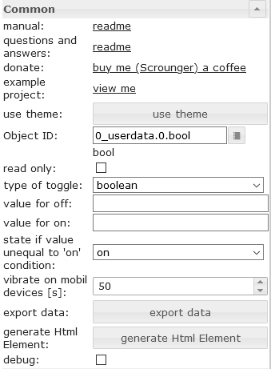</td><td>切换类型</td><td>定义应切换的数据点类型（布尔值或值）</td></tr><tr><td>折价</td><td>设置开关为假的值</td></tr><tr><td>的价值</td><td>设置开关为真值</td></tr><tr><td>说明值是否等于“ on”条件</td><td>当值与“ on”条件不匹配时，设置开关的状态</td></tr></tbody></table>

### HTML属性
以下属性可用作[HTML小部件](#html-widgets)。

<table><thead><tr><th>财产</th><th>描述</th><th>类型</th><th>价值观</th></tr></thead><tbody><tr><td colspan="4" style="background: #44739e; color: white; border-color: #44739e;"><i><b><br>常见的</b></i></td></tr><tr><td>mdw-oid</td><td>对象ID</td><td>细绳</td><td></tr><tr><td>mdw-readOnly</td><td>只读</td><td>布尔值</td><td>错误|真的</tr><tr><td>mdw-toggleType</td><td>切换类型</td><td>细绳</td><td>布尔|价值</tr><tr><td>mdw-valueOff</td><td>折价</td><td>细绳</td><td></tr><tr><td>mdw-valueOn</td><td>的价值</td><td>细绳</td><td></tr><tr><td>mdw-stateIfNotTrueValue</td><td>说明值是否等于“ on”条件</td><td>细绳</td><td>在|离开</tr><tr><td>mdw-vibrateOnMobilDevices</td><td>在移动装置上振动[s]</td><td>数字</td><td></tr><tr><td>mdw调试</td><td>调试</td><td>布尔值</td><td>错误|真的</tr><tr><td colspan="4" style="background: #44739e; color: white; border-color: #44739e;"><i><b><br>贴标</b></i></td></tr><tr><td>mdw-labelFalse</td><td>标签为假</td><td>细绳</td><td></tr><tr><td>mdw-labelTrue</td><td>标签为真</td><td>细绳</td><td></tr><tr><td>mdw-labelPosition</td><td> labelPosition</td><td>细绳</td><td>左|对|离开</tr><tr><td>mdw-labelClickActive</td><td>激活标签点击</td><td>布尔值</td><td>错误|真的</tr><tr><td>mdw-valueFontFamily</td><td> valueFontFamily</td><td>细绳</td><td></tr><tr><td>mdw-valueFontSize</td><td>值字体大小</td><td>数字</td><td></tr><tr><td colspan="4" style="background: #44739e; color: white; border-color: #44739e;"><i><b><br>颜色</b></i></td></tr><tr><td>mdw-colorSwitchThumb</td><td>开关的拇指颜色</td><td>细绳</td><td>十六进制（＃44739e），rgb（20、50、200），rgba（20、50、200、0.5）</tr><tr><td> mdw-colorSwitchTrack</td><td>跟踪开关的颜色</td><td>细绳</td><td>十六进制（＃44739e），rgb（20、50、200），rgba（20、50、200、0.5）</tr><tr><td> mdw-colorSwitchTrue</td><td>活动开关颜色</td><td>细绳</td><td>十六进制（＃44739e），rgb（20、50、200），rgba（20、50、200、0.5）</tr><tr><td> mdw-colorSwitchHover</td><td>悬停开关颜色</td><td>细绳</td><td>十六进制（＃44739e），rgb（20、50、200），rgba（20、50、200、0.5）</tr><tr><td> mdw-colorSwitchHoverTrue</td><td>选择的活动开关颜色/悬停</td><td>细绳</td><td>十六进制（＃44739e），rgb（20、50、200），rgba（20、50、200、0.5）</tr><tr><td> mdw-labelColorFalse</td><td>标签颜色</td><td>细绳</td><td>十六进制（＃44739e），rgb（20、50、200），rgba（20、50、200、0.5）</tr><tr><td> mdw-labelColorTrue</td><td>活动标签颜色</td><td>细绳</td><td>十六进制（＃44739e），rgb（20、50、200），rgba（20、50、200、0.5）</tr><tr><td colspan="4" style="background: #44739e; color: white; border-color: #44739e;"><i><b><br>锁定</b></i></td></tr><tr><td>mdw-lockEnabled</td><td>启用锁定</td><td>布尔值</td><td>错误|真的</tr><tr><td>mdw-autoLockAfter</td><td> [s]之后自动锁定</td><td>数字</td><td></tr><tr><td>mdw-lockIcon</td><td>图标</td><td>细绳</td><td></tr><tr><td>mdw-lockIconTop</td><td>距顶部的符号距离[％]</td><td>数字</td><td></tr><tr><td>mdw-lockIconLeft</td><td>距左的符号距离[％]</td><td>数字</td><td></tr><tr><td>mdw-lockIconSize</td><td>图标大小</td><td>数字</td><td></tr><tr><td>mdw-lockIconColor</td><td>图标颜色</td><td>细绳</td><td>十六进制（＃44739e），rgb（20、50、200），rgba（20、50、200、0.5）</tr><tr><td> mdw-lockFilterGrayscale</td><td>灰色滤镜（如果锁定）</td><td>数字</td><td></tr></tbody></table>

<！-在目录中省略->

#### HTML属性-示例
<details>

```
<div class='vis-widget materialdesign-widget materialdesign-switch materialdesign-switch-html-element'
	style='width: 100%; height: 50px; position: relative; overflow: visible !important; display: flex; align-items: center;'
	mdw-debug='false'
	mdw-oid='0_userdata.0.bool'
	mdw-toggleType='boolean'
	mdw-stateIfNotTrueValue='on'
	mdw-vibrateOnMobilDevices='50'
	mdw-labelFalse='off'
	mdw-labelTrue='on'
	mdw-labelPosition='right'
	mdw-labelClickActive='true'
	mdw-valueFontFamily='#mdwTheme:vis-materialdesign.0.fonts.switch.value'
	mdw-valueFontSize='#mdwTheme:vis-materialdesign.0.fontSizes.switch.value'
	mdw-colorSwitchThumb='#mdwTheme:vis-materialdesign.0.colors.switch.off'
	mdw-colorSwitchTrack='#mdwTheme:vis-materialdesign.0.colors.switch.track'
	mdw-colorSwitchTrue='#mdwTheme:vis-materialdesign.0.colors.switch.on'
	mdw-colorSwitchHover='#mdwTheme:vis-materialdesign.0.colors.switch.off_hover'
	mdw-colorSwitchHoverTrue='#mdwTheme:vis-materialdesign.0.colors.switch.on_hover'
	mdw-labelColorFalse='#mdwTheme:vis-materialdesign.0.colors.switch.text_off'
	mdw-labelColorTrue='#mdwTheme:vis-materialdesign.0.colors.switch.text_on'
	mdw-autoLockAfter='10'
	mdw-lockIconTop='5'
	mdw-lockIconLeft='5'
	mdw-lockIconColor='#mdwTheme:vis-materialdesign.0.colors.switch.lock_icon'
	mdw-lockFilterGrayscale='30'
></div>
```

</ details>

＃＃ 价值


作为HTML窗口小部件，通过提供更好的性能，它可以用作绑定的替代方法。

###编辑器设置
下表中未列出的设置是不言自明的。

<table><thead><tr><th>截屏</th><th>环境</th><th>描述</th></tr></thead><tbody><tr><td rowspan=2></td><td>目标类型</td><td>如果要转换为其他类型，请选择要转换为的目标类型。</td></tr><tr><td>覆盖文字</td><td>覆盖值文本。您可以使用<code>#value</code>在文本中显示值</td></tr><tr><td rowspan=3></td><td> 计算</td><td>使用<code>#value</code>作为数据点的值，并使用<a href="https://mathjs.org/docs/expressions/syntax.html#operators" _target="blank">mathjs评估表达式通过计算将其转换</a></td></tr><tr><td>将秒转换为持续时间</td><td>将持续时间（以秒为单位）转换为可读的字符串。<a href="https://github.com/jsmreese/moment-duration-format#template-string">必须根据矩量持续时间格式</a>库输入批准的格式。您也可以使用<code>humanize</code> 。<br><br>也可以将其与计算结合起来，例如，如果源值以分钟为单位，则可以使用计算将其转换为秒</td></tr><tr><td>将时间戳转换为日期时间</td><td>将时间戳转换为可读的日期时间。<a href="https://momentjs.com/docs/#/displaying/format/">必须根据momentjs</a>库输入批准的格式。<br><br>也可以将其与计算相结合</td></tr><tr><td rowspan=1></td><td> 健康）状况</td><td>使用<code>#value</code>作为数据点和条件的值，以通过使用<a href="https://mathjs.org/docs/expressions/syntax.html#operators" _target="blank">mathjs评估表达式将其他类型格式化为布尔值</a></td></tr></tbody></table>

### HTML属性
以下属性可用作[HTML小部件](#html-widgets)。

<table><thead><tr><th>财产</th><th>描述</th><th>类型</th><th>价值观</th></tr></thead><tbody><tr><td colspan="4" style="background: #44739e; color: white; border-color: #44739e;"><i><b><br>常见的</b></i></td></tr><tr><td>mdw-oid</td><td>对象ID</td><td>细绳</td><td></tr><tr><td>mdw-targetType</td><td>目标类型</td><td>细绳</td><td>汽车|编号|字符串|布尔值</tr><tr><td>mdw-overrideText</td><td>覆盖文字</td><td>细绳</td><td></tr><tr><td>mdw调试</td><td>调试</td><td>布尔值</td><td>错误|真的</tr><tr><td colspan="4" style="background: #44739e; color: white; border-color: #44739e;"><i><b><br>布局</b></i></td></tr><tr><td>mdw-textAlign</td><td> textAlign</td><td>细绳</td><td>开始中心|结尾</tr><tr><td>mdw-valuesFontColor</td><td>字体颜色</td><td>细绳</td><td>十六进制（＃44739e），rgb（20、50、200），rgba（20、50、200、0.5）</tr><tr><td> mdw-valuesFontFamily</td><td>字形</td><td>细绳</td><td></tr><tr><td>mdw-valuesFontSize</td><td>字体大小</td><td>数字</td><td></tr><tr><td>mdw-prepandText</td><td>文字预填</td><td>细绳</td><td></tr><tr><td>mdw-prepandTextColor</td><td>预先填入文字的颜色</td><td>细绳</td><td>十六进制（＃44739e），rgb（20、50、200），rgba（20、50、200、0.5）</tr><tr><td> mdw-prepandTextFontFamily</td><td>预设的文字字体</td><td>细绳</td><td></tr><tr><td>mdw-prepandTextFontSize</td><td>预先填入大小文字</td><td>数字</td><td></tr><tr><td>mdw-appendText</td><td>附加文字</td><td>细绳</td><td></tr><tr><td>mdw-appendTextColor</td><td>附加文字的颜色</td><td>细绳</td><td>十六进制（＃44739e），rgb（20、50、200），rgba（20、50、200、0.5）</tr><tr><td> mdw-appendTextFontFamily</td><td>附加文字的字体</td><td>细绳</td><td></tr><tr><td>mdw-appendTextFontSize</td><td>附加文字的字体大小</td><td>数字</td><td></tr><tr><td colspan="4" style="background: #44739e; color: white; border-color: #44739e;"><i><b><br>数字格式</b></i></td></tr><tr><td>mdw-valueLabelUnit</td><td>单元</td><td>细绳</td><td></tr><tr><td>mdw-minDecimals</td><td>最小小数</td><td>数字</td><td></tr><tr><td>mdw-maxDecimals</td><td>最大小数</td><td>数字</td><td></tr><tr><td>mdw-计算</td><td>计算</td><td>细绳</td><td></tr><tr><td>mdw-convertToDuration</td><td>转换为持续时间</td><td>文本</td><td></tr><tr><td colspan="4" style="background: #44739e; color: white; border-color: #44739e;"><i><b><br>布尔格式</b></i></td></tr><tr><td>mdw-textOnTrue</td><td>文字为真</td><td>细绳</td><td></tr><tr><td>mdw-textOnFalse</td><td>文字是否为假</td><td>细绳</td><td></tr><tr><td>mdw条件</td><td>健康）状况</td><td>细绳</td><td></tr><tr><td colspan="4" style="background: #44739e; color: white; border-color: #44739e;"><i><b><br>图标</b></i></td></tr><tr><td>mdw图像</td><td>图像</td><td>细绳</td><td></tr><tr><td>mdw-imageColor</td><td>图像颜色</td><td>细绳</td><td>十六进制（＃44739e），rgb（20、50、200），rgba（20、50、200、0.5）</tr><tr><td> mdw-iconPosition</td><td>图像位置</td><td>细绳</td><td>左|正确的</tr><tr><td>mdw-iconHeight</td><td>影像高度</td><td>数字</td><td></tr><tr><td colspan="4" style="background: #44739e; color: white; border-color: #44739e;"><i><b><br>价值变化效应</b></i></td></tr><tr><td>mdw-changeEffectEnabled</td><td>已启用</td><td>布尔值</td><td>错误|真的</tr><tr><td>mdw-effectFontColor</td><td>字体颜色</td><td>细绳</td><td>十六进制（＃44739e），rgb（20、50、200），rgba（20、50、200、0.5）</tr><tr><td> mdw-effectFontSize</td><td>字体大小</td><td>数字</td><td></tr><tr><td>mdw-effectDuration</td><td>效果持续时间</td><td>数字</td><td></tr></tbody></table>

<！-在目录中省略->

#### HTML属性-示例
<details>

```
<div class='vis-widget materialdesign-widget materialdesign-value materialdesign-value-html-element'
	style='width: 218px; height: 30px; position: relative; display: flex; align-items: center;'
	mdw-debug='false'
	mdw-oid='0_userdata.0.MDW.Value.number'
	mdw-targetType='auto'
	mdw-textAlign='start'
	mdw-valuesFontColor='#mdwTheme:vis-materialdesign.0.colors.value.text'
	mdw-valuesFontFamily='#mdwTheme:vis-materialdesign.0.fonts.value.text'
	mdw-valuesFontSize='#mdwTheme:vis-materialdesign.0.fontSizes.value.text'
	mdw-prepandText='aktuelle Leistung:'
	mdw-prepandTextColor='#mdwTheme:vis-materialdesign.0.colors.value.prepand'
	mdw-prepandTextFontFamily='#mdwTheme:vis-materialdesign.0.fonts.value.prepand'
	mdw-prepandTextFontSize='#mdwTheme:vis-materialdesign.0.fontSizes.value.prepand'
	mdw-appendTextColor='#mdwTheme:vis-materialdesign.0.colors.value.append'
	mdw-appendTextFontFamily='#mdwTheme:vis-materialdesign.0.fonts.value.append'
	mdw-appendTextFontSize='#mdwTheme:vis-materialdesign.0.fontSizes.value.append'
	mdw-valueLabelUnit='W'
	mdw-image='power-plug'
	mdw-imageColor='#mdwTheme:vis-materialdesign.0.colors.value.icon'
	mdw-iconPosition='left'
	mdw-changeEffectEnabled='true'
	mdw-effectFontColor='#00e640'
	mdw-effectFontSize='20'
	mdw-effectDuration='1000'
></div>
```

</ details>

## HTML卡


＃＃ 列表


###编辑器设置
下表中未列出的设置是不言自明的。

<table><thead><tr><th>截屏</th><th>环境</th><th>描述</th></tr></thead><tbody><tr><td rowspan=4>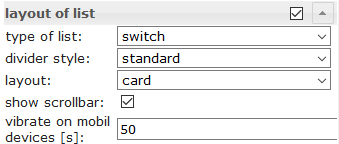</td><td>清单类型</td><td>控制列表的类型，例如复选框，按钮状态，按钮切换等。</td></tr><tr><td>分隔线样式</td><td>分隔线的样式</td></tr><tr><td>布局</td><td>标准或卡布局</td></tr><tr><td>显示滚动条</td><td>必要时显示滚动条</td></tr><tr><td rowspan=4></td><td>列表数据的输入方法</td><td>使用编辑器或json字符串定义项目</td></tr><tr><td>编辑器：列表项计数</td><td>使用编辑器对列表项进行计数</td></tr><tr><td>JSON-String：对象ID</td><td>包含json字符串的datapoint的对象ID。允许的属性如下所述</td></tr></tbody></table>

###数据JSON属性
<table><thead><tr><th>财产</th><th>描述</th><th>类型</th><th>价值观</th></tr></thead><tbody><tr><td>objectId</td><td>数据点的ID</td><td>细绳</td><td></td></tr><tr><td>buttonStateValue</td><td>如果列表来自类型按钮状态，则为按钮的值</td><td>细绳</td><td></td></tr><tr><td>buttonNavView</td><td>如果列表来自类型按钮导航，则查看按钮</td><td>细绳</td><td></td></tr><tr><td>buttonLink</td><td>如果列表来自类型按钮，则链接按钮的地址</td><td>细绳</td><td></td></tr><tr><td>标头</td><td>项目的标题文本</td><td>细绳</td><td></td></tr><tr><td>文本</td><td>主要文字</td><td>细绳</td><td></td></tr><tr><td>子文本</td><td>次要文字</td><td>细绳</td><td></td></tr><tr><td>rightText</td><td>主要权利文本</td><td>细绳</td><td></td></tr><tr><td>rightSubText</td><td>次要权利文字</td><td>细绳</td><td></td></tr><tr><td>图像</td><td>材料设计图标或图像路径</td><td>细绳</td><td></td></tr><tr><td>imageColor</td><td>材料设计图标的颜色</td><td>细绳</td><td>十六进制（＃44739e），rgb（20、50、200），rgba（20、50、200、0.5）</td></tr><tr><td> imageActive</td><td>材料设计图标或图像路径（如果数据点处于活动状态）</td><td>细绳</td><td></td></tr><tr><td>imageActiveColor</td><td>如果数据点处于活动状态，则材料设计图标的颜色</td><td>细绳</td><td>十六进制（＃44739e），rgb（20、50、200），rgba（20、50、200、0.5）</td></tr><tr><td> showDivider</td><td>显示分隔线</td><td>布尔值</td><td>错误|真的</td></tr></tbody></table>

<！-在目录中省略->

#### JSON属性-示例
<details> <pre><code> [ { "text": "item0", "subText": "{0_userdata.0.MDW.list.bind0}", "rightText": "right", "rightSubText": "", "image": "clock-check-outline", "imageColor": "#44739e", "imageActive": "", "imageActiveColor": "", "header": "JSON", "showDivider": "false", "objectId": "0_userdata.0.MDW.list.bool.val0", "buttonStateValue": "", "buttonNavView": "", "buttonLink": "" }, { "text": "item1", "subText": "{0_userdata.0.MDW.list.bind1}", "rightText": "right", "rightSubText": "", "image": "clock-check-outline", "imageColor": "#44739e", "imageActive": "", "imageActiveColor": "", "header": "", "showDivider": "false", "objectId": "0_userdata.0.MDW.list.bool.val1", "buttonStateValue": "", "buttonNavView": "", "buttonLink": "" }, { "text": "item2", "subText": "", "rightText": "right", "rightSubText": "", "image": "clock-check-outline", "imageColor": "#44739e", "imageActive": "", "imageActiveColor": "", "header": "", "showDivider": "false", "objectId": "0_userdata.0.MDW.list.bool.val2", "buttonStateValue": "", "buttonNavView": "", "buttonLink": "" }, { "text": "item3", "subText": "fuuuu", "rightText": "right", "rightSubText": "", "image": "clock-check-outline", "imageColor": "#44739e", "imageActive": "", "imageActiveColor": "", "header": "", "showDivider": "false", "objectId": "0_userdata.0.MDW.list.bool.val3", "buttonStateValue": "", "buttonNavView": "", "buttonLink": "" } ] </code></pre> </details>

## IconList


###编辑器设置
下表中未列出的设置是不言自明的。

<table><thead><tr><th>截屏</th><th>环境</th><th>描述</th></tr></thead><tbody><tr><td rowspan=6></td><td>列表数据的输入方法</td><td>IconList的数据可以通过编辑器输入，也可以使用JSON字符串</td></tr><tr><td>编辑器：列表项计数</td><td>使用vis编辑器获取列表数据的列表项数</td></tr><tr><td>JSON-String：对象ID</td><td>包含json字符串的datapoint的对象ID。允许的属性如下所述</td></tr></tbody></table>

###数据JSON属性
JSON字符串必须是具有以下属性的对象数组：

<table><thead><tr><th>财产</th><th>描述</th><th>类型</th><th>价值观</th></tr></thead><tbody><tr><td>listType</td><td>清单类型</td><td>细绳</td><td>文字| buttonState | buttonToggle | buttonToggleValueTrue | buttonToggleValueFalse | buttonNav | buttonLink</td></tr><tr><td> objectId</td><td>按钮的对象ID</td><td>细绳</td><td/></tr><tr><td>buttonStateValue</td><td>按钮状态的值</td><td>细绳</td><td/></tr><tr><td>buttonNavView</td><td>查看导航</td><td>细绳</td><td/></tr><tr><td>buttonLink</td><td>网址导航</td><td>细绳</td><td/></tr><tr><td>buttonToggleValueTrue</td><td>按键切换的真实值</td><td>细绳</td><td/></tr><tr><td>buttonToggleValueFalse</td><td>按钮切换的假值</td><td>细绳</td><td/></tr><tr><td>showValueLabel</td><td>以文字显示价值</td><td>细绳</td><td/></tr><tr><td>价值附录</td><td>将文字附加到值</td><td>细绳</td><td/></tr><tr><td>背景</td><td>背景颜色</td><td>细绳</td><td>十六进制（＃44739e），rgb（20、50、200），rgba（20、50、200、0.5）</td></tr><tr><td>文本</td><td>文本</td><td>细绳</td><td/></tr><tr><td>子文本</td><td>第二文字</td><td>细绳</td><td/></tr><tr><td>图像</td><td>图像路径或“材料设计”图标的名称</td><td>细绳</td><td/></tr><tr><td>imageColor</td><td>材料设计图标的颜色</td><td>细绳</td><td>十六进制（＃44739e），rgb（20、50、200），rgba（20、50、200、0.5）</td></tr><tr><td> imageActive</td><td>图像路径或“材料设计”图标的名称</td><td>细绳</td><td/></tr><tr><td>imageActiveColor</td><td>活动按钮的图像路径或“材料设计”图标的名称</td><td>细绳</td><td>十六进制（＃44739e），rgb（20、50、200），rgba（20、50、200、0.5）</td></tr><tr><td> buttonBackgroundColor</td><td>按钮的背景色</td><td>细绳</td><td>十六进制（＃44739e），rgb（20、50、200），rgba（20、50、200、0.5）</td></tr><tr><td> buttonBackgroundActiveColor</td><td>活动按钮的按钮背景色</td><td>细绳</td><td>十六进制（＃44739e），rgb（20、50、200），rgba（20、50、200、0.5）</td></tr><tr><td> statusBarColor</td><td>状态栏的颜色</td><td>细绳</td><td>十六进制（＃44739e），rgb（20、50、200），rgba（20、50、200、0.5）</td></tr><tr><td> statusBarText</td><td>状态栏文字</td><td>细绳</td><td/></tr><tr><td>lockEnabled</td><td>启用锁定</td><td>布尔值</td><td>错误|真的</tr></tbody></table>

<！-在目录中省略->

#### JSON属性-示例
<details> <pre><code> [ { "background": "red", "text": "text1", "subText": "number", "image": "harddisk", "imageColor": "#ec0909", "imageActive": "folder", "imageActiveColor": "#5ad902", "buttonBackgroundColor": "", "buttonBackgroundActiveColor": "", "listType": "buttonState", "objectId": "0_userdata.0.iconList.buttonState.number", "buttonStateValue": "60", "buttonNavView": "", "buttonLink": "", "buttonToggleValueTrue": "", "buttonToggleValueFalse": "", "valueAppendix": "", "showValueLabel": "true", "statusBarColor": "green", "lockEnabled": "false" }, { "background": "green", "text": "text0", "subText": "bool", "image": "home", "imageColor": "#44739e", "imageActive": "home", "imageActiveColor": "#44739e", "buttonBackgroundColor": "", "buttonBackgroundActiveColor": "#a0f628", "listType": "buttonToggle", "objectId": "0_userdata.0.iconList.buttonToggle.bool0", "buttonStateValue": "60", "buttonNavView": "", "buttonLink": "", "buttonToggleValueTrue": "", "buttonToggleValueFalse": "", "valueAppendix": "", "showValueLabel": "false", "statusBarColor": "", "lockEnabled": "false" } ] </code></pre> </details>

＃＃ 进步


###编辑器设置
<table><thead><tr><th>截屏</th><th>环境</th><th>描述</th></tr></thead><tbody><tr><td rowspan=2></td><td>颜色1进度的条件[&gt;]</td><td>从应使用颜色1的时间开始。条件的值必须以百分比为单位</td></tr><tr><td>颜色2进度的条件[&gt;]</td><td>从应该使用颜色2的时间开始。条件的值必须以百分比为单位</td></tr><tr><td rowspan=1></td><td>自定义标签</td><td>对于自定义标签，可以使用属性<code>[#value]</code>显示数据点的实际值。要显示当前百分比，您可以使用<code>[#percent]</code></td></tr></tbody></table>

### HTML属性
以下属性可用作[HTML小部件](#html-widgets)。

<table><thead><tr><th>财产</th><th>描述</th><th>类型</th><th>价值观</th></tr></thead><tbody><tr><td>mdw型</td><td>小部件类型</td><td>细绳</td><td>线性的</td></tr><tr><td colspan="4" style="background: #44739e; color: white; border-color: #44739e;"><i><b><br>常见的</b></i></td></tr><tr><td>mdw-oid</td><td>对象ID</td><td>细绳</td><td></tr><tr><td>最小载重量</td><td>分</td><td>细绳</td><td></tr><tr><td>最大密度</td><td>最大限度</td><td>细绳</td><td></tr><tr><td>mdw-progressIndeterminate</td><td>不确定-连续动画</td><td>布尔值</td><td>错误|真的</tr><tr><td>mdw-reverse</td><td>冲销价值</td><td>布尔值</td><td>错误|真的</tr><tr><td>mdw调试</td><td>调试</td><td>布尔值</td><td>错误|真的</tr><tr><td colspan="4" style="background: #44739e; color: white; border-color: #44739e;"><i><b><br>布局</b></i></td></tr><tr><td>mdw-progressRounded</td><td>圆角</td><td>布尔值</td><td>错误|真的</tr><tr><td>mdw-progressStriped</td><td>有条纹的</td><td>布尔值</td><td>错误|真的</tr><tr><td>mdw-progressStripedColor</td><td> progressStripedColor</td><td>细绳</td><td>十六进制（＃44739e），rgb（20、50、200），rgba（20、50、200、0.5）</tr><tr><td colspan="4" style="background: #44739e; color: white; border-color: #44739e;"><i><b><br>颜色</b></i></td></tr><tr><td>mdw-colorProgressBackground</td><td>背景颜色</td><td>细绳</td><td>十六进制（＃44739e），rgb（20、50、200），rgba（20、50、200、0.5）</tr><tr><td> mdw-colorProgress</td><td>颜色进度</td><td>细绳</td><td>十六进制（＃44739e），rgb（20、50、200），rgba（20、50、200、0.5）</tr><tr><td> mdw-colorOneCondition</td><td>颜色1进度的条件[&gt;]</td><td>数字</td><td></tr><tr><td>mdw-colorOne</td><td>颜色1进度</td><td>细绳</td><td>十六进制（＃44739e），rgb（20、50、200），rgba（20、50、200、0.5）</tr><tr><td> mdw-colorTwoCondition</td><td>颜色2进度的条件[&gt;]</td><td>数字</td><td></tr><tr><td>mdw-color2</td><td>颜色2进度</td><td>细绳</td><td>十六进制（＃44739e），rgb（20、50、200），rgba（20、50、200、0.5）</tr><tr><td colspan="4" style="background: #44739e; color: white; border-color: #44739e;"><i><b><br>贴标</b></i></td></tr><tr><td>mdw-showValueLabel</td><td>显示价值</td><td>布尔值</td><td>错误|真的</tr><tr><td>mdw-valueLabelStyle</td><td>价值标题样式</td><td>细绳</td><td>progressPercent | progressValue | progressCustom</tr><tr><td> mdw-valueLabelUnit</td><td>单元</td><td>细绳</td><td></tr><tr><td>mdw-valueMaxDecimals</td><td>小数点</td><td>数字</td><td></tr><tr><td>mdw-valueLabelCustom</td><td>自定义标签</td><td>细绳</td><td></tr><tr><td>mdw-textColor</td><td>分钟文字颜色</td><td>细绳</td><td>十六进制（＃44739e），rgb（20、50、200），rgba（20、50、200、0.5）</tr><tr><td> mdw-textFontSize</td><td>字体大小</td><td>数字</td><td></tr><tr><td>mdw-textFontFamily</td><td>字形</td><td>细绳</td><td></tr><tr><td>mdw-textAlign</td><td> textAlign</td><td>细绳</td><td>开始中心|结尾</tr></tbody></table>

<！-在目录中省略->

#### HTML属性-示例
<details>

```
<div class='vis-widget materialdesign-widget materialdesign-progress materialdesign-progress-html-element'
	style='width: 100%; height: 100%; position: relative; padding: 0px;'
	mdw-type='linear'
	mdw-oid='0_userdata.0.MDW.Progress.val0'
	mdw-debug='true'
	mdw-progressRounded='true'
	mdw-colorProgressBackground='#mdwTheme:vis-materialdesign.0.colors.progress.track_background'
	mdw-colorProgress='#mdwTheme:vis-materialdesign.0.colors.progress.track'
	mdw-colorOneCondition='50'
	mdw-colorOne='#mdwTheme:vis-materialdesign.0.colors.progress.track_condition1'
	mdw-colorTwoCondition='70'
	mdw-colorTwo='#mdwTheme:vis-materialdesign.0.colors.progress.track_condition2'
	mdw-showValueLabel='true'
	mdw-valueLabelStyle='progressPercent'
	mdw-textColor='#mdwTheme:vis-materialdesign.0.colors.progress.text'
	mdw-textFontSize='#mdwTheme:vis-materialdesign.0.fontSizes.progress.text'
	mdw-textFontFamily='#mdwTheme:vis-materialdesign.0.fonts.progress.text'
	mdw-textAlign='end'
></div>
```

</ details>

##进度通知


###编辑器设置
下表中未列出的设置是不言自明的。

<table><thead><tr><th>截屏</th><th>环境</th><th>描述</th></tr></thead><tbody><tr><td rowspan=2></td><td>颜色1进度的条件[&gt;]</td><td>从应使用颜色1的时间开始。条件的值必须以百分比为单位</td></tr><tr><td>颜色2进度的条件[&gt;]</td><td>从应该使用颜色2的时间开始。条件的值必须以百分比为单位</td></tr><tr><td rowspan=6></td><td>自定义标签</td><td>对于自定义标签，可以使用属性<code>[#value]</code>显示数据点的实际值。要显示当前百分比，您可以使用<code>[#percent]</code></td></tr></tbody></table>

### HTML属性
以下属性可用作[HTML小部件](#html-widgets)。

<table><thead><tr><th>财产</th><th>描述</th><th>类型</th><th>价值观</th></tr></thead><tbody><tr><td>mdw型</td><td>小部件类型</td><td>细绳</td><td>圆</td></tr><tr><td colspan="4" style="background: #44739e; color: white; border-color: #44739e;"><i><b><br>常见的</b></i></td></tr><tr><td>mdw-oid</td><td>对象ID</td><td>细绳</td><td></tr><tr><td>最小载重量</td><td>分</td><td>细绳</td><td></tr><tr><td>最大密度</td><td>最大限度</td><td>细绳</td><td></tr><tr><td>mdw-progressIndeterminate</td><td>不确定-连续动画</td><td>布尔值</td><td>错误|真的</tr><tr><td>mdw调试</td><td>调试</td><td>布尔值</td><td>错误|真的</tr><tr><td colspan="4" style="background: #44739e; color: white; border-color: #44739e;"><i><b><br>布局</b></i></td></tr><tr><td>mdw-progressCircularSize</td><td>尺寸</td><td>数字</td><td></tr><tr><td>mdw-progressCircularWidth</td><td>厚度</td><td>数字</td><td></tr><tr><td>mdw-progressCircularRotate</td><td>旋转起点</td><td>数字</td><td></tr><tr><td colspan="4" style="background: #44739e; color: white; border-color: #44739e;"><i><b><br>颜色</b></i></td></tr><tr><td>mdw-colorProgressBackground</td><td>背景颜色</td><td>细绳</td><td>十六进制（＃44739e），rgb（20、50、200），rgba（20、50、200、0.5）</tr><tr><td> mdw-colorProgress</td><td>颜色进度</td><td>细绳</td><td>十六进制（＃44739e），rgb（20、50、200），rgba（20、50、200、0.5）</tr><tr><td> mdw-innerColor</td><td>圆圈背景色</td><td>细绳</td><td>十六进制（＃44739e），rgb（20、50、200），rgba（20、50、200、0.5）</tr><tr><td> mdw-colorOneCondition</td><td>颜色1进度的条件[&gt;]</td><td>数字</td><td></tr><tr><td>mdw-colorOne</td><td>颜色1进度</td><td>细绳</td><td>十六进制（＃44739e），rgb（20、50、200），rgba（20、50、200、0.5）</tr><tr><td> mdw-colorTwoCondition</td><td>颜色2进度的条件[&gt;]</td><td>数字</td><td></tr><tr><td>mdw-color2</td><td>颜色2进度</td><td>细绳</td><td>十六进制（＃44739e），rgb（20、50、200），rgba（20、50、200、0.5）</tr><tr><td colspan="4" style="background: #44739e; color: white; border-color: #44739e;"><i><b><br>贴标</b></i></td></tr><tr><td>mdw-showValueLabel</td><td>显示价值</td><td>布尔值</td><td>错误|真的</tr><tr><td>mdw-valueLabelStyle</td><td>价值标题样式</td><td>细绳</td><td>progressPercent | progressValue | progressCustom</tr><tr><td> mdw-valueLabelUnit</td><td>单元</td><td>细绳</td><td></tr><tr><td>mdw-valueMaxDecimals</td><td>小数点</td><td>数字</td><td></tr><tr><td>mdw-valueLabelCustom</td><td>自定义标签</td><td>细绳</td><td></tr><tr><td>mdw-textColor</td><td>分钟文字颜色</td><td>细绳</td><td>十六进制（＃44739e），rgb（20、50、200），rgba（20、50、200、0.5）</tr><tr><td> mdw-textFontSize</td><td>字体大小</td><td>数字</td><td></tr><tr><td>mdw-textFontFamily</td><td>字形</td><td>细绳</td><td></tr></tbody></table>

<！-在目录中省略->

#### HTML属性-示例
<details>

```
<div class='vis-widget materialdesign-widget materialdesign-progress materialdesign-progress-html-element'
	style='width: 100%; height: 100%; position: relative; padding: 0px;'
	mdw-type='circular'
	mdw-oid='0_userdata.0.MDW.Progress.val1'
	mdw-colorProgressBackground='#mdwTheme:vis-materialdesign.0.colors.progress.track_background'
	mdw-colorProgress='#mdwTheme:vis-materialdesign.0.colors.progress.track'
	mdw-innerColor='#mdwTheme:vis-materialdesign.0.colors.progress.circular_background'
	mdw-colorOneCondition='50'
	mdw-colorOne='#mdwTheme:vis-materialdesign.0.colors.progress.track_condition1'
	mdw-colorTwoCondition='70'
	mdw-colorTwo='#mdwTheme:vis-materialdesign.0.colors.progress.track_condition2'
	mdw-showValueLabel='true'
	mdw-valueLabelStyle='progressPercent'
	mdw-textColor='#mdwTheme:vis-materialdesign.0.colors.progress.text'
	mdw-textFontSize='#mdwTheme:vis-materialdesign.0.fontSizes.progress.text'
	mdw-textFontFamily='#mdwTheme:vis-materialdesign.0.fonts.progress.text'
></div>
```

</ details>

##滑块


### HTML属性
以下属性可用作[HTML小部件](#html-widgets)。

<table><thead><tr><th>财产</th><th>描述</th><th>类型</th><th>价值观</th></tr></thead><tbody><tr><td colspan="4" style="background: #44739e; color: white; border-color: #44739e;"><i><b><br>常见的</b></i></td></tr><tr><td>mdw-oid</td><td>对象ID</td><td>细绳</td><td></tr><tr><td>mdw-oid工作</td><td>工作对象ID</td><td>细绳</td><td></tr><tr><td>mdw方向</td><td>方向</td><td>细绳</td><td>卧式|垂直的</tr><tr><td>mdw-reverseSlider</td><td>反转滑块</td><td>布尔值</td><td>错误|真的</tr><tr><td>mdw-knobSize</td><td>旋钮尺寸</td><td>细绳</td><td>旋钮小|旋钮中|旋钮大</tr><tr><td>mdw-readOnly</td><td>只读</td><td>布尔值</td><td>错误|真的</tr><tr><td>最小载重量</td><td>分</td><td>细绳</td><td></tr><tr><td>最大密度</td><td>最大限度</td><td>细绳</td><td></tr><tr><td>mdw-step</td><td>脚步</td><td>细绳</td><td></tr><tr><td>mdw-vibrateOnMobilDevices</td><td>在移动装置上振动[s]</td><td>数字</td><td></tr><tr><td>mdw调试</td><td>调试</td><td>布尔值</td><td>错误|真的</tr><tr><td colspan="4" style="background: #44739e; color: white; border-color: #44739e;"><i><b><br>步骤布局</b></i></td></tr><tr><td>mdw-showTicks</td><td>显示步骤</td><td>细绳</td><td>没有是的总是</tr><tr><td>mdw-tickSize</td><td>显示步长</td><td>数字</td><td></tr><tr><td>mdw-tickLabels</td><td>步骤文本（逗号分隔）</td><td>细绳</td><td></tr><tr><td>mdw-tickTextColor</td><td>步骤的文字颜色</td><td>细绳</td><td>十六进制（＃44739e），rgb（20、50、200），rgba（20、50、200、0.5）</tr><tr><td> mdw-tickFontFamily</td><td>步骤字体</td><td>细绳</td><td></tr><tr><td>mdw-tickFontSize</td><td>字体大小</td><td>数字</td><td></tr><tr><td>mdw-tickColorBefore</td><td>调节器前的颜色</td><td>细绳</td><td>十六进制（＃44739e），rgb（20、50、200），rgba（20、50、200、0.5）</tr><tr><td> mdw-tickColorAfter</td><td>调压器后的颜色</td><td>细绳</td><td>十六进制（＃44739e），rgb（20、50、200），rgba（20、50、200、0.5）</tr><tr><td colspan="4" style="background: #44739e; color: white; border-color: #44739e;"><i><b><br>颜色</b></i></td></tr><tr><td>mdw-colorBeforeThumb</td><td>调压器前的颜色</td><td>细绳</td><td>十六进制（＃44739e），rgb（20、50、200），rgba（20、50、200、0.5）</tr><tr><td> mdw-colorThumb</td><td>调节器的颜色</td><td>细绳</td><td>十六进制（＃44739e），rgb（20、50、200），rgba（20、50、200、0.5）</tr><tr><td> mdw-colorAfterThumb</td><td>调节剂后颜色</td><td>细绳</td><td>十六进制（＃44739e），rgb（20、50、200），rgba（20、50、200、0.5）</tr><tr><td colspan="4" style="background: #44739e; color: white; border-color: #44739e;"><i><b><br>贴标</b></i></td></tr><tr><td>mdw-prepandText</td><td>文字预填</td><td>细绳</td><td></tr><tr><td>mdw-prepandTextWidth</td><td> prepandTextWidth</td><td>数字</td><td></tr><tr><td>mdw-prepandTextColor</td><td>预先填入文字的颜色</td><td>细绳</td><td>十六进制（＃44739e），rgb（20、50、200），rgba（20、50、200、0.5）</tr><tr><td> mdw-prepandTextFontSize</td><td>预先填入大小文字</td><td>数字</td><td></tr><tr><td>mdw-prepandTextFontFamily</td><td>预设的文字字体</td><td>细绳</td><td></tr><tr><td>mdw-showValueLabel</td><td>显示价值</td><td>布尔值</td><td>错误|真的</tr><tr><td>mdw-valueLabelStyle</td><td>价值标题样式</td><td>细绳</td><td>slidePercent | SliderValue</tr><tr><td> mdw-valueLabelUnit</td><td>单元</td><td>细绳</td><td></tr><tr><td>mdw-valueFontFamily</td><td> valueFontFamily</td><td>细绳</td><td></tr><tr><td>mdw-valueFontSize</td><td>值字体大小</td><td>数字</td><td></tr><tr><td>mdw-valueLabelColor</td><td>值的文字颜色</td><td>细绳</td><td>十六进制（＃44739e），rgb（20、50、200），rgba（20、50、200、0.5）</tr><tr><td> mdw-valueLabelMin</td><td>值小于min的文字</td><td>细绳</td><td></tr><tr><td>mdw-valueLabelMax</td><td>值大于min的文字</td><td>细绳</td><td></tr><tr><td>mdw-valueLessThan</td><td>值文字的“小于”条件</td><td>数字</td><td></tr><tr><td>mdw-textForValueLessThan</td><td>文字“小于”</td><td>细绳</td><td></tr><tr><td>mdw-valueGreaterThan</td><td>值文字的“大于”条件</td><td>数字</td><td></tr><tr><td>mdw-textForValueGreaterThan</td><td>文字“大于”</td><td>细绳</td><td></tr><tr><td>mdw-valueLabelWidth</td><td>距离标签</td><td>数字</td><td></tr><tr><td colspan="4" style="background: #44739e; color: white; border-color: #44739e;"><i><b><br>控制器标签的布局</b></i></td></tr><tr><td>mdw-showThumbLabel</td><td>显示标签</td><td>细绳</td><td>没有是的总是</tr><tr><td>mdw-thumbSize</td><td>标签尺寸</td><td>数字</td><td></tr><tr><td>mdw-thumbBackgroundColor</td><td>背景颜色</td><td>细绳</td><td>十六进制（＃44739e），rgb（20、50、200），rgba（20、50、200、0.5）</tr><tr><td> mdw-thumbFontColor</td><td>字体颜色</td><td>细绳</td><td>十六进制（＃44739e），rgb（20、50、200），rgba（20、50、200、0.5）</tr><tr><td> mdw-thumbFontSize</td><td>字体大小</td><td>数字</td><td></tr><tr><td>mdw-thumbFontFamily</td><td>字形</td><td>细绳</td><td></tr><tr><td>mdw-useLabelRules</td><td>使用文字规则</td><td>布尔值</td><td>错误|真的</tr></tbody></table>

<！-在目录中省略->

#### HTML属性-示例
<details>

```
<div class='vis-widget materialdesign-widget materialdesign-slider-vertical materialdesign-slider-html-element'
	style='width: 342px; height: 100px; position: relative; overflow:visible !important; display: flex; align-items: center;'
	mdw-debug='false'
	mdw-oid='0_userdata.0.MDW.Slider.val0'
	mdw-oid-working='0_userdata.0.MDW.Slider.working'
	mdw-orientation='horizontal'
	mdw-knobSize='knobSmall'
	mdw-min='0'
	mdw-max='100'
	mdw-step='10'
	mdw-vibrateOnMobilDevices='50'
	mdw-showTicks='always'
	mdw-tickSize='5'
	mdw-tickLabels='1,2,3,4,5,6,7,8,9,10,11'
	mdw-tickTextColor='#mdwTheme:vis-materialdesign.0.colors.slider.tick'
	mdw-tickFontFamily='#mdwTheme:vis-materialdesign.0.fonts.slider.ticks'
	mdw-tickFontSize='#mdwTheme:vis-materialdesign.0.fontSizes.slider.ticks'
	mdw-tickColorBefore='#mdwTheme:vis-materialdesign.0.colors.slider.tick_before'
	mdw-tickColorAfter='#mdwTheme:vis-materialdesign.0.colors.slider.tick_after'
	mdw-colorBeforeThumb='#mdwTheme:vis-materialdesign.0.colors.slider.control_before'
	mdw-colorThumb='#mdwTheme:vis-materialdesign.0.colors.slider.control'
	mdw-colorAfterThumb='#mdwTheme:vis-materialdesign.0.colors.slider.control_behind'
	mdw-prepandText='prepand'
	mdw-prepandTextWidth='60'
	mdw-prepandTextColor='#mdwTheme:vis-materialdesign.0.colors.slider.text_prepand'
	mdw-prepandTextFontSize='#mdwTheme:vis-materialdesign.0.fontSizes.slider.prepand'
	mdw-prepandTextFontFamily='#mdwTheme:vis-materialdesign.0.fonts.slider.prepand'
	mdw-showValueLabel='true'
	mdw-valueLabelStyle='sliderPercent'
	mdw-valueFontFamily='#mdwTheme:vis-materialdesign.0.fonts.slider.value'
	mdw-valueFontSize='#mdwTheme:vis-materialdesign.0.fontSizes.slider.value'
	mdw-valueLabelColor='#mdwTheme:vis-materialdesign.0.colors.slider.text'
	mdw-valueLabelWidth='50'
	mdw-showThumbLabel='always'
	mdw-thumbBackgroundColor='#mdwTheme:vis-materialdesign.0.colors.slider.control_background'
	mdw-thumbFontColor='#mdwTheme:vis-materialdesign.0.colors.slider.control_text'
	mdw-thumbFontSize='#mdwTheme:vis-materialdesign.0.fontSizes.slider.control'
	mdw-thumbFontFamily='#mdwTheme:vis-materialdesign.0.fonts.slider.control'
></div>
```

</ details>

##滑轮


### HTML属性
以下属性可用作[HTML小部件](#html-widgets)。

<table><thead><tr><th>财产</th><th>描述</th><th>类型</th><th>价值观</th></tr></thead><tbody><tr><td colspan="4" style="background: #44739e; color: white; border-color: #44739e;"><i><b><br>常见的</b></i></td></tr><tr><td>mdw-oid</td><td>对象ID</td><td>细绳</td><td></tr><tr><td>mdw-oid工作</td><td>工作对象ID</td><td>细绳</td><td></tr><tr><td>最小载重量</td><td>分</td><td>细绳</td><td></tr><tr><td>最大密度</td><td>最大限度</td><td>细绳</td><td></tr><tr><td>mdw-step</td><td>脚步</td><td>细绳</td><td></tr><tr><td>mdw-readOnly</td><td>只读</td><td>布尔值</td><td>错误|真的</tr><tr><td>mdw-startAngle</td><td>起始角度</td><td>数字</td><td></tr><tr><td>mdw-arcLength</td><td>弧长</td><td>数字</td><td></tr><tr><td>mdw-sliderWidth</td><td>滑块厚度</td><td>数字</td><td></tr><tr><td>mdw-handleSize</td><td>旋钮尺寸</td><td>数字</td><td></tr><tr><td>mdw-handleZoom</td><td>旋钮变焦控制</td><td>数字</td><td></tr><tr><td>mdw-rtl</td><td>滑块从右向左移动</td><td>布尔值</td><td>错误|真的</tr><tr><td>mdw-vibrateOnMobilDevices</td><td>在移动装置上振动[s]</td><td>数字</td><td></tr><tr><td>mdw调试</td><td>调试</td><td>布尔值</td><td>错误|真的</tr><tr><td colspan="4" style="background: #44739e; color: white; border-color: #44739e;"><i><b><br>颜色</b></i></td></tr><tr><td>mdw-colorSliderBg</td><td>背景</td><td>细绳</td><td>十六进制（＃44739e），rgb（20、50、200），rgba（20、50、200、0.5）</tr><tr><td> mdw-colorBeforeThumb</td><td>调压器前的颜色</td><td>细绳</td><td>十六进制（＃44739e），rgb（20、50、200），rgba（20、50、200、0.5）</tr><tr><td> mdw-colorThumb</td><td>调节器的颜色</td><td>细绳</td><td>十六进制（＃44739e），rgb（20、50、200），rgba（20、50、200、0.5）</tr><tr><td> mdw-colorAfterThumb</td><td>调节剂后颜色</td><td>细绳</td><td>十六进制（＃44739e），rgb（20、50、200），rgba（20、50、200、0.5）</tr><tr><td> mdw-valueLabelColor</td><td>值的文字颜色</td><td>细绳</td><td>十六进制（＃44739e），rgb（20、50、200），rgba（20、50、200、0.5）</tr><tr><td colspan="4" style="background: #44739e; color: white; border-color: #44739e;"><i><b><br>贴标</b></i></td></tr><tr><td>mdw-showValueLabel</td><td>显示价值</td><td>布尔值</td><td>错误|真的</tr><tr><td>mdw-valueLabelVerticalPosition</td><td>值的垂直文本位置</td><td>数字</td><td></tr><tr><td>mdw-valueLabelStyle</td><td>价值标题样式</td><td>细绳</td><td>slidePercent | SliderValue</tr><tr><td> mdw-valueLabelUnit</td><td>单元</td><td>细绳</td><td></tr><tr><td>mdw-valueFontFamily</td><td> valueFontFamily</td><td>细绳</td><td></tr><tr><td>mdw-valueFontSize</td><td>值字体大小</td><td>数字</td><td></tr><tr><td>mdw-valueLabelMin</td><td>值小于min的文字</td><td>细绳</td><td></tr><tr><td>mdw-valueLabelMax</td><td>值大于min的文字</td><td>细绳</td><td></tr><tr><td>mdw-valueLessThan</td><td>值文字的“小于”条件</td><td>数字</td><td></tr><tr><td>mdw-textForValueLessThan</td><td>文字“小于”</td><td>细绳</td><td></tr><tr><td>mdw-valueGreaterThan</td><td>值文字的“大于”条件</td><td>数字</td><td></tr><tr><td>mdw-textForValueGreaterThan</td><td>文字“大于”</td><td>细绳</td><td></tr></tbody></table>

<！-在目录中省略->

#### HTML属性-示例
<details>

```
<div class="vis-widget materialdesign-widget materialdesign-slider-round materialdesign-roundslider-html-element"
	style="width: 100px; height: 100px; position: relative;"
	mdw-debug="false"
	mdw-oid='0_userdata.0.MDW.Slider.val0'
	mdw-oid-working='0_userdata.0.MDW.Slider.working'
	mdw-step='1'
	mdw-startAngle='135'
	mdw-arcLength='270'
	mdw-handleZoom='1.5'
	mdw-vibrateOnMobilDevices='50'
	mdw-colorSliderBg='#mdwTheme:vis-materialdesign.0.colors.slider.background'
	mdw-colorBeforeThumb='#mdwTheme:vis-materialdesign.0.colors.slider.control_before'
	mdw-colorThumb='#mdwTheme:vis-materialdesign.0.colors.slider.control'
	mdw-colorAfterThumb='#mdwTheme:vis-materialdesign.0.colors.slider.control_behind'
	mdw-valueLabelColor='#mdwTheme:vis-materialdesign.0.colors.slider.text'
	mdw-showValueLabel='true'
	mdw-valueLabelStyle='sliderValue'
	mdw-valueFontFamily='#mdwTheme:vis-materialdesign.0.fonts.slider.value'
	mdw-valueFontSize='#mdwTheme:vis-materialdesign.0.fontSizes.slider.value'
></div>
```

</ details>

＃＃ 输入
###文字输入


####编辑器设置
下表中未列出的设置是不言自明的。

<table><thead><tr><th>截屏</th><th>环境</th><th>描述</th></tr></thead><tbody><tr><td rowspan=4></td><td>对象ID</td><td>数据点的ID</td></tr><tr><td>输入类型</td><td>文字栏位的输入类型</td></tr><tr><td>输入掩码</td><td>如果使用输入类型mask，则可以定义一个mask。允许的属性在<a href="https://vuejs-tips.github.io/vue-the-mask/" target="_blank">Vue遮罩文档中进行了描述</a></td></tr><tr><td>最长长度</td><td>文本字段的最大输入长度</td></tr></tbody></table>

#### HTML属性
以下属性可用作[HTML小部件](#html-widgets)。

<table><thead><tr><th>财产</th><th>描述</th><th>类型</th><th>价值观</th></tr></thead><tbody><tr><td colspan="4" style="background: #44739e; color: white; border-color: #44739e;"><i><b><br>常见的</b></i></td></tr><tr><td>mdw-oid</td><td>对象ID</td><td>细绳</td><td></tr><tr><td>mdw-inputType</td><td>输入类型</td><td>细绳</td><td>文字|编号|日期|时间|面具</tr><tr><td>mdw-inputMask</td><td>输入掩码</td><td>细绳</td><td></tr><tr><td>mdw-inputMaxLength</td><td>最长长度</td><td>数字</td><td></tr><tr><td>mdw调试</td><td>调试</td><td>布尔值</td><td>错误|真的</tr><tr><td colspan="4" style="background: #44739e; color: white; border-color: #44739e;"><i><b><br>布局输入</b></i></td></tr><tr><td>mdw-inputLayout</td><td>布局</td><td>细绳</td><td>定期|独奏四舍五入|独奏|填充四舍五入|实心形|概述四舍五入|轮廓形</tr><tr><td>mdw-inputAlignment</td><td>文字对齐</td><td>细绳</td><td>左|中心|正确的</tr><tr><td>mdw-inputLayoutBackgroundColor</td><td>背景颜色</td><td>细绳</td><td>十六进制（＃44739e），rgb（20、50、200），rgba（20、50、200、0.5）</tr><tr><td> mdw-inputLayoutBackgroundColorHover</td><td>背景色悬停</td><td>细绳</td><td>十六进制（＃44739e），rgb（20、50、200），rgba（20、50、200、0.5）</tr><tr><td> mdw-inputLayoutBackgroundColorSelected</td><td>选择背景颜色</td><td>细绳</td><td>十六进制（＃44739e），rgb（20、50、200），rgba（20、50、200、0.5）</tr><tr><td> mdw-inputLayoutBorderColor</td><td>边框颜色</td><td>细绳</td><td>十六进制（＃44739e），rgb（20、50、200），rgba（20、50、200、0.5）</tr><tr><td> mdw-inputLayoutBorderColorHover</td><td>边框颜色悬停</td><td>细绳</td><td>十六进制（＃44739e），rgb（20、50、200），rgba（20、50、200、0.5）</tr><tr><td> mdw-inputLayoutBorderColorSelected</td><td>选择边框颜色</td><td>细绳</td><td>十六进制（＃44739e），rgb（20、50、200），rgba（20、50、200、0.5）</tr><tr><td> mdw-inputTextFontFamily</td><td>字形</td><td>细绳</td><td></tr><tr><td>mdw-inputTextFontSize</td><td>字体大小</td><td>数字</td><td></tr><tr><td>mdw-inputTextColor</td><td>文字颜色</td><td>细绳</td><td>十六进制（＃44739e），rgb（20、50、200），rgba（20、50、200、0.5）</tr><tr><td colspan="4" style="background: #44739e; color: white; border-color: #44739e;"><i><b><br>输入标签</b></i></td></tr><tr><td>mdw-inputLabelText</td><td>文本</td><td>细绳</td><td></tr><tr><td>mdw-inputLabelColor</td><td>文字颜色</td><td>细绳</td><td>十六进制（＃44739e），rgb（20、50、200），rgba（20、50、200、0.5）</tr><tr><td> mdw-inputLabelColorSelected</td><td>文字颜色已选择</td><td>细绳</td><td>十六进制（＃44739e），rgb（20、50、200），rgba（20、50、200、0.5）</tr><tr><td> mdw-inputLabelFontFamily</td><td>字形</td><td>细绳</td><td></tr><tr><td>mdw-inputLabelFontSize</td><td>字体大小</td><td>数字</td><td></tr><tr><td>mdw-inputTranslateX</td><td>偏移量x</td><td>数字</td><td></tr><tr><td>mdw-inputTranslateY</td><td>偏移y</td><td>数字</td><td></tr><tr><td colspan="4" style="background: #44739e; color: white; border-color: #44739e;"><i><b><br>输入的附录</b></i></td></tr><tr><td>mdw-inputPrefix</td><td>前置文字</td><td>细绳</td><td></tr><tr><td>mdw-inputSuffix</td><td>附加文字</td><td>细绳</td><td></tr><tr><td>mdw-inputAppendixColor</td><td>文字颜色</td><td>细绳</td><td>十六进制（＃44739e），rgb（20、50、200），rgba（20、50、200、0.5）</tr><tr><td> mdw-inputAppendixFontSize</td><td>字体大小</td><td>数字</td><td></tr><tr><td>mdw-inputAppendixFontFamily</td><td>字形</td><td>细绳</td><td></tr><tr><td colspan="4" style="background: #44739e; color: white; border-color: #44739e;"><i><b><br>输入的子文本</b></i></td></tr><tr><td>mdw-showInputMessageAlways</td><td>总是显示</td><td>布尔值</td><td>错误|真的</tr><tr><td>mdw-inputMessage</td><td>文本</td><td>细绳</td><td></tr><tr><td>mdw-inputMessageFontFamily</td><td>字形</td><td>细绳</td><td></tr><tr><td>mdw-inputMessageFontSize</td><td>字体大小</td><td>数字</td><td></tr><tr><td>mdw-inputMessageColor</td><td>文字颜色</td><td>细绳</td><td>十六进制（＃44739e），rgb（20、50、200），rgba（20、50、200、0.5）</tr><tr><td colspan="4" style="background: #44739e; color: white; border-color: #44739e;"><i><b><br>柜台布局</b></i></td></tr><tr><td>mdw-showInputCounter</td><td>显示柜台</td><td>布尔值</td><td>错误|真的</tr><tr><td>mdw-inputCounterColor</td><td>字体颜色</td><td>细绳</td><td>十六进制（＃44739e），rgb（20、50、200），rgba（20、50、200、0.5）</tr><tr><td> mdw-inputCounterFontSize</td><td>字体大小</td><td>数字</td><td></tr><tr><td>mdw-inputCounterFontFamily</td><td>字形</td><td>细绳</td><td></tr><tr><td colspan="4" style="background: #44739e; color: white; border-color: #44739e;"><i><b><br>图示</b></i></td></tr><tr><td>mdw-clearIconShow</td><td>显示文字删除图标</td><td>布尔值</td><td>错误|真的</tr><tr><td>mdw-clearIcon</td><td>文字删除图标</td><td>细绳</td><td></tr><tr><td>mdw-clearIconSize</td><td>文字删除图标的大小</td><td>数字</td><td></tr><tr><td>mdw-clearIconColor</td><td>文字删除图标的颜色</td><td>细绳</td><td>十六进制（＃44739e），rgb（20、50、200），rgba（20、50、200、0.5）</tr><tr><td> mdw-prepandIcon</td><td>带前缀的图标</td><td>细绳</td><td></tr><tr><td>mdw-prepandIconSize</td><td>前缀图标的大小</td><td>数字</td><td></tr><tr><td>mdw-prepandIconColor</td><td>前缀图标的颜色</td><td>细绳</td><td>十六进制（＃44739e），rgb（20、50、200），rgba（20、50、200、0.5）</tr><tr><td> mdw-prepandInnerIcon</td><td>内部前缀符号</td><td>细绳</td><td></tr><tr><td>mdw-prepandInnerIconSize</td><td>内部前缀符号的大小</td><td>数字</td><td></tr><tr><td>mdw-prepandInnerIconColor</td><td>内部前缀符号的颜色</td><td>细绳</td><td>十六进制（＃44739e），rgb（20、50、200），rgba（20、50、200、0.5）</tr><tr><td> mdw-appendIcon</td><td>附加符号</td><td>细绳</td><td></tr><tr><td>mdw-appendIconSize</td><td>附加符号的大小</td><td>数字</td><td></tr><tr><td>mdw-appendIconColor</td><td>附加符号的颜色</td><td>细绳</td><td>十六进制（＃44739e），rgb（20、50、200），rgba（20、50、200、0.5）</tr><tr><td> mdw-appendOuterIcon</td><td>外部附加符号</td><td>细绳</td><td></tr><tr><td>mdw-appendOuterIconSize</td><td>外部附加符号的大小</td><td>数字</td><td></tr><tr><td>mdw-appendOuterIconColor</td><td>外部附加符号的颜色</td><td>细绳</td><td>十六进制（＃44739e），rgb（20、50、200），rgba（20、50、200、0.5）</tr></tbody></table>

＃＃＃ 选择


下表中未列出的设置是不言自明的。

<table><thead><tr><th>截屏</th><th>环境</th><th>描述</th></tr></thead><tbody><tr><td rowspan=6></td><td>菜单数据的方法</td><td>有三种定义菜单数据的方法。首先是通过编辑器定义它。其次是通过json字符串定义它。第三种方法是通过值，标签和图标的三个列表来定义它</td></tr><tr><td>编辑器：菜单项计数</td><td>菜单数据的方法：通过编辑器<br>定义菜单项的数量。各个菜单项可以在菜单项[x]下定义</td></tr><tr><td>JSON字串</td><td>在这里，您可以添加JSON字符串以定义菜单项，或使用绑定到包含JSON字符串的数据点。<br><br> JSON字符串必须具有上面描述的格式<br></td></tr><tr><td>值表</td><td>通过添加将设置到数据点的值来定义菜单条目的数量。条目必须以分号分隔</td></tr><tr><td>值清单：标签</td><td>定义值的相关标签。条目必须以分号分隔</td></tr><tr><td>值清单：图片</td><td>定义值的相关图标。条目必须用分号分隔。您可以使用图像路径或“材料设计图标”名称</td></tr></tbody></table>

####菜单JSON属性
<table><thead><tr><th>财产</th><th>描述</th><th>类型</th><th>价值观</th></tr></thead><tbody><tr><td>文本</td><td>菜单项的文本</td><td>细绳</td><td></td></tr><tr><td>子文本</td><td>菜单项的子文本</td><td>细绳</td><td></td></tr><tr><td>价值</td><td>菜单项的值，如果选择此项，它将作为值分配给数据点</td><td>细绳</td><td/></tr><tr><td>图标</td><td>菜单项的材料设计图标或图像路径</td><td>细绳</td><td/></tr><tr><td>iconColor</td><td>材料设计图标的颜色</td><td>细绳</td><td>十六进制（＃44739e），rgb（20、50、200），rgba（20、50、200、0.5）</td></tr><tr><td> iconColorSelectedTextField</td><td>选择时输入字段的图标颜色</td><td>细绳</td><td>十六进制（＃44739e），rgb（20、50、200），rgba（20、50、200、0.5）</td></tr></tbody></table>

<！-在目录中省略->

#####菜单JSON属性-示例
<details>

```
[   {
		"text": "1 Tag",
		"subText": "sub",
		"value": "1 day",
		"icon": "home"
	},
	{
		"text": "3 Tage",
		"subText": "sub",
		"value": "3 days",
		"icon": "home"
	},
	{
		"text": "1 Woche",
		"subText": "sub",
		"value": "7 days",
		"icon": "home"
	},
	{
		"text": "2 Wochen",
		"subText": "sub",
		"value": "14 days",
		"icon": "home"
	},
	{
		"text": "1 Monat",
		"subText": "sub",
		"value": "1 month",
		"icon": "/vis.0/myImages/hard-drive.png"
	},
	{
		"text": "2 Monate",
		"subText": "sub",
		"value": "2 months",
		"icon": "home",
		"iconColor": "blue",
		"iconColorSelectedTextField": "purple"
	},
	{
		"text": "3 Monate",
		"value": "3 months"
	},
	{
		"text": "6 Monate",
		"value": "6 months"
	},
	{
		"text": "1 Jahr",
		"value": "1 year"
	}
]
```

</ details>

#### HTML属性
以下属性可用作[HTML小部件](#html-widgets)。

<table><thead><tr><th>财产</th><th>描述</th><th>类型</th><th>价值观</th></tr></thead><tbody><tr><td colspan="4" style="background: #44739e; color: white; border-color: #44739e;"><i><b><br>常见的</b></i></td></tr><tr><td>mdw-oid</td><td>对象ID</td><td>细绳</td><td></tr><tr><td>mdw-inputType</td><td>输入类型</td><td>细绳</td><td>文字|日期|时间</tr><tr><td>mdw-vibrateOnMobilDevices</td><td>在移动装置上振动[s]</td><td>数字</td><td></tr><tr><td>mdw调试</td><td>调试</td><td>布尔值</td><td>错误|真的</tr><tr><td colspan="4" style="background: #44739e; color: white; border-color: #44739e;"><i><b><br>布局输入</b></i></td></tr><tr><td>mdw-inputLayout</td><td>布局</td><td>细绳</td><td>定期|独奏四舍五入|独奏|填充四舍五入|实心形|概述四舍五入|轮廓形</tr><tr><td>mdw-inputAlignment</td><td>文字对齐</td><td>细绳</td><td>左|中心|正确的</tr><tr><td>mdw-inputLayoutBackgroundColor</td><td>背景颜色</td><td>细绳</td><td>十六进制（＃44739e），rgb（20、50、200），rgba（20、50、200、0.5）</tr><tr><td> mdw-inputLayoutBackgroundColorHover</td><td>背景色悬停</td><td>细绳</td><td>十六进制（＃44739e），rgb（20、50、200），rgba（20、50、200、0.5）</tr><tr><td> mdw-inputLayoutBackgroundColorSelected</td><td>选择背景颜色</td><td>细绳</td><td>十六进制（＃44739e），rgb（20、50、200），rgba（20、50、200、0.5）</tr><tr><td> mdw-inputLayoutBorderColor</td><td>边框颜色</td><td>细绳</td><td>十六进制（＃44739e），rgb（20、50、200），rgba（20、50、200、0.5）</tr><tr><td> mdw-inputLayoutBorderColorHover</td><td>边框颜色悬停</td><td>细绳</td><td>十六进制（＃44739e），rgb（20、50、200），rgba（20、50、200、0.5）</tr><tr><td> mdw-inputLayoutBorderColorSelected</td><td>选择边框颜色</td><td>细绳</td><td>十六进制（＃44739e），rgb（20、50、200），rgba（20、50、200、0.5）</tr><tr><td> mdw-inputTextFontFamily</td><td>字形</td><td>细绳</td><td></tr><tr><td>mdw-inputTextFontSize</td><td>字体大小</td><td>数字</td><td></tr><tr><td>mdw-inputTextColor</td><td>文字颜色</td><td>细绳</td><td>十六进制（＃44739e），rgb（20、50、200），rgba（20、50、200、0.5）</tr><tr><td colspan="4" style="background: #44739e; color: white; border-color: #44739e;"><i><b><br>输入标签</b></i></td></tr><tr><td>mdw-inputLabelText</td><td>文本</td><td>细绳</td><td></tr><tr><td>mdw-inputLabelColor</td><td>文字颜色</td><td>细绳</td><td>十六进制（＃44739e），rgb（20、50、200），rgba（20、50、200、0.5）</tr><tr><td> mdw-inputLabelColorSelected</td><td>文字颜色已选择</td><td>细绳</td><td>十六进制（＃44739e），rgb（20、50、200），rgba（20、50、200、0.5）</tr><tr><td> mdw-inputLabelFontFamily</td><td>字形</td><td>细绳</td><td></tr><tr><td>mdw-inputLabelFontSize</td><td>字体大小</td><td>数字</td><td></tr><tr><td>mdw-inputTranslateX</td><td>偏移量x</td><td>数字</td><td></tr><tr><td>mdw-inputTranslateY</td><td>偏移y</td><td>数字</td><td></tr><tr><td colspan="4" style="background: #44739e; color: white; border-color: #44739e;"><i><b><br>输入的附录</b></i></td></tr><tr><td>mdw-inputPrefix</td><td>前置文字</td><td>细绳</td><td></tr><tr><td>mdw-inputSuffix</td><td>附加文字</td><td>细绳</td><td></tr><tr><td>mdw-inputAppendixColor</td><td>文字颜色</td><td>细绳</td><td>十六进制（＃44739e），rgb（20、50、200），rgba（20、50、200、0.5）</tr><tr><td> mdw-inputAppendixFontSize</td><td>字体大小</td><td>数字</td><td></tr><tr><td>mdw-inputAppendixFontFamily</td><td>字形</td><td>细绳</td><td></tr><tr><td colspan="4" style="background: #44739e; color: white; border-color: #44739e;"><i><b><br>输入的子文本</b></i></td></tr><tr><td>mdw-showInputMessageAlways</td><td>总是显示</td><td>布尔值</td><td>错误|真的</tr><tr><td>mdw-inputMessage</td><td>文本</td><td>细绳</td><td></tr><tr><td>mdw-inputMessageFontFamily</td><td>字形</td><td>细绳</td><td></tr><tr><td>mdw-inputMessageFontSize</td><td>字体大小</td><td>数字</td><td></tr><tr><td>mdw-inputMessageColor</td><td>文字颜色</td><td>细绳</td><td>十六进制（＃44739e），rgb（20、50、200），rgba（20、50、200、0.5）</tr><tr><td colspan="4" style="background: #44739e; color: white; border-color: #44739e;"><i><b><br>柜台布局</b></i></td></tr><tr><td>mdw-showInputCounter</td><td>显示柜台</td><td>布尔值</td><td>错误|真的</tr><tr><td>mdw-inputCounterColor</td><td>字体颜色</td><td>细绳</td><td>十六进制（＃44739e），rgb（20、50、200），rgba（20、50、200、0.5）</tr><tr><td> mdw-inputCounterFontSize</td><td>字体大小</td><td>数字</td><td></tr><tr><td>mdw-inputCounterFontFamily</td><td>字形</td><td>细绳</td><td></tr><tr><td colspan="4" style="background: #44739e; color: white; border-color: #44739e;"><i><b><br>图示</b></i></td></tr><tr><td>mdw-clearIconShow</td><td>显示文字删除图标</td><td>布尔值</td><td>错误|真的</tr><tr><td>mdw-clearIcon</td><td>文字删除图标</td><td>细绳</td><td></tr><tr><td>mdw-clearIconSize</td><td>文字删除图标的大小</td><td>数字</td><td></tr><tr><td>mdw-clearIconColor</td><td>文字删除图标的颜色</td><td>细绳</td><td>十六进制（＃44739e），rgb（20、50、200），rgba（20、50、200、0.5）</tr><tr><td> mdw-collapseIcon</td><td>菜单打开符号</td><td>细绳</td><td></tr><tr><td>mdw-collapseIconSize</td><td>菜单打开符号的大小</td><td>数字</td><td></tr><tr><td>mdw-collapseIconColor</td><td>菜单打开符号的颜色</td><td>细绳</td><td>十六进制（＃44739e），rgb（20、50、200），rgba（20、50、200、0.5）</tr><tr><td> mdw-prepandIcon</td><td>带前缀的图标</td><td>细绳</td><td></tr><tr><td>mdw-prepandIconSize</td><td>前缀图标的大小</td><td>数字</td><td></tr><tr><td>mdw-prepandIconColor</td><td>前缀图标的颜色</td><td>细绳</td><td>十六进制（＃44739e），rgb（20、50、200），rgba（20、50、200、0.5）</tr><tr><td> mdw-prepandInnerIcon</td><td>内部前缀符号</td><td>细绳</td><td></tr><tr><td>mdw-prepandInnerIconSize</td><td>内部前缀符号的大小</td><td>数字</td><td></tr><tr><td>mdw-prepandInnerIconColor</td><td>内部前缀符号的颜色</td><td>细绳</td><td>十六进制（＃44739e），rgb（20、50、200），rgba（20、50、200、0.5）</tr><tr><td> mdw-appendOuterIcon</td><td>外部附加符号</td><td>细绳</td><td></tr><tr><td>mdw-appendOuterIconSize</td><td>外部附加符号的大小</td><td>数字</td><td></tr><tr><td>mdw-appendOuterIconColor</td><td>外部附加符号的颜色</td><td>细绳</td><td>十六进制（＃44739e），rgb（20、50、200），rgba（20、50、200、0.5）</tr><tr><td colspan="4" style="background: #44739e; color: white; border-color: #44739e;"><i><b><br>菜单数据</b></i></td></tr><tr><td>mdw-listDataMethod</td><td>菜单数据的输入方法</td><td>细绳</td><td>inputPerEditor | jsonStringObject | multistatesObject |值列表</tr><tr><td>mdw-countSelectItems</td><td>编辑器：菜单项计数</td><td>数字</td><td></tr><tr><td>mdw-jsonStringObject</td><td> JSON字符串。必须是html转义！提示：在脚本中<a href="https://github.com/mathiasbynens/he#heencodetext-options" target="_blank">使用he库编码为htmle</a></td><td>细绳</td><td></tr><tr><td>mdw-valueList</td><td>值表</td><td>细绳</td><td></tr><tr><td>mdw-valueListLabels</td><td>值清单：标签</td><td>细绳</td><td></tr><tr><td>mdw-valueListIcons</td><td>值清单：图片</td><td>细绳</td><td></tr><tr><td colspan="4" style="background: #44739e; color: white; border-color: #44739e;"><i><b><br>菜单布局</b></i></td></tr><tr><td>mdw-listPosition</td><td>位置</td><td>细绳</td><td>汽车|顶部|底部</tr><tr><td>mdw-listPositionOffset</td><td>使用位置偏移</td><td>布尔值</td><td>错误|真的</tr><tr><td>mdw-openOnClear</td><td>使用清除按钮打开菜单</td><td>布尔值</td><td>错误|真的</tr><tr><td>mdw-listItemHeight</td><td>菜单项的高度</td><td>数字</td><td></tr><tr><td>mdw-listItemBackgroundColor</td><td>背景颜色</td><td>细绳</td><td>十六进制（＃44739e），rgb（20、50、200），rgba（20、50、200、0.5）</tr><tr><td> mdw-listItemBackgroundHoverColor</td><td>悬停颜色</td><td>细绳</td><td>十六进制（＃44739e），rgb（20、50、200），rgba（20、50、200、0.5）</tr><tr><td> mdw-listItemBackgroundSelectedColor</td><td>所选项目的颜色</td><td>细绳</td><td>十六进制（＃44739e），rgb（20、50、200），rgba（20、50、200、0.5）</tr><tr><td> mdw-listItemRippleEffectColor</td><td>效果色</td><td>细绳</td><td>十六进制（＃44739e），rgb（20、50、200），rgba（20、50、200、0.5）</tr><tr><td> mdw-showSelectedIcon</td><td>显示所选项目的图标</td><td>细绳</td><td>没有前置|内部前置|附加外</tr><tr><td>mdw-listIconSize</td><td>图标大小</td><td>数字</td><td></tr><tr><td>mdw-listIconColor</td><td>图标颜色</td><td>细绳</td><td>十六进制（＃44739e），rgb（20、50、200），rgba（20、50、200、0.5）</tr><tr><td> mdw-listIconHoverColor</td><td>图标悬停颜色</td><td>细绳</td><td>十六进制（＃44739e），rgb（20、50、200），rgba（20、50、200、0.5）</tr><tr><td> mdw-listIconSelectedColor</td><td>所选项目的图标颜色</td><td>细绳</td><td>十六进制（＃44739e），rgb（20、50、200），rgba（20、50、200、0.5）</tr><tr><td> mdw-listItemFontSize</td><td>字体大小</td><td>数字</td><td></tr><tr><td>mdw-listItemFont</td><td>字形</td><td>细绳</td><td></tr><tr><td>mdw-listItemFontColor</td><td>字体颜色</td><td>细绳</td><td>十六进制（＃44739e），rgb（20、50、200），rgba（20、50、200、0.5）</tr><tr><td> mdw-listItemFontHoverColor</td><td>字体悬停颜色</td><td>细绳</td><td>十六进制（＃44739e），rgb（20、50、200），rgba（20、50、200、0.5）</tr><tr><td> mdw-listItemFontSelectedColor</td><td>所选项目的字体颜色</td><td>细绳</td><td>十六进制（＃44739e），rgb（20、50、200），rgba（20、50、200、0.5）</tr><tr><td> mdw-listItemSubFontSize</td><td>第二文字字体大小</td><td>数字</td><td></tr><tr><td>mdw-listItemSubFont</td><td>第二文字字体</td><td>细绳</td><td></tr><tr><td>mdw-listItemSubFontColor</td><td>第二文字字体颜色</td><td>细绳</td><td>十六进制（＃44739e），rgb（20、50、200），rgba（20、50、200、0.5）</tr><tr><td> mdw-listItemSubFontHoverColor</td><td>悬停第二个文字的颜色</td><td>细绳</td><td>十六进制（＃44739e），rgb（20、50、200），rgba（20、50、200、0.5）</tr><tr><td> mdw-listItemSubFontSelectedColor</td><td>第二个所选文字的颜色</td><td>细绳</td><td>十六进制（＃44739e），rgb（20、50、200），rgba（20、50、200、0.5）</tr><tr><td> mdw-showValue</td><td>显示价值</td><td>布尔值</td><td>错误|真的</tr><tr><td>mdw-listItemValueFontSize</td><td>值的字体大小</td><td>数字</td><td></tr><tr><td>mdw-listItemValueFont</td><td>价值字体</td><td>细绳</td><td></tr><tr><td>mdw-listItemValueFontColor</td><td>值的字体颜色</td><td>细绳</td><td>十六进制（＃44739e），rgb（20、50、200），rgba（20、50、200、0.5）</tr><tr><td> mdw-listItemValueFontHoverColor</td><td>将鼠标悬停在值的字体颜色上</td><td>细绳</td><td>十六进制（＃44739e），rgb（20、50、200），rgba（20、50、200、0.5）</tr><tr><td> mdw-listItemValueFontSelectedColor</td><td>所选值的字体颜色</td><td>细绳</td><td>十六进制（＃44739e），rgb（20、50、200），rgba（20、50、200、0.5）</tr><tr><td colspan="4" style="background: #44739e; color: white; border-color: #44739e;"><i><b><br>菜单项[x]</b></i></td></tr><tr><td> mdw-value [x]</td><td>价值</td><td>细绳</td><td></tr><tr><td>mdw-label [x]</td><td>标签</td><td>细绳</td><td></tr><tr><td>mdw-subLabel [x]</td><td>第二文字</td><td>细绳</td><td></tr><tr><td>mdw-listIcon [x]</td><td>图标</td><td>细绳</td><td></tr><tr><td>mdw-listIconColor [x]</td><td>图标颜色</td><td>细绳</td><td>十六进制（＃44739e），rgb（20、50、200），rgba（20、50、200、0.5）</tr><tr><td> mdw-imageColorSelectedTextField [x]</td><td>文本框的选定图标颜色</td><td>细绳</td><td>十六进制（＃44739e），rgb（20、50、200），rgba（20、50、200、0.5）</tr></tbody></table>

<！-在目录中省略->

##### HTML属性-示例
<details>

```
<div class='vis-widget materialdesign-widget materialdesign-select materialdesign-select-html-element'
	style='width: 322px; height: 38px; position: relative; overflow: visible; display: flex; align-items: center;'
	mdw-debug='true'
	mdw-oid='0_userdata.0.MDW.Input.string'
	mdw-inputType='text'
	mdw-vibrateOnMobilDevices='50'
	mdw-inputLayout='regular'
	mdw-inputAlignment='left'
	mdw-inputLayoutBorderColor='#mdwTheme:vis-materialdesign.0.colors.input.border'
	mdw-inputLayoutBorderColorHover='#mdwTheme:vis-materialdesign.0.colors.input.border_hover'
	mdw-inputLayoutBorderColorSelected='#mdwTheme:vis-materialdesign.0.colors.input.border_selected'
	mdw-inputTextFontFamily='#mdwTheme:vis-materialdesign.0.fonts.input.text'
	mdw-inputTextFontSize='#mdwTheme:vis-materialdesign.0.fontSizes.input.text'
	mdw-inputTextColor='#mdwTheme:vis-materialdesign.0.colors.input.text'
	mdw-inputLabelText='Fuu'
	mdw-inputLabelColor='#mdwTheme:vis-materialdesign.0.colors.input.label'
	mdw-inputLabelColorSelected='#mdwTheme:vis-materialdesign.0.colors.input.label_selected'
	mdw-inputLabelFontFamily='#mdwTheme:vis-materialdesign.0.fonts.input.label'
	mdw-inputLabelFontSize='#mdwTheme:vis-materialdesign.0.fontSizes.input.label'
	mdw-inputAppendixColor='#mdwTheme:vis-materialdesign.0.colors.input.appendix'
	mdw-inputAppendixFontSize='#mdwTheme:vis-materialdesign.0.fontSizes.input.appendix'
	mdw-inputAppendixFontFamily='#mdwTheme:vis-materialdesign.0.fonts.input.appendix'
	mdw-showInputMessageAlways='true'
	mdw-inputMessageFontFamily='#mdwTheme:vis-materialdesign.0.fonts.input.message'
	mdw-inputMessageFontSize='#mdwTheme:vis-materialdesign.0.fontSizes.input.message'
	mdw-inputMessageColor='#mdwTheme:vis-materialdesign.0.colors.input.message'
	mdw-showInputCounter='true'
	mdw-inputCounterColor='#mdwTheme:vis-materialdesign.0.colors.input.counter'
	mdw-inputCounterFontSize='#mdwTheme:vis-materialdesign.0.fontSizes.input.counter'
	mdw-inputCounterFontFamily='#mdwTheme:vis-materialdesign.0.fonts.input.counter'
	mdw-clearIconShow='true'
	mdw-clearIconColor='#mdwTheme:vis-materialdesign.0.colors.input.icon_clear'
	mdw-collapseIconColor='#mdwTheme:vis-materialdesign.0.colors.input.icon_collapse'
	mdw-prepandIcon='account-network'
	mdw-prepandIconSize='30'
	mdw-prepandIconColor='#f91010'
	mdw-prepandInnerIcon='alert-box'
	mdw-prepandInnerIconSize='20'
	mdw-appendOuterIcon='/vis.0/myImages/hard-drive.png'
	mdw-listDataMethod='jsonStringObject'
	mdw-countSelectItems='0'
	mdw-jsonStringObject='[   {
&#x9;&#x9;&#x22;text&#x22;: &#x22;1 Tag&#x22;,
&#x9;&#x9;&#x22;subText&#x22;: &#x22;sub&#x22;,
&#x9;&#x9;&#x22;value&#x22;: &#x22;1 day&#x22;,
&#x9;&#x9;&#x22;icon&#x22;: &#x22;home&#x22;
&#x9;},
&#x9;{
&#x9;&#x9;&#x22;text&#x22;: &#x22;3 Tage&#x22;,
&#x9;&#x9;&#x22;subText&#x22;: &#x22;sub&#x22;,&#x9;&#x9;
&#x9;&#x9;&#x22;value&#x22;: &#x22;3 days&#x22;,
&#x9;&#x9;&#x22;icon&#x22;: &#x22;home&#x22;
&#x9;},
&#x9;{
&#x9;&#x9;&#x22;text&#x22;: &#x22;1 Woche&#x22;,
&#x9;&#x9;&#x22;subText&#x22;: &#x22;sub&#x22;,&#x9;&#x9;
&#x9;&#x9;&#x22;value&#x22;: &#x22;7 days&#x22;,
&#x9;&#x9;&#x22;icon&#x22;: &#x22;home&#x22;
&#x9;},
&#x9;{
&#x9;&#x9;&#x22;text&#x22;: &#x22;2 Wochen&#x22;,
&#x9;&#x9;&#x22;subText&#x22;: &#x22;sub&#x22;,&#x9;&#x9;
&#x9;&#x9;&#x22;value&#x22;: &#x22;14 days&#x22;,
&#x9;&#x9;&#x22;icon&#x22;: &#x22;home&#x22;
&#x9;},
&#x9;{
&#x9;&#x9;&#x22;text&#x22;: &#x22;1 Monat&#x22;,
&#x9;&#x9;&#x22;subText&#x22;: &#x22;sub&#x22;,&#x9;&#x9;
&#x9;&#x9;&#x22;value&#x22;: &#x22;1 month&#x22;,
&#x9;&#x9;&#x22;icon&#x22;: &#x22;/vis.0/myImages/hard-drive.png&#x22;
&#x9;},
&#x9;{
&#x9;&#x9;&#x22;text&#x22;: &#x22;2 Monate&#x22;,
&#x9;&#x9;&#x22;subText&#x22;: &#x22;sub&#x22;,&#x9;&#x9;
&#x9;&#x9;&#x22;value&#x22;: &#x22;2 months&#x22;,
&#x9;&#x9;&#x22;icon&#x22;: &#x22;home&#x22;,
&#x9;&#x9;&#x22;iconColor&#x22;: &#x22;blue&#x22;,
&#x9;&#x9;&#x22;iconColorSelectedTextField&#x22;: &#x22;purple&#x22;
&#x9;},
&#x9;{
&#x9;&#x9;&#x22;text&#x22;: &#x22;3 Monate&#x22;,
&#x9;&#x9;&#x22;value&#x22;: &#x22;3 months&#x22;
&#x9;},
&#x9;{
&#x9;&#x9;&#x22;text&#x22;: &#x22;6 Monate&#x22;,
&#x9;&#x9;&#x22;value&#x22;: &#x22;6 months&#x22;
&#x9;},
&#x9;{
&#x9;&#x9;&#x22;text&#x22;: &#x22;1 Jahr&#x22;,
&#x9;&#x9;&#x22;value&#x22;: &#x22;1 year&#x22;
&#x9;}
]'
	mdw-listPosition='bottom'
	mdw-listPositionOffset='true'
	mdw-listItemBackgroundColor='#mdwTheme:vis-materialdesign.0.colors.input.menu.background'
	mdw-listItemBackgroundHoverColor='#mdwTheme:vis-materialdesign.0.colors.input.menu.hover'
	mdw-listItemBackgroundSelectedColor='#mdwTheme:vis-materialdesign.0.colors.input.menu.selected'
	mdw-listItemRippleEffectColor='#mdwTheme:vis-materialdesign.0.colors.input.menu.effect'
	mdw-showSelectedIcon='prepend-inner'
	mdw-listIconColor='#mdwTheme:vis-materialdesign.0.colors.input.menu.icon'
	mdw-listIconHoverColor='#bf0d0d'
	mdw-listIconSelectedColor='#42ff2e'
	mdw-listItemFontSize='#mdwTheme:vis-materialdesign.0.fontSizes.input.dropdown.text'
	mdw-listItemFont='#mdwTheme:vis-materialdesign.0.fonts.input.dropdown.text'
	mdw-listItemFontColor='#mdwTheme:vis-materialdesign.0.colors.input.menu.text'
	mdw-listItemSubFontSize='#mdwTheme:vis-materialdesign.0.fontSizes.input.dropdown.subText'
	mdw-listItemSubFont='#mdwTheme:vis-materialdesign.0.fonts.input.dropdown.subText'
	mdw-listItemSubFontColor='#mdwTheme:vis-materialdesign.0.colors.input.menu.subText'
	mdw-showValue='true'
	mdw-listItemValueFontSize='#mdwTheme:vis-materialdesign.0.fontSizes.input.dropdown.value'
	mdw-listItemValueFont='#mdwTheme:vis-materialdesign.0.fonts.input.dropdown.value'
	mdw-listItemValueFontColor='#mdwTheme:vis-materialdesign.0.colors.input.menu.value'
></div>
```

</ details>

###自动完成


下表中未列出的设置是不言自明的。

<table><thead><tr><th>截屏</th><th>环境</th><th>描述</th></tr></thead><tbody><tr><td rowspan=6></td><td>菜单数据的方法</td><td>有三种定义菜单数据的方法。首先是通过编辑器定义它。其次是通过json字符串定义它。第三种方法是通过值，标签和图标的三个列表来定义它</td></tr><tr><td>编辑器：菜单项计数</td><td>菜单数据的方法：通过编辑器<br>定义菜单项的数量。各个菜单项可以在菜单项[x]下定义</td></tr><tr><td>JSON字串</td><td>在这里，您可以添加JSON字符串以定义菜单项，或使用绑定到包含JSON字符串的数据点。<br><br> JSON字符串必须具有上面描述的格式<br></td></tr><tr><td>值表</td><td>通过添加将设置到数据点的值来定义菜单条目的数量。条目必须以分号分隔</td></tr><tr><td>值清单：标签</td><td>定义值的相关标签。条目必须以分号分隔</td></tr><tr><td>值清单：图片</td><td>定义值的相关图标。条目必须用分号分隔。您可以使用图像路径或“材料设计图标”名称</td></tr></tbody></table>

####菜单JSON属性
<table><thead><tr><th>财产</th><th>描述</th><th>类型</th><th>价值观</th></tr></thead><tbody><tr><td>文本</td><td>菜单项的文本</td><td>细绳</td><td></td></tr><tr><td>子文本</td><td>菜单项的子文本</td><td>细绳</td><td></td></tr><tr><td>价值</td><td>菜单项的值，如果选择此项，它将作为值分配给数据点</td><td>细绳</td><td/></tr><tr><td>图标</td><td>菜单项的材料设计图标或图像路径</td><td>细绳</td><td/></tr><tr><td>iconColor</td><td>材料设计图标的颜色</td><td>细绳</td><td>十六进制（＃44739e），rgb（20、50、200），rgba（20、50、200、0.5）</td></tr><tr><td> iconColorSelectedTextField</td><td>选择时输入字段的图标颜色</td><td>细绳</td><td>十六进制（＃44739e），rgb（20、50、200），rgba（20、50、200、0.5）</td></tr></tbody></table>

<！-在目录中省略->

#####菜单JSON属性-示例
<details>

```
[   {
		"text": "1 Tag",
		"subText": "sub",
		"value": "1 day",
		"icon": "home"
	},
	{
		"text": "3 Tage",
		"subText": "sub",
		"value": "3 days",
		"icon": "home"
	},
	{
		"text": "1 Woche",
		"subText": "sub",
		"value": "7 days",
		"icon": "home"
	},
	{
		"text": "2 Wochen",
		"subText": "sub",
		"value": "14 days",
		"icon": "home"
	},
	{
		"text": "1 Monat",
		"subText": "sub",
		"value": "1 month",
		"icon": "/vis.0/myImages/hard-drive.png"
	},
	{
		"text": "2 Monate",
		"subText": "sub",
		"value": "2 months",
		"icon": "home",
		"iconColor": "blue",
		"iconColorSelectedTextField": "purple"
	},
	{
		"text": "3 Monate",
		"value": "3 months"
	},
	{
		"text": "6 Monate",
		"value": "6 months"
	},
	{
		"text": "1 Jahr",
		"value": "1 year"
	}
]
```

</ details>

#### HTML属性
以下属性可用作[HTML小部件](#html-widgets)。

<table><thead><tr><th>财产</th><th>描述</th><th>类型</th><th>价值观</th></tr></thead><tbody><tr><td colspan="4" style="background: #44739e; color: white; border-color: #44739e;"><i><b><br>常见的</b></i></td></tr><tr><td>mdw-oid</td><td>对象ID</td><td>细绳</td><td></tr><tr><td>mdw-inputMode</td><td>输入模式</td><td>细绳</td><td>写选择</tr><tr><td>mdw-inputType</td><td>输入类型</td><td>细绳</td><td>文字|日期|时间</tr><tr><td>mdw-vibrateOnMobilDevices</td><td>在移动装置上振动[s]</td><td>数字</td><td></tr><tr><td>mdw调试</td><td>调试</td><td>布尔值</td><td>错误|真的</tr><tr><td colspan="4" style="background: #44739e; color: white; border-color: #44739e;"><i><b><br>布局输入</b></i></td></tr><tr><td>mdw-inputLayout</td><td>布局</td><td>细绳</td><td>定期|独奏四舍五入|独奏|填充四舍五入|实心形|概述四舍五入|轮廓形</tr><tr><td>mdw-inputAlignment</td><td>文字对齐</td><td>细绳</td><td>左|中心|正确的</tr><tr><td>mdw-inputLayoutBackgroundColor</td><td>背景颜色</td><td>细绳</td><td>十六进制（＃44739e），rgb（20、50、200），rgba（20、50、200、0.5）</tr><tr><td> mdw-inputLayoutBackgroundColorHover</td><td>背景色悬停</td><td>细绳</td><td>十六进制（＃44739e），rgb（20、50、200），rgba（20、50、200、0.5）</tr><tr><td> mdw-inputLayoutBackgroundColorSelected</td><td>选择背景颜色</td><td>细绳</td><td>十六进制（＃44739e），rgb（20、50、200），rgba（20、50、200、0.5）</tr><tr><td> mdw-inputLayoutBorderColor</td><td>边框颜色</td><td>细绳</td><td>十六进制（＃44739e），rgb（20、50、200），rgba（20、50、200、0.5）</tr><tr><td> mdw-inputLayoutBorderColorHover</td><td>边框颜色悬停</td><td>细绳</td><td>十六进制（＃44739e），rgb（20、50、200），rgba（20、50、200、0.5）</tr><tr><td> mdw-inputLayoutBorderColorSelected</td><td>选择边框颜色</td><td>细绳</td><td>十六进制（＃44739e），rgb（20、50、200），rgba（20、50、200、0.5）</tr><tr><td> mdw-inputTextFontFamily</td><td>字形</td><td>细绳</td><td></tr><tr><td>mdw-inputTextFontSize</td><td>字体大小</td><td>数字</td><td></tr><tr><td>mdw-inputTextColor</td><td>文字颜色</td><td>细绳</td><td>十六进制（＃44739e），rgb（20、50、200），rgba（20、50、200、0.5）</tr><tr><td colspan="4" style="background: #44739e; color: white; border-color: #44739e;"><i><b><br>输入标签</b></i></td></tr><tr><td>mdw-inputLabelText</td><td>文本</td><td>细绳</td><td></tr><tr><td>mdw-inputLabelColor</td><td>文字颜色</td><td>细绳</td><td>十六进制（＃44739e），rgb（20、50、200），rgba（20、50、200、0.5）</tr><tr><td> mdw-inputLabelColorSelected</td><td>文字颜色已选择</td><td>细绳</td><td>十六进制（＃44739e），rgb（20、50、200），rgba（20、50、200、0.5）</tr><tr><td> mdw-inputLabelFontFamily</td><td>字形</td><td>细绳</td><td></tr><tr><td>mdw-inputLabelFontSize</td><td>字体大小</td><td>数字</td><td></tr><tr><td>mdw-inputTranslateX</td><td>偏移量x</td><td>数字</td><td></tr><tr><td>mdw-inputTranslateY</td><td>偏移y</td><td>数字</td><td></tr><tr><td colspan="4" style="background: #44739e; color: white; border-color: #44739e;"><i><b><br>输入的附录</b></i></td></tr><tr><td>mdw-inputPrefix</td><td>前置文字</td><td>细绳</td><td></tr><tr><td>mdw-inputSuffix</td><td>附加文字</td><td>细绳</td><td></tr><tr><td>mdw-inputAppendixColor</td><td>文字颜色</td><td>细绳</td><td>十六进制（＃44739e），rgb（20、50、200），rgba（20、50、200、0.5）</tr><tr><td> mdw-inputAppendixFontSize</td><td>字体大小</td><td>数字</td><td></tr><tr><td>mdw-inputAppendixFontFamily</td><td>字形</td><td>细绳</td><td></tr><tr><td colspan="4" style="background: #44739e; color: white; border-color: #44739e;"><i><b><br>输入的子文本</b></i></td></tr><tr><td>mdw-showInputMessageAlways</td><td>总是显示</td><td>布尔值</td><td>错误|真的</tr><tr><td>mdw-inputMessage</td><td>文本</td><td>细绳</td><td></tr><tr><td>mdw-inputMessageFontFamily</td><td>字形</td><td>细绳</td><td></tr><tr><td>mdw-inputMessageFontSize</td><td>字体大小</td><td>数字</td><td></tr><tr><td>mdw-inputMessageColor</td><td>文字颜色</td><td>细绳</td><td>十六进制（＃44739e），rgb（20、50、200），rgba（20、50、200、0.5）</tr><tr><td colspan="4" style="background: #44739e; color: white; border-color: #44739e;"><i><b><br>柜台布局</b></i></td></tr><tr><td>mdw-showInputCounter</td><td>显示柜台</td><td>布尔值</td><td>错误|真的</tr><tr><td>mdw-inputCounterColor</td><td>字体颜色</td><td>细绳</td><td>十六进制（＃44739e），rgb（20、50、200），rgba（20、50、200、0.5）</tr><tr><td> mdw-inputCounterFontSize</td><td>字体大小</td><td>数字</td><td></tr><tr><td>mdw-inputCounterFontFamily</td><td>字形</td><td>细绳</td><td></tr><tr><td colspan="4" style="background: #44739e; color: white; border-color: #44739e;"><i><b><br>图示</b></i></td></tr><tr><td>mdw-clearIconShow</td><td>显示文字删除图标</td><td>布尔值</td><td>错误|真的</tr><tr><td>mdw-clearIcon</td><td>文字删除图标</td><td>细绳</td><td></tr><tr><td>mdw-clearIconSize</td><td>文字删除图标的大小</td><td>数字</td><td></tr><tr><td>mdw-clearIconColor</td><td>文字删除图标的颜色</td><td>细绳</td><td>十六进制（＃44739e），rgb（20、50、200），rgba（20、50、200、0.5）</tr><tr><td> mdw-collapseIcon</td><td>菜单打开符号</td><td>细绳</td><td></tr><tr><td>mdw-collapseIconSize</td><td>菜单打开符号的大小</td><td>数字</td><td></tr><tr><td>mdw-collapseIconColor</td><td>菜单打开符号的颜色</td><td>细绳</td><td>十六进制（＃44739e），rgb（20、50、200），rgba（20、50、200、0.5）</tr><tr><td> mdw-prepandIcon</td><td>带前缀的图标</td><td>细绳</td><td></tr><tr><td>mdw-prepandIconSize</td><td>前缀图标的大小</td><td>数字</td><td></tr><tr><td>mdw-prepandIconColor</td><td>前缀图标的颜色</td><td>细绳</td><td>十六进制（＃44739e），rgb（20、50、200），rgba（20、50、200、0.5）</tr><tr><td> mdw-prepandInnerIcon</td><td>内部前缀符号</td><td>细绳</td><td></tr><tr><td>mdw-prepandInnerIconSize</td><td>内部前缀符号的大小</td><td>数字</td><td></tr><tr><td>mdw-prepandInnerIconColor</td><td>内部前缀符号的颜色</td><td>细绳</td><td>十六进制（＃44739e），rgb（20、50、200），rgba（20、50、200、0.5）</tr><tr><td> mdw-appendOuterIcon</td><td>外部附加符号</td><td>细绳</td><td></tr><tr><td>mdw-appendOuterIconSize</td><td>外部附加符号的大小</td><td>数字</td><td></tr><tr><td>mdw-appendOuterIconColor</td><td>外部附加符号的颜色</td><td>细绳</td><td>十六进制（＃44739e），rgb（20、50、200），rgba（20、50、200、0.5）</tr><tr><td colspan="4" style="background: #44739e; color: white; border-color: #44739e;"><i><b><br>菜单数据</b></i></td></tr><tr><td>mdw-listDataMethod</td><td>菜单数据的输入方法</td><td>细绳</td><td>inputPerEditor | jsonStringObject | multistatesObject |值列表</tr><tr><td>mdw-countSelectItems</td><td>编辑器：菜单项计数</td><td>数字</td><td></tr><tr><td>mdw-jsonStringObject</td><td> JSON字符串。必须是html转义！提示：在脚本中<a href="https://github.com/mathiasbynens/he#heencodetext-options" target="_blank">使用he库编码为htmle</a></td><td>细绳</td><td></tr><tr><td>mdw-valueList</td><td>值表</td><td>细绳</td><td></tr><tr><td>mdw-valueListLabels</td><td>值清单：标签</td><td>细绳</td><td></tr><tr><td>mdw-valueListIcons</td><td>值清单：图片</td><td>细绳</td><td></tr><tr><td colspan="4" style="background: #44739e; color: white; border-color: #44739e;"><i><b><br>菜单布局</b></i></td></tr><tr><td>mdw-listPosition</td><td>位置</td><td>细绳</td><td>汽车|顶部|底部</tr><tr><td>mdw-listPositionOffset</td><td>使用位置偏移</td><td>布尔值</td><td>错误|真的</tr><tr><td>mdw-openOnClear</td><td>使用清除按钮打开菜单</td><td>布尔值</td><td>错误|真的</tr><tr><td>mdw-listItemHeight</td><td>菜单项的高度</td><td>数字</td><td></tr><tr><td>mdw-listItemBackgroundColor</td><td>背景颜色</td><td>细绳</td><td>十六进制（＃44739e），rgb（20、50、200），rgba（20、50、200、0.5）</tr><tr><td> mdw-listItemBackgroundHoverColor</td><td>悬停颜色</td><td>细绳</td><td>十六进制（＃44739e），rgb（20、50、200），rgba（20、50、200、0.5）</tr><tr><td> mdw-listItemBackgroundSelectedColor</td><td>所选项目的颜色</td><td>细绳</td><td>十六进制（＃44739e），rgb（20、50、200），rgba（20、50、200、0.5）</tr><tr><td> mdw-listItemRippleEffectColor</td><td>效果色</td><td>细绳</td><td>十六进制（＃44739e），rgb（20、50、200），rgba（20、50、200、0.5）</tr><tr><td> mdw-showSelectedIcon</td><td>显示所选项目的图标</td><td>细绳</td><td>没有前置|内部前置|附加外</tr><tr><td>mdw-listIconSize</td><td>图标大小</td><td>数字</td><td></tr><tr><td>mdw-listIconColor</td><td>图标颜色</td><td>细绳</td><td>十六进制（＃44739e），rgb（20、50、200），rgba（20、50、200、0.5）</tr><tr><td> mdw-listIconHoverColor</td><td>图标悬停颜色</td><td>细绳</td><td>十六进制（＃44739e），rgb（20、50、200），rgba（20、50、200、0.5）</tr><tr><td> mdw-listIconSelectedColor</td><td>所选项目的图标颜色</td><td>细绳</td><td>十六进制（＃44739e），rgb（20、50、200），rgba（20、50、200、0.5）</tr><tr><td> mdw-listItemFontSize</td><td>字体大小</td><td>数字</td><td></tr><tr><td>mdw-listItemFont</td><td>字形</td><td>细绳</td><td></tr><tr><td>mdw-listItemFontColor</td><td>字体颜色</td><td>细绳</td><td>十六进制（＃44739e），rgb（20、50、200），rgba（20、50、200、0.5）</tr><tr><td> mdw-listItemFontHoverColor</td><td>字体悬停颜色</td><td>细绳</td><td>十六进制（＃44739e），rgb（20、50、200），rgba（20、50、200、0.5）</tr><tr><td> mdw-listItemFontSelectedColor</td><td>所选项目的字体颜色</td><td>细绳</td><td>十六进制（＃44739e），rgb（20、50、200），rgba（20、50、200、0.5）</tr><tr><td> mdw-listItemSubFontSize</td><td>第二文字字体大小</td><td>数字</td><td></tr><tr><td>mdw-listItemSubFont</td><td>第二文字字体</td><td>细绳</td><td></tr><tr><td>mdw-listItemSubFontColor</td><td>第二文字字体颜色</td><td>细绳</td><td>十六进制（＃44739e），rgb（20、50、200），rgba（20、50、200、0.5）</tr><tr><td> mdw-listItemSubFontHoverColor</td><td>悬停第二个文字的颜色</td><td>细绳</td><td>十六进制（＃44739e），rgb（20、50、200），rgba（20、50、200、0.5）</tr><tr><td> mdw-listItemSubFontSelectedColor</td><td>第二个所选文字的颜色</td><td>细绳</td><td>十六进制（＃44739e），rgb（20、50、200），rgba（20、50、200、0.5）</tr><tr><td> mdw-showValue</td><td>显示价值</td><td>布尔值</td><td>错误|真的</tr><tr><td>mdw-listItemValueFontSize</td><td>值的字体大小</td><td>数字</td><td></tr><tr><td>mdw-listItemValueFont</td><td>价值字体</td><td>细绳</td><td></tr><tr><td>mdw-listItemValueFontColor</td><td>值的字体颜色</td><td>细绳</td><td>十六进制（＃44739e），rgb（20、50、200），rgba（20、50、200、0.5）</tr><tr><td> mdw-listItemValueFontHoverColor</td><td>将鼠标悬停在值的字体颜色上</td><td>细绳</td><td>十六进制（＃44739e），rgb（20、50、200），rgba（20、50、200、0.5）</tr><tr><td> mdw-listItemValueFontSelectedColor</td><td>所选值的字体颜色</td><td>细绳</td><td>十六进制（＃44739e），rgb（20、50、200），rgba（20、50、200、0.5）</tr><tr><td colspan="4" style="background: #44739e; color: white; border-color: #44739e;"><i><b><br>菜单项[x]</b></i></td></tr><tr><td> mdw-value [x]</td><td>价值</td><td>细绳</td><td></tr><tr><td>mdw-label [x]</td><td>标签</td><td>细绳</td><td></tr><tr><td>mdw-subLabel [x]</td><td>第二文字</td><td>细绳</td><td></tr><tr><td>mdw-listIcon [x]</td><td>图标</td><td>细绳</td><td></tr><tr><td>mdw-listIconColor [x]</td><td>图标颜色</td><td>细绳</td><td>十六进制（＃44739e），rgb（20、50、200），rgba（20、50、200、0.5）</tr><tr><td> mdw-imageColorSelectedTextField [x]</td><td>文本框的选定图标颜色</td><td>细绳</td><td>十六进制（＃44739e），rgb（20、50、200），rgba（20、50、200、0.5）</tr></tbody></table>

<！-在目录中省略->

##### HTML属性-示例
<details>

```
<div class='vis-widget materialdesign-widget materialdesign-autocomplete materialdesign-autocomplete-html-element'
	style='width: 354px; height: 38px; position: relative; overflow: visible; display: flex; align-items: center;'
	mdw-oid='0_userdata.0.MDW.Input.string'
	mdw-inputMode='write'
	mdw-inputType='text'
	mdw-vibrateOnMobilDevices='50'
	mdw-inputLayout='regular'
	mdw-inputAlignment='left'
	mdw-inputLayoutBorderColor='#mdwTheme:vis-materialdesign.0.colors.input.border'
	mdw-inputLayoutBorderColorHover='#mdwTheme:vis-materialdesign.0.colors.input.border_hover'
	mdw-inputLayoutBorderColorSelected='#mdwTheme:vis-materialdesign.0.colors.input.border_selected'
	mdw-inputTextFontFamily='#mdwTheme:vis-materialdesign.0.fonts.input.text'
	mdw-inputTextFontSize='#mdwTheme:vis-materialdesign.0.fontSizes.input.text'
	mdw-inputTextColor='#mdwTheme:vis-materialdesign.0.colors.input.text'
	mdw-inputLabelText='fuuu'
	mdw-inputLabelColor='#mdwTheme:vis-materialdesign.0.colors.input.label'
	mdw-inputLabelColorSelected='#mdwTheme:vis-materialdesign.0.colors.input.label_selected'
	mdw-inputLabelFontFamily='#mdwTheme:vis-materialdesign.0.fonts.input.label'
	mdw-inputLabelFontSize='#mdwTheme:vis-materialdesign.0.fontSizes.input.label'
	mdw-inputAppendixColor='#mdwTheme:vis-materialdesign.0.colors.input.appendix'
	mdw-inputAppendixFontSize='#mdwTheme:vis-materialdesign.0.fontSizes.input.appendix'
	mdw-inputAppendixFontFamily='#mdwTheme:vis-materialdesign.0.fonts.input.appendix'
	mdw-showInputMessageAlways='true'
	mdw-inputMessageFontFamily='#mdwTheme:vis-materialdesign.0.fonts.input.message'
	mdw-inputMessageFontSize='#mdwTheme:vis-materialdesign.0.fontSizes.input.message'
	mdw-inputMessageColor='#mdwTheme:vis-materialdesign.0.colors.input.message'
	mdw-showInputCounter='true'
	mdw-inputCounterColor='#mdwTheme:vis-materialdesign.0.colors.input.counter'
	mdw-inputCounterFontSize='#mdwTheme:vis-materialdesign.0.fontSizes.input.counter'
	mdw-inputCounterFontFamily='#mdwTheme:vis-materialdesign.0.fonts.input.counter'
	mdw-clearIconShow='true'
	mdw-clearIconColor='#mdwTheme:vis-materialdesign.0.colors.input.icon_clear'
	mdw-collapseIconColor='#mdwTheme:vis-materialdesign.0.colors.input.icon_collapse'
	mdw-listDataMethod='jsonStringObject'
	mdw-countSelectItems='1'
	mdw-jsonStringObject='[   {
&#x9;&#x9;&#x22;text&#x22;: &#x22;1 Tag&#x22;,
&#x9;&#x9;&#x22;subText&#x22;: &#x22;sub&#x22;,
&#x9;&#x9;&#x22;value&#x22;: &#x22;1 day&#x22;,
&#x9;&#x9;&#x22;icon&#x22;: &#x22;home&#x22;
&#x9;},
&#x9;{
&#x9;&#x9;&#x22;text&#x22;: &#x22;3 Tage&#x22;,
&#x9;&#x9;&#x22;subText&#x22;: &#x22;sub&#x22;,&#x9;&#x9;
&#x9;&#x9;&#x22;value&#x22;: &#x22;3 days&#x22;,
&#x9;&#x9;&#x22;icon&#x22;: &#x22;home&#x22;
&#x9;},
&#x9;{
&#x9;&#x9;&#x22;text&#x22;: &#x22;1 Woche&#x22;,
&#x9;&#x9;&#x22;subText&#x22;: &#x22;sub&#x22;,&#x9;&#x9;
&#x9;&#x9;&#x22;value&#x22;: &#x22;7 days&#x22;,
&#x9;&#x9;&#x22;icon&#x22;: &#x22;home&#x22;
&#x9;},
&#x9;{
&#x9;&#x9;&#x22;text&#x22;: &#x22;2 Wochen&#x22;,
&#x9;&#x9;&#x22;subText&#x22;: &#x22;sub&#x22;,&#x9;&#x9;
&#x9;&#x9;&#x22;value&#x22;: &#x22;14 days&#x22;,
&#x9;&#x9;&#x22;icon&#x22;: &#x22;home&#x22;
&#x9;},
&#x9;{
&#x9;&#x9;&#x22;text&#x22;: &#x22;1 Monat&#x22;,
&#x9;&#x9;&#x22;subText&#x22;: &#x22;sub&#x22;,&#x9;&#x9;
&#x9;&#x9;&#x22;value&#x22;: &#x22;1 month&#x22;,
&#x9;&#x9;&#x22;icon&#x22;: &#x22;home&#x22;
&#x9;},
&#x9;{
&#x9;&#x9;&#x22;text&#x22;: &#x22;2 Monate&#x22;,
&#x9;&#x9;&#x22;subText&#x22;: &#x22;sub&#x22;,&#x9;&#x9;
&#x9;&#x9;&#x22;value&#x22;: &#x22;2 months&#x22;,
&#x9;&#x9;&#x22;icon&#x22;: &#x22;home&#x22;
&#x9;},
&#x9;{
&#x9;&#x9;&#x22;text&#x22;: &#x22;3 Monate&#x22;,
&#x9;&#x9;&#x22;value&#x22;: &#x22;3 months&#x22;
&#x9;},
&#x9;{
&#x9;&#x9;&#x22;text&#x22;: &#x22;6 Monate&#x22;,
&#x9;&#x9;&#x22;value&#x22;: &#x22;6 months&#x22;
&#x9;},
&#x9;{
&#x9;&#x9;&#x22;text&#x22;: &#x22;1 Jahr&#x22;,
&#x9;&#x9;&#x22;value&#x22;: &#x22;1 year&#x22;
&#x9;}
]'
	mdw-listPosition='auto'
	mdw-listPositionOffset='true'
	mdw-listItemBackgroundColor='#mdwTheme:vis-materialdesign.0.colors.input.menu.background'
	mdw-listItemBackgroundHoverColor='#mdwTheme:vis-materialdesign.0.colors.input.menu.hover'
	mdw-listItemBackgroundSelectedColor='#mdwTheme:vis-materialdesign.0.colors.input.menu.selected'
	mdw-listItemRippleEffectColor='#mdwTheme:vis-materialdesign.0.colors.input.menu.effect'
	mdw-showSelectedIcon='prepend-inner'
	mdw-listIconColor='#mdwTheme:vis-materialdesign.0.colors.input.menu.icon'
	mdw-listItemFontSize='#mdwTheme:vis-materialdesign.0.fontSizes.input.dropdown.text'
	mdw-listItemFont='#mdwTheme:vis-materialdesign.0.fonts.input.dropdown.text'
	mdw-listItemFontColor='#mdwTheme:vis-materialdesign.0.colors.input.menu.text'
	mdw-listItemSubFontSize='#mdwTheme:vis-materialdesign.0.fontSizes.input.dropdown.subText'
	mdw-listItemSubFont='#mdwTheme:vis-materialdesign.0.fonts.input.dropdown.subText'
	mdw-listItemSubFontColor='#mdwTheme:vis-materialdesign.0.colors.input.menu.subText'
	mdw-showValue='true'
	mdw-listItemValueFontSize='#mdwTheme:vis-materialdesign.0.fontSizes.input.dropdown.value'
	mdw-listItemValueFont='#mdwTheme:vis-materialdesign.0.fonts.input.dropdown.value'
	mdw-listItemValueFontColor='#mdwTheme:vis-materialdesign.0.colors.input.menu.value'
></div>
```

</ details>

##顶部应用栏
带有导航抽屉的顶部应用栏可以与<a href="https://www.iobroker.net/#en/documentation/viz/basic.md" target="_blank">小部件8中</a>的视图结合使用。

<b>看一看[Material Design Widgets示例项目](https://github.com/Scrounger/ioBroker.vis-materialdesign#online-example-project)</b>以了解它是如何工作的。

#####布局模式：


#####永久布局：


<table><thead><tr><th>截屏</th><th>环境</th><th>描述</th></tr></thead><tbody><tr><td rowspan=3></td><td> 对象ID</td><td>必须从典型编号设置为数据点。<a href="https://www.iobroker.net/#en/documentation/viz/basic.md" target="_blank">例如，小部件8中</a>的视图可以使用此数据点</td></tr><tr><td>显示导航项的索引</td><td>在项目标签之前显示导航索引。<a href="https://www.iobroker.net/#en/documentation/viz/basic.md" target="_blank">可以在小部件8的视图中</a>使用此数字来定义在选择项目时应显示的视图</td></tr><tr><td>导航项目数</td><td>定义导航项的数量</td></tr></tbody></table>

###子菜单


子菜单必须由JSON字符串定义：

####子菜单JSON属性
<table><thead><tr><th>财产</th><th>描述</th><th>类型</th><th>价值观</th></tr></thead><tbody><tr><td>文本</td><td>输入文字</td><td>细绳</td><td></td></tr><tr><td>图标</td><td>图标或图像的输入路径</td><td>细绳</td><td></td></tr><tr><td>iconColor</td><td>图标颜色（如果使用图像，则无法使用）</td><td>颜色</td><td>十六进制（＃44739e），rgb（20、50、200），rgba（20、50、200、0.5）</td></tr><tr><td>分频器</td><td>显示分隔线</td><td>布尔值</td><td>假，真</td></tr><tr><td>userGroups</td><td>允许查看和控制此条目的用户组。</td><td>数组[字符串]</td><td>用户组的ID</td></tr><tr><td> behaviorNotInUserGroup</td><td>如果用户不属于用户组，则隐藏或禁用条目</td><td>细绳</td><td>隐藏，禁用</td></tr></tbody></table>

<！-在目录中省略->

####子菜单JSON属性-示例
<details> <pre><code> [ { "text": "subitem0", "icon": "account", "iconColor": "red" }, { "text": "subitem1", "icon": "home", "iconColor": "green", "divider": "true" }, { "text": "subitem1", "divider": "true", "icon": "/vis.0/myImages/devices/lxc_iobroker.png", "userGroups": ["administrator", "user"], "behaviorNotInUserGroup": "disabled" } ] </code></pre> </details>

##图表
###条形图


####编辑器设置
下表中未列出的设置是不言自明的。

<table><thead><tr><th>截屏</th><th>环境</th><th>描述</th></tr></thead><tbody><tr><td rowspan=3></td><td>设置数据集</td><td>可以通过编辑器输入BarChart的数据，也可以使用JSON字符串</td></tr><tr><td>项目数</td><td>使用vis编辑器获取列表数据的条数</td></tr><tr><td>对象编号</td><td>包含json字符串的datapoint的对象ID。允许的属性如下所述</td></tr><tr><td rowspan=>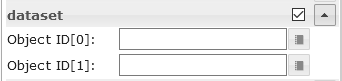</td><td>对象ID [x]</td><td>使用vis编辑器的单个条的对象ID</td></tr></tbody></table>

####数据集JSON属性
JSON字符串必须是具有以下属性的对象数组：

<table><thead><tr><th>财产</th><th>描述</th><th>类型</th><th>价值观</th></tr></thead><tbody><tr><td>标签</td><td>棒的轴标签</td><td>细绳</td><td/></tr><tr><td>价值</td><td>条值</td><td>数字</td><td/></tr><tr><td>dataColor</td><td>条形颜色</td><td>十六进制（＃44739e），rgb（20、50、200），rgba（20、50、200、0.5）</td><td/></tr><tr><td> valueText</td><td>覆盖栏文字</td><td>细绳</td><td/></tr><tr><td>valueColor</td><td>值文字的颜色</td><td>十六进制（＃44739e），rgb（20、50、200），rgba（20、50、200、0.5）</td><td/></tr><tr><td>价值附录</td><td>有价文字附录</td><td>细绳</td><td/></tr><tr><td>工具提示标题</td><td>工具提示标题</td><td>细绳</td><td/></tr><tr><td>工具提示文字</td><td>工具提示文字</td><td>细绳</td><td/></tr></tbody></table>

<！-在目录中省略->

####数据集JSON属性-示例
<details> <pre><code> [ { "label": "val0", "value": "30", "valueColor": "#ffffff" }, { "label": "val1", "value": "12.54645646", "tooltipTitle": "myTitle" }, { "label": "val2", "value": "48", "dataColor": "#c2c2c2", "valueAppendix": "\n extra" }, { "label": "val3", "value": "97", "valueColor": "#ffffff" }, { "label": "val4", "value": "32", "valueText": "text" } ] </pre></code> </details>

＃＃＃ 饼形图


####编辑器设置
下表中未列出的设置是不言自明的。

<table><thead><tr><th>截屏</th><th>环境</th><th>描述</th></tr></thead><tbody><tr><td rowspan=3>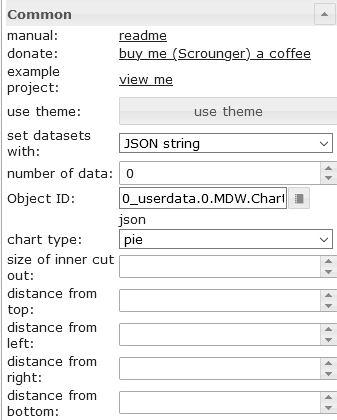</td><td>设置数据集</td><td>可以通过编辑器输入PieChart的数据，也可以使用JSON字符串</td></tr><tr><td>项目数</td><td>使用vis编辑器获取列表数据的饼数</td></tr><tr><td>对象编号</td><td>包含json字符串的datapoint的对象ID。允许的属性如下所述</td></tr><tr><td rowspan=></td><td>对象ID [x]</td><td>使用vis编辑器的单个饼图的对象ID</td></tr></tbody></table>

####数据集JSON属性
JSON字符串必须是具有以下属性的对象数组：

<table><thead><tr><th>财产</th><th>描述</th><th>类型</th><th>价值观</th></tr></thead><tbody><tr><td>标签</td><td>饼图的轴标签</td><td>细绳</td><td/></tr><tr><td>价值</td><td>馅饼值</td><td>数字</td><td/></tr><tr><td>dataColor</td><td>派颜色</td><td>十六进制（＃44739e），rgb（20、50、200），rgba（20、50、200、0.5）</td><td/></tr><tr><td> valueText</td><td>覆盖饼图文本</td><td>细绳</td><td/></tr><tr><td>valueColor</td><td>值文字的颜色</td><td>十六进制（＃44739e），rgb（20、50、200），rgba（20、50、200、0.5）</td><td/></tr><tr><td>价值附录</td><td>有价文字附录</td><td>细绳</td><td/></tr><tr><td>工具提示标题</td><td>工具提示标题</td><td>细绳</td><td/></tr><tr><td>工具提示文字</td><td>工具提示文字</td><td>细绳</td><td/></tr></tbody></table>

<！-在目录中省略->

####数据集JSON属性-示例
<details> <pre><code> [ { "label": "val0", "value": "30", "valueColor": "#ffffff" }, { "label": "val1", "value": "12.54645646" }, { "label": "val2", "value": "48", "dataColor": "#c2c2c2", "valueAppendix": "\nextra" }, { "label": "val3", "value": "97", "valueColor": "#ffffff" }, { "label": "val4", "value": "32", "valueText": "text" } ] </pre></code> </details>

###线路历史记录图表：
>必需的适配器：[SQL]（https://github.com/ioBroker/ioBroker.sql），[历史记录]（https://github.com/ioBroker/ioBroker.history）或[InfluxDb](https://github.com/ioBroker/ioBroker.influxdb)！


####编辑器设置
下表中未列出的设置是不言自明的。

<table><thead><tr><th>截屏</th><th>环境</th><th>描述</th></tr></thead><tbody><tr><td rowspan=5></td><td>适配器实例</td><td>SQL或历史记录适配器的实例</td></tr><tr><td>使用对象控制时间间隔</td><td>数据点的ID，以更改图表的时间间隔。<br><br>如果数据点来自“字符串”类型，则它必须包含<a href="https://github.com/Scrounger/ioBroker.vis-materialdesign/blob/235530e4e54346b5527333ca06ce596519954c67/widgets/materialdesign/js/materialdesign.chart.js#L802">链接值之一</a><br>如果数据点来自“数字”类型，则它必须包含图形的开始时间戳。<br><br>例如，您可以在此处使用按钮在运行时更改图表的显示</td></tr><tr><td>用于更新的布尔对象</td><td>adatapoint的ID，以触发图表的手动刷新。<br>例如，您可以在此处使用按钮在运行时刷新图表</td></tr><tr><td>图表超时</td><td>加载图表数据超时。如果收到超时错误消息，请增加此值</td></tr><tr><td>调试模式</td><td>如果您有问题或错误，请激活调试模式并将控制台日志（F12）数据附加到问题上</td></tr><tr><td rowspan=5></td><td>对象ID [x]</td><td>具有激活的历史记录实例的数据点的ID</td></tr><tr><td>显示方式[x]</td><td><a href="https://www.iobroker.net/docu/index-195.htm?page_id=198&lang=en#Aggregation">汇总方法</a></td></tr><tr><td>最大限度。要显示的数据点数[x]</td><td>要显示的最大数据点数</td></tr><tr><td>数据点之间的时间间隔[s] [x]</td><td>可选设置，将覆盖“计数”设置。<br>各个数据点之间的距离（以秒为单位）。<br>例如，如果要每分钟显示数据点，则必须在此处输入60</td></tr><tr><td>数据乘以[x]</td><td>可选设置，将每个数据点乘以给定值</td></tr><tr><td>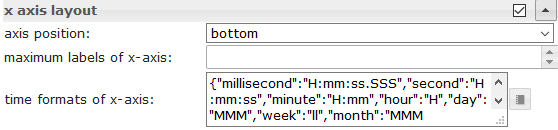</td><td>x轴的时间格式</td><td>更改X轴的时间格式。必须为所有时间单位输入时间格式， <a href="https://github.com/Scrounger/ioBroker.vis-materialdesign/blob/c677220868961b3cf0b153fb8bf04e13b4475c09/widgets/materialdesign/js/materialdesign.chart.js#L805">允许使用以下时间单位。</a><br>必须根据moment.js库输入批准的时间格式，<a href="https://momentjs.com/docs/#/displaying/">请参阅链接</a></td></tr><tr><td>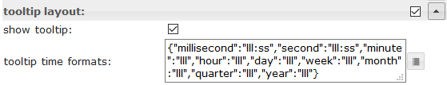</td><td>工具提示时间格式</td><td>更改工具提示的时间格式。必须为所有时间单位输入时间格式， <a href="https://github.com/Scrounger/ioBroker.vis-materialdesign/blob/c677220868961b3cf0b153fb8bf04e13b4475c09/widgets/materialdesign/js/materialdesign.chart.js#L805">允许使用以下时间单位。</a><br>必须根据moment.js库输入批准的时间格式，<a href="https://momentjs.com/docs/#/displaying/">请参阅链接</a></td></tr></tbody></table>

### JSON图表
使用JSON图表，您可以最大程度地通过脚本创建混合图表（折线图，条形图和堆积条形图）。

![徽标]（doc / en / media / jsonChart.png）！[徽标](../../../en/adapterref/iobroker.vis-materialdesign/doc/en/media/jsonChart2.png)

#### JSON属性
<！-在目录中省略->

＃＃＃＃＃ 一般的
<table><thead><tr><th>财产</th><th>描述</th><th>类型</th><th>价值观</th></tr></thead><tbody><tr><td>axisLabels</td><td>图的轴标签</td><td>大批</td><td>数字或字符串</td></tr><tr><td>图表</td><td>图形数据</td><td>数组&lt;<a href="#graph">图</a>&gt;</td><td>见图表</td></tr></tbody></table>

<！-在目录中省略->

#####图
<details><table><thead><tr><th>财产</th><th>描述</th><th>类型</th><th>价值观</th></tr></thead><tbody><tr><td>数据</td><td>图形数据或带有时间戳的数据</td><td>数组[数字] | Array [<a href="#values-with-timestamp">带有时间戳的值</a>]</td><td>数字</td></tr><tr><td>类型</td><td>图的类型</td><td>细绳</td><td>“线”，“栏”</td></tr><tr><td> legendText</td><td>传说文字</td><td>细绳</td><td></td></tr><tr><td>显示顺序</td><td>图的叠加顺序</td><td>数字</td><td>一二三</td></tr><tr><td>颜色</td><td>图的颜色</td><td>颜色</td><td>十六进制（＃44739e），rgb（20、50、200），rgba（20、50、200、0.5）</td></tr><tr><td> use_gradient_color</td><td>使用渐变色</td><td>布尔值</td><td>假，真</td></tr><tr><td>渐变色</td><td>渐变颜色阵列</td><td>数组[ <a href="#gradientcolor">gradientColor</a> ]</td><td> [{值：-20，颜色：&#39;＃7d3c98&#39;}，{值：0，颜色：&#39;＃2874a6&#39;}]</td></tr><tr><td> tooltip_title</td><td>工具提示的标题</td><td>细绳</td><td></td></tr><tr><td>tooltip_text</td><td>工具提示的ovveride文字</td><td>细绳</td><td></td></tr><tr><td>tooltip_MinDigits</td><td>工具提示值的最大小数</td><td>数字</td><td>0、1、2，...</td></tr><tr><td> tooltip_MaxDigits</td><td>工具提示值的最大小数</td><td>数字</td><td>0、1、2，...</td></tr><tr><td> tooltip_AppendText</td><td>将文字附加到工具提示值</td><td>细绳</td><td></td></tr><tr><td>datalabel_show</td><td>显示图表的数据标签</td><td>字符串|布尔值</td><td>虚假，真实，自动</td></tr><tr><td>datalabel_anchor</td><td>数据标签的锚点</td><td>细绳</td><td>中心，开始，结束</td></tr><tr><td>datalabel_align</td><td>数据标签相对于锚点的位置</td><td>细绳</td><td>左，开始，居中，结束，右，上，下</td></tr><tr><td>datalabel_offset</td><td>距离（以像素为单位）将数据标签拉离锚点</td><td>数字</td><td>0、1、2，...</td></tr><tr><td> datalabel_text_align</td><td>数据标签的文字匹配</td><td>细绳</td><td>左，开始，居中，结束，右</td></tr><tr><td>datalabel_rotation</td><td>数据标签的顺时针旋转角度（以度为单位）</td><td>数字</td><td>0、1、2，...</td></tr><tr><td> datalabel_steps</td><td>每x步显示数据标签</td><td>数字</td><td>0、1、2，...</td></tr><tr><td> datalabel_minDigits</td><td>数据标签的最小小数</td><td>数字</td><td>0、1、2，...</td></tr><tr><td> datalabel_maxDigits</td><td>数据标签的最大小数</td><td>数字</td><td>0、1、2，...</td></tr><tr><td> datalabel_append</td><td>将文字附加到数据标签</td><td>细绳</td><td></td></tr><tr><td>datalabel_color</td><td>数据标签颜色</td><td>颜色|数组[颜色]</td><td>十六进制（＃44739e），rgb（20、50、200），rgba（20、50、200、0.5）</td></tr><tr><td> datalabel_fontFamily</td><td>数据标签字体系列</td><td>细绳</td><td></td></tr><tr><td>datalabel_fontSize</td><td>数据标签字体大小</td><td>数字</td><td>1,2,5，...</td></tr><tr><td> datalabel_backgroundColor</td><td>数据标签背景色</td><td>颜色|数组[颜色]</td><td>十六进制（＃44739e），rgb（20、50、200），rgba（20、50、200、0.5）</td></tr><tr><td> datalabel_borderColor</td><td>数据标签边框颜色</td><td>颜色|数组[颜色]</td><td>十六进制（＃44739e），rgb（20、50、200），rgba（20、50、200、0.5）</td></tr><tr><td> datalabel_borderWidth</td><td>数据标签边框宽度</td><td>数字</td><td>1,2,5，...</td></tr><tr><td> datalabel_borderRadius</td><td>数据标签边框半径</td><td>数字</td><td>1,2,5，...</td></tr></tbody></table></details>

<！-在目录中省略->

#####图形折线图spfeicifc
<details><table><thead><tr><th>财产</th><th>描述</th><th>类型</th><th>价值观</th></tr></thead><tbody><tr><td>line_pointStyle</td><td>线的点样式</td><td>细绳</td><td>圆，十字，crossRot，破折号，直线，矩形，rectRounded，rectRot，星形，三角形</td></tr><tr><td>line_pointSize</td><td>线的点大小</td><td>数字</td><td>1，2，3，...</td></tr><tr><td> line_pointSizeHover</td><td>线的点大小</td><td>数字</td><td>1，2，3，...</td></tr><tr><td> line_PointColor</td><td>线点颜色</td><td>颜色|数组[颜色]</td><td>十六进制（＃44739e），rgb（20、50、200），rgba（20、50、200、0.5）</td></tr><tr><td> line_PointColorBorder</td><td>线点的边框颜色</td><td>颜色|数组[颜色]</td><td>十六进制（＃44739e），rgb（20、50、200），rgba（20、50、200、0.5）</td></tr><tr><td> line_PointColorHover</td><td>悬停线点颜色</td><td>颜色|数组[颜色]</td><td>十六进制（＃44739e），rgb（20、50、200），rgba（20、50、200、0.5）</td></tr><tr><td> line_PointColorBorderHover</td><td>线点的边框悬停颜色</td><td>颜色|数组[颜色]</td><td>十六进制（＃44739e），rgb（20、50、200），rgba（20、50、200、0.5）</td></tr><tr><td> line_spanGaps</td><td>如果数据之间存在差距，则画线</td><td>布尔值</td><td>假，真</td></tr><tr><td>line_steppedLine</td><td>启用阶梯线</td><td>布尔值</td><td>假，真</td></tr><tr><td>line_Tension</td><td>线的平滑度</td><td>数字</td><td>0-1</td></tr><tr><td>线的粗细</td><td>线的厚度</td><td>数字</td><td>1,2,5，...</td></tr><tr><td> line_UseFillColor</td><td>在线条下使用填充颜色</td><td>布尔值</td><td>假，真</td></tr><tr><td>line_FillColor</td><td>在线下填充颜色</td><td>颜色</td><td>十六进制（＃44739e），rgb（20、50、200），rgba（20、50、200、0.5）</td></tr><tr><td> use_line_gradient_fill_color</td><td>使用渐变填充颜色</td><td>布尔值</td><td>假，真</td></tr><tr><td>line_gradient_fill_color</td><td>渐变颜色阵列</td><td>数组[ <a href="#gradientcolor">gradientColor</a> ]</td><td> [{值：-20，颜色：&#39;＃7d3c98&#39;}，{值：0，颜色：&#39;＃2874a6&#39;}]</td></tr><tr><td> line_FillBetweenLines</td><td>为下一行/上一行填充颜色</td><td>细绳</td><td>&#39;+1&#39;，&#39;-1&#39;，&#39;+ 2&#39;，...</td></tr></tbody></table></details>

<！-在目录中省略->

#####图形条形图spfeicifc
<details><table><thead><tr><th>财产</th><th>描述</th><th>类型</th><th>价值观</th></tr></thead><tbody><tr><td>barIsStacked</td><td>堆积的酒吧。如果您有组合图表（折线+堆积条形图），则还必须为折线数据集设置此值！</td><td>布尔值</td><td>假，真</td></tr><tr><td>barStackId</td><td>堆栈的ID。应该组合到堆栈的栏必须具有相同的ID</td><td>数字</td><td>1,2,5，...</td></tr><tr><td> barColorHover</td><td>悬停颜色栏</td><td>颜色|数组[颜色]</td><td>十六进制（＃44739e），rgb（20、50、200），rgba（20、50、200、0.5）</td></tr><tr><td> barBorderColor</td><td>条的边框颜色</td><td>颜色|数组[颜色]</td><td>十六进制（＃44739e），rgb（20、50、200），rgba（20、50、200、0.5）</td></tr><tr><td> barBorderWidth</td><td>条形边框的厚度</td><td>数字</td><td>1,2,5，...</td></tr><tr><td> barBorderColorHover</td><td>条形的边框悬停颜色</td><td>颜色|数组[颜色]</td><td>十六进制（＃44739e），rgb（20、50、200），rgba（20、50、200、0.5）</td></tr><tr><td> barBorderWidthHover</td><td>将鼠标悬停在边框上</td><td>数字</td><td>1,2,5，...</td></tr></tbody></table></details>

<！-在目录中省略->

#####图形y轴
<details><table><thead><tr><th>财产</th><th>描述</th><th>类型</th><th>价值观</th></tr></thead><tbody><tr><td>yAxis_id</td><td> y轴的ID。如果您想将通用的y轴用于多图图形数据，请使用相同的ID。</td><td>数字</td><td>1,2,5，...</td></tr><tr><td> yAxis_position</td><td> y轴位置</td><td>细绳</td><td>左右</td></tr><tr><td>yAxis_show</td><td>显示y轴</td><td>布尔值</td><td>假，真</td></tr><tr><td>yAxis_title_text</td><td> y轴标题</td><td>细绳</td><td></td></tr><tr><td>yAxis_title_color</td><td>覆盖y轴标题颜色</td><td>颜色</td><td>十六进制（＃44739e），rgb（20、50、200），rgba（20、50、200、0.5）</td></tr><tr><td> yAxis_title_font家庭</td><td>覆盖y轴标题字体系列</td><td>细绳</td><td></td></tr><tr><td>yAxis_title_fontSize</td><td>覆盖y轴标题字体大小</td><td>数字</td><td>1,2,5，...</td></tr><tr><td> yAxis_min</td><td> y轴的最小值</td><td>数字</td><td>1,2,5，...</td></tr><tr><td> yAxis_max</td><td> y轴的最大值</td><td>数字</td><td>1,2,5，...</td></tr><tr><td> yAxis_step</td><td> y轴步长</td><td>数字</td><td>1,2,5，...</td></tr><tr><td> yAxis_minimumDigits</td><td> y轴最小小数位数</td><td>数字</td><td>1,2,5，...</td></tr><tr><td> yAxis_maximumDigits</td><td> y轴最大小数位数</td><td>数字</td><td>1,2,5，...</td></tr><tr><td> yAxis_maxSteps</td><td> y轴的最大步幅</td><td>数字</td><td>1,2,5，...</td></tr><tr><td> yAxis_distance</td><td>覆盖y轴值到轴的距离</td><td>数字</td><td>1,2,5，...</td></tr><tr><td> yAxis_appendix</td><td>将文字附加到y轴值</td><td>细绳</td><td></td></tr><tr><td>yAxis_color</td><td>覆盖y轴值颜色</td><td>颜色</td><td>十六进制（＃44739e），rgb（20、50、200），rgba（20、50、200、0.5）</td></tr><tr><td> yAxis_fontFamily</td><td>覆盖y轴值字体系列</td><td>细绳</td><td></td></tr><tr><td>yAxis_fontSize</td><td>覆盖y轴值字体大小</td><td>数字</td><td>1,2,5，...</td></tr><tr><td> yAxis_zeroLineWidth</td><td> y轴零线宽度</td><td>数字</td><td>0.3、1.5、4 ...</td></tr><tr><td> yAxis_zeroLineColor</td><td> y轴零线颜色</td><td>颜色</td><td>十六进制（＃44739e），rgb（20、50、200），rgba（20、50、200、0.5）</td></tr><tr><td> yAxis_gridLines_show</td><td>显示y轴网格线</td><td>布尔值</td><td>假，真</td></tr><tr><td>yAxis_gridLines_color</td><td> y轴网格线的颜色</td><td>颜色</td><td>十六进制（＃44739e），rgb（20、50、200），rgba（20、50、200、0.5）</td></tr><tr><td> yAxis_gridLines_lineWidth</td><td>网格线的宽度</td><td>数字</td><td>0-1</td></tr><tr><td> yAxis_gridLines_border_show</td><td>显示y轴网格线的边界</td><td>布尔值</td><td>假，真</td></tr><tr><td>yAxis_gridLines_ticks_show</td><td>显示y轴网格间隔刻度</td><td>布尔值</td><td>假，真</td></tr><tr><td>yAxis_gridLines_ticks_length</td><td> y轴网格刻度的长度</td><td>数字</td><td>1,2,5，...</td></tr></tbody></table></details>

<！-在目录中省略->

##### GradientColor
<details><table><thead><tr><th>财产</th><th>描述</th><th>类型</th><th>价值观</th></tr></thead><tbody><tr><td>价值</td><td>应当在其中应用颜色的值</td><td>数字</td><td>1,2,5，...</td></tr><tr><td>颜色</td><td>物有所值</td><td>颜色</td><td>十六进制（＃44739e），rgb（20、50、200），rgba（20、50、200、0.5）</td></tr></tbody></table></details>

<！-在目录中省略->

具有时间轴的#####图表JSON图表支持具有时间戳的数据。要使用此功能，数据数组必须具有时间戳记值（x轴值）和值（y轴值）。
######带有时间戳的值
<details><table><thead><tr><th>财产</th><th>描述</th><th>类型</th><th>价值观</th></tr></thead><tbody><tr><td>Ť</td><td>时间戳-xAxis值</td><td>数字</td><td>1,2,5，...</td></tr><tr><td> ÿ</td><td>时间戳的值-yAxis值</td><td>数字</td><td>1,2,5，...</td></tr></tbody></table></details>

######具有时间戳的数据的x轴设置
<details><table><thead><tr><th>财产</th><th>描述</th><th>类型</th><th>价值观</th></tr></thead><tbody><tr><td>xAxis_bounds</td><td>规模边界策略<br><br>&#39;数据&#39;：确保数据完全可见，外部标签被去除<br>&#39;打勾&#39;：确保打勾完全可见，外部数据被截断</td><td>细绳</td><td>数据，滴答</td></tr><tr><td>xAxis_timeFormats</td><td> x轴的时间格式</td><td>目的</td><td>必须为所有时间单位输入时间格式， <a href="https://github.com/Scrounger/ioBroker.vis-materialdesign/blob/c677220868961b3cf0b153fb8bf04e13b4475c09/widgets/materialdesign/js/materialdesign.chart.js#L805">允许使用以下时间单位。</a><br>必须根据moment.js库输入批准的时间格式，<a href="https://momentjs.com/docs/#/displaying/">请参阅链接</a></td></tr><tr><td>xAxis_tooltip_timeFormats</td><td> x轴的时间格式</td><td>细绳</td><td>必须根据moment.js库输入批准的时间格式，<a href="https://momentjs.com/docs/#/displaying/">请参阅链接</a></td></tr><tr><td>xAxis_time_unit</td><td>强制x轴的时间格式</td><td>细绳</td><td>允许以下单位，<a href="https://www.chartjs.org/docs/latest/axes/cartesian/time.html#time-units">请参阅链接</a></td></tr></tbody></table></details>

<！-在目录中省略->

＃＃＃＃ 例子
<details> <pre><code> { "axisLabels": ["1h", "2h", "3h", "4h", "5h", "6h", "7h", "8h", "9h", "10h", "11h", "12h", "13h", "14h", "17h", "18h", "19h", "20h", "21h", "22h", "23h", "24h"], "graphs": [ { "data": [19, 19, 18, 19, 19, 20, 20, 21, 22, 24, 24, 24, 23, 22, 23, 23, 24, 23, 23, 22, 22, 21, 20, 20], "type": "line", "color": "gray", "legendText": "Temperatur", "line_pointSizeHover": 5, "line_pointSize": 0, "line_Tension": 0.3, "yAxis_show": false, "yAxis_gridLines_show": false, "yAxis_gridLines_ticks_length": 5, "yAxis_min": 0, "yAxis_max": 30, "yAxis_step": 5, "yAxis_position": "left", "yAxis_appendix": " °C", "yAxis_zeroLineWidth": 0.1, "yAxis_zeroLineColor": "black", "displayOrder": 0, "tooltip_AppendText": " °C", "datalabel_backgroundColor": ["#2b9a44", "#2b9a44", "#3aa35b", "#2b9a44", "#2b9a44", "#1d922e", "#1d922e", "#0e8917", "#008000", "#668f00", "#668f00", "#668f00", "#338700", "#008000", "#338700", "#338700", "#668f00", "#338700", "#338700", "#008000", "#008000", "#0e8917", "#1d922e", "#1d922e"], "datalabel_color": "white", "datalabel_offset": -10, "datalabel_fontFamily": "RobotoCondensed-Light", "datalabel_fontSize": 12, "datalabel_borderRadius": 6, "datalabel_show": "auto", "line_PointColor": ["#2b9a44", "#2b9a44", "#3aa35b", "#2b9a44", "#2b9a44", "#1d922e", "#1d922e", "#0e8917", "#008000", "#668f00", "#668f00", "#668f00", "#338700", "#008000", "#338700", "#338700", "#668f00", "#338700", "#338700", "#008000", "#008000", "#0e8917", "#1d922e", "#1d922e"], "line_PointColorBorder": ["#2b9a44", "#2b9a44", "#3aa35b", "#2b9a44", "#2b9a44", "#1d922e", "#1d922e", "#0e8917", "#008000", "#668f00", "#668f00", "#668f00", "#338700", "#008000", "#338700", "#338700", "#668f00", "#338700", "#338700", "#008000", "#008000", "#0e8917", "#1d922e", "#1d922e"], "line_PointColorHover": ["#2b9a44", "#2b9a44", "#3aa35b", "#2b9a44", "#2b9a44", "#1d922e", "#1d922e", "#0e8917", "#008000", "#668f00", "#668f00", "#668f00", "#338700", "#008000", "#338700", "#338700", "#668f00", "#338700", "#338700", "#008000", "#008000", "#0e8917", "#1d922e", "#1d922e"], "line_PointColorBorderHover": ["#2b9a44", "#2b9a44", "#3aa35b", "#2b9a44", "#2b9a44", "#1d922e", "#1d922e", "#0e8917", "#008000", "#668f00", "#668f00", "#668f00", "#338700", "#008000", "#338700", "#338700", "#668f00", "#338700", "#338700", "#008000", "#008000", "#0e8917", "#1d922e", "#1d922e"], "use_gradient_color": true, "gradient_color": [{ "value": -20, "color": "#5b2c6f66" }, { "value": 0, "color": "#2874a666" }, { "value": 14, "color": "#73c6b666" }, { "value": 22, "color": "#00800066" }, { "value": 27, "color": "#ffa50066" }, { "value": 35, "color": "#ff000066" } ], "use_line_gradient_fill_color": true, "line_gradient_fill_color": [{ "value": -20, "color": "#5b2c6f66" }, { "value": 0, "color": "#2874a666" }, { "value": 14, "color": "#73c6b666" }, { "value": 22, "color": "#00800066" }, { "value": 27, "color": "#ffa50066" }, { "value": 35, "color": "#ff000066" } ] }, { "data": [50, 50, 50, 50, 50, 50, 50, 50, 50, 50, 50, 50, 50, 19, 33, 36, 23, 14, 16, 34, 46, 40, 24, 22], "type": "line", "color": "#0d47a1", "legendText": "Regenwahrscheinlichkeit", "line_UseFillColor": true, "line_pointSize": 0, "line_pointSizeHover": 5, "yAxis_min": 0, "yAxis_max": 100, "yAxis_maxSteps": 10, "yAxis_position": "left", "yAxis_gridLines_show": false, "yAxis_gridLines_border_show": false, "yAxis_zeroLineWidth": 0.1, "yAxis_zeroLineColor": "black", "yAxis_appendix": " %", "displayOrder": 1, "tooltip_AppendText": " %", "datalabel_show": false }, { "data": ["0", "0", "0", "0", "0", "0", "0", "0", "0", "0", "0", "1.3", "2.5", 0, 1.9, 1.17, 0, 0, 0, 0.18, 0.7, 0.2, 0, 0], "type": "bar", "color": "#6dd600", "legendText": "Niederschlag", "yAxis_min": 0, "yAxis_max": 5, "yAxis_maxSteps": 10, "yAxis_position": "right", "yAxis_gridLines_show": false, "yAxis_appendix": " mm", "yAxis_gridLines_border_show": false, "yAxis_zeroLineWidth": 0.1, "yAxis_zeroLineColor": "black", "displayOrder": 1, "tooltip_AppendText": " mm", "datalabel_show": false } ] }

</ pre> </ code> </ details>

<details> <pre><code> { "axisLabels": ["Jan", "Feb", "Mrz", "Apr"], "graphs": [{ "type": "line", "data": [40, 22, 160, 92], "yAxis_id": 0, "barIsStacked": true, "datalabel_show": false, "line_UseFillColor": true

}，{“ type”：“ bar”，“ barIsStacked”：true，“数据”：[30，69，91，35]，“ yAxis_id”：0，“ barStackId”：0，“ color”：“＃6dd600 “，” datalabel_color“：” #FFFFFF“，” datalabel_align“：”开始“，” use_gradient_color“：true，” gradient_color“：[{”值“：60，” color“：”＃6dd600“}，{”值“：0，” color“：” lightgray“}]}，{” type“：” bar“，” barIsStacked“：true，” data“：[17，68，83，49]，” yAxis_id“：0， “ barStackId”：1，“ color”：“＃ff9800”，“ datalabel_color”：“ #FFFFFF”，“ datalabel_align”：“开始”}，{“ type”：“ bar”，“ barIsStacked”：true，“数据“：[95，42，34，31]，” yAxis_id“：0，” barStackId“：1，” color“：”＃8e24aa“，” datalabel_color“：” #FFFFFF“，” datalabel_align“：”开始“} ，{“ type”：“ bar”，“ barIsStacked”：true，“数据”：[33，44，22，34]，“ yAxis_id”：0，“ barStackId”：2，“ color”：“＃a65628” ，“ datalabel_color”：“ #FFFFFF”，“ datalabel_align”：“开始”}，{“ type”：“ bar”，“ barIsStacked”：true，“ data”：[28，34，45，23]，“ yAxis_id “：0，” yAxis_max“：” 180“，” barStackId“：2，” color“：”＃d32f2f“，” datalabel_color“：” #FFFFFF“ ，“ datalabel_align”：“开始”}]}

</ pre> </ code> </ details>

＃＃ 桌子


###编辑器设置
<table><thead><tr><th>截屏</th><th>环境</th><th>描述</th></tr></thead><tbody><tr><td rowspan=2></td><td>转变</td><td>带有输入数据的类型字符串的数据点，如上所示</td></tr><tr><td>数据为JSON</td><td>可选，如果未设置oid数据点，则输入如上所示的数据</td></tr><tr><td rowspan=4></td><td>colType [x]</td><td>如果选择了图像，则对象属性必须具有图像的路径（<a href="https://github.com/Scrounger/ioBroker.vis-materialdesign#input-data">请参见上文</a>）</td></tr><tr><td>前缀[x]</td><td>可以使用对象属性，内部对象绑定（<a href="https://github.com/Scrounger/ioBroker.vis-materialdesign#internal-object-binding">请参见下文</a>）和html的前缀</td></tr><tr><td>后缀[x]</td><td>可以使用对象属性，内部对象绑定（<a href="https://github.com/Scrounger/ioBroker.vis-materialdesign#internal-object-binding">见下文</a>）和html的后缀</td></tr><tr><td>用于排序的对象名称[x]</td><td>在这里，您可以定义应用于排序的其他对象属性。</td></tr></tbody></table>

###数据-JSON结构
输入数据必须是对象的json数组。您可以使用任何属性，没有修订结构。列0获取第一个属性的值，列1获取第二个属性的值，依此类推。
重要的是，每个对象都具有相同的结构。

```
[
	{
		"img": "/vis.0/myImages/erlebnis_50.png",
		"name": "Empire",
		"betriebszeit": "4h 06m",
		"funk": "5G",
		"ip": "10.0.0.1"
	},
	{
		"img": "/vis.0/myImages/erlebnis_100.png",
		"name": "Handy",
		"betriebszeit": "13m",
		"funk": "5G",
		"ip": "10.0.0.2"
	},
	{
		"img": "/vis.0/myImages/erlebnis_100.png",
		"name": "Harmony Hub - Wohnzimmer",
		"betriebszeit": "18T 07h 21m",
		"funk": "2G",
		"ip": "10.0.0.3"
	}
]
```

###内部对象绑定
前缀和后缀支持表内部对象绑定->您可以使用来访问对象的其他属性

```
#[obj.'propertyName']
```

示例请<a href="https://github.com/Scrounger/ioBroker.vis-materialdesign#input-data">参见上面</a>。

可以找到工作部件示例

* [此处]（https://forum.iobroker.net/topic/26199/test-adapter-material-design-widgets-v0-1-x/113）
* [ical Adapter]（https://forum.iobroker.net/topic/29658/material-design-widgets-table-widget/2）

###使用HTML小部件的控制元素


您可以直接在json字符串中使用[HTML小部件](#html-widgets)。如果要自定义包含小部件的单元格，请使用以下容器：

<table><thead><tr><th>财产</th><th>描述</th><th>类型</th><th>特性</th></tr></thead><tbody><tr><td>行跨</td><td>跨x行的单元格</td><td>数字</td><td>1，2，3，...</td></tr><tr><td>科尔斯潘</td><td>跨x列的单元格</td><td>数字</td><td>1，2，3，...</td></tr><tr><td> cellStyleAttrs</td><td>单元格的CSS样式属性</td><td>细绳</td><td></td></tr><tr><td>html</td><td>任何html元素，例如。 html小部件</td><td>细绳</td><td></td></tr></tbody></table>

<！-在目录中省略->

#### HTML控件小部件-示例
<details>

```
[
	{
		"col_1": "button toggle",
		"col_2": {
			"rowspan": "2",
			"html": "<div style='display: flex; justify-content: center'><div class='vis-widget materialdesign-widget materialdesign-button materialdesign-button-html-element'
			style='width: 80px; height: 60px; position: relative; padding: 0px;'
			mdw-type='toggle_vertical'
			mdw-oid='0_userdata.0.MDW.Table.Control.bool'
			mdw-buttonStyle='raised'
			mdw-toggleType='boolean'
			mdw-stateIfNotTrueValue='on'
			mdw-vibrateOnMobilDevices='50'
			mdw-buttontext='off'
			mdw-labelTrue='on'
			mdw-labelColorTrue='#000000'
			mdw-textFontFamily='#mdwTheme:vis-materialdesign.0.fonts.button.vertical.text'
			mdw-textFontSize='#mdwTheme:vis-materialdesign.0.fontSizes.button.vertical.text'
			mdw-alignment='center'
			mdw-mdwButtonPrimaryColor='#mdwTheme:vis-materialdesign.0.colors.button.vertical.primary'
			mdw-mdwButtonSecondaryColor='#mdwTheme:vis-materialdesign.0.colors.button.vertical.secondary'
			mdw-colorBgTrue='green'
			mdw-image='checkbox-blank-outline'
			mdw-imageTrue='checkbox-marked'
			mdw-iconPosition='top'
			mdw-iconHeight='36'
			mdw-lockEnabled='true'
			mdw-autoLockAfter='10'
			mdw-lockIconTop='5'
			mdw-lockIconLeft='5'
			mdw-lockIconColor='#mdwTheme:vis-materialdesign.0.colors.button.lock_icon'
			mdw-lockFilterGrayscale='30'
			></div></div>"
		},
		"col_3": "<div class='vis-widget materialdesign-widget materialdesign-button materialdesign-button-html-element'
		style='width: 100%; height: 100%; position: relative; padding: 0px;'
		mdw-type='toggle_default'
		mdw-oid='0_userdata.0.MDW.Table.Control.bool'
		mdw-buttonStyle='raised'
		mdw-toggleType='boolean'
		mdw-stateIfNotTrueValue='on'
		mdw-vibrateOnMobilDevices='50'
		mdw-buttontext='off'
		mdw-labelTrue='on'
		mdw-textFontFamily='#mdwTheme:vis-materialdesign.0.fonts.button.default.text'
		mdw-textFontSize='#mdwTheme:vis-materialdesign.0.fontSizes.button.default.text'
		mdw-mdwButtonPrimaryColor='#mdwTheme:vis-materialdesign.0.colors.button.default.primary'
		mdw-mdwButtonSecondaryColor='#mdwTheme:vis-materialdesign.0.colors.button.default.secondary'
		mdw-colorBgTrue='#a2bc9f'
		mdw-image='access-point-network-off'
		mdw-imageColor='#c70000'
		mdw-imageTrue='access-point-network'
		mdw-imageTrueColor='#36fa29'
		mdw-iconPosition='left'
		mdw-autoLockAfter='10'
		mdw-lockIconColor='#mdwTheme:vis-materialdesign.0.colors.button.lock_icon'
		mdw-lockFilterGrayscale='30'
		></div>",
		"col_4": "<div class='vis-widget materialdesign-widget materialdesign-icon-button materialdesign-button-html-element'
		style='width: 48px; height: 48px; position: relative; padding: 0px;'
		mdw-type='toggle_icon'
		mdw-oid='0_userdata.0.MDW.Table.Control.bool'
		mdw-toggleType='boolean'
		mdw-stateIfNotTrueValue='on'
		mdw-vibrateOnMobilDevices='50'
		mdw-image='access-point-network-off'
		mdw-imageColor='#mdwTheme:vis-materialdesign.0.colors.button.icon.icon_off'
		mdw-imageTrue='access-point-network'
		mdw-imageTrueColor='orange'
		mdw-colorBgFalse='#mdwTheme:vis-materialdesign.0.colors.button.icon.background_off'
		mdw-colorBgTrue='#mdwTheme:vis-materialdesign.0.colors.button.icon.background_on'
		mdw-colorPress='#mdwTheme:vis-materialdesign.0.colors.button.icon.pressed'
		mdw-autoLockAfter='10'
		mdw-lockIconTop='45'
		mdw-lockIconLeft='55'
		mdw-lockIconSize='20'
		mdw-lockIconColor='#mdwTheme:vis-materialdesign.0.colors.button.icon.lock_icon'
		mdw-lockIconBackground='#mdwTheme:vis-materialdesign.0.colors.button.icon.lock_icon_background'
		mdw-lockBackgroundSizeFactor='1'
		mdw-lockFilterGrayscale='30'
		></div>"
	}, {
		"col_1": "Checkbox / Switch",
		"col_2": "<div style='display: flex; justify-content: center'><div class='vis-widget materialdesign-widget materialdesign-checkbox materialdesign-checkbox-html-element'
		style='width: 71px; height: 24px; position: relative; overflow: visible !important; display: flex; align-items: center;'
		mdw-oid='0_userdata.0.MDW.Table.Control.bool'
		mdw-toggleType='boolean'
		mdw-stateIfNotTrueValue='on'
		mdw-vibrateOnMobilDevices='50'
		mdw-labelFalse='on'
		mdw-labelTrue='off'
		mdw-labelPosition='left'
		mdw-labelClickActive='true'
		mdw-valueFontFamily='#mdwTheme:vis-materialdesign.0.fonts.checkbox.value'
		mdw-valueFontSize='#mdwTheme:vis-materialdesign.0.fontSizes.checkbox.value'
		mdw-colorCheckBox='#mdwTheme:vis-materialdesign.0.colors.checkbox.on'
		mdw-colorCheckBoxBorder='#mdwTheme:vis-materialdesign.0.colors.checkbox.border'
		mdw-colorCheckBoxHover='#mdwTheme:vis-materialdesign.0.colors.checkbox.hover'
		mdw-labelColorFalse='#mdwTheme:vis-materialdesign.0.colors.checkbox.text_off'
		mdw-labelColorTrue='#mdwTheme:vis-materialdesign.0.colors.checkbox.text_on'
		mdw-autoLockAfter='10'
		mdw-lockIconTop='5'
		mdw-lockIconLeft='5'
		mdw-lockIconColor='#mdwTheme:vis-materialdesign.0.colors.checkbox.lock_icon'
		mdw-lockFilterGrayscale='30'
		></div></div>",
		"col_3": {
			"cellStyleAttrs": "padding: 8px;",
			"html": "<div style='display: flex; justify-content: center'><div class='vis-widget materialdesign-widget materialdesign-switch materialdesign-switch-html-element'
			style='width: 83px; height: 44px; position: relative; overflow: visible !important; display: flex; align-items: center;'
			mdw-oid='0_userdata.0.MDW.Table.Control.bool'
			mdw-toggleType='boolean'
			mdw-stateIfNotTrueValue='on'
			mdw-vibrateOnMobilDevices='50'
			mdw-labelFalse='off'
			mdw-labelTrue='on'
			mdw-labelPosition='right'
			mdw-labelClickActive='true'
			mdw-valueFontFamily='#mdwTheme:vis-materialdesign.0.fonts.switch.value'
			mdw-valueFontSize='#mdwTheme:vis-materialdesign.0.fontSizes.switch.value'
			mdw-colorSwitchThumb='#mdwTheme:vis-materialdesign.0.colors.switch.off'
			mdw-colorSwitchTrack='#mdwTheme:vis-materialdesign.0.colors.switch.track'
			mdw-colorSwitchTrue='#mdwTheme:vis-materialdesign.0.colors.switch.on'
			mdw-colorSwitchHover='#mdwTheme:vis-materialdesign.0.colors.switch.off_hover'
			mdw-colorSwitchHoverTrue='#mdwTheme:vis-materialdesign.0.colors.switch.on_hover'
			mdw-labelColorFalse='#mdwTheme:vis-materialdesign.0.colors.switch.text_off'
			mdw-labelColorTrue='#mdwTheme:vis-materialdesign.0.colors.switch.text_on'
			mdw-lockEnabled='true'
			mdw-autoLockAfter='10'
			mdw-lockIconTop='5'
			mdw-lockIconLeft='5'
			mdw-lockIconColor='#mdwTheme:vis-materialdesign.0.colors.switch.lock_icon'
			mdw-lockFilterGrayscale='30'
			></div></div>"
		}
	}, {
		"col_1": "Button State",
		"col_2": "<div style='display: flex; justify-content: center'><div class='vis-widget materialdesign-widget materialdesign-icon-button materialdesign-button-html-element'
		style='width: 48px; height: 48px; position: relative; padding: 0px;'
		mdw-type='state_icon'
		mdw-oid='0_userdata.0.MDW.Table.Control.number'
		mdw-value='100'
		mdw-vibrateOnMobilDevices='50'
		mdw-image='battery'
		mdw-imageColor='#mdwTheme:vis-materialdesign.0.colors.button.icon.icon_off'
		mdw-iconHeight='26'
		mdw-colorBgFalse='#mdwTheme:vis-materialdesign.0.colors.button.icon.background_off'
		mdw-colorPress='#mdwTheme:vis-materialdesign.0.colors.button.icon.pressed'
		mdw-autoLockAfter='10'
		mdw-lockIconTop='45'
		mdw-lockIconLeft='55'
		mdw-lockIconSize='20'
		mdw-lockIconColor='#mdwTheme:vis-materialdesign.0.colors.button.icon.lock_icon'
		mdw-lockIconBackground='#mdwTheme:vis-materialdesign.0.colors.button.icon.lock_icon_background'
		mdw-lockBackgroundSizeFactor='1'
		mdw-lockFilterGrayscale='30'
		></div></div>",
		"col_3": "<div style='display: flex; justify-content: center'><div class='vis-widget materialdesign-widget materialdesign-button materialdesign-button-html-element'
		style='width: 100px; height: 100%; position: relative; padding: 0px;'
		mdw-type='state_default'
		mdw-oid='0_userdata.0.MDW.Table.Control.number'
		mdw-buttonStyle='raised'
		mdw-value='70'
		mdw-vibrateOnMobilDevices='50'
		mdw-buttontext='70'
		mdw-textFontFamily='#mdwTheme:vis-materialdesign.0.fonts.button.default.text'
		mdw-textFontSize='#mdwTheme:vis-materialdesign.0.fontSizes.button.default.text'
		mdw-mdwButtonPrimaryColor='#mdwTheme:vis-materialdesign.0.colors.button.default.primary'
		mdw-mdwButtonSecondaryColor='#mdwTheme:vis-materialdesign.0.colors.button.default.secondary'
		mdw-image='battery-70'
		mdw-iconPosition='left'
		mdw-iconHeight='20'
		mdw-lockEnabled='true'
		mdw-autoLockAfter='10'
		mdw-lockIconColor='#mdwTheme:vis-materialdesign.0.colors.button.lock_icon'
		mdw-lockFilterGrayscale='30'
		></div></div>",
		"col_4": "<div style='display: flex; justify-content: center'><div class='vis-widget materialdesign-widget materialdesign-button materialdesign-button-html-element'
		style='width: 102px; height: 67px; position: relative; padding: 0px;'
		mdw-type='state_vertical'
		mdw-oid='0_userdata.0.MDW.Table.Control.number'
		mdw-buttonStyle='raised'
		mdw-value='10'
		mdw-vibrateOnMobilDevices='50'
		mdw-buttontext='10'
		mdw-textFontFamily='#mdwTheme:vis-materialdesign.0.fonts.button.vertical.text'
		mdw-textFontSize='#mdwTheme:vis-materialdesign.0.fontSizes.button.vertical.text'
		mdw-alignment='center'
		mdw-mdwButtonPrimaryColor='#mdwTheme:vis-materialdesign.0.colors.button.vertical.primary'
		mdw-mdwButtonSecondaryColor='#mdwTheme:vis-materialdesign.0.colors.button.vertical.secondary'
		mdw-image='battery-10'
		mdw-iconPosition='top'
		mdw-iconHeight='38'
		mdw-autoLockAfter='10'
		mdw-lockIconTop='5'
		mdw-lockIconLeft='5'
		mdw-lockIconColor='#mdwTheme:vis-materialdesign.0.colors.button.lock_icon'
		mdw-lockFilterGrayscale='30'
		></div></div>"
	}, {
		"col_1": "Progress",
		"col_2": "<div style='display: flex; justify-content: center'><div class='vis-widget materialdesign-widget materialdesign-progress materialdesign-progress-html-element'
		style='width: 83px; height: 81px; position: relative; padding: 0px;'
		mdw-type='circular'
		mdw-oid='0_userdata.0.MDW.Table.Control.number'
		mdw-min='0'
		mdw-max='100'
		mdw-progressCircularSize='80'
		mdw-progressCircularWidth='10'
		mdw-progressCircularRotate='90'
		mdw-colorProgressBackground='#mdwTheme:vis-materialdesign.0.colors.progress.track_background'
		mdw-colorProgress='#mdwTheme:vis-materialdesign.0.colors.progress.track'
		mdw-innerColor='#mdwTheme:vis-materialdesign.0.colors.progress.circular_background'
		mdw-colorOneCondition='60'
		mdw-colorOne='#mdwTheme:vis-materialdesign.0.colors.progress.track_condition1'
		mdw-colorTwoCondition='80'
		mdw-colorTwo='#mdwTheme:vis-materialdesign.0.colors.progress.track_condition2'
		mdw-showValueLabel='true'
		mdw-valueLabelStyle='progressValue'
		mdw-valueMaxDecimals='3'
		mdw-textColor='#mdwTheme:vis-materialdesign.0.colors.progress.text'
		mdw-textFontSize='#mdwTheme:vis-materialdesign.0.fontSizes.progress.text'
		mdw-textFontFamily='#mdwTheme:vis-materialdesign.0.fonts.progress.text'
		></div></div>",
		"col_3": {
			"colspan": "2",
			"html": "<div style='display: flex; justify-content: center'><div class='vis-widget materialdesign-widget materialdesign-progress materialdesign-progress-html-element'
			style='width: 80%; height: 36px; position: relative; padding: 0px;'
			mdw-type='linear'
			mdw-oid='0_userdata.0.MDW.Table.Control.number'
			mdw-min='0'
			mdw-max='100'
			mdw-colorProgressBackground='#mdwTheme:vis-materialdesign.0.colors.progress.track_background'
			mdw-colorProgress='#mdwTheme:vis-materialdesign.0.colors.progress.track'
			mdw-colorOneCondition='50'
			mdw-colorOne='#mdwTheme:vis-materialdesign.0.colors.progress.track_condition1'
			mdw-colorTwoCondition='70'
			mdw-colorTwo='#mdwTheme:vis-materialdesign.0.colors.progress.track_condition2'
			mdw-showValueLabel='true'
			mdw-valueLabelStyle='progressPercent'
			mdw-textColor='#mdwTheme:vis-materialdesign.0.colors.progress.text'
			mdw-textFontSize='#mdwTheme:vis-materialdesign.0.fontSizes.progress.text'
			mdw-textFontFamily='#mdwTheme:vis-materialdesign.0.fonts.progress.text'
			mdw-textAlign='end'
			></div></div>"
		}
	}, {
		"col_1": "Slider",
		"col_2": {
			"colspan": "2",
			"cellStyleAttrs": "overflow: visible;",
			"html": "<div style='display: flex; justify-content: center'><div class='vis-widget materialdesign-widget materialdesign-slider-vertical materialdesign-slider-html-element'
			style='width: 90%; height: 60px; position: relative; overflow:visible !important; display: flex; align-items: center;'
			mdw-oid='0_userdata.0.MDW.Table.Control.number'
			mdw-orientation='horizontal'
			mdw-knobSize='knobSmall'
			mdw-step='1'
			mdw-vibrateOnMobilDevices='50'
			mdw-showTicks='no'
			mdw-tickTextColor='#mdwTheme:vis-materialdesign.0.colors.slider.tick'
			mdw-tickFontFamily='#mdwTheme:vis-materialdesign.0.fonts.slider.ticks'
			mdw-tickFontSize='#mdwTheme:vis-materialdesign.0.fontSizes.slider.ticks'
			mdw-tickColorBefore='#mdwTheme:vis-materialdesign.0.colors.slider.tick_before'
			mdw-tickColorAfter='#mdwTheme:vis-materialdesign.0.colors.slider.tick_after'
			mdw-colorBeforeThumb='#mdwTheme:vis-materialdesign.0.colors.slider.control_before'
			mdw-colorThumb='#mdwTheme:vis-materialdesign.0.colors.slider.control'
			mdw-colorAfterThumb='#mdwTheme:vis-materialdesign.0.colors.slider.control_behind'
			mdw-prepandTextWidth='1'
			mdw-prepandTextColor='#mdwTheme:vis-materialdesign.0.colors.slider.text_prepand'
			mdw-prepandTextFontSize='#mdwTheme:vis-materialdesign.0.fontSizes.slider.prepand'
			mdw-prepandTextFontFamily='#mdwTheme:vis-materialdesign.0.fonts.slider.prepand'
			mdw-showValueLabel='true'
			mdw-valueLabelStyle='sliderValue'
			mdw-valueLabelUnit='%'
			mdw-valueFontFamily='#mdwTheme:vis-materialdesign.0.fonts.slider.value'
			mdw-valueFontSize='#mdwTheme:vis-materialdesign.0.fontSizes.slider.value'
			mdw-valueLabelColor='#mdwTheme:vis-materialdesign.0.colors.slider.text'
			mdw-valueLabelWidth='50'
			mdw-showThumbLabel='yes'
			mdw-thumbBackgroundColor='#mdwTheme:vis-materialdesign.0.colors.slider.control_background'
			mdw-thumbFontColor='#mdwTheme:vis-materialdesign.0.colors.slider.control_text'
			mdw-thumbFontSize='#mdwTheme:vis-materialdesign.0.fontSizes.slider.control'
			mdw-thumbFontFamily='#mdwTheme:vis-materialdesign.0.fonts.slider.control'
			></div></div>"
		},
		"col_3": "<div style='display: flex; justify-content: center'><div class='vis-widget materialdesign-widget materialdesign-slider-round materialdesign-roundslider-html-element'
		style='width: 79px; height: 67px; position: relative;'
		mdw-oid='0_userdata.0.MDW.Table.Control.number'
		mdw-step='1'
		mdw-startAngle='135'
		mdw-arcLength='270'
		mdw-handleZoom='1.5'
		mdw-vibrateOnMobilDevices='50'
		mdw-colorSliderBg='#mdwTheme:vis-materialdesign.0.colors.slider.background'
		mdw-colorBeforeThumb='#mdwTheme:vis-materialdesign.0.colors.slider.control_before'
		mdw-colorThumb='#mdwTheme:vis-materialdesign.0.colors.slider.control'
		mdw-colorAfterThumb='#mdwTheme:vis-materialdesign.0.colors.slider.control_behind'
		mdw-valueLabelColor='#mdwTheme:vis-materialdesign.0.colors.slider.text'
		mdw-showValueLabel='true'
		mdw-valueLabelStyle='sliderValue'
		mdw-valueFontFamily='#mdwTheme:vis-materialdesign.0.fonts.slider.value'
		mdw-valueFontSize='#mdwTheme:vis-materialdesign.0.fontSizes.slider.value'
		></div></div>"
	}, {
		"col_1": "Select",
		"col_2": "<div style='display: flex; justify-content: center'><div class='vis-widget materialdesign-widget materialdesign-select materialdesign-select-html-element'
		style='width: 90%; height: 38px; position: relative; overflow: visible; display: flex; align-items: center;'
		mdw-oid='0_userdata.0.MDW.Table.Control.number'
		mdw-inputType='text'
		mdw-vibrateOnMobilDevices='50'
		mdw-inputLayout='regular'
		mdw-inputAlignment='left'
		mdw-inputLayoutBorderColor='#mdwTheme:vis-materialdesign.0.colors.input.border'
		mdw-inputLayoutBorderColorHover='#mdwTheme:vis-materialdesign.0.colors.input.border_hover'
		mdw-inputLayoutBorderColorSelected='#mdwTheme:vis-materialdesign.0.colors.input.border_selected'
		mdw-inputTextFontFamily='#mdwTheme:vis-materialdesign.0.fonts.input.text'
		mdw-inputTextFontSize='#mdwTheme:vis-materialdesign.0.fontSizes.input.text'
		mdw-inputTextColor='#mdwTheme:vis-materialdesign.0.colors.input.text'
		mdw-inputLabelText='by Editor'
		mdw-inputLabelColor='#mdwTheme:vis-materialdesign.0.colors.input.label'
		mdw-inputLabelColorSelected='#mdwTheme:vis-materialdesign.0.colors.input.label_selected'
		mdw-inputLabelFontFamily='#mdwTheme:vis-materialdesign.0.fonts.input.label'
		mdw-inputLabelFontSize='#mdwTheme:vis-materialdesign.0.fontSizes.input.label'
		mdw-inputTranslateX='-29'
		mdw-inputAppendixColor='#mdwTheme:vis-materialdesign.0.colors.input.appendix'
		mdw-inputAppendixFontSize='#mdwTheme:vis-materialdesign.0.fontSizes.input.appendix'
		mdw-inputAppendixFontFamily='#mdwTheme:vis-materialdesign.0.fonts.input.appendix'
		mdw-showInputMessageAlways='true'
		mdw-inputMessageFontFamily='#mdwTheme:vis-materialdesign.0.fonts.input.message'
		mdw-inputMessageFontSize='#mdwTheme:vis-materialdesign.0.fontSizes.input.message'
		mdw-inputMessageColor='#mdwTheme:vis-materialdesign.0.colors.input.message'
		mdw-inputCounterColor='#mdwTheme:vis-materialdesign.0.colors.input.counter'
		mdw-inputCounterFontSize='#mdwTheme:vis-materialdesign.0.fontSizes.input.counter'
		mdw-inputCounterFontFamily='#mdwTheme:vis-materialdesign.0.fonts.input.counter'
		mdw-clearIconShow='true'
		mdw-clearIconColor='#mdwTheme:vis-materialdesign.0.colors.input.icon_clear'
		mdw-collapseIconColor='#mdwTheme:vis-materialdesign.0.colors.input.icon_collapse'
		mdw-listDataMethod='inputPerEditor'
		mdw-countSelectItems='2'
		mdw-listPosition='auto'
		mdw-listItemBackgroundColor='#mdwTheme:vis-materialdesign.0.colors.input.menu.background'
		mdw-listItemBackgroundHoverColor='#mdwTheme:vis-materialdesign.0.colors.input.menu.hover'
		mdw-listItemBackgroundSelectedColor='#mdwTheme:vis-materialdesign.0.colors.input.menu.selected'
		mdw-listItemRippleEffectColor='#mdwTheme:vis-materialdesign.0.colors.input.menu.effect'
		mdw-showSelectedIcon='prepend-inner'
		mdw-listIconColor='#mdwTheme:vis-materialdesign.0.colors.input.menu.icon'
		mdw-listItemFontSize='#mdwTheme:vis-materialdesign.0.fontSizes.input.dropdown.text'
		mdw-listItemFont='#mdwTheme:vis-materialdesign.0.fonts.input.dropdown.text'
		mdw-listItemFontColor='#mdwTheme:vis-materialdesign.0.colors.input.menu.text'
		mdw-listItemSubFontSize='#mdwTheme:vis-materialdesign.0.fontSizes.input.dropdown.subText'
		mdw-listItemSubFont='#mdwTheme:vis-materialdesign.0.fonts.input.dropdown.subText'
		mdw-listItemSubFontColor='#mdwTheme:vis-materialdesign.0.colors.input.menu.subText'
		mdw-showValue='true'
		mdw-listItemValueFontSize='#mdwTheme:vis-materialdesign.0.fontSizes.input.dropdown.value'
		mdw-listItemValueFont='#mdwTheme:vis-materialdesign.0.fonts.input.dropdown.value'
		mdw-listItemValueFontColor='#mdwTheme:vis-materialdesign.0.colors.input.menu.value'
		mdw-value0='10'
		mdw-label0='val0'
		mdw-listIcon0='alpha-d-box'
		mdw-value1='70'
		mdw-label1='val1'
		mdw-listIcon1='account-alert'
		mdw-value2='100'
		mdw-label2='val2'
		mdw-listIcon2='karate'
		></div></div>",
		"col_3": "<div style='display: flex; justify-content: center'><div class='vis-widget materialdesign-widget materialdesign-select materialdesign-select-html-element'
		style='width: 90%; height: 38px; position: relative; overflow: visible; display: flex; align-items: center;'
		mdw-oid='0_userdata.0.MDW.Table.Control.number'
		mdw-inputType='text'
		mdw-vibrateOnMobilDevices='50'
		mdw-inputLayout='regular'
		mdw-inputAlignment='left'
		mdw-inputLayoutBorderColor='#mdwTheme:vis-materialdesign.0.colors.input.border'
		mdw-inputLayoutBorderColorHover='#mdwTheme:vis-materialdesign.0.colors.input.border_hover'
		mdw-inputLayoutBorderColorSelected='#mdwTheme:vis-materialdesign.0.colors.input.border_selected'
		mdw-inputTextFontFamily='#mdwTheme:vis-materialdesign.0.fonts.input.text'
		mdw-inputTextFontSize='#mdwTheme:vis-materialdesign.0.fontSizes.input.text'
		mdw-inputTextColor='#mdwTheme:vis-materialdesign.0.colors.input.text'
		mdw-inputLabelText='by Value List'
		mdw-inputLabelColor='#mdwTheme:vis-materialdesign.0.colors.input.label'
		mdw-inputLabelColorSelected='#mdwTheme:vis-materialdesign.0.colors.input.label_selected'
		mdw-inputLabelFontFamily='#mdwTheme:vis-materialdesign.0.fonts.input.label'
		mdw-inputLabelFontSize='#mdwTheme:vis-materialdesign.0.fontSizes.input.label'
		mdw-inputTranslateX='-29'
		mdw-inputAppendixColor='#mdwTheme:vis-materialdesign.0.colors.input.appendix'
		mdw-inputAppendixFontSize='#mdwTheme:vis-materialdesign.0.fontSizes.input.appendix'
		mdw-inputAppendixFontFamily='#mdwTheme:vis-materialdesign.0.fonts.input.appendix'
		mdw-showInputMessageAlways='true'
		mdw-inputMessageFontFamily='#mdwTheme:vis-materialdesign.0.fonts.input.message'
		mdw-inputMessageFontSize='#mdwTheme:vis-materialdesign.0.fontSizes.input.message'
		mdw-inputMessageColor='#mdwTheme:vis-materialdesign.0.colors.input.message'
		mdw-inputCounterColor='#mdwTheme:vis-materialdesign.0.colors.input.counter'
		mdw-inputCounterFontSize='#mdwTheme:vis-materialdesign.0.fontSizes.input.counter'
		mdw-inputCounterFontFamily='#mdwTheme:vis-materialdesign.0.fonts.input.counter'
		mdw-clearIconShow='true'
		mdw-clearIconColor='#mdwTheme:vis-materialdesign.0.colors.input.icon_clear'
		mdw-collapseIconColor='#mdwTheme:vis-materialdesign.0.colors.input.icon_collapse'
		mdw-listDataMethod='valueList'
		mdw-countSelectItems='0'
		mdw-valueList='10;30;90'
		mdw-valueListLabels='val1;val2;val3'
		mdw-valueListIcons='home;home;home'
		mdw-listPosition='auto'
		mdw-listItemBackgroundColor='#mdwTheme:vis-materialdesign.0.colors.input.menu.background'
		mdw-listItemBackgroundHoverColor='#mdwTheme:vis-materialdesign.0.colors.input.menu.hover'
		mdw-listItemBackgroundSelectedColor='#mdwTheme:vis-materialdesign.0.colors.input.menu.selected'
		mdw-listItemRippleEffectColor='#mdwTheme:vis-materialdesign.0.colors.input.menu.effect'
		mdw-showSelectedIcon='prepend-inner'
		mdw-listIconColor='#mdwTheme:vis-materialdesign.0.colors.input.menu.icon'
		mdw-listItemFontSize='#mdwTheme:vis-materialdesign.0.fontSizes.input.dropdown.text'
		mdw-listItemFont='#mdwTheme:vis-materialdesign.0.fonts.input.dropdown.text'
		mdw-listItemFontColor='#mdwTheme:vis-materialdesign.0.colors.input.menu.text'
		mdw-listItemSubFontSize='#mdwTheme:vis-materialdesign.0.fontSizes.input.dropdown.subText'
		mdw-listItemSubFont='#mdwTheme:vis-materialdesign.0.fonts.input.dropdown.subText'
		mdw-listItemSubFontColor='#mdwTheme:vis-materialdesign.0.colors.input.menu.subText'
		mdw-showValue='true'
		mdw-listItemValueFontSize='#mdwTheme:vis-materialdesign.0.fontSizes.input.dropdown.value'
		mdw-listItemValueFont='#mdwTheme:vis-materialdesign.0.fonts.input.dropdown.value'
		mdw-listItemValueFontColor='#mdwTheme:vis-materialdesign.0.colors.input.menu.value'
		></div></div>",
		"col_4": {
			"cellStyleAttrs": "padding: 6px;",
			"html": "<div style='display: flex; justify-content: center'><div class='vis-widget materialdesign-widget materialdesign-select materialdesign-select-html-element'
			style='width: 293px; height: 38px; position: relative; overflow: visible; display: flex; align-items: center;'
			mdw-oid='0_userdata.0.MDW.Table.Control.string'
			mdw-inputType='text'
			mdw-vibrateOnMobilDevices='50'
			mdw-inputLayout='solo-rounded'
			mdw-inputAlignment='center'
			mdw-inputLayoutBorderColor='#mdwTheme:vis-materialdesign.0.colors.input.border'
			mdw-inputLayoutBorderColorHover='#mdwTheme:vis-materialdesign.0.colors.input.border_hover'
			mdw-inputLayoutBorderColorSelected='#mdwTheme:vis-materialdesign.0.colors.input.border_selected'
			mdw-inputTextFontFamily='#mdwTheme:vis-materialdesign.0.fonts.input.text'
			mdw-inputTextFontSize='#mdwTheme:vis-materialdesign.0.fontSizes.input.text'
			mdw-inputTextColor='#mdwTheme:vis-materialdesign.0.colors.input.text'
			mdw-inputLabelText='by JSON Editor'
			mdw-inputLabelColor='#mdwTheme:vis-materialdesign.0.colors.input.label'
			mdw-inputLabelColorSelected='#mdwTheme:vis-materialdesign.0.colors.input.label_selected'
			mdw-inputLabelFontFamily='#mdwTheme:vis-materialdesign.0.fonts.input.label'
			mdw-inputLabelFontSize='#mdwTheme:vis-materialdesign.0.fontSizes.input.label'
			mdw-inputTranslateX='-29'
			mdw-inputAppendixColor='#mdwTheme:vis-materialdesign.0.colors.input.appendix'
			mdw-inputAppendixFontSize='#mdwTheme:vis-materialdesign.0.fontSizes.input.appendix'
			mdw-inputAppendixFontFamily='#mdwTheme:vis-materialdesign.0.fonts.input.appendix'
			mdw-showInputMessageAlways='true'
			mdw-inputMessageFontFamily='#mdwTheme:vis-materialdesign.0.fonts.input.message'
			mdw-inputMessageFontSize='#mdwTheme:vis-materialdesign.0.fontSizes.input.message'
			mdw-inputMessageColor='#mdwTheme:vis-materialdesign.0.colors.input.message'
			mdw-inputCounterColor='#mdwTheme:vis-materialdesign.0.colors.input.counter'
			mdw-inputCounterFontSize='#mdwTheme:vis-materialdesign.0.fontSizes.input.counter'
			mdw-inputCounterFontFamily='#mdwTheme:vis-materialdesign.0.fonts.input.counter'
			mdw-clearIconShow='true'
			mdw-clearIconColor='#mdwTheme:vis-materialdesign.0.colors.input.icon_clear'
			mdw-collapseIconColor='#mdwTheme:vis-materialdesign.0.colors.input.icon_collapse'
			mdw-listDataMethod='jsonStringObject'
			mdw-countSelectItems='0'
			mdw-jsonStringObject='[   {
			&#x9;&#x9;&#x22;text&#x22;: &#x22;1 Tag&#x22;,
			&#x9;&#x9;&#x22;value&#x22;: &#x22;1 day&#x22;
			&#x9;},
			&#x9;{
			&#x9;&#x9;&#x22;text&#x22;: &#x22;3 Tage&#x22;,
			&#x9;&#x9;&#x22;value&#x22;: &#x22;3 days&#x22;
			&#x9;},
			&#x9;{
			&#x9;&#x9;&#x22;text&#x22;: &#x22;1 Woche&#x22;,
			&#x9;&#x9;&#x22;value&#x22;: &#x22;7 days&#x22;
			&#x9;},
			&#x9;{
			&#x9;&#x9;&#x22;text&#x22;: &#x22;2 Wochen&#x22;,
			&#x9;&#x9;&#x22;value&#x22;: &#x22;14 days&#x22;
			&#x9;},
			&#x9;{
			&#x9;&#x9;&#x22;text&#x22;: &#x22;1 Monat&#x22;,
			&#x9;&#x9;&#x22;value&#x22;: &#x22;1 month&#x22;
			&#x9;},
			&#x9;{
			&#x9;&#x9;&#x22;text&#x22;: &#x22;2 Monate&#x22;,
			&#x9;&#x9;&#x22;value&#x22;: &#x22;2 months&#x22;
			&#x9;},
			&#x9;{
			&#x9;&#x9;&#x22;text&#x22;: &#x22;3 Monate&#x22;,
			&#x9;&#x9;&#x22;value&#x22;: &#x22;3 months&#x22;
			&#x9;},
			&#x9;{
			&#x9;&#x9;&#x22;text&#x22;: &#x22;6 Monate&#x22;,
			&#x9;&#x9;&#x22;value&#x22;: &#x22;6 months&#x22;
			&#x9;},
			&#x9;{
			&#x9;&#x9;&#x22;text&#x22;: &#x22;1 Jahr&#x22;,
			&#x9;&#x9;&#x22;value&#x22;: &#x22;1 year&#x22;
			&#x9;}
			]'
			mdw-listPosition='auto'
			mdw-listItemBackgroundColor='#mdwTheme:vis-materialdesign.0.colors.input.menu.background'
			mdw-listItemBackgroundHoverColor='#mdwTheme:vis-materialdesign.0.colors.input.menu.hover'
			mdw-listItemBackgroundSelectedColor='#mdwTheme:vis-materialdesign.0.colors.input.menu.selected'
			mdw-listItemRippleEffectColor='#mdwTheme:vis-materialdesign.0.colors.input.menu.effect'
			mdw-showSelectedIcon='prepend-inner'
			mdw-listIconColor='#mdwTheme:vis-materialdesign.0.colors.input.menu.icon'
			mdw-listItemFontSize='#mdwTheme:vis-materialdesign.0.fontSizes.input.dropdown.text'
			mdw-listItemFont='#mdwTheme:vis-materialdesign.0.fonts.input.dropdown.text'
			mdw-listItemFontColor='#mdwTheme:vis-materialdesign.0.colors.input.menu.text'
			mdw-listItemSubFontSize='#mdwTheme:vis-materialdesign.0.fontSizes.input.dropdown.subText'
			mdw-listItemSubFont='#mdwTheme:vis-materialdesign.0.fonts.input.dropdown.subText'
			mdw-listItemSubFontColor='#mdwTheme:vis-materialdesign.0.colors.input.menu.subText'
			mdw-showValue='true'
			mdw-listItemValueFontSize='#mdwTheme:vis-materialdesign.0.fontSizes.input.dropdown.value'
			mdw-listItemValueFont='#mdwTheme:vis-materialdesign.0.fonts.input.dropdown.value'
			mdw-listItemValueFontColor='#mdwTheme:vis-materialdesign.0.colors.input.menu.value'
			></div></div>"
		}
	}, {
		"col_1": "col_1",
		"col_2": "col_2",
		"col_3": "col_3",
		"col_4": "col_4"
	}
]

```

</ details>

###控制元素-**自v0.5.0起不推荐使用**
> **不推荐使用[HTML小部件](#html-widgets)！**

要在表的单元格中生成控件元素（按钮，复选框等），您必须创建一个对象而不是字符串。


##响应式布局
有两个小部件-Masonry Views和Grid Views-可以使用它们创建一个响应式布局（台式机，平板电脑和移动设备的布局）。这两个小部件都集成了多个`view in widget`。

###砌体景观


Masonry Views集成了多个`view in widget`§，将根据小部件的宽度自动对其进行排序。使用此小部件，可以创建响应式布局（台式机，平板电脑和mobil的一种布局）。
如果所包含的视图具有不同的高度，则砖石视图特别有用。

<b>看一看[Material Design Widgets示例项目](https://github.com/Scrounger/ioBroker.vis-materialdesign#online-example-project)</b>以了解它是如何工作的。

####编辑器设置
<table><thead><tr><th>截屏</th><th>环境</th><th>描述</th></tr></thead><tbody><tr><td rowspan=1></td><td colspan=2>根据窗口小部件的宽度，可以设置列数和视图之间的距离。可以独立设置纵向和横向格式的设置。要找出不同设备的分辨率宽度，请在通用设置下激活“分辨率助手”。</td></tr><tr><td rowspan=2>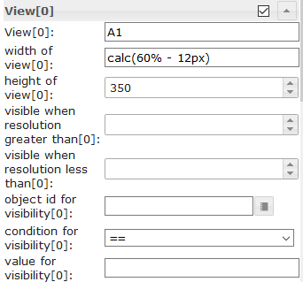</td><td>视线宽度[x]</td><td>定义视图的宽度。允许的值为数字，px，％或calc。实施例： <code>100</code> ， <code>100px</code> ， <code>55%</code> <code>calc(60% - 12px)</code></td></tr><tr><td>视线高度[x]</td><td>您可以在此处指定所用视图的高度。<br><br>如果您希望高度根据视图进行可变调整，则此输入必须为空，并且对于视图中具有最高高度的窗口小部件，位置必须设置为相对，请参见屏幕截图：<br><br>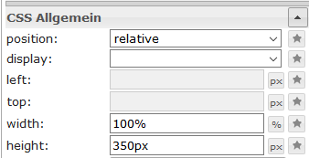</td></tr></tbody></table>

###网格视图


网格视图具有多个`view in widget`集成，它们将根据窗口小部件的宽度自动排序。使用此小部件，可以创建响应式布局（台式机，平板电脑和mobil的一种布局）。
如果包含的视图具有相同的高度，则网格视图特别有用。

<b>网格视图小部件共有12列。如果要使视图的宽度为4列，则必须在相应的视图中将列跨度设置为4 [x]</b>

<b>看一看[Material Design Widgets示例项目](https://github.com/Scrounger/ioBroker.vis-materialdesign#online-example-project)</b>以了解它是如何工作的。

####编辑器设置
<table><thead><tr><th>截屏</th><th>环境</th><th>描述</th></tr></thead><tbody><tr><td rowspan=1></td><td colspan=2>根据窗口小部件的宽度，可以从各个窗口小部件的宽度定义适用各个视图[x]的列跨度的规则以及视图之间的距离。可以独立设置纵向和横向格式的设置。要找出不同设备的分辨率宽度，请在通用设置下激活“分辨率助手”。</td></tr><tr><td rowspan=2></td><td colspan=2>根据当前的宽度分辨率规则定义视图的列范围。<br>您还可以在此处指定是仅以高于或低于定义值的分辨率显示视图，还是通过对象ID使其可见。</td></tr><tr><td>视线高度[x]</td><td>您可以在此处指定所用视图的高度。<br><br>如果您希望高度根据视图进行可变调整，则此输入必须为空，并且对于视图中具有最高高度的窗口小部件，位置必须设置为相对，请参见屏幕截图：<br><br></td></tbody></table>

##警报
可以使用Alerts小部件可以在VIS中显示消息，就像它与Pushover适配器一起使用一样，但是可以直接在VIS中显示。


###编辑器设置
下表中未列出的设置是不言自明的。

<table><thead><tr><th>截屏</th><th>环境</th><th>描述</th></tr></thead><tbody><tr><td rowspan=3></td><td>列数</td><td>定义列数</td></tr><tr><td>对象ID</td><td>对象必须是json字符串。允许的属性如下所述</td></tr><tr><td>最大限度。快讯</td><td>应该显示的最大警报数。</td></tr></tbody></table>

### Datapoint JSON属性
<table><thead><tr><th>财产</th><th>描述</th><th>类型</th><th>价值观</th></tr></thead><tbody><tr><td>文本</td><td>菜单项的文本</td><td>细绳</td><td></td></tr><tr><td>背景颜色</td><td>警报项目的背景色</td><td>细绳</td><td>十六进制（＃44739e），rgb（20、50、200），rgba（20、50、200、0.5）</td></tr><tr><td>边框颜色</td><td>警报项目的边框颜色</td><td>细绳</td><td>十六进制（＃44739e），rgb（20、50、200），rgba（20、50、200、0.5）</td></tr><tr><td>图标</td><td>菜单项的材料设计图标或图像路径</td><td>细绳</td><td/></tr><tr><td>iconColor</td><td>材料设计图标的颜色</td><td>细绳</td><td>十六进制（＃44739e），rgb（20、50、200），rgba（20、50、200、0.5）</td></tr><tr><td>字体颜色</td><td>警报项目的字体颜色</td><td>细绳</td><td>十六进制（＃44739e），rgb（20、50、200），rgba（20、50、200、0.5）</td></tr></tbody></table>

<！-在目录中省略->

#### Datapoint JSON属性-示例
<details>

```
[
       {
		"text": "we have a new message",
		"backgroundColor": "",
		"borderColor": "darkred",
		"icon": "message-alert-outline",
		"iconColor": "darkred",
		"fontColor": "blue"
	}, {
		"text": "we have a new message",
		"backgroundColor": "#e6b0aa",
		"borderColor": "green",
		"icon": "/vis/img/bulb_on.png",
		"iconColor": "green",
		"fontColor": "gold"
	}, {
		"text": "we have a new message",
		"backgroundColor": "",
		"borderColor": "gold",
		"icon": "alert-outline",
		"iconColor": "gold",
		"fontColor": ""
	}
]
```

</ details>

###脚本：向小部件发送警报
使用以下脚本，您可以将简单消息发送到Alerts Widget使用的数据点。
该脚本必须放入全局脚本中。然后可以使用以下命令发送消息

`materialDesignWidgets.sendTo('datapoint_id', 'message', 'color');`

```


var materialDesignWidgets = {};
materialDesignWidgets.sendTo = function (id, text, backgroundColor = '', borderColor = '', icon = '', iconColor = '', fontColor = '') {
    let json = getState(id).val;

    if (json) {
        try {

            json = JSON.parse(json);

        } catch (e) {
            json = [];
            console.warn('Wert ist kein JSON string! Wert wird ersetzt!');
        }
    } else {
        json = [];
    }

    json.push(
        {
            text: text,
            backgroundColor: backgroundColor,
            borderColor: borderColor,
            icon: icon,
            iconColor: iconColor,
            fontColor: fontColor
        }
    )
    setState(id, JSON.stringify(json), true);
}
```

＃＃ 日历


###编辑器设置
下表中未列出的设置是不言自明的。

<table><thead><tr><th>截屏</th><th>环境</th><th>描述</th></tr></thead><tbody><tr><td rowspan=1>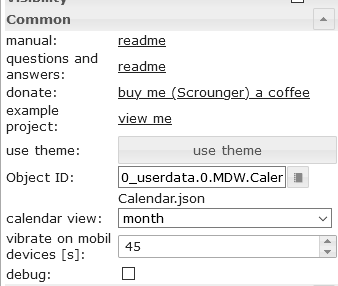</td><td>对象编号</td><td>数据点的ID。数据点必须包含json字符串。允许的json属性描述如下</td></tr><tr><td rowspan=2></td><td>要显示一周中的几天</td><td>指定要显示一周中的哪几天。要仅显示星期一至星期五，可以使用值<code>1, 2, 3, 4, 5</code> 。要显示从星期一开始的一周，可以使用值<code>1, 2, 3, 4, 5, 6, 0</code> 。</td></tr><tr><td>对象ID</td><td>对象必须是json字符串，其结构必须如上所述</td></tr><tr><td rowspan=2></td><td>开始时间</td><td>在周和日视图中应显示约会的小时数。</td></tr><tr><td>结束时间</td><td>在周和日视图中应显示约会的小时数</td></tr><tr><td rowspan=2></td><td colspan=2>覆盖默认日期格式。<a href="https://momentjs.com/docs/#/displaying/">允许的格式在momentjs</a>的文档中进行了描述</td></td></tr></tbody></table>

### Datapoint JSON属性
<table><thead><tr><th>财产</th><th>描述</th><th>类型</th><th>价值观</th></tr></thead><tbody><tr><td>姓名</td><td>活动名称</td><td>细绳</td><td></td></tr><tr><td>颜色</td><td>事件的背景色</td><td>细绳</td><td>十六进制（＃44739e），rgb（20、50、200），rgba（20、50、200、0.5）</td></tr><tr><td> colorText</td><td>事件的文字颜色</td><td>细绳</td><td>十六进制（＃44739e），rgb（20、50、200），rgba（20、50、200、0.5）</td></tr><tr><td>开始</td><td>活动的开始日期和时间。对于全天事件，请仅使用没有时间的日期。</td><td>细绳</td><td>YYYY-MM-DD | YYYY-MM-DD HH：mm</td></tr><tr><td>结尾</td><td>活动的结束日期和时间。对于全天事件，仅使用没有时间的日期</td><td>细绳</td><td>YYYY-MM-DD | YYYY-MM-DD HH：mm</td></tr></tbody></table>

<！-在目录中省略->

#### Datapoint JSON属性-示例
<details>

```
[
	{
		"name": "Event",
		"color": "#e74c3c",
		"colorText": "#FFFFFF",
		"start": "2020-01-24",
		"end": "2020-01-26"
	},
	{
		"name": "Meeting",
		"color": "#717d7e",
		"colorText": "#FFFFFF",
		"start": "2020-03-23 16:00",
		"end": "2020-03-24 17:15"
	}
]
```

</ details>

###脚本：ical转换
如果要将小部件与[医用适配器](https://github.com/iobroker-community-adapters/ioBroker.ical)一起使用，则可以使用以下脚本将ical对象转换为可与小部件一起使用。

<details>

```
// momentjs is required as dependecies in javascript adapter
const moment = require("moment");

var instances = $(`[id=ical.*.data.table]`);
instances.on(ical2CalendarWidget);

// remove this, if you know to use your own datapoint
let datapointId = 'materialdesignwidgets.calendar.ical2calendar'
createState(datapointId, "[]", {
  read: true,
  write: false,
  desc: "JSON String for Calendar Widget",
  type: "string",
  def: "[]"
});

function ical2CalendarWidget() {
    try {
        let calList = [];

        for (var inst = 0; inst <= instances.length - 1; inst++) {
            let icalObj = getState(instances[inst]).val;

            if (icalObj) {
                for (var i = 0; i <= icalObj.length - 1; i++) {
                    let item = icalObj[i];

                    // extract calendar color
                    let calendarName = item._class.split(' ')[0].replace('ical_', '');

                    let startTime = moment(item._date);
                    let endTime = moment(item._end);

                    let start = startTime.format("YYYY-MM-DD HH:mm");
                    let end = endTime.format("YYYY-MM-DD HH:mm");

                    if (startTime.format('HH:mm') === '00:00' && endTime.format('HH:mm') === '00:00') {
                        // is full-day event
                        if (endTime.diff(startTime, 'hours') === 24) {
                            // full-day event, one day
                            start = startTime.format("YYYY-MM-DD");
                            end = startTime.format("YYYY-MM-DD");
                        } else {
                            // full-day event, multiple days
                            start = startTime.format("YYYY-MM-DD");
                            end = endTime.format("YYYY-MM-DD");
                        }
                    }

                    // create object for calendar widget
                    calList.push({
                        name: item.event,
                        color: getMyCalendarColor(calendarName),
                        colorText: getMyCalendarTextColor(calendarName),
                        start: start,
                        end: end
                    })
                }

                function getMyCalendarColor(calendarName) {
                    // assign colors via the calendar names, use calendar name as set in ical
                    if (calendarName === 'calendar1') {
                        return '#FF0000';
                    } else if (calendarName === 'calendar2') {
                        return '#44739e'
                    } else if (calendarName === 'calendar3') {
                        return '#32a852'
                    }
                }

                function getMyCalendarTextColor(calendarName) {
                    // assign colors via the calendar names, use calendar name as set in ical
                    if (calendarName === 'calendar1') {
                        return '#FFFFFF';
                    } else if (calendarName === 'calendar2') {
                        return '#FFFFFF'
                    } else if (calendarName === 'calendar3') {
                        return '#FFFFFF'
                    }
                }
            }

            // Enter the destination data point that is to be used as object ID in the widget
            setState(datapointId, JSON.stringify(calList), true);
        }
    } catch (e) {
        console.error(`ical2MaterialDesignCalendarWidget: message: ${e.message}, stack: ${e.stack}`);
    }
}

ical2CalendarWidget();
```

</ details>

##对话


###编辑器设置
下表中未列出的设置是不言自明的。

<table><thead><tr><th>截屏</th><th>环境</th><th>描述</th></tr></thead><tbody><tr><td rowspan=3></td><td>显示对话框的方法</td><td>使用按钮或数据点（布尔型）显示对话框</td></tr><tr><td>Conatins视图</td><td>对话框应显示的视图</td></tr><tr><td>如果分辨率低于则显示全屏对话框</td><td>如果分辨率低于给定值，则显示全屏对话框。</td></tr></tbody></table>

## HTML窗口小部件
从受支持的Material Design小部件创建html小部件，以在支持html的任何其他小部件中使用它。
只需为您的Material Design小部件设置样式，按`generate Html Element`，复制数据并将其粘贴到支持html标签的任何小部件中。
或在脚本中使用它来动态生成窗口小部件。

>注意：> *html标记的属性必须用`'`（单引号）包围>* 双引号`"`组成的属性必须像`\"`一样转义>>将其与所示示例进行比较不同的小部件


有关支持的属性的更多信息，请参见各个小部件的HTML属性一章。

＃＃＃ 例子
<！-在目录中省略->

#### Slider Round与使用HTML窗口小部件的图标按钮结合使用
HTML部件中包含圆形滑块和图标按钮


通过VIS编辑器导入的小部件：<details>

```
[{"tpl":"tplHtml","data":{"g_fixed":false,"g_visibility":false,"g_css_font_text":false,"g_css_background":false,"g_css_shadow_padding":false,"g_css_border":false,"g_gestures":false,"g_signals":false,"g_last_change":false,"visibility-cond":"==","visibility-val":1,"visibility-groups-action":"hide","refreshInterval":"0","signals-cond-0":"==","signals-val-0":true,"signals-icon-0":"/vis/signals/lowbattery.png","signals-icon-size-0":0,"signals-blink-0":false,"signals-horz-0":0,"signals-vert-0":0,"signals-hide-edit-0":false,"signals-cond-1":"==","signals-val-1":true,"signals-icon-1":"/vis/signals/lowbattery.png","signals-icon-size-1":0,"signals-blink-1":false,"signals-horz-1":0,"signals-vert-1":0,"signals-hide-edit-1":false,"signals-cond-2":"==","signals-val-2":true,"signals-icon-2":"/vis/signals/lowbattery.png","signals-icon-size-2":0,"signals-blink-2":false,"signals-horz-2":0,"signals-vert-2":0,"signals-hide-edit-2":false,"lc-type":"last-change","lc-is-interval":true,"lc-is-moment":false,"lc-format":"","lc-position-vert":"top","lc-position-horz":"right","lc-offset-vert":0,"lc-offset-horz":0,"lc-font-size":"12px","lc-font-family":"","lc-font-style":"","lc-bkg-color":"","lc-color":"","lc-border-width":"0","lc-border-style":"","lc-border-color":"","lc-border-radius":10,"lc-zindex":0,"html":"<div>\n    <div class='vis-widget materialdesign-widget materialdesign-slider-round materialdesign-roundslider-html-element'\n    \tstyle='width: 100px; height: 100px; position: relative;'\n    \tmdw-oid='0_userdata.0.MDW.Slider.val0'\n    \tmdw-step='1'\n    \tmdw-startAngle='135'\n    \tmdw-arcLength='270'\n    \tmdw-handleZoom='1.5'\n    \tmdw-vibrateOnMobilDevices='50'\n    \tmdw-colorSliderBg='#mdwTheme:vis-materialdesign.0.colors.slider.background'\n    \tmdw-colorBeforeThumb='#mdwTheme:vis-materialdesign.0.colors.slider.control_before'\n    \tmdw-colorThumb='#mdwTheme:vis-materialdesign.0.colors.slider.control'\n    \tmdw-colorAfterThumb='#mdwTheme:vis-materialdesign.0.colors.slider.control_behind'\n    \tmdw-valueLabelColor='#mdwTheme:vis-materialdesign.0.colors.slider.text'\n    ></div>\n    <div class='vis-widget materialdesign-widget materialdesign-icon-button materialdesign-button-html-element'\n    \tstyle='width: 60px; height: 60px; position: absolute; padding: 0px; top: calc(50% - 30px); left:calc(50% - 30px);'\n    \tmdw-type='toggle_icon'\n    \tmdw-oid='0_userdata.0.MDW.Slider.val0'\n    \tmdw-toggleType='value'\n    \tmdw-valueOff='0'\n    \tmdw-valueOn='50'\n    \tmdw-iconHeight='35'\n    \tmdw-stateIfNotTrueValue='on'\n    \tmdw-vibrateOnMobilDevices='50'\n    \tmdw-image='lightbulb-off'\n    \tmdw-imageColor='#mdwTheme:vis-materialdesign.0.colors.button.icon.icon_off'\n    \tmdw-imageTrue='lightbulb-on'\n    \tmdw-imageTrueColor='gold'\n    \tmdw-colorBgFalse='#mdwTheme:vis-materialdesign.0.colors.button.icon.background_off'\n    \tmdw-colorBgTrue='#mdwTheme:vis-materialdesign.0.colors.button.icon.background_on'\n    \tmdw-colorPress='#mdwTheme:vis-materialdesign.0.colors.button.icon.pressed'\n    \tmdw-autoLockAfter='10'\n    \tmdw-lockIconTop='45'\n    \tmdw-lockIconLeft='55'\n    \tmdw-lockIconSize='20'\n    \tmdw-lockIconColor='#mdwTheme:vis-materialdesign.0.colors.button.icon.lock_icon'\n    \tmdw-lockIconBackground='#mdwTheme:vis-materialdesign.0.colors.button.icon.lock_icon_background'\n    \tmdw-lockBackgroundSizeFactor='1'\n    \tmdw-lockFilterGrayscale='30'\n    ></div>\n</div>"},"style":{"left":"527px","top":"76px","width":"100px","height":"100px"},"widgetSet":"basic"}]
```

</ details>

<！-在目录中省略->

####带有HTML小部件的列表
使用HTML小部件的带有自定义控件元素的列表


通过VIS编辑器导入的小部件：<details>

```
[{"tpl":"tplVis-materialdesign-List","data":{"g_fixed":false,"g_visibility":false,"g_css_font_text":false,"g_css_background":false,"g_css_shadow_padding":false,"g_css_border":false,"g_gestures":false,"g_signals":false,"g_last_change":false,"visibility-cond":"==","visibility-val":1,"visibility-groups-action":"hide","vibrateOnMobilDevices":"50","listType":"text","listItemDividerStyle":"padded","listLayout":"card","showScrollbar":false,"listItemDataMethod":"inputPerEditor","countListItems":"5","listItemAlignment":"left","listItemBackground":"#mdwTheme:vis-materialdesign.0.colors.list.background_off","listItemBackgroundActive":"#mdwTheme:vis-materialdesign.0.colors.list.background_on","colorSwitchThumb":"#mdwTheme:vis-materialdesign.0.colors.switch.off","colorSwitchTrack":"#mdwTheme:vis-materialdesign.0.colors.switch.track","colorSwitchTrue":"#mdwTheme:vis-materialdesign.0.colors.switch.on","colorSwitchHover":"#mdwTheme:vis-materialdesign.0.colors.switch.off_hover","colorCheckBox":"#mdwTheme:vis-materialdesign.0.colors.checkbox.on","colorListItemHover":"#mdwTheme:vis-materialdesign.0.colors.list.hover","colorListItemSelected":"#mdwTheme:vis-materialdesign.0.colors.list.selected","colorListItemText":"#mdwTheme:vis-materialdesign.0.colors.list.text","colorListItemTextSecondary":"#mdwTheme:vis-materialdesign.0.colors.list.subText","colorListItemTextRight":"#mdwTheme:vis-materialdesign.0.colors.list.text_right","colorListItemTextSecondaryRight":"{mode:vis-materialdesign.0.colors.darkTheme;light:vis-materialdesign.0.colors.light.list.subText_right;dark:vis-materialdesign.0.colors.dark.list.subText_right; mode === \"true\" ? dark : light}","colorListItemHeaders":"#mdwTheme:vis-materialdesign.0.colors.list.header","colorListItemDivider":"#mdwTheme:vis-materialdesign.0.colors.list.divider","headerFontFamily":"#mdwTheme:vis-materialdesign.0.fonts.list.header","listItemFont":"#mdwTheme:vis-materialdesign.0.fonts.list.text","listItemSubFont":"#mdwTheme:vis-materialdesign.0.fonts.list.subText","listItemRightFont":"#mdwTheme:vis-materialdesign.0.fonts.list.text_right","listItemSubRightFont":"#mdwTheme:vis-materialdesign.0.fonts.list.subText_right","listItemTextSize":"#mdwTheme:vis-materialdesign.0.fontSizes.list.text","listItemSubTextSize":"#mdwTheme:vis-materialdesign.0.fontSizes.list.subText","listItemTextRightSize":"#mdwTheme:vis-materialdesign.0.fontSizes.list.text_right","listItemSubTextRightSize":"#mdwTheme:vis-materialdesign.0.fontSizes.list.subText_right","listItemHeaderTextSize":"#mdwTheme:vis-materialdesign.0.fontSizes.list.header","listImageColor0":"#mdwTheme:vis-materialdesign.0.colors.list.icon_off","listImageActiveColor0":"#mdwTheme:vis-materialdesign.0.colors.list.icon_on","listImageColor1":"#mdwTheme:vis-materialdesign.0.colors.list.icon_off","listImageActiveColor1":"#mdwTheme:vis-materialdesign.0.colors.list.icon_on","signals-cond-0":"==","signals-val-0":true,"signals-icon-0":"/vis/signals/lowbattery.png","signals-icon-size-0":0,"signals-blink-0":false,"signals-horz-0":0,"signals-vert-0":0,"signals-hide-edit-0":false,"signals-cond-1":"==","signals-val-1":true,"signals-icon-1":"/vis/signals/lowbattery.png","signals-icon-size-1":0,"signals-blink-1":false,"signals-horz-1":0,"signals-vert-1":0,"signals-hide-edit-1":false,"signals-cond-2":"==","signals-val-2":true,"signals-icon-2":"/vis/signals/lowbattery.png","signals-icon-size-2":0,"signals-blink-2":false,"signals-horz-2":0,"signals-vert-2":0,"signals-hide-edit-2":false,"lc-type":"last-change","lc-is-interval":true,"lc-is-moment":false,"lc-format":"","lc-position-vert":"top","lc-position-horz":"right","lc-offset-vert":0,"lc-offset-horz":0,"lc-font-size":"12px","lc-font-family":"","lc-font-style":"","lc-bkg-color":"","lc-color":"","lc-border-width":"0","lc-border-style":"","lc-border-color":"","lc-border-radius":10,"lc-zindex":0,"groupHeader0":"List with HTML Widgets","label0":"Button Toggle","rightLabel0":"<div style=\"display: flex; justify-content: right;\">\n    <div class='vis-widget materialdesign-widget materialdesign-button materialdesign-button-html-element'\n    \tstyle='width: 103px; height: 29px; position: relative; padding: 0px; margin-right: 10px;'\n    \tmdw-type='toggle_default'\n    \tmdw-oid='0_userdata.0.bool'\n    \tmdw-buttonStyle='raised'\n    \tmdw-toggleType='boolean'\n    \tmdw-stateIfNotTrueValue='on'\n    \tmdw-vibrateOnMobilDevices='50'\n    \tmdw-buttontext='off'\n    \tmdw-labelTrue='on'\n    \tmdw-textFontFamily='#mdwTheme:vis-materialdesign.0.fonts.button.default.text'\n    \tmdw-textFontSize='#mdwTheme:vis-materialdesign.0.fontSizes.button.default.text'\n    \tmdw-mdwButtonPrimaryColor='#mdwTheme:vis-materialdesign.0.colors.button.default.primary'\n    \tmdw-mdwButtonSecondaryColor='#mdwTheme:vis-materialdesign.0.colors.button.default.secondary'\n    \tmdw-colorBgTrue='green'\n    \tmdw-image='checkbox-blank-outline'\n    \tmdw-imageTrue='checkbox-marked'\n    \tmdw-iconPosition='left'\n    \tmdw-lockEnabled='false'\n    \tmdw-autoLockAfter='10'\n    \tmdw-lockIconColor='#mdwTheme:vis-materialdesign.0.colors.button.lock_icon'\n    \tmdw-lockFilterGrayscale='30'\n    ></div>\n</div>","rightTextWidth":"300","label1":"Switch","rightLabel1":"<div style=\"display: flex; justify-content: right;\">\n    <div class='vis-widget materialdesign-widget materialdesign-switch materialdesign-switch-html-element'\n    \tstyle='height: 50px; position: relative; overflow: visible !important; display: flex; align-items: center;'\n    \tmdw-oid='0_userdata.0.bool'\n    \tmdw-toggleType='boolean'\n    \tmdw-stateIfNotTrueValue='on'\n    \tmdw-vibrateOnMobilDevices='50'\n    \tmdw-labelPosition='right'\n    \tmdw-labelClickActive='true'\n    \tmdw-valueFontFamily='#mdwTheme:vis-materialdesign.0.fonts.switch.value'\n    \tmdw-valueFontSize='#mdwTheme:vis-materialdesign.0.fontSizes.switch.value'\n    \tmdw-colorSwitchThumb='#mdwTheme:vis-materialdesign.0.colors.switch.off'\n    \tmdw-colorSwitchTrack='#mdwTheme:vis-materialdesign.0.colors.switch.track'\n    \tmdw-colorSwitchTrue='#mdwTheme:vis-materialdesign.0.colors.switch.on'\n    \tmdw-colorSwitchHover='#mdwTheme:vis-materialdesign.0.colors.switch.off_hover'\n    \tmdw-colorSwitchHoverTrue='#mdwTheme:vis-materialdesign.0.colors.switch.on_hover'\n    \tmdw-labelColorFalse='#mdwTheme:vis-materialdesign.0.colors.switch.text_off'\n    \tmdw-labelColorTrue='#mdwTheme:vis-materialdesign.0.colors.switch.text_on'\n    \tmdw-autoLockAfter='10'\n    \tmdw-lockIconTop='5'\n    \tmdw-lockIconLeft='5'\n    \tmdw-lockIconColor='#mdwTheme:vis-materialdesign.0.colors.switch.lock_icon'\n    \tmdw-lockFilterGrayscale='30'\n    ></div>\n</div>","listImageColor2":"#mdwTheme:vis-materialdesign.0.colors.list.icon_off","listImageActiveColor2":"#mdwTheme:vis-materialdesign.0.colors.list.icon_on","listImageColor3":"#mdwTheme:vis-materialdesign.0.colors.list.icon_off","listImageActiveColor3":"#mdwTheme:vis-materialdesign.0.colors.list.icon_on","listImageColor4":"#mdwTheme:vis-materialdesign.0.colors.list.icon_off","listImageActiveColor4":"#mdwTheme:vis-materialdesign.0.colors.list.icon_on","listImageColor5":"#mdwTheme:vis-materialdesign.0.colors.list.icon_off","listImageActiveColor5":"#mdwTheme:vis-materialdesign.0.colors.list.icon_on","listImageColor6":"#mdwTheme:vis-materialdesign.0.colors.list.icon_off","listImageActiveColor6":"#mdwTheme:vis-materialdesign.0.colors.list.icon_on","label2":"Slider","rightLabel2":"<div style=\"display: flex; justify-content: right; overflow:visible !important;\">\n    <div class='vis-widget materialdesign-widget materialdesign-slider-vertical materialdesign-slider-html-element'\n    \tstyle='width: 100%; height: 100%; position: relative; overflow:visible !important; display: flex; align-items: center; padding: 0; margin-right: -6px;'\n    \tmdw-oid='0_userdata.0.number'\n    \tmdw-orientation='horizontal'\n    \tmdw-knobSize='knobSmall'\n    \tmdw-step='1'\n    \tmdw-vibrateOnMobilDevices='50'\n    \tmdw-showTicks='no'\n    \tmdw-tickTextColor='#mdwTheme:vis-materialdesign.0.colors.slider.tick'\n    \tmdw-tickFontFamily='#mdwTheme:vis-materialdesign.0.fonts.slider.ticks'\n    \tmdw-tickFontSize='#mdwTheme:vis-materialdesign.0.fontSizes.slider.ticks'\n    \tmdw-tickColorBefore='#mdwTheme:vis-materialdesign.0.colors.slider.tick_before'\n    \tmdw-tickColorAfter='#mdwTheme:vis-materialdesign.0.colors.slider.tick_after'\n    \tmdw-colorBeforeThumb='#mdwTheme:vis-materialdesign.0.colors.slider.control_before'\n    \tmdw-colorThumb='#mdwTheme:vis-materialdesign.0.colors.slider.control'\n    \tmdw-colorAfterThumb='#mdwTheme:vis-materialdesign.0.colors.slider.control_behind'\n    \tmdw-prepandTextColor='#mdwTheme:vis-materialdesign.0.colors.slider.text_prepand'\n    \tmdw-prepandTextFontSize='#mdwTheme:vis-materialdesign.0.fontSizes.slider.prepand'\n    \tmdw-prepandTextFontFamily='#mdwTheme:vis-materialdesign.0.fonts.slider.prepand'\n    \tmdw-valueLabelStyle='sliderValue'\n    \tmdw-valueFontFamily='#mdwTheme:vis-materialdesign.0.fonts.slider.value'\n    \tmdw-valueFontSize='#mdwTheme:vis-materialdesign.0.fontSizes.slider.value'\n    \tmdw-valueLabelColor='#mdwTheme:vis-materialdesign.0.colors.slider.text'\n    \tmdw-valueLabelWidth='50'\n    \tmdw-showThumbLabel='yes'\n    \tmdw-thumbBackgroundColor='#mdwTheme:vis-materialdesign.0.colors.slider.control_background'\n    \tmdw-thumbFontColor='#mdwTheme:vis-materialdesign.0.colors.slider.control_text'\n    \tmdw-thumbFontSize='#mdwTheme:vis-materialdesign.0.fontSizes.slider.control'\n    \tmdw-thumbFontFamily='#mdwTheme:vis-materialdesign.0.fonts.slider.control'\n    ></div>\n</div>","listOverflow2":true,"listItemRightAlignment":"left","rightLabel3":"<div style=\"display: flex; justify-content: right; overflow:visible !important; margin-right: 10px;\">\n    <div class='vis-widget materialdesign-widget materialdesign-progress materialdesign-progress-html-element'\n    \tstyle='width: 100%; height: 30px; position: relative; padding: 0px;'\n    \tmdw-type='linear'\n    \tmdw-oid='0_userdata.0.number'\n    \tmdw-progressRounded='true'\n    \tmdw-colorProgressBackground='#mdwTheme:vis-materialdesign.0.colors.progress.track_background'\n    \tmdw-colorProgress='#mdwTheme:vis-materialdesign.0.colors.progress.track'\n    \tmdw-colorOneCondition='50'\n    \tmdw-colorOne='#mdwTheme:vis-materialdesign.0.colors.progress.track_condition1'\n    \tmdw-colorTwoCondition='70'\n    \tmdw-colorTwo='#mdwTheme:vis-materialdesign.0.colors.progress.track_condition2'\n    \tmdw-showValueLabel='true'\n    \tmdw-valueLabelStyle='progressPercent'\n    \tmdw-textColor='#000'\n    \tmdw-textFontSize='#mdwTheme:vis-materialdesign.0.fontSizes.progress.text'\n    \tmdw-textFontFamily='#mdwTheme:vis-materialdesign.0.fonts.progress.text'\n    \tmdw-textAlign='end'\n    ></div>\n</div>\n\n\n\n","rightSubLabel3":"","listOverflow1":true,"label3":"Progress","dividers0":true,"dividers1":true,"dividers2":true,"dividers3":true,"listImageHeight":"","listItemHeight":"40","listImage0":"gesture-tap-button","oid1":"","listImage1":"application-export","listImage2":"view-day","listImage3":"progress-download","label4":"Select","rightLabel4":"<div style=\"display: flex; justify-content: right; margin-right: 10px;\">\n    <div class='vis-widget materialdesign-widget materialdesign-select materialdesign-select-html-element'\n    \tstyle='width: 183px; height: 28px; position: relative; overflow: visible; display: flex; align-items: center;'\n    \tmdw-oid='0_userdata.0.number'\n    \tmdw-inputType='text'\n    \tmdw-vibrateOnMobilDevices='50'\n    \tmdw-inputLayout='regular'\n    \tmdw-inputAlignment='left'\n    \tmdw-inputLayoutBorderColor='#mdwTheme:vis-materialdesign.0.colors.input.border'\n    \tmdw-inputLayoutBorderColorHover='#mdwTheme:vis-materialdesign.0.colors.input.border_hover'\n    \tmdw-inputLayoutBorderColorSelected='#mdwTheme:vis-materialdesign.0.colors.input.border_selected'\n    \tmdw-inputTextFontFamily='#mdwTheme:vis-materialdesign.0.fonts.input.text'\n    \tmdw-inputTextFontSize='#mdwTheme:vis-materialdesign.0.fontSizes.input.text'\n    \tmdw-inputTextColor='#mdwTheme:vis-materialdesign.0.colors.input.text'\n    \tmdw-inputLabelText='by Value List'\n    \tmdw-inputLabelColor='#mdwTheme:vis-materialdesign.0.colors.input.label'\n    \tmdw-inputLabelColorSelected='#mdwTheme:vis-materialdesign.0.colors.input.label_selected'\n    \tmdw-inputLabelFontFamily='#mdwTheme:vis-materialdesign.0.fonts.input.label'\n    \tmdw-inputLabelFontSize='#mdwTheme:vis-materialdesign.0.fontSizes.input.label'\n    \tmdw-inputTranslateX='-29'\n    \tmdw-inputAppendixColor='#mdwTheme:vis-materialdesign.0.colors.input.appendix'\n    \tmdw-inputAppendixFontSize='#mdwTheme:vis-materialdesign.0.fontSizes.input.appendix'\n    \tmdw-inputAppendixFontFamily='#mdwTheme:vis-materialdesign.0.fonts.input.appendix'\n    \tmdw-showInputMessageAlways='true'\n    \tmdw-inputMessageFontFamily='#mdwTheme:vis-materialdesign.0.fonts.input.message'\n    \tmdw-inputMessageFontSize='#mdwTheme:vis-materialdesign.0.fontSizes.input.message'\n    \tmdw-inputMessageColor='#mdwTheme:vis-materialdesign.0.colors.input.message'\n    \tmdw-inputCounterColor='#mdwTheme:vis-materialdesign.0.colors.input.counter'\n    \tmdw-inputCounterFontSize='#mdwTheme:vis-materialdesign.0.fontSizes.input.counter'\n    \tmdw-inputCounterFontFamily='#mdwTheme:vis-materialdesign.0.fonts.input.counter'\n    \tmdw-clearIconShow='true'\n    \tmdw-clearIconColor='#mdwTheme:vis-materialdesign.0.colors.input.icon_clear'\n    \tmdw-collapseIconColor='#mdwTheme:vis-materialdesign.0.colors.input.icon_collapse'\n    \tmdw-listDataMethod='valueList'\n    \tmdw-countSelectItems='0'\n    \tmdw-valueList='10;30;90'\n    \tmdw-valueListLabels='val1;val2;val3'\n    \tmdw-valueListIcons='home;home;home'\n    \tmdw-listPosition='auto'\n    \tmdw-listItemBackgroundColor='#mdwTheme:vis-materialdesign.0.colors.input.menu.background'\n    \tmdw-listItemBackgroundHoverColor='#mdwTheme:vis-materialdesign.0.colors.input.menu.hover'\n    \tmdw-listItemBackgroundSelectedColor='#mdwTheme:vis-materialdesign.0.colors.input.menu.selected'\n    \tmdw-listItemRippleEffectColor='#mdwTheme:vis-materialdesign.0.colors.input.menu.effect'\n    \tmdw-showSelectedIcon='prepend-inner'\n    \tmdw-listIconColor='#mdwTheme:vis-materialdesign.0.colors.input.menu.icon'\n    \tmdw-listItemFontSize='#mdwTheme:vis-materialdesign.0.fontSizes.input.dropdown.text'\n    \tmdw-listItemFont='#mdwTheme:vis-materialdesign.0.fonts.input.dropdown.text'\n    \tmdw-listItemFontColor='#mdwTheme:vis-materialdesign.0.colors.input.menu.text'\n    \tmdw-listItemSubFontSize='#mdwTheme:vis-materialdesign.0.fontSizes.input.dropdown.subText'\n    \tmdw-listItemSubFont='#mdwTheme:vis-materialdesign.0.fonts.input.dropdown.subText'\n    \tmdw-listItemSubFontColor='#mdwTheme:vis-materialdesign.0.colors.input.menu.subText'\n    \tmdw-showValue='true'\n    \tmdw-listItemValueFontSize='#mdwTheme:vis-materialdesign.0.fontSizes.input.dropdown.value'\n    \tmdw-listItemValueFont='#mdwTheme:vis-materialdesign.0.fonts.input.dropdown.value'\n    \tmdw-listItemValueFontColor='#mdwTheme:vis-materialdesign.0.colors.input.menu.value'\n    ></div>\n</div>\n\n\n\n","listImage4":"airplane-takeoff","dividers4":true,"label5":"Value","subLabel5":"","rightLabel5":"<div style=\"display: flex; justify-content: right; overflow:visible !important; margin-right: 10px;\">\n    <div class='vis-widget materialdesign-widget materialdesign-value materialdesign-value-html-element'\n    \tstyle='width: 80px; height: 100%; position: relative; display: flex; align-items: center;'\n    \tmdw-debug='false'\n    \tmdw-oid='0_userdata.0.number'\n    \tmdw-targetType='auto'\n    \tmdw-textAlign='end'\n    \tmdw-valuesFontColor='#mdwTheme:vis-materialdesign.0.colors.value.text'\n    \tmdw-valuesFontFamily='#mdwTheme:vis-materialdesign.0.fonts.value.text'\n    \tmdw-valuesFontSize='#mdwTheme:vis-materialdesign.0.fontSizes.value.text'\n    \tmdw-prepandTextColor='#mdwTheme:vis-materialdesign.0.colors.value.prepand'\n    \tmdw-prepandTextFontFamily='#mdwTheme:vis-materialdesign.0.fonts.value.prepand'\n    \tmdw-prepandTextFontSize='#mdwTheme:vis-materialdesign.0.fontSizes.value.prepand'\n    \tmdw-appendTextColor='#mdwTheme:vis-materialdesign.0.colors.value.append'\n    \tmdw-appendTextFontFamily='#mdwTheme:vis-materialdesign.0.fonts.value.append'\n    \tmdw-appendTextFontSize='#mdwTheme:vis-materialdesign.0.fontSizes.value.append'\n    \tmdw-valueLabelUnit='%'\n    \tmdw-calculate='#value * 10'\n    \tmdw-image='information'\n    \tmdw-imageColor='#mdwTheme:vis-materialdesign.0.colors.value.icon'\n    \tmdw-iconPosition='left'\n    \tmdw-changeEffectEnabled='true'\n    \tmdw-effectFontColor='#00e640'\n    \tmdw-effectFontSize='16'\n    \tmdw-effectDuration='750'\n    ></div>\n    </div>","listOverflow5":false,"dividers5":true,"listImage5":"parachute","rightLabel6":"","subLabel4":"","listOverflow4":true},"style":{"left":"78px","top":"48px","width":"643px","height":"425px","overflow-x":""},"widgetSet":"materialdesign"}]
```

</ details>

<！-在目录中省略->

在非Material Design小部件中使用的#### HTML小部件
非材料设计小部件中使用的按钮切换，此处使用[相对于材料先进](https://github.com/iobroker-community-adapters/ioBroker.vis-material-advanced)ListThermostat小部件


通过VIS编辑器导入的小部件：<details>

```
[{"tpl":"tplMaListThermostat","data":{"g_fixed":false,"g_visibility":false,"g_css_font_text":false,"g_css_background":false,"g_css_shadow_padding":false,"g_css_border":false,"g_gestures":false,"g_signals":false,"g_last_change":false,"visibility-cond":"==","visibility-val":1,"visibility-groups-action":"hide","showTitle":"checked","onlyTitle":"","titleSize":"medium","widgetBackground":"#121212","TextColor":"white","subtitleSize":"x-small","valueAlign":"right","valueVertical":"center","valueSize":"medium","opacityColor":"white","min":"14","max":"30","cardIcon":"/icons-mfd-svg/sani_heating_temp.svg","showIcon":"checked","centerIcon":true,"borderRadius":"10","borderColor":"white","useOverallRoundedValues":"checked","roundLeftUp":"10","roundLeftBottom":"0","roundRightUp":"0","roundRightBottom":"10","boxShadow":"unchecked","shadowWidth":"2","signals-cond-0":"==","signals-val-0":true,"signals-icon-0":"/vis/signals/lowbattery.png","signals-icon-size-0":0,"signals-blink-0":false,"signals-horz-0":0,"signals-vert-0":0,"signals-hide-edit-0":false,"signals-cond-1":"==","signals-val-1":true,"signals-icon-1":"/vis/signals/lowbattery.png","signals-icon-size-1":0,"signals-blink-1":false,"signals-horz-1":0,"signals-vert-1":0,"signals-hide-edit-1":false,"signals-cond-2":"==","signals-val-2":true,"signals-icon-2":"/vis/signals/lowbattery.png","signals-icon-size-2":0,"signals-blink-2":false,"signals-horz-2":0,"signals-vert-2":0,"signals-hide-edit-2":false,"lc-type":"last-change","lc-is-interval":true,"lc-is-moment":false,"lc-format":"","lc-position-vert":"top","lc-position-horz":"right","lc-offset-vert":0,"lc-offset-horz":0,"lc-font-size":"12px","lc-font-family":"","lc-font-style":"","lc-bkg-color":"","lc-color":"","lc-border-width":"0","lc-border-style":"","lc-border-color":"","lc-border-radius":10,"lc-zindex":0,"subtitle":"<br>\n<div class='vis-widget materialdesign-widget materialdesign-button materialdesign-button-html-element'\n\tstyle='width: 100%; height: 50px; position: relative; padding: 0px; z-index: 1'\n\tmdw-type='toggle_default'\n\tmdw-oid='0_userdata.0.string'\n\tmdw-buttonStyle='raised'\n\tmdw-toggleType='value'\n\tmdw-valueOff='bla'\n\tmdw-valueOn='on'\n\tmdw-stateIfNotTrueValue='on'\n\tmdw-vibrateOnMobilDevices='50'\n\tmdw-buttontext=' Toggle'\n\tmdw-textFontFamily='#mdwTheme:vis-materialdesign.0.fonts.button.default.text'\n\tmdw-textFontSize='#mdwTheme:vis-materialdesign.0.fontSizes.button.default.text'\n\tmdw-mdwButtonPrimaryColor='#mdwTheme:vis-materialdesign.0.colors.button.default.primary'\n\tmdw-mdwButtonSecondaryColor='#mdwTheme:vis-materialdesign.0.colors.button.default.secondary'\n\tmdw-colorBgTrue='green'\n\tmdw-image='checkbox-marked'\n\tmdw-iconPosition='left'\n\tmdw-autoLockAfter='10'\n\tmdw-lockIconColor='#mdwTheme:vis-materialdesign.0.colors.button.lock_icon'\n\tmdw-lockFilterGrayscale='30'\n></div>","title":"Material Design Button in Material Advanced Widget"},"style":{"left":"75px","top":"559px","width":"847px","height":"107px"},"widgetSet":"vis-material-advanced"}]
```

</ details>

<！-在目录中省略->

####在复杂视图中使用HTML窗口小部件的值
带有转换的更复杂视图中的值窗口小部件，显示了如何使用值窗口小部件而不是绑定。


查看通过VIS编辑器导入：<details>

```
{
  "settings": {
    "style": {
      "background_class": ""
    },
    "theme": "redmond",
    "sizex": "",
    "sizey": "",
    "gridSize": "",
    "snapType": null
  },
  "widgets": {
    "e00001": {
      "tpl": "tplVis-materialdesign-Card",
      "data": {
        "g_fixed": true,
        "g_visibility": false,
        "g_css_font_text": false,
        "g_css_background": false,
        "g_css_shadow_padding": false,
        "g_css_border": false,
        "g_gestures": false,
        "g_signals": false,
        "g_last_change": false,
        "visibility-cond": "==",
        "visibility-val": 1,
        "visibility-groups-action": "hide",
        "cardLayout": "Basic",
        "cardStyle": "default",
        "showTitle": false,
        "titleLayout": "20",
        "titleFontFamily": "",
        "showSubTitle": false,
        "subtitleLayout": "",
        "subTitleFontFamily": "",
        "showText": "true",
        "textFontSize": "",
        "textFontFamily": "",
        "refresh_oid_delay": "100",
        "refresh_animation_duration": "150",
        "colorBackground": "#mdwTheme:vis-materialdesign.0.colors.card.background",
        "colorTitleSectionBackground": "#mdwTheme:vis-materialdesign.0.colors.card.background_title",
        "colorTextSectionBackground": "#mdwTheme:vis-materialdesign.0.colors.card.background_body",
        "colorTitle": "#mdwTheme:vis-materialdesign.0.colors.card.title",
        "colorSubtitle": "#mdwTheme:vis-materialdesign.0.colors.card.subTitle",
        "colorBody": "#mdwTheme:vis-materialdesign.0.colors.card.text",
        "clickType": "none",
        "controlType": "link",
        "signals-cond-0": "==",
        "signals-val-0": true,
        "signals-icon-0": "/vis/signals/lowbattery.png",
        "signals-icon-size-0": 0,
        "signals-blink-0": false,
        "signals-horz-0": 0,
        "signals-vert-0": 0,
        "signals-hide-edit-0": false,
        "signals-cond-1": "==",
        "signals-val-1": true,
        "signals-icon-1": "/vis/signals/lowbattery.png",
        "signals-icon-size-1": 0,
        "signals-blink-1": false,
        "signals-horz-1": 0,
        "signals-vert-1": 0,
        "signals-hide-edit-1": false,
        "signals-cond-2": "==",
        "signals-val-2": true,
        "signals-icon-2": "/vis/signals/lowbattery.png",
        "signals-icon-size-2": 0,
        "signals-blink-2": false,
        "signals-horz-2": 0,
        "signals-vert-2": 0,
        "signals-hide-edit-2": false,
        "lc-type": "last-change",
        "lc-is-interval": true,
        "lc-is-moment": false,
        "lc-format": "",
        "lc-position-vert": "top",
        "lc-position-horz": "right",
        "lc-offset-vert": 0,
        "lc-offset-horz": 0,
        "lc-font-size": "12px",
        "lc-font-family": "",
        "lc-font-style": "",
        "lc-bkg-color": "",
        "lc-color": "",
        "lc-border-width": "0",
        "lc-border-style": "",
        "lc-border-color": "",
        "lc-border-radius": 10,
        "lc-zindex": 0,
        "title": "",
        "html": "<div style=\"width: 100%; display: flex; align-items: center; justify-content: center; flex-direction: column; margin-top: -10px\">\n    \n    <!-- Header Text -->\n    <div style=\"text-align:center; font-size: 20px; font-family: RobotoCondensed-Regular\">Photovoltaik</div>\n    \n    <!-- Icon -->\n    <div class='vis-widget materialdesign-widget materialdesign-icon materialdesign-materialdesignicons-html-element'\n    \tstyle='width: 100%; height: 55px; position: relative; display: flex; align-items: center; justify-content: center; margin-top: 4px;'\n    \tmdw-mdwIcon='solar-panel-large'\n    \tmdw-mdwIconSize='50'\n    \tmdw-mdwIconColor='gold'\n    ></div>\n        \n    <!-- Value -> Energie today -->\n    <div class='vis-widget materialdesign-widget materialdesign-value materialdesign-value-html-element'\n        style='width: auto; height: 20px; position: relative; display: flex; align-items: center;'\n        mdw-oid='0_userdata.0.Verbrauchszaehler.Photovoltaik.Verbrauch.Tag'\n        mdw-valueLabelUnit='kWh'\n        mdw-maxDecimals='1'        \n        mdw-textAlign='left'\n        mdw-valuesFontColor='#44739e'\n        mdw-valuesFontFamily='RobotoCondensed-Regular'\n        mdw-valuesFontSize='13'\n\t    mdw-image='arrow-down-bold'\n\t    mdw-imageColor='#44739e'\n\t    mdw-iconPosition='left'\n\t    mdw-iconHeight='16'\n    ></div>\n</div>",
        "showScrollbar": false,
        "name": "Photovoltaik - Card "
      },
      "style": {
        "left": "10px",
        "top": "10px",
        "z-index": "1",
        "width": "calc(50% - 15px)",
        "height": "120px"
      },
      "widgetSet": "materialdesign"
    },
    "e00002": {
      "tpl": "tplVis-materialdesign-Progress",
      "data": {
        "oid": "",
        "g_fixed": true,
        "g_visibility": true,
        "g_css_font_text": false,
        "g_css_background": false,
        "g_css_shadow_padding": false,
        "g_css_border": false,
        "g_gestures": false,
        "g_signals": false,
        "g_last_change": false,
        "visibility-cond": "!=",
        "visibility-val": "0",
        "visibility-groups-action": "hide",
        "progressRounded": false,
        "colorProgressBackground": "#mdwTheme:vis-materialdesign.0.colors.progress.track_background",
        "colorProgress": "#mdwTheme:vis-materialdesign.0.colors.progress.track",
        "colorOne": "#mdwTheme:vis-materialdesign.0.colors.progress.track_condition1",
        "colorTwo": "#mdwTheme:vis-materialdesign.0.colors.progress.track_condition2",
        "showValueLabel": false,
        "valueLabelStyle": "progressValue",
        "textColor": "#mdwTheme:vis-materialdesign.0.colors.progress.text",
        "textFontSize": "#mdwTheme:vis-materialdesign.0.fontSizes.progress.text",
        "textFontFamily": "#mdwTheme:vis-materialdesign.0.fonts.progress.text",
        "textAlign": "center",
        "signals-cond-0": "==",
        "signals-val-0": true,
        "signals-icon-0": "/vis/signals/lowbattery.png",
        "signals-icon-size-0": 0,
        "signals-blink-0": false,
        "signals-horz-0": 0,
        "signals-vert-0": 0,
        "signals-hide-edit-0": false,
        "signals-cond-1": "==",
        "signals-val-1": true,
        "signals-icon-1": "/vis/signals/lowbattery.png",
        "signals-icon-size-1": 0,
        "signals-blink-1": false,
        "signals-horz-1": 0,
        "signals-vert-1": 0,
        "signals-hide-edit-1": false,
        "signals-cond-2": "==",
        "signals-val-2": true,
        "signals-icon-2": "/vis/signals/lowbattery.png",
        "signals-icon-size-2": 0,
        "signals-blink-2": false,
        "signals-horz-2": 0,
        "signals-vert-2": 0,
        "signals-hide-edit-2": false,
        "lc-type": "last-change",
        "lc-is-interval": true,
        "lc-is-moment": false,
        "lc-format": "",
        "lc-position-vert": "top",
        "lc-position-horz": "right",
        "lc-offset-vert": 0,
        "lc-offset-horz": 0,
        "lc-font-size": "12px",
        "lc-font-family": "",
        "lc-font-style": "",
        "lc-bkg-color": "",
        "lc-color": "",
        "lc-border-width": "0",
        "lc-border-style": "",
        "lc-border-color": "",
        "lc-border-radius": 10,
        "lc-zindex": 0,
        "progressIndeterminate": true,
        "visibility-oid": "linkeddevices.0.Energiespeicher.Photovoltaik.Leistung",
        "reverse": false,
        "progressRotate": "yes",
        "name": "Photovoltaik - Progress OUT "
      },
      "style": {
        "left": "calc(25% - 2px)",
        "top": "130px",
        "width": "4px",
        "height": "50px",
        "z-index": "1"
      },
      "widgetSet": "materialdesign"
    },
    "e00003": {
      "tpl": "tplVis-materialdesign-value",
      "data": {
        "oid": "linkeddevices.0.Energiespeicher.Photovoltaik.Leistung",
        "g_fixed": true,
        "g_visibility": true,
        "g_css_font_text": false,
        "g_css_background": false,
        "g_css_shadow_padding": false,
        "g_css_border": false,
        "g_gestures": false,
        "g_signals": false,
        "g_last_change": false,
        "visibility-cond": "!=",
        "visibility-val": "0",
        "visibility-groups-action": "hide",
        "targetType": "auto",
        "textAlign": "start",
        "valuesFontColor": "#mdwTheme:vis-materialdesign.0.colors.value.text",
        "valuesFontFamily": "#mdwTheme:vis-materialdesign.0.fonts.value.text",
        "valuesFontSize": "#mdwTheme:vis-materialdesign.0.fontSizes.value.text",
        "prepandTextColor": "#mdwTheme:vis-materialdesign.0.colors.value.prepand",
        "prepandTextFontFamily": "#mdwTheme:vis-materialdesign.0.fonts.value.prepand",
        "prepandTextFontSize": "#mdwTheme:vis-materialdesign.0.fontSizes.value.prepand",
        "appendTextColor": "#mdwTheme:vis-materialdesign.0.colors.value.append",
        "appendTextFontFamily": "#mdwTheme:vis-materialdesign.0.fonts.value.append",
        "appendTextFontSize": "#mdwTheme:vis-materialdesign.0.fontSizes.value.append",
        "image": "",
        "imageColor": "#mdwTheme:vis-materialdesign.0.colors.value.icon",
        "iconPosition": "left",
        "effectFontColor": "#00e640",
        "effectFontSize": "",
        "effectDuration": "500",
        "signals-cond-0": "==",
        "signals-val-0": true,
        "signals-icon-0": "/vis/signals/lowbattery.png",
        "signals-icon-size-0": 0,
        "signals-blink-0": false,
        "signals-horz-0": 0,
        "signals-vert-0": 0,
        "signals-hide-edit-0": false,
        "signals-cond-1": "==",
        "signals-val-1": true,
        "signals-icon-1": "/vis/signals/lowbattery.png",
        "signals-icon-size-1": 0,
        "signals-blink-1": false,
        "signals-horz-1": 0,
        "signals-vert-1": 0,
        "signals-hide-edit-1": false,
        "signals-cond-2": "==",
        "signals-val-2": true,
        "signals-icon-2": "/vis/signals/lowbattery.png",
        "signals-icon-size-2": 0,
        "signals-blink-2": false,
        "signals-horz-2": 0,
        "signals-vert-2": 0,
        "signals-hide-edit-2": false,
        "lc-type": "last-change",
        "lc-is-interval": true,
        "lc-is-moment": false,
        "lc-format": "",
        "lc-position-vert": "top",
        "lc-position-horz": "right",
        "lc-offset-vert": 0,
        "lc-offset-horz": 0,
        "lc-font-size": "12px",
        "lc-font-family": "",
        "lc-font-style": "",
        "lc-bkg-color": "",
        "lc-color": "",
        "lc-border-width": "0",
        "lc-border-style": "",
        "lc-border-color": "",
        "lc-border-radius": 10,
        "lc-zindex": 0,
        "valueLabelUnit": "W",
        "changeEffectEnabled": false,
        "generateHtmlControl": "true",
        "visibility-oid": "linkeddevices.0.Energiespeicher.Photovoltaik.Leistung",
        "name": "Photovoltaik - Leistung"
      },
      "style": {
        "left": "calc(25% + 10px)",
        "top": "140px",
        "z-index": "2",
        "width": "100px",
        "height": "29px"
      },
      "widgetSet": "materialdesign"
    },
    "e00004": {
      "tpl": "tplVis-materialdesign-Chart-Bar",
      "data": {
        "oid": "nothing_selected",
        "g_fixed": true,
        "g_visibility": false,
        "g_css_font_text": false,
        "g_css_background": false,
        "g_css_shadow_padding": false,
        "g_css_border": false,
        "g_gestures": false,
        "g_signals": false,
        "g_last_change": false,
        "visibility-cond": "==",
        "visibility-val": 1,
        "visibility-groups-action": "hide",
        "chartDataMethod": "inputPerEditor",
        "dataCount": "1",
        "chartType": "vertical",
        "backgroundColor": "#mdwTheme:vis-materialdesign.0.colors.charts.background",
        "chartAreaBackgroundColor": "#mdwTheme:vis-materialdesign.0.colors.charts.background_chart",
        "titleLayout": "#mdwTheme:vis-materialdesign.0.fontSizes.card.title",
        "titleFontFamily": "#mdwTheme:vis-materialdesign.0.fonts.card.title",
        "colorBackground": "#mdwTheme:vis-materialdesign.0.colors.card.background",
        "colorTitleSectionBackground": "#mdwTheme:vis-materialdesign.0.colors.card.background_title",
        "colorTextSectionBackground": "#mdwTheme:vis-materialdesign.0.colors.card.background_body",
        "colorTitle": "#mdwTheme:vis-materialdesign.0.colors.card.title",
        "globalColor": "#mdwTheme:vis-materialdesign.0.colors.charts.global",
        "hoverColor": "#mdwTheme:vis-materialdesign.0.colors.charts.bar.hover",
        "hoverBorderColor": "#mdwTheme:vis-materialdesign.0.colors.charts.bar.hover_border",
        "showValues": "showValuesOn",
        "valuesFontColor": "#mdwTheme:vis-materialdesign.0.colors.charts.value",
        "valuesFontFamily": "#mdwTheme:vis-materialdesign.0.fonts.charts.value",
        "valuesFontSize": "#mdwTheme:vis-materialdesign.0.fontSizes.charts.value",
        "valuesPositionAnchor": "end",
        "valuesPositionAlign": "top",
        "valuesTextAlign": "center",
        "yAxisPosition": "left",
        "yAxisTitleColor": "#mdwTheme:vis-materialdesign.0.colors.charts.y_axis_title",
        "yAxisTitleFontFamily": "#mdwTheme:vis-materialdesign.0.fonts.charts.y_axis_title",
        "yAxisTitleFontSize": "#mdwTheme:vis-materialdesign.0.fontSizes.charts.y_axis_title",
        "yAxisValueLabelColor": "#mdwTheme:vis-materialdesign.0.colors.charts.y_axis_values",
        "yAxisValueFontFamily": "#mdwTheme:vis-materialdesign.0.fonts.charts.y_axis_values",
        "yAxisValueFontSize": "#mdwTheme:vis-materialdesign.0.fontSizes.charts.y_axis_values",
        "yAxisValueDistanceToAxis": "10",
        "yAxisShowAxis": false,
        "yAxisShowAxisLabels": false,
        "yAxisShowGridLines": false,
        "yAxisGridLinesColor": "#mdwTheme:vis-materialdesign.0.colors.charts.y_axis_gridlines",
        "yAxisShowTicks": false,
        "yAxisZeroLineColor": "#mdwTheme:vis-materialdesign.0.colors.charts.y_axis_zeroline",
        "xAxisPosition": "bottom",
        "xAxisTicksSource": "auto",
        "xAxisTitleColor": "#mdwTheme:vis-materialdesign.0.colors.charts.x_axis_title",
        "xAxisTitleFontFamily": "#mdwTheme:vis-materialdesign.0.fonts.charts.x_axis_title",
        "xAxisTitleFontSize": "#mdwTheme:vis-materialdesign.0.fontSizes.charts.x_axis_title",
        "xAxisValueLabelColor": "#mdwTheme:vis-materialdesign.0.colors.charts.x_axis_values",
        "xAxisValueFontFamily": "#mdwTheme:vis-materialdesign.0.fonts.charts.x_axis_values",
        "xAxisValueFontSize": "#mdwTheme:vis-materialdesign.0.fontSizes.charts.x_axis_values",
        "xAxisValueDistanceToAxis": "6",
        "xAxisShowAxis": false,
        "xAxisShowAxisLabels": true,
        "xAxisShowGridLines": false,
        "xAxisGridLinesColor": "#mdwTheme:vis-materialdesign.0.colors.charts.x_axis_gridlines",
        "xAxisShowTicks": false,
        "xAxisZeroLineColor": "#mdwTheme:vis-materialdesign.0.colors.charts.x_axis_zeroline",
        "xAxisMinRotation": "0",
        "xAxisMaxRotation": "0",
        "legendPosition": "right",
        "legendFontColor": "#mdwTheme:vis-materialdesign.0.colors.charts.legend",
        "legendFontFamily": "#mdwTheme:vis-materialdesign.0.fonts.charts.legend",
        "legendFontSize": "#mdwTheme:vis-materialdesign.0.fontSizes.charts.legend",
        "legendPointStyle": "true",
        "showTooltip": false,
        "tooltipBackgroundColor": "#mdwTheme:vis-materialdesign.0.colors.charts.tooltip_background",
        "tooltipShowColorBox": "true",
        "tooltipTitleFontColor": "#mdwTheme:vis-materialdesign.0.colors.charts.tooltip_title",
        "tooltipTitleFontFamily": "#mdwTheme:vis-materialdesign.0.fonts.charts.tooltip_title",
        "tooltipTitleFontSize": "#mdwTheme:vis-materialdesign.0.fontSizes.charts.tooltip_title",
        "tooltipBodyFontColor": "#mdwTheme:vis-materialdesign.0.colors.charts.tooltip_text",
        "tooltipBodyFontFamily": "#mdwTheme:vis-materialdesign.0.fonts.charts.tooltip_text",
        "tooltipBodyFontSize": "#mdwTheme:vis-materialdesign.0.fontSizes.charts.tooltip_text",
        "signals-cond-0": "==",
        "signals-val-0": true,
        "signals-icon-0": "/vis/signals/lowbattery.png",
        "signals-icon-size-0": 0,
        "signals-blink-0": false,
        "signals-horz-0": 0,
        "signals-vert-0": 0,
        "signals-hide-edit-0": false,
        "signals-cond-1": "==",
        "signals-val-1": true,
        "signals-icon-1": "/vis/signals/lowbattery.png",
        "signals-icon-size-1": 0,
        "signals-blink-1": false,
        "signals-horz-1": 0,
        "signals-vert-1": 0,
        "signals-hide-edit-1": false,
        "signals-cond-2": "==",
        "signals-val-2": true,
        "signals-icon-2": "/vis/signals/lowbattery.png",
        "signals-icon-size-2": 0,
        "signals-blink-2": false,
        "signals-horz-2": 0,
        "signals-vert-2": 0,
        "signals-hide-edit-2": false,
        "lc-type": "last-change",
        "lc-is-interval": true,
        "lc-is-moment": false,
        "lc-format": "",
        "lc-position-vert": "top",
        "lc-position-horz": "right",
        "lc-offset-vert": 0,
        "lc-offset-horz": 0,
        "lc-font-size": "12px",
        "lc-font-family": "",
        "lc-font-style": "",
        "lc-bkg-color": "",
        "lc-color": "",
        "lc-border-width": "0",
        "lc-border-style": "",
        "lc-border-color": "",
        "lc-border-radius": 10,
        "lc-zindex": 0,
        "oid0": "linkeddevices.0.Energiespeicher.Eigenverbrauch",
        "oid1": "linkeddevices.0.Energiespeicher.Autarkie",
        "axisValueMin": "0",
        "axisValueMax": "100",
        "chartPaddingTop": "30",
        "valueTextColor0": "",
        "valuesAppendText": " %",
        "label0": "Eigenverbrauch",
        "label1": "Autarkie",
        "cardUse": true,
        "dataColor0": "#ff9800",
        "dataColor1": "#6dd600",
        "barWidth": "",
        "disableHoverEffects": true,
        "name": "Bar Chart "
      },
      "style": {
        "left": "30px",
        "top": "180px",
        "width": "calc(100% - 60px)",
        "height": "200px",
        "z-index": "1"
      },
      "widgetSet": "materialdesign"
    },
    "e00005": {
      "tpl": "tplVis-materialdesign-Card",
      "data": {
        "g_fixed": true,
        "g_visibility": false,
        "g_css_font_text": false,
        "g_css_background": false,
        "g_css_shadow_padding": false,
        "g_css_border": false,
        "g_gestures": false,
        "g_signals": false,
        "g_last_change": false,
        "visibility-cond": "==",
        "visibility-val": 1,
        "visibility-groups-action": "hide",
        "cardLayout": "Basic",
        "cardStyle": "default",
        "showTitle": false,
        "titleLayout": "20",
        "titleFontFamily": "",
        "showSubTitle": false,
        "subtitleLayout": "",
        "subTitleFontFamily": "",
        "showText": "true",
        "textFontSize": "",
        "textFontFamily": "",
        "refresh_oid_delay": "100",
        "refresh_animation_duration": "150",
        "colorBackground": "#mdwTheme:vis-materialdesign.0.colors.card.background",
        "colorTitleSectionBackground": "#mdwTheme:vis-materialdesign.0.colors.card.background_title",
        "colorTextSectionBackground": "#mdwTheme:vis-materialdesign.0.colors.card.background_body",
        "colorTitle": "#mdwTheme:vis-materialdesign.0.colors.card.title",
        "colorSubtitle": "#mdwTheme:vis-materialdesign.0.colors.card.subTitle",
        "colorBody": "#mdwTheme:vis-materialdesign.0.colors.card.text",
        "clickType": "none",
        "controlType": "link",
        "signals-cond-0": "==",
        "signals-val-0": true,
        "signals-icon-0": "/vis/signals/lowbattery.png",
        "signals-icon-size-0": 0,
        "signals-blink-0": false,
        "signals-horz-0": 0,
        "signals-vert-0": 0,
        "signals-hide-edit-0": false,
        "signals-cond-1": "==",
        "signals-val-1": true,
        "signals-icon-1": "/vis/signals/lowbattery.png",
        "signals-icon-size-1": 0,
        "signals-blink-1": false,
        "signals-horz-1": 0,
        "signals-vert-1": 0,
        "signals-hide-edit-1": false,
        "signals-cond-2": "==",
        "signals-val-2": true,
        "signals-icon-2": "/vis/signals/lowbattery.png",
        "signals-icon-size-2": 0,
        "signals-blink-2": false,
        "signals-horz-2": 0,
        "signals-vert-2": 0,
        "signals-hide-edit-2": false,
        "lc-type": "last-change",
        "lc-is-interval": true,
        "lc-is-moment": false,
        "lc-format": "",
        "lc-position-vert": "top",
        "lc-position-horz": "right",
        "lc-offset-vert": 0,
        "lc-offset-horz": 0,
        "lc-font-size": "12px",
        "lc-font-family": "",
        "lc-font-style": "",
        "lc-bkg-color": "",
        "lc-color": "",
        "lc-border-width": "0",
        "lc-border-style": "",
        "lc-border-color": "",
        "lc-border-radius": 10,
        "lc-zindex": 0,
        "title": "",
        "html": "<div style=\"width: 100%; display: flex; align-items: center; justify-content: center; flex-direction: column; margin-top: -10px\">\n    \n    <!-- Header Text -->\n    <div style=\"text-align:center; font-size: 20px; font-family: RobotoCondensed-Regular\">Netz</div>\n    \n    <!-- Icon -->\n    <div class='vis-widget materialdesign-widget materialdesign-icon materialdesign-materialdesignicons-html-element'\n    \tstyle='width: 100%; height: 55px; position: relative; display: flex; align-items: center; justify-content: center; margin-top: 4px;'\n    \tmdw-mdwIcon='power-plug'\n    \tmdw-mdwIconSize='50'\n    \tmdw-mdwIconColor='#44739e'\n    ></div>\n        \n    <!-- Value -> Energie today -->\n    <div style=\"display: flex; align-items: center; justify-content: center; flex-direction: row;\">\n        <div class='vis-widget materialdesign-widget materialdesign-value materialdesign-value-html-element'\n            style='width: auto; height: 20px; position: relative; display: flex; align-items: center;'\n            mdw-oid='0_userdata.0.Verbrauchszaehler.Stromzaehler.Bezug.Verbrauch.Tag'\n            mdw-valueLabelUnit='kWh'\n            mdw-maxDecimals='1'        \n            mdw-textAlign='left'\n            mdw-valuesFontColor='#44739e'\n            mdw-valuesFontFamily='RobotoCondensed-Regular'\n            mdw-valuesFontSize='13'\n    \t    mdw-image='arrow-down-bold'\n    \t    mdw-imageColor='#44739e'\n    \t    mdw-iconPosition='left'\n    \t    mdw-iconHeight='16'\n        ></div>\n        <div class='vis-widget materialdesign-widget materialdesign-value materialdesign-value-html-element'\n            style='width: auto; height: 20px; position: relative; display: flex; align-items: center;'\n            mdw-oid='0_userdata.0.Verbrauchszaehler.Stromzaehler.Einspeisung.Verbrauch.Tag'\n            mdw-valueLabelUnit='kWh'\n            mdw-maxDecimals='1'        \n            mdw-textAlign='left'\n            mdw-valuesFontColor='#44739e'\n            mdw-valuesFontFamily='RobotoCondensed-Regular'\n            mdw-valuesFontSize='13'\n    \t    mdw-image='arrow-up-bold'\n    \t    mdw-imageColor='#44739e'\n    \t    mdw-iconPosition='left'\n    \t    mdw-iconHeight='16'\n        ></div>\n    </div>\n</div>",
        "showScrollbar": false,
        "name": "Netz - Card "
      },
      "style": {
        "left": "calc(50% + 5px)",
        "top": "10px",
        "z-index": "1",
        "width": "calc(50% - 15px)",
        "height": "120px"
      },
      "widgetSet": "materialdesign"
    },
    "e00006": {
      "tpl": "tplVis-materialdesign-Progress",
      "data": {
        "oid": "nothing_selected",
        "g_fixed": true,
        "g_visibility": true,
        "g_css_font_text": false,
        "g_css_background": false,
        "g_css_shadow_padding": false,
        "g_css_border": false,
        "g_gestures": false,
        "g_signals": false,
        "g_last_change": false,
        "visibility-cond": "<",
        "visibility-val": "0",
        "visibility-groups-action": "hide",
        "progressRounded": false,
        "colorProgressBackground": "#mdwTheme:vis-materialdesign.0.colors.progress.track_background",
        "colorProgress": "#mdwTheme:vis-materialdesign.0.colors.progress.track",
        "colorOne": "#mdwTheme:vis-materialdesign.0.colors.progress.track_condition1",
        "colorTwo": "#mdwTheme:vis-materialdesign.0.colors.progress.track_condition2",
        "showValueLabel": false,
        "valueLabelStyle": "progressPercent",
        "textColor": "#mdwTheme:vis-materialdesign.0.colors.progress.text",
        "textFontSize": "#mdwTheme:vis-materialdesign.0.fontSizes.progress.text",
        "textFontFamily": "#mdwTheme:vis-materialdesign.0.fonts.progress.text",
        "textAlign": "end",
        "signals-cond-0": "==",
        "signals-val-0": true,
        "signals-icon-0": "/vis/signals/lowbattery.png",
        "signals-icon-size-0": 0,
        "signals-blink-0": false,
        "signals-horz-0": 0,
        "signals-vert-0": 0,
        "signals-hide-edit-0": false,
        "signals-cond-1": "==",
        "signals-val-1": true,
        "signals-icon-1": "/vis/signals/lowbattery.png",
        "signals-icon-size-1": 0,
        "signals-blink-1": false,
        "signals-horz-1": 0,
        "signals-vert-1": 0,
        "signals-hide-edit-1": false,
        "signals-cond-2": "==",
        "signals-val-2": true,
        "signals-icon-2": "/vis/signals/lowbattery.png",
        "signals-icon-size-2": 0,
        "signals-blink-2": false,
        "signals-horz-2": 0,
        "signals-vert-2": 0,
        "signals-hide-edit-2": false,
        "lc-type": "last-change",
        "lc-is-interval": true,
        "lc-is-moment": false,
        "lc-format": "",
        "lc-position-vert": "top",
        "lc-position-horz": "right",
        "lc-offset-vert": 0,
        "lc-offset-horz": 0,
        "lc-font-size": "12px",
        "lc-font-family": "",
        "lc-font-style": "",
        "lc-bkg-color": "",
        "lc-color": "",
        "lc-border-width": "0",
        "lc-border-style": "",
        "lc-border-color": "",
        "lc-border-radius": 10,
        "lc-zindex": 0,
        "progressIndeterminate": true,
        "visibility-oid": "linkeddevices.0.Stromzaehler.Leistung",
        "reverse": true,
        "progressRotate": "yes",
        "name": "Netz - Progress IN "
      },
      "style": {
        "left": "calc(75% - 2px)",
        "top": "130px",
        "width": "4px",
        "height": "50px",
        "z-index": "1"
      },
      "widgetSet": "materialdesign"
    },
    "e00007": {
      "tpl": "tplVis-materialdesign-Progress",
      "data": {
        "oid": "nothing_selected",
        "g_fixed": true,
        "g_visibility": true,
        "g_css_font_text": false,
        "g_css_background": false,
        "g_css_shadow_padding": false,
        "g_css_border": false,
        "g_gestures": false,
        "g_signals": false,
        "g_last_change": false,
        "visibility-cond": ">",
        "visibility-val": "0",
        "visibility-groups-action": "hide",
        "progressRounded": false,
        "colorProgressBackground": "#mdwTheme:vis-materialdesign.0.colors.progress.track_background",
        "colorProgress": "#mdwTheme:vis-materialdesign.0.colors.progress.track",
        "colorOne": "#mdwTheme:vis-materialdesign.0.colors.progress.track_condition1",
        "colorTwo": "#mdwTheme:vis-materialdesign.0.colors.progress.track_condition2",
        "showValueLabel": false,
        "valueLabelStyle": "progressPercent",
        "textColor": "#mdwTheme:vis-materialdesign.0.colors.progress.text",
        "textFontSize": "#mdwTheme:vis-materialdesign.0.fontSizes.progress.text",
        "textFontFamily": "#mdwTheme:vis-materialdesign.0.fonts.progress.text",
        "textAlign": "end",
        "signals-cond-0": "==",
        "signals-val-0": true,
        "signals-icon-0": "/vis/signals/lowbattery.png",
        "signals-icon-size-0": 0,
        "signals-blink-0": false,
        "signals-horz-0": 0,
        "signals-vert-0": 0,
        "signals-hide-edit-0": false,
        "signals-cond-1": "==",
        "signals-val-1": true,
        "signals-icon-1": "/vis/signals/lowbattery.png",
        "signals-icon-size-1": 0,
        "signals-blink-1": false,
        "signals-horz-1": 0,
        "signals-vert-1": 0,
        "signals-hide-edit-1": false,
        "signals-cond-2": "==",
        "signals-val-2": true,
        "signals-icon-2": "/vis/signals/lowbattery.png",
        "signals-icon-size-2": 0,
        "signals-blink-2": false,
        "signals-horz-2": 0,
        "signals-vert-2": 0,
        "signals-hide-edit-2": false,
        "lc-type": "last-change",
        "lc-is-interval": true,
        "lc-is-moment": false,
        "lc-format": "",
        "lc-position-vert": "top",
        "lc-position-horz": "right",
        "lc-offset-vert": 0,
        "lc-offset-horz": 0,
        "lc-font-size": "12px",
        "lc-font-family": "",
        "lc-font-style": "",
        "lc-bkg-color": "",
        "lc-color": "",
        "lc-border-width": "0",
        "lc-border-style": "",
        "lc-border-color": "",
        "lc-border-radius": 10,
        "lc-zindex": 0,
        "progressIndeterminate": true,
        "visibility-oid": "linkeddevices.0.Stromzaehler.Leistung",
        "reverse": false,
        "progressRotate": "yes",
        "name": "Netz - Progress OUT "
      },
      "style": {
        "left": "calc(75% - 2px)",
        "top": "130px",
        "width": "4px",
        "height": "50px",
        "z-index": "1"
      },
      "widgetSet": "materialdesign"
    },
    "e00008": {
      "tpl": "tplVis-materialdesign-value",
      "data": {
        "oid": "linkeddevices.0.Stromzaehler.Leistung",
        "g_fixed": true,
        "g_visibility": true,
        "g_css_font_text": false,
        "g_css_background": false,
        "g_css_shadow_padding": false,
        "g_css_border": false,
        "g_gestures": false,
        "g_signals": false,
        "g_last_change": false,
        "visibility-cond": "!=",
        "visibility-val": "0",
        "visibility-groups-action": "hide",
        "targetType": "auto",
        "textAlign": "start",
        "valuesFontColor": "#mdwTheme:vis-materialdesign.0.colors.value.text",
        "valuesFontFamily": "#mdwTheme:vis-materialdesign.0.fonts.value.text",
        "valuesFontSize": "#mdwTheme:vis-materialdesign.0.fontSizes.value.text",
        "prepandTextColor": "#mdwTheme:vis-materialdesign.0.colors.value.prepand",
        "prepandTextFontFamily": "#mdwTheme:vis-materialdesign.0.fonts.value.prepand",
        "prepandTextFontSize": "#mdwTheme:vis-materialdesign.0.fontSizes.value.prepand",
        "appendTextColor": "#mdwTheme:vis-materialdesign.0.colors.value.append",
        "appendTextFontFamily": "#mdwTheme:vis-materialdesign.0.fonts.value.append",
        "appendTextFontSize": "#mdwTheme:vis-materialdesign.0.fontSizes.value.append",
        "image": "",
        "imageColor": "#mdwTheme:vis-materialdesign.0.colors.value.icon",
        "iconPosition": "left",
        "effectFontColor": "#00e640",
        "effectFontSize": "",
        "effectDuration": "500",
        "signals-cond-0": "==",
        "signals-val-0": true,
        "signals-icon-0": "/vis/signals/lowbattery.png",
        "signals-icon-size-0": 0,
        "signals-blink-0": false,
        "signals-horz-0": 0,
        "signals-vert-0": 0,
        "signals-hide-edit-0": false,
        "signals-cond-1": "==",
        "signals-val-1": true,
        "signals-icon-1": "/vis/signals/lowbattery.png",
        "signals-icon-size-1": 0,
        "signals-blink-1": false,
        "signals-horz-1": 0,
        "signals-vert-1": 0,
        "signals-hide-edit-1": false,
        "signals-cond-2": "==",
        "signals-val-2": true,
        "signals-icon-2": "/vis/signals/lowbattery.png",
        "signals-icon-size-2": 0,
        "signals-blink-2": false,
        "signals-horz-2": 0,
        "signals-vert-2": 0,
        "signals-hide-edit-2": false,
        "lc-type": "last-change",
        "lc-is-interval": true,
        "lc-is-moment": false,
        "lc-format": "",
        "lc-position-vert": "top",
        "lc-position-horz": "right",
        "lc-offset-vert": 0,
        "lc-offset-horz": 0,
        "lc-font-size": "12px",
        "lc-font-family": "",
        "lc-font-style": "",
        "lc-bkg-color": "",
        "lc-color": "",
        "lc-border-width": "0",
        "lc-border-style": "",
        "lc-border-color": "",
        "lc-border-radius": 10,
        "lc-zindex": 0,
        "valueLabelUnit": "W",
        "calculate": "",
        "condition": "",
        "textOnTrue": "",
        "textOnFalse": "",
        "changeEffectEnabled": false,
        "visibility-oid": "linkeddevices.0.Stromzaehler.Leistung",
        "name": "Netz - Leistung "
      },
      "style": {
        "left": "calc(75% + 10px)",
        "top": "140px",
        "width": "100px",
        "height": "29px",
        "z-index": "2"
      },
      "widgetSet": "materialdesign"
    },
    "e00009": {
      "tpl": "tplVis-materialdesign-Card",
      "data": {
        "g_fixed": true,
        "g_visibility": false,
        "g_css_font_text": false,
        "g_css_background": false,
        "g_css_shadow_padding": false,
        "g_css_border": false,
        "g_gestures": false,
        "g_signals": false,
        "g_last_change": false,
        "visibility-cond": "==",
        "visibility-val": 1,
        "visibility-groups-action": "hide",
        "cardLayout": "Basic",
        "cardStyle": "default",
        "showTitle": false,
        "titleLayout": "20",
        "titleFontFamily": "",
        "showSubTitle": false,
        "subtitleLayout": "",
        "subTitleFontFamily": "",
        "showText": "true",
        "textFontSize": "",
        "textFontFamily": "",
        "refresh_oid_delay": "100",
        "refresh_animation_duration": "150",
        "colorBackground": "#mdwTheme:vis-materialdesign.0.colors.card.background",
        "colorTitleSectionBackground": "#mdwTheme:vis-materialdesign.0.colors.card.background_title",
        "colorTextSectionBackground": "#mdwTheme:vis-materialdesign.0.colors.card.background_body",
        "colorTitle": "#mdwTheme:vis-materialdesign.0.colors.card.title",
        "colorSubtitle": "#mdwTheme:vis-materialdesign.0.colors.card.subTitle",
        "colorBody": "#mdwTheme:vis-materialdesign.0.colors.card.text",
        "clickType": "none",
        "controlType": "link",
        "signals-cond-0": "==",
        "signals-val-0": true,
        "signals-icon-0": "/vis/signals/lowbattery.png",
        "signals-icon-size-0": 0,
        "signals-blink-0": false,
        "signals-horz-0": 0,
        "signals-vert-0": 0,
        "signals-hide-edit-0": false,
        "signals-cond-1": "==",
        "signals-val-1": true,
        "signals-icon-1": "/vis/signals/lowbattery.png",
        "signals-icon-size-1": 0,
        "signals-blink-1": false,
        "signals-horz-1": 0,
        "signals-vert-1": 0,
        "signals-hide-edit-1": false,
        "signals-cond-2": "==",
        "signals-val-2": true,
        "signals-icon-2": "/vis/signals/lowbattery.png",
        "signals-icon-size-2": 0,
        "signals-blink-2": false,
        "signals-horz-2": 0,
        "signals-vert-2": 0,
        "signals-hide-edit-2": false,
        "lc-type": "last-change",
        "lc-is-interval": true,
        "lc-is-moment": false,
        "lc-format": "",
        "lc-position-vert": "top",
        "lc-position-horz": "right",
        "lc-offset-vert": 0,
        "lc-offset-horz": 0,
        "lc-font-size": "12px",
        "lc-font-family": "",
        "lc-font-style": "",
        "lc-bkg-color": "",
        "lc-color": "",
        "lc-border-width": "0",
        "lc-border-style": "",
        "lc-border-color": "",
        "lc-border-radius": 10,
        "lc-zindex": 0,
        "title": "",
        "html": "<div style=\"width: 100%; display: flex; align-items: center; justify-content: center; flex-direction: column; margin-top: -10px\">\n    \n    <!-- Header Text -->\n    <div style=\"text-align: center\">\n        <div class='vis-widget materialdesign-widget materialdesign-value materialdesign-value-html-element'\n        \tstyle='width: 100%; height: 30px; position: relative; display: flex; align-items:'\n        \tmdw-oid='linkeddevices.0.Energiespeicher.Batterie.Ladungszustand'\n        \tmdw-textAlign='start'\n        \tmdw-valuesFontColor='#44739e'\n        \tmdw-valuesFontFamily='RobotoCondensed-Regular'\n        \tmdw-valuesFontSize='20'\n        \tmdw-prepandText='Batterie |'\n        \tmdw-prepandTextColor='#44739e'\n        \tmdw-prepandTextFontFamily='RobotoCondensed-Regular'\n        \tmdw-prepandTextFontSize='20'\n        \tmdw-valueLabelUnit='%'\n        ></div>\n    </div>\n    \n    <!-- Icon -->\n    <div style=\"width: 100%; display: flex; align-items: center; justify-content: center; flex-direction: row;\">\n        <!-- Icon - Batterie Percent -->\n        <div class='vis-widget materialdesign-widget materialdesign-value materialdesign-value-html-element'\n        \tstyle='width: 55px; height: 55px; position: relative; display: flex; align-items: center; justify-content: center;'\n        \tmdw-oid='linkeddevices.0.Energiespeicher.Batterie.Ladungszustand'\n        \tmdw-overrideText='<span class=\"mdi mdi-#value[0]\" style=\"width: auto; height: auto; font-size: 50px; color: #value[1];\"></span>'\n        \tmdw-calculate='#value < 10 ? \"battery-outline|FireBrick\" : #value < 20 ? \"battery-10|FireBrick\" : #value < 30 ? \"battery-20|FireBrick\" : #value < 40 ? \"battery-30|orange\" : #value < 50 ? \"battery-40|orange\" : #value < 60 ? \"battery-50|orange\" : #value < 70 ? \"battery-60|orange\" : #value < 80 ? \"battery-70|green\" : #value < 90 ? \"battery-80|green\" : #value < 100 ? \"battery-90|green\" : \"battery|green\"'\n        ></div>\n        <!-- Icon - Batterie Loading -->\n        <div class='vis-widget materialdesign-widget materialdesign-value materialdesign-value-html-element'\n        \tstyle='width: 30px; height: 30px; position: absolute; display: flex; align-items: center; margin-left: 40px;'\n        \tmdw-oid='linkeddevices.0.Energiespeicher.Batterie.Leistung'\n        \tmdw-overrideText='<span class=\"mdi mdi-#value materialdesign-icon-image\" style=\"width: auto; height: auto; font-size: 30px; color: gold;\"></span>'\n        \tmdw-calculate='#value > 0 ? \"lightning-bolt\" : \"\"'\n        \tmdw-imageColor='#mdwTheme:vis-materialdesign.0.colors.value.icon'\n        ></div>        \n    </div>\n        \n    <!-- Value -> Energie today -->\n    <div style=\"display: flex; align-items: center; justify-content: center; flex-direction: row;\">\n        <div class='vis-widget materialdesign-widget materialdesign-value materialdesign-value-html-element'\n            style='width: auto; height: 20px; position: relative; display: flex; align-items: center;'\n            mdw-oid='0_userdata.0.Verbrauchszaehler.Batterie.Laden.Verbrauch.Tag'\n            mdw-valueLabelUnit='kWh'\n            mdw-maxDecimals='1'        \n            mdw-textAlign='left'\n            mdw-valuesFontColor='#44739e'\n            mdw-valuesFontFamily='RobotoCondensed-Regular'\n            mdw-valuesFontSize='13'\n    \t    mdw-image='arrow-down-bold'\n    \t    mdw-imageColor='#44739e'\n    \t    mdw-iconPosition='left'\n    \t    mdw-iconHeight='16'\n        ></div>\n        <div class='vis-widget materialdesign-widget materialdesign-value materialdesign-value-html-element'\n            style='width: auto; height: 20px; position: relative; display: flex; align-items: center;'\n            mdw-oid='0_userdata.0.Verbrauchszaehler.Batterie.Entladen.Verbrauch.Tag'\n            mdw-valueLabelUnit='kWh'\n            mdw-maxDecimals='1'        \n            mdw-textAlign='left'\n            mdw-valuesFontColor='#44739e'\n            mdw-valuesFontFamily='RobotoCondensed-Regular'\n            mdw-valuesFontSize='13'\n    \t    mdw-image='arrow-up-bold'\n    \t    mdw-imageColor='#44739e'\n    \t    mdw-iconPosition='left'\n    \t    mdw-iconHeight='16'\n        ></div>\n    </div>\n</div>",
        "showScrollbar": false,
        "name": "Batterie - Card "
      },
      "style": {
        "left": "10px",
        "top": "430px",
        "z-index": "1",
        "width": "calc(50% - 15px)",
        "height": "120px"
      },
      "widgetSet": "materialdesign"
    },
    "e00010": {
      "tpl": "tplVis-materialdesign-Progress",
      "data": {
        "oid": "nothing_selected",
        "g_fixed": true,
        "g_visibility": true,
        "g_css_font_text": false,
        "g_css_background": false,
        "g_css_shadow_padding": false,
        "g_css_border": false,
        "g_gestures": false,
        "g_signals": false,
        "g_last_change": false,
        "visibility-cond": "<",
        "visibility-val": "0",
        "visibility-groups-action": "hide",
        "progressRounded": false,
        "colorProgressBackground": "#mdwTheme:vis-materialdesign.0.colors.progress.track_background",
        "colorProgress": "#mdwTheme:vis-materialdesign.0.colors.progress.track",
        "colorOne": "#mdwTheme:vis-materialdesign.0.colors.progress.track_condition1",
        "colorTwo": "#mdwTheme:vis-materialdesign.0.colors.progress.track_condition2",
        "showValueLabel": false,
        "valueLabelStyle": "progressPercent",
        "textColor": "#mdwTheme:vis-materialdesign.0.colors.progress.text",
        "textFontSize": "#mdwTheme:vis-materialdesign.0.fontSizes.progress.text",
        "textFontFamily": "#mdwTheme:vis-materialdesign.0.fonts.progress.text",
        "textAlign": "end",
        "signals-cond-0": "==",
        "signals-val-0": true,
        "signals-icon-0": "/vis/signals/lowbattery.png",
        "signals-icon-size-0": 0,
        "signals-blink-0": false,
        "signals-horz-0": 0,
        "signals-vert-0": 0,
        "signals-hide-edit-0": false,
        "signals-cond-1": "==",
        "signals-val-1": true,
        "signals-icon-1": "/vis/signals/lowbattery.png",
        "signals-icon-size-1": 0,
        "signals-blink-1": false,
        "signals-horz-1": 0,
        "signals-vert-1": 0,
        "signals-hide-edit-1": false,
        "signals-cond-2": "==",
        "signals-val-2": true,
        "signals-icon-2": "/vis/signals/lowbattery.png",
        "signals-icon-size-2": 0,
        "signals-blink-2": false,
        "signals-horz-2": 0,
        "signals-vert-2": 0,
        "signals-hide-edit-2": false,
        "lc-type": "last-change",
        "lc-is-interval": true,
        "lc-is-moment": false,
        "lc-format": "",
        "lc-position-vert": "top",
        "lc-position-horz": "right",
        "lc-offset-vert": 0,
        "lc-offset-horz": 0,
        "lc-font-size": "12px",
        "lc-font-family": "",
        "lc-font-style": "",
        "lc-bkg-color": "",
        "lc-color": "",
        "lc-border-width": "0",
        "lc-border-style": "",
        "lc-border-color": "",
        "lc-border-radius": 10,
        "lc-zindex": 0,
        "progressIndeterminate": true,
        "visibility-oid": "linkeddevices.0.Energiespeicher.Batterie.Leistung",
        "reverse": true,
        "progressRotate": "yes",
        "name": "Batterie - Progress OUT "
      },
      "style": {
        "left": "calc(25% - 2px)",
        "top": "380px",
        "width": "4px",
        "height": "50px",
        "z-index": "1"
      },
      "widgetSet": "materialdesign"
    },
    "e00011": {
      "tpl": "tplVis-materialdesign-Progress",
      "data": {
        "oid": "nothing_selected",
        "g_fixed": true,
        "g_visibility": true,
        "g_css_font_text": false,
        "g_css_background": false,
        "g_css_shadow_padding": false,
        "g_css_border": false,
        "g_gestures": false,
        "g_signals": false,
        "g_last_change": false,
        "visibility-cond": ">",
        "visibility-val": "0",
        "visibility-groups-action": "hide",
        "progressRounded": false,
        "colorProgressBackground": "#mdwTheme:vis-materialdesign.0.colors.progress.track_background",
        "colorProgress": "#mdwTheme:vis-materialdesign.0.colors.progress.track",
        "colorOne": "#mdwTheme:vis-materialdesign.0.colors.progress.track_condition1",
        "colorTwo": "#mdwTheme:vis-materialdesign.0.colors.progress.track_condition2",
        "showValueLabel": false,
        "valueLabelStyle": "progressPercent",
        "textColor": "#mdwTheme:vis-materialdesign.0.colors.progress.text",
        "textFontSize": "#mdwTheme:vis-materialdesign.0.fontSizes.progress.text",
        "textFontFamily": "#mdwTheme:vis-materialdesign.0.fonts.progress.text",
        "textAlign": "end",
        "signals-cond-0": "==",
        "signals-val-0": true,
        "signals-icon-0": "/vis/signals/lowbattery.png",
        "signals-icon-size-0": 0,
        "signals-blink-0": false,
        "signals-horz-0": 0,
        "signals-vert-0": 0,
        "signals-hide-edit-0": false,
        "signals-cond-1": "==",
        "signals-val-1": true,
        "signals-icon-1": "/vis/signals/lowbattery.png",
        "signals-icon-size-1": 0,
        "signals-blink-1": false,
        "signals-horz-1": 0,
        "signals-vert-1": 0,
        "signals-hide-edit-1": false,
        "signals-cond-2": "==",
        "signals-val-2": true,
        "signals-icon-2": "/vis/signals/lowbattery.png",
        "signals-icon-size-2": 0,
        "signals-blink-2": false,
        "signals-horz-2": 0,
        "signals-vert-2": 0,
        "signals-hide-edit-2": false,
        "lc-type": "last-change",
        "lc-is-interval": true,
        "lc-is-moment": false,
        "lc-format": "",
        "lc-position-vert": "top",
        "lc-position-horz": "right",
        "lc-offset-vert": 0,
        "lc-offset-horz": 0,
        "lc-font-size": "12px",
        "lc-font-family": "",
        "lc-font-style": "",
        "lc-bkg-color": "",
        "lc-color": "",
        "lc-border-width": "0",
        "lc-border-style": "",
        "lc-border-color": "",
        "lc-border-radius": 10,
        "lc-zindex": 0,
        "progressIndeterminate": true,
        "visibility-oid": "linkeddevices.0.Energiespeicher.Batterie.Leistung",
        "reverse": false,
        "progressRotate": "yes",
        "name": "Batterie - Progress IN "
      },
      "style": {
        "left": "calc(25% - 2px)",
        "top": "380px",
        "width": "4px",
        "height": "50px",
        "z-index": "1"
      },
      "widgetSet": "materialdesign"
    },
    "e00012": {
      "tpl": "tplVis-materialdesign-value",
      "data": {
        "oid": "linkeddevices.0.Energiespeicher.Batterie.Leistung",
        "g_fixed": true,
        "g_visibility": true,
        "g_css_font_text": false,
        "g_css_background": false,
        "g_css_shadow_padding": false,
        "g_css_border": false,
        "g_gestures": false,
        "g_signals": false,
        "g_last_change": false,
        "visibility-cond": "!=",
        "visibility-val": "0",
        "visibility-groups-action": "hide",
        "targetType": "auto",
        "textAlign": "start",
        "valuesFontColor": "#mdwTheme:vis-materialdesign.0.colors.value.text",
        "valuesFontFamily": "#mdwTheme:vis-materialdesign.0.fonts.value.text",
        "valuesFontSize": "#mdwTheme:vis-materialdesign.0.fontSizes.value.text",
        "prepandTextColor": "#mdwTheme:vis-materialdesign.0.colors.value.prepand",
        "prepandTextFontFamily": "#mdwTheme:vis-materialdesign.0.fonts.value.prepand",
        "prepandTextFontSize": "#mdwTheme:vis-materialdesign.0.fontSizes.value.prepand",
        "appendTextColor": "#mdwTheme:vis-materialdesign.0.colors.value.append",
        "appendTextFontFamily": "#mdwTheme:vis-materialdesign.0.fonts.value.append",
        "appendTextFontSize": "#mdwTheme:vis-materialdesign.0.fontSizes.value.append",
        "image": "",
        "imageColor": "#mdwTheme:vis-materialdesign.0.colors.value.icon",
        "iconPosition": "left",
        "effectFontColor": "#00e640",
        "effectFontSize": "",
        "effectDuration": "500",
        "signals-cond-0": "==",
        "signals-val-0": true,
        "signals-icon-0": "/vis/signals/lowbattery.png",
        "signals-icon-size-0": 0,
        "signals-blink-0": false,
        "signals-horz-0": 0,
        "signals-vert-0": 0,
        "signals-hide-edit-0": false,
        "signals-cond-1": "==",
        "signals-val-1": true,
        "signals-icon-1": "/vis/signals/lowbattery.png",
        "signals-icon-size-1": 0,
        "signals-blink-1": false,
        "signals-horz-1": 0,
        "signals-vert-1": 0,
        "signals-hide-edit-1": false,
        "signals-cond-2": "==",
        "signals-val-2": true,
        "signals-icon-2": "/vis/signals/lowbattery.png",
        "signals-icon-size-2": 0,
        "signals-blink-2": false,
        "signals-horz-2": 0,
        "signals-vert-2": 0,
        "signals-hide-edit-2": false,
        "lc-type": "last-change",
        "lc-is-interval": true,
        "lc-is-moment": false,
        "lc-format": "",
        "lc-position-vert": "top",
        "lc-position-horz": "right",
        "lc-offset-vert": 0,
        "lc-offset-horz": 0,
        "lc-font-size": "12px",
        "lc-font-family": "",
        "lc-font-style": "",
        "lc-bkg-color": "",
        "lc-color": "",
        "lc-border-width": "0",
        "lc-border-style": "",
        "lc-border-color": "",
        "lc-border-radius": 10,
        "lc-zindex": 0,
        "valueLabelUnit": "W",
        "calculate": "",
        "condition": "",
        "textOnTrue": "",
        "textOnFalse": "",
        "changeEffectEnabled": false,
        "visibility-oid": "linkeddevices.0.Energiespeicher.Batterie.Leistung",
        "name": "Batterie - Leistung "
      },
      "style": {
        "left": "calc(25% + 10px)",
        "top": "390px",
        "width": "100px",
        "height": "29px",
        "z-index": "2"
      },
      "widgetSet": "materialdesign"
    },
    "e00013": {
      "tpl": "tplVis-materialdesign-Card",
      "data": {
        "g_fixed": true,
        "g_visibility": false,
        "g_css_font_text": false,
        "g_css_background": false,
        "g_css_shadow_padding": false,
        "g_css_border": false,
        "g_gestures": false,
        "g_signals": false,
        "g_last_change": false,
        "visibility-cond": "==",
        "visibility-val": 1,
        "visibility-groups-action": "hide",
        "cardLayout": "Basic",
        "cardStyle": "default",
        "showTitle": false,
        "titleLayout": "20",
        "titleFontFamily": "",
        "showSubTitle": false,
        "subtitleLayout": "",
        "subTitleFontFamily": "",
        "showText": "true",
        "textFontSize": "",
        "textFontFamily": "",
        "refresh_oid_delay": "100",
        "refresh_animation_duration": "150",
        "colorBackground": "#mdwTheme:vis-materialdesign.0.colors.card.background",
        "colorTitleSectionBackground": "#mdwTheme:vis-materialdesign.0.colors.card.background_title",
        "colorTextSectionBackground": "#mdwTheme:vis-materialdesign.0.colors.card.background_body",
        "colorTitle": "#mdwTheme:vis-materialdesign.0.colors.card.title",
        "colorSubtitle": "#mdwTheme:vis-materialdesign.0.colors.card.subTitle",
        "colorBody": "#mdwTheme:vis-materialdesign.0.colors.card.text",
        "clickType": "none",
        "controlType": "link",
        "signals-cond-0": "==",
        "signals-val-0": true,
        "signals-icon-0": "/vis/signals/lowbattery.png",
        "signals-icon-size-0": 0,
        "signals-blink-0": false,
        "signals-horz-0": 0,
        "signals-vert-0": 0,
        "signals-hide-edit-0": false,
        "signals-cond-1": "==",
        "signals-val-1": true,
        "signals-icon-1": "/vis/signals/lowbattery.png",
        "signals-icon-size-1": 0,
        "signals-blink-1": false,
        "signals-horz-1": 0,
        "signals-vert-1": 0,
        "signals-hide-edit-1": false,
        "signals-cond-2": "==",
        "signals-val-2": true,
        "signals-icon-2": "/vis/signals/lowbattery.png",
        "signals-icon-size-2": 0,
        "signals-blink-2": false,
        "signals-horz-2": 0,
        "signals-vert-2": 0,
        "signals-hide-edit-2": false,
        "lc-type": "last-change",
        "lc-is-interval": true,
        "lc-is-moment": false,
        "lc-format": "",
        "lc-position-vert": "top",
        "lc-position-horz": "right",
        "lc-offset-vert": 0,
        "lc-offset-horz": 0,
        "lc-font-size": "12px",
        "lc-font-family": "",
        "lc-font-style": "",
        "lc-bkg-color": "",
        "lc-color": "",
        "lc-border-width": "0",
        "lc-border-style": "",
        "lc-border-color": "",
        "lc-border-radius": 10,
        "lc-zindex": 0,
        "title": "",
        "html": "<div style=\"width: 100%; display: flex; align-items: center; justify-content: center; flex-direction: column; margin-top: -10px\">\n    \n    <!-- Header Text -->\n    <div style=\"text-align:center; font-size: 20px; font-family: RobotoCondensed-Regular\">Haus</div>\n    \n    <!-- Icon -->\n    <div class='vis-widget materialdesign-widget materialdesign-icon materialdesign-materialdesignicons-html-element'\n    \tstyle='width: 100%; height: 55px; position: relative; display: flex; align-items: center; justify-content: center; margin-top: 4px;'\n    \tmdw-mdwIcon='home'\n    \tmdw-mdwIconSize='50'\n    \tmdw-mdwIconColor='#44739e'\n    ></div>\n        \n    <!-- Value -> Energie today -->\n    <div class='vis-widget materialdesign-widget materialdesign-value materialdesign-value-html-element'\n        style='width: auto; height: 20px; position: relative; display: flex; align-items: center;'\n        mdw-oid='0_userdata.0.Verbrauchszaehler.Haus.Verbrauch.Tag'\n        mdw-valueLabelUnit='kWh'\n        mdw-maxDecimals='1'        \n        mdw-textAlign='left'\n        mdw-valuesFontColor='#44739e'\n        mdw-valuesFontFamily='RobotoCondensed-Regular'\n        mdw-valuesFontSize='13'\n\t    mdw-image='arrow-down-bold'\n\t    mdw-imageColor='#44739e'\n\t    mdw-iconPosition='left'\n\t    mdw-iconHeight='16'\n    ></div>    \n</div>",
        "showScrollbar": false,
        "name": "Haus - Card "
      },
      "style": {
        "left": "calc(50% + 5px)",
        "top": "430px",
        "z-index": "1",
        "width": "calc(50% - 15px)",
        "height": "120px"
      },
      "widgetSet": "materialdesign"
    },
    "e00014": {
      "tpl": "tplVis-materialdesign-Progress",
      "data": {
        "oid": "nothing_selected",
        "g_fixed": true,
        "g_visibility": true,
        "g_css_font_text": false,
        "g_css_background": false,
        "g_css_shadow_padding": false,
        "g_css_border": false,
        "g_gestures": false,
        "g_signals": false,
        "g_last_change": false,
        "visibility-cond": "!=",
        "visibility-val": "0",
        "visibility-groups-action": "hide",
        "progressRounded": false,
        "colorProgressBackground": "#mdwTheme:vis-materialdesign.0.colors.progress.track_background",
        "colorProgress": "#mdwTheme:vis-materialdesign.0.colors.progress.track",
        "colorOne": "#mdwTheme:vis-materialdesign.0.colors.progress.track_condition1",
        "colorTwo": "#mdwTheme:vis-materialdesign.0.colors.progress.track_condition2",
        "showValueLabel": false,
        "valueLabelStyle": "progressPercent",
        "textColor": "#mdwTheme:vis-materialdesign.0.colors.progress.text",
        "textFontSize": "#mdwTheme:vis-materialdesign.0.fontSizes.progress.text",
        "textFontFamily": "#mdwTheme:vis-materialdesign.0.fonts.progress.text",
        "textAlign": "end",
        "signals-cond-0": "==",
        "signals-val-0": true,
        "signals-icon-0": "/vis/signals/lowbattery.png",
        "signals-icon-size-0": 0,
        "signals-blink-0": false,
        "signals-horz-0": 0,
        "signals-vert-0": 0,
        "signals-hide-edit-0": false,
        "signals-cond-1": "==",
        "signals-val-1": true,
        "signals-icon-1": "/vis/signals/lowbattery.png",
        "signals-icon-size-1": 0,
        "signals-blink-1": false,
        "signals-horz-1": 0,
        "signals-vert-1": 0,
        "signals-hide-edit-1": false,
        "signals-cond-2": "==",
        "signals-val-2": true,
        "signals-icon-2": "/vis/signals/lowbattery.png",
        "signals-icon-size-2": 0,
        "signals-blink-2": false,
        "signals-horz-2": 0,
        "signals-vert-2": 0,
        "signals-hide-edit-2": false,
        "lc-type": "last-change",
        "lc-is-interval": true,
        "lc-is-moment": false,
        "lc-format": "",
        "lc-position-vert": "top",
        "lc-position-horz": "right",
        "lc-offset-vert": 0,
        "lc-offset-horz": 0,
        "lc-font-size": "12px",
        "lc-font-family": "",
        "lc-font-style": "",
        "lc-bkg-color": "",
        "lc-color": "",
        "lc-border-width": "0",
        "lc-border-style": "",
        "lc-border-color": "",
        "lc-border-radius": 10,
        "lc-zindex": 0,
        "progressIndeterminate": true,
        "visibility-oid": "linkeddevices.0.Energiespeicher.Haus.Leistung",
        "reverse": false,
        "progressRotate": "yes",
        "name": "Haus - Progress IN "
      },
      "style": {
        "left": "calc(75% - 2px)",
        "top": "380px",
        "width": "4px",
        "height": "50px",
        "z-index": "1"
      },
      "widgetSet": "materialdesign"
    },
    "e00015": {
      "tpl": "tplVis-materialdesign-value",
      "data": {
        "oid": "linkeddevices.0.Energiespeicher.Haus.Leistung",
        "g_fixed": true,
        "g_visibility": true,
        "g_css_font_text": false,
        "g_css_background": false,
        "g_css_shadow_padding": false,
        "g_css_border": false,
        "g_gestures": false,
        "g_signals": false,
        "g_last_change": false,
        "visibility-cond": "!=",
        "visibility-val": "0",
        "visibility-groups-action": "hide",
        "targetType": "auto",
        "textAlign": "start",
        "valuesFontColor": "#mdwTheme:vis-materialdesign.0.colors.value.text",
        "valuesFontFamily": "#mdwTheme:vis-materialdesign.0.fonts.value.text",
        "valuesFontSize": "#mdwTheme:vis-materialdesign.0.fontSizes.value.text",
        "prepandTextColor": "#mdwTheme:vis-materialdesign.0.colors.value.prepand",
        "prepandTextFontFamily": "#mdwTheme:vis-materialdesign.0.fonts.value.prepand",
        "prepandTextFontSize": "#mdwTheme:vis-materialdesign.0.fontSizes.value.prepand",
        "appendTextColor": "#mdwTheme:vis-materialdesign.0.colors.value.append",
        "appendTextFontFamily": "#mdwTheme:vis-materialdesign.0.fonts.value.append",
        "appendTextFontSize": "#mdwTheme:vis-materialdesign.0.fontSizes.value.append",
        "image": "",
        "imageColor": "#mdwTheme:vis-materialdesign.0.colors.value.icon",
        "iconPosition": "left",
        "effectFontColor": "#00e640",
        "effectFontSize": "",
        "effectDuration": "500",
        "signals-cond-0": "==",
        "signals-val-0": true,
        "signals-icon-0": "/vis/signals/lowbattery.png",
        "signals-icon-size-0": 0,
        "signals-blink-0": false,
        "signals-horz-0": 0,
        "signals-vert-0": 0,
        "signals-hide-edit-0": false,
        "signals-cond-1": "==",
        "signals-val-1": true,
        "signals-icon-1": "/vis/signals/lowbattery.png",
        "signals-icon-size-1": 0,
        "signals-blink-1": false,
        "signals-horz-1": 0,
        "signals-vert-1": 0,
        "signals-hide-edit-1": false,
        "signals-cond-2": "==",
        "signals-val-2": true,
        "signals-icon-2": "/vis/signals/lowbattery.png",
        "signals-icon-size-2": 0,
        "signals-blink-2": false,
        "signals-horz-2": 0,
        "signals-vert-2": 0,
        "signals-hide-edit-2": false,
        "lc-type": "last-change",
        "lc-is-interval": true,
        "lc-is-moment": false,
        "lc-format": "",
        "lc-position-vert": "top",
        "lc-position-horz": "right",
        "lc-offset-vert": 0,
        "lc-offset-horz": 0,
        "lc-font-size": "12px",
        "lc-font-family": "",
        "lc-font-style": "",
        "lc-bkg-color": "",
        "lc-color": "",
        "lc-border-width": "0",
        "lc-border-style": "",
        "lc-border-color": "",
        "lc-border-radius": 10,
        "lc-zindex": 0,
        "valueLabelUnit": "W",
        "calculate": "",
        "condition": "",
        "textOnTrue": "",
        "textOnFalse": "",
        "changeEffectEnabled": false,
        "visibility-oid": "linkeddevices.0.Energiespeicher.Haus.Leistung",
        "name": "Haus - Leistung "
      },
      "style": {
        "left": "calc(75% + 10px)",
        "top": "390px",
        "width": "100px",
        "height": "29px",
        "z-index": "2"
      },
      "widgetSet": "materialdesign"
    },
    "e00016": {
      "tpl": "tplVis-materialdesign-Card",
      "data": {
        "g_fixed": true,
        "g_visibility": false,
        "g_css_font_text": false,
        "g_css_background": false,
        "g_css_shadow_padding": false,
        "g_css_border": false,
        "g_gestures": false,
        "g_signals": false,
        "g_last_change": false,
        "visibility-cond": "==",
        "visibility-val": 1,
        "visibility-groups-action": "hide",
        "cardLayout": "Basic",
        "cardStyle": "default",
        "showTitle": "true",
        "titleLayout": "#mdwTheme:vis-materialdesign.0.fontSizes.card.title",
        "titleFontFamily": "#mdwTheme:vis-materialdesign.0.fonts.card.title",
        "showSubTitle": "true",
        "subtitleLayout": "#mdwTheme:vis-materialdesign.0.fontSizes.card.subTitle",
        "subTitleFontFamily": "#mdwTheme:vis-materialdesign.0.fonts.card.subTitle",
        "showText": "true",
        "textFontSize": "#mdwTheme:vis-materialdesign.0.fontSizes.card.text",
        "textFontFamily": "#mdwTheme:vis-materialdesign.0.fonts.card.text",
        "refresh_oid_delay": "100",
        "refresh_animation_duration": "150",
        "colorBackground": "#mdwTheme:vis-materialdesign.0.colors.card.background",
        "colorTitleSectionBackground": "#mdwTheme:vis-materialdesign.0.colors.card.background_title",
        "colorTextSectionBackground": "#mdwTheme:vis-materialdesign.0.colors.card.background_body",
        "colorTitle": "#mdwTheme:vis-materialdesign.0.colors.card.title",
        "colorSubtitle": "#mdwTheme:vis-materialdesign.0.colors.card.subTitle",
        "colorBody": "#mdwTheme:vis-materialdesign.0.colors.card.text",
        "clickType": "none",
        "controlType": "link",
        "signals-cond-0": "==",
        "signals-val-0": true,
        "signals-icon-0": "/vis/signals/lowbattery.png",
        "signals-icon-size-0": 0,
        "signals-blink-0": false,
        "signals-horz-0": 0,
        "signals-vert-0": 0,
        "signals-hide-edit-0": false,
        "signals-cond-1": "==",
        "signals-val-1": true,
        "signals-icon-1": "/vis/signals/lowbattery.png",
        "signals-icon-size-1": 0,
        "signals-blink-1": false,
        "signals-horz-1": 0,
        "signals-vert-1": 0,
        "signals-hide-edit-1": false,
        "signals-cond-2": "==",
        "signals-val-2": true,
        "signals-icon-2": "/vis/signals/lowbattery.png",
        "signals-icon-size-2": 0,
        "signals-blink-2": false,
        "signals-horz-2": 0,
        "signals-vert-2": 0,
        "signals-hide-edit-2": false,
        "lc-type": "last-change",
        "lc-is-interval": true,
        "lc-is-moment": false,
        "lc-format": "",
        "lc-position-vert": "top",
        "lc-position-horz": "right",
        "lc-offset-vert": 0,
        "lc-offset-horz": 0,
        "lc-font-size": "12px",
        "lc-font-family": "",
        "lc-font-style": "",
        "lc-bkg-color": "",
        "lc-color": "",
        "lc-border-width": "0",
        "lc-border-style": "",
        "lc-border-color": "",
        "lc-border-radius": 10,
        "lc-zindex": 0,
        "class": "my-card-container-relative",
        "showScrollbar": true
      },
      "style": {
        "left": "",
        "top": "",
        "height": "600px",
        "z-index": "0"
      },
      "widgetSet": "materialdesign"
    }
  },
  "name": "Energie_2",
  "filterList": []
}
```

</ details>

＃使用的库
适配器使用以下库：

* [用于网络的Google物料组件]（https://github.com/material-components/material-components-web）
* [Vuetify]（https://github.com/vuetifyjs/vuetify）
* [chartjs]（https://www.chartjs.org/）
* [来自thomasloven的round-slider]（https://github.com/thomasloven/round-slider）
* [材料设计图标]（https://materialdesignicons.com/）

## Changelog

<!--
    Placeholder for the next version (at the beginning of the line):    
	### __WORK IN PROGRESS__
-->

<!-- omit in toc -->
### __WORK IN PROGRESS__
* (Scrounger) HTML Widgets added - use Material Design Widgets in any html element
* (Scrounger) Table: Control Elements removed, using new HTML Widgets -> breaking changes !!!
* (Scrounger) list: using object id for json string added -> breaking changes !!!
* (Scrounger) new Value Widget added
* (Scrounger) Card layout bug fixes for HTML Card, IconList, List and Table Widget
* (Scrounger) icon list: option for status bar text added
* (Scrounger) icon list: status bar position bug fix
* (Scrounger) progress circular: auto size option added
* (Scrounger) VIS editor: html previews bug fixes
* (Scrounger) input, autocomplete, select: autofocus option added
* (Scrounger) Documentation revised
* (Scrounger) bug fixes

<!-- omit in toc -->
### 0.4.2 (2020-12-29)
* (Scrounger) vis-google-fonts dependency removed

<!-- omit in toc -->
### 0.4.1 (2020-12-27)
* (Scrounger): Adapter settings: theme editor implementation completed
* (Scrounger): Progress Widget: condition binding bug fix
* (Scrounger): minimal VIS adapter dependency set to v1.3.6
* (Scrounger): VIS editor: image dialog bug fix
* (Scrounger): Color themes for buttons and dialogs widgets implemented
* (Scrounger): Calendar Widget: week number bug fix
* (Scrougner): icon list: scrollbar bug fix
* (Scrounger): bug fixes

<!-- omit in toc -->
### 0.4.0-beta (2020-12-09)
* (Scrounger): Line History Chart Widget: Breaking Changes !!! aggregate (display) method for every dataset configurable, [see documentation for detailed infos](#line-history-chart)!
* (Scrounger): TopAppBar Widget: Breaking Changes !!! Submenus must now be created using JSON string, [see documentation for detailed infos](#since-version-040)!
* (Scrounger): Adapter settings wiht theme editor added
* (Scrounger): bug fix for compatibility issues with other widget adapters
* (Scrounger): Chechbox Widget: option for border and hover color added
* (Scrounger): Chechbox Widget: ripple effect bug fix
* (Scrounger): Buttons Vertical: text alignment option added
* (Scrounger): added URL support as source for symbols / images
* (Scrounger): HTML Card Widget: option to hide title, subtitle and text added
* (Scrounger): HTML Card Widget: background image refresh options by datapoint added
* (Scrounger): Fixed some errors reported via Sentry
* (Scrounger): Select & Autocomplete Widget: overriding icon color bug fix
* (Scrounger): Select & Autocomplete Widget: overriding icon bug fix
* (Scrounger): Select & Autocomplete Widget: colors bug fixes
* (Scrounger): Select & Autocomplete Widget: option to override the icon color of textfield for selected menu icon
* (Scrounger): Select & Autocomplete Widget: text alignment option added
* (Scrounger): Input Widget: text alignment option added
* (Scrounger): JSON Chart Widget: option to force x-axis time unit added
* (Scrounger): JSON Chart Widget: gradient colors for multipe dataset bug fixes
* (Scrounger): JSON Chart: default tooltip title added
* (Scrounger): JSON Chart: option to use Today / Yesterday for x-axis labeling added
* (Scrounger): JSON Chart: option to use Today / Yesterday for tooltip added
* (Scrounger): JSON Chart: option to change x-axis label distance added
* (Scrounger): Line History Chart: option for point color added
* (Scrounger): Line History Chart: option to use Today / Yesterday for x-axis labeling added
* (Scrounger): Line History Chart: option to use Today / Yesterday for tooltip added
* (Scrounger): Line History Chart: tooption change x-axis label distance added
* (Scrounger): Charts Widget: x-Axis time axis bug fixes
* (Scrounger): Calendar Widget: option to show calendar week numbers in month view added
* (Scrounger): Calendar Widget: option for custom date format added
* (Scrounger): IconList Widget: bug fix for performance issue
* (Scrounger): TopAppBar Widget: options for user groups added
* (Scrounger): Table Widget: html element added
* (Scrounger): Masonry & Grid View Widget: default width for handy portrait and landscape view changed
* (Scrounger): Progress Widget: option for indeterminate style added
* (Scrounger): dependencies updated
* (Scrounger): bug fixes

<!-- omit in toc -->
### 0.3.19 (2020-07-18)
* (Scrounger): Icon Button Widget: background color option for lock icon added
* (Scrounger): possibility to deactivate sentry implemented -> see documentation
* (Scrounger): Fixed some bugs reported via Sentry
* (Scrounger): prevent set value in vis editor
* (Scrounger): Grid & Mansonry Widget: visibilty by resoltuin bug fix
* (Scrounger): IconList Widget: Card Background for whole icon list added
* (Scrounger): Table Wigdet: button link widget added
* (Scrounger): Table Wigdet: material design icon widget added
* (Scrounger): Table Wigdet: alignment option for controls added
* (Scrounger): materialdesignicons library updated to v5.3.45
* (Scrounger): Round Slider lib updated to v0.5.0
* (Scrounger): Round Slider Widget: readonly option added
* (Scrounger): Table Widget: background color hover option added
* (Scrounger): bug fixes

## License

MIT License

Copyright (c) 2021 Scrounger <scrounger@gmx.net>

Permission is hereby granted, free of charge, to any person obtaining a copy
of this software and associated documentation files (the "Software"), to deal
in the Software without restriction, including without limitation the rights
to use, copy, modify, merge, publish, distribute, sublicense, and/or sell
copies of the Software, and to permit persons to whom the Software is
furnished to do so, subject to the following conditions:

The above copyright notice and this permission notice shall be included in all
copies or substantial portions of the Software.

THE SOFTWARE IS PROVIDED "AS IS", WITHOUT WARRANTY OF ANY KIND, EXPRESS OR
IMPLIED, INCLUDING BUT NOT LIMITED TO THE WARRANTIES OF MERCHANTABILITY,
FITNESS FOR A PARTICULAR PURPOSE AND NONINFRINGEMENT. IN NO EVENT SHALL THE
AUTHORS OR COPYRIGHT HOLDERS BE LIABLE FOR ANY CLAIM, DAMAGES OR OTHER
LIABILITY, WHETHER IN AN ACTION OF CONTRACT, TORT OR OTHERWISE, ARISING FROM,
OUT OF OR IN CONNECTION WITH THE SOFTWARE OR THE USE OR OTHER DEALINGS IN THE
SOFTWARE.