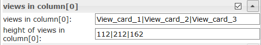

＃ioBroker.vis-materialdesign
## IoBroker VIS的材料设计小部件
[![贝宝]（https://www.paypalobjects.com/zh_CN/i/btn/btn_donateCC_LG.gif）](https://www.paypal.com/cgi-bin/webscr?cmd=_s-xclick&hosted_button_id=VWAXSTS634G88&source=url)

ioBroker物料设计小部件基于[Google的材料设计指南](https://material.io/design/)。适配器使用以下库：

* [用于网络的Google物料组件]（https://github.com/material-components/material-components-web）
* [Vuetify]（https://github.com/vuetifyjs/vuetify）
* [chartjs]（https://www.chartjs.org/）
* [来自thomasloven的round-slider]（https://github.com/thomasloven/round-slider）
* [材料设计图标]（https://materialdesignicons.com/）

##在线示例项目
由[iobroker.click](https://iobroker.click/index.html)提供，这要归功于bluefox和iobroker。

* <a href="https://iobroker.click/vis/index.html?Material%20Design%20Widgets" target="_blank">VIS运行时</a> （ <a href="http://iobroker.click:8082/vis/index.html?Material%20Design%20Widgets" target="_blank">alternativ</a> ）
* <a href="https://iobroker.click/vis/edit.html?Material%20Design%20Widgets" target="_blank">VIS编辑器</a> （ <a href="http://iobroker.click:8082/vis/edit.html?Material%20Design%20Widgets" target="_blank">alternativ</a> ）

##有关小部件的问题和答案
如果您对各个小部件有疑问，请首先查看各个小部件的主题

* [德语线程]（https://forum.iobroker.net/search?term=Material%20Design%20Widgets%3A&in=titles&matchWords=all&by%5B%5D=Scrounger&categories%5B%5D=7&sortBy=topic.title&sortDirection=desc&showAs=话题）

###支持的浏览器
https://github.com/material-components/material-components-web/blob/master/docs/supported-browsers.md

###支持的浏览器可在mobil设备上振动功能
https://developer.mozilla.org/zh-CN/docs/Web/API/Navigator/vibrate

### IoBroker VIS应用程序
目前无法正常运行，需要由应用程序标记，请参阅https://github.com/ioBroker/ioBroker.vis.cordova

##材质设计图标和图像
<table><thead><tr><th>屏幕截图</th><th>描述</th></tr></thead><tbody><tr><td rowspan=6></td><td>一些小部件支持<a href="https://materialdesignicons.com/" target="_blank">Material Design Icons</a>库。您可以从上方列表中弹出一个图标，或通过单击输入字段右侧的按钮来打开图像选择器。 <br><br> <b>图像颜色仅适用于材料设计图标，不适用于图像！</b> </td></tr></tbody></table>

＃＃ 纽扣
###按钮切换


###图标按钮


##卡


##清单


##进展


##滑块


下表中未列出的设置是不言自明的。

<table><thead><tr><th>屏幕截图</th><th>设置</th><th>描述</th></tr></thead><tbody><tr><td rowspan=6></td><td>初始化延迟</td><td>如果在加载运行时后滑块不可见或不可操作，则必须增加该值。输入以毫秒为单位。 <br>例如，增加250步，直到滑块起作用。 </td></tr></tbody></table>

##圆形滑块


##复选框


##开关


##输入
###文字输入


＃＃＃ 选择


下表中未列出的设置是不言自明的。

<table><thead><tr><th>屏幕截图</th><th>设置</th><th>描述</th></tr></thead><tbody><tr><td rowspan=6></td><td>菜单数据的方法</td><td>有三种方法可以定义菜单数据。首先是通过编辑器定义它。其次是通过json字符串定义它。第三种方法是通过三个列表分别定义值，标签和图标</td></tr><tr><td>编辑器：菜单项计数</td><td>菜单数据的方法：通过编辑器<br>定义菜单项的数量。可以在菜单项[x]下定义各个菜单项</td></tr><tr><td> JSON字符串</td><td>菜单数据的方法：json字符串<br>在这里，您可以添加JSON字符串以定义菜单项，或使用绑定到包含JSON字符串的数据点。 <br><br> JSON字符串必须具有以下格式： <br> <code>[ { &quot;text&quot;: &quot;text 0&quot;, &quot;subText&quot;: &quot;sub 0&quot;, &quot;value&quot;: &quot;val0&quot;, &quot;icon&quot;: &quot;account-cancel&quot; }, { &quot;text&quot;: &quot;text 1&quot;, &quot;subText&quot;: &quot;sub 1&quot;, &quot;value&quot;: &quot;val1&quot;, &quot;icon&quot;: &quot;/vis/icon/info.png&quot; }, { &quot;text&quot;: &quot;text 2&quot;, &quot;subText&quot;: &quot;sub 2&quot;, &quot;value&quot;: &quot;val2&quot;, &quot;icon&quot;: &quot;facebook-workplace&quot; } ]</code> </td> </tr><tr><td>值表</td><td>菜单数据的方法：值列表<br>通过添加将设置到数据点的值来定义菜单条目的数量。条目必须以逗号分隔</td></tr><tr><td>值清单：标签</td><td>菜单数据的方法：值列表<br>定义值的相关标签。条目必须以逗号分隔</td></tr><tr><td>值清单：标签</td><td>菜单数据的方法：值列表<br>定义值的相关图标。条目必须以逗号分隔。您可以使用图像路径或“材料设计图标”名称</td></tr></tbody></table>

###自动完成


下表中未列出的设置是不言自明的。

<table><thead><tr><th>屏幕截图</th><th>设置</th><th>描述</th></tr></thead><tbody><tr><td rowspan=6></td><td>菜单数据的方法</td><td>有三种方法可以定义菜单数据。首先是通过编辑器定义它。其次是通过json字符串定义它。第三种方法是通过三个列表分别定义值，标签和图标</td></tr><tr><td>编辑器：菜单项计数</td><td>菜单数据的方法：通过编辑器<br>定义菜单项的数量。可以在菜单项[x]下定义各个菜单项</td></tr><tr><td> JSON字符串</td><td>菜单数据的方法：json字符串<br>在这里，您可以添加JSON字符串以定义菜单项，或使用绑定到包含JSON字符串的数据点。 <br><br> JSON字符串必须具有以下格式： <br> <code>[ { &quot;text&quot;: &quot;text 0&quot;, &quot;subText&quot;: &quot;sub 0&quot;, &quot;value&quot;: &quot;val0&quot;, &quot;icon&quot;: &quot;account-cancel&quot; }, { &quot;text&quot;: &quot;text 1&quot;, &quot;subText&quot;: &quot;sub 1&quot;, &quot;value&quot;: &quot;val1&quot;, &quot;icon&quot;: &quot;/vis/icon/info.png&quot; }, { &quot;text&quot;: &quot;text 2&quot;, &quot;subText&quot;: &quot;sub 2&quot;, &quot;value&quot;: &quot;val2&quot;, &quot;icon&quot;: &quot;facebook-workplace&quot; } ]</code> </td> </tr><tr><td>值表</td><td>菜单数据的方法：值列表<br>通过添加将设置到数据点的值来定义菜单条目的数量。条目必须以逗号分隔</td></tr><tr><td>值清单：标签</td><td>菜单数据的方法：值列表<br>定义值的相关标签。条目必须以逗号分隔</td></tr><tr><td>值清单：标签</td><td>菜单数据的方法：值列表<br>定义值的相关图标。条目必须以逗号分隔。您可以使用图像路径或“材料设计图标”名称</td></tr></tbody></table>

##带有导航抽屉的顶部应用栏
带有导航抽屉的顶部应用栏可以与<a href="https://www.iobroker.net/#en/documentation/viz/basic.md">小部件8中</a>的<a href="https://www.iobroker.net/#en/documentation/viz/basic.md">视图</a>结合使用。

<b>看一看[Material Design Widgets示例项目](https://github.com/Scrounger/ioBroker.vis-materialdesign#online-example-project)</b>以了解它是如何工作的。

#####布局模式：


#####永久布局：


<table><thead><tr><th>屏幕截图</th><th>设置</th><th>描述</th></tr></thead><tbody><tr><td rowspan=3></td><td>对象ID </td><td>必须从典型编号设置为数据点。例如<a href="https://www.iobroker.net/#en/documentation/viz/basic.md">，小部件8中</a>的<a href="https://www.iobroker.net/#en/documentation/viz/basic.md">视图</a>可以使用此数据点</td></tr><tr><td>显示导航项的索引</td><td>在项目标签之前显示导航索引。可以<a href="https://www.iobroker.net/#en/documentation/viz/basic.md">在小部件8的视图中</a>使用此数字来定义在选择项目时应显示的视图</td></tr><tr><td>导航项目数</td><td>定义导航项的数量</td></tr></tbody></table>

###子菜单


下表中未列出的设置是不言自明的。

<table><thead><tr><th>屏幕截图</th><th>设置</th><th>描述</th></tr></thead><tbody><tr><td rowspan=1></td><td>子菜单数[x] </td><td>定义导航项目是否具有子菜单和子菜单的计数。 </td></tr><tr><td rowspan=1></td><td>标签[x] </td><td>要更改项目的文本，您必须将json对象放入带有查看字段索引的label字段中。 <br>例： <br>

`{"itemText": "Item with Subitems", "subItems": ["subItem1", "subItem2"]}`

结果：查看屏幕截图</td></tr><tr><td rowspan=1></td><td>图标[x] </td><td>要更改项目的图标，您必须将json对象放入带有视图字段索引的icons字段中。 <br>例： <br>

`{"itemImage": "/icons-material-svg/hardware/ic_computer_48px.svg", "subItems": ["/vis/widgets/materialdesign/img/IoBroker_Logo.png", "/icons-material-svg/action/ic_android_48px.svg"]}`

结果：查看屏幕截图</ td> </ tr> </ tbody> </ table>

##图表
###线路历史记录图表：
>必需的适配器：[SQL]（https://github.com/ioBroker/ioBroker.sql），[历史记录]（https://github.com/ioBroker/ioBroker.history）或[InfluxDb](https://github.com/ioBroker/ioBroker.influxdb)！


下表中未列出的设置是不言自明的。

<table><thead><tr><th>屏幕截图</th><th>设置</th><th>描述</th></tr></thead><tbody><tr><td rowspan=6></td><td>适配器实例</td><td> SQL或历史记录适配器的实例</td></tr><tr><td>聚合</td><td> <a href="https://www.iobroker.net/docu/index-195.htm?page_id=198&lang=en#Aggregation">链接</a> </td></tr><tr><td>最高要显示的数据点数</td><td>要显示的最大数据点数</td></tr><tr><td>数据点之间的时间间隔[s] </td><td>可选设置，将覆盖“计数”设置。 <br>各个数据点之间的距离，以秒为单位。 <br>例如，如果要每分钟显示一次数据点，则必须在此处输入60 </td></tr><tr><td>使用对象控制时间间隔</td><td>数据点的ID，以更改图表的时间间隔。数据点必须是字符串，并且可以包含<a href="https://github.com/Scrounger/ioBroker.vis-materialdesign/blob/235530e4e54346b5527333ca06ce596519954c67/widgets/materialdesign/js/materialdesign.chart.js#L802">链接的值</a> <br>例如，您可以在此处使用按钮在运行时更改图表的显示</td></tr><tr><td>用于更新的布尔对象</td><td>用于触发手动刷新图表的adatapoint的ID。 <br>例如，您可以在此处使用按钮在运行时刷新图表</td></tr><tr><td></td><td> x轴的时间格式</td><td>更改X轴的时间格式。必须为所有时间单位输入时间格式， <a href="https://github.com/Scrounger/ioBroker.vis-materialdesign/blob/c677220868961b3cf0b153fb8bf04e13b4475c09/widgets/materialdesign/js/materialdesign.chart.js#L805">允许以下时间单位。</a> <br>必须根据moment.js库输入批准的时间格式， <a href="https://momentjs.com/docs/#/displaying/">请参阅链接</a> </td></tr><tr><td></td><td>工具提示时间格式</td><td>更改工具提示的时间格式。必须为所有时间单位输入时间格式， <a href="https://github.com/Scrounger/ioBroker.vis-materialdesign/blob/c677220868961b3cf0b153fb8bf04e13b4475c09/widgets/materialdesign/js/materialdesign.chart.js#L805">允许以下时间单位。</a> <br>必须根据moment.js库输入批准的时间格式， <a href="https://momentjs.com/docs/#/displaying/">请参阅链接</a> </td></tr></tbody></table>

##表


＃＃＃＃＃ 输入数据
输入数据必须是对象的json数组，例如：

```
[
{"img":"/vis.0/myImages/erlebnis_50.png","name":"Empire","betriebszeit":"4h 06m","funk":"5G","ip":"10.0.0.1"},
{"img":"/vis.0/myImages/erlebnis_100.png","name":"Handy","betriebszeit":"13m","funk":"5G","ip":"10.0.0.2"},
{"img":"/vis.0/myImages/erlebnis_100.png","name":"Harmony Hub - Wohnzimmer","betriebszeit":"18T 07h 21m","funk":"2G","ip":"10.0.0.3"},
{"img":"/vis.0/myImages/erlebnis_25.png","name":"MusicCast - Esszimmer (WX-030)","betriebszeit":"1h 57m","funk":"2G","ip":"10.0.0.4"},
{"img":"/vis.0/myImages/erlebnis_75.png","name":"MusicCast - K�che (ISX-18D)","betriebszeit":"4h 10m","funk":"2G","ip":"10.0.0.5"}
]
```

<table><thead><tr><th>屏幕截图</th><th>设置</th><th>描述</th></tr></thead><tbody><tr><td rowspan=2></td><td>开关</td><td>带有输入数据的类型字符串的数据点，如上所示</td></tr><tr><td>数据作为JSON </td><td>可选，如果未设置oid数据点，则如上所述输入数据</td></tr><tr><td rowspan=4></td><td> colType [x] </td><td>如果选择了图像，则对象属性必须具有图像的路径（ <a href="https://github.com/Scrounger/ioBroker.vis-materialdesign#input-data">请参见上文</a> ） </td></tr><tr><td>前缀[x] </td><td>可以使用对象属性，内部对象绑定（ <a href="https://github.com/Scrounger/ioBroker.vis-materialdesign#internal-object-binding">请参见下文</a> ）和html的前缀</td></tr><tr><td>后缀[x] </td><td>可以使用对象属性，内部对象绑定（ <a href="https://github.com/Scrounger/ioBroker.vis-materialdesign#internal-object-binding">见下文</a> ）和html的后缀</td></tr><tr><td>用于排序的对象名称[x] </td><td>在这里，您可以定义应用于排序的其他对象属性。 </td></tr></tbody></table>

#####内部对象绑定
前缀和后缀支持表内部对象绑定->您可以使用来访问对象的其他属性

```
#[obj.'propertyName']
```

示例请<a href="https://github.com/Scrounger/ioBroker.vis-materialdesign#input-data">参见上面</a> 。

可以找到工作部件示例

* [此处]（https://forum.iobroker.net/topic/26199/test-adapter-material-design-widgets-v0-1-x/113）
* [ical Adapter]（https://forum.iobroker.net/topic/29658/material-design-widgets-table-widget/2）

##砌体景观
Masonry Views集成了多个`view in widget`§，将根据小部件的宽度自动对其进行排序。使用此小部件，可以创建响应式布局（台式机，平板电脑和移动电话的一种布局）

<b>看一看[Material Design Widgets示例项目](https://github.com/Scrounger/ioBroker.vis-materialdesign#online-example-project)</b>以了解它是如何工作的。


<table><thead><tr><th>屏幕截图</th><th>设置</th><th>描述</th></tr></thead><tbody><tr><td rowspan=1></td><td colspan=2>根据分辨率的宽度，可以设置列数和视图之间的距离。可以分别设置纵向和横向格式的设置。要找出不同设备的分辨率宽度，请在通用设置下激活“分辨率助手”。 </td></tr><tr><td></td><td>视线宽度[x] </td><td>定义视图的宽度。允许的值为数字，px，％或calc。实施例： <code>100</code> ， <code>100px</code> ， <code>55%</code> <code>calc(60% - 12px)</code> </td></tr></tbody></table>

##列视图-已弃用!!!
列视图具有集成的多个`view in widget`§，它们将根据窗口小部件的宽度自动排序。使用此小部件，可以创建响应式布局（台式机，平板电脑和移动电话的一种布局）

<b>看一看[Material Design Widgets示例项目](https://github.com/Scrounger/ioBroker.vis-materialdesign#online-example-project)</b>以了解它是如何工作的。


<table><thead><tr><th>屏幕截图</th><th>设置</th><th>描述</th></tr></thead><tbody><tr><td rowspan=2></td><td>列数</td><td>定义列数</td></tr><tr><td>最小宽度</td><td>每列的最小宽度。例如使用移动设备分辨率的宽度</td></tr><tr><td rowspan=2></td><td>列[x]中的视图</td><td>定义应在此列中显示的视图。多个视图必须用&#39;|&#39;分隔</td></tr><tr><td>列[x]中的视图高度</td><td>在列中定义每个视图的高度。多个高度必须用&#39;|&#39;分隔</td></tr></tbody></table>

##警报
可以使用Alerts小部件可以在VIS中显示消息，就像它与Pushover适配器一起使用一样，但是可以直接在VIS中显示。


Alerts小部件需要JSON字符串作为对象，其结构必须如下：

```
[
       {
		"text": "we have a new message",
		"backgroundColor": "",
		"borderColor": "darkred",
		"icon": "message-alert-outline",
		"iconColor": "darkred",
		"fontColor": "blue"
	}, {
		"text": "we have a new message",
		"backgroundColor": "#e6b0aa",
		"borderColor": "green",
		"icon": "/vis/img/bulb_on.png",
		"iconColor": "green",
		"fontColor": "gold"
	}, {
		"text": "we have a new message",
		"backgroundColor": "",
		"borderColor": "gold",
		"icon": "alert-outline",
		"iconColor": "gold",
		"fontColor": ""
	}
]
```

<table><thead><tr><th>屏幕截图</th><th>设置</th><th>描述</th></tr></thead><tbody><tr><td rowspan=3></td><td>列数</td><td>定义列数</td></tr><tr><td>对象ID </td><td>对象必须是json字符串，其结构必须如上所述</td></tr><tr><td>最高警报</td><td>应该显示的最大警报数。 </td></tr></tbody></table>

使用以下脚本，您可以将简单消息发送到“警报”小部件使用的数据点。
该脚本必须放入全局脚本中。然后可以使用以下命令发送消息

`materialDesignWidgets.sendTo('datapoint_id', 'message', 'color');`

```


var materialDesignWidgets = {};
materialDesignWidgets.sendTo = function (id, text, backgroundColor = '', borderColor = '', icon = '', iconColor = '', fontColor = '') {
    let json = getState(id).val;

    if (json) {
        try {

            json = JSON.parse(json);

        } catch (e) {
            json = [];
            console.warn('Wert ist kein JSON string! Wert wird ersetzt!');
        }
    } else {
        json = [];
    }

    json.push(
        {
            text: text,
            backgroundColor: backgroundColor,
            borderColor: borderColor,
            icon: icon,
            iconColor: iconColor,
            fontColor: fontColor
        }
    )
    setState(id, JSON.stringify(json), true);
}
```

##日历


Calendar窗口小部件需要一个JSON字符串作为对象，其结构必须如下：

```
[
	{
		"name": "Event",
		"color": "#e74c3c",
		"colorText": "#FFFFFF",
		"start": "2020-01-24",
		"end": "2020-01-26"
	},
	{
		"name": "Meeting",
		"color": "#717d7e",
		"colorText": "#FFFFFF",
		"start": "2020-03-23",
		"end": "2020-03-24"
	}
]
```

仅十六进制和rgba可用作颜色！

下表中未列出的设置是不言自明的。

<table><thead><tr><th>屏幕截图</th><th>设置</th><th>描述</th></tr></thead><tbody><tr><td rowspan=2></td><td>要显示一周中的几天</td><td>指定要显示一周中的哪几天。要仅显示星期一至星期五，可以使用值<code>1, 2, 3, 4, 5</code> 。要显示从星期一开始的一周，可以使用值<code>1, 2, 3, 4, 5, 6, 0</code> 。 </td></tr><tr><td>对象ID </td><td>对象必须是json字符串，其结构必须如上所述</td></tr><tr><td rowspan=2></td><td>开始时间</td><td>在周和日视图中应显示约会的小时数。 </td></tr><tr><td>结束时间</td><td>在德沃兴和塔格森希特（Tageansicht）的死刑院（Die Stunde bis wann） </td></tr></tbody></table>

如果要将小部件与[医用适配器](https://github.com/iobroker-community-adapters/ioBroker.ical)一起使用，则可以使用以下脚本将ical对象转换为可与小部件一起使用。

```
// momentjs is required as dependecies in javascript adapter
const moment = require("moment");

var instances = $(`[id=ical.*.data.table]`);
instances.on(ical2CalendarWidget);

function ical2CalendarWidget() {
    try {
        let calList = [];

        for (var inst = 0; inst <= instances.length - 1; inst++) {
            let icalObj = getState(instances[inst]).val;

            if (icalObj) {
                for (var i = 0; i <= icalObj.length - 1; i++) {
                    let item = icalObj[i];

                    // extract calendar color
                    let calendarName = item._class.split(' ')[0].replace('ical_', '');

                    let startTime = moment(item._date);
                    let endTime = moment(item._end);

                    let start = startTime.format("YYYY-MM-DD HH:mm");
                    let end = endTime.format("YYYY-MM-DD HH:mm");

                    if (startTime.format('HH:mm') === '00:00' && endTime.format('HH:mm') === '00:00') {
                        // is full-day event
                        if (endTime.diff(startTime, 'hours') === 24) {
                            // full-day event, one day
                            start = startTime.format("YYYY-MM-DD");
                            end = startTime.format("YYYY-MM-DD");
                        } else {
                            // full-day event, multiple days
                            start = startTime.format("YYYY-MM-DD");
                            end = endTime.format("YYYY-MM-DD");
                        }
                    }

                    // create object for calendar widget
                    calList.push({
                        name: item.event,
                        color: getMyCalendarColor(calendarName),
                        colorText: getMyCalendarTextColor(calendarName),
                        start: start,
                        end: end
                    })
                }

                function getMyCalendarColor(calendarName) {
                    // assign colors via the calendar names, use calendar name as set in ical
                    if (calendarName === 'calendar1') {
                        return '#FF0000';
                    } else if (calendarName === 'calendar2') {
                        return '#44739e'
                    } else if (calendarName === 'calendar3') {
                        return '#32a852'
                    }
                }

                function getMyCalendarTextColor(calendarName) {
                    // assign colors via the calendar names, use calendar name as set in ical
                    if (calendarName === 'calendar1') {
                        return '#FFFFFF';
                    } else if (calendarName === 'calendar2') {
                        return '#FFFFFF'
                    } else if (calendarName === 'calendar3') {
                        return '#FFFFFF'
                    }
                }
            }

            // Enter the destination data point that is to be used as object ID in the widget
            setState('0_userdata.0.materialdesignwidgets.ical2Calendar', JSON.stringify(calList), true);
        }
    } catch (e) {
        console.error(`ical2MaterialDesignCalendarWidget: message: ${e.message}, stack: ${e.stack}`);
    }
}

ical2CalendarWidget();
```

## Changelog

### 0.3.xx
* (Scrounger): Masonry Views Widget: visible condition added
* (Scrounger): Calendar Widget added
* (Scrounger): translation added
* (Scrounger): VIS Editor: Link to Forum widget threads added
* (Scrounger): bug fixes

### 0.2.49
* (Scrounger): new Select Widget added
* (Scrounger): Autocomplete Widget added
* (Scrounger): Alerts Widget added
* (Scrounger): use of Material Design Icons as images added
* (Scrounger): Perfomrance optimized
* (Scrounger): Input Widget added
* (Scrounger): Masonry Views Widget: settings options for mobile phone and tablet added
* (Scrounger): Masonry Views Widget: another chrome bug fix, option for distance between views added
* (Scrounger): Round Slider: vibrate on mobil devices added
* (Scrounger): bug fixes

### 0.2.32
* (Scrounger): Editor translation bug fix
* (Scrounger): Masonry Views Widget: alignment bug fix for chrome
* (Scrounger): Line History Chart Widget: layout option for line values added
* (Bluefox): Russian translation revised

### 0.2.30
* (Scrounger): Masonry Views Widget added
* (Scrounger): Select Widget: background color bug fix
* (Scrounger): Column Views Widget added
* (Scrounger): Button Widgets: icon height bug fix
* (Scrounger): Vuetify API bug fix
* (Scrounger): Chart Widgets: localization added
* (Scrounger): Line History Chart Widget: color options for each y-axis added
* (Scrounger): Line History Chart Widget: x-axis boundary options added
* (Scrounger): Line History Chart Widget: x-axis scaling bug fix
* (Scrounger): TopAppBar Widget: `view in widget 8` removed -> old TopAppBar Widget will be removed in version 0.3.x
* (Scrounger): bug fixes

### 0.2.22
* (Scrounger): library material-components-web updated to v4.0.0
* (Scrounger): Table: support for objects added
* (Scrounger): List: layout checkbox disabled added
* (Scrounger): vuetify slider added -> old slider will be removed in version 0.3.x
* (Scrounger): vuetify library v2.1.15 added
* (Scrounger): bug fixes

### 0.2.9
* (Scrounger): translations added
* (Scrounger): select Widget: color options added
* (Scrounger): slider Widget: color options added
* (Scrounger): bug fixes

### 0.2.7
* (Scrounger): List Widget: types switch readonly, checkbox readonly & button toggle readonly added
* (Scrounger): Line History Chart Widget: bug fix for hide yaxis by legend click if common axis is set
* (Scrounger): Line History Chart Widget: option to append text to yAxis values added
* (Scrounger): Switch Widget: color options added
* (Scrounger): chartjs lib updated to v2.9.3
* (Scrounger): round-slider: lib updated to v0.3.7
* (Scrounger): Table Widget: wordwrap & width option added
* (Scrounger): Chart Widgets: option for background color of diagram area added

### 0.2.4
* (Scrounger): Round Slider Widget bug fixes
* (Scrounger): Line History Chart Widget: null value bug fix
* (Scrounger): Line History Chart Widget: tooltip bug fix
* (Scrounger): Line History Chart Widget: editor translation improved
 
### 0.2.0
* (Scrounger): Round Slider Widget added
* (Scrounger): Icon Button Adition Widget added
* (Scrounger): Button Adition Widget added
* (Scrounger): Line History Chart Widget added
* (Scrounger): Table Widget added
* (Scrounger): Dialog iFrame Widget added
* (Scrounger): Dialog View Widget added
* (Scrounger): Select Widget added
* (Scrounger): colorSchemes for Charts added
* (Scrounger): bug fixes

### 0.1.5
* (Scrounger): bar chart added
* (Scrounger): pie chart added
* (Scrounger): bug fixes

### 0.1.2
* (Scrounger): list: right label option added
* (Scrounger): slider: value text option for lees or greather than added
* (Scrounger): switch: support for non boolean values added
* (Scrounger): checkbox: support for non boolean values added
* (Scrounger): buttons: image position option added
* (Scrounger): toggle buttons: support for non boolean values added
* (Scrounger): topAppBar: z-Index added
* (Scrounger): haptic feedback (vibration) option for mobil browser added
* (Scrounger): editor text fields changed to html
* (Scrounger): mdc-typography font styles added
* (Scrounger): bug fixes

### 0.1.1
* (Scrounger): bug fixes

### 0.1.0
* (Scrounger): Top App Bar Submenu added
* (Scrounger): List added
* (Scrounger): Button vertical State, Link, Nav added
* (Scrounger): Icon Button State, Link, Nav added
* (Scrounger): initialize slider bug fixes
* (Scrounger): moved hard coded styling options to css
* (Scrounger): styling options extended
* (Scrounger): bug fixes

### 0.0.7
* (Scrounger): Top App Bar Layouts added
* (Scrounger): Top App Bar customizing options added
* (Scrounger): Top App Bar Navigation Drawer backdrop layout added
* (Scrounger): Button State added
* (Scrounger): Button Link added

### 0.0.6
* (Scrounger): Top App Bar with Navigation Drawer added
* (Scrounger): Checkbox added
* (Scrounger): bug fixes
 
### 0.0.5
* (Scrounger): icon button Toggle added
* (Scrounger): color pressed for buttons added
* (Scrounger): Slider bug fix & label for value <= min / >= max added
* (Scrounger): translation added

### 0.0.4
* (Scrounger): cards added

### 0.0.3
* (Scrounger): progress added
 
### 0.0.2
* (Scrounger): slider vertical added
* (Scrounger): switch added
* (Scrounger): button toggle added

### 0.0.1
* (Scrounger) initial release

## License
MIT License

Copyright (c) 2020 Scrounger <scrounger@gmx.net>

Permission is hereby granted, free of charge, to any person obtaining a copy
of this software and associated documentation files (the "Software"), to deal
in the Software without restriction, including without limitation the rights
to use, copy, modify, merge, publish, distribute, sublicense, and/or sell
copies of the Software, and to permit persons to whom the Software is
furnished to do so, subject to the following conditions:

The above copyright notice and this permission notice shall be included in all
copies or substantial portions of the Software.

THE SOFTWARE IS PROVIDED "AS IS", WITHOUT WARRANTY OF ANY KIND, EXPRESS OR
IMPLIED, INCLUDING BUT NOT LIMITED TO THE WARRANTIES OF MERCHANTABILITY,
FITNESS FOR A PARTICULAR PURPOSE AND NONINFRINGEMENT. IN NO EVENT SHALL THE
AUTHORS OR COPYRIGHT HOLDERS BE LIABLE FOR ANY CLAIM, DAMAGES OR OTHER
LIABILITY, WHETHER IN AN ACTION OF CONTRACT, TORT OR OTHERWISE, ARISING FROM,
OUT OF OR IN CONNECTION WITH THE SOFTWARE OR THE USE OR OTHER DEALINGS IN THE
SOFTWARE.