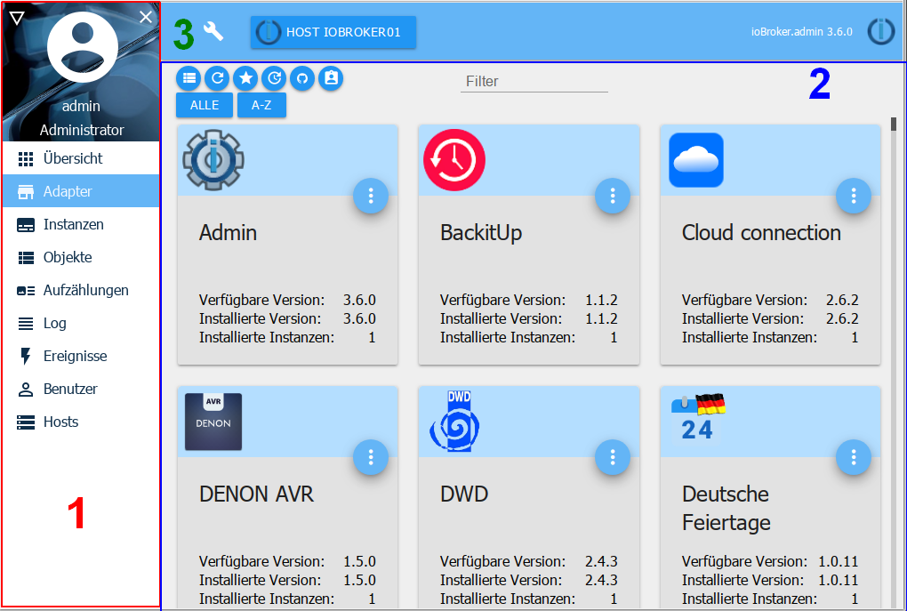
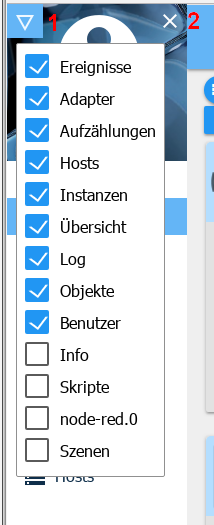

＃管理界面
！> **由于文档的大小，这只是一个概述，详细信息存储在通过部分标题链接到选项卡的页面中。请点击标题。**

Adapter Admin用于操作整个ioBroker安装。
他提供了一个Web界面。这在``<IP-Adresse des Servers>:8081``下调用。

在ioBroker的安装过程中直接创建此适配器，无需手动安装

适配器提供的GUI可以包括但不限于：检索以下函数：

*输入系统范围的设置
*安装其他适配器和实例
*访问实例的配置
*访问对象概述
*访问对象的状态概述
*访问用户和组的管理
*访问日志文件
*主持人的管理

适配器视图分为三个部分：

1. [菜单边栏]（＃菜单项）
2. [主窗口]（＃主窗口）
3. [系统设置]（＃系统设置）

##菜单项
菜单栏包含多个菜单项。在基本安装中，这些点显示如图所示。通过左上角的三角形图标（1），可以在安装其他适配器后添加或停用其他点以获得更好的概览。

带有选项卡的菜单栏可以通过** X **（2）隐藏，以在移动设备上腾出更多空间。

菜单栏可以通过“Burger icon”再次显示

##主窗口
主窗口显示所选菜单项的内容。

有关此内容的详细信息，请参见标题链接的页面。

### [调查](overview.md)
所有具有自己的Web界面的页面和有关主机的信息都显示在此处。

### [适配器](adapter.md)
此处显示和管理可用和已安装的适配器。

### [实例](instances.md)
此处列出了已通过“适配器”选项卡安装的实例，并可进行相应配置。

### [对象](objects.md)
托管对象通过适配器集成的设备的结构和数据点。这里可以创建和删除对象。使用“向上箭头”和“向下箭头”按钮，可以上载或下载整个对象结构。

如果值显示为红色，则接收方尚未确认它们（ack = false）。

### [枚举](enums.md)
这里列出了Homematic CCU的最爱，行业和房间。

### [日志](log.md)
这里显示日志

在Instances选项卡中，可以为各个实例设置要记录的日志级别。在选择菜单中，选择要显示的最小日志级别。如果发生错误，选项卡的标签将显示为红色。

### [活动](events.md)
状态更新列表。

### [用户](users.md)
此处可以创建用户并将其添加到现有组。

### [脚本](scripts.md)
在此页面上，您可以使用javascript，Blocly或Typescript创建自己的脚本。

### [主机](hosts.md)
有关安装ioBroker的计算机的信息。如果有新版本，则菜单栏中的此条目中会显示一条注释。

## [系统设置](settings.md)
在打开的菜单中，进行语言，时间和日期格式以及其他系统范围设置等设置。

也可以在此处设置存储库和安全设置。