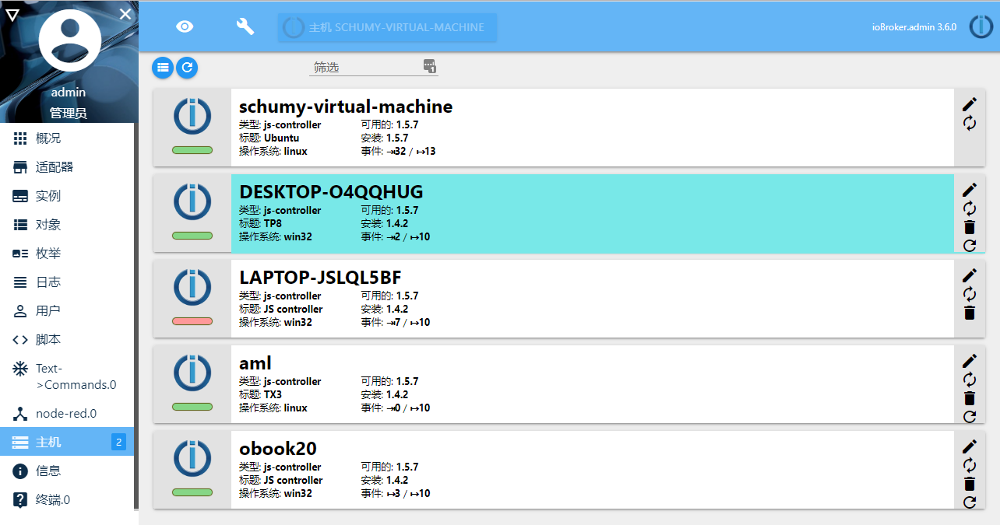
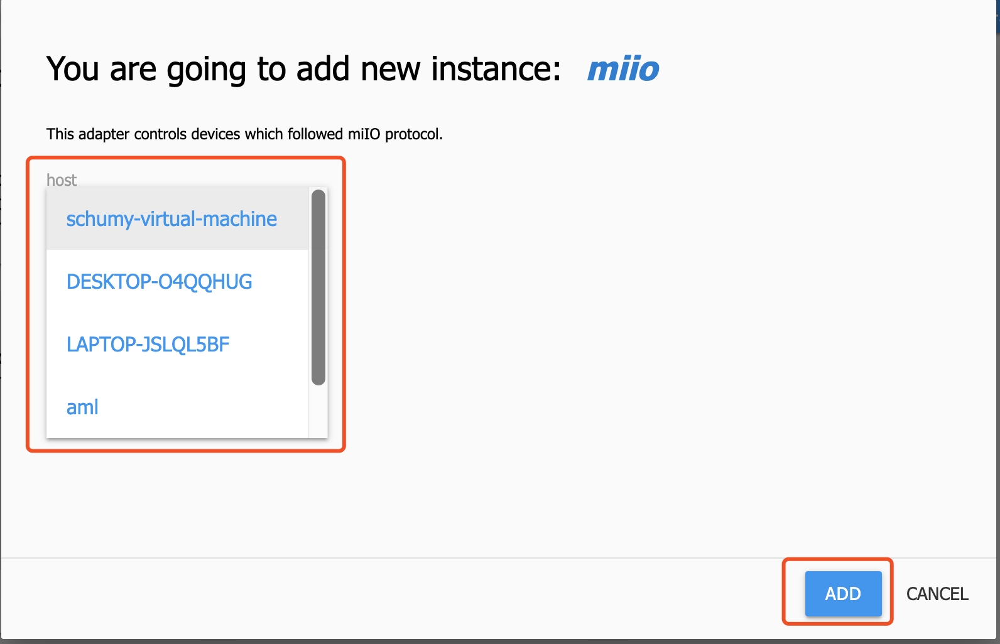
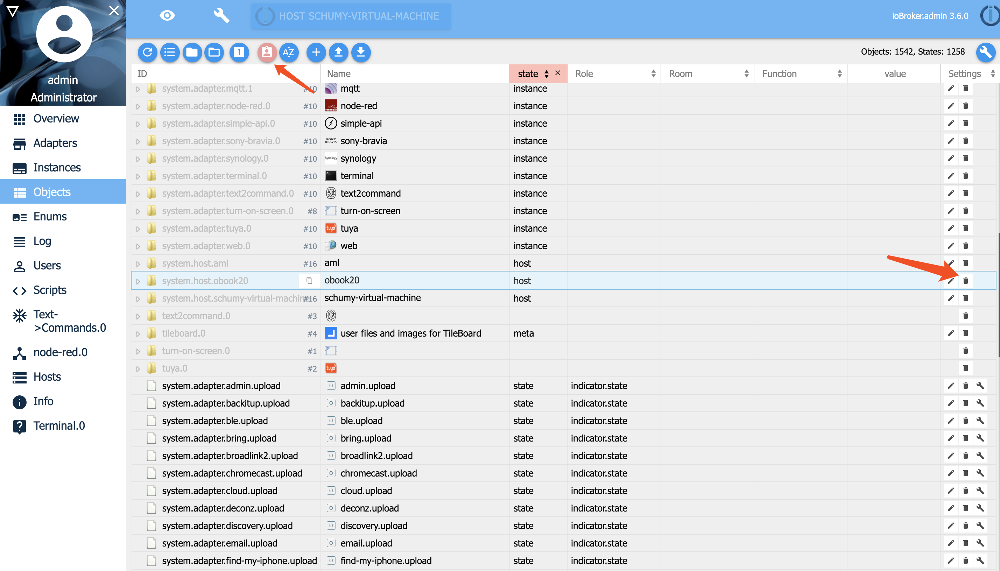

# 多主机模式

ioBroker可以同时处理几个运行在不同机器上的ioBroker服务。在这样的系统架构下，可以将工作量分摊到几个主机上，可以共享使用单板系统的系统硬件资源（比如树莓派的GPIO资源）。



## 配置方式

!> 组成多主机系统的每一个主机必须有一个**唯一不重复**的hostname。

多主机系统中，有一台主机是主系统，其他主机是从系统。无论是主系统还是从系统，首先都要在每一台主机上安装ioBroker。

!> **从系统**主机在配置后，**从系统**主机ioBroker数据将被**清除**。如果不是全新安装，请备份必要的数据。

### js-controller版本高于（包含）v1.1.3

在主系统主机上，安装完成ioBroker系统后，需要执行如下命令：

```bash
iobroker multihost enable

Miltihost activated.
Authentication activated.
Enter secret phrase for connection: # 输入从系统主机发起连接时需要输入的密码
Repeat secret phrase for connection: # 确认密码
Please restart ioBroker: "iobroker restart"


Miltihost:      enabled
Authentication: enabled
Objects:        file on 127.0.0.1
States:         file on 127.0.0.1

iobroker restart # 重启系统
```

在从系统主机上，安装完成ioBroker系统后，需要执行如下命令：

```bash
iobroker multihost browse # 扫描局域网内主系统主机，必须扫描到主机

1 |         192.168.1.9 |  host |         192.168.1.9 | "authentication required"

iobroker multihost connect

Please select host [1]: 1 # 选择主系统主机
Enter secret phrase for connection: ******* # 输入主系统enable时设置的密码
Config ok. Please restart ioBroker: "iobroker restart"

iobroker restart # 重启系统
```

至此，ioBroker多主机模式配置完成。

如果通过上述命令没有配置成功，请参考下面手动配置的方式。

### js_controller版本低于v1.1.3

在主系统主机上，安装完成ioBroker系统后，需要执行如下命令：

```bash
iobroker setup custom

Type of objects DB [file, couch, redis], default [file]: ENTER
Host of objects DB(file), default[127.0.0.1]: <0.0.0.0> # 这里需要修改
Port of objects DB(file), default[9001]: ENTER # 直接按回车确认
Type of states DB [file, redis], default [file]: ENTER # 直接按回车确认
Host of states DB (file), default[0.0.0.0]: ENTER # 直接按回车确认
Port of states DB (file), default[9000]: ENTER # 直接按回车确认
Host name of this machine [hostname]: ENTER # 直接按回车确认

iobroker restart # 重启ioBroker
```

在从系统主机上，安装完成ioBroker系统后，需要执行如下命令：

```bash
iobroker setup custom

Type of objects DB [file, couch, redis], default [file]: ENTER # 直接按回车确认
Host of objects DB(file), default[127.0.0.1]: <IP ADRESSE> # 主系统主机的IP地址
Port of objects DB(file), default[9001]: ENTER # 直接按回车确认
Type of states DB [file, redis], default [file]: ENTER # 直接按回车确认
Host of states DB (file), default[<IP ADRESSE>]: ENTER # 直接按回车确认
Port of states DB (file), default[9000]: ENTER # 直接按回车确认
Host name of this machine [hostname]: ENTER # 直接按回车确认

iobroker restart # 重启ioBroker
```

至此，ioBroker多主机模式配置完成。

## 安装适配器实例

如果是新安装的系统，在安装适配器时，仅需要在下拉菜单中指定需要安装的主机hostname，然后确认安装适配器即可。



如果是之前已经在使用的系统，在已经安装好的实例列表中按需改变运行实例的主机hostname即可。


## 删除主机

仅可以删除**从系统**主机。

首先要将从系统主机的ioBroker系统停止。
然后在管理员-主机页面上，点击需要删除的从系统主机列表右侧的删除图标完成主机的删除操作。


