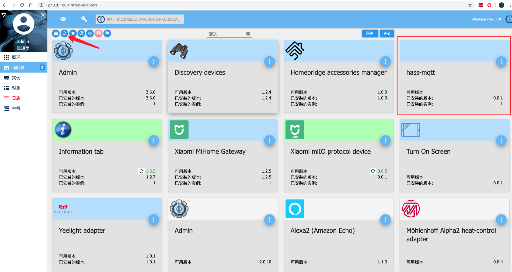
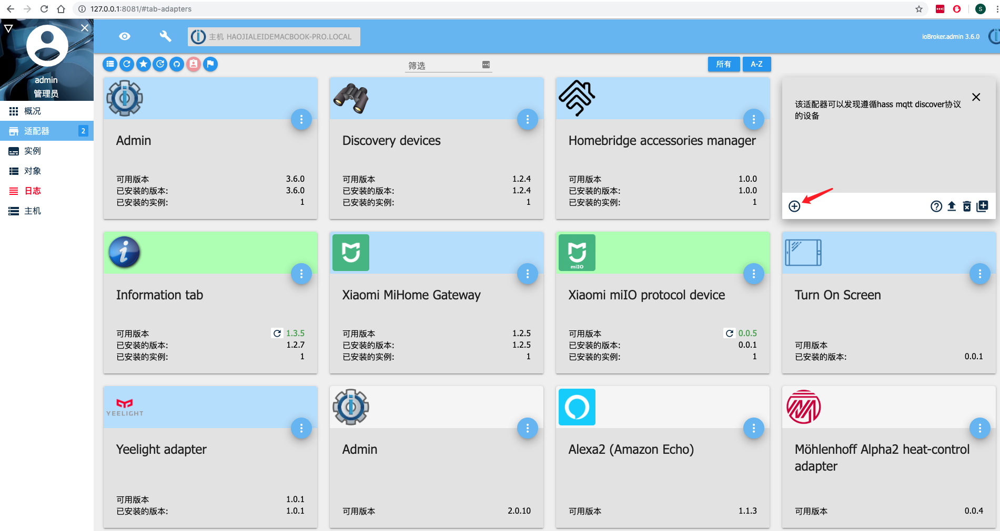
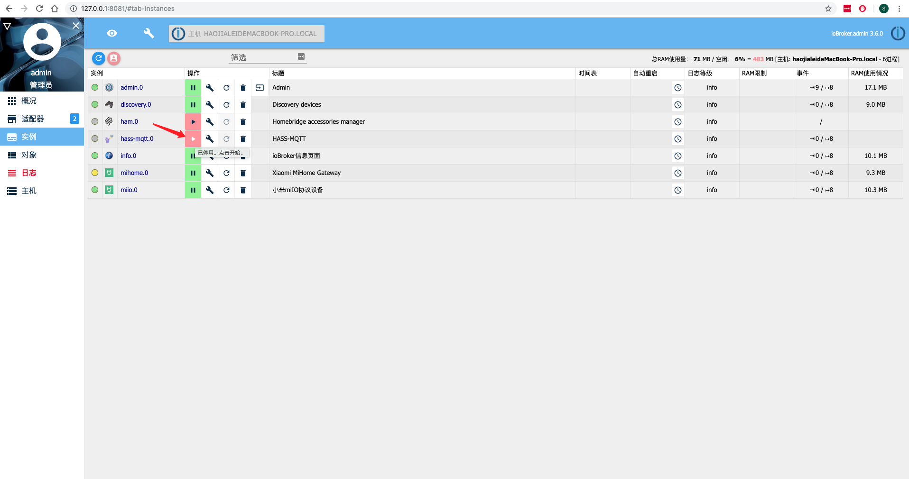

# VS code

此文档将以iobroker.hass-mqtt适配器为例，介绍如何使用Microsoft Visual Studio Code（VSCode）进行ioBroker适配器开发。

!> 欢迎对文档内容进行更正，添加和修改！

此文档希望能够指导没有任何使用VSCode进行node.js开发经验的用户部署适配器开发环境。如果文档中介绍的流程需要改进，欢迎提出您的建议。

遇到问题：如果您按照文档部署仍然遇到了问题，需要更多的帮助和更详细的信息，那么请您在Github上提交一个issue，这样将有助于补充和完善此文档。

此文档示例的适配器名是**iobroker.hass-mqtt**。

## 开发环境

- 在本机安装ioBroker
- ioBroker.js-controller版本：1.4.2
- node.js版本：v8.12.0
- npm版本：6.8.0
- MacOS
- VSCode版本：1.33.0

## 相关链接

通过以下链接，可以获得适配器开发所需要的基础知识和使用VSCode调试的基础知识。

- [ioBroker论坛：使用VSCode调试适配器](http://forum.iobroker.net/viewtopic.php?f=20&t=4564&p=61310&hilit=visual+studio+code#p44156)
- [Github上的ioBroker适配器模板](https://github.com/ioBroker/ioBroker.template#iobrokertemplate)
- 适配器开发的基础知识（德语）：[ioBroker适配器开发会议纪要2017.pdf](http://forum.iobroker.net/download/file.php?id=11259)——作者[Apoon77](http://forum.iobroker.net/memberlist.php?mode=viewprofile&u=378)。
- [ioBroker适配器开发文档](https://github.com/ioBroker/ioBroker/wiki/Adapter-Development-Documentation)
- [使用Webstrom IDE开发适配器](https://github.com/ioBroker/ioBroker/wiki/Installation,-setup-and-first-steps-with-an-ioBroker-Development-Environment)

## 搭建开发环境的流程

此小节使用ioBroker提供的适配器创建工具[create-adapter](https://github.com/ioBroker/create-adapter)创建适配器。

### 1. 新建适配器文件夹

- 在本地创建一个以适配器名称命名的文件夹，此教程以**iobroker.hass-mqtt**为例。

### 2. 在文件夹中使用create-adapter创建适配器

- 使用终端进入上一步创建的文件夹，并执行以下命令，交互式创建新的适配器。

```bash
npx @iobroker/create-adapter

npx: installed 173 in 15.336s

=====================================================
   Welcome to the ioBroker adapter creator v1.11.0!
=====================================================

You can cancel at any point by pressing Ctrl+C.

Let's get started with a few questions about your project!
✔ Please enter the name of your project: · hass-mqtt #输入适配器名称，只需要输入iobroker后面的字段。
✔ Which title should be shown in the admin UI? · hass-mqtt #输入在admin页面中显示的名称，可以与适配器名称不同
✔ Please enter a short description: · This adapter can discover devices followed hass mqtt discover protocol #输入对当前适配器的简单描述
✔ Enter some keywords (separated by commas) to describe your project: · mqtt,hass,homeassistant,discover #输入适配器的关键词

Nice! Let's get technical...
✔ Which features should your project contain? · adapter #选择adapter，创建一个新的adapter
✔ Which additional features should be available in the admin? · No items were selected #额外的功能，此处没有勾选
✔ Which category does your adapter fall into? · iot-systems #选择适配器的类型，此处选择iot-system
✔ When should the adapter be started? · daemon #选择适配器启动方式，此处选择自动启动
✔ Do you want to indicate the connection state? · yes #选择是否显示适配器连接状态，此处选择显示
✔ Which language do you want to use to code the adapter? · TypeScript #选择适配器开发语言，此处选择TypeScript
✔ Which of the following tools do you want to use? · TSLint #选择语法检查工具
✔ Do you prefer tab or space indentation? · Space (4) #选择缩进方式
✔ Do you prefer double or single quotes? · double #选择引号的风格
✔ How should the main adapter file be structured? · yes

Almost done! Just a few administrative details...
✔ Please enter your name (or nickname): · SchumyHao #你的名字
✔ What's your name/org on GitHub? · smarthomefans #github的名字或组织
✔ What's your email address? · schumyhaojl@126.com #你的邮箱
✔ Initialize the GitHub repo automatically? · yes #是否创建git repo
✔ Which license should be used for your project? · MIT License #选择开源协议

That's it. Please wait a minute while I get this working...
[1/4] Generating files...
[2/4] Installing dependencies...

> fsevents@1.2.7 install /Users/schumy/git/iobroker.hass-mqtt/node_modules/fsevents
> node install

node-pre-gyp WARN Using needle for node-pre-gyp https download 
[fsevents] Success: "/Users/schumy/git/iobroker.hass-mqtt/node_modules/fsevents/lib/binding/Release/node-v57-darwin-x64/fse.node" is installed via remote
added 565 packages from 1148 contributors and audited 8963 packages in 15.001s
found 0 vulnerabilities

[3/4] Compiling TypeScript...
[4/4] Initializing git repo...

All done! Have fun programming! ♥
```

### 3. 复制到ioBroker并调整路径和名称

- 将上述文件夹复制到ioBroker的**安装路径**中：以macOS为例，复制到`/usr/local/iobroker/node_modules`

### 4. ioBroker/Admin->更新

- 在管理员web界面点击“更新”按钮。您将看到刚刚新建的适配器。



### 5. 新建适配器实例

- 在管理员web界面点击“添加实例”按钮。



- 将新建的适配器实例停止。



### 6. 在VSCode中打开ioBroker安装路径下的适配器

- 使用VSCode打开复制到ioBroker的**安装路径**中的适配器文件夹。
- 现在，您可以开始开发和调试适配器。

---

## 调试

### 1. VSCode中添加自定义launch.json

- 点击VSCode编辑器调试页面上的顶部的齿轮按钮。


在launch.json增加被调试的适配器的设置：

```json
{
    // Use IntelliSense to learn about possible Node.js debug attributes.
    // Hover to view descriptions of existing attributes.
    // For more information, visit: https://go.microsoft.com/fwlink/?linkid=830387
    "version": "0.2.0",
    "configurations": [
        {
            "type": "node",
            "request": "launch",
            "name": "hass-mqtt", // 在debug界面显示的项目名称
            "program": "${workspaceFolder}/build/main.js" // 使用TypeScript编译出来的main.js路径
        },
        {
            "type": "node",
            "request": "attach",
            "name": "hass-mqtt-attach", // 在debug界面显示的项目名称
            "address": "127.0.0.1",     // 本地调试IP
            "port": 9229                // 本地调试端口
        }
    ]
}
```

- 如果需要**远程调试**，请将地址127.0.0.1调整为远程机器的IP地址。

### 2.）打开终端并启动调试器

- 打开VSCode集成终端
- 在终端中停止新安装的适配器

```bash
cd /usr/local/iobroker
iobroker stop hass-mqtt
```

- 在终端中调试启动适配器，其中**iobroker.hass-mqtt**是适配器的名称。

```bash
node --inspect-brk node_modules/iobroker.hass-mqtt/build/main.js --force --logs
```

- 在集成终端中将显示如下信息：

```bash
Debugger listening on ws://127.0.0.1:9229/a984ba41-0721-4a1d-a40b-7f32d1067ab7
For help see https://nodejs.org/en/docs/inspector
```

- 转到VSCode中的Debug，在Debugging下选择“hass-mqtt-attach”并启动


---

## Todo

- 将VSCode与Github一起使用
- 单独适配器上的示例
- 澄清：只能使用node.js> 6.x或4.x进行调试吗？

---

## 其他文档

### Visual Studio Code

- [VSCode基础知识](https://www.microsoft.com/technet/know-how/visual-studio-code-01-the-basics.aspx)

### Git＆Github

- [Git Book - Git Free Basic Guide](https://git-scm.com/book/en/v1)
- [Git for Windwos - 下载页面](https://git-scm.com/download/win)

---

## 一般提示和技巧

### SSH与Windows

- [Git for Windwos  - 下载页面](https://git-scm.com/download/win)安装bash，你可以在openSSH的帮助下使用ssh。
