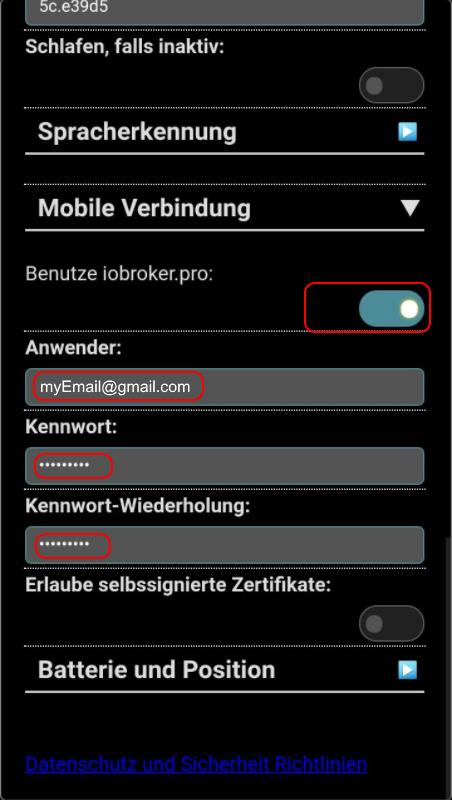
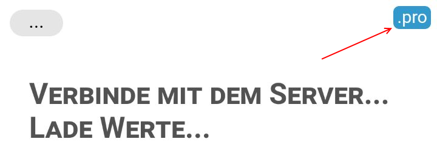

#vis App
作为Android应用程序的ioBroker平台的WEB可视化。

此应用程序专为智能手机和平板电脑。 vis项目和所有图像都存储在智能手机上以减少移动流量。

##使用
此应用程序需要已安装的已启用的Web适配器或socket-io适配器以及已安装的可用适配器。如果激活Web服务器，则必须激活内部套接字IO接口。
Vis中应该有一个项目，例如“主”。

必须可以从移动电话访问端口和ioBroker服务器。

该应用程序通过App Store安装。应用程序首次启动后，应自动打开设置对话框。要开始使用该应用程序，请打开设置。

要查看设置，请按左上角的半透明按钮。


##设置
除“WIFI Socket”和“Project”外，几乎所有设置都是可选的。

###按钮
 -  *重新加载*  - 重新加载Web引擎，就像您在浏览器中按“刷新”按钮一样。
 -  *重新同步*  - 如果对vis项目进行了一些更改，它将不会自动加载到应用程序中。为此，必须按下“重新同步”按钮。所有项目文件和图像都在智能手机上重新加载。这样做是为了减少移动流量并加快应用程序的启动。从内部SD卡读取文件比从ioBroker服务器读取文件要快得多。

如果激活选项* Sleep if inactive *，则在同步期间电话不能变为非活动状态，否则Socket.io连接将被中断并且同步将中止。

 - *OK* - 保存所有更改并重新启动WEB引擎。如果尚未定义项目，则不执行同步。要从ioBroker Vis项目重新加载更改，请使用“重新同步”按钮。
 -  *取消*  - 放弃所有更改并关闭对话框。

###连接
该应用程序可以使用SSID名称来检测智能手机是在家庭网络上还是在家庭网络外部，并使用不同的套接字URL和登录数据用于家庭网络和外部。

通常，家庭网络中没有身份验证，并且通过HTTP（不安全）建立连接。在外部网络中，连接是通过https（加密）和登录/密码进行的。

 -  *已连接*  - 表示应用程序是否已连接到ioBroker Server。

WiFi连接

 -  * SSID名称*  - 家庭网络SSID的名称（除以逗号）。连接使用家庭网络登录和主页URL。
 - *接字URL* - 诸如的URL。 ```的Http：//192.168.0.5：8082```。在开头使用http或https非常重要，因此应用程序可以区分安全和不安全的连接。港口也很重要。通常8082用于* Web *8084用于* socketio*
 - *User* - 如果为套接字通信启用了身份验证，请在此处输入iobroker的用户名。首先必须通过“admin”界面创建用户。用户“admin”始终存在且无法删除。
 -  *密码*  - 在ioBroker中设置的用户密码
 -  *密码重复*  - 重复用户密码

仅当指定了某个SSID且设备当前位于此SSID之外时，以下设置才有效。
移动连接

 - *接字URL* - 与* WIFI套接字*相同，但在家庭网络外使用。
 -  *用户*  - 与* WIFI用户*相同，但在家庭网络外使用。
 -  *密码*  - 与* WIFI密码*相同，但在家庭网络外使用。
 -  *密码重复*  - 与*重复WIFI密码*相同，但在家庭网络外使用。

###项目名称和语言设置
 -  *语言/语言*  - 设置对话框的语言。支持英语，德语和俄语。要激活更改，请按* OK *键。
 - *Project* - ioBroker的项目名称。如果未显示任何项目名称，则表明没有与iobroker的连接或没有项目存在。

###其他设置
 - *换URL* - 如果您的vis项目使用来自本地网络URL（与ioBroker URL不同）的图像的链接，您可以在此处指定此URL，并且vis项目中使用的所有图像都将来自此服务器智能手机加载。
 - *Instance* - 此VIS的唯一实例ID。这是仅将特定命令发送到此Vis实例所必需的。 （有关详细信息，请参阅[控制界面]（＃control-interface））
 -  *在后台睡眠*  - 如果未显示Vis App（但在后台运行），则可以停止与iobroker服务器的通信。在这种情况下，即使应用程序在后台运行，ioBroker状态更新和命令也不会传输到应用程序。
 -  *始终从服务器加载所有内容*  - 不要在手机上保存文件，并始终从服务器读取所有内容

###语音识别
您可以在应用程序中启用语音识别。启用后，应用程序将不断尝试检测命令。要确定您是否与应用或其他人通话，可以设置关键字。
请选择一个可以很好识别并且不会在日常使用中使用的单词。

text2command适配器用于检测已识别文本中的命令。请在[github]（https://github.com/ioBroker/ioBroker.text2command）或（iobroker.net）[http://iobroker.net]上阅读此适配器的说明。
当然，必须安装text2command适配器的实例。

*注意*：在这种情况下，如果未启用离线语音识别，则所有语音都将发送到Google服务器。激活说明可以在这里找到：（http://stackandroid.com/tutorial/how-to ... n-android /）。

*注意*：在检测模式下，每隔10-15秒“发出哔”声。对于抑制，音量设置为0。您仍然可以使用“Text2Speech”来说出命令和句子或开始播放音频。

 -  *语音识别激活*  - 激活或停用语音识别。
 -  *关键字*  - 如果在识别的句子中找到该单词（或短语），则该文本将被发送到“text2command”实例。没有必要在句子的开头使用关键字。如果省略关键字，则将所有单词发送到text2command实例。
 - *Text2command instance* - text2command实例的编号。通常为0。
 -  *音量*  - 答案和文字转语音命令的音量。否则，音量设置为0。
 -  *标准房间*  - 如果您的移动设备安装在某个房间，例如在卧室里，没有必要每次都说“打开卧室里的灯”。它应该足以说“打开灯”。要启用此功能，可以定义默认房间名称。如果text2command在集合中找不到房间名称，则标准房间名称将用于命令执行。
 -  *通过TTS回复*  - 如果激活，text2命令的响应通过文本转语音引擎输出。当然，必须在Android设备上安装并激活TTS引擎。

###电池和位置
有一种方法可以告诉服务器位置和电池状态。

 -  *设备名称*  - 设备名称用于在服务器上生成状态（见下文）。
 -  *报告电池状态*  - 指定是否应将电池状态报告给服务器。仅报告电池电量或电池连接状态的变化;没有周期性的更新。
 -  *发送位置间隔（以秒为单位）*  - 指定是否应将项目报告给服务器。该位置在变化之后和周期性地传输。要完成位置消息，请将间隔设置为零（例如，出于节能原因）。
 -  *高精度位置*  - 指定是否必须以高精度完成位置。高精度会导致能耗增加。

启用电池状态消息时会生成以下条件：

 -  vis.0。<设备名称> .battery.level  - 电池充电状态百分比。
 -  vis.0。<device name> .battery.isPlugged  - 表示设备是否连接到主电源作为布尔值。

当电池电量水平变化至少1％或设备连接或断开时，电池状态会更新。

当位置的发送间隔不为零时，将生成以下状态：

 -  vis.0。<device name> .coords.latitude  - 纬度为十进制值。
 -  vis.0。<device name> .coords.longitude  - 经度作为十进制值。
 -  vis.0。<设备名称> .coords.accuracy  - 纬度和经度的精确度，以米为单位。

并非所有设备都提供以下状态：

 -  vis.0。<device name> .coords.altitude  - 参考椭球上方位置的高度，以米为单位。
 -  vis.0。<设备名称> .coords.altitudeAccuracy  - 以米为单位的海拔高度的准确度。
 -  vis.0。<设备名称> .coords.heading  - 相对于地理北极的顺时针方向的移动方向（以度为单位）。
 -  vis.0。<设备名称> .coords.speed  - 设备的当前速度，单位为m / s。
 -  vis.0。<设备名称> .coords.speedKm  - 设备的当前速度，单位为km / h。

###可视化和行为
 -  *方向*  - 视图的方向：** auto **，** landscape **或** portrait **。选择** auto **时，会自动检测方向。
 -  *防止睡眠模式*  - 启用后，本机将永远不会进入睡眠模式，显示屏将始终保持开启状态。 （不适用于所有设备）
 -  *允许窗口位移*  - 如果启用，则允许平移和缩放视图。
 -  *全屏*  - 在带有软件按钮的设备上使用全屏模式（主页，设置，返回）。
 -  *缩放级别纵向*  - 纵向模式下放大百分比。不要设置得太低，否则无法再调出设置对话框。默认值为100％，不能设置为低于20％。
 -  *缩放级别横向*  - 与横向视图的*缩放级别纵向*相同。

###访问图像和其他资源
在同步期间，应用程序将所选项目的视图和所有引用的图像本地复制到移动电话（设备存储器）。
复制以下内容：

 - 所选项目目录中的所有文件，文件扩展名为```.png .jpg .jpeg .gif```
 - 所有带有文件扩展名为```.png .jpg .jpeg .gif```的图像，以及扩展名为```.wav .mp3 .bmp .svg```的文件，可在[iobroker数据目录下的适配器目录中找到] / files /在视图中指定，并在[iobroker数据目录] / files / a“。”下的第一个子目录中指定。在目录名称中。

要使应用程序正确替换路径，必须使用绝对本地路径指定文件（例如，/ vis.0 / main / img / test.png）。不支持相对路径。如果路径嵌入HTML中的小部件中，则拼写必须完全符合以下模式```... src='/vis.0/main...'```或```... src="/vis.0/main..."```。其他拼写无法识别。
此外，可以在设置中指定*替换URL *。这是VIS Web服务器的外部URL。所有以指定字符串开头的URL也被视为本地文件（例如，```https://[meine Domain]/visweb```）。

在运行时替换路径目前仅限于以下小部件：

 - 基本字符串（未转义）
 - 基本字符串src
 - 基本的json表

由于这些值直到运行时才会传输，因此只有文件位于项目目录中或已由静态配置的窗口小部件引用时，文件才可在本地使用。没有重新加载丢失的图片。

作为单独适配器提供的图标集不是应用程序的一部分，但在视图中引用文件时也会复制它们。

如果在具有以http：//或https：//开头的完整路径的视图中指定了其他资源，则可以在应用程序中访问这些资源。在同步期间，这些文件不会在设备上本地加载，但仅在直接从相应服务器显示视图时才会加载。
如果通过http身份验证来保护对文件的访问，则可以在URL中以下列形式嵌入凭据：

```https://[username]:[password]@[meine Domain]/vis.0/main/...```

###使用VIS以外的适配器的Web模块
除VIS之外的其他适配器可以提供Web内容。这些内容可以显示在iFrame中的VIS视图中。这特别适用于两个适配器Flot和Rickshaw Charts。

目前，只有以下适配器的客户端组件与应用程序集成：

 -  Flot
 - 人力车

为了使用本地版本的Flot，iFrame的源必须以```/flot/index.html?```开头。

其他内容以及其他服务器的内容，例如也可以使用适当服务器的完整URL查看网络摄像头。

###退出应用
该应用可以通过主页按钮在Android上照常保留。然而，在这种情况下，它继续在后台运行并继续消耗数据量和电池。使用选项*睡眠如果不活动*可以减少消耗。但是，在这种情况下，每次应用程序变为非活动状态时，Socket.io连接都将被中断。
也可以通过快速按两次退格键来关闭应用程序。在这种情况下，应用程序完全关闭。
此外，该应用程序提供了一种完全完成此操作的方法。为此，将在视图中插入基本静态链接窗口小部件，其中包含以下文本作为链接：```javascript:logout ()```

下面是一个导入VIS的相应小部件：

```
[{"tpl":"tplIconLink","data":{"href":"javascript:logout ();","target":"_self","text":"","views":null,"src":"/icons-material-png/action/ic_exit_to_app_black_48dp.png","name":"","class":""},"style":{"left":"10px","top":"10px","z-index":"106","background":"none","border-style":"none","color":"#000000","font-family":"Arial, Helvetica, sans-serif","font-size":"large","letter-spacing":"","font-weight":"bold","width":"34px","height":"32px"},"widgetSet":"jqui"}]
```

或者与vis> 0.10.6

```
[{"tpl":"tplHtmlLogout","data":{"html":"<button>Schließen</button>","in_app_close":true},"style":{"left":"10px","top":"10px"},"widgetSet":"basic"}]
```

##自定义应用自定义
本节中描述的更改适用于进行这些更改的高级用户，风险自负。

这些更改仅通过Javascript或VIS中项目文件中的调整进行。如果应用由于更改不正确而无法运行，则可以通过删除Android系统设置中的应用程序数据来删除本地项目文件，并且可以重置应用程序。

###隐藏菜单按钮
该应用程序在左上角显示一个带有三个点的透明开关，以访问设置页面。

如果在VIS编辑器中的**脚本**下输入以下行，则只要加载了应用程序中的视图，就会隐藏该区域：

```
// Menu ausblenden
if (typeof app !== 'undefined') $('#cordova_menu').hide();
```

要进入设置页面，请在启动应用程序后立即按下按钮，只要显示开关即可。或者，可以在视图中放置单独的窗口小部件以调用设置页面。

###自己的菜单按钮
在应用程序中查看视图时，以下小部件将显示设置页面：

```
[{"tpl":"tplIconLink","data":{"href":"javascript:$('#cordova_menu').trigger('click');","target":"_self","text":"","src":"/icons-material-svg/action/ic_build_48px.svg","name":"","gestures-swiping-delta":"-1","class":""},"style":{"left":"1087px","top":"761px","z-index":"106","background":"none","border-style":"none","color":"#000000","font-family":"Arial, Helvetica, sans-serif","font-size":"large","letter-spacing":"","font-weight":"bold","width":"29px","height":"28px"},"widgetSet":"jqui"}]
```

###在当前视图上通过水平滑动查看更改（滑动）
在**脚本**下的VIS编辑器中输入以下JavaScript，并且在数组中，您必须按照更改的顺序输入您自己的视图。

从右到左滑动视图会更改为阵列中当前视图后面的视图。
从左到右滑动视图会切换到阵列中当前视图前面的视图。
到达数组或开始的结尾时，将恢复第一个或最后一个条目。

```
var viewOrder = ['View 1','View 2','View 3','View 4','View 5','View 6'];

$(document).on('swipe', function (event){

  event.preventDefault();
  if (event.originalEvent.touch.delta.x < -200 && event.originalEvent.touch.delta.y > -30 && event.originalEvent.touch.delta.y < 30) {
    if (viewOrder.indexOf(vis.activeView) < viewOrder.length - 2)
      vis.changeView(viewOrder[viewOrder.indexOf(vis.activeView) + 1]);
     else
      vis.changeView(viewOrder[0]);
  } else
  if (event.originalEvent.touch.delta.x > 200 && event.originalEvent.touch.delta.y > -30 && event.originalEvent.touch.delta.y < 30) {
    if (viewOrder.indexOf(vis.activeView) > 0)
      vis.changeView(viewOrder[viewOrder.indexOf(vis.activeView) - 1]);
     else
      vis.changeView(viewOrder[viewOrder.length - 1]);
   }
});

```

重要的是从画笔笔划开始不在小部件上，但如果可能的话，在背景上开始，以免意外触发更改。

将### app与ioBroker.pro云一起使用
您可以通过iobroker.pro云连接到您的家。为此，必须执行以下操作：

1.配置WiFi连接。


输入您的家庭SSID名称，看看您是否在家。
您只需单击“<=”，当前的SSID将自动插入相应的字段中。

根据SSID名称，应用程序确定是否必须将本地连接（最后一个映像中的套接字URL）或iobroker.pro用作连接路径。

2.您必须在“单元连接”部分输入您的ioBroker.pro凭据：



选中“使用iobroker.pro”复选框，然后在ioBroker.pro服务上输入您的用户名（电子邮件）和密码。

之后，当您通过iobroker.pro连接时，在通过iobroker.pro云连接时，您会在前10秒看到右上角的小图标。



##控制界面
Vis创建3个变量：

 -  Control.instance  - 如果每个浏览器都应该被控制，这里写入浏览器实例或FFFFFFFF。
 -  Control.data  - 命令的参数。请参阅特殊命令说明。
 -  Control.command  - 命令名称。如果写入此变量，则触发该命令。也就是说，在写入命令之前，必须用数据填充“实例”和“数据”。

命令：

*警报 - 在Vis中显示警报窗口。 “Control.data”的格式为“message，title，jquery icon”。 Title和jquery图标是可选的。你会发现图标名称[这里]（http://jqueryui.com/themeroller/）。要显示图标“ui-icon-info”，请写“``Message ;; info```。
*更改 - 切换到所需的视图。视图的名称必须位于“Control.data”中。您还可以将项目名称设置为“项目/视图”。默认项目是“主要”。
*刷新 - 重新加载Vis，例如在项目修改后。
*重新加载 - 与刷新相同。
*显示对话框。对话框必须存在于视图中。对话，例如：

 - “静态HTML对话框”，
 - “静态 - 图标 - 对话”，
 - “容器 -  HTML  -  jqui对话视图”，
 - “container  -  ext cmd  -  jqui对话中的视图”，
 - “容器 - 图标 - 在jqui对话中查看”，
 - “容器 - 按钮 - 在jqui对话中查看”。

“Control.data”必须具有对话框小部件的ID，例如“W00056”。

*弹出 - 打开一个新的浏览器窗口。该链接必须位于“control.data”中，例如http://google.com
* Playsound  - 播放声音文件。该文件的链接在“control.data”中指定，例如http://www.modular-planet.de/fx/marsians/Marsiansrev.mp3

您可以在Vis中加载自己的文件，然后播放它，例如“/vis.0/main/img/myFile.mp3”。

* Tts  - 文本2语音*数据*  - 要说出的现有短语。

当用户更改视图或启动时，变量将由Vis填充

 - “Control.instance”：浏览器实例和ack = true
 - “Control.data”：以“项目/视图”的形式显示项目和显示名称，例如“Main / view”（和ack = true）
 - “Control.command”：“changedView”和ack = true

您可以在control.command中将JSON字符串或对象编写为```{instance: 'AABBCCDD', command: 'cmd', data: 'ddd'}```。在这种情况下，实例和数据取自JSON对象。

使用javascript适配器中的命令，您可以启用Android的文本到语音引擎：

```SetState ( 'vis.0.control.command', '{" Beispiel ":" * "," Daten ":" etwas sagen "," Befehl ":" tts "}');```