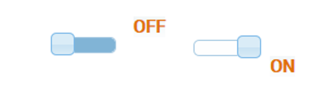

#Fancyswitch
该集代表了一些大致相同的交换机。
它们代表布尔状态，也可以切换它们。

|小工具|图片|说明|
|------------------------|-------|--------------|
|关闭/打开灯| |浅灰色摇臂开关|
|打开/关闭黑暗| |带有'on'/'off'标签的滑块|
|滑块暗/关| |带有'off'/'on'标签的滑块|
|摇杆暗/关| ![开关]（media / fancyswitch-5.png）！[开关](../../de/viz/media/fancyswitch-6.png)|带有'off'/'on'标签的黑色摇杆开关;也可选择灯光风格 |
| Giva Labs iButton | |带有'on'/'off'标签的白色滑块|
| Taitem jqui Toggleswitch | |滑块外的“on”/“off”标签的白色滑块 |
| Taitem jqui Toggleswitch | ！[转]（媒体/ fancyswitch_taitem.png）|滑块外的“on”/“off”标签的白色滑块 |

##属性描述
|属性|说明|主题|
|----|----|---|
| ObjectId |要显示的对象的ID，包含HTML | Switch，Slider，Slider，Rocker |
|反转|反转开关状态|开关，滑块，滑块，摇杆|
|虚假值|状态为假/关闭/关闭的值|开关，滑块，滑块，摇杆|
|真值|状态为假/关闭/关闭的值|开关，滑块，滑块，摇杆|
|自动关闭|表示按钮功能：在设定的时间后，开关返回其原始状态|开关，滑块，滑块，摇杆|
|灯光风格|开关打火机显示|摇杆暗/开|
|杠杆尺寸|| Giva Labs iButton |
|容器尺寸|| Giva Labs iButton |
|拖动允许|切换可以拖动（不仅仅是按下）| Giva Labs iButton |
|动画|切换动画| Giva Labs iButton |
|转换|数据点延迟| Giva Labs iButton |
|高亮显示开关|开关的滑动区域也以彩色显示| Taitem jqui Toggleswitch |
| Widget宽度|开关的宽度，无论标题如何| Taitem jqui Toggleswitch |
| Prepend html | HTML代码显示在对象前面| Taitem jqui Toggleswitch |
|追加HTML | HTML代码显示在对象之后| Taitem jqui Toggleswitch |

**示例：**