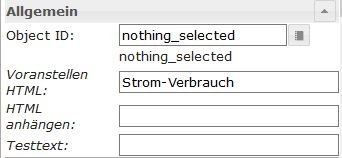
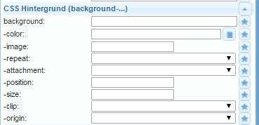
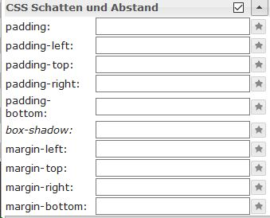

＃小部件
＃＃ 作为基本规则
在这种情况下，小部件（“设备，事物”）是显示元素，它们以各种方式显示数字，文本，图像或图表，并提供了进行交互的机会。

## IoBroker.vis小部件
带有Vi的ioBroker中有多种用于可视化的小部件集。

-------------------------------------------------------------------------------
-------------------------------------------------------------------------------

###小部件的基本设置
＃＃＃＃ 作为基本规则

|属性|描述|
|-----|----|

|名称|此小部件的唯一名称可以在此处输入|评论|简短描述可以在这里输入| CSS类|：构造：|过滤词|：构造：| |在视图中显示|在这里，您可以选择此窗口小部件只应显示在当前视图中还是应显示在多个视图中。
|无效（锁定）|：结构：

#### **可见度**
可以使小部件的可见性取决于数据点的状态。

|属性|描述|
|----|----|

| `Object ID`|输入数据点的ID，该数据点将控制所选小部件的可见性。可以使用按钮搜索数据点。
|条件|如果在此处为上述数据点输入了条件，则该窗口小部件可见。
|条件| ...的值对应于此处输入的值。

＃＃＃＃ **一般来说**
“常规”部分特定于每个窗口小部件，并针对各个窗口小部件进行了更详细的描述。
在此部分中，将所需的数据点分配给“对象ID”字段中的窗口小部件。

***小部件的** CSS设置**可以在以下菜单项中找到，并且可以根据自己的要求进行调整：

#### **一般的CSS **

|属性|描述|
|-----|----|

| `left`|与视图左边缘的距离| `top`|距视图顶部的距离| `width`|小部件的宽度| `height`|小部件的高度| `z-index`|指定窗口小部件所在的级别（0 =背景，正值=值越大，越靠前）| `overflow-y`|

| `overflow-y` |
| `opacity`|透明度（0 =不透明->图像不可见.. 1 =透明->图像可见） |

#### CSS字体和文本

|属性|描述|
|-----|----|

| `color`|字体颜色（通过选择对话框或通过颜色代码）| `text-align`|文本对齐（左，右，居中）| `text-shadow`|文本阴影的颜色| `font-family`|字体| `font-style`|字符集类型（普通，斜体，斜线，首字母，继承）| `font-variant`|字符集变体（普通，小写……）| `font-weight`|字符集强度| `font-size`|字体大小| `line-height`|行距| `letter-spacing`|字符间距| `word-spacing`|字间距

#### ** CSS背景**

|属性|说明|
|-----|-----|

| `background`|可以在此处一起指定以下几个属性| `-color`|背景颜色| `-image`|背景图片| `-repeat`|指定是否在元素的整个宽度和/或高度上重复背景。
| `-attachement`| |指定背景图像是固定的还是在滚动时被移动| `-position`|背景图像的对齐（https://www.w3schools.com/cssref/pr_background-position.asp）| `-size`|背景图片的大小| `-clip`|控制与边框的重叠| `-origin`|图像坐标的坐标系原点

#### ** CSS边框**

|属性|描述|
|----|----|
|`-width`|边框的粗细| |
|`-color`|边框的颜色|
|`-radius`|边界的拐角半径；最多只能是小部件的较短距离的一半|
|`-radius` |边界的拐角半径；最多只能是小部件的较短距离的一半|

|属性|描述|
|-----|----|

| `-width`|边框的粗细| `-style`|边框的线型| `-color`|边框的颜色| `-radius`|边界的拐角半径；最多只能是小部件的较短距离的一半

#### CSS阴影和空间

|属性|描述|
|----|----|
|`padding`|从小部件框的边缘偏移|
|`padding-top`|上侧偏移|
|`padding-right`|右侧偏移|
|`padding-bottom`|下侧偏移|
|`box-shadow`|小部件框阴影的颜色|
|`margin-top`|小部件周围的上边距（自动，％，px，pt，cm）|
|`margin-right`|小部件周围的右边框|
|`margin-bottom`|小部件周围的下边框|
|`margin-left`|小部件周围的左边距|
|`margin-left` |小部件的左边距|

|属性|描述|
|-----|----|

| `padding`|从小部件框的边缘偏移| `padding-left`|左侧偏移| `padding-top`|上侧偏移| `padding-right`|右侧偏移| `padding-bottom`|下侧偏移| `box-shadow`|小部件框阴影的颜色| `margin-top`|小部件周围的上边距（自动，％，px，pt，cm）| `margin-right`|小部件周围的右边框| `margin-bottom`|小部件周围的下边框| `margin-left`|小部件周围的左边距