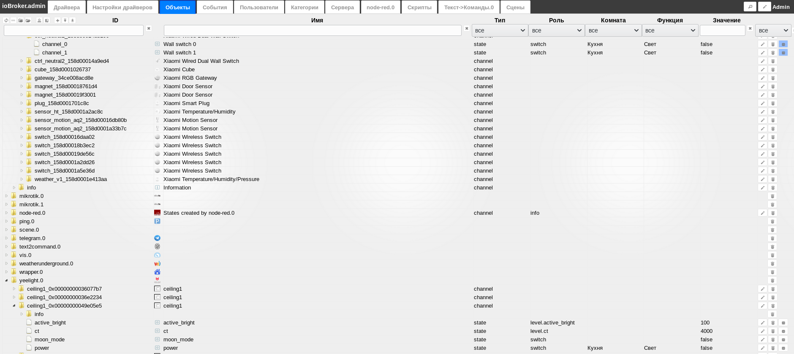
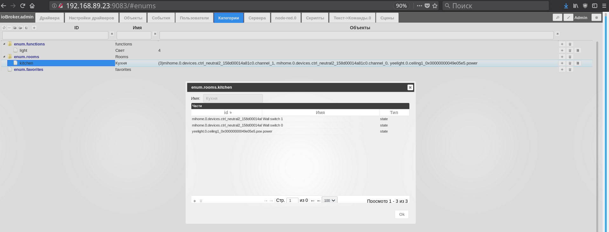

# What are categories of objects for?

## Material UI and Mobile UI
From categories, [mobile UI](https://github.com/ioBroker/ioBroker.mobile/blob/master/README.md) is automatically generated
and [Material UI](https://github.com/ioBroker/ioBroker.material/blob/master/README.md)

## Text2Command
Used in [text2command](https://github.com/ioBroker/ioBroker.text2command).

## Cloud (Alexa & Co)
Used when working in the driver [cloud](https://github.com/ioBroker/ioBroker.cloud) (smart speakers, iftt and stuff).

## How to setup

* In the categories: you need to create a third room from the template in the admin panel, and a light function from the template.
* In the objects, find the desired switch and from the template select the name of the created room and the function light.

## Where else can I read
You can read [here](https://github.com/ioBroker/ioBroker.text2command).