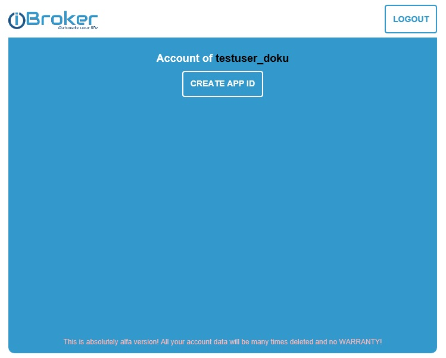
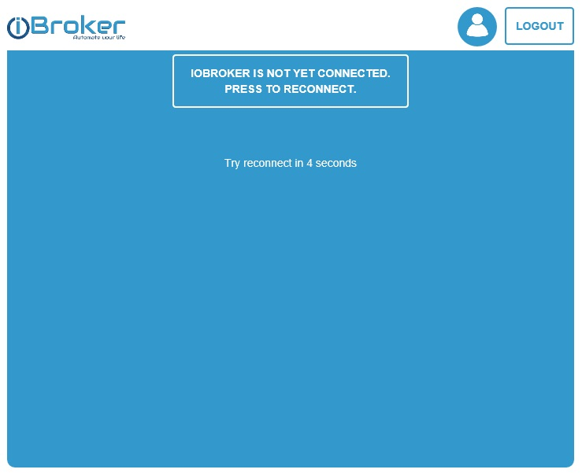

# ioBroker, Cloud-Adapter und Alexa

## Verbindung zwischen ioBroker und Alexa

Um ioBroker mit Alexa (Amazon Echo oder Echo Dot) zu verbinden, müssen folgende Voraussetzungen erfüllt sein:

*   ioBroker-Cloud-Account
*   App-ID innerhalb des Cloud-Accounts
*   Cloud-Adapter installiert und konfiguriert
*   ioBroker-Skill innerhalb von Alexa aktiviert
*   Verbindung zwischen ioBroker-Skill und der ioBroker-Cloud
*   Installierter web-Adapter (wird entweder von VIS mitinstalliert, oder ist separat zu installieren)

Aber wie funktioniert das Ganze eigentlich? Das haben wir hier mal für Euch zusammengefasst: [Funktionsweise](http://www.iobroker.net/?page_id=6028&lang=de)

## ioBroker-Cloud-Account und APP-ID erzeugen

Auf der Webseite [https://iobroker.net](https://iobroker.net) (Nicht http://**www**.iobroker.net !!!) einen Account anlegen: 
 

Oder, falls bereits ein Account existiert, sich über die Schaltfläche „Login“ anmelden. 

Achtung: Es hat sich gezeigt, das die Email-Adresse keine Großbuchstaben enthalten darf, 
da sie sonst nicht akzeptiert wird (Beispiel "ioBroker@domain.de" geht nicht, aber "iobroker@domain.de" geht). 

 

Durch Anklicken der Schaltfläche „Create APP ID“ wird dann eine eindeutige APP-ID erzeugt. 

 

Der API-Key (in diesem Fall "testuser_doku_165…") wird später im Cloud-Adapter benötigt – also besser notieren / kopieren!!! 

Durch Anklicken der Schaltfläche „Go to your applications“ kann man die Funktion überprüfen 

 

Sollte keine Auflistung der Views kommen und stattdessen folgende Meldung 

 

deutet dies darauf hin, dass

a) der Cloud-Adapter in ioBroker (noch) nicht installiert, konfiguriert oder  gestartet ist

b)  eine Firewall, o.ä. die Verbindung blockiert

## Alexa einrichten / konfigurieren

Gehe auf die Alexa-Webseite [http://alexa.amazon.de](http://alexa.amazon.de) und füge den iobroker-Skill hinzu. 

 

Wenn nun die Schaltfläche "Aktivieren" angeklickt wird, öffnet sich ein Fenster in dem die Anmeldedaten für die ioBroker-Cloud abgefragt werden. 

   

Nachdem die Verbindung zwischen dem iobroker-Skill und der ioBroker-Cloud erfolgreich hergestellt wurde, 
erscheint folgende Erfolgsmeldung 

Nun kann in Alexa im Bereich "Smart Home" nach Geräte gesucht werden.

## Cloud-Adapter in ioBroker installieren und konfigurieren

### Grundkonfiguration

Der Cloud-Adapter wird, wie alle anderen Adapter auch, installiert. 

### Einstellungen

*   In das Feld APP-KEY trägt man die kopierten App-ID aus der ioBroker.net-Webseite ein
*   Bei Instanz ist die gültige/richtige Instanz des Web-Adapters (i.d.R. web.0) auszuwählen
*   Cloud-URL ist vorausgefüllt und kann so gelassen werden
*   Die Auswahl der Zertifikate und der Sprache ist jedem selbst überlassen
*   Der Punkt „OFF level for switches“ kommt erst mit der (noch nicht freigegebenen) Version 0.4.1 des Cloud-Adapters zum Tragen und wird hier erst mal ignoriert

Die korrekte Funktion kann man dann wieder mit dem Aufruf der Webseite [https://iobroker.net](https://iobroker.net) und, 
nach der Anmeldung, durch das Anklicken des Buttons „Go to your applications“ testen (es muss die Auflistung erscheinen). 
Wenn diese Auflistung nicht kommt, stimmt etwas mit der Konfig, usw. nicht.

## Einbindung von Geräten (aus der CCU oder auch sonstiger Adapter)

### Automatische Übernahme aus der CCU

Wenn in der CCU die steuerbaren Geräte Räumen und Gewerken zugeordnet sind, werden diese nach folgendem Schema automatisch übernommen:

*   Die Räume der CCU werden in ioBroker unter enum.rooms (im Reiter Aufzählungen) aufgelistet
*   Die Gewerke der CCU werden in ioBroker unter enum.functions (im Reiter Aufzählungen) aufgelistet
*   Erst wenn ein Gerät beide Kriterien erfüllt, sich also in einem Raum aus "enum.rooms" 
und einem Gewerk aus "enum.functions" befindet, wird es automatisch zu Alexa hinzugefügt (und gruppiert).

_**Beispiel:** _ Raum = Wohnzimmer Gewerk = Licht 

   

Wenn im Wohnzimmer zwei mit HM steuerbare Lampen (in diesem Beispiel sind es sogar Dimmer) 
sind und diese auch dem Raum "Wohnzimmer" und dem Gewerk "Licht" zugeordnet sind, 
wird im Cloud-Adapter ein Gerät mit dem Namen "Wohnzimmer Licht" angelegt → Reiter „Smart Geräte“. 
Dieses Gerät beinhaltet dann alle steuerbaren Datenpunkte (On, Off, Level, usw.) der passenden Geräte. 

In Alexa wird genau dieses Gerät mit dem Namen "Wohnzimmer Licht" (mit einer Beschreibung "Gruppe Wohnzimmer Licht" 
angelegt. Es wird KEINE Alexa-Gruppe erzeugt, obwohl ja mehrere Geräte zugeordnet sind – 
für Alexa ist es genau ein Gerät und die „Gruppensteuerung“ erfolgt erst innerhalb von ioBroker. 

Wenn Du nun "Alexa, schalte Wohnzimmer Licht ein" sagst, wird durch Alexa genau 
dieses eine Gerät eingeschaltet, dieser Befehl über den Skill an die ioBroker-Cloud und von 
dort aus an den Cloud-Adapter weitergeben. Dieser schaltet dann wiederum alle zugehörigen Datenpunkte 
(in diesem Beispiel 4 Datenpunkte = 2 Dimmer) entsprechend des Befehls (Ein, Aus, x %, usw.). 
Die einzelnen Geräte (Dimmer im Beispiel) können so nicht gesteuert werden – sie wurden ja, 
bedingt durch die Zugehörigkeit zum Raum und zum Gewerk, zu einem Gerät zusammengefasst. 
Diese Funktion macht durchaus sinn, wenn man nur eine Lampe hat, oder immer alle gleichzeitig ein-/ausschalten 
will - dann macht ioBroker alles automatisch für einen. Will man gezielt steuern können, bringt diese Funktion nichts.

### Einzelne Geräte, ohne Gruppenbildung in ioBroker, steuern

Dafür nimmt alle Häkchen im Reiter „Smart Aufzählung“ im Cloud-Adapter raus und legt jedes Gerät 
(z.B. Lampen) einzeln im Cloud-Adapter an und gruppiert diese „echten“ einzelnen Geräte erst dann in Alexa. 
So kann man jede Lampe einzeln steuern, aber auch alle gleichzeitig (über die Gruppe in Alexa). 
Einzelne Geräte (Datenpunkte) im Cloud-Adapter: 

   

Diese Geräte dann in Alexa: 

   

Und die Gruppierung in Alexa 

## Weitere Tipps & Tricks

* * *

### Alexa - Generelle Funktionsweise

Wie funktioniert ioBroker und Alexa eigentlich? Dies kann hier nachgelesen werden : [Funktionsweise](http://www.iobroker.net/?page_id=6028&lang=de)

* * *

### ioBroker, Cloud-Adapter und Alexa – smartName

Manchmal kann es notwendig sein, einen ioBroker-Datenpunkt zum Cloud-Adapter (also zu Alexa) 
hinzu zu fügen, der sich über die Admin-Seite des Cloud-Adapters nicht hinzufügen lässt. 
Dies muss man dann manuell machen. [Hier geht es zur Anleitung.](http://www.iobroker.net/?page_id=5910&lang=de)

* * *

### ioBroker, Cloud-Adapter und Alexa – Raumnamen

Sollten die Raumnamen in ioBroker nicht denen entsprechen, die in der CCU hinterlegt wurden, kann man dies beheben : 
[Raumnamen passen nicht](http://www.iobroker.net/?page_id=6021&lang=de)

* * *

### Szenen aus dem Szenen-Adapter steuern

Wie steuert man mit Alexa Szenen, die mittels des Szenen-Adapters erstellt wurden. [Szenen steuern](http://www.iobroker.net/?page_id=6567&lang=de)