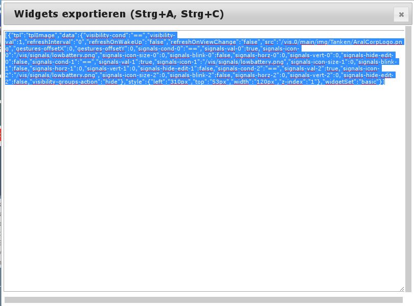
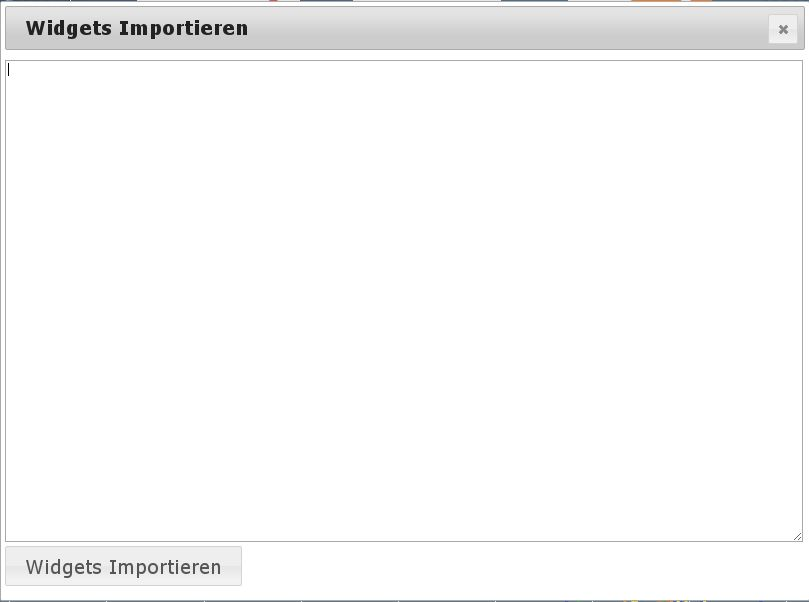

# Die Arbeitsfläche (16)

Hier werden die Widgets für den View positioniert. Dies kann mit der Maus oder den Pfeiltasten geschehen. Ist der Reiter Widgets aktiv, stehen auch einige Hilfen zur Ausrichtung zur Verfügung. In den Reitern über der Arbeitsfläche werden die bisher existierenden Views alphabetisch sortiert.  Sollten bereits sehr viele Views in diesem Projekt existieren muss ggf. mit den Pfeiltasten links und rechts gescrollt werden. Über diese Reiter können die zu bewarbeitenden Views genauso ausgewählt werden wie über das Pulldownmenü links oben.

* * *

## Arbeiten mit Views

### Pulldownmenü (7)

Hier kann man einen View zur Bearbeitung auswählen, bzw. der ausgewählte View wird hier angezeigt wenn man ihn über die Reiter über der Arbeitsfläche ausgewählt hat. 

### View hinzufügen (8)

Mit diesem Button kann ein neuer View hinzugefügt werden. 

   Im dem Fenster des ehemaligen Pulldownmenüs wird man aufgefordert einen neuen Namen einzugeben und anschließend den Vorgang über den Haken-Button abzuschließen oder mit dem ¢-Button abzubrechen. 

### View löschen (9)

Über diesen Button kann man nach vorheriger Sicherheitsabfrage den ausgewählten View löschen. 

### View umbenennen (10)

Durch Anklicken dieses Icons wird der bestehenden View umbenannt. 

   Das Namensfeld wird nun zum editieren geöffnet und man wird aufgefordert, einen neuen Namen einzugeben und anschließend den Vorgang über den Haken-Button abzuschließen oder mit dem ¢-Button abzubrechen. 

### View kopieren (11)

Durch Anklicken dieses Icons wird eine Kopie des bestehenden Views angelegt. 

   Das Namensfeld wird nun zum editieren geöffnet, dem ursprünglichen Namen ein "_new" angehängt und man wird aufgefordert, einen neuen Namen einzugeben und anschließend den Vorgang über den Haken-Button abzuschließen oder mit dem ¢-Button abzubrechen. 

### View exportieren (12)

Nach Anklicken dieses Buttons öffnet sich ein Fenster mit der Seitenbeschreibung des Views. 

 Diese Seitenbeschreibung kann als Textfile zur Sicherung benutzt werden (bitte keinen Windows-Editor benutzen, sondern z.B. Notepad++ im UNIX Modus) oder zum Import in andere Installationen.

### View importieren (13)

Hier kann man einen View aus einer anderen Installation oder eine Sicherung im Textformat wieder einspielen - es wird immer eine neue View erstellt. Es öffnet sich ein Fenster mit einem leeren Editorbereich. 

 In dieses Fenster wird der Inhalt des Exports kopiert, unten links im Feld _**Viewname**_ wird ein eindeutiger Name für die neue View eingegeben und anschließend der dann aktive Button _**View importieren**_ geklickt. Nach kurzer Zeit ist der neue View in der Installation vorhanden.

* * *

## Arbeiten mit Widgets

Wird der Reiter Widgets aktiviert ändert sich die darunterliegende Werkzeugleiste. Nach Anklicken eines Widgets wechselt die Ansicht in der Eigenschaften-Sidebar auf der rechten Seite auf den Reiter Widget und zeigt die Einstellungen für das ausgewählte Widget. Die Werkzeuge für die Bearbeitung von Widgets werden angezeigt

##### 

#### Pulldownmenü (1)

Hier kann man ein Widget zur Bearbeitung auswählen, bzw. das ausgewählte Widget wird hier angezeigt.

#### Widget löschen (2)

Mit Klick auf dieses Icon wird das ausgewählte (Bei Mehrfachauswahl alle ausgewählten) Widget nach Rückfrage gelöscht

#### Widget kopieren (3)

Nach dem Klick auf dieses icon ändert sich die Anzeige: 

 Im dem Fenster des ehemaligen Pulldownmenüs wird man aufgefordert den View einzugeben in den die Kopie des Widgets platziert werden soll und anschließend den Vorgang über den Haken-Button abzuschließen oder mit dem ¢-Button abzubrechen.

#### Widget-Informationen (4)

Wenn man auf diesen Button klickt, öffnet sich ein Fenster mit Informationen zu den Widgets. Wenn vorhanden ist der Eintrag zu dem ausgewählten Widget an oberster Stelle. 

#### Widgets ausrichten (5 - 14)

Wenn man mit gedrückter Maustaste mehrere Widgets auswählt (oder mit Ctrl-Klick) kann man anschließend mit Hilfe dieser Icons Gruppen ausrichten (linksbündig, rechtsbündig, oben bündig, unten bündig, zentriert, mittig vertikal ausgerichtet). Außerdem kann man mehrere Widgets mit gleichem Abstand (horizontal und vertikal) positionieren, sowie mit den letzten beiden Icons die Größe von mehreren Widgets anpassen. Wählt man ein Widget an, wechselt die Ansicht in der Eigenschaften-Sidebar auf der rechten Seite auf den Reiter Widget und zeigt die Einstellungen für dieses Widget. Mit der möglichen Mehrfachauswahl kann man über die rechte Sidebar die Eigenschaften mehrerer Widgets gleichzeitig verändern.

##### linksbündig (5)

Die ausgewählten Widgets werden an der linken Seite des am weitesten links liegenden Widgets vertikal ausgerichtet.

##### rechtsbündig (6)

Die ausgewählten Widgets werden an der rechten Seite des am weitesten rechts liegenden Widgets vertikal ausgerichtet.

##### oben (7)

Die ausgewählten Widgets werden an der oberen Kante des am weitesten oben liegenden Widgets horizontal ausgerichtet.

##### unten (8)

Die ausgewählten Widgets werden an der unteren Kante des am weitesten unten liegenden Widgets horizontal ausgerichtet.

##### vertikal zentrieren (9)

Die ausgewählten Widgets werden waagerecht so verschoben, dass sie vertikal zentriert ausgerichtet werden.

##### horizontal zentrieren (10)

Die ausgewählten Widgets werden senkrecht so verschoben, dass sie horizontal zentriert ausgerichtet werden.

##### horizontaler Abstand (11)

Die ausgewählten Widgets werden waagerecht so verschoben, dass sie horizontal zwischen den am weitesten links und rechts liegenden Widgets den gleichen Abstand haben.

##### vertikaler Abstand (12)

Die ausgewählten Widgets werden senkrecht so verschoben, dass sie vertikal zwischen den am weitesten oben und unten liegenden Widgets den gleichen Abstand haben.

##### gleiche Breite (13)

Die ausgewählten Widgets werden gemeinsam in der Breite verändert, dass alle Widgets die gleiche Breite haben. Bei mehreren unterschiedlichen Maßen kann man entsprechend oft klicken, und alle verfügbaren Maße werden nacheinander zur Verfügung gestellt.

##### gleiche Höhe (14)

Die ausgewählten Widgets werden gemeinsam in der Höhe verändert, dass alle Widgets die gleiche Höhe haben. Bei mehreren unterschiedlichen Maßen kann man entsprechend oft klicken, und alle verfügbaren Maße werden nacheinander zur Verfügung gestellt.

#### Alle Widgets (15 - 16)

Die beiden Widgets dienen der einfacheren Bearbeitung von Views. Das erste (15) sorgt dafür, dass die Werte der Widgets im Editor nicht aktualisiert werden, das zweite (16) verhindert das Verschieben von Widgets.

#### Widget exportieren (17)

Ist ein Widget aktiviert, kann man mit diesem Button das Widget exportieren. Nach Anklicken dieses Buttons öffnet sich ein Fenster mit der Seitenbeschreibung des Widgets. 

 Diese Seitenbeschreibung kann als Textfile zur Sicherung benutzt werden (bitte keinen Windows-Editor benutzen, sondern z.B. Notepad++ im UNIX Modus) oder zum Import in andere Installationen.

#### Widget importieren (18)

Umgekehrt kann man hier z.B. nicht im Umfang von vis enthaltene Widgets, aus einer anderen Installation oder eine Sicherung im Textformat wieder einspielen. Es öffnet sich ein Fenster mit einem leeren Editorbereich. 

 In dieses Fenster wird der Inhalt des Exports kopiert und anschließend der Button _**Widgets**** importieren**_ geklickt.