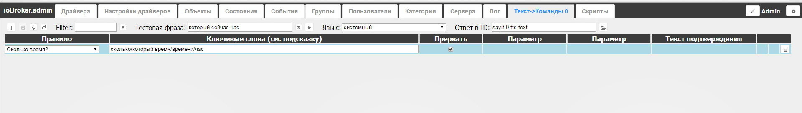

##   Description

Adapter **text2command **(Text to command) is used for analyzing of received textual information and command implementation according to a defined in advance a set of rules. Installation and configuration of this adapter doesn't require other adapters in a system, however, it is used together with other adapters, which pass text expressions, e.g.: telegram or applications for Android- iobroker.vis. Also, in addition to command implementation, it allows to give different answers in text, and it is also possible to use for [sayit](http://www.iobroker.net/?page_id=4262&lang=ru) adapter, for example, (confirmation of  command or a simple answer to a question).

##  Information

##   Installation

Installation is performed in a tab **Adapters **on the page system administration.  In a adapter's group **Scripts & logics**find a line **Text to command** and press the plus button in the line to the right. [

 On the screen you'll see a pop-up window of an adapter installation. After the work is done it closes itself automatically. [

 If everything goes well, on the tab **Adapter configuration** you'll see the line **text2command.0** with installed adapter version.   [

 As a default adapter is not running, but to start it, press **inactive** button**. Press to start **(red one with an icon play).  Now we can go to edit the rule's page. To do this, we press the button **Open the application** (there on the tab **Adapter settings** in the line of installed adapter version) or in administration we add the tab **text->commands.o**

##  Setting Up

### Main Window description

 As it was mentioned above, the Main Window of setting adapter rules can become accesible if we click the appropriate button on the tab **Adapter settings** in the line of set sample adapters or by adding the tab with tab editing button. From top left-right: buttons of rule edtiting- creating, saving the changes, updating the list and ID change; Field **Filter** can filter the list of rules by a key word; Field **Text Phrase** and the buttons clear field, send the text phrase into a adapter-is useful when the driver is tuned up, one can add the text phrase(for example "what time is it now") press the button send into a driver-supervising the work (answer is in a popup message); Choosing the **Language**(choice from the list)-the main language which makes possible the command exchange and giving the answers; Settting up **the answer in ID**-if in the rule formatting there's a confirmation text, it will be passed in a variable **text2command..response** and into the variable, shown in the field(if it's taken)- we can pass to **sayit**, for example, for a voice confirmation command or in responde to a question.   When the driver starts working(entry text appears), the program checks the matching of all the rules from top to bottom. It should be considered, if the tick I**nterupt** is not installed, several rules can start working, the ones with a higher priority are put into the top of the list. If the tick **Interupt** is installed on the first working rule, so the driver won't be checking the rules.

###  Key words task syntax of approval.

Key words task syntax can include regular expression, for example `/^light\son|^lamp\son/`. We should take into account that it is a register responsive. Key words work this way:

*   Key words are separated by a space bar
*   **all** key words must be present in a sentence to activate this rule. For example, key words: _turn on the light_ activate the rule, if in the entry there will be text _please turn on the light_ or _turn on the light in the flat_ and don't activate the rule if in the entry there will be the text _turn on everything_ or _turn on the light._
*   Each key word has **many forms of sounding**, key words variations must be separated by "/" symbol. For example, key words:_turn on/switch on/give the lights/the light_ use the rule, if in the entry there will be _switch on / turn on the lights please_ or _give me lights._
*   Key word may have many variations(cases, plural number, verb/participle, conversational...), all should be counted as variants. For example, _window/windows/small window/small  windows/ air vent/vent/air_

Key word

*   Key word variations can b described in diffrent languages, for example, key phrase _temperature/temp in the room/ bedroom_ uses the rule, if in the entry there will be voice commands _what temperature is it in the room?_ Or a command via the driver [telegram](http://www.iobroker.net/?page_id=4492&lang=ru) `/temp_bedroom`.

Text for confirmation may contain the specific phrase or a phrase variation, which are seperated by the symbol "/" (the variant is randomly chosen). For example, text of rule confirmation **what's your name** can be shown in a view: _My name is Kate/Ratusha/Catherine my name / My name is Ekaterina._ In a confirmation text it is possible to use auto replace while working with certain rules(for a example a temperature request). We use the following syntax:

*   %s-inclusion of variable values( variable ID in indicated in a rule parameter),
*   %u-inclusion of unit of measure of a variable
*   %n-inclusion of the name of the variable

###   Using functions and categories

To use the rule **Switch on/Switch off the devices** or **lift up/down the** shutters(look below) one needs to set up categories of functions and rooms.  . Categories of groups and the categories themselves are created and tuned up in the tab Categories in the page of system administration. The following functions can be used: **Light**

*   deminuating (controling the level of lightning)
*   discrete control(switch on/off)

** Backlighting**

*   deminuating(control of the level of backlighting)
*   discrete control(switch on/off)

** Shutters/windows**

*   analogue controling(level of opening)
*   discrete control(open/close)

** Curtains**

*   analogue control (level of opening)
*   discrete control (open/close)

** Heating/warning up**

*   analogue control (temperature),
*   discrete control (switch on/off)

** Music**

*   play
*   stop/pause

**Security**

*   put on/off the security

** Lock**

*   close
*   open

the following rooms can be used:

*   the living room
*   dining room
*   bedroom
*   bathroom
*   children's room
*   guest toilet
*   toilet
*   corridor/hall
*   kitchen
*   terrace/balcony
*   dining-room
*   garage
*   stairs
*   garden
*   back yard
*   guest room
*   pantry
*   roof
*   anteroom
*   washing room
*   boiler room
*   hanger
*   warm house

### Rule description

To add a new rule, one should choose from the list the main functions of  entry. [

 **Rule What time is it**  This is a simple rule. the result of which is a display of text with the current system time, no parameters are given, the approval text is not configured. The text can be input into a driver **sayit**(configure **the answer in ID**), we can use in the script for more difficult answer or with the dialogue elements. The key phrase by default **what is it** can be enlarged by adding the elements of a conversational language, for example: [

 **Rule what is your name** This rule is a bit more complex than the one before,because the answer mask can be tuned up, the result will be the text output about system personalisation(electronic helper name).It's possible to output the text into **sayit** (configure **the answer in ID**), one can use in a script for more complex answer or with dialogue elements. The key phrase by default **what is your name** can be enlarged by adding the elements of a convesational language, there maybe several variants of answer, separated by the  character '/', for example [

 **he rule what is a street temperature.**  The work result of this rule will be the  text output with a current street temperature.One more setting appears- the **Parameter,** where we choose the necessary value, in which the current temperature of air outside the building is stored, i.e. the street temperature. This can be a data from a local weather station(according to MQTT/ModBUS) or set up weather service, for example of driver **weatherunderground forecast**(as given a screenshot example), **yr.no **or the others. Key words together with a output syntax can be set up to one's liking, but for the direct output of temperature values auto-replacement is used- characters **%s** replaces variable values(rounded to an integer), but **%u** - unit of measurement (in this case centigrates). For example: [

 **What temperature is inside the house**  Practically analogous to the rule above, the only difference that we use the inside temperature(house, flat, office...) The initial value can contain a variable of  weather sensors inside the bulding or seperate sensors inside the room or different sensors, for example, of a heating system **Rules of switching on/ off the equipment and lift up/down the shutters.**  In order to use these rules, one should tune up the categories, to be precise  enum.rooms - rooms, where the rule enum.functions-what to control(window, heating, light etc).This applies to the tab **Categories** of pages of system administration and can look like this:   [

 In each category(room and function) we can attach the following values. For example, the variable **mqtt.0.arduinomega51.relay_light1** (a controller based on board ) arduino с ethernet-shield is switched on to MQTT, a light relay №1)  controls the light in the room, according to this variable one can compare the room-hall, function-light. This can be done in the tab Categories or Objects- to find the variable and fill in the necessary fields, choosing the values from the list. [

 Shown as the example of a variable playing of a driver sayit. Discrete control:the examples of a key phrase **turn on the light in the living room** or **open the kitchen window.** If  there is a tick on **Answer confirm**, the answer will be **switched on/off %function% in %room%.** Where a **%function%**-this is a performed function, and **%room%**- a room where the rule worked. Analogous control:examples of key phrase **switch on the light at 50 %** or **open the kitchen shutters in the kitchen at 80%.** If the tick is on **Answer confirm,** then the reply will be **switch on the light at 50%** or **open the shutters in the kitchen at 80%.** If the tick is on **Confirm answer**, the answer will be **open %function% in %room% on ...%. Where %function%-** is performed function, but **%room%-** a room where the rule worked. ** Rule record the text into a variable** This rule allows with a key phrase to send the textual information into a system variable. Let's look at the example The husband is busy in the garage, a wife is cooking dinner. We have the tuned up driver sayit.1(different from sayit.o, where the confirmation text is output, which gives the sound in the garage at the device SONOS. The wife is saying a keyphrase Call his husband from the garage  ) and then the text Andrew, the dinner is ready! (look at the text phrase on a screenshot). The tune up is the following: 

*   First parameter-choosing the variable, where the text will be sent
*   Second parameter -a mask to send, in the given case it is just the text itself, symbols %s
*   The text of approval- to approve the little text will be pronounced the sent text
*   Answer in ID- is passed to the driver sayit.0, which is tuned for outputting a sound in the house/flat/kitchen (in order to hear the answer)
*   Another example. In the driver javascript.o is written a script for different modes(security, worry,night, nobody,guests, cinema etc), according to which other scripts are used and when changing the mode, there will be initialisatuib of certain values. We can control the regimes with our voice(through android app iobroker.vis) and through the robot telegram. In that case the room settings will be the following:

[

 **The rule switch smth on/off**  This is a simple rule in tuning and usage, which allows to record a certain value into a certain variable. For example, if the system has an integrated 'smart kettle', we can make it turn itself on. In the example, the kettle is manipulated with the controller Arduino with ethernet shield by the protocol MQTT, the variable is called  mqtt.0.arduinomini53.relay_pot. To switch on the kettle you should set the variable to true, when it boils the contoller will automatically change it to false. [

 **The rule ask about something** This rule allows to give the value (supports autoset up and variants of answers through the character"/") of certain variable, for example the text-weather forecast or a numerical value-the temperature, humidity and etc. The above mentioned example of switching on of a smart kettle, suppose, that it is smart, that it passes to the system the temperature value and the amount of water in the kettle. So before switching on one has to make sure if it is hot and whether there is water. To know the temperature (variable mqtt.0.arduinomini53.temp_water) , the rule will look like this: [

 One should remember when the rule is activated, the variable must contain all the necessary information. **The rule well-done/Thank you** Very simple in use and tuning up the rules. Used specially for keeping the dialogue up(Just for fun). The answers can be replaced with your own-it depends on your imagination. 

##   Working with sample adapters.

After the intallation into a system, the driver creates two variables in the system: 

*   text-to this variable the text phrase will be passed to sort out by the rules
*   response-in this variable there will be an answer/confirmation, if it is introduced by the rule.The analogy of written text in the variable text is sending the text phrase from driver configuration( it is realised for the comfort of testing of work of the rules). If we indicate in parameters answer in ID-chose the variable (to activate the driver sayit), so the answer will be put into response, and into a given variable(for example one needs to pass an answer to a script for further analisis and this answer needs to be pronounced for a confirmation).It is possible to pass the answer into a script for further sorting and the same answer should be pronounced to confirm. One can send text commands from javascript, and through function to receive the answer to confirm, for example:`sendTo('text2command', 'switch on the kitchen light', function (err, response) {`

`  console.log('Response is: ' + response);` `});`

##  **Examples**

As it has been mentioned above, the driver text2comand is used in a bunch with other driver and the app iobroker.vis The examples of work with the adapter telegram can be seen on the page of description of this driver.

##  