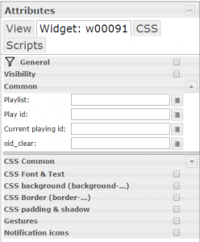
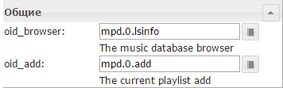

## Description

Widgets are intended for control of different media players via their drivers.

## Information

After installing the widget on the page of editing vis project will appear a group of players widgets.

## [

## Setting

### Winamp player widget

Let's consider setting by the example of MPD player. After installing the widget on the project page, widget settings are as follows: [

 If you plan to use the widget for control of the non-standard player, which doesn't meet the specification admitted to IoBroker for media players, then all values of lines need to be filled separately. If the driver meets the specification that enough to choose one first value, and all the others to substitute automatically, provided that the player driver supports them.

<table style="height: 309px; width: 585px;">

<thead>

<tr>

<td style="width: 187px; text-align: center;">kodi</td>

<td style="width: 188px; text-align: center;">foobar2000</td>

<td style="width: 192px; text-align: center;">mpd</td>

</tr>

</thead>

<tbody>

<tr>

<td style="width: 187px;">[

</td>

<td style="width: 188px;">[

</td>

<td style="width: 192px;">[

</td>

</tr>

</tbody>

</table>

  The values in these fields are substituted based on the roles of objects in the driver. In the table you can see the list of roles and their associated objects.

### Winamp playlist widget

To configure all like the previous case - select the first object, the other is automatically substituted. [

[

  

<table style="height: 156px;" width="593">

<thead>

<tr>

<td style="width: 189px; text-align: center;">kodi</td>

<td style="width: 190px; text-align: center;">foobar2000</td>

<td style="width: 192px; text-align: center;">mpd</td>

</tr>

</thead>

<tbody>

<tr>

<td style="width: 189px; text-align: center;">[

</td>

<td style="width: 190px; text-align: center;">[

</td>

<td style="width: 192px; text-align: center;">[

</td>

</tr>

</tbody>

</table>

### Winamp browser widget

Select the first object, the other is automatically substituted. [

<table style="height: 156px;" width="593">

<thead>

<tr>

<td style="width: 189px; height: 14px; text-align: center;">kodi</td>

<td style="width: 190px; height: 14px; text-align: center;">foobar2000</td>

<td style="width: 192px; height: 14px; text-align: center;">mpd</td>

</tr>

</thead>

<tbody>

<tr style="height: 69px;">

<td style="width: 189px; text-align: center; height: 69px;">[

</td>

<td style="width: 190px; text-align: center; height: 69px;">[

</td>

<td style="width: 192px; text-align: center; height: 69px;">[

</td>

</tr>

</tbody>

</table>

### Sonos widget

In this widget everything is similar, select the first object, the other is automatically substituted. [

   On the added values it is possible to see that URL of a cover Following – isn't supported in the MPD driver (at the time of writing article, perhaps support in the future will appear).

## Using

[

## Table of roles complianc**e**

In the table are displayed the types of roles of the objects used for media players drivers and the corresponding object names in different drivers.

<table dir="ltr" style="width: 100%; height: 1766px;" border="1" cellspacing="0" cellpadding="0">

<thead>

<tr>

<td style="width: 154px; height: 24px; text-align: center;">Role</td>

<td style="width: 105px; height: 24px; text-align: center;">common.type</td>

<td style="width: 366px; height: 24px; text-align: center;">Comment</td>

<td style="width: 136px; height: 24px; text-align: center;">Sonos</td>

<td style="width: 143px; height: 24px; text-align: center;">Foobar</td>

<td style="width: 137px; height: 24px; text-align: center;">Kodi</td>

<td style="width: 142px; height: 24px; text-align: center;">MPD</td>

</tr>

</thead>

<colgroup><col width="225"> <col width="113"> <col width="105"> <col width="138"> <col width="128"> <col width="146"> <col width="144"></colgroup>

<tbody>

<tr style="height: 24px;">

<td style="width: 154px; height: 24px;">button.stop</td>

<td style="width: 105px; height: 24px;">boolean</td>

<td style="width: 366px; height: 24px;">only write</td>

<td style="width: 136px; height: 24px;">stop</td>

<td style="width: 143px; height: 24px;">stop</td>

<td style="width: 137px; height: 24px;">stop</td>

<td style="width: 142px; height: 24px;">stop</td>

</tr>

<tr style="height: 24px;">

<td style="width: 154px; height: 24px;">button.play</td>

<td style="width: 105px; height: 24px;">boolean</td>

<td style="width: 366px; height: 24px;">only write</td>

<td style="width: 136px; height: 24px;">play</td>

<td style="width: 143px; height: 24px;">play</td>

<td style="width: 137px; height: 24px;">play</td>

<td style="width: 142px; height: 24px;">play</td>

</tr>

<tr style="height: 24px;">

<td style="width: 154px; height: 24px;">button.next</td>

<td style="width: 105px; height: 24px;">boolean</td>

<td style="width: 366px; height: 24px;">only write</td>

<td style="width: 136px; height: 24px;">next</td>

<td style="width: 143px; height: 24px;">next</td>

<td style="width: 137px; height: 24px;">next</td>

<td style="width: 142px; height: 24px;">next</td>

</tr>

<tr style="height: 24px;">

<td style="width: 154px; height: 24px;">button.prev</td>

<td style="width: 105px; height: 24px;">boolean</td>

<td style="width: 366px; height: 24px;">only write</td>

<td style="width: 136px; height: 24px;">prev</td>

<td style="width: 143px; height: 24px;">prev</td>

<td style="width: 137px; height: 24px;">previous</td>

<td style="width: 142px; height: 24px;">previous</td>

</tr>

<tr style="height: 24px;">

<td style="width: 154px; height: 24px;">button.pause</td>

<td style="width: 105px; height: 24px;">boolean</td>

<td style="width: 366px; height: 24px;">only write</td>

<td style="width: 136px; height: 24px;">pause</td>

<td style="width: 143px; height: 24px;">pause</td>

<td style="width: 137px; height: 24px;">pause</td>

<td style="width: 142px; height: 24px;">pause</td>

</tr>

<tr style="height: 24px;">

<td style="width: 154px; height: 24px;">button.forward</td>

<td style="width: 105px; height: 24px;">boolean</td>

<td style="width: 366px; height: 24px;">only write</td>

<td style="width: 136px; height: 24px;"></td>

<td style="width: 143px; height: 24px;"></td>

<td style="width: 137px; height: 24px;"></td>

<td style="width: 142px; height: 24px;"></td>

</tr>

<tr style="height: 24px;">

<td style="width: 154px; height: 24px;">button.reverse</td>

<td style="width: 105px; height: 24px;">boolean</td>

<td style="width: 366px; height: 24px;">only write</td>

<td style="width: 136px; height: 24px;"></td>

<td style="width: 143px; height: 24px;"></td>

<td style="width: 137px; height: 24px;"></td>

<td style="width: 142px; height: 24px;"></td>

</tr>

<tr style="height: 24px;">

<td style="width: 154px; height: 24px;">button.fastforward</td>

<td style="width: 105px; height: 24px;">boolean</td>

<td style="width: 366px; height: 24px;">only write</td>

<td style="width: 136px; height: 24px;"></td>

<td style="width: 143px; height: 24px;"></td>

<td style="width: 137px; height: 24px;"></td>

<td style="width: 142px; height: 24px;"></td>

</tr>

<tr style="height: 24px;">

<td style="width: 154px; height: 24px;">button.fastreverse</td>

<td style="width: 105px; height: 24px;">boolean</td>

<td style="width: 366px; height: 24px;">only write</td>

<td style="width: 136px; height: 24px;"></td>

<td style="width: 143px; height: 24px;"></td>

<td style="width: 137px; height: 24px;"></td>

<td style="width: 142px; height: 24px;"></td>

</tr>

<tr style="height: 24px;">

<td style="width: 154px; height: 24px;">level.volume</td>

<td style="width: 105px; height: 24px;">number</td>

<td style="width: 366px; height: 24px;">[0-100]</td>

<td style="width: 136px; height: 24px;">volume</td>

<td style="width: 143px; height: 24px;">volume</td>

<td style="width: 137px; height: 24px;">volume</td>

<td style="width: 142px; height: 24px;">volume</td>

</tr>

<tr style="height: 24px;">

<td style="width: 154px; height: 24px;">media.seek</td>

<td style="width: 105px; height: 24px;">number</td>

<td style="width: 366px; height: 24px;">%</td>

<td style="width: 136px; height: 24px;">seek</td>

<td style="width: 143px; height: 24px;">seek</td>

<td style="width: 137px; height: 24px;">seek</td>

<td style="width: 142px; height: 24px;">seek</td>

</tr>

<tr style="height: 24px;">

<td style="width: 154px; height: 24px;">media.mode.shuffle</td>

<td style="width: 105px; height: 24px;">boolean</td>

<td style="width: 366px; height: 24px;">read/write</td>

<td style="width: 136px; height: 24px;"></td>

<td style="width: 143px; height: 24px;">shuffle</td>

<td style="width: 137px; height: 24px;">shuffle</td>

<td style="width: 142px; height: 24px;">random</td>

</tr>

<tr style="height: 24px;">

<td style="width: 154px; height: 24px;">media.mode.repeat</td>

<td style="width: 105px; height: 24px;">boolean</td>

<td style="width: 366px; height: 24px;">read/write</td>

<td style="width: 136px; height: 24px;"></td>

<td style="width: 143px; height: 24px;">repeat</td>

<td style="width: 137px; height: 24px;">repeat</td>

<td style="width: 142px; height: 24px;">repeat</td>

</tr>

<tr style="height: 48px;">

<td style="width: 154px; height: 48px;">media.state</td>

<td style="width: 105px; height: 48px;">string / boolean</td>

<td style="width: 366px; height: 48px;">[play,stop,pause] or [true/false]</td>

<td style="width: 136px; height: 48px;">state</td>

<td style="width: 143px; height: 48px;">state</td>

<td style="width: 137px; height: 48px;">state</td>

<td style="width: 142px; height: 48px;">state</td>

</tr>

<tr style="height: 24px;">

<td style="width: 154px; height: 24px;">media.artist</td>

<td style="width: 105px; height: 24px;">string</td>

<td style="width: 366px; height: 24px;"></td>

<td style="width: 136px; height: 24px;">current_artist</td>

<td style="width: 143px; height: 24px;">artist</td>

<td style="width: 137px; height: 24px;">info.artist</td>

<td style="width: 142px; height: 24px;">artist</td>

</tr>

<tr style="height: 24px;">

<td style="width: 154px; height: 24px;">media.album</td>

<td style="width: 105px; height: 24px;">string</td>

<td style="width: 366px; height: 24px;"></td>

<td style="width: 136px; height: 24px;">current_album</td>

<td style="width: 143px; height: 24px;">album</td>

<td style="width: 137px; height: 24px;">info.album</td>

<td style="width: 142px; height: 24px;">album</td>

</tr>

<tr style="height: 24px;">

<td style="width: 154px; height: 24px;">media.title</td>

<td style="width: 105px; height: 24px;"></td>

<td style="width: 366px; height: 24px;"></td>

<td style="width: 136px; height: 24px;">current_title</td>

<td style="width: 143px; height: 24px;">title</td>

<td style="width: 137px; height: 24px;">info.title</td>

<td style="width: 142px; height: 24px;">title</td>

</tr>

<tr style="height: 48px;">

<td style="width: 154px; height: 48px;">media.title.next</td>

<td style="width: 105px; height: 48px;">string (optional)</td>

<td style="width: 366px; height: 48px;"></td>

<td style="width: 136px; height: 48px;"></td>

<td style="width: 143px; height: 48px;"></td>

<td style="width: 137px; height: 48px;"></td>

<td style="width: 142px; height: 48px;"></td>

</tr>

<tr style="height: 24px;">

<td style="width: 154px; height: 24px;">media.cover</td>

<td style="width: 105px; height: 24px;">string  (URL)</td>

<td style="width: 366px; height: 24px;"></td>

<td style="width: 136px; height: 24px;">current_cover</td>

<td style="width: 143px; height: 24px;">albumArt</td>

<td style="width: 137px; height: 24px;">info.thumbnail</td>

<td style="width: 142px; height: 24px;"></td>

</tr>

<tr style="height: 48px;">

<td style="width: 154px; height: 48px;">media.duration.text</td>

<td style="width: 105px; height: 48px;">string (optional)</td>

<td style="width: 366px; height: 48px;">e.g "2:35"</td>

<td style="width: 136px; height: 48px;">current_duration</td>

<td style="width: 143px; height: 48px;">current_duration</td>

<td style="width: 137px; height: 48px;">playing_time_total</td>

<td style="width: 142px; height: 48px;">current_duration</td>

</tr>

<tr style="height: 24px;">

<td style="width: 154px; height: 24px;">media.duration</td>

<td style="width: 105px; height: 24px;">number</td>

<td style="width: 366px; height: 24px;">seconds</td>

<td style="width: 136px; height: 24px;">current_duration_s</td>

<td style="width: 143px; height: 24px;">trackLength</td>

<td style="width: 137px; height: 24px;"></td>

<td style="width: 142px; height: 24px;">current_duration_s</td>

</tr>

<tr style="height: 48px;">

<td style="width: 154px; height: 48px;">media.elapsed.text</td>

<td style="width: 105px; height: 48px;">string (optional)</td>

<td style="width: 366px; height: 48px;">e.g "1:30"</td>

<td style="width: 136px; height: 48px;">current_elapsed</td>

<td style="width: 143px; height: 48px;">current_elapsed</td>

<td style="width: 137px; height: 48px;">playing_time</td>

<td style="width: 142px; height: 48px;">current_elapsed</td>

</tr>

<tr style="height: 24px;">

<td style="width: 154px; height: 24px;">media.elapsed</td>

<td style="width: 105px; height: 24px;">number</td>

<td style="width: 366px; height: 24px;">seconds</td>

<td style="width: 136px; height: 24px;">current_elapsed_s</td>

<td style="width: 143px; height: 24px;">elapsedTime</td>

<td style="width: 137px; height: 24px;"></td>

<td style="width: 142px; height: 24px;">elapsed</td>

</tr>

<tr style="height: 24px;">

<td style="width: 154px; height: 24px;">media.mute</td>

<td style="width: 105px; height: 24px;">boolean</td>

<td style="width: 366px; height: 24px;">read/write</td>

<td style="width: 136px; height: 24px;">muted</td>

<td style="width: 143px; height: 24px;">mute</td>

<td style="width: 137px; height: 24px;">mute</td>

<td style="width: 142px; height: 24px;">mute</td>

</tr>

<tr style="height: 48px;">

<td style="width: 154px; height: 48px;">media.tts</td>

<td style="width: 105px; height: 48px;">string (optional)</td>

<td style="width: 366px; height: 48px;">Text 2 speech</td>

<td style="width: 136px; height: 48px;">tts</td>

<td style="width: 143px; height: 48px;"></td>

<td style="width: 137px; height: 48px;"></td>

<td style="width: 142px; height: 48px;">say</td>

</tr>

<tr style="height: 24px;">

<td style="width: 154px; height: 24px;">media.bitrate</td>

<td style="width: 105px; height: 24px;">number</td>

<td style="width: 366px; height: 24px;">kbps</td>

<td style="width: 136px; height: 24px;"></td>

<td style="width: 143px; height: 24px;">bitrate</td>

<td style="width: 137px; height: 24px;">bitrate</td>

<td style="width: 142px; height: 24px;">bitrate</td>

</tr>

<tr style="height: 24px;">

<td style="width: 154px; height: 24px;">media.genre</td>

<td style="width: 105px; height: 24px;">string</td>

<td style="width: 366px; height: 24px;">genre song</td>

<td style="width: 136px; height: 24px;"></td>

<td style="width: 143px; height: 24px;"></td>

<td style="width: 137px; height: 24px;">info.genre</td>

<td style="width: 142px; height: 24px;">genre</td>

</tr>

<tr style="height: 24px;">

<td style="width: 154px; height: 24px;">media.date</td>

<td style="width: 105px; height: 24px;">string</td>

<td style="width: 366px; height: 24px;">year song</td>

<td style="width: 136px; height: 24px;"></td>

<td style="width: 143px; height: 24px;"></td>

<td style="width: 137px; height: 24px;"></td>

<td style="width: 142px; height: 24px;">date</td>

</tr>

<tr style="height: 24px;">

<td style="width: 154px; height: 24px;">media.track</td>

<td style="width: 105px; height: 24px;">number</td>

<td style="width: 366px; height: 24px;">current play track id [0 - ~]</td>

<td style="width: 136px; height: 24px;"></td>

<td style="width: 143px; height: 24px;">itemplaying</td>

<td style="width: 137px; height: 24px;">position</td>

<td style="width: 142px; height: 24px;">pos</td>

</tr>

<tr style="height: 24px;">

<td style="width: 154px; height: 24px;">media.playid</td>

<td style="width: 105px; height: 24px;">number</td>

<td style="width: 366px; height: 24px;">play track id</td>

<td style="width: 136px; height: 24px;"></td>

<td style="width: 143px; height: 24px;">playid</td>

<td style="width: 137px; height: 24px;">playid</td>

<td style="width: 142px; height: 24px;">playid</td>

</tr>

<tr style="height: 24px;">

<td style="width: 154px; height: 24px;">media.add</td>

<td style="width: 105px; height: 24px;">string (path)</td>

<td style="width: 366px; height: 24px;">add current playlist</td>

<td style="width: 136px; height: 24px;"></td>

<td style="width: 143px; height: 24px;">add</td>

<td style="width: 137px; height: 24px;">add</td>

<td style="width: 142px; height: 24px;">add</td>

</tr>

<tr style="height: 24px;">

<td style="width: 154px; height: 24px;">media.clear</td>

<td style="width: 105px; height: 24px;">boolean</td>

<td style="width: 366px; height: 24px;">clear current playlist</td>

<td style="width: 136px; height: 24px;"></td>

<td style="width: 143px; height: 24px;">clear</td>

<td style="width: 137px; height: 24px;">clear</td>

<td style="width: 142px; height: 24px;">clear</td>

</tr>

<tr style="height: 288px;">

<td style="width: 154px; height: 288px;">media.playlist</td>

<td style="width: 105px; height: 288px;">string</td>

<td style="width: 366px; height: 288px;">[ { "artist": "", "album": "", "bitrate":0, "title": "", "file": "", "genre": "", "year": 0, "len": "00:00", "rating": "", "cover": "" }]</td>

<td style="width: 136px; height: 288px;"></td>

<td style="width: 143px; height: 288px;">playlist</td>

<td style="width: 137px; height: 288px;">playlist</td>

<td style="width: 142px; height: 288px;">playlist_list</td>

</tr>

<tr style="height: 504px;">

<td style="width: 154px; height: 504px;">media.browser</td>

<td style="width: 105px; height: 504px;">string</td>

<td style="width: 366px; height: 504px;">"files": [ { "fanart": "", "file": "path", "filetype": "directory or file", "label": "", "lastmodified": "", "mimetype": "", "size": 0, "thumbnail": "", "title": "", "type": "", "lastmodified": "2016-02-27 16:05:46", "time": "time in sec", "track": "number", "date": "year", "artist": "artist", "album": "album", "genre": "genre" } ]</td>

<td style="width: 136px; height: 504px;"></td>

<td style="width: 143px; height: 504px;">browser</td>

<td style="width: 137px; height: 504px;">Directory</td>

<td style="width: 142px; height: 504px;">lsinfo</td>

</tr>

</tbody>

</table>